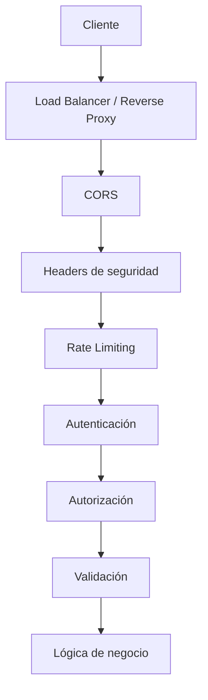
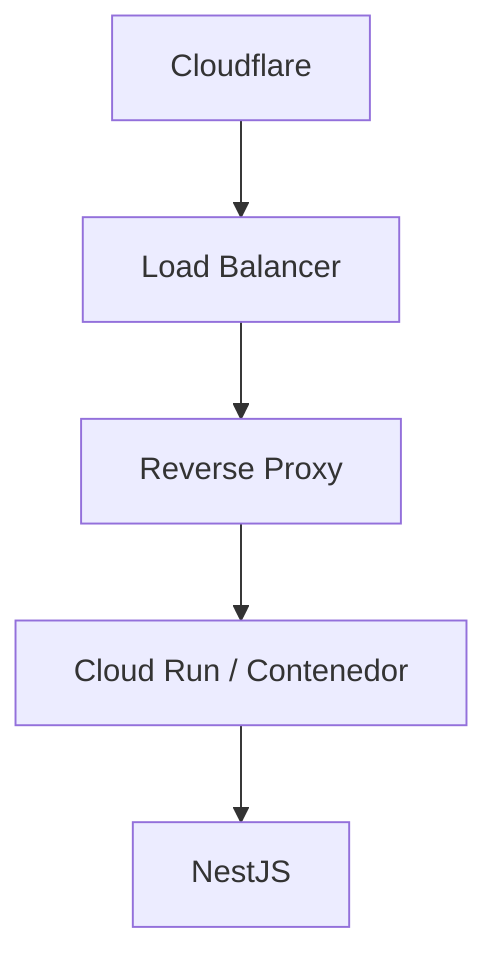
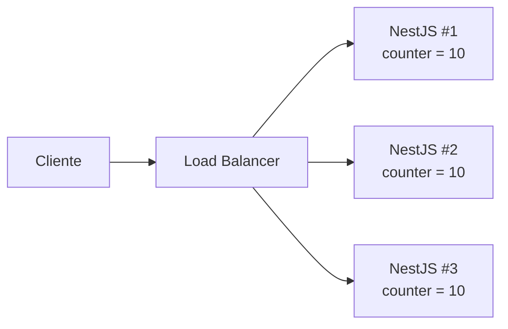

La SPA vive en `https://app.example.com`. La API NestJS vive en `https://api.example.com`. En localhost ambas estaban en `:3000`, así que nadie lo notó. En staging el navegador bloquea `POST /auth/login`. Alguien pone `origin: true`. Login funciona. Una semana después la misma ruta está siendo golpeada unos cientos de veces por minuto desde un script que nunca abre un navegador. Helmet está instalado. Tres instancias de Cloud Run creen cada una que el cliente sigue por debajo del límite.

Eso no es un middleware que falta. Son tres trabajos distintos tratados como una casilla única.

CORS decide qué puede leer un **navegador** desde otro origen. Rate limiting decide con qué frecuencia **cualquiera** puede llamarte antes de que rechaces. Los headers de seguridad le dicen al **navegador** cómo tratar la respuesta. Ninguno de esos pasos pregunta quién es el llamante, qué tiene permiso de hacer, o si el body es válido.

> CORS, rate limiting y Helmet son capas. No sustituyen a la autenticación, la autorización ni la validación de entrada. Una API que solo configura las tres sigue siendo un servicio abierto con headers extra.

## El problema de proteger una API NestJS

Una API HTTP pública recibirá tráfico para el cual no fue diseñada. Parte viene de un navegador en tu propio frontend. Parte viene de una app móvil. Parte viene de otro servicio. Parte viene de un script.

El patrón típico de presión tiene esta forma:

- peticiones desde orígenes que no controlas.
- ráfagas contra `/auth/login` y `/auth/password-reset`.
- scraping de endpoints de listado.
- credential stuffing.
- clientes que ignoran CORS por completo (`curl`, Postman, una VPS).
- tráfico que llega a través de un CDN, por lo que cada petición parece compartir una sola IP a menos que leas los headers de reenvío con cuidado.
- réplicas que mantienen cada una su propio contador en memoria.

La respuesta útil no es «instala tres paquetes». Es apilar controles que fallen de forma cerrada, y saber qué es lo que cada control **no** hace.



Esa pila es conceptual. Un CDN o WAF puede limitar la tasa antes de que NestJS vea la petición. Helmet es middleware; `@nestjs/throttler` es un guard; CORS es middleware de adaptador (`cors` en Express, `@fastify/cors` en Fastify). El orden exacto depende del adaptador HTTP y de lo que esté delante del proceso. El punto es que los trabajos son distintos. Cambiar las cajas de lugar no hace que una caja cubra a otra.

## CORS

Los navegadores aplican la [Same-Origin Policy](https://developer.mozilla.org/en-US/docs/Web/Security/Same-origin_policy). Un origen es la tupla esquema + host + puerto, según se define en [RFC 6454](https://www.rfc-editor.org/rfc/rfc6454). `https://app.example.com` y `https://api.example.com` son orígenes distintos. También lo son `http://localhost:3000` y `http://localhost:3001`.

Same-Origin Policy es la **restricción** por defecto. Un script en el origen A no debe leer la respuesta de una petición al origen B a menos que B consienta. [CORS](https://developer.mozilla.org/en-US/docs/Web/HTTP/Guides/CORS) es ese consentimiento. Es un conjunto de headers HTTP que le dicen al navegador «puedes exponer esta respuesta a ese origen». El protocolo actual vive en el [Fetch Standard](https://fetch.spec.whatwg.org/#http-cors-protocol). NestJS no lo inventa. Delega a [`cors`](https://github.com/expressjs/cors) o a [`@fastify/cors`](https://github.com/fastify/fastify-cors).

CORS resuelve un problema de navegador: tu SPA first-party en otro host necesita llamar a la API. No resuelve un problema de API: cualquiera con un cliente TCP puede seguir enviando la misma petición HTTP.

### Peticiones simples y preflight

Una petición «simple» es una petición cross-origin que el navegador considera lo bastante segura para enviarla sin preguntar antes — históricamente `GET`, `HEAD` o `POST` con un pequeño conjunto de headers y content types. La petición sale. El navegador mira `Access-Control-Allow-Origin` en la respuesta y decide si JavaScript puede leer el body.

Cualquier cosa fuera de ese conjunto dispara un **preflight**: una petición `OPTIONS` antes de la real. El preflight ocurre cuando usas métodos como `PUT`, `PATCH` o `DELETE`, o headers que el navegador no trata como seguros para CORS — `Authorization` y `Content-Type: application/json` son las razones habituales por las que una API JSON de NestJS hace preflight.

El preflight pregunta:

```text
Access-Control-Request-Method: POST
Access-Control-Request-Headers: content-type, authorization
```

La API responde con lo que permitirá:

| Header                             | Significado                                                    |
| ---------------------------------- | -------------------------------------------------------------- |
| `Access-Control-Allow-Origin`      | Qué origen puede leer la respuesta                             |
| `Access-Control-Allow-Methods`     | Qué métodos puede usar la petición real                        |
| `Access-Control-Allow-Headers`     | Qué headers de petición puede enviar la petición real          |
| `Access-Control-Allow-Credentials` | Si puede usarse una petición con credenciales (cookies, certs) |
| `Access-Control-Max-Age`           | Cuánto puede cachear el navegador este preflight               |

Si el preflight falla, el `POST` real nunca sale del navegador. `curl` nunca envía un preflight. Esa diferencia es todo el modelo de seguridad.

### Las credenciales cambian las reglas

Una petición con credenciales es una petición que incluye cookies, certificados de cliente, o un header `Authorization` en un `fetch` con `credentials: "include"`. El Fetch Standard prohíbe esta combinación:

```text
Access-Control-Allow-Origin: *
Access-Control-Allow-Credentials: true
```

El navegador no expondrá la respuesta. Express `cors` no emitirá ese par. Si necesitas cookies en una llamada cross-origin, `Access-Control-Allow-Origin` debe ser un origen **específico**, no `*`.

`origin: true` en `cors` refleja cualquier `Origin` que envíe el cliente. Combinado con `credentials: true`, eso es peor que `*`: cualquier sitio web puede hacer una llamada con credenciales y leer la respuesta. Evítalo en una API pública a menos que todos los llamantes sean de confianza — lo cual casi nunca es la situación que necesita CORS.

Si el cliente es una app móvil o un servidor, no usa la Same-Origin Policy. Quita `credentials` a menos que realmente establezcas cookies. Prefiere un bearer token en `Authorization` y mantén la allowlist ajustada para los clientes de navegador que lo necesiten.

### API pública versus API first-party

Una API pública, de solo lectura, sin cookies y sin credenciales de navegador ambiente puede usar `Access-Control-Allow-Origin: *`. Eso es una decisión de producto: cualquier origen puede leer el JSON en un navegador. El [REST Security Cheat Sheet](https://cheatsheetseries.owasp.org/cheatsheets/REST_Security_Cheat_Sheet.html) de OWASP aun así dice: sé lo más específico posible, y deshabilita los headers CORS si no esperas llamadas cross-origin desde navegadores.

Una API first-party consumida por `https://app.example.com` y `https://admin.example.com` debería permitir esos orígenes y nada más. No trates «quizá añadamos un partner más adelante» como razón para reflejar cualquier `Origin`.

### CORS no es autenticación

Una respuesta CORS rechazada significa que el **navegador** se negó a entregar el body a JavaScript. La petición puede haber llegado ya a tu controlador. Un atacante no necesita un navegador:

```bash
curl -X POST https://api.example.com/auth/login \
  -H "Content-Type: application/json" \
  -d '{"email":"ada@example.com","password":"..."}'
```

Sin `Origin`. Sin preflight. CORS nunca se ejecuta. Si `/auth/login` solo está «protegido» por una allowlist, no está protegido.

### Configuración recomendada en NestJS

Nest documenta dos puntos de entrada equivalentes: `app.enableCors(options)` o `NestFactory.create(AppModule, { cors: options })`. `cors: true` habilita los defaults del paquete — cualquier origen. Eso es una conveniencia de desarrollo, no una política de producción.

```ts
app.enableCors({
  origin: ["https://app.example.com", "https://admin.example.com"],
  methods: ["GET", "POST", "PUT", "PATCH", "DELETE"],
  allowedHeaders: ["Content-Type", "Authorization"],
  credentials: true,
});
```

Esos valores son un ejemplo. Deben coincidir con los frontends reales, los métodos que realmente expones, y si usas cookies.

Falla de forma cerrada desde el entorno. Una lista vacía es más segura que un wildcard que olvidaste reemplazar:

```ts
const allowlist = (process.env.CORS_ORIGINS ?? "")
  .split(",")
  .map((value) => value.trim())
  .filter(Boolean);

app.enableCors({
  origin: (origin: string | undefined, callback: (err: Error | null, allow?: boolean) => void) => {
    if (!origin) {
      callback(null, true);
      return;
    }
    if (allowlist.includes(origin)) {
      callback(null, true);
      return;
    }
    callback(null, false);
  },
  methods: ["GET", "POST", "PUT", "PATCH", "DELETE"],
  allowedHeaders: ["Content-Type", "Authorization"],
  credentials: process.env.CORS_CREDENTIALS === "true",
});
```

Las peticiones sin `Origin` no son comprobaciones CORS de navegador — `curl`, servidor a servidor, algunas llamadas same-origin. Permitirlas no debilita CORS. Rechazar orígenes desconocidos sí. Si `CORS_ORIGINS` está vacío, toda llamada cross-origin de navegador falla. Ese es el punto.

En desarrollo, pon `http://localhost:5173` (o lo que use la SPA) en `CORS_ORIGINS`. No metas un caso especial `NODE_ENV === "development"` convertido en `origin: true` a menos que disfrutes del incidente de staging mencionado arriba.

## Rate limiting

Rate limiting no es «60 peticiones por minuto». Es un tope sobre cuánto trabajo un **tracker** — normalmente una IP, a veces un user id — puede pedir a una ruta en una ventana. Reduce:

- credential stuffing y password spraying en `/login`.
- abuso de endpoints costosos o que cambian estado.
- scraping ingenuo.
- martilleo automatizado.
- algo de denegación de servicio a nivel de aplicación (CPU, DB, cuotas upstream).

No detiene una botnet distribuida que tiene más IPs que tu límite. No arregla una comprobación de autorización que falta. No sustituye a un WAF ni a una cuota en el load balancer. OWASP lista el consumo de recursos sin restricción como [API4:2023](https://owasp.org/API-Security/editions/2023/en/0x11-t10/). Throttling es un control para esa clase. No es el único.

`@nestjs/throttler` rastrea hits en storage y rechaza la siguiente petición con `429 Too Many Requests` cuando el tracker supera `limit` dentro de `ttl`. Desde la v5, `ttl` está en **milisegundos**. El paquete exporta `seconds`, `minutes`, `hours`, `days` y `weeks` si prefieres no escribir `60_000` a mano.

| Opción          | Función                                                          |
| --------------- | ---------------------------------------------------------------- |
| `limit`         | Cuántas peticiones puede hacer el tracker en la ventana          |
| `ttl`           | Duración de la ventana, en milisegundos                          |
| `blockDuration` | Cuánto seguir rechazando tras superar el límite, en milisegundos |
| `tracker`       | La clave contra la que cuentas — por defecto `req.ip`            |

`blockDuration` es opcional. Sin él, la ventana misma es el backoff. Con él, un cliente que supere el límite permanecerá bloqueado durante un intervalo independiente. Úsalo en login y password reset, no en un catálogo público, a menos que hayas medido el coste de falsos positivos.

### Configuración global

Instalar el módulo no es suficiente. **Nada se limita hasta que corre un `ThrottlerGuard`.** La propia documentación de Nest lo vincula con `APP_GUARD`.

```ts
import { Module } from "@nestjs/common";
import { APP_GUARD } from "@nestjs/core";
import { minutes, ThrottlerGuard, ThrottlerModule } from "@nestjs/throttler";

@Module({
  imports: [
    ThrottlerModule.forRoot({
      throttlers: [{ name: "default", ttl: minutes(1), limit: 60 }],
      errorMessage: "Too many requests",
    }),
  ],
  providers: [
    {
      provide: APP_GUARD,
      useClass: ThrottlerGuard,
    },
  ],
})
export class AppModule {}
```

`forRoot` también acepta un array plano de objetos throttler. `{ throttlers: [...] }` es la forma que necesitas en cuanto configures `storage`, `getTracker` o `errorMessage`. Mantén el body del `429` estable. No interpoles errores de Redis ni contadores internos en la respuesta.

Esos números son un punto de partida para una API JSON, no una política universal. Un export de reportes y un formulario de login no merecen el mismo presupuesto.

### Configuración por ruta

Varios throttlers con nombre en `forRoot` **todos aplican** a cada ruta con guard. Eso es útil para ventanas de ráfaga + sostenida (`short` / `long`). Es la forma incorrecta de decir «login es más estricto»: un throttler `auth` en el array global restringiría `/products` también, a menos que lo saltes en todos lados.

Prefiere un default, y después sobrescribe las rutas que vale la pena atacar:

```ts
import { Controller, Post } from "@nestjs/common";
import { minutes, SkipThrottle, Throttle } from "@nestjs/throttler";

@Controller("auth")
export class AuthController {
  @Throttle({ default: { limit: 5, ttl: minutes(1) } })
  @Post("login")
  login() {
    /* ... */
  }

  @Throttle({ default: { limit: 3, ttl: minutes(1) } })
  @Post("password-reset")
  passwordReset() {
    /* ... */
  }
}

@Controller("health")
@SkipThrottle({ default: true })
export class HealthController {
  /* las sondas no deben competir con el tráfico de usuarios */
}
```

`@SkipThrottle()` sin objeto salta el set sin nombre/`default`. Si nombras throttlers `short` y `long`, debes pasar esas claves o el skip no hace nada. El [README de throttler](https://github.com/nestjs/throttler) es explícito al respecto.

Aprieta las rutas que crean sesiones, envían email, o cobran una tarjeta. Relaja las rutas de catálogo mayormente de lectura. Salta las sondas de liveness para que Kubernetes no se haga 429 a sí mismo. Los presupuestos de ejemplo están en la tabla ruta por ruta más abajo — ejemplos, no defaults para copiar en toda app.

`getTracker` es cómo el guard decide **quién** está siendo limitado. El default es la IP del socket. Tras la autenticación puedes particionar por user id para abuso de usuarios logueados y caer de vuelta a IP para tráfico anónimo. Hazlo en una subclase, y no pongas emails ni tokens en el string del tracker — acabarán en storage y en logs.

## Rate limiting tras proxies

En producción el proceso NestJS casi nunca ve el socket del cliente.



Cada petición llega desde el último salto. Sin ayuda, `req.ip` es el proxy. Un bucket de límite es compartido por todo internet, o por nadie útil. La ayuda habitual es `X-Forwarded-For`: una lista separada por comas de direcciones, el cliente primero si cada salto es honesto.

Los clientes también pueden enviar `X-Forwarded-For`. Si confías en el header incondicionalmente, un atacante pone `X-Forwarded-For: 203.0.113.1` y obtiene un bucket fresco en cada petición. Rate limiting se convierte en decorativo.

Express documenta esto como [`trust proxy`](https://expressjs.com/en/guide/behind-proxies.html). El equivalente de Fastify es [`trustProxy`](https://fastify.dev/docs/latest/Reference/Server/#trustproxy). El valor es el número de saltos que **tú** operas, o un rango nombrado como `loopback`, no un booleano que activas porque lo hizo un post de blog.

```ts
import { NestFactory } from "@nestjs/core";
import type { NestExpressApplication } from "@nestjs/platform-express";
import { AppModule } from "./app.module";

async function bootstrap() {
  const app = await NestFactory.create<NestExpressApplication>(AppModule);

  const hops = Number(process.env.TRUST_PROXY_HOPS ?? "");
  if (Number.isInteger(hops) && hops > 0) {
    app.set("trust proxy", hops);
  }

  await app.listen(process.env.PORT ?? 3000);
}
```

`trust proxy: true` significa «confía en toda dirección del header». Así es como gana el spoofing. `trust proxy: 1` significa «el último salto es nuestro; toma la dirección a su izquierda». Dos proxies delante del contenedor necesitan `2`. Cloudflare más un load balancer de Google más un sidecar no es automáticamente `1`. Cuenta los saltos en **tu** camino, en staging, logueando `req.ip` y `req.ips` en una petición que controles.

Los docs del throttler de Nest muestran `app.set("trust proxy", "loopback")` para un proxy en el mismo host. Eso es correcto para esa topología. Es incorrecto para Cloud Run detrás de Cloudflare.

En Express, un `trust proxy` correcto normalmente es suficiente: `req.ip` se convierte en el cliente y el tracker default funciona. En Fastify, lee `req.ips`. Nest documenta un guard que funciona para ambos:

```ts
import { Injectable } from "@nestjs/common";
import { ThrottlerGuard } from "@nestjs/throttler";

@Injectable()
export class ThrottlerBehindProxyGuard extends ThrottlerGuard {
  protected async getTracker(req: Record<string, any>): Promise<string> {
    return req.ips.length ? req.ips[0] : req.ip;
  }
}
```

`req.ips[0]` es la dirección más a la izquierda — la que el cliente puede establecer si confiaste en demasiados saltos. Enlaza este guard solo después de que `trust proxy` / `trustProxy` coincida con la infraestructura. No parsees `X-Forwarded-For` tú mismo «para estar seguro» y después tomes el primer valor. Ese es el spoof.

## Rate limiting distribuido

El storage en memoria es local al proceso. Eso está bien para una instancia.



Un límite de 10 se convierte en 30. El autoescalado convierte el límite real en una función del número de réplicas. Los deploys con rolling restart reinician los contadores. Esto no es un pitch de ventas de Redis. Es aritmética.

`@nestjs/throttler` acepta cualquier `storage` que implemente `ThrottlerStorage`. Los docs oficiales apuntan a un [proveedor de Redis de la comunidad](https://docs.nestjs.com/security/rate-limiting) cuando necesitas una sola fuente de verdad. El paquete listado en el README de throttler para `ioredis` es [`@nest-lab/throttler-storage-redis`](https://github.com/jmcdo29/nest-lab/tree/main/packages/throttler-storage-redis).

```ts
import { ThrottlerStorageRedisService } from "@nest-lab/throttler-storage-redis";
import { minutes, ThrottlerModule } from "@nestjs/throttler";

ThrottlerModule.forRoot({
  throttlers: [{ name: "default", ttl: minutes(1), limit: 60 }],
  storage: new ThrottlerStorageRedisService(process.env.REDIS_URL),
});
```

Usa un store compartido cuando corras más de una réplica, un modelo de concurrencia serverless que solapa instancias, o una plataforma que recicla procesos más rápido que `ttl`. Quédate en memoria para un único proceso de larga vida si aceptas que un reinicio olvida la ventana. No pongas Redis en el camino crítico y después devuelvas sus errores de conexión al cliente.

Un CDN o API gateway puede aplicar un límite grueso antes de que la petición llegue a Nest. Eso es complementario. No sabe tu separación `/auth/login` versus `/products` a menos que lo configures allí también.

## Headers de seguridad

Los headers de seguridad son instrucciones para un **navegador**. No autentican al llamante. No corren en `curl`. OWASP es directo sobre esto: si la API solo es consumida por clientes no-navegador, la mayoría de estos headers no hacen nada. Aún así vale la pena enviarlos en cualquier respuesta que un navegador pueda manejar — incluyendo una página de error, un body JSON volcado y renderizado como HTML por un navegador confundido, o Swagger UI en el mismo host.

| Header                      | Problema que aborda                                       | Notas para una API JSON                                                                                      |
| --------------------------- | --------------------------------------------------------- | ------------------------------------------------------------------------------------------------------------ |
| `Content-Security-Policy`   | Qué puede cargar el documento y quién lo enmarca          | `default-src 'none'` y `frame-ancestors 'none'` son la baseline REST de OWASP. Un CSP completo es para HTML. |
| `X-Content-Type-Options`    | MIME sniffing (`nosniff`)                                 | Útil incluso cuando todo body es `application/json`.                                                         |
| `Referrer-Policy`           | Qué ponen otras peticiones en `Referer`                   | Bajo impacto en JSON; Helmet usa `no-referrer` por defecto.                                                  |
| `Strict-Transport-Security` | Los navegadores deben usar HTTPS en este host             | Solo después de que el host sea HTTPS en todas partes, incluyendo subdominios que hayas listado.             |
| `X-Frame-Options`           | Clickjacking vía `<frame>` / `<iframe>`                   | Legacy. Prefiere CSP `frame-ancestors`. OWASP aún quiere `DENY` en APIs.                                     |
| `Permissions-Policy`        | Qué características del navegador puede usar el documento | Helmet no lo establece hoy. Añádelo cuando sirvas HTML.                                                      |

El sheet REST de OWASP también quiere `Cache-Control: no-store` en respuestas que no deben quedarse en un caché compartido o privado, y un `Content-Type` correcto. Helmet no establece `Cache-Control`. Eso es tu interceptor o una política de gateway, no un default de Helmet.

No habilites `X-XSS-Protection`. El filtro era defectuoso. Helmet establece `X-XSS-Protection: 0` a propósito.

Una política demasiado estricta romperá la app que realmente desplegaste. Un CSP que prohíbe scripts inline dejará Swagger UI en blanco. `frame-ancestors 'none'` romperá un iframe de admin que olvidaste. `upgrade-insecure-requests` empujará a Safari de `http://localhost` a `https://localhost`. Configura los headers para lo que estás sirviendo: una API JSON, una app SSR, una landing page de GraphQL, o una UI que incrusta frames de terceros. No hay una sola lista correcta para las cuatro.

## Helmet en NestJS

[Helmet](https://helmetjs.github.io/) es una colección de pequeñas funciones middleware que establecen esos headers. El [capítulo de Helmet](https://docs.nestjs.com/security/helmet) de Nest son tres datos: instala `helmet`, llama `app.use(helmet())` **antes** de otros `app.use()` / rutas, y espera colisiones de CSP con Apollo Sandbox y GraphQL Playground.

```ts
import helmet from "helmet";

app.use(helmet());
```

En Fastify, registra `@fastify/helmet` como plugin (`app.register`), no como middleware al estilo Express.

`helmet()` no es «suficiente». Los defaults actuales incluyen `Cross-Origin-Resource-Policy: same-origin`. Ese header puede bloquear a un navegador en `https://app.example.com` de leer `https://api.example.com` **incluso cuando CORS está correcto**. Una SPA first-party en otro host necesita `cross-origin` (o un CORP deshabilitado) en la API. Frontends same-site pueden usar `same-site`.

El CSP default de Helmet está construido para una app HTML que carga sus propios scripts. En una API JSON no se usa mayormente. En Swagger UI o Apollo Sandbox es activamente hostil. Nest documenta un CSP más relajado para Apollo, y `contentSecurityPolicy: false` cuando no vas a mantener uno. Deshabilitar CSP en todo el proceso porque `/api` es JSON y `/docs` es Swagger es el atajo habitual. El mejor split es: `frame-ancestors` estricto en respuestas de API, un CSP elaborado solo en el HTML que realmente sirves.

HSTS (`max-age=31536000; includeSubDomains`) también es un default de Helmet. Envíalo en producción una vez que HTTPS esté garantizado. Déjalo desactivado en HTTP local. Los propios docs de Helmet advierten que HSTS más `upgrade-insecure-requests` pelearán contigo en `localhost`.

Una llamada con forma de producción para una API JSON consumida por una SPA first-party:

```ts
const isProduction = process.env.NODE_ENV === "production";

app.use(
  helmet({
    contentSecurityPolicy: {
      directives: {
        defaultSrc: ["'none'"],
        frameAncestors: ["'none'"],
        upgradeInsecureRequests: isProduction ? [] : null,
      },
    },
    crossOriginResourcePolicy: { policy: "cross-origin" },
    xFrameOptions: { action: "deny" },
    strictTransportSecurity: isProduction ? { maxAge: 31536000, includeSubDomains: true } : false,
  }),
);
```

Si montas Swagger UI en la misma app, este CSP lo romperá. Relaja `scriptSrc` / `styleSrc` / `imgSrc` para esa ruta, o deshabilita CSP solo ahí. No copies la allowlist del CDN de Apollo a una API REST que no incrusta Apollo.

`Permissions-Policy` no es una opción de Helmet en la versión actual. Establécelo tú mismo en respuestas HTML si necesitas deshabilitar cámara, geolocalización o APIs de pago. Un body JSON no usa esas APIs.

## Una API segura no depende solo de headers

Esta es la parte que los tres paquetes npm no pueden decir por ti. El stack del principio del artículo es el mapa; la tabla es el reparto de trabajos.

| Mecanismo            | Problema que resuelve                    | Riesgos que reduce                                                     | Lo que no detiene                                          |
| -------------------- | ---------------------------------------- | ---------------------------------------------------------------------- | ---------------------------------------------------------- |
| CORS                 | Lecturas cross-origin desde navegadores  | El JS de un sitio aleatorio leyendo tu API en el navegador del usuario | `curl`, Postman, tokens robados, auth faltante             |
| Rate limiting        | Demasiadas peticiones de un tracker      | Stuffing, scraping, algo de DoS a nivel de aplicación                  | Bugs de lógica, una petición maliciosa bien formada        |
| Headers de seguridad | Cómo los navegadores tratan la respuesta | Clickjacking, MIME sniffing, contenido mixto, HTTPS stale              | Inyección server-side, control de acceso roto              |
| Autenticación        | Establecer identidad                     | Acceso anónimo                                                         | Un usuario autenticado haciendo algo que no debe           |
| Autorización         | Aplicar permisos sobre un recurso        | IDOR / BOLA, escalamiento de privilegios                               | Abuso de infra, entrada no validada, rate limits faltantes |

Si solo recuerdas una fila: **CORS no es una lista de control de acceso para internet.** La autenticación es el [capítulo de autenticación de Nest](https://docs.nestjs.com/security/authentication). La autorización son [guards y roles](https://docs.nestjs.com/security/authorization) — un JWT válido en `GET /orders/someone-elses-id` es un IDOR, no un bug de CORS. La validación es [`ValidationPipe`](https://docs.nestjs.com/techniques/validation).

En producción ese stack está detrás de un CDN/WAF y un load balancer. Redis guarda el contador compartido cuando hay más de una réplica. Cada caja falla de forma cerrada para **su** amenaza. El WAF no notará que `role` es escribible en `PATCH /users/me`. Redis no notará que Swagger UI es público. Helmet no notará que `/auth/login` no tiene backoff.

## Configuración de producción recomendada

Enlaza las piezas que ya se mostraron. Orígenes, conteos de saltos y límites vienen del entorno. Los secretos no aparecen en el código fuente.

```bash
# valores de ejemplo — no una política universal
NODE_ENV=production
CORS_ORIGINS=https://app.example.com,https://admin.example.com
CORS_CREDENTIALS=true
TRUST_PROXY_HOPS=2
THROTTLE_TTL_MS=60000
THROTTLE_LIMIT=60
# REDIS_URL=redis://redis:6379
```

Perillas de producción — no una segunda copia de `main.ts` / `app.module.ts`:

- Helmet, después CORS, en `bootstrap()`, usando el callback de allowlist y las opciones de Helmet ya mostradas. Configúralos con `CORS_ORIGINS`, `CORS_CREDENTIALS` y `NODE_ENV`.
- `trust proxy` desde `TRUST_PROXY_HOPS` (el conteo de saltos que mediste). Enlaza `ThrottlerBehindProxyGuard` cuando Fastify o saltos extra necesiten `req.ips`.
- `ThrottlerModule.forRootAsync` con `THROTTLE_TTL_MS` / `THROTTLE_LIMIT`, `APP_GUARD`, y storage Redis cuando hay más de una réplica.
- `@Throttle` en login (5/min) y password reset (3/min); `@SkipThrottle` en las sondas de health.
- `ValidationPipe({ whitelist: true, forbidNonWhitelisted: true })` global. La autenticación y la autorización en `/orders` y `/profile` siguen sin ser el trabajo de Helmet.

Desarrollo puede usar un `THROTTLE_LIMIT` más relajado, `http://localhost:5173` en `CORS_ORIGINS`, y ningún `TRUST_PROXY_HOPS`. No debería usar `origin: true`, y no debería deshabilitar el guard «para moverse más rápido» en el mismo camino de código que vas a desplegar.

## Errores comunes

**CORS: `origin: '*'` sin razón.** Está bien para una API pública, sin credenciales, mayormente de lectura. Combinado con cookies o un origen reflejado (`origin: true`) le entrega a cualquier sitio web la sesión del usuario. Una allowlist vacía que después pasas por alto con `true` en producción es el mismo bug con pasos extra.

**Rate limiting: un límite para todas las rutas.** `/products` y `/auth/login` no cuestan lo mismo y no se abusan de la misma forma. Un global de 60/min o bloquea una vitrina o deja login abierto de par en par.

**Proxy: ignorar la IP real del cliente — o confiar en el cliente.** Sin `trust proxy` significa que limitas el load balancer. `trust proxy: true` significa que el cliente elige su propio tracker. Ambos fallan. El conteo de saltos es un hecho de infraestructura.

**Headers de seguridad: un CSP default en una app que no has inventariado.** Swagger UI, GraphQL Playground, y cualquier script inline quedarán en blanco. También un iframe legítimo. Lee el HTML que sirves, después escribe la política. No pegues la lista del CDN de Apollo en una API REST.

**Seguridad: tratar CORS como un firewall.** Los atacantes no usan tu frontend. Usan tu contrato HTTP. Documenta ese contrato con honestidad — ver [OpenAPI y Swagger en NestJS](/blog/openapi-swagger-nestjs/) — y autentica al caller.

**Distribución: contadores en memoria detrás de un autoescalador.** Cada réplica es un presupuesto fresco. El límite que configuraste no es el límite que tienes.

**Configuración: orígenes, conteos de saltos, y límites en el código fuente.** Cambian por entorno. Los secretos nunca pertenecen junto a ellos. `CORS_ORIGINS=*` en un `.env.production` que copiaste de `.env.example` sigue siendo un wildcard.

## Una API first-party, ruta por ruta

| Ruta                        | CORS                               | Rate limit (ejemplo)              | Authn / authz                   | Por qué                                               |
| --------------------------- | ---------------------------------- | --------------------------------- | ------------------------------- | ----------------------------------------------------- |
| `POST /auth/login`          | allowlist + credentials si cookies | 5 / min, `blockDuration` opcional | Público, después emite sesión   | Objetivo de stuffing. Falla cerrado en origen.        |
| `POST /auth/password-reset` | igual                              | 3 / min                           | Público                         | Envía email. Más barato limitar que limpiar una cola. |
| `GET /products`             | allowlist                          | 100 / min                         | Público o API key               | Mayormente lectura. Aún así limita scrapers.          |
| `POST /orders`              | allowlist                          | 20 / min                          | Autenticado + dueño del carrito | Cambio de estado y adyacente a pago.                  |
| `GET /profile`              | allowlist                          | default                           | Autenticado + dueño del id      | IDOR vive aquí, no en Helmet.                         |
| `GET /health`               | no necesario para sondas           | skip                              | Restringido por red             | No hagas 429 a la plataforma.                         |

Login y password reset son públicos **y** hostiles. Reciben el límite de aplicación más estricto, logs estructurados en `429`, y ninguna enumeración de usuarios en el body. Products puede ser más relajado porque un scrape perdido es más barato que una homepage bloqueada. Orders y profile no son «más Helmet». Son identidad más autorización a nivel de objeto. CORS es la misma allowlist en todas las rutas de navegador: `https://app.example.com`, no `*`.

Una integración de partner que no es un navegador no debería depender de CORS en absoluto. Dale una credencial y una cuota particionada por esa credencial, no por `Origin`.

## Observability

Una petición bloqueada que no logueas es indistinguible de una API correctamente ociosa. Cuando el guard rechaza, escribe un evento que puedas contar. No escribas la contraseña, el header `Authorization`, la cookie, ni el token de reset.

```json
{
  "event": "rate_limit_exceeded",
  "requestId": "req_01J…",
  "clientIp": "203.0.113.40",
  "route": "/auth/login",
  "method": "POST",
  "statusCode": 429
}
```

La misma forma funciona para un rechazo CORS que manejes en el callback de origin (usa un `event` dedicado, y aún así omite cualquier header que lleve credenciales).

Esas líneas te dicen si `/auth/login` está recibiendo credential stuffing, si un deploy configuró mal `TRUST_PROXY_HOPS` (todos los 429 comparten una IP de CDN, o ninguno lo hace), si un límite es demasiado estricto (usuarios reales, muchas rutas, un NAT de oficina), y si una réplica está aplicando un presupuesto distinto al de sus pares. Cómo poner `requestId` en cada línea — y cómo eso difiere de un `transactionId` de negocio — está en [Logging estructurado y transaction IDs en NestJS](/blog/structured-logging-transaction-id-nestjs/).

Un exception filter global que ya formatea errores de Nest puede loguear cuando `status === 429` y devolver el mismo body estable que emite el throttler. No añadas un segundo mensaje ruidoso que filtre los internals de `ttl` al cliente.

## Checklist de seguridad

Criterio de salida — la sección de errores es el _por qué_; esto es el _antes de desplegar_:

- Allowlist CORS desde el entorno; `credentials` solo con un origen concreto
- `ThrottlerGuard` enlazado; login y password reset más estrictos; sondas saltadas; Redis cuando hay réplicas; conteo de saltos de `trust proxy` medido
- Helmet antes de otros middleware; CORP no bloquea la SPA; CSP revisado para JSON vs `/docs`
- Autenticación, autorización a nivel de objeto y `ValidationPipe` en las rutas que los necesitan
- `429` y orígenes inesperados logueados sin secretos; solo HTTPS; HSTS solo entonces

## Tres capas, una estrategia

CORS es una conversación de navegador sobre orígenes. Helmet es una conversación de navegador sobre cómo tratar una respuesta. `@nestjs/throttler` es una conversación de aplicación sobre con qué frecuencia puede volver un tracker. Despliega la allowlist, el guard y los headers. Después ve a implementar las partes que este artículo deliberadamente no pretendió implementar.

## Fuentes

- NestJS, [CORS](https://docs.nestjs.com/security/cors) — `enableCors()`, `NestFactory.create({ cors })`, Express `cors` / `@fastify/cors`
- NestJS, [Rate limiting](https://docs.nestjs.com/security/rate-limiting) — `ThrottlerModule`, `APP_GUARD`, `@Throttle` / `@SkipThrottle`, proxies, `ThrottlerStorage`
- NestJS, [Helmet](https://docs.nestjs.com/security/helmet) — `app.use(helmet())`, Fastify plugin, CSP collisions with Apollo / Playground
- NestJS, [Authentication](https://docs.nestjs.com/security/authentication) and [Authorization](https://docs.nestjs.com/security/authorization)
- NestJS, [Validation](https://docs.nestjs.com/techniques/validation)
- `@nestjs/throttler`, [README](https://github.com/nestjs/throttler) — named throttlers, `ttl` in milliseconds, community Redis storage
- `@nest-lab/throttler-storage-redis`, [package](https://github.com/jmcdo29/nest-lab/tree/main/packages/throttler-storage-redis)
- Helmet, [HTTP header reference](https://helmetjs.github.io/) — defaults, including `Cross-Origin-Resource-Policy` and `X-XSS-Protection: 0`
- Express, [Behind proxies](https://expressjs.com/en/guide/behind-proxies.html) — `trust proxy`
- Express, [`cors` options](https://github.com/expressjs/cors#configuration-options)
- Fastify, [`trustProxy`](https://fastify.dev/docs/latest/Reference/Server/#trustproxy)
- MDN, [Same-origin policy](https://developer.mozilla.org/en-US/docs/Web/Security/Same-origin_policy)
- MDN, [CORS](https://developer.mozilla.org/en-US/docs/Web/HTTP/Guides/CORS)
- WHATWG, [Fetch Standard — CORS protocol](https://fetch.spec.whatwg.org/#http-cors-protocol)
- IETF, [RFC 6454 — The Web Origin Concept](https://www.rfc-editor.org/rfc/rfc6454)
- IETF, [RFC 6797 — HSTS](https://www.rfc-editor.org/rfc/rfc6797)
- IETF, [RFC 7034 — X-Frame-Options](https://www.rfc-editor.org/rfc/rfc7034)
- OWASP, [REST Security Cheat Sheet](https://cheatsheetseries.owasp.org/cheatsheets/REST_Security_Cheat_Sheet.html) — CORS, API headers, `429`
- OWASP, [HTTP Headers Cheat Sheet](https://cheatsheetseries.owasp.org/cheatsheets/HTTP_Headers_Cheat_Sheet.html)
- OWASP, [API Security Top 10 (2023)](https://owasp.org/API-Security/editions/2023/en/0x11-t10/) — API4 resource consumption, API8 misconfiguration
