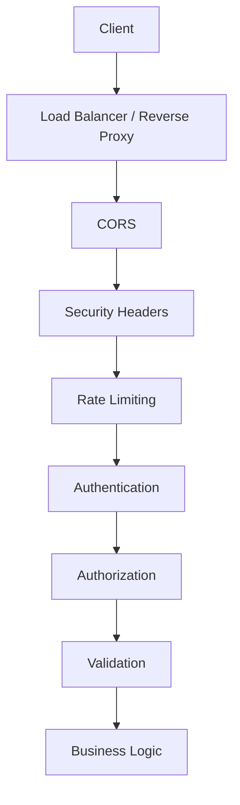
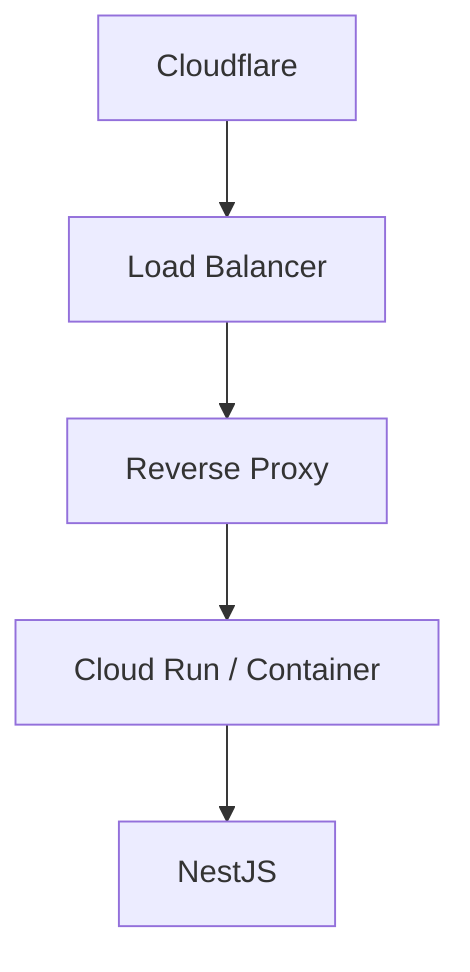
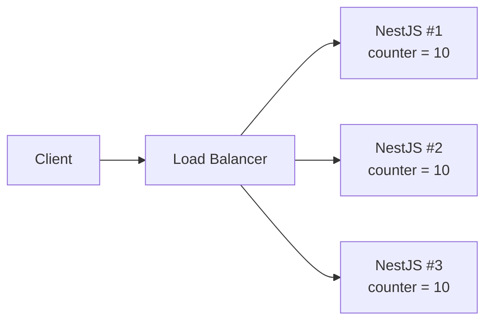
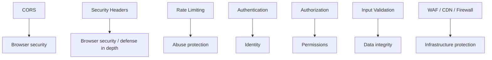
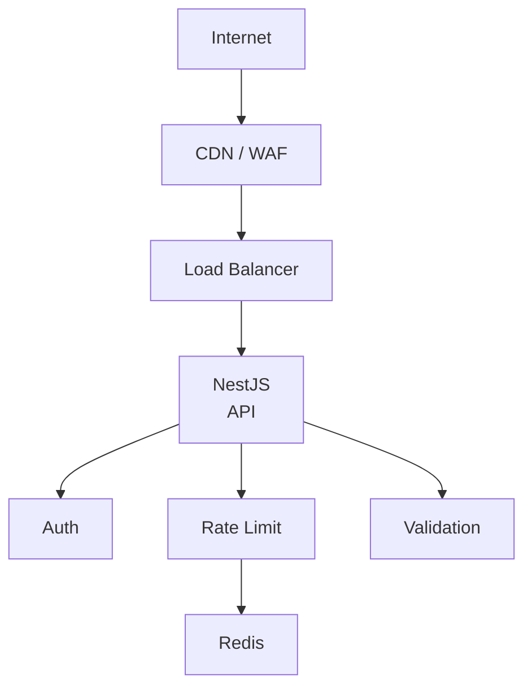
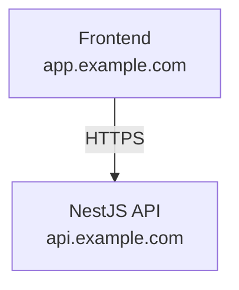

The SPA lives at `https://app.example.com`. The NestJS API lives at `https://api.example.com`. On localhost both were `:3000`, so nobody noticed. In staging the browser blocks `POST /auth/login`. Someone sets `origin: true`. Login works. A week later the same route is being hit a few hundred times a minute from a script that never opens a browser. Helmet is installed. Three Cloud Run instances each think the client is still under the limit.

That is not a missing middleware. It is three different jobs treated as one checkbox.

CORS decides what a **browser** is allowed to read from another origin. Rate limiting decides how often **anyone** may call you before you refuse. Security headers tell a **browser** how to treat the response. None of those steps ask who the caller is, what they are allowed to do, or whether the body is valid.

> CORS, rate limiting, and Helmet are layers. They do not replace authentication, authorization, or input validation. An API that only configures the three is still an open service with extra headers.

## The problem of protecting a NestJS API

A public HTTP API will receive traffic you did not design for. Some of it is a browser on your own frontend. Some of it is a mobile app. Some of it is another service. Some of it is a script.

Typical pressure looks like this:

- requests from origins you do not own;
- bursts against `/auth/login` and `/auth/password-reset`;
- scraping of list endpoints;
- credential stuffing;
- clients that ignore CORS entirely (`curl`, Postman, a VPS);
- traffic that arrives through a CDN, so every request appears to share one IP unless you read forwarded headers carefully;
- replicas that each keep their own in-memory counter.

The useful response is not “install three packages.” It is to stack controls that fail closed, and to know what each control does **not** do.



That stack is conceptual. A CDN or WAF may rate-limit before NestJS sees the request. Helmet is middleware; `@nestjs/throttler` is a guard; CORS is adapter middleware (`cors` on Express, `@fastify/cors` on Fastify). The exact order depends on the HTTP adapter and on what sits in front of the process. The point is the jobs are different. Swapping the boxes does not make one box cover another.

## CORS

Browsers enforce the [Same-Origin Policy](https://developer.mozilla.org/en-US/docs/Web/Security/Same-origin_policy). An origin is the tuple scheme + host + port, as defined in [RFC 6454](https://www.rfc-editor.org/rfc/rfc6454). `https://app.example.com` and `https://api.example.com` are different origins. So are `http://localhost:3000` and `http://localhost:3001`.

Same-Origin Policy is the default **restriction**. A script on origin A must not read the response of a request to origin B unless B opts in. [CORS](https://developer.mozilla.org/en-US/docs/Web/HTTP/Guides/CORS) is that opt-in. It is a set of HTTP headers that tell the browser “you may expose this response to that origin.” The current protocol lives in the [Fetch Standard](https://fetch.spec.whatwg.org/#http-cors-protocol). NestJS does not invent it. It delegates to [`cors`](https://github.com/expressjs/cors) or [`@fastify/cors`](https://github.com/fastify/fastify-cors).

CORS solves a browser problem: your first-party SPA on another host needs to call the API. It does not solve an API problem: anyone with a TCP client can still send the same HTTP request.

### Simple requests and preflight

A “simple” request is a cross-origin request the browser considers safe enough to send without asking first — historically `GET`, `HEAD`, or `POST` with a small set of headers and content types. The request goes out. The browser looks at `Access-Control-Allow-Origin` on the response and decides whether JavaScript may read the body.

Anything outside that set triggers a **preflight**: an `OPTIONS` request before the real one. Preflight happens when you use methods such as `PUT`, `PATCH`, or `DELETE`, or headers the browser does not treat as CORS-safelisted — `Authorization` and `Content-Type: application/json` are the usual reasons a NestJS JSON API preflights.

The preflight asks:

```text
Access-Control-Request-Method: POST
Access-Control-Request-Headers: content-type, authorization
```

The API answers with what it will allow:

| Header                             | Meaning                                                            |
| ---------------------------------- | ------------------------------------------------------------------ |
| `Access-Control-Allow-Origin`      | Which origin may read the response                                 |
| `Access-Control-Allow-Methods`     | Which methods the real request may use                             |
| `Access-Control-Allow-Headers`     | Which request headers the real request may send                    |
| `Access-Control-Allow-Credentials` | Whether a credentialed request (cookies, client certs) may be used |
| `Access-Control-Max-Age`           | How long the browser may cache this preflight                      |

If the preflight fails, the real `POST` never leaves the browser. `curl` never sends a preflight. That difference is the whole security model.

### Credentials change the rules

A credentialed request is a request that includes cookies, client certificates, or an `Authorization` header in a `fetch` with `credentials: "include"`. The Fetch Standard forbids this combination:

```text
Access-Control-Allow-Origin: *
Access-Control-Allow-Credentials: true
```

The browser will not expose the response. Express `cors` will not emit that pair. If you need cookies on a cross-origin call, `Access-Control-Allow-Origin` must be a **specific** origin, not `*`.

`origin: true` in `cors` reflects whatever `Origin` the client sent. Combined with `credentials: true`, that is worse than `*`: every website can make a credentialed call and read the response. Avoid it on a public API unless every caller is trusted — which is almost never the situation that needs CORS.

If the client is a mobile app or a server, it does not use the Same-Origin Policy. Drop `credentials` unless you actually set cookies. Prefer a bearer token in `Authorization` and keep the allowlist tight for the browser clients that need it.

### Public API versus first-party API

A public, read-only API with no cookies and no ambient browser credentials can use `Access-Control-Allow-Origin: *`. That is a product decision: any origin may read the JSON in a browser. OWASP’s [REST Security Cheat Sheet](https://cheatsheetseries.owasp.org/cheatsheets/REST_Security_Cheat_Sheet.html) still says: be as specific as possible, and disable CORS headers if you do not expect browser cross-origin calls.

A first-party API consumed by `https://app.example.com` and `https://admin.example.com` should allow those origins and nothing else. Do not treat “we might add a partner later” as a reason to reflect every `Origin`.

### CORS is not authentication

A rejected CORS response means the **browser** refused to hand the body to JavaScript. The request may already have hit your controller. An attacker does not need a browser:

```bash
curl -X POST https://api.example.com/auth/login \
  -H "Content-Type: application/json" \
  -d '{"email":"ada@example.com","password":"..."}'
```

No `Origin`. No preflight. CORS never runs. If `/auth/login` is only “protected” by an allowlist, it is not protected.

### Recommended NestJS configuration

Nest documents two equivalent entry points: `app.enableCors(options)` or `NestFactory.create(AppModule, { cors: options })`. `cors: true` enables the package defaults — every origin. That is a development convenience, not a production policy.

```ts
app.enableCors({
  origin: ["https://app.example.com", "https://admin.example.com"],
  methods: ["GET", "POST", "PUT", "PATCH", "DELETE"],
  allowedHeaders: ["Content-Type", "Authorization"],
  credentials: true,
});
```

Those values are an example. They must match the real frontends, the methods you actually expose, and whether you use cookies.

Fail closed from the environment. An empty list is safer than a wildcard you forgot to replace:

```ts
const allowlist = (process.env.CORS_ORIGINS ?? "")
  .split(",")
  .map((value) => value.trim())
  .filter(Boolean);

app.enableCors({
  origin: (origin: string | undefined, callback: (err: Error | null, allow?: boolean) => void) => {
    if (!origin) {
      callback(null, true);
      return;
    }
    if (allowlist.includes(origin)) {
      callback(null, true);
      return;
    }
    callback(null, false);
  },
  methods: ["GET", "POST", "PUT", "PATCH", "DELETE"],
  allowedHeaders: ["Content-Type", "Authorization"],
  credentials: process.env.CORS_CREDENTIALS === "true",
});
```

Requests with no `Origin` are not browser CORS checks — `curl`, server-to-server, some same-origin calls. Allowing them does not weaken CORS. Rejecting unknown origins does. If `CORS_ORIGINS` is empty, every browser cross-origin call fails. That is the point.

In development, put `http://localhost:5173` (or whatever the SPA uses) in `CORS_ORIGINS`. Do not special-case `NODE_ENV === "development"` into `origin: true` unless you enjoy the staging incident above.

## Rate limiting

Rate limiting is not “60 requests per minute.” It is a cap on how much work one **tracker** — usually an IP, sometimes a user id — may ask of a route in a window. It reduces:

- credential stuffing and password spraying on `/login`;
- abuse of expensive or state-changing endpoints;
- naive scraping;
- automated hammering;
- some application-level denial of service (CPU, DB, upstream quotas).

It does not stop a distributed botnet that has more IPs than your limit. It does not fix a missing authorization check. It does not replace a WAF or a quota at the load balancer. OWASP lists unrestricted resource consumption as [API4:2023](https://owasp.org/API-Security/editions/2023/en/0x11-t10/). Throttling is one control for that class. It is not the only one.

`@nestjs/throttler` tracks hits in storage and rejects the next request with `429 Too Many Requests` when the tracker exceeds `limit` inside `ttl`. From v5, `ttl` is **milliseconds**. The package exports `seconds`, `minutes`, `hours`, `days`, and `weeks` if you would rather not write `60_000` by hand.

| Option          | Role                                                               |
| --------------- | ------------------------------------------------------------------ |
| `limit`         | How many requests the tracker may make in the window               |
| `ttl`           | Window length, in milliseconds                                     |
| `blockDuration` | How long to keep rejecting after the limit is hit, in milliseconds |
| `tracker`       | The key you count against — by default `req.ip`                    |

`blockDuration` is optional. Without it, the window itself is the backoff. With it, a client that trips the limit stays blocked for a separate interval. Use that on login and password reset, not on a public catalog, unless you have measured the false-positive cost.

### Global configuration

Installing the module is not enough. **Nothing is limited until a `ThrottlerGuard` runs.** Nest’s own docs bind it with `APP_GUARD`.

```ts
import { Module } from "@nestjs/common";
import { APP_GUARD } from "@nestjs/core";
import { minutes, ThrottlerGuard, ThrottlerModule } from "@nestjs/throttler";

@Module({
  imports: [
    ThrottlerModule.forRoot({
      throttlers: [{ name: "default", ttl: minutes(1), limit: 60 }],
      errorMessage: "Too many requests",
    }),
  ],
  providers: [
    {
      provide: APP_GUARD,
      useClass: ThrottlerGuard,
    },
  ],
})
export class AppModule {}
```

`forRoot` also accepts a bare array of throttler objects. `{ throttlers: [...] }` is the form you need as soon as you set `storage`, `getTracker`, or `errorMessage`. Keep the `429` body stable. Do not interpolate Redis errors or internal counters into the response.

Those numbers are a starting point for a JSON API, not a universal policy. A reporting export and a login form do not deserve the same budget.

### Per-route configuration

Several named throttlers in `forRoot` **all apply** to every guarded route. That is useful for burst + sustained windows (`short` / `long`). It is the wrong way to say “login is stricter”: an `auth` throttler in the global array would constrain `/products` too, unless you skip it everywhere else.

Prefer one default, then override the routes that are worth attacking:

```ts
import { Controller, Post } from "@nestjs/common";
import { minutes, SkipThrottle, Throttle } from "@nestjs/throttler";

@Controller("auth")
export class AuthController {
  @Throttle({ default: { limit: 5, ttl: minutes(1) } })
  @Post("login")
  login() {
    /* ... */
  }

  @Throttle({ default: { limit: 3, ttl: minutes(1) } })
  @Post("password-reset")
  passwordReset() {
    /* ... */
  }
}

@Controller("health")
@SkipThrottle({ default: true })
export class HealthController {
  /* probes must not compete with user traffic */
}
```

`@SkipThrottle()` without an object skips the unnamed/`default` set. If you name throttlers `short` and `long`, you must pass those keys or the skip does nothing. The [throttler README](https://github.com/nestjs/throttler) is explicit about that.

Example budgets — examples, not defaults to copy into every app:

```text
GET  /products          100 req / min
POST /orders             20 req / min   + authentication
GET  /profile            60 req / min   + authentication
POST /auth/login          5 req / min
POST /auth/password-reset 3 req / min
GET  /health              skip
```

Tighten routes that create sessions, send email, or charge a card. Relax read-mostly catalog routes. Skip liveness probes so Kubernetes does not 429 itself.

`getTracker` is how the guard decides **who** is being limited. The default is the socket IP. After authentication you can key on user id for logged-in abuse and fall back to IP for anonymous traffic. Do that in a subclass, and do not put emails or tokens in the tracker string — they will end up in storage and in logs.

## Rate limiting behind proxies

In production the NestJS process almost never sees the client socket.



Every request arrives from the last hop. Without help, `req.ip` is the proxy. One limit bucket is shared by the entire internet, or by nobody useful. The usual help is `X-Forwarded-For`: a comma-separated list of addresses, client first if every hop is honest.

Clients can send `X-Forwarded-For` too. If you trust the header unconditionally, an attacker sets `X-Forwarded-For: 203.0.113.1` and gets a fresh bucket on every request. Rate limiting becomes decorative.

Express documents this as [`trust proxy`](https://expressjs.com/en/guide/behind-proxies.html). Fastify’s equivalent is [`trustProxy`](https://fastify.dev/docs/latest/Reference/Server/#trustproxy). The value is the number of hops **you** operate, or a named range such as `loopback`, not a boolean you turn on because a blog post did.

```ts
import { NestFactory } from "@nestjs/core";
import type { NestExpressApplication } from "@nestjs/platform-express";
import { AppModule } from "./app.module";

async function bootstrap() {
  const app = await NestFactory.create<NestExpressApplication>(AppModule);

  const hops = Number(process.env.TRUST_PROXY_HOPS ?? "");
  if (Number.isInteger(hops) && hops > 0) {
    app.set("trust proxy", hops);
  }

  await app.listen(process.env.PORT ?? 3000);
}
```

`trust proxy: true` means “trust every address in the header.” That is how spoofing wins. `trust proxy: 1` means “the last hop is ours; take the address to its left.” Two proxies in front of the container need `2`. Cloudflare plus a Google load balancer plus a sidecar is not automatically `1`. Count the hops in **your** path, in staging, by logging `req.ip` and `req.ips` on a request you control.

Nest’s throttler docs show `app.set("trust proxy", "loopback")` for a proxy on the same host. That is correct for that topology. It is wrong for Cloud Run behind Cloudflare.

On Express, a correct `trust proxy` is usually enough: `req.ip` becomes the client and the default tracker works. On Fastify, read `req.ips`. Nest documents a guard that works for both:

```ts
import { Injectable } from "@nestjs/common";
import { ThrottlerGuard } from "@nestjs/throttler";

@Injectable()
export class ThrottlerBehindProxyGuard extends ThrottlerGuard {
  protected async getTracker(req: Record<string, any>): Promise<string> {
    return req.ips.length ? req.ips[0] : req.ip;
  }
}
```

`req.ips[0]` is the leftmost address — the one the client can set if you trusted too many hops. Bind this guard only after `trust proxy` / `trustProxy` matches the infrastructure. Do not parse `X-Forwarded-For` yourself “to be safe” and then take the first value. That is the spoof.

## Distributed rate limiting

In-memory storage is local to the process. That is fine for one instance.



A limit of 10 becomes 30. Autoscaling makes the real limit a function of replica count. Rolling deploys reset the counters. This is not a Redis sales pitch. It is arithmetic.

`@nestjs/throttler` accepts any `storage` that implements `ThrottlerStorage`. The official docs point at a [community Redis provider](https://docs.nestjs.com/security/rate-limiting) when you need one source of truth. The package listed in the throttler README for `ioredis` is [`@nest-lab/throttler-storage-redis`](https://github.com/jmcdo29/nest-lab/tree/main/packages/throttler-storage-redis).

```ts
import { ThrottlerStorageRedisService } from "@nest-lab/throttler-storage-redis";
import { minutes, ThrottlerModule } from "@nestjs/throttler";

ThrottlerModule.forRoot({
  throttlers: [{ name: "default", ttl: minutes(1), limit: 60 }],
  storage: new ThrottlerStorageRedisService(process.env.REDIS_URL),
});
```

Use a shared store when you run more than one replica, a serverless concurrency model that overlaps instances, or a platform that recycles processes faster than `ttl`. Stay in memory for a single long-lived process if you accept that a restart forgets the window. Do not put Redis in the critical path and then return its connection errors to the client.

A CDN or API gateway can enforce a coarse limit before the request reaches Nest. That is complementary. It does not know your `/auth/login` versus `/products` split unless you configure it there too.

## Security headers

Security headers are instructions to a **browser**. They do not authenticate the caller. They do not run on `curl`. OWASP is blunt about this: if the API is only consumed by non-browser clients, most of these headers do nothing. They are still worth sending on any response a browser might handle — including an error page, a dumped JSON body rendered as HTML by a confused browser, or Swagger UI on the same host.

| Header                      | Problem it addresses                            | Notes for a JSON API                                                                                   |
| --------------------------- | ----------------------------------------------- | ------------------------------------------------------------------------------------------------------ |
| `Content-Security-Policy`   | What the document may load and who may frame it | `default-src 'none'` and `frame-ancestors 'none'` are the OWASP REST baseline. A full CSP is for HTML. |
| `X-Content-Type-Options`    | MIME sniffing (`nosniff`)                       | Useful even when every body is `application/json`.                                                     |
| `Referrer-Policy`           | What other requests put in `Referer`            | Low impact on JSON; Helmet defaults to `no-referrer`.                                                  |
| `Strict-Transport-Security` | Browsers must use HTTPS on this host            | Only after the host is HTTPS everywhere, including subdomains you listed.                              |
| `X-Frame-Options`           | Clickjacking via `<frame>` / `<iframe>`         | Legacy. Prefer CSP `frame-ancestors`. OWASP still wants `DENY` on APIs.                                |
| `Permissions-Policy`        | Which browser features the document may use     | Helmet does not set this today. Add it when you serve HTML.                                            |

OWASP’s REST sheet also wants `Cache-Control: no-store` on responses that must not sit in a shared or private cache, and a correct `Content-Type`. Helmet does not set `Cache-Control`. That is your interceptor or a gateway policy, not a Helmet default.

Do not enable `X-XSS-Protection`. The filter was buggy. Helmet sets `X-XSS-Protection: 0` on purpose.

A policy that is too tight will break the app you actually shipped. CSP that forbids inline scripts will blank Swagger UI. `frame-ancestors 'none'` will break an admin iframe you forgot about. `upgrade-insecure-requests` will push Safari from `http://localhost` to `https://localhost`. Configure headers for the thing you are serving: a JSON API, an SSR app, a GraphQL landing page, or a UI that embeds third-party frames. There is no one list that is correct for all four.

## Helmet in NestJS

[Helmet](https://helmetjs.github.io/) is a collection of small middleware functions that set those headers. Nest’s [Helmet chapter](https://docs.nestjs.com/security/helmet) is three facts: install `helmet`, call `app.use(helmet())` **before** other `app.use()` / routes, and expect CSP collisions with Apollo Sandbox and GraphQL Playground.

```ts
import helmet from "helmet";

app.use(helmet());
```

On Fastify, register `@fastify/helmet` as a plugin (`app.register`), not as Express-style middleware.

`helmet()` is not “enough.” The current defaults include `Cross-Origin-Resource-Policy: same-origin`. That header can block a browser on `https://app.example.com` from reading `https://api.example.com` **even when CORS is correct**. A first-party SPA on another host needs `cross-origin` (or a disabled CORP) on the API. Same-site frontends can use `same-site`.

Helmet’s default CSP is built for an HTML app that loads its own scripts. On a JSON API it is mostly unused. On Swagger UI or Apollo Sandbox it is actively hostile. Nest documents a looser CSP for Apollo, and `contentSecurityPolicy: false` when you are not going to maintain one. Disabling CSP on the whole process because `/api` is JSON and `/docs` is Swagger is the usual shortcut. The better split is: strict `frame-ancestors` on API responses, a crafted CSP only on the HTML you actually serve.

HSTS (`max-age=31536000; includeSubDomains`) is also a Helmet default. Send it in production once HTTPS is guaranteed. Leave it off on local HTTP. Helmet’s own docs warn that HSTS plus `upgrade-insecure-requests` will fight you on `localhost`.

A production-shaped call for a JSON API consumed by a first-party SPA:

```ts
const isProduction = process.env.NODE_ENV === "production";

app.use(
  helmet({
    contentSecurityPolicy: {
      directives: {
        defaultSrc: ["'none'"],
        frameAncestors: ["'none'"],
        upgradeInsecureRequests: isProduction ? [] : null,
      },
    },
    crossOriginResourcePolicy: { policy: "cross-origin" },
    xFrameOptions: { action: "deny" },
    strictTransportSecurity: isProduction ? { maxAge: 31536000, includeSubDomains: true } : false,
  }),
);
```

If you mount Swagger UI on the same app, this CSP will break it. Relax `scriptSrc` / `styleSrc` / `imgSrc` for that route, or disable CSP only there. Do not copy Apollo’s CDN allowlist onto a REST API that does not embed Apollo.

`Permissions-Policy` is not a Helmet option in the current release. Set it yourself on HTML responses if you need to disable camera, geolocation, or payment APIs. A JSON body does not use those APIs.

## A secure API does not depend only on headers

This is the part that the three npm packages cannot say for you.



CORS answers: may this **page** read that response? A stolen token used from a server never asks.

Helmet answers: if a browser renders this, may it be framed, sniffed, or mixed with active content? A SQL injection does not read `X-Frame-Options`.

Throttler answers: has this tracker called too often? A single authorized request that deletes the wrong row is still one request.

Authentication answers: who is this? Nest’s [authentication](https://docs.nestjs.com/security/authentication) chapter is that job.

Authorization answers: may they do this to **this** resource? [Guards and roles](https://docs.nestjs.com/security/authorization) are that job. A valid JWT on `GET /orders/someone-elses-id` is an IDOR, not a CORS bug.

Validation answers: is this body a date, an email, a UUID within range? [`ValidationPipe`](https://docs.nestjs.com/techniques/validation) is that job. Rate limiting a malformed payload still wastes a parse.

| Mechanism        | Problem it solves                   | Risks it reduces                                             | It does not stop                                    |
| ---------------- | ----------------------------------- | ------------------------------------------------------------ | --------------------------------------------------- |
| CORS             | Cross-origin reads from browsers    | A random website’s JS reading your API in the user’s browser | `curl`, Postman, stolen tokens, missing auth        |
| Rate limiting    | Too many requests from one tracker  | Stuffing, scraping, some application-level DoS               | Logic bugs, one well-formed malicious request       |
| Security headers | How browsers treat the response     | Clickjacking, MIME sniffing, mixed content, stale HTTPS      | Server-side injection, broken access control        |
| Authentication   | Establishing identity               | Anonymous access                                             | An authenticated user doing something they must not |
| Authorization    | Enforcing permissions on a resource | IDOR / BOLA, privilege escalation                            | Infra abuse, unvalidated input, missing rate limits |

If you only remember one row: **CORS is not an access-control list for the internet.**

## Layered defense architecture

A setup that matches how these APIs are actually deployed:



The CDN/WAF absorbs volumetric noise, TLS, and some known-bad patterns before they become NestJS event-loop work. The load balancer terminates connections and forwards the hop list you decided to trust. NestJS applies CORS and Helmet on the way in and out, then the throttler guard, then authn/authz, then `ValidationPipe`, then the service. Redis holds a shared counter when there is more than one replica.

Each box fails closed for **its** threat. The WAF will not notice that `role` is writable on `PATCH /users/me`. Redis will not notice that Swagger UI is public. Helmet will not notice that `/auth/login` has no backoff.

## Recommended production configuration

One coherent example. Origins, hop counts, and limits come from the environment. Secrets do not appear in source.

```bash
# example values — not a universal policy
NODE_ENV=production
CORS_ORIGINS=https://app.example.com,https://admin.example.com
CORS_CREDENTIALS=true
TRUST_PROXY_HOPS=2
THROTTLE_TTL_MS=60000
THROTTLE_LIMIT=60
# REDIS_URL=redis://redis:6379
```

```ts
// main.ts
import { ValidationPipe } from "@nestjs/common";
import { ConfigService } from "@nestjs/config";
import { NestFactory } from "@nestjs/core";
import type { NestExpressApplication } from "@nestjs/platform-express";
import helmet from "helmet";
import { AppModule } from "./app.module";

function parseOrigins(raw: string | undefined): string[] {
  return (raw ?? "")
    .split(",")
    .map((value) => value.trim())
    .filter(Boolean);
}

async function bootstrap() {
  const app = await NestFactory.create<NestExpressApplication>(AppModule);
  const config = app.get(ConfigService);
  const isProduction = config.get<string>("NODE_ENV") === "production";
  const allowlist = parseOrigins(config.get<string>("CORS_ORIGINS"));

  app.use(
    helmet({
      contentSecurityPolicy: {
        directives: {
          defaultSrc: ["'none'"],
          frameAncestors: ["'none'"],
          upgradeInsecureRequests: isProduction ? [] : null,
        },
      },
      crossOriginResourcePolicy: { policy: "cross-origin" },
      xFrameOptions: { action: "deny" },
      strictTransportSecurity: isProduction ? { maxAge: 31536000, includeSubDomains: true } : false,
    }),
  );

  app.enableCors({
    origin: (
      origin: string | undefined,
      callback: (err: Error | null, allow?: boolean) => void,
    ) => {
      if (!origin) {
        callback(null, true);
        return;
      }
      if (allowlist.includes(origin)) {
        callback(null, true);
        return;
      }
      callback(null, false);
    },
    methods: ["GET", "POST", "PUT", "PATCH", "DELETE"],
    allowedHeaders: ["Content-Type", "Authorization"],
    credentials: config.get<string>("CORS_CREDENTIALS") === "true",
  });

  const hops = Number(config.get<string>("TRUST_PROXY_HOPS") ?? "");
  if (Number.isInteger(hops) && hops > 0) {
    app.set("trust proxy", hops);
  }

  app.useGlobalPipes(new ValidationPipe({ whitelist: true, forbidNonWhitelisted: true }));

  await app.listen(config.get<string>("PORT") ?? 3000);
}

bootstrap();
```

```ts
// app.module.ts
import { Module } from "@nestjs/common";
import { ConfigModule, ConfigService } from "@nestjs/config";
import { APP_GUARD } from "@nestjs/core";
import { ThrottlerGuard, ThrottlerModule } from "@nestjs/throttler";

@Module({
  imports: [
    ConfigModule.forRoot({ isGlobal: true }),
    ThrottlerModule.forRootAsync({
      imports: [ConfigModule],
      inject: [ConfigService],
      useFactory: (config: ConfigService) => ({
        throttlers: [
          {
            name: "default",
            ttl: Number(config.get("THROTTLE_TTL_MS", 60_000)),
            limit: Number(config.get("THROTTLE_LIMIT", 60)),
          },
        ],
        errorMessage: "Too many requests",
        // storage: new ThrottlerStorageRedisService(config.get("REDIS_URL")),
      }),
    }),
  ],
  providers: [
    {
      provide: APP_GUARD,
      useClass: ThrottlerGuard,
    },
  ],
})
export class AppModule {}
```

```ts
// auth.controller.ts — tighter windows on the routes worth attacking
@Throttle({ default: { limit: 5, ttl: minutes(1) } })
@Post("login")
login(@Body() dto: LoginDto) {
  return this.auth.login(dto);
}

@Throttle({ default: { limit: 3, ttl: minutes(1) } })
@Post("password-reset")
passwordReset(@Body() dto: PasswordResetDto) {
  return this.auth.passwordReset(dto);
}
```

```ts
// health.controller.ts
@Controller("health")
@SkipThrottle({ default: true })
export class HealthController {
  @Get()
  check() {
    return { status: "ok" };
  }
}
```

Uncomment Redis storage when there is more than one replica. Keep `@SkipThrottle` on probes. Keep `@Throttle` overrides on login and password reset. Keep authentication and authorization on `/orders` and `/profile` — they are not in this file on purpose. This snippet does not implement them, and Helmet will not either.

Development can use a looser `THROTTLE_LIMIT`, `http://localhost:5173` in `CORS_ORIGINS`, and no `TRUST_PROXY_HOPS`. It should not use `origin: true`, and it should not disable the guard “to move faster” on the same code path you will deploy.

## Common mistakes

**CORS: `origin: '*'` without a reason.** Fine for a public, uncredentialed, read-mostly API. Combined with cookies or a reflected origin (`origin: true`) it hands any website the user’s session. An empty allowlist that you then bypass with `true` in production is the same bug with extra steps.

**Rate limiting: one limit for every route.** `/products` and `/auth/login` do not cost the same and are not abused the same way. A global 60/min either locks out a storefront or leaves login wide open.

**Proxy: ignoring the real client IP — or trusting the client.** No `trust proxy` means you throttle the load balancer. `trust proxy: true` means the client picks its own tracker. Both fail. The hop count is an infrastructure fact.

**Security headers: a default CSP on an app you have not inventoried.** Swagger UI, GraphQL Playground, and any inline script will go blank. So will a legitimate iframe. Read the HTML you serve, then write the policy. Do not paste Apollo’s CDN list onto a REST API.

**Security: treating CORS as a firewall.** Attackers do not use your frontend. They use your HTTP contract. Document that contract honestly — see [OpenAPI and Swagger in NestJS](/blog/openapi-swagger-nestjs/) — and authenticate the caller.

**Distribution: in-memory counters behind an autoscaler.** Each replica is a fresh budget. The limit you configured is not the limit you have.

**Configuration: origins, hop counts, and limits in source.** They change per environment. Secrets never belong next to them. `CORS_ORIGINS=*` in a `.env.production` you copied from `.env.example` is still a wildcard.

## A first-party API, route by route



| Route                       | CORS                               | Rate limit (example)              | Authn / authz                 | Why                                                     |
| --------------------------- | ---------------------------------- | --------------------------------- | ----------------------------- | ------------------------------------------------------- |
| `POST /auth/login`          | allowlist + credentials if cookies | 5 / min, optional `blockDuration` | Public, then issues a session | Stuffing target. Fail closed on origin.                 |
| `POST /auth/password-reset` | same                               | 3 / min                           | Public                        | Sends email. Cheaper to throttle than to clean a queue. |
| `GET /products`             | allowlist                          | 100 / min                         | Public or API key             | Read-mostly. Still cap scrapers.                        |
| `POST /orders`              | allowlist                          | 20 / min                          | Authenticated + owns the cart | State change and payment-adjacent.                      |
| `GET /profile`              | allowlist                          | default                           | Authenticated + owns the id   | IDOR lives here, not in Helmet.                         |
| `GET /health`               | not needed for probes              | skip                              | Network-restricted            | Do not 429 the platform.                                |

Login and password reset are public **and** hostile. They get the strictest application limit, structured logs on `429`, and no user enumeration in the body. Products can be looser because a missed scrape is cheaper than a locked-out homepage. Orders and profile are not “more Helmet.” They are identity plus object-level authorization. CORS is the same allowlist on all browser routes: `https://app.example.com`, not `*`.

A partner integration that is not a browser should not rely on CORS at all. Give it a credential and a quota keyed on that credential, not on `Origin`.

## Observability

A blocked request that you do not log is indistinguishable from a correctly idle API. When the guard rejects, write an event you can count. Do not write the password, the `Authorization` header, the cookie, or the reset token.

```json
{
  "event": "rate_limit_exceeded",
  "requestId": "req_01J…",
  "clientIp": "203.0.113.40",
  "route": "/auth/login",
  "method": "POST",
  "statusCode": 429
}
```

The same shape works for a CORS rejection you handle in the origin callback (use a dedicated `event`, and still skip any header that carries credentials).

Those lines tell you whether `/auth/login` is being stuffed, whether a deploy set `TRUST_PROXY_HOPS` wrong (every 429 shares one CDN IP, or none do), whether a limit is too tight (real users, many routes, one office NAT), and whether a replica is enforcing a different budget than its peers. How to put `requestId` on every line — and how that differs from a business `transactionId` — is [Structured logging in NestJS](/blog/structured-logging-transaction-ids-nestjs/).

A global exception filter that already formats Nest errors can log when `status === 429` and return the same stable body the throttler emits. Do not add a second, chatty message that leaks `ttl` internals to the client.

## Security checklist

- CORS uses an explicit allowlist, not `*` or `origin: true`, unless the API is intentionally public and uncredentialed
- `credentials` is on only if the browser must send cookies (or a credentialed fetch); never paired with `*`
- Helmet is registered before other middleware
- Headers were reviewed for a JSON API versus HTML / Swagger / Playground
- `Cross-Origin-Resource-Policy` does not block the real frontend
- Rate limiting is global **and** a `ThrottlerGuard` is bound
- Login, password reset, and other abuse magnets have stricter limits
- Health checks are skipped on purpose
- `trust proxy` / `trustProxy` matches the hop count you actually have
- Storage is shared (for example Redis) when there is more than one replica
- Authentication is implemented on routes that are not public
- Authorization checks the resource, not only the token
- Input validation is on (`ValidationPipe` or equivalent)
- Security events (`429`, unexpected origin) are logged without secrets
- Origins, limits, and secrets come from the environment
- HTTPS is the only public listener; HSTS is enabled only then

## Three layers, one strategy

CORS is a browser conversation about origins. Helmet is a browser conversation about how to treat a response. `@nestjs/throttler` is an application conversation about how often a tracker may come back. Production adds a hop count you measured, a store the replicas share, and limits that follow the abuse, not the happy path.

The API is not “secure” when those three compile. It is closer to production when each layer has an owner, a failure mode you can log, and a neighbor — authentication, authorization, validation, a WAF — that covers what it cannot.

Ship the allowlist, the guard, and the headers. Then go implement the parts this article deliberately did not pretend to implement.

## Sources

- NestJS, [CORS](https://docs.nestjs.com/security/cors) — `enableCors()`, `NestFactory.create({ cors })`, Express `cors` / `@fastify/cors`
- NestJS, [Rate limiting](https://docs.nestjs.com/security/rate-limiting) — `ThrottlerModule`, `APP_GUARD`, `@Throttle` / `@SkipThrottle`, proxies, `ThrottlerStorage`
- NestJS, [Helmet](https://docs.nestjs.com/security/helmet) — `app.use(helmet())`, Fastify plugin, CSP collisions with Apollo / Playground
- NestJS, [Authentication](https://docs.nestjs.com/security/authentication) and [Authorization](https://docs.nestjs.com/security/authorization)
- NestJS, [Validation](https://docs.nestjs.com/techniques/validation)
- `@nestjs/throttler`, [README](https://github.com/nestjs/throttler) — named throttlers, `ttl` in milliseconds, community Redis storage
- `@nest-lab/throttler-storage-redis`, [package](https://github.com/jmcdo29/nest-lab/tree/main/packages/throttler-storage-redis)
- Helmet, [HTTP header reference](https://helmetjs.github.io/) — defaults, including `Cross-Origin-Resource-Policy` and `X-XSS-Protection: 0`
- Express, [Behind proxies](https://expressjs.com/en/guide/behind-proxies.html) — `trust proxy`
- Express, [`cors` options](https://github.com/expressjs/cors#configuration-options)
- Fastify, [`trustProxy`](https://fastify.dev/docs/latest/Reference/Server/#trustproxy)
- MDN, [Same-origin policy](https://developer.mozilla.org/en-US/docs/Web/Security/Same-origin_policy)
- MDN, [CORS](https://developer.mozilla.org/en-US/docs/Web/HTTP/Guides/CORS)
- WHATWG, [Fetch Standard — CORS protocol](https://fetch.spec.whatwg.org/#http-cors-protocol)
- IETF, [RFC 6454 — The Web Origin Concept](https://www.rfc-editor.org/rfc/rfc6454)
- IETF, [RFC 6797 — HSTS](https://www.rfc-editor.org/rfc/rfc6797)
- IETF, [RFC 7034 — X-Frame-Options](https://www.rfc-editor.org/rfc/rfc7034)
- OWASP, [REST Security Cheat Sheet](https://cheatsheetseries.owasp.org/cheatsheets/REST_Security_Cheat_Sheet.html) — CORS, API headers, `429`
- OWASP, [HTTP Headers Cheat Sheet](https://cheatsheetseries.owasp.org/cheatsheets/HTTP_Headers_Cheat_Sheet.html)
- OWASP, [API Security Top 10 (2023)](https://owasp.org/API-Security/editions/2023/en/0x11-t10/) — API4 resource consumption, API8 misconfiguration
