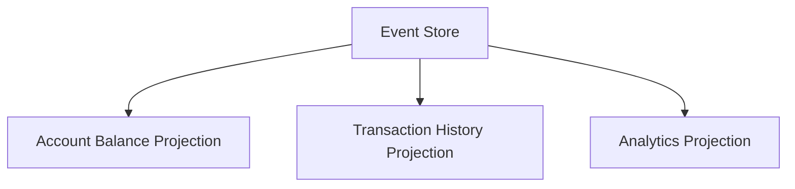
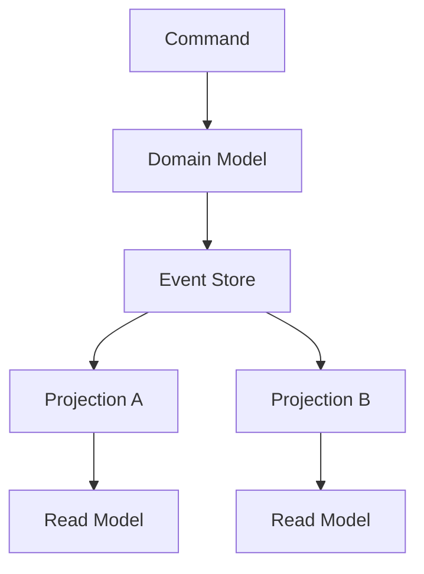
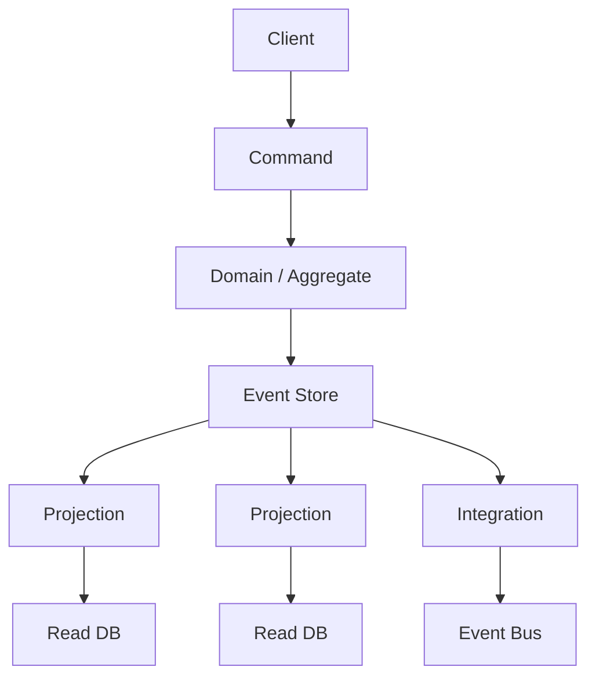

Auditoría abre un ticket. La cuenta tiene `balance = S/ 5,000`. La pregunta no es el número. Es:

> ¿Por qué la cuenta tiene S/ 5,000?

El modelo CRUD responde dónde estás. Una fila, una columna, un valor. No responde cómo llegaste. Los depósitos, los retiros, la corrección de un cargo mal aplicado, el orden de las operaciones: si no los persististe como hechos, ya no están. Quedan logs, si alguien los configuró, o el recuerdo de un operador.

Eso no es un bug de SQL. Es una decisión de persistencia. La mayoría de las aplicaciones guardan el estado actual y tratan el pasado como un extra opcional. Event Sourcing invierte esa decisión: los eventos son la fuente de verdad; el saldo es una proyección que se puede volver a calcular.

No es un upgrade de CRUD. No es «usar Kafka». No es CQRS con otro nombre. Es un patrón caro, útil en un subconjunto estrecho de dominios, y una mala arquitectura en el resto. Microsoft lo dice sin adorno: para la mayoría de los sistemas, la gestión tradicional de datos alcanza. Adoptarlo cambia cómo almacenas, cómo manejas concurrencia, cómo evolucionas schemas y cómo consultas estado. Migrar hacia o desde es costoso.

La pregunta útil no es «qué es Event Sourcing». Es esta:

> ¿Cuándo el historial de cambios debe ser la fuente de verdad, y cuándo persistir el estado actual es la decisión correcta?

## Qué es Event Sourcing

Martin Fowler lo formula así: Event Sourcing asegura que **todo cambio al estado de la aplicación se almacene como una secuencia de eventos**. No solo puedes consultar esos eventos. Puedes usarlos para reconstruir estados pasados.

Un **evento de dominio** es un hecho que ya ocurrió en el lenguaje del negocio. No es `SET balance = 1400`. Es `MoneyDeposited { amount: 1000 }`. Describe la intención, no solo el resultado. Microsoft insiste en esa diferencia: un evento que dice «quedan 42 asientos» es un change log sin significado de negocio. Un evento que dice «se reservaron dos asientos» te dice qué pasó, y te deja construir otras vistas después.

Los eventos son **inmutables**. Una vez agregados, no se editan. Si una operación fue incorrecta, no hay `UPDATE` ni `DELETE` sobre el historial. Hay un evento nuevo que compensa el efecto. El pasado queda. El ledger no se borra con goma.

La secuencia de una cuenta puede verse así:

```text
AccountCreated
MoneyDeposited    amount: 1000
MoneyWithdrawn    amount:  300
MoneyDeposited    amount:  700
```

El estado actual no vive en una columna. Se deriva:

```text
0
+ 1000
-  300
+  700
------
1400
```

Esa derivación es Event Replay: partir de un estado vacío (o de un snapshot) y aplicar cada evento en orden. Fowler denomina a esto _complete rebuild_ cuando descartas el estado de la aplicación y lo vuelves a construir desde el log. Una _temporal query_ detiene la reproducción en un punto del pasado: el saldo a las 14:03 del martes no es una fila histórica. Es el mismo pliegue, truncado.

El contraste de persistencia es este:

```text
CRUD:     Estado  --> fuente de verdad
ES:       Eventos --> fuente de verdad
          Estado  --> proyección derivada
```

Fowler aclara un malentendido frecuente: no todo el mundo tiene que leer el event log. Un editor de texto no entiende los commits de git; asume que hay un archivo en disco. Gran parte del procesamiento puede trabajar sobre una «working copy» — un saldo, una vista, un documento — mientras solo las partes que de verdad necesitan el historial tocan el stream. El log sigue siendo el system of record. El archivo en disco no.

## CRUD tradicional vs Event Sourcing

En CRUD, una cuenta es el estado actual:

```text
Account
---------
id
balance
```

Un depósito de S/ 1,000 es un `UPDATE accounts SET balance = balance + 1000`. Cuando termina, el valor anterior ya no está en esa fila. Conservas dónde estás. Pierdes, salvo que hayas montado auditoría aparte, qué operación lo cambió, con qué intención, en qué orden, y cuál era el saldo justo antes.

En Event Sourcing, la cuenta no se «guarda». Se agrega:

```text
Event Store
-------------------------
AccountCreated
MoneyDeposited
MoneyWithdrawn
MoneyDeposited
```

Conservas el historial completo. El saldo es computable. Lo que no conservas, de forma gratuita, es una consulta SQL barata del tipo `SELECT balance FROM accounts`. Esa consulta exige una proyección, un snapshot, o un replay.

CRUD no es el modelo pobre. Es el modelo correcto cuando el negocio pregunta por el documento actual: un perfil, un post, una flag de configuración. Event Sourcing no es el modelo sofisticado. Es el modelo correcto cuando el negocio pregunta por el ledger: qué pasó, en qué orden, y cómo reconstruir el mundo en un punto.

Resuelven problemas distintos. Presentar Event Sourcing como «mejor que CRUD» es el mismo error que presentar microservicios como la forma adulta del monolito.

## Event Store, streams y replay

Un **Event Store** es el almacén append-only de esos eventos. Es el system of record: la fuente autoritativa del estado actual, que se materializa replaying. Puede ser una base diseñada para streams, o una tabla relacional o de documentos con disciplina append-only. Lo que no es: un message broker.

Microsoft lo marca en negrita conceptual: no confundas un Event Store con un broker de event streams. Kafka, RabbitMQ, Pub/Sub o EventBridge sirven para distribuir. Suelen carecer de lecturas por entidad y de optimistic concurrency al append. Un bus puede sentarse _después_ del store. No lo sustituye.

Los eventos de una entidad viven en un **event stream**: la secuencia ordenada de todo lo que le ocurrió. Una cuenta no es una fila. Es un stream:

```text
stream: account-123

version 1 --> AccountCreated
version 2 --> MoneyDeposited
version 3 --> MoneyWithdrawn
version 4 --> MoneyDeposited
```

El orden lo da la versión del stream, no un timestamp de reloj. Dos writers concurrentes que leen la misma versión e intentan agregar la siguiente colisión: el store rechaza la segunda adición si la versión ya cambió. El handler recarga, reevalúa las reglas, y reintenta. Eso es optimistic concurrency sobre un log, no un `UPDATE` con row lock. El mismo conflicto de dos peticiones sobre un recurso exclusivo aparece aquí como dos appends a la misma versión; el detalle de races está en [race conditions](/blog/race-conditions-when-two-requests-buy-the-same-thing/).

**Rehydration** es reconstruir la entidad reproduciendo su stream. Un comando «retirar S/ 300» no lee `balance` de una tabla. Carga `account-123`, aplica los eventos en orden, obtiene `{ balance: 1400 }`, evalúa si el retiro es legal, y añade el `MoneyWithdrawn`. El agregado en memoria es un derivado. El stream es el hecho.

Replay también responde _cuándo_. El saldo después de la versión 2 es S/ 1,000. Después de la versión 3, S/ 700. El historial no es un log de depuración pegado al lado. Es el único material con el que el sistema puede reconstruir esos puntos.

AWS, en su patrón de Event Sourcing, describe el mismo mecanismo: estado inicial conocido más replay ordenado produce el estado actual o una vista point-in-time. Recomienda no partir siempre desde el origen de los tiempos. Ahí entran los snapshots.

## Snapshots

Replay desde el evento 1 funciona en el ejemplo de cuatro líneas. No funciona igual cuando una cuenta activa lleva diez mil o un millón de eventos. Cada comando que rehidrata el agregado paga el costo completo.

Un **snapshot** es una serialización del estado de la entidad en un punto del stream. No reemplaza los eventos. Es un atajo:

```text
Events 1 ──────────────── 10000
                            │
                        Snapshot
                            │
Events 10001 ──────────── 10100
```

Para rehidratar, cargas el snapshot más reciente y replayas solo lo posterior. Microsoft es explícito: los snapshots son una optimización, no un reemplazo del eventstream. El stream sigue siendo la fuente de verdad. Si el snapshot se corrompe, se regenera. Si cambias la forma del estado, se regenera. AWS dice lo mismo: toma snapshots periódicos y aplica un número menor de eventos para llegar al estado actual.

Elegir cada cuántos eventos snapshotear es un trade-off de almacenamiento contra tiempo de rehydration. No es un problema que CRUD te plantee. Es un problema que Event Sourcing te muda al runtime.

## Projections

Si el Event Store es difícil de consultar — Microsoft nota que no hay un SQL estándar sobre eventos, solo streams por identificador — el sistema necesita otras formas de leer.

Una **projection** es un modelo de lectura derivado de los eventos. El mismo stream alimenta vistas distintas:



El saldo de la UI no tiene que salir de un `reduce` en cada GET. Una proyección puede mantener `account-123 --> 1400` en una tabla lista para leer. El historial de movimientos puede ser otra tabla. Un agregado analítico — depósitos por día, retiros por canal — otra. Ninguna de esas tablas es la fuente de verdad. Si una se equivoca, se borra y se vuelve a proyectar desde el store.

Esto todavía no es CQRS. Es la observación de Fowler de que, en un sistema event-sourced, puedes tener varias working copies con distinto schema. La proyección es esa working copy, mantenida con eager derivation: se actualiza cuando llega el evento, para que la lectura no recorra el log.

## Event Sourcing no es CQRS

Command Query Responsibility Segregation separa el modelo con el que escribes del modelo con el que lees. Greg Young lo describió; Fowler lo resume: para algunos dominios esa separación vale la pena; para la mayoría, CQRS añade complejidad arriesgada. Fowler es directo: **CQRS no va realmente de eventos**. Puedes usarlo sin ningún evento en el diseño.

Event Sourcing no va de separar lecturas y escrituras. Va de persistir cambios como hechos y derivar estado.

Pueden combinarse, y a menudo se combinan:



El **command** expresa una intención (`WithdrawMoney`). El **domain model** (el aggregate) rehidrata, aplica reglas, emite eventos. El **Event Store** agrega. Las **projections** construyen read models. Microsoft describe esa combinación: el Event Store es el write model y la única fuente de verdad; el read model materializa vistas desnormalizadas.

Uno no implica al otro.

- Event Sourcing sin CQRS físico: replayas el stream cuando necesitas el agregado, y tal vez una sola proyección de saldo. Sigue siendo Event Sourcing.
- CQRS sin Event Sourcing: dos modelos, quizá dos bases, con el write model guardando estado actual. Fowler lo admite explícitamente. Microsoft también: CQRS puede compartir un solo data store y solo separar la lógica.

En NestJS, el módulo [`@nestjs/cqrs`](https://docs.nestjs.com/recipes/cqrs) te da commands, queries y un bus en proceso. Eso no convierte la persistencia en un Event Store. Un `CommandHandler` puede cargar un stream, aplicar el agregado y agregar eventos. También puede hacer `UPDATE accounts SET balance = …`. El módulo no decide el patrón.

## Event Sourcing no es Event-Driven Architecture

Fowler dedicó un artículo entero a desarmar «event-driven», porque la palabra cubre patrones distintos. Event Notification avisa a otros sistemas de que algo cambió. Event-Carried State Transfer manda datos suficientes para que el receptor no tenga que preguntar. Event Sourcing registra cada cambio como evento _para poder reconstruir estado_. CQRS separa modelos. Ninguno es los demás.

Una tabla corta evita el colapso más común:

| Concepto                  | Qué es                                                             | Qué no es                                     |
| ------------------------- | ------------------------------------------------------------------ | --------------------------------------------- |
| Event Sourcing            | Los eventos son el system of record. El estado se deriva.          | Publicar mensajes. Tener Kafka.               |
| Event-Driven Architecture | Componentes que reaccionan a eventos, normalmente para desacoplar. | Persistir el historial como fuente de verdad. |
| Domain Event              | Un hecho del dominio (`MoneyDeposited`).                           | Un mensaje de transporte.                     |
| Message broker            | Distribuye mensajes (Kafka, RabbitMQ, Pub/Sub, EventBridge).       | Un Event Store.                               |
| Event Store               | Append-only, streams por entidad, replay, optimistic concurrency.  | Un topic.                                     |
| CQRS                      | Modelos distintos para command y query.                            | Event Sourcing.                               |

Usar Kafka, RabbitMQ o [Pub/Sub](/blog/google-cloud-pubsub-how-to-use-it-correctly/) no significa que la aplicación use Event Sourcing. Significa que hay un canal. Si el system of record sigue siendo `UPDATE accounts SET balance`, tienes mensajería sobre CRUD. Fowler nota el error simétrico: un project manager que culpó a Event Sourcing de tener que actualizar read y write models estaba describiendo CQRS; el tech lead culpó al asincronismo, que no es necesario ni en Event Sourcing ni en CQRS. Git commit es síncrono. El patrón no exige una cola.

El broker puede fan-out eventos _después_ de persistirlos en el store, para projections e integración. Esa rama es Event-Driven Architecture alrededor de Event Sourcing. No es el patrón.

## Una cuenta, un ledger, un error

El ejemplo bancario es conceptual. Fowler observa una sinergia fuerte entre Event Sourcing y sistemas contables: auditoría importa, y una cuenta puede verse como el log de sus _accounting entries_. Eso no es una afirmación sobre la arquitectura interna de un banco concreto. Es por qué el dominio _se parece_ al patrón: el saldo no explica el movimiento; el movimiento explica el saldo.

```text
AccountCreated
MoneyDeposited       + S/ 2,000
MoneyWithdrawn       - S/   500
MoneyDeposited       + S/ 3,000
MoneyWithdrawn       - S/   100
```

Estado derivado: **S/ 4,400**.

Preguntas que un sistema financiero suele tener que responder, y que una fila `balance` no responde sola:

- ¿Cuál era el saldo antes del segundo depósito?
- ¿Qué operaciones lo modificaron, y en qué orden?
- ¿Cuándo ocurrió cada una?
- Si un depósito se acreditó dos veces por un bug, ¿qué quedó registrado?
- ¿Cómo reconstruimos la cuenta en un entorno de prueba con los mismos hechos?
- ¿Cómo audita alguien la cuenta sin fiarse de un log de aplicación que nadie garantiza que sea completo?

Replay hasta el segundo evento: S/ 2,000. Hasta el tercero: S/ 1,500. El historial _es_ la auditoría, no un complemento.

Ahora el depósito de S/ 3,000 fue un error. CRUD invita a `UPDATE` o a borrar la fila de un historial paralelo. Event Sourcing no borra el hecho. Agrega compensación:

```text
MoneyDeposited     amount: 3000
DepositReversed    amount: 3000
```

`DELETE` / `UPDATE` reescriben el pasado. Un **compensating event** deja el error y registra la corrección. Microsoft usa el mismo esquema en reservas: `ReservationCanceled` no elimina `SeatsReserved`. El stream cuenta las dos cosas. Greg Young lo compara con un ledger: no se borra en medio. Si no sabes cómo modelar una corrección, pregunta cómo lo haría contabilidad.

El saldo vuelve a S/ 1,400. El auditor ve el depósito y la reversión. Eso es el valor del patrón en este dominio. No es magia, y no es gratis: ahora tienes que diseñar `DepositReversed`, idempotencia al procesarlo, y qué proyección muestra «movimientos revertidos».

## Idempotencia

La entrega a consumidores suele ser at-least-once. Microsoft lo trata como requisito del patrón, no como detalle de infraestructura: el mismo evento puede llegar dos veces. Sin consumidores idempotentes, las projections se desvían del stream y los side effects — un pago, un email, un asiento descontado — se aplican de más.

```text
MoneyDeposited
eventId: evt-123
amount: 1000
```

El consumidor recibe `evt-123`, luego `evt-123`. Debe acreditar **+1000**, no +1000 dos veces.

Estrategias conceptuales, no un segundo artículo:

- Recordar el último número de secuencia procesado por consumidor y saltar duplicados.
- Tratar `eventId` como clave de idempotencia al aplicar el side effect.
- Diseñar la mutación para que repetirla no cambie el resultado (poner saldo a un valor absoluto es más fácil de repetir que sumar; los eventos de diferencia, que son los más útiles para reverse, exigen la key).

La misma incertidumbre de red que hace inseguro reintentar un `POST /payments` aparece aquí como reentrega. El diseño de APIs con `Idempotency-Key` está en [idempotencia en APIs](/blog/idempotency-in-apis/). En mensajería, Pub/Sub no promete exactly-once; el consumidor tiene que recordar el `eventId`. Event Sourcing no te ahorra ese trabajo. Te lo pone en cada projection.

## Consistencia, complejidad y versionado

Event Sourcing no elimina complejidad. La mueve.

**Eventual consistency.** Las materialized views y las projections se actualizan después del append. Hay una ventana en la que el comando ya persistió y el GET todavía muestra el saldo anterior. Microsoft pide que el producto y el cliente entiendan esa ventana. Si la UI exige leer-tu-escritura inmediata, o proyectas en el mismo request, o Event Sourcing no encaja.

**Procesamiento asíncrono.** No es obligatorio — Fowler lo subraya con git — pero es el camino habitual hacia projections e integración. Colas, reintentos, orden, dead letters: el costo operativo de EDA se suma al del store.

**Orden y concurrencia.** El estado de una entidad depende del orden de su stream. Optimistic concurrency evita lost updates en un aggregate. No resuelve conflictos entre aggregates: stock que baja mientras alguien reserva el último asiento. Eso sigue siendo un problema de diseño, ahora repartido entre streams.

**Projections.** Cada read model es código que puede divergir, atrasarse o duplicar efectos. Regenerar una proyección es una ventaja real. Operarla es trabajo continuo.

**Debugging y replay.** Puedes reproducir producción en un entorno de prueba replaying hechos reales. También puedes re-disparar notificaciones externas si el gateway no distingue replay de tiempo real. Fowler dedica una sección entera a sistemas externos: desactivar gateways durante rebuild, recordar respuestas de queries externas, no tratar un replay como un cobro nuevo.

**Snapshots.** Optimización que hay que invalidar, versionar y regenerar.

**Event versioning.** Hoy el evento es:

```json
{
  "type": "MoneyDeposited",
  "amount": 1000
}
```

Mañana el dominio exige moneda:

```json
{
  "type": "MoneyDeposited",
  "amount": 1000,
  "currency": "PEN"
}
```

Los eventos viejos no se reescriben. El código nuevo tiene que leerlos. Microsoft lista estrategias, solas o combinadas:

- **Tolerant deserialization:** ignorar campos desconocidos, default para los que faltan. Sirve para cambios aditivos.
- **Event versioning:** un identificador de versión en el envelope o en el tipo. El consumidor elige lógica.
- **Upcasting:** funciones que transforman el schema viejo al actual en la deserialización. El dominio solo ve la versión vigente. Los eventos almacenados no cambian.
- **In-place migration:** reescribir el store. Rompe inmutabilidad. Último recurso, porque pudre el audit trail.

Greg Young documenta el mismo problema en _Versioning in an Event Sourced System_: versionar hacia adelante es lo que los equipos descubren rápido; qué hacer con un bug ya persistido es el costo extra frente a CRUD. Un upcaster no es un detalle de framework. Es una responsabilidad que nace el día que el primer evento entra al store y el schema todavía va a cambiar.

Evolución de eventos, replay, snapshots, orden, concurrencia, projections asíncronas: esa es la complejidad. No desapareció. Dejó de vivir en el `UPDATE` y pasó a vivir en el tiempo.

## Cuándo utilizar Event Sourcing

Microsoft, Fowler y AWS coinciden más en el _por qué_ que en un checklist de industrias.

**Auditoría y trazabilidad como requisito de dominio.** No «un log por si acaso». El negocio tiene que poder explicar cada cambio con hechos que el sistema no puede reescribir. Fowler nota que un audit trail completo también ayuda a soporte: reconstruir lo que hizo un usuario. Eso se puede hacer con logging. Event Sourcing lo convierte en el modelo, no en un extra.

**El historial es el dominio.** Una cuenta, un ledger, un pipeline de órdenes donde _qué ocurrió_ es tan importante como _cómo está_. Fowler ve sinergia con contabilidad precisamente por eso. Un sistema de reservas de asientos, el ejemplo de Microsoft, encaja cuando el conflicto de escritura y el historial de bookings importan más que una fila `seatsRemaining`.

**Reconstruir estado histórico o de prueba.** Temporal queries, rebuild completo, reproducir un incidente con los mismos eventos. AWS lista point-in-time recovery y proyectar el mismo origen a formatos distintos.

**Varios modelos de lectura desde un solo historial.** Balance, extracto, analítica, integración. Si esas vistas van a nacer y morir, replayar el store es más barato que haber perdido los hechos en un `UPDATE`.

**Workflows con compensación.** Varios pasos, necesidad de revertir sin fingir que el paso no existió. El compensating event es el modelo; un delete no lo es.

**Intent, not just state.** Microsoft: capturar _Moved home_, _Closed account_, _Deceased_ en vez de un `status` que pisa el anterior. El porqué cabe en el tipo de evento.

Aplícalo **selectivamente**. Microsoft lo dice: ledger de pagos u order pipeline, sí; perfil de usuario o configuración, no. Fowler dice lo mismo de CQRS: un Bounded Context, no el sistema entero.

## Cuándo no utilizarlo

No lo uses porque es una arquitectura moderna.

CRUD es el modelo correcto cuando el negocio pregunta por el documento actual y el historial no tiene valor de dominio:

```text
User Profile
Blog Post
Configuration
Simple Catalog
Basic Administration
```

Si nadie va a reconstruir estados, auditar con hechos inmutables, ni derivar tres read models del mismo log, el Event Store es un costo sin retorno. Microsoft excluye explícitamente sistemas CRUD sencillos, prototipos y MVPs, datos mayormente estáticos (catálogos, lookup tables), y equipos sin experiencia en arquitecturas orientadas a eventos. También excluye casos que exigen consistencia inmediata de las vistas.

La complejidad de diseñar eventos, versionarlos, proyectarlos y operar replay no se justifica si el único requisito es leer y escribir el estado actual. Un blog post no necesita `PostBodyChanged` como fuente de verdad. Un flag de feature tampoco.

Si lo que quieres es desacoplar notificaciones, usa un broker. Si lo que quieres es escalar lecturas, a veces basta un read replica o un reporting database — Fowler lo recuerda como alternativa a CQRS. Event Sourcing es la decisión de que el pasado no se puede perder. Si el pasado no importa, no la tomes.

## Replay en TypeScript

Esto no es un Event Store. Es el fold que reconstruye estado. El resto del patrón — persistencia, versiones, projections — se apoya en esta función.

```ts
type Account = {
  accountId: string | null;
  balance: number;
};

type AccountEvent =
  | { type: "AccountCreated"; accountId: string }
  | { type: "MoneyDeposited"; amount: number }
  | { type: "MoneyWithdrawn"; amount: number };

const initialState: Account = {
  accountId: null,
  balance: 0,
};

function applyEvent(state: Account, event: AccountEvent): Account {
  switch (event.type) {
    case "AccountCreated":
      return { accountId: event.accountId, balance: 0 };
    case "MoneyDeposited":
      return { ...state, balance: state.balance + event.amount };
    case "MoneyWithdrawn":
      return { ...state, balance: state.balance - event.amount };
  }
}

const events: AccountEvent[] = [
  { type: "AccountCreated", accountId: "account-123" },
  { type: "MoneyDeposited", amount: 1000 },
  { type: "MoneyWithdrawn", amount: 300 },
  { type: "MoneyDeposited", amount: 700 },
];

const account = events.reduce(applyEvent, initialState);
// { accountId: "account-123", balance: 1400 }
```

`applyEvent` es puro: mismo estado, mismo evento, mismo resultado. El temporal query es `events.slice(0, n).reduce(applyEvent, initialState)`. Un snapshot sería un `Account` serializado más el índice del último evento incluido; el replay seguiría con `events.slice(snapshot.version)`.

No hay I/O. No hay NestJS. En un servicio Nest, este `reduce` vive dentro del aggregate. El `CommandHandler` carga el stream, llama `applyEvent`, decide, appendea. El módulo CQRS del framework no aparece en este código porque no hace falta para entender el patrón.

## Qué es necesario y qué es opcional

Una arquitectura «completa» mezcla Event Sourcing con otros patrones. Conviene marcar la frontera.



**Necesario para Event Sourcing**

- Eventos de dominio que capturan cada cambio.
- Un Event Store append-only, con streams por entidad y orden.
- Una función de aplicación (`applyEvent`) y la capacidad de rehydration / replay.
- Una política para no mutar el historial (compensating events).

**Frecuente, no constitutivo**

- Snapshots, cuando el stream crece.
- Una o más projections, cuando no quieres replayar en cada lectura.
- Optimistic concurrency en el append.

**De otros patrones**

- Commands y queries separados, read DBs distintas: CQRS.
- Event Bus hacia otros bounded contexts: Event-Driven Architecture / integración.
- `@nestjs/cqrs`, Kafka, Pub/Sub: herramientas. Ninguna convierte CRUD en Event Sourcing.

Puedes tener Event Sourcing en un monolito, síncrono, con una sola proyección de saldo en memoria. Fowler describe clusters in-memory alimentados por un stream, y también el caso mínimo: calcular estado aplicando eventos sobre un estado vacío. El diagrama de arriba es el techo habitual, no el requisito de entrada.

## Errores comunes al adoptar Event Sourcing

1. **Confundir Event Sourcing con logs.** Un audit log al lado de CRUD no es Event Sourcing. Fowler: la clave es que **todos** los cambios del dominio los inician los eventos, y esos eventos viven tanto como el estado. Si puedes cambiar el saldo sin pasar por el log, el log no es la fuente de verdad.

2. **Pensar que Event Sourcing significa usar Kafka.** Kafka distribuye. El Event Store persiste streams por entidad y rechaza appends concurrentes mal versionados. Microsoft: el broker no es sustituto.

3. **Creer que Event Sourcing requiere CQRS.** Se combinan bien. No se implican. Fowler: CQRS ni siquiera va de eventos.

4. **Modificar eventos históricos.** Un `UPDATE` sobre el stream destruye el audit trail. La corrección es un evento nuevo. Reescribir el store es el último recurso de versionado, no el primero.

5. **Ignorar idempotencia.** At-least-once más un `+amount` duplica dinero. Las projections y los side effects tienen que reconocer `eventId` o secuencia.

6. **No pensar en versionado.** El primer evento que guardas va a envejecer. Sin tolerant readers, versiones o upcasters, el replay se rompe el día que el schema cambia.

7. **Usarlo para cualquier CRUD.** Perfiles, posts, config, catálogos simples. El historial no tiene valor de negocio; el patrón sí tiene costo.

8. **No considerar snapshots.** Replay de millones de eventos por comando no es un detalle de «más adelante». Es un límite del modelo, y el snapshot es la mitigación — sin convertirlo en fuente de verdad.

9. **No definir correctamente los eventos de dominio.** `BalanceUpdated { value: 42 }` no captura intención. `SeatsReserved { count: 2 }` sí. Eventos CRUD-shaped (`UserUpdated`) convierten el store en un change log caro.

10. **Introducirlo sin una necesidad real del negocio.** Sin auditoría inmutable, sin reconstrucción histórica, sin varios read models que justifiquen el log, estás comprando complejidad por estética. Microsoft: una vez que una parte del sistema es event-sourced, las decisiones futuras quedan acotadas por ese hecho.

## Conclusión

Event Sourcing persiste cada cambio como un evento inmutable y trata esa secuencia como fuente de verdad. El estado actual — el saldo, el carrito, los asientos ocupados — es una proyección. El problema que resuelve es el de la cuenta de S/ 5,000: no solo dónde estamos, sino cómo llegamos, con un historial que se puede replayar, auditar y proyectar de más de una forma.

Los beneficios son reales donde el dominio los pide: audit trail que no es un extra, reconstrucción point-in-time, compensating events en vez de borrados, varios read models desde un origen, posibilidad de rebuild. Los costos también: eventual consistency, versionado eterno, projections que hay que operar, snapshots, idempotencia, debugging de replay frente a sistemas externos, y una complejidad que no se va, se muda.

Úsalo cuando el historial sea parte del negocio — ledgers, reservas con conflicto, workflows que se compensan, dominios que tienen que explicar cada cambio. Evítalo cuando CRUD describe el documento actual y nadie va a preguntar por el camino. Aplícalo a un Bounded Context, no a la ficha de usuario ni al flag de configuración.

**Una arquitectura no debe elegirse porque sea sofisticada, sino porque responde adecuadamente a las necesidades del dominio.** Event Sourcing es una herramienta. No es un objetivo.

## Fuentes

- Martin Fowler, [Event Sourcing](https://martinfowler.com/eaaDev/EventSourcing.html)
- Martin Fowler, [What do you mean by “Event-Driven”?](https://martinfowler.com/articles/201701-event-driven.html)
- Martin Fowler, [CQRS](https://martinfowler.com/bliki/CQRS.html)
- Microsoft Azure Architecture Center, [Event Sourcing pattern](https://learn.microsoft.com/en-us/azure/architecture/patterns/event-sourcing)
- Microsoft Azure Architecture Center, [CQRS pattern](https://learn.microsoft.com/en-us/azure/architecture/patterns/cqrs)
- AWS Prescriptive Guidance, [Event sourcing pattern](https://docs.aws.amazon.com/prescriptive-guidance/latest/cloud-design-patterns/event-sourcing-pattern.html)
- Greg Young, [Versioning in an Event Sourced System](https://leanpub.com/esversioning)
- NestJS, [CQRS](https://docs.nestjs.com/recipes/cqrs)
