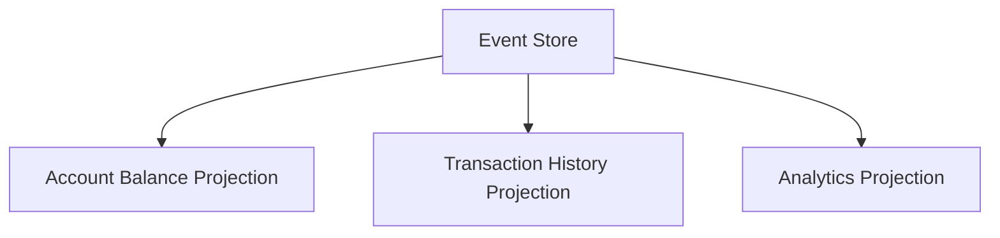

Auditoría abre un ticket. La cuenta tiene `balance = S/ 5,000`. La pregunta no es el número. Es:

> ¿Por qué la cuenta tiene S/ 5,000?

El modelo CRUD responde dónde estás. Una fila, una columna, un valor. No responde cómo llegaste. Los depósitos, los retiros, la corrección de un cargo mal aplicado, el orden de las operaciones: si no los persististe como hechos, ya no están. Quedan logs, si alguien los configuró, o el recuerdo de un operador.

Eso no es un bug de SQL. Es una decisión de persistencia. La mayoría de las aplicaciones guardan el estado actual y tratan el pasado como un extra opcional. Event Sourcing invierte esa decisión: los eventos son la fuente de verdad; el saldo es una proyección que se puede volver a calcular.

No es un upgrade de CRUD, no es «usar Kafka» y no es CQRS con otro nombre. Es un patrón caro que encaja en un subconjunto estrecho de dominios. Microsoft lo dice sin adorno: para la mayoría de los sistemas, la gestión tradicional de datos alcanza, y migrar hacia o desde Event Sourcing es costoso.

La pregunta útil no es «qué es Event Sourcing». Es esta:

> ¿Cuándo el historial de cambios debe ser la fuente de verdad, y cuándo persistir el estado actual es la decisión correcta?

## Qué es Event Sourcing

Martin Fowler lo formula así: Event Sourcing asegura que **todo cambio al estado de la aplicación se almacene como una secuencia de eventos**. No solo puedes consultar esos eventos. Puedes usarlos para reconstruir estados pasados.

Un **evento de dominio** es un hecho que ya ocurrió en el lenguaje del negocio. No es `SET balance = 1400`. Es `MoneyDeposited { amount: 1000 }`. Describe la intención, no solo el resultado. Microsoft insiste en esa diferencia: un evento que dice «quedan 42 asientos» es un change log sin significado de negocio. Un evento que dice «se reservaron dos asientos» te dice qué pasó, y te deja construir otras vistas después.

Los eventos son **inmutables**. Una vez agregados, no se editan. Si una operación fue incorrecta, no hay `UPDATE` ni `DELETE` sobre el historial. Hay un evento nuevo que compensa el efecto. El pasado queda. El ledger no se borra con goma.

La secuencia de una cuenta puede verse así:

```text
AccountCreated
MoneyDeposited    amount: 1000
MoneyWithdrawn    amount:  300
MoneyDeposited    amount:  700
```

El estado actual no vive en una columna. Se deriva:

```text
0
+ 1000
-  300
+  700
------
1400
```

Esa derivación es Event Replay: partir de un estado vacío (o de un snapshot) y aplicar cada evento en orden. Fowler denomina a esto _complete rebuild_ cuando descartas el estado de la aplicación y lo vuelves a construir desde el log. Una _temporal query_ detiene la reproducción en un punto del pasado: el saldo a las 14:03 del martes no es una fila histórica. Es el mismo pliegue, truncado.

El contraste de persistencia es este:

```text
CRUD:     Estado  --> fuente de verdad
ES:       Eventos --> fuente de verdad
          Estado  --> proyección derivada
```

## CRUD tradicional vs Event Sourcing

En CRUD, una cuenta es el estado actual:

```text
Account
---------
id
balance
```

Un depósito de S/ 1,000 es un `UPDATE accounts SET balance = balance + 1000`. Cuando termina, el valor anterior ya no está en esa fila. Conservas dónde estás. Pierdes, salvo que hayas montado auditoría aparte, qué operación lo cambió, con qué intención, en qué orden, y cuál era el saldo justo antes.

En Event Sourcing, la cuenta no se «guarda». Se agrega:

```text
Event Store
-------------------------
AccountCreated
MoneyDeposited
MoneyWithdrawn
MoneyDeposited
```

Conservas el historial completo. El saldo es computable. Lo que no conservas, de forma gratuita, es una consulta SQL barata del tipo `SELECT balance FROM accounts`. Esa consulta exige una proyección, un snapshot, o un replay.

CRUD no es el modelo pobre. Es el modelo correcto cuando el negocio pregunta por el documento actual: un perfil, un post, una flag de configuración. Event Sourcing no es el modelo sofisticado. Es el modelo correcto cuando el negocio pregunta por el ledger: qué pasó, en qué orden, y cómo reconstruir el mundo en un punto.

## Event Store, streams y replay

Un **Event Store** es el almacén append-only de esos eventos. Es el system of record: la fuente autoritativa del estado actual, que se materializa replaying. Puede ser una base diseñada para streams, o una tabla relacional o de documentos con disciplina append-only. Lo que no es: un message broker.

Microsoft lo marca en negrita conceptual: no confundas un Event Store con un broker de event streams. Kafka, RabbitMQ, Pub/Sub o EventBridge sirven para distribuir. Suelen carecer de lecturas por entidad y de optimistic concurrency al append. Un bus puede sentarse _después_ del store. No lo sustituye.

Los eventos de una entidad viven en un **event stream**: la secuencia ordenada de todo lo que le ocurrió. Una cuenta no es una fila. Es un stream:

```text
stream: account-123

version 1 --> AccountCreated
version 2 --> MoneyDeposited
version 3 --> MoneyWithdrawn
version 4 --> MoneyDeposited
```

El orden lo da la versión del stream, no un timestamp de reloj. Dos writers concurrentes que leen la misma versión e intentan agregar la siguiente colisión: el store rechaza la segunda adición si la versión ya cambió. El handler recarga, reevalúa las reglas, y reintenta. Eso es optimistic concurrency sobre un log, no un `UPDATE` con row lock. El mismo conflicto de dos peticiones sobre un recurso exclusivo aparece aquí como dos appends a la misma versión; el detalle de races está en [race conditions](/blog/race-conditions-when-two-requests-buy-the-same-thing/).

**Rehydration** es reconstruir la entidad reproduciendo su stream. Un comando «retirar S/ 300» no lee `balance` de una tabla. Carga `account-123`, aplica los eventos en orden, obtiene `{ balance: 1400 }`, evalúa si el retiro es legal, y añade el `MoneyWithdrawn`. El agregado en memoria es un derivado. El stream es el hecho.

Replay también responde _cuándo_. El saldo después de la versión 2 es S/ 1,000. Después de la versión 3, S/ 700. El historial no es un log de depuración pegado al lado. Es el único material con el que el sistema puede reconstruir esos puntos.

AWS, en su patrón de Event Sourcing, describe el mismo mecanismo: estado inicial conocido más replay ordenado produce el estado actual o una vista point-in-time. Recomienda no partir siempre desde el origen de los tiempos. Ahí entran los snapshots.

## Snapshots

Replay desde el evento 1 funciona en el ejemplo de cuatro líneas. No funciona igual cuando una cuenta activa lleva diez mil o un millón de eventos. Cada comando que rehidrata el agregado paga el costo completo.

Un **snapshot** es una serialización del estado de la entidad en un punto del stream. No reemplaza los eventos. Es un atajo:

```text
Events 1 ──────────────── 10000
                            │
                        Snapshot
                            │
Events 10001 ──────────── 10100
```

Para rehidratar, cargas el snapshot más reciente y replayas solo lo posterior. Microsoft es explícito: los snapshots son una optimización, no un reemplazo del eventstream. El stream sigue siendo la fuente de verdad. Si el snapshot se corrompe, se regenera. Si cambias la forma del estado, se regenera. AWS dice lo mismo: toma snapshots periódicos y aplica un número menor de eventos para llegar al estado actual.

Elegir cada cuántos eventos snapshotear es un trade-off de almacenamiento contra tiempo de rehydration. No es un problema que CRUD te plantee. Es un problema que Event Sourcing te muda al runtime.

## Projections

Si el Event Store es difícil de consultar — Microsoft nota que no hay un SQL estándar sobre eventos, solo streams por identificador — el sistema necesita otras formas de leer.

Una **projection** es un modelo de lectura derivado de los eventos. El mismo stream alimenta vistas distintas:


```mermaid
flowchart TD
  eventStore[Event Store]
  eventStore --> balance[Account Balance Projection]
  eventStore --> history[Transaction History Projection]
  eventStore --> analytics[Analytics Projection]
```

El saldo de la UI no tiene que salir de un `reduce` en cada GET. Una proyección puede mantener `account-123 → 1400` en una tabla lista para leer. El historial de movimientos puede ser otra tabla. Un agregado analítico — depósitos por día, retiros por canal — otra. Ninguna de esas tablas es la fuente de verdad. Si una se equivoca, se borra y se vuelve a proyectar desde el store.

## Event Sourcing no es CQRS, ni Event-Driven Architecture

Tres patrones terminan colapsados en una palabra. **CQRS** separa el modelo con el que escribes del modelo con el que lees; Fowler es directo: no trata realmente de eventos, y puedes usarlo sin ninguno. **Event-Driven Architecture** son componentes que reaccionan a eventos, normalmente para desacoplar: event notification o event-carried state transfer. **Event Sourcing** registra cada cambio como evento _para poder reconstruir estado_.

| Concepto                  | Qué es                                                             | Qué no es                                     |
| ------------------------- | ------------------------------------------------------------------ | --------------------------------------------- |
| Event Sourcing            | Los eventos son el system of record. El estado se deriva.          | Publicar mensajes. Tener Kafka.               |
| Event-Driven Architecture | Componentes que reaccionan a eventos, normalmente para desacoplar. | Persistir el historial como fuente de verdad. |
| Domain Event              | Un hecho del dominio (`MoneyDeposited`).                           | Un mensaje de transporte.                     |
| Message broker            | Distribuye mensajes (Kafka, RabbitMQ, Pub/Sub, EventBridge).       | Un Event Store.                               |
| Event Store               | Append-only, streams por entidad, replay, optimistic concurrency.  | Un topic.                                     |
| CQRS                      | Modelos distintos para command y query.                            | Event Sourcing.                               |

Se combinan bien, y a menudo: un command llega al aggregate, el aggregate añade eventos al store, las projections construyen read models y un broker distribuye los eventos ya persistidos a otros contextos. Microsoft describe esa combinación con el Event Store como write model y única fuente de verdad. Ninguna pieza implica a las demás. Event Sourcing sin CQRS reproduce el stream cuando necesita el aggregate. CQRS sin Event Sourcing guarda el estado actual en el write model. Kafka o [Pub/Sub](/blog/google-cloud-pubsub-how-to-use-it-correctly/) encima de `UPDATE accounts SET balance` es CRUD con un canal. Ninguno de los dos patrones exige siquiera asincronía: un git commit es síncrono.

En NestJS, [`@nestjs/cqrs`](https://docs.nestjs.com/recipes/cqrs) te da commands, queries y un bus en proceso. Un `CommandHandler` puede añadir a un stream o ejecutar un `UPDATE`; el módulo no elige el patrón.

## Una cuenta, un ledger, un error

El ejemplo bancario es conceptual. Fowler observa una sinergia fuerte entre Event Sourcing y sistemas contables: auditoría importa, y una cuenta puede verse como el log de sus _accounting entries_. Eso no es una afirmación sobre la arquitectura interna de un banco concreto. Es por qué el dominio _se parece_ al patrón: el saldo no explica el movimiento; el movimiento explica el saldo.

```text
AccountCreated
MoneyDeposited       + S/ 2,000
MoneyWithdrawn       - S/   500
MoneyDeposited       + S/ 3,000
MoneyWithdrawn       - S/   100
```

Estado derivado: **S/ 4,400**.

Preguntas que un sistema financiero suele tener que responder, y que una fila `balance` no responde sola:

- ¿Cuál era el saldo antes del segundo depósito?
- ¿Qué operaciones lo modificaron, y en qué orden?
- ¿Cuándo ocurrió cada una?
- Si un depósito se acreditó dos veces por un bug, ¿qué quedó registrado?
- ¿Cómo reconstruimos la cuenta en un entorno de prueba con los mismos hechos?
- ¿Cómo audita alguien la cuenta sin fiarse de un log de aplicación que nadie garantiza que sea completo?

Replay hasta el segundo evento: S/ 2,000. Hasta el tercero: S/ 1,500. El historial _es_ la auditoría, no un complemento.

Ahora el depósito de S/ 3,000 fue un error. CRUD invita a `UPDATE` o a borrar la fila de un historial paralelo. Event Sourcing no borra el hecho. Agrega compensación:

```text
MoneyDeposited     amount: 3000
DepositReversed    amount: 3000
```

`DELETE` / `UPDATE` reescriben el pasado. Un **compensating event** deja el error y registra la corrección. Microsoft usa el mismo esquema en reservas: `ReservationCanceled` no elimina `SeatsReserved`. El stream cuenta las dos cosas. Greg Young lo compara con un ledger: no se borra en medio. Si no sabes cómo modelar una corrección, pregunta cómo lo haría contabilidad.

El saldo vuelve a S/ 1,400. El auditor ve el depósito y la reversión. Eso es el valor del patrón en este dominio. No es magia, y no es gratis: ahora tienes que diseñar `DepositReversed`, idempotencia al procesarlo, y qué proyección muestra «movimientos revertidos».

## Idempotencia

La entrega a projections y consumidores suele ser at-least-once, y Microsoft lo trata como un requisito del patrón. Si `MoneyDeposited { eventId: "evt-123", amount: 1000 }` llega dos veces, la projection debe acreditar +1000 una sola vez. Guarda el último número de secuencia procesado por consumidor, o trata `eventId` como idempotency key al aplicar el side effect. Los updates absolutos (fijar el saldo a un valor) se repiten sin riesgo; los eventos de diferencia (sumar 1000) necesitan la key.

Es la misma incertidumbre que hace inseguro reintentar `POST /payments` — [idempotencia en APIs](/blog/idempotency-in-apis/) cubre el lado HTTP. Event Sourcing no elimina ese trabajo. Lo pone en cada projection.

## Consistencia, complejidad y versionado

Event Sourcing no elimina complejidad. La mueve.

**Eventual consistency.** Las materialized views y las projections se actualizan después del append. Hay una ventana en la que el comando ya persistió y el GET todavía muestra el saldo anterior. Microsoft pide que el producto y el cliente entiendan esa ventana. Si la UI exige leer-tu-escritura inmediata, o proyectas en el mismo request, o Event Sourcing no encaja.

**Procesamiento asíncrono.** No es obligatorio — Fowler lo subraya con git — pero es el camino habitual hacia projections e integración. Colas, reintentos, orden, dead letters: el costo operativo de EDA se suma al del store.

**Orden y concurrencia.** El estado de una entidad depende del orden de su stream. Optimistic concurrency evita lost updates en un aggregate. No resuelve conflictos entre aggregates: stock que baja mientras alguien reserva el último asiento. Eso sigue siendo un problema de diseño, ahora repartido entre streams.

**Projections.** Cada read model es código que puede divergir, atrasarse o duplicar efectos. Regenerar una proyección es una ventaja real. Operarla es trabajo continuo.

**Debugging y replay.** Puedes reproducir producción en un entorno de prueba replaying hechos reales. También puedes re-disparar notificaciones externas si el gateway no distingue replay de tiempo real. Fowler dedica una sección entera a sistemas externos: desactivar gateways durante rebuild, recordar respuestas de queries externas, no tratar un replay como un cobro nuevo.

**Snapshots.** Optimización que hay que invalidar, versionar y regenerar.

**Event versioning.** Hoy el evento es:

```json
{
  "type": "MoneyDeposited",
  "amount": 1000
}
```

Mañana el dominio exige moneda:

```json
{
  "type": "MoneyDeposited",
  "amount": 1000,
  "currency": "PEN"
}
```

Los eventos viejos no se reescriben. El código nuevo tiene que leerlos. Microsoft lista estrategias, solas o combinadas:

- **Tolerant deserialization:** ignorar campos desconocidos, default para los que faltan. Sirve para cambios aditivos.
- **Event versioning:** un identificador de versión en el envelope o en el tipo. El consumidor elige lógica.
- **Upcasting:** funciones que transforman el schema viejo al actual en la deserialización. El dominio solo ve la versión vigente. Los eventos almacenados no cambian.
- **In-place migration:** reescribir el store. Rompe inmutabilidad. Último recurso, porque pudre el audit trail.

## Cuándo utilizar Event Sourcing

Microsoft, Fowler y AWS coinciden más en el _porqué_ que en un checklist. Encaja cuando:

- **la auditoría es un requisito del dominio** — el negocio tiene que explicar cada cambio con hechos que el sistema no puede reescribir, no «un log por si acaso»;
- **el historial es el dominio** — un ledger, un pipeline de pedidos, reservas con conflicto donde lo que pasó importa tanto como el valor actual;
- **necesitas reconstruir estados pasados o de prueba** — temporal queries, recuperación point-in-time, reproducir un incidente con los mismos eventos;
- **varios read models salen de un mismo historial** — saldo, estado de cuenta, analítica, integración;
- **los workflows se compensan** — un paso se revierte con un hecho nuevo, no se borra;
- **importa la intención** — _Se mudó_ o _Cerró la cuenta_ en vez de un `status` que pisa el anterior.

Aplícalo **de forma selectiva**. Los ejemplos de Microsoft: un ledger de pagos o un pipeline de pedidos, sí; un perfil de usuario o la configuración de la aplicación, no. Un Bounded Context, no todo el sistema.

## Cuándo no utilizarlo

No lo uses porque es una arquitectura moderna.

CRUD es el modelo correcto cuando el negocio pregunta por el documento actual y el historial no tiene valor de dominio:

```text
User Profile
Blog Post
Configuration
Simple Catalog
Basic Administration
```

Si nadie va a reconstruir estados, auditar con hechos inmutables, ni derivar tres read models del mismo log, el Event Store es un costo sin retorno. Microsoft excluye explícitamente sistemas CRUD sencillos, prototipos y MVPs, datos mayormente estáticos (catálogos, lookup tables), y equipos sin experiencia en arquitecturas orientadas a eventos. También excluye casos que exigen consistencia inmediata de las vistas.

La complejidad de diseñar eventos, versionarlos, proyectarlos y operar replay no se justifica si el único requisito es leer y escribir el estado actual. Un blog post no necesita `PostBodyChanged` como fuente de verdad. Un flag de feature tampoco.

Si lo que quieres es desacoplar notificaciones, usa un broker. Si lo que quieres es escalar lecturas, a veces basta un read replica o un reporting database — Fowler lo recuerda como alternativa a CQRS. Event Sourcing es la decisión de que el pasado no se puede perder. Si el pasado no importa, no la tomes.

## Replay en TypeScript

Esto no es un Event Store. Es el fold que reconstruye estado. El resto del patrón — persistencia, versiones, projections — se apoya en esta función.

```ts
type Account = {
  accountId: string | null;
  balance: number;
};

type AccountEvent =
  | { type: "AccountCreated"; accountId: string }
  | { type: "MoneyDeposited"; amount: number }
  | { type: "MoneyWithdrawn"; amount: number };

const initialState: Account = {
  accountId: null,
  balance: 0,
};

function applyEvent(state: Account, event: AccountEvent): Account {
  switch (event.type) {
    case "AccountCreated":
      return { accountId: event.accountId, balance: 0 };
    case "MoneyDeposited":
      return { ...state, balance: state.balance + event.amount };
    case "MoneyWithdrawn":
      return { ...state, balance: state.balance - event.amount };
  }
}

const events: AccountEvent[] = [
  { type: "AccountCreated", accountId: "account-123" },
  { type: "MoneyDeposited", amount: 1000 },
  { type: "MoneyWithdrawn", amount: 300 },
  { type: "MoneyDeposited", amount: 700 },
];

const account = events.reduce(applyEvent, initialState);
// { accountId: "account-123", balance: 1400 }
```

`applyEvent` es puro: mismo estado, mismo evento, mismo resultado. El temporal query es `events.slice(0, n).reduce(applyEvent, initialState)`. Un snapshot sería un `Account` serializado más el índice del último evento incluido; el replay seguiría con `events.slice(snapshot.version)`.

No hay I/O. No hay NestJS. En un servicio Nest, este `reduce` vive dentro del aggregate. El `CommandHandler` carga el stream, llama `applyEvent`, decide, appendea. El módulo CQRS del framework no aparece en este código porque no hace falta para entender el patrón.

## Errores comunes al adoptar Event Sourcing

- **Un audit log al lado de CRUD.** Si el saldo puede cambiar sin pasar por el log, el log no es la fuente de verdad.
- **«Usamos Kafka, así que hacemos Event Sourcing».** Un broker distribuye. El Event Store persiste streams por entidad y rechaza appends concurrentes en la misma versión.
- **Suponer que exige CQRS, o al revés.** Se combinan; ninguno implica al otro.
- **Editar eventos almacenados.** La corrección es un compensating event. Reescribir el store es el último recurso de versionado, no el primero.
- **Ignorar idempotencia o versionado.** Un `+amount` duplicado duplica dinero; el primer evento que guardes va a envejecer.
- **Reproducir millones de eventos por command.** Los snapshots son la mitigación, nunca la fuente de verdad.
- **Eventos con forma de CRUD.** `BalanceUpdated { value: 42 }` o `UserUpdated` convierten el store en un change log caro. `SeatsReserved { count: 2 }` captura la intención.
- **Adoptarlo sin una necesidad de negocio.** Una vez que una parte del sistema usa Event Sourcing, las decisiones de diseño futuras en esa parte quedan condicionadas por ese hecho.

## Conclusión

Event Sourcing se gana su costo cuando el negocio tiene que explicar cómo llegó al estado actual: ledgers, reservas con conflicto, workflows que se compensan. Donde CRUD describe el documento actual y nadie pregunta por el camino, el store, las proyecciones y el versionado son complejidad sin retorno. Aplícalo a un Bounded Context, no a la ficha de usuario ni al flag de configuración.

**Elige una arquitectura porque responde al dominio, no porque sea sofisticada.**

## Fuentes

- Martin Fowler, [Event Sourcing](https://martinfowler.com/eaaDev/EventSourcing.html)
- Martin Fowler, [What do you mean by “Event-Driven”?](https://martinfowler.com/articles/201701-event-driven.html)
- Martin Fowler, [CQRS](https://martinfowler.com/bliki/CQRS.html)
- Microsoft Azure Architecture Center, [Event Sourcing pattern](https://learn.microsoft.com/en-us/azure/architecture/patterns/event-sourcing)
- Microsoft Azure Architecture Center, [CQRS pattern](https://learn.microsoft.com/en-us/azure/architecture/patterns/cqrs)
- AWS Prescriptive Guidance, [Event sourcing pattern](https://docs.aws.amazon.com/prescriptive-guidance/latest/cloud-design-patterns/event-sourcing-pattern.html)
- Greg Young, [Versioning in an Event Sourced System](https://leanpub.com/esversioning)
- NestJS, [CQRS](https://docs.nestjs.com/recipes/cqrs)
