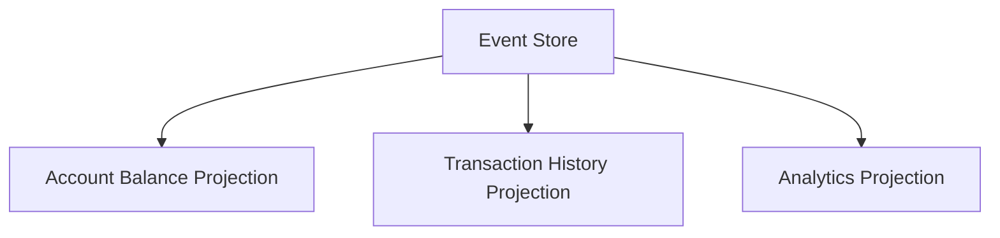
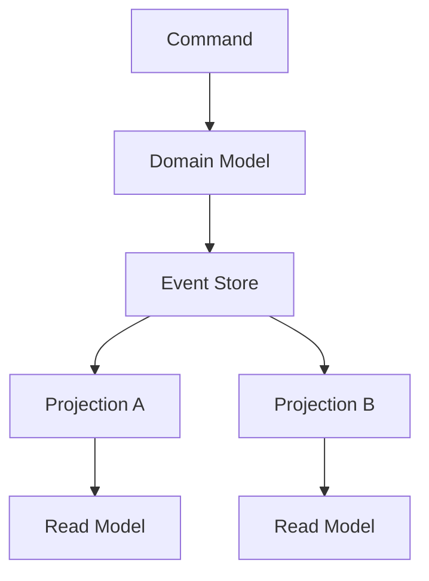
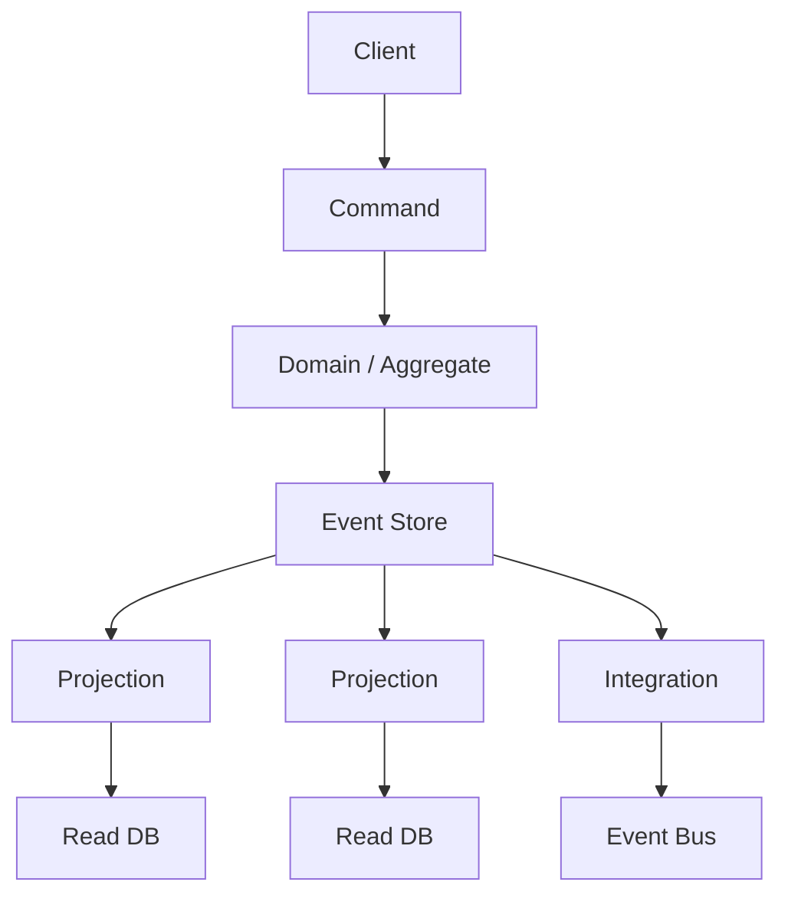

Audit opens a ticket. The account shows `balance = S/ 5,000`. The question is not the number. It is:

> Why does the account have S/ 5,000?

A CRUD model answers where you are. One row, one column, one value. It does not answer how you got there. Deposits, withdrawals, a charge posted by mistake, the order of the operations: if you did not persist them as facts, they are gone. You have logs, if someone configured them, or an operator's memory.

That is not a SQL bug. It is a persistence decision. Most applications store current state and treat the past as an optional extra. Event Sourcing inverts that: events are the source of truth; the balance is a projection you can compute again.

It is not a CRUD upgrade. It is not "we use Kafka." It is not CQRS under another name. It is an expensive pattern, useful in a narrow set of domains, and the wrong architecture everywhere else. Microsoft says it without decoration: for most systems, traditional data management is enough. Adopting it changes how you store data, handle concurrency, evolve schemas, and query state. Migrating to or from it is costly.

The useful question is not "what is Event Sourcing." It is this:

> When should the history of changes be the source of truth, and when is persisting current state the right call?

## What Event Sourcing actually is

Martin Fowler puts it this way: Event Sourcing ensures that **every change to application state is stored as a sequence of events**. You can query those events. You can also use them to reconstruct past states.

A **domain event** is a fact that already happened, in the language of the business. It is not `SET balance = 1400`. It is `MoneyDeposited { amount: 1000 }`. It captures intent, not only the result. Microsoft leans on that difference: an event that says "42 seats remain" is a change log with no business meaning. An event that says "two seats were reserved" tells you what happened, and leaves you free to build other views later.

Events are **immutable**. Once appended, they are not edited. If an operation was wrong, there is no `UPDATE` or `DELETE` on the history. There is a new event that compensates the effect. The past stays. You do not erase a ledger with a rubber.

An account sequence can look like this:

```text
AccountCreated
MoneyDeposited    amount: 1000
MoneyWithdrawn    amount:  300
MoneyDeposited    amount:  700
```

Current state does not live in a column. It is derived:

```text
0
+ 1000
-  300
+  700
------
1400
```

That derivation is Event Replay: start from empty state (or from a snapshot) and apply each event in order. Fowler calls a full discard-and-rebuild a _complete rebuild_. A _temporal query_ stops the replay at a point in the past: the balance at 14:03 on Tuesday is not a historical row. It is the same fold, cut short.

The persistence contrast is this:

```text
CRUD:     State  --> source of truth
ES:       Events --> source of truth
          State  --> derived projection
```

Fowler flags a common mistake: not everyone has to read the event log. A text editor does not understand git commits; it assumes there is a file on disk. Much of the processing can work on a working copy — a balance, a view, a document — while only the parts that actually need history touch the stream. The log remains the system of record. The file on disk does not.

## CRUD vs Event Sourcing

In CRUD, an account is the current state:

```text
Account
---------
id
balance
```

A deposit of S/ 1,000 is `UPDATE accounts SET balance = balance + 1000`. When it commits, the previous value is gone from that row. You keep where you are. Unless you built auditing on the side, you lose which operation changed it, with what intent, in what order, and what the balance was just before.

In Event Sourcing, the account is not "saved." It is appended:

```text
Event Store
-------------------------
AccountCreated
MoneyDeposited
MoneyWithdrawn
MoneyDeposited
```

You keep the full history. The balance is computable. What you do not get for free is a cheap `SELECT balance FROM accounts`. That query needs a projection, a snapshot, or a replay.

CRUD is not the poor model. It is the right model when the business asks for the current document: a profile, a post, a config flag. Event Sourcing is not the sophisticated model. It is the right model when the business asks for the ledger: what happened, in which order, and how to rebuild the world at a point.

They solve different problems. Selling Event Sourcing as "better than CRUD" is the same mistake as selling microservices as the grown-up form of a monolith.

## Event Store, streams, and replay

An **Event Store** is the append-only store for those events. It is the system of record: the authoritative source for current state, which you materialize by replaying. It can be a database built for streams, or a relational or document table with append-only discipline. What it is not: a message broker.

Microsoft draws the line: do not confuse an Event Store with an eventstream message broker. Kafka, RabbitMQ, Pub/Sub, or EventBridge distribute. They typically lack per-entity stream queries and optimistic concurrency on append. A bus can sit _after_ the store. It does not replace it.

Events for one entity live in an **event stream**: the ordered sequence of everything that happened to it. An account is not a row. It is a stream:

```text
stream: account-123

version 1 --> AccountCreated
version 2 --> MoneyDeposited
version 3 --> MoneyWithdrawn
version 4 --> MoneyDeposited
```

Order comes from the stream version, not a wall-clock timestamp. Two concurrent writers that read the same version and try to append the next one collide: the store rejects the second append if the version already moved. The handler reloads, re-evaluates the rules, and retries. That is optimistic concurrency on a log, not an `UPDATE` with a row lock. The same fight of two requests over one exclusive resource shows up here as two appends at the same version; the race itself is covered in [race conditions](/blog/race-conditions-when-two-requests-buy-the-same-thing/).

**Rehydration** is reconstructing the entity by replaying its stream. A "withdraw S/ 300" command does not read `balance` from a table. It loads `account-123`, applies events in order, gets `{ balance: 1400 }`, checks whether the withdrawal is legal, and appends `MoneyWithdrawn`. The in-memory aggregate is derived. The stream is the fact.

Replay also answers _when_. The balance after version 2 is S/ 1,000. After version 3, S/ 700. History is not a debug log taped to the side. It is the only material the system can use to rebuild those points.

AWS describes the same mechanism in its Event Sourcing pattern: a known initial state plus ordered replay produces current state or a point-in-time view. It recommends not always starting from the beginning of time. That is where snapshots come in.

## Snapshots

Replay from event 1 works in the four-line example. It does not work the same way when an active account has ten thousand or a million events. Every command that rehydrates the aggregate pays the full cost.

A **snapshot** is a serialization of the entity's state at a point in the stream. It does not replace the events. It is a shortcut:

```text
Events 1 ──────────────── 10000
                            │
                        Snapshot
                            │
Events 10001 ──────────── 10100
```

To rehydrate, load the most recent snapshot and replay only what follows. Microsoft is explicit: snapshots are an optimization, not a replacement for the eventstream. The stream remains the source of truth. If the snapshot is corrupt, regenerate it. If the shape of state changes, regenerate it. AWS says the same: take periodic snapshots and apply a smaller number of events to reach current state.

How often to snapshot is a storage-versus-rehydration trade-off. CRUD never asks you that question. Event Sourcing moves it into the runtime.

## Projections

If the Event Store is hard to query — Microsoft notes there is no standard SQL over events, only streams by identifier — the system needs other ways to read.

A **projection** is a read model derived from the events. The same stream feeds different views:



The UI balance does not have to come from a `reduce` on every GET. A projection can keep `account-123 --> 1400` in a table ready to read. Movement history can be another table. An analytic rollup — deposits per day, withdrawals per channel — another. None of those tables is the source of truth. If one is wrong, delete it and project again from the store.

This is not CQRS yet. It is Fowler's observation that an event-sourced system can keep several working copies with different schemas. The projection is that working copy, kept with eager derivation: it updates when the event arrives, so a read does not walk the log.

## Event Sourcing is not CQRS

Command Query Responsibility Segregation splits the model you write with from the model you read with. Greg Young described it; Fowler summarizes: for some domains the split is worth it; for most, CQRS adds risky complexity. Fowler is blunt: **CQRS is not really about events**. You can use it with no events in the design.

Event Sourcing is not about splitting reads and writes. It is about persisting changes as facts and deriving state.

They can be combined, and often are:



The **command** names an intent (`WithdrawMoney`). The **domain model** (the aggregate) rehydrates, applies rules, emits events. The **Event Store** appends. **Projections** build read models. Microsoft describes that pairing: the Event Store is the write model and the single source of truth; the read model materializes denormalized views.

One does not imply the other.

- Event Sourcing without physical CQRS: you replay the stream when you need the aggregate, maybe with one balance projection. That is still Event Sourcing.
- CQRS without Event Sourcing: two models, perhaps two stores, with the write model holding current state. Fowler says so explicitly. Microsoft does too: CQRS can share one data store and only split the logic.

In NestJS, the [`@nestjs/cqrs`](https://docs.nestjs.com/recipes/cqrs) module gives you commands, queries, and an in-process bus. That does not turn persistence into an Event Store. A `CommandHandler` can load a stream, run the aggregate, and append events. It can also run `UPDATE accounts SET balance = …`. The module does not choose the pattern.

## Event Sourcing is not Event-Driven Architecture

Fowler wrote a whole piece unpacking "event-driven," because the word covers different patterns. Event Notification tells other systems that something changed. Event-Carried State Transfer sends enough data that the receiver does not have to ask back. Event Sourcing records each change as an event _so you can rebuild state_. CQRS splits models. None of these is the others.

A short table stops the usual collapse:

| Concept                   | What it is                                                       | What it is not                             |
| ------------------------- | ---------------------------------------------------------------- | ------------------------------------------ |
| Event Sourcing            | Events are the system of record. State is derived.               | Publishing messages. Having Kafka.         |
| Event-Driven Architecture | Components that react to events, usually to decouple.            | Persisting history as the source of truth. |
| Domain Event              | A domain fact (`MoneyDeposited`).                                | A transport message.                       |
| Message broker            | Distributes messages (Kafka, RabbitMQ, Pub/Sub, EventBridge).    | An Event Store.                            |
| Event Store               | Append-only, per-entity streams, replay, optimistic concurrency. | A topic.                                   |
| CQRS                      | Different models for command and query.                          | Event Sourcing.                            |

Using Kafka, RabbitMQ, or [Pub/Sub](/blog/google-cloud-pubsub-how-to-use-it-correctly/) does not mean the application uses Event Sourcing. It means there is a channel. If the system of record is still `UPDATE accounts SET balance`, you have messaging on top of CRUD. Fowler notes the symmetric error: a project manager who blamed Event Sourcing for having to update read and write models was describing CQRS; the tech lead blamed asynchrony, which is required by neither Event Sourcing nor CQRS. A git commit is synchronous. The pattern does not demand a queue.

The broker can fan out events _after_ they are persisted in the store, for projections and integration. That branch is Event-Driven Architecture around Event Sourcing. It is not the pattern.

## An account, a ledger, a mistake

The banking example is conceptual. Fowler notes a strong synergy between Event Sourcing and accounting systems: audit matters, and an account can be seen as the log of its accounting entries. That is not a claim about any bank's internal architecture. It is why the domain _looks like_ the pattern: the balance does not explain the movement; the movement explains the balance.

```text
AccountCreated
MoneyDeposited       + S/ 2,000
MoneyWithdrawn       - S/   500
MoneyDeposited       + S/ 3,000
MoneyWithdrawn       - S/   100
```

Derived state: **S/ 4,400**.

Questions a financial system often has to answer, and that a `balance` row does not answer on its own:

- What was the balance before the second deposit?
- Which operations changed it, and in which order?
- When did each one happen?
- If a deposit was credited twice because of a bug, what was recorded?
- How do we rebuild the account in a test environment from the same facts?
- How does someone audit the account without trusting an application log nobody guarantees is complete?

Replay through the second event: S/ 2,000. Through the third: S/ 1,500. The history _is_ the audit, not a sidecar.

Now the S/ 3,000 deposit was a mistake. CRUD invites an `UPDATE`, or deleting a row from a parallel history table. Event Sourcing does not erase the fact. It appends compensation:

```text
MoneyDeposited     amount: 3000
DepositReversed    amount: 3000
```

`DELETE` / `UPDATE` rewrite the past. A **compensating event** leaves the error and records the correction. Microsoft uses the same shape for reservations: `ReservationCanceled` does not remove `SeatsReserved`. The stream tells both stories. Greg Young compares it to a ledger: you do not erase in the middle. If you cannot model a correction, ask how accounting would do it.

The balance is S/ 1,400 again. The auditor sees the deposit and the reversal. That is the value of the pattern in this domain. It is not magic, and it is not free: you now have to design `DepositReversed`, make processing it idempotent, and decide how a projection shows reversed movements.

## Idempotency

Delivery to consumers is typically at-least-once. Microsoft treats that as a requirement of the pattern, not an infrastructure footnote: the same event can arrive twice. Without idempotent consumers, projections drift from the stream and side effects — a payment, an email, a decremented seat — fire more than once.

```text
MoneyDeposited
eventId: evt-123
amount: 1000
```

The consumer gets `evt-123`, then `evt-123`. It must credit **+1000**, not +1000 twice.

Conceptual strategies, not a second article:

- Remember the last processed sequence number per consumer and skip duplicates.
- Treat `eventId` as an idempotency key when applying the side effect.
- Design the mutation so repeating it does not change the result (setting a balance to an absolute value is easier to repeat than adding; difference events, which are more useful for reverse, need the key).

The same network uncertainty that makes retrying `POST /payments` unsafe shows up here as redelivery. API design with `Idempotency-Key` is in [API idempotency](/blog/idempotency-in-apis/). In messaging, Pub/Sub does not promise exactly-once; the consumer has to remember the `eventId`. Event Sourcing does not save you that work. It puts it on every projection.

## Consistency, complexity, and versioning

Event Sourcing does not remove complexity. It moves it.

**Eventual consistency.** Materialized views and projections update after the append. There is a window where the command has persisted and a GET still shows the old balance. Microsoft asks that the product and the customer understand that window. If the UI needs read-your-writes immediately, either project in the same request, or Event Sourcing is a poor fit.

**Asynchronous processing.** It is not required — Fowler underlines that with git — but it is the usual path to projections and integration. Queues, retries, ordering, dead letters: the operational cost of EDA stacks on top of the store.

**Ordering and concurrency.** An entity's state depends on the order of its stream. Optimistic concurrency prevents lost updates on one aggregate. It does not resolve conflicts across aggregates: stock dropping while someone reserves the last seat. That remains a design problem, now split across streams.

**Projections.** Each read model is code that can diverge, lag, or duplicate effects. Regenerating a projection is a real advantage. Operating it is ongoing work.

**Debugging and replay.** You can reproduce production in a test environment by replaying real facts. You can also re-fire external notifications if the gateway cannot tell replay from live time. Fowler spends a section on external systems: disable gateways during rebuild, remember answers to external queries, do not treat a replay as a new charge.

**Snapshots.** An optimization you have to invalidate, version, and regenerate.

**Event versioning.** Today the event is:

```json
{
  "type": "MoneyDeposited",
  "amount": 1000
}
```

Tomorrow the domain needs currency:

```json
{
  "type": "MoneyDeposited",
  "amount": 1000,
  "currency": "PEN"
}
```

Old events are not rewritten. New code has to read them. Microsoft lists strategies, alone or combined:

- **Tolerant deserialization:** ignore unknown fields, default missing ones. Works for additive changes.
- **Event versioning:** a version identifier in the envelope or the type. The consumer picks the handler.
- **Upcasting:** functions that lift the old schema to the current one at deserialization. The domain only sees the latest version. Stored events do not change.
- **In-place migration:** rewrite the store. Breaks immutability. Last resort, because it guts the audit trail.

Greg Young documents the same problem in _Versioning in an Event Sourced System_: versioning forward is what teams figure out quickly; what to do with a bug already persisted is the extra cost versus CRUD. An upcaster is not a framework detail. It is a responsibility that starts the day the first event hits the store and the schema is still going to change.

Event evolution, replay, snapshots, order, concurrency, async projections: that is the complexity. It did not vanish. It left the `UPDATE` and moved into time.

## When to use Event Sourcing

Microsoft, Fowler, and AWS agree more on the _why_ than on an industry checklist.

**Audit and traceability as a domain requirement.** Not "a log just in case." The business has to explain every change with facts the system cannot rewrite. Fowler notes that a complete audit trail also helps support: reconstruct what a user did. You can do that with logging. Event Sourcing makes it the model, not an extra.

**History is the domain.** An account, a ledger, an order pipeline where _what happened_ matters as much as _how it is_. Fowler sees the accounting synergy for that reason. A seat-reservation system, Microsoft's example, fits when write contention and booking history matter more than a `seatsRemaining` row.

**Rebuild historical or test state.** Temporal queries, complete rebuild, reproducing an incident from the same events. AWS lists point-in-time recovery and projecting one origin into different formats.

**Several read models from one history.** Balance, statement, analytics, integration. If those views will be born and discarded, replaying the store is cheaper than having lost the facts in an `UPDATE`.

**Workflows that compensate.** Several steps, a need to reverse without pretending the step never happened. The compensating event is the model; a delete is not.

**Intent, not just state.** Microsoft: capture _Moved home_, _Closed account_, _Deceased_ instead of a `status` that overwrites the previous one. The why fits in the event type.

Apply it **selectively**. Microsoft says so: a payment ledger or order pipeline, yes; a user profile or application configuration, no. Fowler says the same of CQRS: a Bounded Context, not the whole system.

## When not to use it

Do not use it because it is a modern architecture.

CRUD is the right model when the business asks for the current document and history has no domain value:

```text
User Profile
Blog Post
Configuration
Simple Catalog
Basic Administration
```

If nobody will reconstruct states, audit with immutable facts, or derive three read models from the same log, the Event Store is cost without return. Microsoft explicitly rules out straightforward CRUD systems, prototypes and MVPs, mostly static data (catalogs, lookup tables), and teams without event-driven experience. It also rules out cases that need immediate consistency of the views.

The complexity of designing events, versioning them, projecting them, and operating replay is not justified if the only requirement is reading and writing current state. A blog post does not need `PostBodyChanged` as the source of truth. A feature flag does not either.

If what you want is to decouple notifications, use a broker. If what you want is to scale reads, sometimes a read replica or a reporting database is enough — Fowler reminds that as an alternative to CQRS. Event Sourcing is the decision that the past cannot be lost. If the past does not matter, do not take it.

## Replay in TypeScript

This is not an Event Store. It is the fold that rebuilds state. The rest of the pattern — persistence, versions, projections — sits on this function.

```ts
type Account = {
  accountId: string | null;
  balance: number;
};

type AccountEvent =
  | { type: "AccountCreated"; accountId: string }
  | { type: "MoneyDeposited"; amount: number }
  | { type: "MoneyWithdrawn"; amount: number };

const initialState: Account = {
  accountId: null,
  balance: 0,
};

function applyEvent(state: Account, event: AccountEvent): Account {
  switch (event.type) {
    case "AccountCreated":
      return { accountId: event.accountId, balance: 0 };
    case "MoneyDeposited":
      return { ...state, balance: state.balance + event.amount };
    case "MoneyWithdrawn":
      return { ...state, balance: state.balance - event.amount };
  }
}

const events: AccountEvent[] = [
  { type: "AccountCreated", accountId: "account-123" },
  { type: "MoneyDeposited", amount: 1000 },
  { type: "MoneyWithdrawn", amount: 300 },
  { type: "MoneyDeposited", amount: 700 },
];

const account = events.reduce(applyEvent, initialState);
// { accountId: "account-123", balance: 1400 }
```

`applyEvent` is pure: same state, same event, same result. A temporal query is `events.slice(0, n).reduce(applyEvent, initialState)`. A snapshot would be a serialized `Account` plus the index of the last included event; replay would continue with `events.slice(snapshot.version)`.

There is no I/O. There is no NestJS. In a Nest service, this `reduce` lives inside the aggregate. The `CommandHandler` loads the stream, calls `applyEvent`, decides, appends. The framework's CQRS module does not appear in this code because you do not need it to understand the pattern.

## What is required and what is optional

A "complete" architecture mixes Event Sourcing with other patterns. Draw the boundary.



**Required for Event Sourcing**

- Domain events that capture every change.
- An append-only Event Store, with per-entity streams and order.
- An apply function (`applyEvent`) and the ability to rehydrate / replay.
- A policy of not mutating history (compensating events).

**Common, not constitutive**

- Snapshots, when the stream grows.
- One or more projections, when you do not want to replay on every read.
- Optimistic concurrency on append.

**From other patterns**

- Separate commands and queries, distinct read DBs: CQRS.
- An Event Bus to other bounded contexts: Event-Driven Architecture / integration.
- `@nestjs/cqrs`, Kafka, Pub/Sub: tools. None of them turns CRUD into Event Sourcing.

You can have Event Sourcing in a monolith, synchronously, with a single in-memory balance projection. Fowler describes in-memory clusters fed by a stream, and also the minimum case: compute state by applying events to an empty application. The diagram above is the usual ceiling, not the entry requirement.

## Common mistakes when adopting Event Sourcing

1. **Confusing Event Sourcing with logs.** An audit log beside CRUD is not Event Sourcing. Fowler: the key is that **all** domain-object changes are initiated by events, and those events live as long as the application state. If you can change the balance without going through the log, the log is not the source of truth.

2. **Thinking Event Sourcing means using Kafka.** Kafka distributes. The Event Store persists per-entity streams and rejects badly versioned concurrent appends. Microsoft: the broker is not a substitute.

3. **Believing Event Sourcing requires CQRS.** They combine well. They do not imply each other. Fowler: CQRS is not even about events.

4. **Mutating historical events.** An `UPDATE` on the stream destroys the audit trail. The correction is a new event. Rewriting the store is the last versioning resort, not the first.

5. **Ignoring idempotency.** At-least-once plus a duplicated `+amount` doubles money. Projections and side effects have to recognize `eventId` or sequence.

6. **Not thinking about versioning.** The first event you store will age. Without tolerant readers, versions, or upcasters, replay breaks the day the schema changes.

7. **Using it for every CRUD.** Profiles, posts, config, simple catalogs. History has no business value; the pattern still has cost.

8. **Not considering snapshots.** Replaying millions of events per command is not a "later" detail. It is a limit of the model, and the snapshot is the mitigation — without becoming the source of truth.

9. **Not defining domain events correctly.** `BalanceUpdated { value: 42 }` does not capture intent. `SeatsReserved { count: 2 }` does. CRUD-shaped events (`UserUpdated`) turn the store into an expensive change log.

10. **Introducing it without a real business need.** Without immutable audit, historical reconstruction, or several read models that justify the log, you are buying complexity for aesthetics. Microsoft: once part of the system is event-sourced, future design decisions in that part are constrained by that fact.

## Conclusion

Event Sourcing persists every change as an immutable event and treats that sequence as the source of truth. Current state — the balance, the cart, the reserved seats — is a projection. The problem it solves is the S/ 5,000 account: not only where we are, but how we got there, with a history you can replay, audit, and project more than one way.

The benefits are real where the domain asks for them: an audit trail that is not an extra, point-in-time reconstruction, compensating events instead of deletes, several read models from one origin, the option to rebuild. The costs are real too: eventual consistency, endless versioning, projections you have to operate, snapshots, idempotency, replay debugging against external systems, and complexity that does not leave — it moves.

Use it when history is part of the business — ledgers, contended reservations, workflows that compensate, domains that have to explain every change. Avoid it when CRUD describes the current document and nobody will ask about the path. Apply it to a Bounded Context, not to the user profile or the config flag.

**An architecture should not be chosen because it is sophisticated. It should be chosen because it answers the domain.** Event Sourcing is a tool. It is not a goal.

## Sources

- Martin Fowler, [Event Sourcing](https://martinfowler.com/eaaDev/EventSourcing.html)
- Martin Fowler, [What do you mean by “Event-Driven”?](https://martinfowler.com/articles/201701-event-driven.html)
- Martin Fowler, [CQRS](https://martinfowler.com/bliki/CQRS.html)
- Microsoft Azure Architecture Center, [Event Sourcing pattern](https://learn.microsoft.com/en-us/azure/architecture/patterns/event-sourcing)
- Microsoft Azure Architecture Center, [CQRS pattern](https://learn.microsoft.com/en-us/azure/architecture/patterns/cqrs)
- AWS Prescriptive Guidance, [Event sourcing pattern](https://docs.aws.amazon.com/prescriptive-guidance/latest/cloud-design-patterns/event-sourcing-pattern.html)
- Greg Young, [Versioning in an Event Sourced System](https://leanpub.com/esversioning)
- NestJS, [CQRS](https://docs.nestjs.com/recipes/cqrs)
