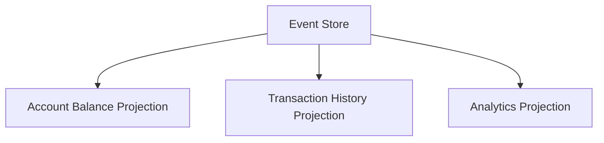

Audit opens a ticket. The account shows `balance = $5,000`. The question is not the number. It is:

> Why does the account have $5,000?

A CRUD model answers where you are. One row, one column, one value. It does not answer how you got there. Deposits, withdrawals, a charge posted by mistake, the order of the operations: if you did not persist them as facts, they are gone. You have logs, if someone configured them, or an operator's memory.

That is not a SQL bug. It is a persistence decision. Most applications store current state and treat the past as an optional extra. Event Sourcing inverts that: events are the source of truth; the balance is a projection you can compute again.

It is not a CRUD upgrade, not "we use Kafka", and not CQRS under another name. It is an expensive pattern that fits a narrow set of domains. Microsoft says it plainly: for most systems, traditional data management is enough, and migrating to or from Event Sourcing is costly.

The useful question is not "what is Event Sourcing." It is this:

> When should the history of changes be the source of truth, and when is persisting current state the right call?

## What Event Sourcing actually is

Martin Fowler puts it this way: Event Sourcing ensures that **every change to application state is stored as a sequence of events**. You can query those events. You can also use them to reconstruct past states.

A **domain event** is a fact that already happened, in the language of the business. It is not `SET balance = 1400`. It is `MoneyDeposited { amount: 1000 }`. It captures intent, not only the result. Microsoft leans on that difference: an event that says "42 seats remain" is a change log with no business meaning. An event that says "two seats were reserved" tells you what happened, and leaves you free to build other views later.

Events are **immutable**. Once appended, they are not edited. If an operation was wrong, there is no `UPDATE` or `DELETE` on the history. There is a new event that compensates the effect. The past stays. You do not take an eraser to a ledger.

An account sequence can look like this:

```text
AccountCreated
MoneyDeposited    amount: 1000
MoneyWithdrawn    amount:  300
MoneyDeposited    amount:  700
```

Current state does not live in a column. It is derived:

```text
0
+ 1000
-  300
+  700
------
1400
```

That derivation is Event Replay: start from empty state (or from a snapshot) and apply each event in order. Fowler calls a full discard-and-rebuild a _complete rebuild_. A _temporal query_ stops the replay at a point in the past: the balance at 14:03 on Tuesday is not a historical row. It is the same fold, cut short.

The persistence contrast is this:

```text
CRUD:     State  --> source of truth
ES:       Events --> source of truth
          State  --> derived projection
```

## CRUD vs Event Sourcing

In CRUD, an account is the current state:

```text
Account
---------
id
balance
```

A deposit of $1,000 is `UPDATE accounts SET balance = balance + 1000`. When it commits, the previous value is gone from that row. You keep where you are. Unless you built auditing on the side, you lose which operation changed it, with what intent, in what order, and what the balance was just before.

In Event Sourcing, the account is not "saved." It is appended:

```text
Event Store
-------------------------
AccountCreated
MoneyDeposited
MoneyWithdrawn
MoneyDeposited
```

You keep the full history. The balance is computable. What you do not get for free is a cheap `SELECT balance FROM accounts`. That query needs a projection, a snapshot, or a replay.

CRUD is not the poor model. It is the right model when the business asks for the current document: a profile, a post, a config flag. Event Sourcing is not the sophisticated model. It is the right model when the business asks for the ledger: what happened, in which order, and how to rebuild the world at a point.

## Event Store, streams, and replay

An **Event Store** is the append-only store for those events. It is the system of record: the authoritative source for current state, which you materialize by replaying. It can be a database built for streams, or a relational or document table with append-only discipline. What it is not: a message broker.

Microsoft draws the line: do not confuse an Event Store with an eventstream message broker. Kafka, RabbitMQ, Pub/Sub, or EventBridge distribute. They typically lack per-entity stream queries and optimistic concurrency on append. A bus can sit _after_ the store. It does not replace it.

Events for one entity live in an **event stream**: the ordered sequence of everything that happened to it. An account is not a row. It is a stream:

```text
stream: account-123

version 1 --> AccountCreated
version 2 --> MoneyDeposited
version 3 --> MoneyWithdrawn
version 4 --> MoneyDeposited
```

Order comes from the stream version, not a wall-clock timestamp. Two concurrent writers that read the same version and try to append the next one collide: the store rejects the second append if the version already moved. The handler reloads, re-evaluates the rules, and retries. That is optimistic concurrency on a log, not an `UPDATE` with a row lock. The same fight of two requests over one exclusive resource shows up here as two appends at the same version; the race itself is covered in [race conditions](/blog/race-conditions-when-two-requests-buy-the-same-thing/).

**Rehydration** is reconstructing the entity by replaying its stream. A "withdraw $300" command does not read `balance` from a table. It loads `account-123`, applies events in order, gets `{ balance: 1400 }`, checks whether the withdrawal is legal, and appends `MoneyWithdrawn`. The in-memory aggregate is derived. The stream is the fact.

Replay also answers _when_. The balance after version 2 is $1,000. After version 3, $700. History is not a debug log taped to the side. It is the only material the system can use to rebuild those points.

AWS describes the same mechanism in its Event Sourcing pattern: a known initial state plus ordered replay produces current state or a point-in-time view. It recommends not always starting from the beginning of time. That is where snapshots come in.

## Snapshots

Replay from event 1 works in the four-line example. It does not work the same way when an active account has ten thousand or a million events. Every command that rehydrates the aggregate pays the full cost.

A **snapshot** is a serialization of the entity's state at a point in the stream. It does not replace the events. It is a shortcut:

```text
Events 1 ──────────────── 10000
                            │
                        Snapshot
                            │
Events 10001 ──────────── 10100
```

To rehydrate, load the most recent snapshot and replay only what follows. Microsoft is explicit: snapshots are an optimization, not a replacement for the eventstream. The stream remains the source of truth. If the snapshot is corrupt, regenerate it. If the shape of state changes, regenerate it. AWS says the same: take periodic snapshots and apply a smaller number of events to reach current state.

How often to snapshot is a storage-versus-rehydration trade-off. CRUD never asks you that question. Event Sourcing moves it into the runtime.

## Projections

If the Event Store is hard to query — Microsoft notes there is no standard SQL over events, only streams by identifier — the system needs other ways to read.

A **projection** is a read model derived from the events. The same stream feeds different views:


```mermaid
flowchart TD
  eventStore[Event Store]
  eventStore --> balance[Account Balance Projection]
  eventStore --> history[Transaction History Projection]
  eventStore --> analytics[Analytics Projection]
```

The UI balance does not have to come from a `reduce` on every GET. A projection can keep `account-123 → 1400` in a table ready to read. Movement history can be another table. An analytic rollup — deposits per day, withdrawals per channel — another. None of those tables is the source of truth. If one is wrong, delete it and project again from the store.

## Event Sourcing is not CQRS, and not Event-Driven Architecture

Three patterns get collapsed into one word. **CQRS** splits the model you write with from the model you read with; Fowler is blunt that it is not really about events, and you can use it with none. **Event-Driven Architecture** is components reacting to events, usually to decouple: event notification, or event-carried state transfer. **Event Sourcing** records every change as an event _so you can rebuild state_.

| Concept                   | What it is                                                       | What it is not                             |
| ------------------------- | ---------------------------------------------------------------- | ------------------------------------------ |
| Event Sourcing            | Events are the system of record. State is derived.               | Publishing messages. Having Kafka.         |
| Event-Driven Architecture | Components that react to events, usually to decouple.            | Persisting history as the source of truth. |
| Domain Event              | A domain fact (`MoneyDeposited`).                                | A transport message.                       |
| Message broker            | Distributes messages (Kafka, RabbitMQ, Pub/Sub, EventBridge).    | An Event Store.                            |
| Event Store               | Append-only, per-entity streams, replay, optimistic concurrency. | A topic.                                   |
| CQRS                      | Different models for command and query.                          | Event Sourcing.                            |

They combine well, and often do: a command reaches the aggregate, the aggregate appends events to the store, projections build read models, and a broker fans the persisted events out to other contexts. Microsoft describes that pairing with the Event Store as the write model and single source of truth. None of those pieces implies the others. Event Sourcing without CQRS replays the stream when it needs the aggregate. CQRS without Event Sourcing keeps current state in the write model. Kafka or [Pub/Sub](/blog/google-cloud-pubsub-how-to-use-it-correctly/) on top of `UPDATE accounts SET balance` is CRUD with a channel. Neither pattern even requires asynchrony: a git commit is synchronous.

In NestJS, [`@nestjs/cqrs`](https://docs.nestjs.com/recipes/cqrs) gives you commands, queries, and an in-process bus. A `CommandHandler` can append to a stream or run an `UPDATE`; the module does not choose the pattern.

## An account, a ledger, a mistake

The banking example is conceptual. Fowler notes a strong synergy between Event Sourcing and accounting systems: audit matters, and an account can be seen as the log of its accounting entries. That is not a claim about any bank's internal architecture. It is why the domain _looks like_ the pattern: the balance does not explain the movement; the movement explains the balance.

```text
AccountCreated
MoneyDeposited       + $2,000
MoneyWithdrawn       - $  500
MoneyDeposited       + $3,000
MoneyWithdrawn       - $  100
```

Derived state: **$4,400**.

Questions a financial system often has to answer, and that a `balance` row does not answer on its own:

- What was the balance before the second deposit?
- Which operations changed it, and in which order?
- When did each one happen?
- If a deposit was credited twice because of a bug, what was recorded?
- How do we rebuild the account in a test environment from the same facts?
- How does someone audit the account without trusting an application log nobody guarantees is complete?

Replay through the second event: $2,000. Through the third: $1,500. The history _is_ the audit, not a sidecar.

Now the $3,000 deposit was a mistake. CRUD invites an `UPDATE`, or deleting a row from a parallel history table. Event Sourcing does not erase the fact. It appends compensation:

```text
MoneyDeposited     amount: 3000
DepositReversed    amount: 3000
```

`DELETE` / `UPDATE` rewrite the past. A **compensating event** leaves the error and records the correction. Microsoft uses the same shape for reservations: `ReservationCanceled` does not remove `SeatsReserved`. The stream tells both stories. Greg Young compares it to a ledger: you do not erase in the middle. If you cannot model a correction, ask how accounting would do it.

The balance is $1,400 again. The auditor sees the deposit and the reversal. That is the value of the pattern in this domain. It is not magic, and it is not free: you now have to design `DepositReversed`, make processing it idempotent, and decide how a projection shows reversed movements.

## Idempotency

Delivery to projections and consumers is typically at-least-once, and Microsoft treats that as a requirement of the pattern. If `MoneyDeposited { eventId: "evt-123", amount: 1000 }` arrives twice, the projection must credit +1000 once. Track the last processed sequence number per consumer, or treat `eventId` as an idempotency key when applying the side effect. Absolute updates (set the balance to a value) repeat safely; difference events (add 1000) need the key.

It is the same uncertainty that makes retrying `POST /payments` unsafe — [API idempotency](/blog/idempotency-in-apis/) covers the HTTP side. Event Sourcing does not remove that work. It puts it on every projection.

## Consistency, complexity, and versioning

Event Sourcing does not remove complexity. It moves it.

**Eventual consistency.** Materialized views and projections update after the append. There is a window where the command has persisted and a GET still shows the old balance. Microsoft asks that the product and the customer understand that window. If the UI needs read-your-writes immediately, either project in the same request, or Event Sourcing is a poor fit.

**Asynchronous processing.** It is not required — Fowler underlines that with git — but it is the usual path to projections and integration. Queues, retries, ordering, dead letters: the operational cost of EDA stacks on top of the store.

**Ordering and concurrency.** An entity's state depends on the order of its stream. Optimistic concurrency prevents lost updates on one aggregate. It does not resolve conflicts across aggregates: stock dropping while someone reserves the last seat. That remains a design problem, now split across streams.

**Projections.** Each read model is code that can diverge, lag, or duplicate effects. Regenerating a projection is a real advantage. Operating it is ongoing work.

**Debugging and replay.** You can reproduce production in a test environment by replaying real facts. You can also re-fire external notifications if the gateway cannot tell replay from live time. Fowler spends a section on external systems: disable gateways during rebuild, remember answers to external queries, do not treat a replay as a new charge.

**Snapshots.** An optimization you have to invalidate, version, and regenerate.

**Event versioning.** Today the event is:

```json
{
  "type": "MoneyDeposited",
  "amount": 1000
}
```

Tomorrow the domain needs currency:

```json
{
  "type": "MoneyDeposited",
  "amount": 1000,
  "currency": "USD"
}
```

Old events are not rewritten. New code has to read them. Microsoft lists strategies, alone or combined:

- **Tolerant deserialization:** ignore unknown fields, default missing ones. Works for additive changes.
- **Event versioning:** a version identifier in the envelope or the type. The consumer picks the handler.
- **Upcasting:** functions that lift the old schema to the current one at deserialization. The domain only sees the latest version. Stored events do not change.
- **In-place migration:** rewrite the store. Breaks immutability. Last resort, because it guts the audit trail.

## When to use Event Sourcing

Microsoft, Fowler, and AWS agree more on the _why_ than on a checklist. It fits when:

- **audit is a domain requirement** — the business must explain every change with facts the system cannot rewrite, not "a log just in case";
- **history is the domain** — a ledger, an order pipeline, contended reservations where what happened matters as much as the current value;
- **you must rebuild past or test state** — temporal queries, point-in-time recovery, reproducing an incident from the same events;
- **several read models come from one history** — balance, statement, analytics, integration;
- **workflows compensate** — a step is reversed by a new fact, not deleted;
- **intent matters** — _Moved home_ or _Closed account_ instead of a `status` that overwrites the previous one.

Apply it **selectively**. Microsoft's examples: a payment ledger or an order pipeline, yes; a user profile or application configuration, no. One Bounded Context, not the whole system.

## When not to use it

Do not use it because it is a modern architecture.

CRUD is the right model when the business asks for the current document and history has no domain value:

```text
User Profile
Blog Post
Configuration
Simple Catalog
Basic Administration
```

If nobody will reconstruct states, audit with immutable facts, or derive three read models from the same log, the Event Store is cost without return. Microsoft explicitly rules out straightforward CRUD systems, prototypes and MVPs, mostly static data (catalogs, lookup tables), and teams without event-driven experience. It also rules out cases that need immediate consistency of the views.

The complexity of designing events, versioning them, projecting them, and operating replay is not justified if the only requirement is reading and writing current state. A blog post does not need `PostBodyChanged` as the source of truth. A feature flag does not either.

If what you want is to decouple notifications, use a broker. If what you want is to scale reads, sometimes a read replica or a reporting database is enough — Fowler reminds that as an alternative to CQRS. Event Sourcing is the decision that the past cannot be lost. If the past does not matter, do not take it.

## Replay in TypeScript

This is not an Event Store. It is the fold that rebuilds state. The rest of the pattern — persistence, versions, projections — sits on this function.

```ts
type Account = {
  accountId: string | null;
  balance: number;
};

type AccountEvent =
  | { type: "AccountCreated"; accountId: string }
  | { type: "MoneyDeposited"; amount: number }
  | { type: "MoneyWithdrawn"; amount: number };

const initialState: Account = {
  accountId: null,
  balance: 0,
};

function applyEvent(state: Account, event: AccountEvent): Account {
  switch (event.type) {
    case "AccountCreated":
      return { accountId: event.accountId, balance: 0 };
    case "MoneyDeposited":
      return { ...state, balance: state.balance + event.amount };
    case "MoneyWithdrawn":
      return { ...state, balance: state.balance - event.amount };
  }
}

const events: AccountEvent[] = [
  { type: "AccountCreated", accountId: "account-123" },
  { type: "MoneyDeposited", amount: 1000 },
  { type: "MoneyWithdrawn", amount: 300 },
  { type: "MoneyDeposited", amount: 700 },
];

const account = events.reduce(applyEvent, initialState);
// { accountId: "account-123", balance: 1400 }
```

`applyEvent` is pure: same state, same event, same result. A temporal query is `events.slice(0, n).reduce(applyEvent, initialState)`. A snapshot would be a serialized `Account` plus the index of the last included event; replay would continue with `events.slice(snapshot.version)`.

There is no I/O. There is no NestJS. In a Nest service, this `reduce` lives inside the aggregate. The `CommandHandler` loads the stream, calls `applyEvent`, decides, appends. The framework's CQRS module does not appear in this code because you do not need it to understand the pattern.

## Common mistakes

- **An audit log beside CRUD.** If the balance can change without going through the log, the log is not the source of truth.
- **"We use Kafka, so we do Event Sourcing."** A broker distributes. The Event Store persists per-entity streams and rejects concurrent appends at the same version.
- **Assuming it requires CQRS, or the reverse.** They combine; neither implies the other.
- **Editing stored events.** The correction is a compensating event. Rewriting the store is the last versioning resort, not the first.
- **Ignoring idempotency or versioning.** A duplicated `+amount` doubles money; the first event you store will age.
- **Replaying millions of events per command.** Snapshots are the mitigation, never the source of truth.
- **CRUD-shaped events.** `BalanceUpdated { value: 42 }` or `UserUpdated` turn the store into an expensive change log. `SeatsReserved { count: 2 }` captures intent.
- **Adopting it without a business need.** Once part of the system is event-sourced, future design decisions there are constrained by that fact.

## Conclusion

Event Sourcing earns its cost when the business has to explain how it reached the current state: ledgers, contended reservations, workflows that compensate. Where CRUD describes the current document and nobody asks about the path, the store, the projections, and the versioning are complexity without a return. Apply it to one Bounded Context, not to the user profile or the config flag.

**Choose an architecture because it answers the domain, not because it is sophisticated.**

## Sources

- Martin Fowler, [Event Sourcing](https://martinfowler.com/eaaDev/EventSourcing.html)
- Martin Fowler, [What do you mean by “Event-Driven”?](https://martinfowler.com/articles/201701-event-driven.html)
- Martin Fowler, [CQRS](https://martinfowler.com/bliki/CQRS.html)
- Microsoft Azure Architecture Center, [Event Sourcing pattern](https://learn.microsoft.com/en-us/azure/architecture/patterns/event-sourcing)
- Microsoft Azure Architecture Center, [CQRS pattern](https://learn.microsoft.com/en-us/azure/architecture/patterns/cqrs)
- AWS Prescriptive Guidance, [Event sourcing pattern](https://docs.aws.amazon.com/prescriptive-guidance/latest/cloud-design-patterns/event-sourcing-pattern.html)
- Greg Young, [Versioning in an Event Sourced System](https://leanpub.com/esversioning)
- NestJS, [CQRS](https://docs.nestjs.com/recipes/cqrs)
