Dos desarrolladores cambian `UserService` la misma tarde. Ambos commits son correctos por separado. El segundo push es rechazado. El pull request se pone rojo. Alguien escribe `git pull` sin saber si eso hará merge, rebase, o se negará a moverse. Alguien más escribe `git reset --hard` porque un tutorial dijo que «descarta los cambios locales».

Eso no es que falte Git. Es un modelo que falta.

Git no es una lista de comandos. Es una forma de registrar cómo evoluciona un codebase: snapshots, punteros, y unas pocas operaciones que mueven esos punteros. GitHub no es «la nube donde vive el repo». Es la capa de colaboración que convierte esos snapshots en revisión, política, automatización y release.

Si solo memorizas comandos, cada conflicto se siente como un crash. Si entiendes el modelo, el mismo conflicto es un merge predecible de dos snapshots.

> Git gestiona la evolución del código. GitHub convierte esa historia en un workflow de equipo.

## Git no es GitHub

Git es un sistema de control de versiones distribuido. Corre en tu máquina. Almacena la historia completa de un proyecto como un grafo de commits, y te permite crear, comparar e integrar líneas de trabajo sin hablar con un servidor.

GitHub es una plataforma de hosting y colaboración construida sobre repositorios Git. Añade pull requests, revisión de código, issues, permisos, protección de ramas, y CI/CD. Puedes usar Git sin GitHub. No puedes usar GitHub como sustituto de Git.

La confusión es fácil de adquirir. `git clone` habla con GitHub, `git push` actualiza GitHub, y el sitio web muestra ramas. Las herramientas comparten objetos. No comparten trabajos.

| Git                           | GitHub                                      |
| ----------------------------- | ------------------------------------------- |
| Sistema de control de versiones | Plataforma de colaboración                |
| Funciona localmente           | Servicio remoto                             |
| Almacena historia como commits | Aloja repositorios y personas              |
| Ramas y merges                | Pull requests y revisión                    |
| `merge` / `rebase` / `revert` | CI checks, políticas y botones de merge     |

Git se convirtió en el default porque es local-first, basado en snapshots, y barato para hacer ramas. La mayoría de operaciones no necesitan la red. Puedes hacer commit en un avión, inspeccionar el árbol del mes pasado sin preguntar a un servidor, y crear una línea de feature en milisegundos porque una rama es un puntero, no una copia del proyecto.

GitHub se convirtió en el compañero default porque el software lo escribe más de una persona. Un repositorio Git remoto puede almacenar objetos. Un equipo todavía necesita un lugar para proponer un cambio, requerir una revisión, correr tests, y rechazar un force-push a `main`.

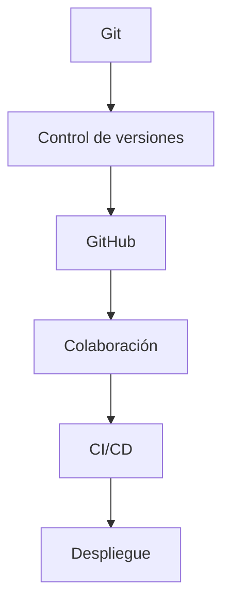

Configura tu identidad antes del primer commit. Git registra `user.name` y `user.email` en cada snapshot. Eso es configuración de Git, no un login de GitHub.

```bash
git config --global user.name "Your Name"
git config --global user.email "you@email.com"
git config --global init.defaultBranch main
```

`main` es el nombre de rama default habitual en GitHub y en setups actuales de Git. Es una convención, no una ley de Git. Repositorios más antiguos todavía usan `master`. Lo que importa es que el equipo acuerde una rama default y la proteja.

## El modelo antes de los comandos

Git tiene tres lugares donde puede vivir un archivo, y unos pocos nombres que la gente trata como carpetas cuando en realidad son punteros.

**Working tree.** Los archivos en disco que editas. Esto es un checkout de un commit, más lo que hayas cambiado desde entonces. No es la fuente de verdad.

**Staging area (index).** Un snapshot preparado para el siguiente commit. `git add` copia contenido del working tree a esta lista. Las ediciones no staged se quedan en el working tree. El index es una lista plana de rutas; Git la convierte en un objeto tree solo cuando haces commit.

**Repositorio (`.git`).** La base de datos de objetos y las referencias. Commits, trees, blobs y tags viven aquí. Clone copia esta base de datos. Casi toda operación Git lee o escribe este directorio.

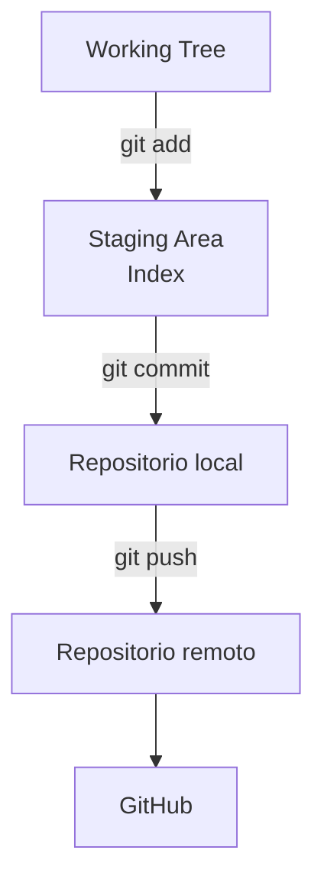

Un archivo está **modificado** cuando el working tree difiere del index. Está **staged** cuando el index difiere de `HEAD`. Está **commiteado** cuando ese snapshot se almacena como un objeto commit en la base de datos.

Un **commit** es un snapshot del proyecto más metadatos: autor, mensaje, timestamp, y punteros a commits padres. Git no almacena un commit como «el diff desde la última vez». Conceptualmente almacena el árbol completo. Los archivos sin cambios se reutilizan por hash de contenido, que es por qué esto es barato. La historia es un grafo de snapshots, no una pila de parches.

Una **rama** es un puntero movible a un commit. No es una copia del proyecto, y no es una carpeta de archivos. Crear `feature/google-auth` escribe una ref, normalmente bajo `refs/heads/`. Los archivos en disco cambian solo cuando cambias a esa ref y Git actualiza el working tree para coincidir con el snapshot al que apunta.

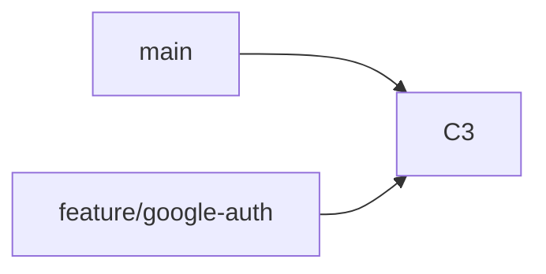

Después de que hagas commit en `feature/google-auth`, solo ese puntero se mueve. `main` sigue apuntando a `C3`.

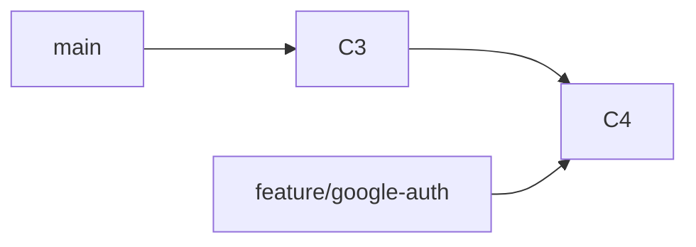

**HEAD** es cómo Git sabe dónde estás. Normalmente es una ref simbólica: «Estoy en `feature/google-auth`». Un nuevo commit entonces mueve ese puntero de rama. Si HEAD apunta directamente a un commit en lugar de a una rama, estás en detached HEAD: puedes mirar alrededor, pero los nuevos commits no pertenecerán a una rama hasta que los adjuntes.

Un **remote** es una URL con nombre para otro repositorio. **`origin`** es solo el nombre convencional que Git asigna al remote del que clonaste. No es un servidor especial ni un sinónimo de GitHub. Puedes tener varios remotes (`origin`, `upstream`) apuntando a hosts distintos.

Una **rama de seguimiento remoto** como `origin/main` es un marcador local del último tip que descargaste de ese remote. `git status` diciendo «up to date with `origin/main`» está comparando tu rama con ese marcador, no llamando a GitHub en vivo.

Ese es todo el modelo. Los comandos se vuelven más fáciles una vez que preguntas, para cada uno: ¿cuál de estas cosas cambió?

## El ciclo fundamental

La mayoría de los días mueves trabajo a través de los mismos cinco estados: editar, inspeccionar, hacer stage, commit, publicar. Los comandos de abajo son el vocabulario para ese bucle, no una lista para memorizar.

### `git init` y `git clone`

`git init` crea un repositorio en el directorio actual. Escribe `.git` y, con un default moderno, una rama `main`. No crea un repositorio de GitHub y no configura un remote.

`git clone <url>` copia un repositorio existente, hace checkout de la rama default, y registra esa URL como `origin`. No cambia el remote. Te da una historia local completa.

Usa `init` cuando el proyecto empieza en tu máquina. Usa `clone` cuando la fuente de verdad ya existe en otro lugar. El error común es inicializar dentro de un directorio que querías clonar, y después pelear con dos historias no relacionadas.

### `git status`

`status` compara working tree, index, y `HEAD`. Te dice qué está modificado, qué está staged, en qué rama estás, y cómo esa rama se relaciona con su marcador upstream.

No cambia nada. Ejecútalo antes de `add`, antes de `commit`, y antes de asumir que un pull es seguro. El error común es hacer commit porque el editor parece guardado, sin comprobar qué ve Git realmente.

### `git add`

`git add` actualiza el index. `git add src/auth/google.ts` hace stage de un archivo. `git add .` hace stage de cada cambio bajo el directorio actual que no esté ignorado.

No crea un commit. No envía nada a GitHub. No hace stage de archivos ignorados. El error común es `git add .` como reflejo, y después descubrir un `.env` o un dump de debug en el siguiente commit. Haz stage del cambio que pretendes registrar.

`.gitignore` es cómo mantienes archivos generados y secretos fuera de ese reflejo:

```text
node_modules/
dist/
build/
.env
.env.local
*.log
.DS_Store
```

### `git commit`

`git commit` lee el index, escribe un objeto commit, y mueve el puntero de la rama actual. El working tree queda igual. El remote queda igual.

```bash
git commit -m "feat: add Google authentication"
```

`-m` es conveniente. Para cualquier cosa no trivial, un commit con editor con un asunto y un cuerpo es más claro. `git commit -am` hace stage de archivos rastreados y commit en un paso. No recogerá archivos nuevos sin rastrear. Trátalo como un atajo, no un hábito.

El error común es hacer commit porque la feature «más o menos funciona», y después usar los seis commits siguientes para disculparte. Un commit debería ser un snapshot coherente que estarías dispuesto a revertir por sí solo.

### `git log` y `git diff`

`git log` lee la historia. No la cambia.

```bash
git log --oneline
git log --graph --oneline --all
```

`git diff` compara árboles. `git diff` sin argumentos es working tree versus index: lo que no has hecho stage. `git diff --staged` es index versus `HEAD`: lo que contendrá el siguiente commit. Esa división es la razón por la que existe el staging. Puedes editar cinco archivos y commitear dos.

```bash
git diff
git diff --staged
```

Ninguno de los dos comandos publica nada. El error común es hacer push después de mirar solo `git status` y nunca leer el diff del stage.

### `git push` y `git pull`

`git push` envía commits locales que el remote no tiene, y actualiza el puntero de rama remota. No ejecuta tests. No crea un pull request. No cambia tu working tree.

`git pull` no es «descargar». Es `git fetch` más un paso de integración. Fetch actualiza las ramas de seguimiento remoto. La integración entonces intenta mover tu rama actual para incluir ese trabajo. Cómo integra depende de la configuración: merge, rebase, o fast-forward only.

En un Git actual, si no has elegido una estrategia de reconciliación, `git pull` por defecto hace fast-forward only: actualiza la rama cuando tu historia es un ancestro estricto del tip remoto, y se niega cuando las historias han divergido. Ese rechazo es una feature. Impide que Git invente un merge que no pediste.

El error común es tratar `pull` como un sync inofensivo y `push` como «sube mi carpeta». Push publica commits. Pull combina dos historias. Son operaciones diferentes con modos de fallo diferentes.

Un bucle del primer día en un repo existente se ve así:

```bash
git clone git@github.com:org/payments.git
cd payments
git status
# edita archivos
git add src/auth/google.ts
git commit -m "feat: add Google authentication"
git push -u origin HEAD
```

`-u` configura el upstream para que después `git push` y `git pull` sepan qué rama remota usar. Después de eso, el trabajo interesante no es el bucle. Es cómo aislas ese trabajo de `main`.

## Las ramas son líneas de trabajo, no copias

Crea una rama cuando el trabajo tiene una razón para existir independientemente de `main`: una feature, un fix, un experimento. No crees una rama porque un documento de proceso dijo que cada cambio necesita un nombre con forma de ticket.

```text
main
 │
 ├── feature/google-auth
 │
 ├── feature/payments-webhook
 │
 └── fix/login-redirect
```

```bash
git branch                     # lista ramas locales
git switch main                # mueve HEAD a main
git switch -c feature/google-auth
git branch -d feature/google-auth
```

`git switch -c` crea la ref y apunta HEAD a ella. `git branch feature/google-auth` solo crea el puntero; sigues en la rama anterior hasta que cambies. `git switch` reemplazó la mitad de «cambiar ramas» de `git checkout` en Git 2.23. `checkout` sigue funcionando. Para nueva memoria muscular, prefiere `switch` para ramas y `restore` para archivos.

`git branch -d` borra una rama local que Git considera completamente mergeada. `-D` fuerza el borrado de una rama sin mergear. Borrar una rama borra un puntero, no los commits. Los commits permanecen hasta que nada los referencia y Git los garbage-collecta. Si el trabajo fue mergeado a través de un pull request, los commits ya son alcanzables desde `main`.

Nombra las ramas para que un revisor pueda adivinar el trabajo desde la ref: `feature/google-auth`, `fix/login-redirect`, `hotfix/expired-token`. Ese naming es una convención de equipo. A Git no le importa.

Un **hotfix** es solo una rama con urgencia: producción está mal, el fix es pequeño, y debería aterrizar en la rama default con menos ceremonia que una feature. No inventes una segunda estrategia de branching para cada bug de producción. Si `main` es lo que despliegas, arregla desde `main` y abre un pull request.

Una **tracking branch** es una rama local con un upstream, normalmente `origin/feature/google-auth`. Después de `git push -u origin feature/google-auth`, `git status` puede decirte si estás ahead, behind, o diverged. Fetch actualiza el marcador upstream. No mueve tu rama local.

Una estrategia de branching es excesiva cuando el equipo pasa más tiempo moviendo commits entre ramas de larga vida que cambiando el producto. Existen tres modelos comunes. Ninguno de ellos es «la forma de Git».

| Modelo       | Forma                                                               | Encaja cuando                                                           |
| ------------ | ------------------------------------------------------------------- | ----------------------------------------------------------------------- |
| GitHub Flow  | Rama desde `main`, abre un pull request, mergea de vuelta a `main`  | Despliegas desde la rama default y quieres un bucle de revisión corto   |
| Git Flow     | `develop` de larga vida, más líneas de `release` y `hotfix`         | Publicas releases versionados en una cadencia más lenta                 |
| Trunk-based  | Ramas de corta vida, o commits a un trunk compartido, detrás de flags | Integras continuamente y puedes ocultar trabajo sin terminar          |

[GitHub Flow](https://docs.github.com/en/get-started/using-github/github-flow) es el que este artículo usa para el ejemplo de equipo: una rama default, ramas de topic, pull requests, borra la rama cuando el trabajo está hecho. Git Flow es un modelo de release-train, no un tutorial de principiante. Trunk-based development es una disciplina sobre frecuencia de integración, no una feature de Git. Elige el modelo más pequeño que encaje con cómo realmente publicas.

## Qué hace un commit profesional

`git commit -m "message"` registra lo que esté en el index. No hace ese snapshot útil.

Un buen commit es lo bastante pequeño para revisar, lo bastante coherente para revertir, y lo bastante bien descrito para que `git log --oneline` siga teniendo sentido en seis meses. «Pequeño» no significa un archivo. Significa una razón. Añadir Google sign-in es una razón. Reformatear toda la carpeta `auth` en el mismo snapshot son dos razones compartiendo un hash.

Escribe el asunto en imperativo, como si completaras «This commit will…»: `add Google authentication`, no `added` ni `adding`. Git mismo usa esa voz en mensajes generados (`Merge branch…`, `Revert "…"`).

Evita asuntos que solo reportan actividad: `fix`, `changes`, `update`, `wip`. Le dicen a un lector futuro que algo pasó y ocultan qué. Si necesitas un snapshot temporal mientras saltas a un bug, di eso, después reescríbelo o haz squash antes del pull request si el equipo reescribe ramas de topic.

Separa refactors de cambios de comportamiento. Un revisor que ve un move de 400 líneas y un nuevo callback de OAuth en el mismo diff no puede distinguir qué líneas son el riesgo. Dos commits, o dos pull requests, hacen la decisión más barata.

[Conventional Commits](https://www.conventionalcommits.org/) es una convención de mensaje, no una feature de Git. Git acepta cualquier string. Los equipos usan un prefijo para que changelogs y automatización puedan clasificar la historia:

```text
feat: add payment webhook
fix: handle expired access token
refactor: extract authentication service
docs: update installation guide
```

Usa la convención si el equipo ya corre tooling sobre ella. No trates `feat:` como prueba de profesionalismo. Una frase precisa sigue ganando a un prefijo en un asunto inútil.

`git commit --amend` reemplaza el último commit con uno nuevo. Eso reescribe la historia. Haz amend de un commit que existe solo en tu máquina cuando olvidaste un archivo o escribiste mal el asunto. No hagas amend de un commit que otras personas puedan haber pulleado.

```bash
git add src/auth/google.test.ts
git commit --amend --no-edit
```

## Merge vs rebase

Ambos comandos integran una línea de trabajo en otra. Producen el mismo árbol si las resoluciones son las mismas. No producen la misma historia.

Empieza desde un grafo divergido:

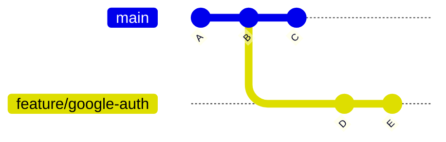

**Merge** crea un nuevo commit con dos padres. Registra que dos historias se encontraron. Los commits originales mantienen sus hashes.

```bash
git switch main
git merge feature/google-auth
```

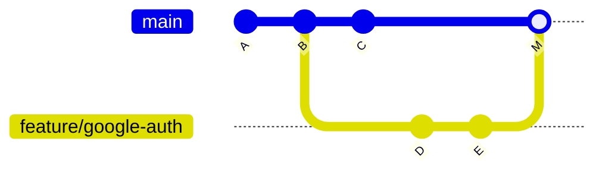

Merge resuelve «combina estas ramas y mantén el hecho de que fueron paralelas». Es el modelo mental default para integrar un pull request revisado cuando el equipo quiere que la unión sea visible. Fast-forward merge es el caso especial donde `main` no se movió: Git puede simplemente deslizar el puntero a `E` y saltarse `M`.

**Rebase** reaplica tus commits encima de otro tip. Git calcula los cambios introducidos por `D` y `E`, mueve la rama a `C`, y aplica esos cambios como commits nuevos. Los snapshots al final pueden coincidir con un merge. Los hashes no.

```bash
git switch feature/google-auth
git rebase main
```

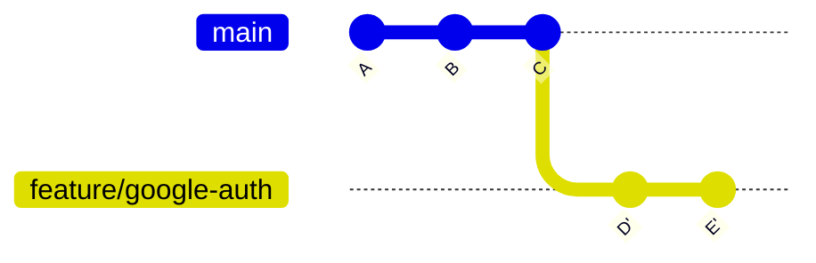

Rebase resuelve «haz que mi trabajo local parezca que empezó desde el `main` actual». Eso es útil antes de abrir un pull request, cuando los commits todavía te pertenecen. La historia queda lineal. Los revisores leen una historia en lugar de una trenza de merge commits.

El coste es que `D'` y `E'` son objetos nuevos. Cualquiera que basó trabajo en `D` o `E` ahora tiene los commits viejos. La regla de Pro Git es la que importa:

> Rebase es para reorganizar trabajo local. No hagas rebase de commits que existen fuera de tu repositorio y sobre los que otras personas pueden haber basado trabajo.

Interactive rebase (`git rebase -i HEAD~3`) puede reordenar, squash, o reword esos commits locales. Misma regla: hazlo antes de compartir la rama, o en una rama de topic que el equipo acuerda que es tuya.

Un default práctico para un equipo con GitHub Flow: haz rebase (o merge) de `main` en tu rama de topic para mantenerte al día; mergea el pull request con la estrategia que el repositorio permita. No hagas rebase de `main`. No hagas rebase de una rama donde tres compañeros están pusheando.

## Reset, restore, revert

Estos tres nombres se usan como si fueran sinónimos de «deshacer». No lo son.

**`git restore`** cambia archivos. No mueve una rama. Restaura un archivo del working tree desde el index, o restaura el index desde `HEAD`, cuando quieres descartar o quitar del stage ediciones y dejar la historia tranquila.

```bash
git restore src/auth/google.ts          # descarta ediciones unstaged en ese archivo
git restore --staged src/auth/google.ts # quita del stage, mantiene el working tree
```

**`git reset`** mueve el puntero de la rama actual. Opcionalmente también actualiza el index y el working tree. Eso es una reescritura de historia para la rama en la que estás.

| Comando                     | Mueve rama         | Index              | Working tree       | Uso típico                            |
| --------------------------- | ------------------ | ------------------ | ------------------ | ------------------------------------- |
| `reset --soft`              | Sí                 | Conservado         | Conservado         | deshaz un commit, mantén todo staged  |
| `reset --mixed` (default)   | Sí                 | Coincide con target | Conservado        | deshaz un commit, mantén ediciones unstaged |
| `reset --hard`              | Sí                 | Coincide con target | Coincide con target | descarta commits y trabajo sin commitear |
| `revert`                    | No (añade commit)  | Nuevo snapshot     | Actualizado        | deshaz un cambio publicado            |

```bash
git reset --soft HEAD~1    # quita el último commit, mantiene sus cambios staged
git reset HEAD~1           # quita el último commit, mantiene los cambios unstaged
git revert <commit>        # añade un commit que invierte <commit>
```

`reset --hard` es el peligroso. Mueve la rama y hace que el index y el working tree coincidan con el target. El trabajo sin commitear desaparece del working tree. Úsalo solo cuando puedas apuntar al snapshot que quieres y no necesites las ediciones descartadas.

`git revert` es el undo seguro en una rama compartida. No borra el commit malo. Registra un nuevo commit que aplica el inverso. `main` sigue siendo una historia válida para todos los que ya pullearon.

`git push --force` sobreescribe el puntero de rama remota con el tuyo. Si alguien más pusheó commits que no tienes, esos commits desaparecen de la rama. Por eso force-push no es un paso de workflow normal, y por qué las ramas default protegidas lo rechazan.

Cuando realmente necesitas actualizar una rama de topic remota después de un rebase, prefiere `--force-with-lease`. Git actualiza el remote solo si todavía apunta al tip que descargaste por última vez. Si un compañero pusheó mientras tanto, el push es rechazado en lugar de borrar silenciosamente su trabajo.

```bash
git push --force-with-lease origin feature/google-auth
```

Incluso `--force-with-lease` es una reescritura. Úsalo en una rama que posees, nunca como forma de «arreglar» `main`.

## Los diffs son comparaciones, no un solo comando

`git diff` siempre responde «¿qué es diferente entre estos dos árboles?» Los argumentos eligen los árboles.

```bash
git diff                  # working tree vs index
git diff --staged         # index vs HEAD
git diff HEAD             # working tree vs HEAD (staged y unstaged)
git diff main...feature/google-auth
```

`git diff main..feature/google-auth` (dos puntos) compara el tip actual de `main` con el tip actual de la rama feature. Si `main` se movió, el diff cambia aunque no hayas tocado la feature.

`git diff main...feature/google-auth` (tres puntos) compara el merge base — el ancestro común — con el tip de la feature. Eso es «lo que esta rama introdujo».

Los pull requests de GitHub usan la comparación de tres puntos. La pestaña Files changed muestra el trabajo que la rama de topic añadió desde que divergió, no un delta de dos tips en vivo contra el `main` de hoy. Si `main` se movió mucho, haz merge o rebase de `main` en la rama de topic para que el pull request realmente esté basado en código actual. Hasta que hagas eso, un diff de tres puntos verde todavía puede fallar al mergear.

Lee el diff staged antes de cada commit. Lee el diff de tres puntos antes de cada pull request. Status te dice que archivos cambiaron. Diff te dice si esos cambios son los que pretendías.

## Fetch, pull, y push

`git fetch` habla con el remote y actualiza las refs de seguimiento remoto (`origin/main`, `origin/feature/google-auth`). Tu rama actual, tu index, y tu working tree no se mueven. Fetch es cómo miras antes de integrar.

```bash
git fetch origin
git log --oneline HEAD..origin/main
```

`git pull` hace fetch, después integra el upstream en la rama actual. Si estás estrictamente detrás, un fast-forward solo mueve el puntero. Si tienes commits locales que el remote no tiene, pull debe hacer merge o rebase — o negarse, si fast-forward only está activo.

`git pull --rebase` hace fetch y aplica rebase de tus commits locales sobre el upstream actualizado. Eso evita un merge commit extra de la forma «Merge branch 'main' of origin». Es un buen default cuando los commits locales son tuyos y no han sido la base del trabajo de otras personas. Es una sorpresa mala cuando esperabas un merge, o cuando estás en una rama compartida.

No pongas `pull.rebase=true` globalmente solo porque un blog lo listó bajo «defaults útiles». Elige la estrategia donde puedas verla: `git pull --rebase` en una rama de topic que posees, o un merge explícito cuando quieres que la unión quede registrada. Si lo configuras, sabe que cada `git pull` sin argumentos ahora reescribe commits locales.

`git push` publica commits que el remote no tiene. Si el remote tiene commits que tú no tienes, un push default es rechazado. Ese rechazo significa «integra primero», no «fuerza». Haz fetch, lee los commits entrantes, después mergea o rebasea tu rama de topic. Hacer force-push a `main` para ganar la discusión borra el trabajo publicado de otra persona.

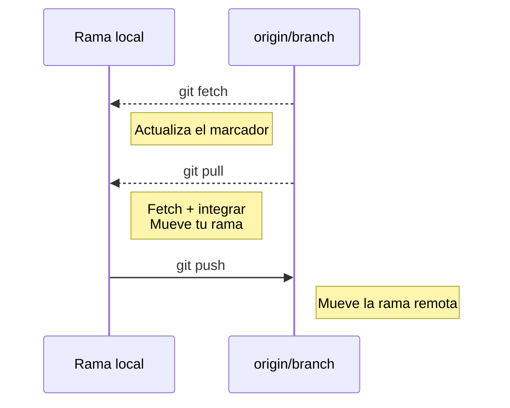

## Conflictos de merge

Un conflicto no es Git rompiéndose. Es Git negándose a adivinar.

Developer A y Developer B ambos cambian `UserService`. Ambos empiezan desde el mismo commit. Ambos pushean hacia la misma rama de integración.

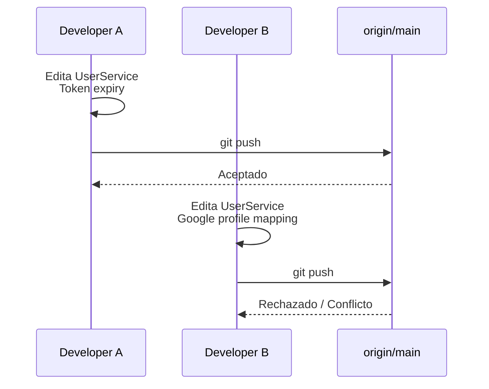

Git puede auto-mergear cambios en regiones distintas del mismo archivo. No puede auto-mergear dos ediciones a las mismas líneas, o un cambio que colisiona con un borrado. La segunda integración — merge, rebase, o pull — se detiene y marca el archivo.

```ts
<<<<<<< HEAD
  if (token.expired) throw new UnauthorizedError("token expired");
=======
  if (token.expired) return refreshWithGoogle(token);
>>>>>>> feature/google-auth
```

`HEAD` es «el lado que tenías checked out». El otro marcador es «el lado que se está mergeando o replicando». Ninguno de los dos lados es automáticamente correcto. El archivo resuelto debe compilar, pasar tests, y preservar ambas intenciones cuando ambas intenciones siguen siendo válidas: expirar el token _y_ refrescar a través de Google, o elegir un comportamiento a propósito.

```bash
git status                  # lista rutas sin mergear
# edita UserService hasta que los marcadores desaparezcan
git add src/users/user-service.ts
git commit                  # completa un merge
```

Si el conflicto apareció durante un rebase, `git add` y después `git rebase --continue`. No hay merge commit extra; el commit replicado se escribe después de la resolución.

Valida antes de continuar: corre los tests que cubren `UserService`, lee el diff resuelto, y comprueba que no mantuviste ambos bloques por accidente. `git add .` después de un conflicto es cómo los marcadores `<<<<<<<` sobrantes llegan a `main`.

Si la integración fue un error, aborta en lugar de inventar una resolución:

```bash
git merge --abort
git rebase --abort
```

Esos comandos devuelven la rama, index, y working tree al estado pre-integración, asumiendo que no has complicado el árbol con ediciones no relacionadas. No publican nada.

Los conflictos se vuelven más baratos cuando las ramas son cortas, cuando `main` se mergea o rebasea en la rama de topic a menudo, y cuando dos personas no reescriben la misma función para features no relacionadas la misma tarde.

## GitHub es la capa de colaboración

Un remote de Git puede vivir en cualquier host. El producto de GitHub es lo que pasa después de `git push`: personas, revisión, y política.

Un **repositorio** en GitHub es un repo Git alojado más issues, pull requests, actions, settings, y permisos. **Issues** rastrean trabajo. **Discussions** sostienen conversaciones que todavía no son un cambio. **Projects** y milestones organizan ese trabajo. Ninguno de esos objetos existe en Git.

**Ramas** en GitHub son las mismas refs que Git ya tiene, renderizadas en una UI. **Pull requests** son la propuesta de GitHub para integrar una rama en otra. **Reviews** adjuntan comentarios, aprobaciones, y cambios solicitados a esa propuesta. **Checks** son resultados de estado, normalmente de GitHub Actions, que pueden bloquear el merge.

**Tags** son objetos Git. **Releases** son registros de GitHub que apuntan a un tag y pueden adjuntar notas y binarios. **Actions** corren workflows en runners de GitHub o self-hosted. **Environments** añaden protección y secrets a jobs de despliegue.

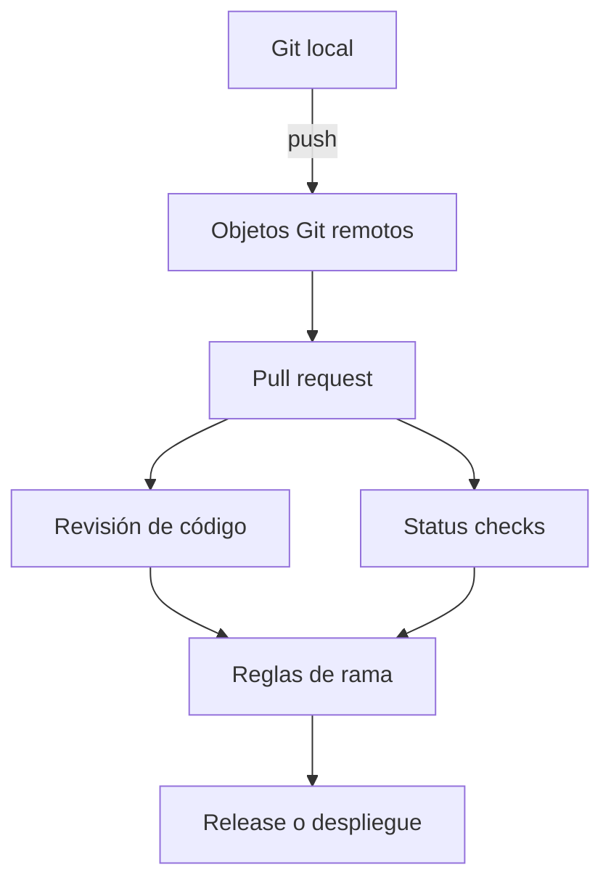

Git no sabe qué es un revisor. GitHub no reemplaza a `git merge`. La plataforma decide si un merge está permitido; Git realiza el cambio de historia cuando lo confirmas.

## Pull requests

Un pull request es la unidad profesional de integración en GitHub Flow. La rama tiene los commits. El pull request tiene la conversación, el veredicto de CI, y la decisión de mergear.

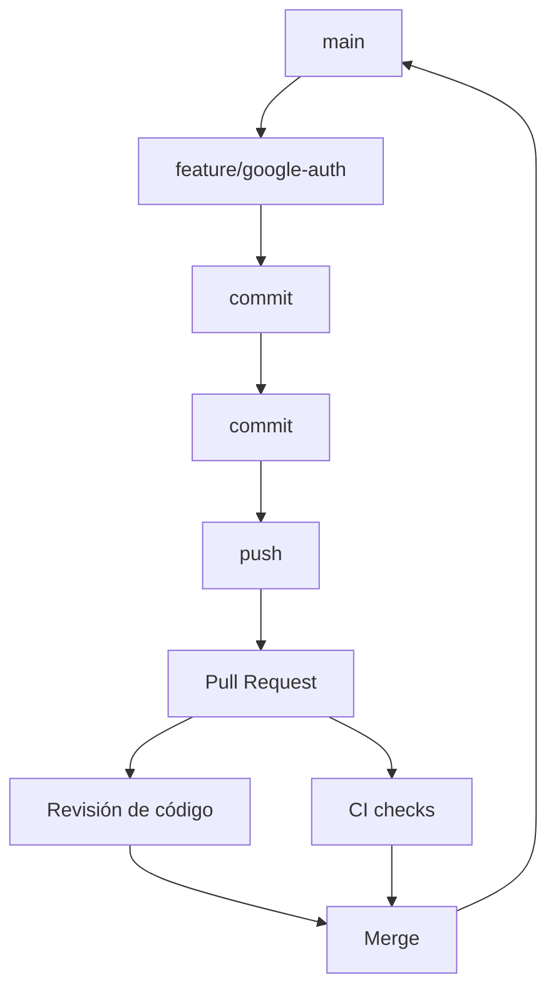

Abre el pull request cuando el cambio está listo para feedback, no cuando te sientes lo suficientemente valiente para mergear. Un pull request **draft** señala que el trabajo es visible pero todavía no revisable. Conviértelo a ready cuando los tests pasen y la descripción pueda sostenerse sola.

Pide **revisores** que sean dueños del código que tocaste. La revisión no es un rubber stamp ni un pase solo de estilo. Los comentarios se adjuntan a líneas. **Requested changes** bloquean el merge cuando el repositorio requiere aprobaciones. **Approve** significa que el revisor está dispuesto a ver esto aterrizar, no que escribió cada línea.

**Checks** son la mitad automatizada de esa puerta. Una suite de tests fallando es una razón para pushear otro commit a la misma rama. El pull request se actualiza en su lugar. No abres un segundo PR para arreglar el primero.

Mergea cuando la revisión y los checks requeridos estén de acuerdo. GitHub puede crear un merge commit, hacer squash en un commit, o rebasear sobre la rama base. Esas son estrategias de merge de GitHub aplicadas a la historia de Git. Los settings del repositorio deciden cuáles existen. Después del merge, borra la rama de topic. El pull request mantiene la discusión. Los commits permanecen en `main`.

Una descripción útil declara el problema, el enfoque, y cómo lo verificaste. Enlaza el issue si hay uno. GitHub puede cerrar ese issue automáticamente cuando el pull request se mergea si usas una keyword de enlace. Un PR de 40 archivos sin descripción es cómo la revisión se convierte en teatro.

## Fork vs rama

Una **rama** es una ref dentro de un repositorio al que puedes pushear. Usas ramas cuando tienes acceso de escritura: el repo `payments` de tu equipo, tu propio proyecto, cualquier lugar donde `git push origin feature/google-auth` esté permitido.

Un **fork** es una copia de un repositorio en tu cuenta de GitHub. Usas un fork cuando no tienes acceso de escritura al original, que es el setup normal de open source. Pusheas a tu fork, después abres un pull request desde `your-user/payments` hacia `org/payments`.

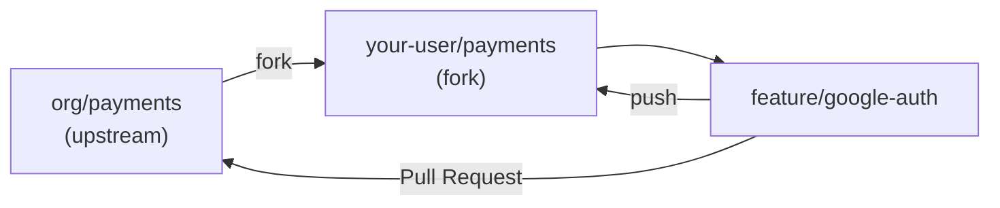

Localmente sueles tener dos remotes: `origin` para tu fork, `upstream` para el original. Haz fetch de `upstream`, rebasea o mergea `upstream/main` en tu rama de topic, pushea a `origin`. El fork es una frontera de permisos. La rama sigue siendo solo un puntero.

No hagas fork de un repositorio donde ya tienes escritura. Eso duplica la superficie de colaboración sin añadir seguridad. No esperes que una rama en `org/payments` exista si solo tienes acceso de lectura. El error no es Git siendo difícil. Es el host imponiendo permisos de escritura.

## La protección es política de ingeniería

GitHub puede rechazar operaciones que Git haría felizmente en local. Ese es el punto. `main` no debería depender de que todos recuerden abrir un pull request.

**Protected branches** y **rulesets** son las dos capas de política. Una regla de branch protection puede requerir pull requests, reviews requeridos, status checks requeridos, commits firmados, e historia lineal. Por defecto también bloquea force-pushes y borrados de la rama coincidente. Solo una regla clásica de protección se aplica a una rama dada, lo que hace difícil razonar sobre reglas que se solapan.

[Rulesets](https://docs.github.com/en/repositories/configuring-branches-and-merges-in-your-repository/managing-rulesets/about-rulesets) se apilan. Varios pueden apuntar a `main` a la vez, y la versión más restrictiva de cada regla gana. También pueden apuntar a tags, y los push rulesets pueden bloquear archivos grandes o sensibles antes de que entren al repositorio o su red de forks. Organizaciones nuevas deberían preferir rulesets. Las reglas de protección existentes todavía funcionan y todavía se aplican junto a ellos.

**CODEOWNERS** mapea rutas a personas o equipos. Combinado con «require review from Code Owners», un cambio a `src/auth/**` no puede mergearse sin un owner de auth. Eso es una convención de archivo de GitHub, no una feature de Git.

**Commits firmados** prueban la clave del committer, no que el cambio sea correcto. Requiérelos cuando el threat model incluya suplantación de identidad en la rama default. No reemplazan la revisión.

Una **merge queue** serializa pull requests que apuntan a una rama ocupada para que cada candidato se testee contra la rama como existirá después del merge anterior, no contra un `main` obsoleto. Úsala cuando `main` se mueve tan rápido que «verde en el HEAD del PR» es mentira.

Nada de esto es ceremonia por sí misma. Es cómo un equipo codifica «no pushear a `main`», «no saltarse CI», y «no hacer force-push a producción» en software en lugar de en documentos de onboarding.

## GitHub Actions, brevemente

GitHub Actions es el sistema de CI/CD de GitHub. Un YAML de workflow en `.github/workflows` corre cuando pasa un evento: un push, un pull request, un schedule, un dispatch manual. Los jobs corren en runners. Los steps corren scripts o actions reutilizables.

Para este artículo, el único job que importa es el que mantiene un build rojo fuera de `main`.

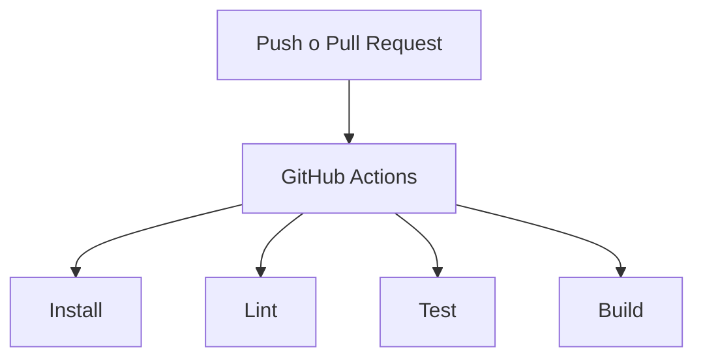

```yaml
name: CI
on:
  pull_request:
  push:
    branches: [main]
jobs:
  test:
    runs-on: ubuntu-latest
    steps:
      - uses: actions/checkout@v4
      - uses: actions/setup-node@v4
        with:
          node-version: 22
          cache: npm
      - run: npm ci
      - run: npm run lint
      - run: npm test
      - run: npm run build
```

Ese workflow no es una plataforma. Es una puerta. Los required status checks en un ruleset hacen la puerta obligatoria. Jobs de deploy y environments pueden venir después. No empieces automatizando un pipeline de release que todavía no puedes describir en un párrafo.

## Tags y releases

Un **tag** es una ref de Git que apunta a un commit (o, para annotated tags, a un objeto tag que después apunta a un commit). A diferencia de una rama, no está pensado para moverse.

```bash
git tag v1.0.0
git push origin v1.0.0
```

Un **GitHub Release** es una página, notas, y assets opcionales adjuntos a ese tag. El tag es el nombre inmutable en la historia de Git. El release es cómo humanos y sistemas de deploy encuentran la versión `v1.0.0`.

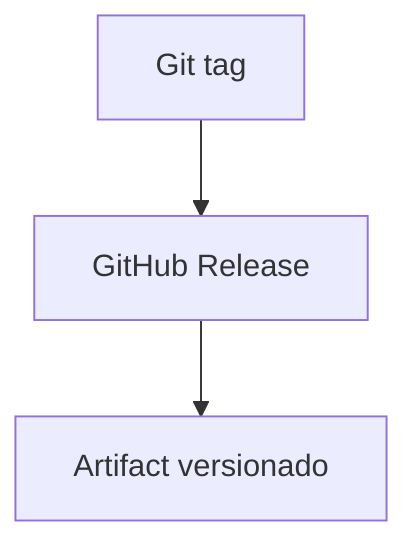

[Semantic Versioning](https://semver.org/) es una convención de naming, no una feature de Git: `MAJOR.MINOR.PATCH`. Incrementa MAJOR cuando rompes consumidores compatibles, MINOR cuando añades comportamiento compatible, PATCH cuando arreglas comportamiento sin añadir API. Git felizmente tagueará `v1.0.0` en un commit que rompe todo. El número es una promesa que tú cumples, no un hash que Git computa.

## Reflog: historia de dónde estuvo HEAD

`git reflog` muestra cómo HEAD (y, con otros argumentos, otras refs) se movió en esta máquina: commits, checkouts, rebases, resets, merges. Es un log de seguridad local, no una historia publicada, y no se comparte con `git push`.

Cuando un reset, rebase, o checkout hace que un commit «desaparezca» de `git log`, el commit normalmente sigue en la base de datos. El reflog todavía lo nombra por un tiempo, típicamente 30 días para objetos unreachable y 90 días para entradas reachable del reflog, a menos que hayas configurado otra cosa o corrido garbage collection agresiva.

```bash
git reflog
git switch -c recovery HEAD@{2}
```

Eso crea una rama en la posición que HEAD tenía hace dos movimientos. También puedes `git reset --hard` a una entrada del reflog si pretendes mover la rama actual ahí. Prefiere crear una rama de recovery primero. El punto del reflog es que Git a menudo todavía tiene el snapshot que crees que destruiste. El trabajo sin commitear que nunca fue staged es otra historia: el reflog no puede reconstruir un archivo que nunca se convirtió en objeto.

## Errores que no escalan

Trabajar en `main` es conveniente hasta que el primer experimento a medio terminar tiene que compartir la rama con un hotfix de producción. Las ramas de topic son baratas. Úsalas.

Commits gigantes y pull requests gigantes ocultan riesgo. Un revisor que debe aceptar 1200 líneas para conseguir un fix de 20 líneas aceptará las 1200 líneas. Separa el refactor. Mantén la feature revisable.

`git pull` sin saber la estrategia de reconciliación produce merge commits sorpresa o rebases sorpresa. Lee `git status` después de un fetch. Después elige.

`git reset --hard` y `git push --force` no son limpieza. Son reescrituras de historia y working tree. `--force-with-lease` es más seguro que `--force` y sigue siendo inapropiado en una rama default compartida.

Mezclar features no relacionadas en una rama hace cada conflicto y cada revert más grande. Un pull request debería ser una razón para cambiar `main`.

Saltarse el diff y los tests porque «CI lo pillará» convierte la revisión en un segundo CI que pagas en tiempo humano. Corre los tests relevantes antes de pedir a alguien más que mire.

Un modelo de branching con `develop`, `release`, `staging`, y seis ramas de entorno no es madurez. Es overhead, a menos que realmente publiques así. GitHub Flow más `main` protegido es suficiente para la mayoría de equipos de producto.

## Un bucle realista: autenticación con Google

El equipo necesita Google sign-in. `main` está protegido. CI corre lint y tests en pull requests. Tienes acceso de escritura al repositorio, así que usas una rama, no un fork.

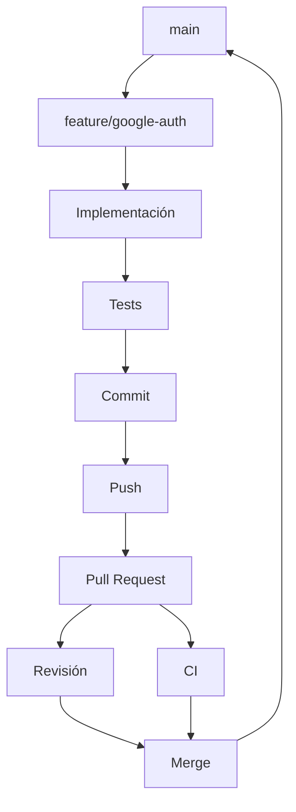

```bash
git switch main
git pull
git switch -c feature/google-auth
```

`git pull` aquí debería hacer fast-forward: no tienes commits locales en `main`. Si se niega, para y mira. No fuerces `main` a coincidir con una suposición.

Implementa el callback, el mapping de usuario en `UserService`, y los tests. Después inspecciona lo que Git ve, no lo que la pestaña del editor sugiere:

```bash
git status
git diff
git add src/auth/google.ts src/users/user-service.ts src/auth/google.test.ts
git commit -m "feat: add Google authentication"
git push -u origin feature/google-auth
```

En GitHub, abre un pull request desde `feature/google-auth` hacia `main`. Describe la callback URL, los nuevos campos de usuario, y los tests que corriste. Márcalo como ready, no draft, cuando la suite esté verde localmente. Pide al owner de `src/auth`. Espera el workflow de Actions y la revisión.

Si `main` se movió, actualiza la rama de topic antes de mergear:

```bash
git fetch origin
git rebase origin/main
git push --force-with-lease
```

Rebase es aceptable aquí porque es tu rama de topic. El force-with-lease actualiza los commits del pull request. Los revisores miran la nueva historia. CI corre de nuevo.

Cuando la revisión esté aprobada y el check requerido esté verde, mergea en GitHub. Borra `feature/google-auth` en el remote. Localmente:

```bash
git switch main
git pull
git branch -d feature/google-auth
```

Ese es todo el bucle profesional. Los comandos son cortos porque el modelo hizo el trabajo: un puntero, unos pocos snapshots, una comparación alojada, y una política que se negó a dejarte saltarte la revisión.

## Referencia rápida

Solo comandos que se ganan su lugar. Cada uno mapea a un trabajo de las secciones anteriores.

### Empezar

```bash
git init
git clone <url>
```

### Inspeccionar

```bash
git status
git log --oneline --graph --all
git diff
git diff --staged
git diff main...HEAD
```

### Registrar

```bash
git add <path>
git commit
```

### Ramas

```bash
git branch
git switch <name>
git switch -c <name>
git merge <name>
git rebase <base>
git branch -d <name>
```

### Remotes

```bash
git remote -v
git fetch
git pull
git pull --rebase
git push
git push -u origin HEAD
```

### Recuperar

```bash
git restore <path>
git restore --staged <path>
git reset --soft HEAD~1
git revert <commit>
git reflog
git merge --abort
git rebase --abort
```

## FAQ

**¿Son Git y GitHub lo mismo?**
No. Git es el sistema de control de versiones en tu máquina. GitHub es un producto de hosting y colaboración que almacena repositorios Git y añade pull requests, revisión, y automatización.

**¿Necesito GitHub para usar Git?**
No. Git funciona localmente y con cualquier remote: GitLab, Bitbucket, un bare repo en una VM, o ningún remote en absoluto.

**¿Cuál es la diferencia entre `git pull` y `git fetch`?**
`fetch` actualiza las ramas de seguimiento remoto y para. `pull` hace fetch y después integra esos commits en tu rama actual, usando merge, rebase, o fast-forward only dependiendo de la configuración.

**¿Cuándo debería hacer merge, y cuándo rebase?**
Merge cuando quieras registrar que dos historias se unieron, especialmente en ramas compartidas. Rebase cuando quieras replicar commits locales no compartidos sobre una base más nueva. No hagas rebase de commits que otras personas puedan haber usado como punto de partida.

**¿Cuál es la diferencia entre reset y revert?**
`reset` mueve un puntero de rama y puede descartar o quitar del stage trabajo. Eso reescribe la rama. `revert` añade un nuevo commit que deshace uno anterior. Usa revert en historia publicada.

**¿Qué hago con un conflicto de merge?**
Lee `git status`, edita los archivos marcados hasta que ambas intenciones estén manejadas, `git add` el resultado, después `git commit` o `git rebase --continue`. Aborta con `git merge --abort` o `git rebase --abort` si no deberías haber empezado la integración.

**¿Qué es `origin`?**
El nombre default del remote creado por `git clone`. Es un apodo para una URL, no un tipo especial de servidor.

**¿Cuál es la diferencia entre una rama y un fork?**
Una rama es un puntero dentro de un repositorio. Un fork es un repositorio de GitHub separado copiado de otro. Usa una rama cuando puedas pushear al repo. Usa un fork cuando no puedas.

**¿Qué pasa cuando hago push?**
Git envía objetos que el remote no tiene y actualiza la rama remota a tu tip, si la actualización es un fast-forward o lo fuerzas explícitamente. No crea un pull request y no corre tu suite de tests a menos que un hook o Action lo haga.

**¿Qué pasa si borro una rama?**
El puntero desaparece. Los commits siguen alcanzables si otra ref (normalmente `main` después de un merge) todavía apunta a ellos. GitHub también mantiene la historia del pull request.

**¿Puedo recuperar un commit que resetié?**
A menudo, sí, si fue commiteado. `git reflog` todavía nombra posiciones recientes de HEAD en esa máquina. Las ediciones sin commitear y sin stage no están en la base de datos de objetos.

**¿Es Git Flow obligatorio?**
No. Es un modelo de branching orientado a releases. Muchos equipos de producto usan GitHub Flow o trunk-based development en su lugar.

**¿Debería hacer commits pequeños?**
Sí, cuando «pequeño» significa una razón coherente. Una pila de snapshots `wip` no es lo mismo. Reescríbelos o haz squash antes de una revisión compartida si el equipo lo permite en ramas de topic.

**¿Cuándo debería abrir un pull request?**
Cuando el cambio esté listo para feedback o merge: una descripción clara, un diff enfocado, y tests que ya hayas corrido. Abre un draft antes si quieres visibilidad sin revisión.

## Fuentes

- Scott Chacon and Ben Straub, [Pro Git — What is Git?](https://git-scm.com/book/en/v2/Getting-Started-What-is-Git%3F) — snapshots, operaciones locales, los tres estados
- Git, [gitdatamodel](https://git-scm.com/docs/gitdatamodel) — objetos, refs, index, HEAD, ramas de seguimiento remoto
- Scott Chacon and Ben Straub, [Pro Git — Branches in a Nutshell](https://git-scm.com/book/en/v2/Git-Branching-Branches-in-a-Nutshell) — una rama como puntero movible
- Scott Chacon and Ben Straub, [Pro Git — Rebasing](https://git-scm.com/book/en/v2/Git-Branching-Rebasing) — merge versus rebase, la regla contra rebasear trabajo publicado
- Git, [git-pull](https://git-scm.com/docs/git-pull), [git-fetch](https://git-scm.com/docs/git-fetch), [git-push](https://git-scm.com/docs/git-push) — fetch más integrar, `--force-with-lease`
- Git, [git-reset](https://git-scm.com/docs/git-reset), [git-restore](https://git-scm.com/docs/git-restore), [git-revert](https://git-scm.com/docs/git-revert), [git-reflog](https://git-scm.com/docs/git-reflog)
- Git, [git-diff](https://git-scm.com/docs/git-diff) y GitHub, [About comparing branches in pull requests](https://docs.github.com/en/pull-requests/collaborating-with-pull-requests/proposing-changes-to-your-work-with-pull-requests/about-comparing-branches-in-pull-requests) — dos puntos versus tres puntos
- GitHub, [GitHub flow](https://docs.github.com/en/get-started/using-github/github-flow)
- GitHub, [About pull requests](https://docs.github.com/en/pull-requests/collaborating-with-pull-requests/proposing-changes-to-your-work-with-pull-requests/about-pull-requests)
- GitHub, [About forks](https://docs.github.com/en/pull-requests/collaborating-with-pull-requests/working-with-forks/about-forks)
- GitHub, [About protected branches](https://docs.github.com/en/repositories/configuring-branches-and-merges-in-your-repository/managing-protected-branches/about-protected-branches)
- GitHub, [About rulesets](https://docs.github.com/en/repositories/configuring-branches-and-merges-in-your-repository/managing-rulesets/about-rulesets)
- GitHub, [About code owners](https://docs.github.com/en/repositories/managing-your-repositorys-settings-and-features/customizing-your-repository/about-code-owners)
- GitHub, [Understanding GitHub Actions](https://docs.github.com/en/actions/get-started/understand-github-actions)
- GitHub, [About releases](https://docs.github.com/en/repositories/releasing-projects-on-github/about-releases)
- [Conventional Commits](https://www.conventionalcommits.org/) y [Semantic Versioning](https://semver.org/) — convenciones de mensaje y versión, no features de Git
