Two developers change `UserService` on the same afternoon. Both commits are correct in isolation. The second push is rejected. The pull request turns red. Someone types `git pull` without knowing whether that will merge, rebase, or refuse to move. Someone else types `git reset --hard` because a tutorial said it "discards local changes."

That is not a Git shortage. It is a missing model.

Git is not a list of commands. It is a way to record how a codebase evolves: snapshots, pointers, and a few operations that move those pointers. GitHub is not "the cloud where the repo lives." It is the collaboration layer that turns those snapshots into review, policy, automation, and release.

If you only memorize commands, every conflict feels like a crash. If you understand the model, the same conflict is a predictable merge of two snapshots.

> Git manages the evolution of the code. GitHub turns that history into a team workflow.

## Git is not GitHub

Git is a distributed version control system. It runs on your machine. It stores the full history of a project as a graph of commits, and it lets you create, compare, and integrate lines of work without talking to a server.

GitHub is a hosting and collaboration platform built around Git repositories. It adds pull requests, code review, issues, permissions, branch protection, and CI/CD. You can use Git without GitHub. You cannot use GitHub as a substitute for Git.

The confusion is cheap to acquire. `git clone` talks to GitHub, `git push` updates GitHub, and the website shows branches. The tools share objects. They do not share jobs.

| Git                           | GitHub                                 |
| ----------------------------- | -------------------------------------- |
| Version control system        | Collaboration platform                 |
| Works locally                 | Remote service                         |
| Stores history as commits     | Hosts repositories and people          |
| Branches and merges           | Pull requests and review               |
| `merge` / `rebase` / `revert` | CI checks, policies, and merge buttons |

Git became the default because it is local-first, snapshot-based, and cheap to branch. Most operations do not need the network. You can commit on a plane, inspect last month's tree without asking a server, and create a feature line in milliseconds because a branch is a pointer, not a copy of the project.

GitHub became the default companion because software is written by more than one person. A remote Git repository can store objects. A team still needs a place to propose a change, require a review, run tests, and refuse a force-push to `main`.

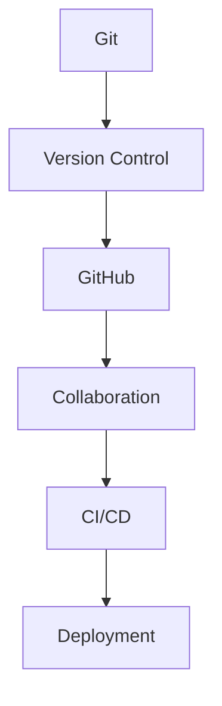

Set your identity before the first commit. Git records `user.name` and `user.email` on every snapshot. That is Git configuration, not a GitHub login.

```bash
git config --global user.name "Your Name"
git config --global user.email "you@email.com"
git config --global init.defaultBranch main
```

`main` is the usual default branch name on GitHub and in current Git setups. It is a convention, not a law of Git. Older repositories still use `master`. What matters is that the team agrees on one default branch and protects it.

## The model before the commands

Git has three places a file can live, and a few names people treat as folders when they are actually pointers.

**Working tree.** The files on disk that you edit. This is a checkout of one commit, plus whatever you have changed since then. It is not the source of truth.

**Staging area (index).** A prepared snapshot for the next commit. `git add` copies content from the working tree into this list. Unstaged edits stay in the working tree. The index is a flat list of paths; Git turns it into a tree object only when you commit.

**Repository (`.git`).** The object database and the references. Commits, trees, blobs, and tags live here. Clone copies this database. Almost every Git operation reads or writes this directory.

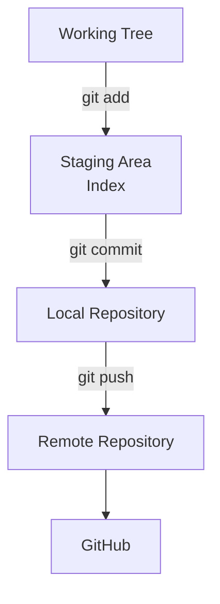

A file is **modified** when the working tree differs from the index. It is **staged** when the index differs from `HEAD`. It is **committed** when that snapshot is stored as a commit object in the database.

A **commit** is a snapshot of the project plus metadata: author, message, timestamp, and pointers to parent commits. Git does not store a commit as "the diff since last time." Conceptually it stores the full tree. Unchanged files are reused by content hash, which is why this is cheap. The history is a graph of snapshots, not a stack of patches.

A **branch** is a movable pointer to a commit. It is not a copy of the project, and it is not a folder of files. Creating `feature/google-auth` writes a ref, usually under `refs/heads/`. The files on disk change only when you switch to that ref and Git updates the working tree to match the snapshot it points at.

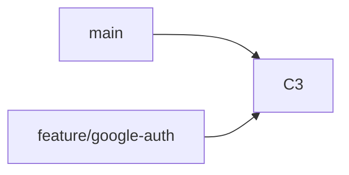

After you commit on `feature/google-auth`, only that pointer moves. `main` still points at `C3`.

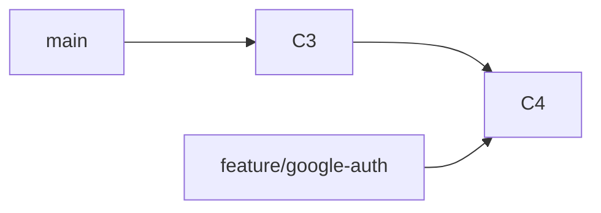

**HEAD** is how Git knows where you are. Usually it is a symbolic ref: "I am on `feature/google-auth`." A new commit then moves that branch pointer. If HEAD points directly at a commit instead of a branch, you are in detached HEAD: you can look around, but new commits will not belong to a branch until you attach them.

A **remote** is a named URL for another repository. **`origin`** is only the conventional name Git assigns to the remote you cloned from. It is not a special server and not a synonym for GitHub. You can have several remotes (`origin`, `upstream`) pointing at different hosts.

A **remote-tracking branch** such as `origin/main` is a local bookmark for the last tip you fetched from that remote. `git status` saying "up to date with `origin/main`" is comparing your branch to that bookmark, not calling GitHub live.

That is the whole model. Commands become easier once you ask, for each one: which of these things did it change?

## The fundamental cycle

Most days you move work through the same five states: edit, inspect, stage, commit, publish. The commands below are the vocabulary for that loop, not a checklist to memorize.

### `git init` and `git clone`

`git init` creates a repository in the current directory. It writes `.git` and, with a modern default, a `main` branch. It does not create a GitHub repository and it does not set a remote.

`git clone <url>` copies an existing repository, checks out the default branch, and records that URL as `origin`. It does not change the remote. It gives you a full local history.

Use `init` when the project starts on your machine. Use `clone` when the source of truth already exists elsewhere. The common mistake is initializing inside a directory you meant to clone, then fighting two unrelated histories.

### `git status`

`status` compares working tree, index, and `HEAD`. It tells you what is modified, what is staged, which branch you are on, and how that branch relates to its upstream bookmark.

It does not change anything. Run it before `add`, before `commit`, and before you assume a pull is safe. The common mistake is committing because the editor looks saved, without checking what Git actually sees.

### `git add`

`git add` updates the index. `git add src/auth/google.ts` stages one file. `git add .` stages every change under the current directory that is not ignored.

It does not create a commit. It does not send anything to GitHub. It does not stage ignored files. The common mistake is `git add .` as a reflex, then discovering a `.env` or a debug dump in the next commit. Stage the change you intend to record.

`.gitignore` is how you keep generated and secret files out of that reflex:

```text
node_modules/
dist/
build/
.env
.env.local
*.log
.DS_Store
```

### `git commit`

`git commit` reads the index, writes a commit object, and moves the current branch pointer. The working tree is left alone. The remote is left alone.

```bash
git commit -m "feat: add Google authentication"
```

`-m` is convenient. For anything non-trivial, an editor commit with a subject and a body is clearer. `git commit -am` stages tracked files and commits in one step. It will not pick up new untracked files. Treat it as a shortcut, not a habit.

The common mistake is committing because the feature "kind of works," then using the next six commits to apologize. A commit should be a coherent snapshot you would be willing to revert on its own.

### `git log` and `git diff`

`git log` reads history. It does not change it.

```bash
git log --oneline
git log --graph --oneline --all
```

`git diff` compares trees. Unqualified `git diff` is working tree versus index: what you have not staged. `git diff --staged` is index versus `HEAD`: what the next commit will contain. That split is the reason staging exists. You can edit five files and commit two.

```bash
git diff
git diff --staged
```

Neither command publishes anything. The common mistake is pushing after looking only at `git status` and never reading the staged diff.

### `git push` and `git pull`

`git push` sends local commits the remote does not have, and updates the remote branch pointer. It does not run tests. It does not create a pull request. It does not change your working tree.

`git pull` is not "download." It is `git fetch` plus an integration step. Fetch updates remote-tracking branches. Integration then tries to move your current branch to include that work. How it integrates depends on configuration: merge, rebase, or fast-forward only.

On a current Git, if you have not chosen a reconcile strategy, `git pull` defaults to fast-forward only: it updates the branch when your history is a strict ancestor of the remote tip, and it refuses when the histories have diverged. That refusal is a feature. It stops Git from inventing a merge you did not ask for.

The common mistake is treating `pull` as a harmless sync and `push` as "upload my folder." Push publishes commits. Pull combines two histories. Those are different operations with different failure modes.

A first-day loop on an existing repo looks like this:

```bash
git clone git@github.com:org/payments.git
cd payments
git status
# edit files
git add src/auth/google.ts
git commit -m "feat: add Google authentication"
git push -u origin HEAD
```

`-u` sets the upstream so later `git push` and `git pull` know which remote branch to use. After that, the interesting work is not the loop. It is how you isolate that work from `main`.

## Branches are lines of work, not copies

Create a branch when the work has a reason to exist independently of `main`: a feature, a fix, an experiment. Do not create a branch because a process document said every change needs a ticket-shaped name.

```text
main
 │
 ├── feature/google-auth
 │
 ├── feature/payments-webhook
 │
 └── fix/login-redirect
```

```bash
git branch                     # list local branches
git switch main                # move HEAD to main
git switch -c feature/google-auth
git branch -d feature/google-auth
```

`git switch -c` creates the ref and points HEAD at it. `git branch feature/google-auth` only creates the pointer; you are still on the previous branch until you switch. `git switch` replaced the "change branches" half of `git checkout` in Git 2.23. `checkout` still works. For new muscle memory, prefer `switch` for branches and `restore` for files.

`git branch -d` deletes a local branch that Git considers fully merged. `-D` forces deletion of an unmerged branch. Deleting a branch deletes a pointer, not the commits. Commits remain until nothing references them and Git garbage-collects them. If the work was merged through a pull request, the commits are already reachable from `main`.

Name branches so a reviewer can guess the job from the ref: `feature/google-auth`, `fix/login-redirect`, `hotfix/expired-token`. That naming is a team convention. Git does not care.

A **hotfix** is just a branch with urgency: production is wrong, the fix is small, and it should land on the default branch with less ceremony than a feature. Do not invent a second branching strategy for every production bug. If `main` is what you deploy, fix from `main` and open a pull request.

A **tracking branch** is a local branch with an upstream, usually `origin/feature/google-auth`. After `git push -u origin feature/google-auth`, `git status` can tell you whether you are ahead, behind, or diverged. Fetch updates the upstream bookmark. It does not move your local branch.

A branching strategy is excessive when the team spends more time moving commits between long-lived branches than changing the product. Three common models exist. None of them is "the Git way."

| Model       | Shape                                                            | Fits when                                                       |
| ----------- | ---------------------------------------------------------------- | --------------------------------------------------------------- |
| GitHub Flow | Branch from `main`, open a pull request, merge back to `main`    | You deploy from the default branch and want a short review loop |
| Git Flow    | Long-lived `develop`, plus `release` and `hotfix` lines          | You ship versioned releases on a slower cadence                 |
| Trunk-based | Short-lived branches, or commits to a shared trunk, behind flags | You integrate continuously and can hide unfinished work         |

[GitHub Flow](https://docs.github.com/en/get-started/using-github/github-flow) is the one this article uses for the team example: one default branch, topic branches, pull requests, delete the branch when the work is done. Git Flow is a release-train model, not a beginner tutorial. Trunk-based development is a discipline about integration frequency, not a Git feature. Pick the smallest model that matches how you actually ship.

## What makes a commit professional

`git commit -m "message"` records whatever is in the index. It does not make that snapshot useful.

A good commit is small enough to review, coherent enough to revert, and described well enough that `git log --oneline` still makes sense in six months. "Small" does not mean one file. It means one reason. Adding Google sign-in is one reason. Reformatting the entire `auth` folder in the same snapshot is two reasons sharing a hash.

Write the subject in the imperative, as if completing "This commit will…": `add Google authentication`, not `added` or `adding`. Git itself uses that voice in generated messages (`Merge branch…`, `Revert "…"`).

Avoid subjects that only report activity: `fix`, `changes`, `update`, `wip`. They tell a future reader that something happened and hide what. If you need a temporary snapshot while you jump to a bug, say that, then rewrite or squash it before the pull request if the team rewrites topic branches.

Separate refactors from behavior changes. A reviewer who sees a 400-line move and a new OAuth callback in the same diff cannot tell which lines are the risk. Two commits, or two pull requests, make the decision cheaper.

[Conventional Commits](https://www.conventionalcommits.org/) are a message convention, not a Git feature. Git will accept any string. Teams use a prefix so changelogs and automation can classify history:

```text
feat: add payment webhook
fix: handle expired access token
refactor: extract authentication service
docs: update installation guide
```

Use the convention if the team already runs tooling on it. Do not treat `feat:` as proof of professionalism. A precise sentence still beats a prefix on a useless subject.

`git commit --amend` replaces the latest commit with a new one. That rewrites history. Amend a commit that exists only on your machine when you forgot a file or mistyped the subject. Do not amend a commit other people may have pulled.

```bash
git add src/auth/google.test.ts
git commit --amend --no-edit
```

## Merge vs rebase

Both commands integrate one line of work into another. They produce the same tree if the resolutions are the same. They do not produce the same history.

Start from a diverged graph:

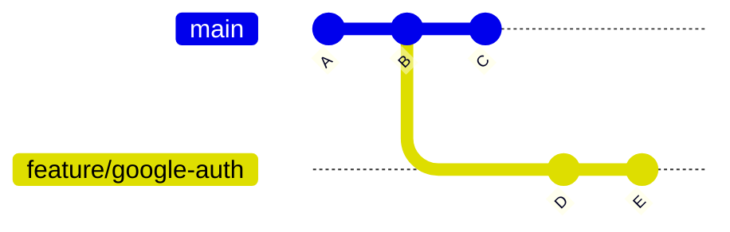

**Merge** creates a new commit with two parents. It records that two histories met. The original commits keep their hashes.

```bash
git switch main
git merge feature/google-auth
```

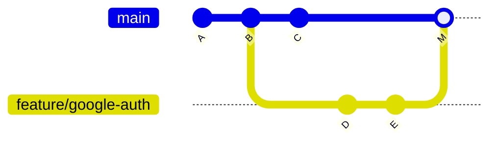

Merge solves "combine these branches and keep the fact that they were parallel." It is the default mental model for integrating a reviewed pull request when the team wants the join visible. Fast-forward merge is the special case where `main` has not moved: Git can just slide the pointer to `E` and skip `M`.

**Rebase** replays your commits on top of another tip. Git computes the changes introduced by `D` and `E`, moves the branch to `C`, and applies those changes as new commits. The snapshots at the end can match a merge. The hashes do not.

```bash
git switch feature/google-auth
git rebase main
```

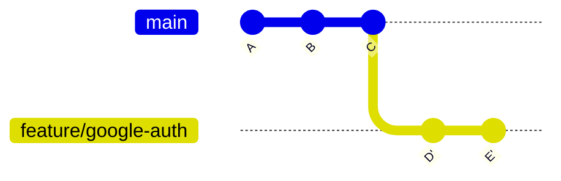

Rebase solves "make my local work look as if it started from the current `main`." That is useful before you open a pull request, when the commits still belong to you. The history stays linear. Reviewers read a story instead of a braid of merge commits.

The cost is that `D'` and `E'` are new objects. Anyone who based work on `D` or `E` now has the old commits. Pro Git's rule is the one that matters:

> Rebase is for reorganizing local work. Do not rebase commits that exist outside your repository and that other people may have based work on.

Interactive rebase (`git rebase -i HEAD~3`) can reorder, squash, or reword those local commits. Same rule: do it before the branch is shared, or on a topic branch the team agrees you own.

A practical default for a GitHub Flow team: rebase (or merge) `main` into your topic branch to stay current; merge the pull request with whatever strategy the repository allows. Do not rebase `main`. Do not rebase a branch three teammates are pushing to.

## Reset, restore, revert

These three names get used as if they were synonyms for "undo." They are not.

**`git restore`** changes files. It does not move a branch. Restore a working-tree file from the index, or restore the index from `HEAD`, when you want to discard or unstage edits and leave history alone.

```bash
git restore src/auth/google.ts          # discard unstaged edits in that file
git restore --staged src/auth/google.ts # unstage, keep the working tree
```

**`git reset`** moves the current branch pointer. Optionally it also updates the index and the working tree. That is a history rewrite for the branch you are on.

| Command                   | Moves branch       | Index              | Working tree       | Typical use                           |
| ------------------------- | ------------------ | ------------------ | ------------------ | ------------------------------------- |
| `reset --soft`            | Yes                | Kept               | Kept               | undo a commit, keep everything staged |
| `reset --mixed` (default) | Yes                | Matches the target | Kept               | undo a commit, keep edits unstaged    |
| `reset --hard`            | Yes                | Matches the target | Matches the target | discard commits and uncommitted work  |
| `revert`                  | No (adds a commit) | New snapshot       | Updated to match   | undo a published change               |

```bash
git reset --soft HEAD~1    # drop the last commit, keep its changes staged
git reset HEAD~1           # drop the last commit, keep the changes unstaged
git revert <commit>        # add a commit that inverts <commit>
```

`reset --hard` is the dangerous one. It moves the branch and makes the index and working tree match the target. Uncommitted work is gone from the working tree. Use it only when you can point at the snapshot you want and you do not need the discarded edits.

`git revert` is the safe undo on a shared branch. It does not erase the bad commit. It records a new commit that applies the inverse. `main` stays a valid history for everyone who already pulled.

`git push --force` overwrites the remote branch pointer with yours. If someone else pushed commits you do not have, those commits disappear from the branch. That is why force-push is not a normal workflow step, and why protected default branches reject it.

When you truly must update a remote topic branch after a rebase, prefer `--force-with-lease`. Git updates the remote only if it still points at the tip you last fetched. If a teammate pushed in the meantime, the push is rejected instead of silently deleting their work.

```bash
git push --force-with-lease origin feature/google-auth
```

Even `--force-with-lease` is a rewrite. Use it on a branch you own, never as a way to "fix" `main`.

## Diffs are comparisons, not a single command

`git diff` always answers "what is different between these two trees?" The arguments pick the trees.

```bash
git diff                  # working tree vs index
git diff --staged         # index vs HEAD
git diff HEAD             # working tree vs HEAD (staged and unstaged)
git diff main...feature/google-auth
```

`git diff main..feature/google-auth` (two dots) compares the current tip of `main` to the current tip of the feature branch. If `main` moved, the diff changes even when you did not touch the feature.

`git diff main...feature/google-auth` (three dots) compares the merge base — the common ancestor — to the feature tip. That is "what this branch introduced."

GitHub pull requests use the three-dot comparison. The Files changed tab is showing the work the topic branch added since it diverged, not a live two-tip delta against today's `main`. If `main` has moved a long way, merge or rebase `main` into the topic branch so the pull request is actually based on current code. Until you do that, a green three-dot diff can still fail to merge.

Read the staged diff before every commit. Read the three-dot diff before every pull request. Status tells you that files changed. Diff tells you whether those changes are the ones you meant.

## Fetch, pull, and push

`git fetch` talks to the remote and updates remote-tracking refs (`origin/main`, `origin/feature/google-auth`). Your current branch, your index, and your working tree do not move. Fetch is how you look before you integrate.

```bash
git fetch origin
git log --oneline HEAD..origin/main
```

`git pull` fetches, then integrates the upstream into the current branch. If you are strictly behind, a fast-forward only moves the pointer. If you have local commits the remote does not have, pull must merge or rebase — or refuse, if fast-forward only is in effect.

`git pull --rebase` fetches and rebases your local commits onto the updated upstream. That avoids an extra merge commit of the form "Merge branch 'main' of origin." It is a good default when the local commits are yours and have not been the base for other people's work. It is a bad surprise when you expected a merge, or when you are on a shared branch.

Do not set `pull.rebase=true` globally just because a blog listed it under "useful defaults." Choose the strategy where you can see it: `git pull --rebase` on a topic branch you own, or an explicit merge when you want the join recorded. If you do configure it, know that every bare `git pull` now rewrites local commits.

`git push` publishes commits the remote lacks. If the remote has commits you lack, a default push is rejected. That rejection means "integrate first," not "force." Fetch, read the incoming commits, then merge or rebase your topic branch. Force-pushing `main` to win the argument deletes someone else's published work.

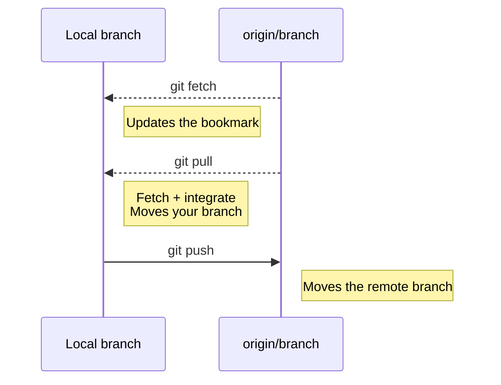

## Merge conflicts

A conflict is not Git breaking. It is Git refusing to guess.

Developer A and Developer B both change `UserService`. Both start from the same commit. Both push toward the same integration branch.

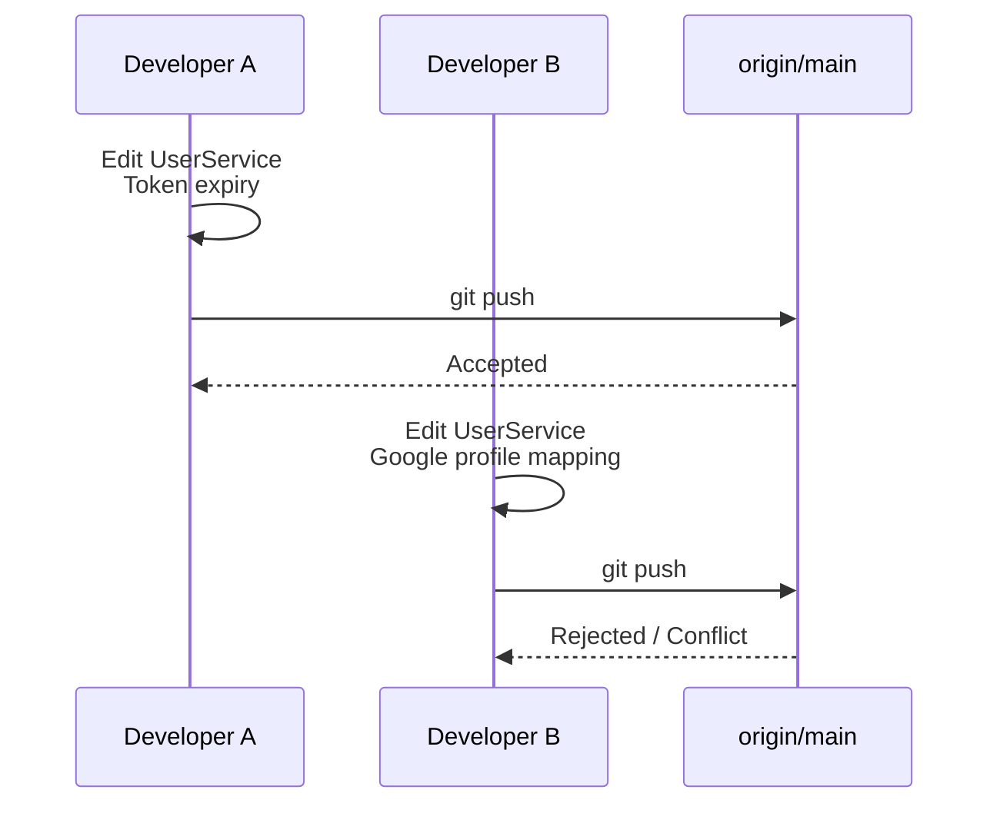

Git can auto-merge changes to different regions of the same file. It cannot auto-merge two edits to the same lines, or a change that collides with a deletion. The second integration — merge, rebase, or pull — stops and marks the file.

```ts
<<<<<<< HEAD
  if (token.expired) throw new UnauthorizedError("token expired");
=======
  if (token.expired) return refreshWithGoogle(token);
>>>>>>> feature/google-auth
```

`HEAD` is "the side you had checked out." The other marker is "the side being merged or replayed." Neither side is automatically correct. The resolved file must compile, pass tests, and preserve both intents when both intents are still valid: expire the token _and_ refresh through Google, or pick one behavior on purpose.

```bash
git status                  # lists unmerged paths
# edit UserService until the markers are gone
git add src/users/user-service.ts
git commit                  # completes a merge
```

If the conflict appeared during a rebase, `git add` then `git rebase --continue`. There is no extra merge commit; the replayed commit is written after the resolution.

Validate before you continue: run the tests that cover `UserService`, read the resolved diff, and check that you did not keep both blocks by accident. `git add .` after a conflict is how leftover `<<<<<<<` markers reach `main`.

If the integration was a mistake, abort instead of inventing a resolution:

```bash
git merge --abort
git rebase --abort
```

Those commands return the branch, index, and working tree to the pre-integration state, assuming you have not complicated the tree with unrelated edits. They do not publish anything.

Conflicts get cheaper when branches are short, when `main` is merged or rebased into the topic branch often, and when two people do not rewrite the same function for unrelated features in the same afternoon.

## GitHub is the collaboration layer

A Git remote can live on any host. GitHub's product is what happens after `git push`: people, review, and policy.

A **repository** on GitHub is a hosted Git repo plus issues, pull requests, actions, settings, and permissions. **Issues** track work. **Discussions** hold conversations that are not yet a change. **Projects** and milestones organize that work. None of those objects exist in Git.

**Branches** on GitHub are the same refs Git already has, rendered in a UI. **Pull requests** are GitHub's proposal to integrate one branch into another. **Reviews** attach comments, approvals, and requested changes to that proposal. **Checks** are status results, usually from GitHub Actions, that can block the merge.

**Tags** are Git objects. **Releases** are GitHub records that point at a tag and can attach notes and binaries. **Actions** run workflows on GitHub-hosted or self-hosted runners. **Environments** add protection and secrets to deployment jobs.

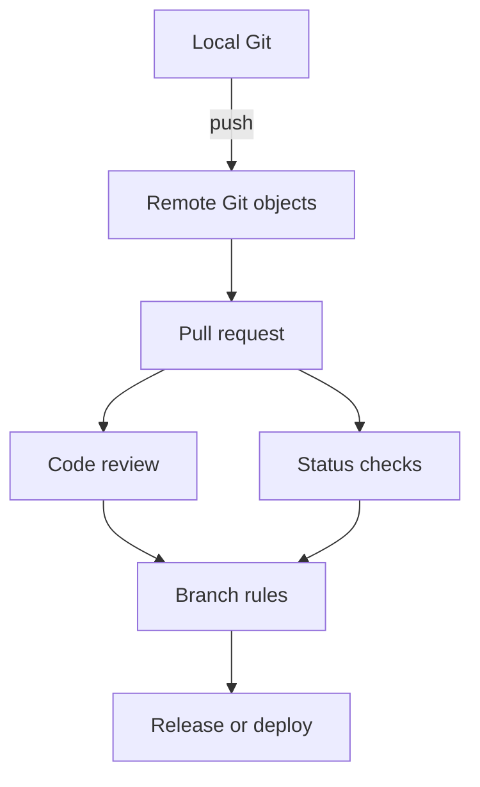

Git does not know what a reviewer is. GitHub does not replace `git merge`. The platform decides whether a merge is allowed; Git performs the history change when you confirm it.

## Pull requests

A pull request is the professional unit of integration in GitHub Flow. The branch holds the commits. The pull request holds the conversation, the CI verdict, and the decision to merge.

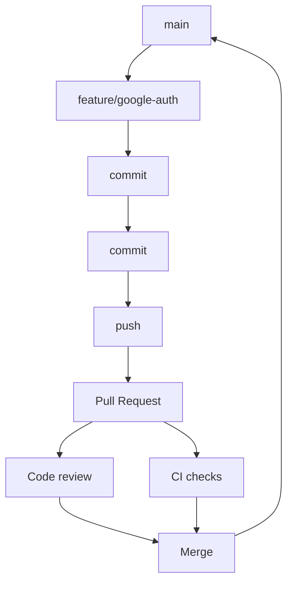

Open the pull request when the change is ready for feedback, not when you feel brave enough to merge it. A **draft** pull request signals that the work is visible but not reviewable yet. Convert it to ready when the tests pass and the description can stand on its own.

Ask for **reviewers** who own the code you touched. Review is not a rubber stamp and not a style-only pass. Comments attach to lines. **Requested changes** block merge when the repository requires approvals. **Approve** means the reviewer is willing to see this land, not that they typed every line.

**Checks** are the automated half of that gate. A failing test suite is a reason to push another commit to the same branch. The pull request updates in place. You do not open a second PR to fix the first.

Merge when review and required checks agree. GitHub can create a merge commit, squash into one commit, or rebase onto the base branch. Those are GitHub merge strategies applied to Git history. The repository settings decide which ones exist. After merge, delete the topic branch. The pull request keeps the discussion. The commits remain on `main`.

A useful description states the problem, the approach, and how you verified it. Link the issue if there is one. GitHub can close that issue automatically when the pull request merges if you use a linking keyword. A 40-file PR with no description is how review becomes theater.

## Fork vs branch

A **branch** is a ref inside a repository you can push to. You use branches when you have write access: your team's `payments` repo, your own project, any place `git push origin feature/google-auth` is allowed.

A **fork** is a copy of a repository on your GitHub account. You use a fork when you do not have write access to the original, which is the normal open-source setup. You push to your fork, then open a pull request from `your-user/payments` into `org/payments`.

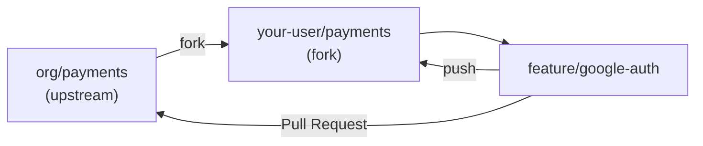

Locally you often have two remotes: `origin` for your fork, `upstream` for the original. Fetch `upstream`, rebase or merge `upstream/main` into your topic branch, push to `origin`. The fork is a permissions boundary. The branch is still just a pointer.

Do not fork a repository you already write to. That duplicates the collaboration surface without adding safety. Do not expect a branch on `org/payments` to exist if you only have read access. The error is not Git being difficult. It is the host enforcing write permission.

## Protection is engineering policy

GitHub can refuse operations that Git would happily perform locally. That is the point. `main` should not depend on everyone remembering to open a pull request.

**Protected branches** and **rulesets** are the two policy layers. A branch protection rule can require pull requests, required reviews, required status checks, signed commits, and a linear history. By default it also blocks force-pushes and deletions of the matching branch. Only one classic protection rule applies to a given branch, which makes overlapping rules hard to reason about.

[Rulesets](https://docs.github.com/en/repositories/configuring-branches-and-merges-in-your-repository/managing-rulesets/about-rulesets) layer. Several can target `main` at once, and the most restrictive version of each rule wins. They can also target tags, and push rulesets can block large or sensitive files before they enter the repository or its fork network. New organizations should prefer rulesets. Existing protection rules still work and still apply alongside them.

**CODEOWNERS** maps paths to people or teams. Combined with "require review from Code Owners," a change to `src/auth/**` cannot merge without an auth owner. That is a GitHub file convention, not a Git feature.

**Signed commits** prove the committer key, not that the change is correct. Require them when the threat model includes impersonation on the default branch. They do not replace review.

A **merge queue** serializes pull requests that target a busy branch so each candidate is tested against the branch as it will exist after the previous merge, not against a stale `main`. Use it when `main` moves so fast that "green on the PR head" is a lie.

None of this is ceremony for its own sake. It is how a team encodes "do not push to `main`," "do not skip CI," and "do not force-push production" in software instead of in onboarding docs.

## GitHub Actions, briefly

GitHub Actions is GitHub's CI/CD system. A workflow YAML in `.github/workflows` runs when an event happens: a push, a pull request, a schedule, a manual dispatch. Jobs run on runners. Steps run scripts or reusable actions.

For this article, the only job that matters is the one that keeps a red build off `main`.

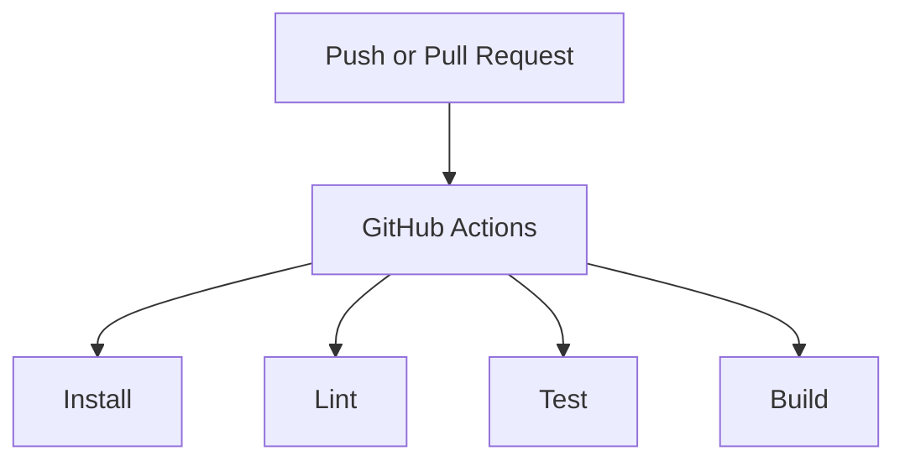

```yaml
name: CI
on:
  pull_request:
  push:
    branches: [main]
jobs:
  test:
    runs-on: ubuntu-latest
    steps:
      - uses: actions/checkout@v4
      - uses: actions/setup-node@v4
        with:
          node-version: 22
          cache: npm
      - run: npm ci
      - run: npm run lint
      - run: npm test
      - run: npm run build
```

That workflow is not a platform. It is a gate. Required status checks in a ruleset make the gate mandatory. Deploy jobs and environments can come later. Do not start by automating a release pipeline you cannot yet describe in one paragraph.

## Tags and releases

A **tag** is a Git ref that points at a commit (or, for annotated tags, at a tag object that then points at a commit). Unlike a branch, it is not meant to move.

```bash
git tag v1.0.0
git push origin v1.0.0
```

A **GitHub Release** is a page, notes, and optional assets attached to that tag. The tag is the immutable name in Git history. The release is how humans and deploy systems find version `v1.0.0`.

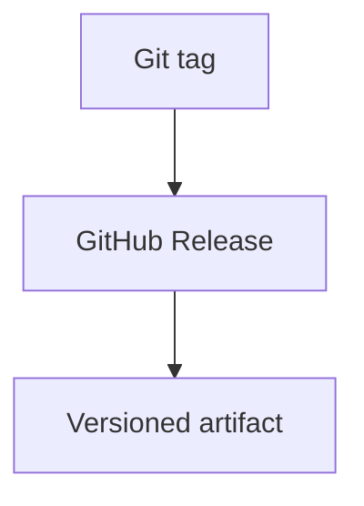

[Semantic Versioning](https://semver.org/) is a naming convention, not a Git feature: `MAJOR.MINOR.PATCH`. Increment MAJOR when you break compatible consumers, MINOR when you add compatible behavior, PATCH when you fix behavior without adding API. Git will happily tag `v1.0.0` on a commit that breaks everything. The number is a promise you keep, not a hash Git computes.

## Reflog: history of where HEAD was

`git reflog` shows how HEAD (and, with other arguments, other refs) moved on this machine: commits, checkouts, rebases, resets, merges. It is a local safety log, not a published history, and not shared by `git push`.

When a reset, rebase, or checkout makes a commit "disappear" from `git log`, the commit is usually still in the database. The reflog still names it for a while, typically 30 days for unreachable objects and 90 days for reachable reflog entries, unless you configured otherwise or ran aggressive garbage collection.

```bash
git reflog
git switch -c recovery HEAD@{2}
```

That creates a branch at the position HEAD held two moves ago. You can also `git reset --hard` to a reflog entry if you intend to move the current branch there. Prefer creating a recovery branch first. The point of the reflog is that Git often still has the snapshot you think you destroyed. Uncommitted work that was never staged is a different story: the reflog cannot reconstruct a file that never became an object.

## Mistakes that do not scale

Working on `main` is convenient until the first half-finished experiment has to share the branch with a production hotfix. Topic branches are cheap. Use them.

Giant commits and giant pull requests hide risk. A reviewer who must accept 1,200 lines to get a 20-line fix will accept the 1,200 lines. Split the refactor. Keep the feature reviewable.

`git pull` without knowing the reconcile strategy produces surprise merge commits or surprise rebases. Read `git status` after a fetch. Then choose.

`git reset --hard` and `git push --force` are not cleanup. They are history and working-tree rewrites. `--force-with-lease` is safer than `--force` and still inappropriate on a shared default branch.

Mixing unrelated features in one branch makes every conflict and every revert larger. One pull request should be one reason to change `main`.

Skipping the diff and the tests because "CI will catch it" turns review into a second CI you pay in human time. Run the relevant tests before you ask someone else to look.

A branching model with `develop`, `release`, `staging`, and six environment branches is not maturity. It is overhead, unless you actually ship that way. GitHub Flow plus protected `main` is enough for most product teams.

## A realistic loop: Google authentication

The team needs Google sign-in. `main` is protected. CI runs lint and tests on pull requests. You have write access to the repository, so you use a branch, not a fork.

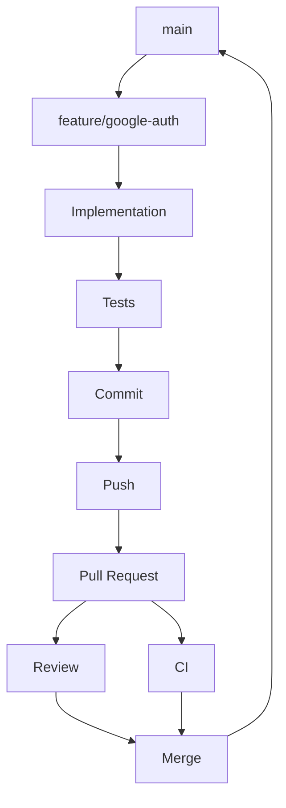

```bash
git switch main
git pull
git switch -c feature/google-auth
```

`git pull` here should fast-forward: you have no local commits on `main`. If it refuses, stop and look. Do not force `main` to match a guess.

Implement the callback, the user mapping in `UserService`, and the tests. Then inspect what Git sees, not what the editor tab suggests:

```bash
git status
git diff
git add src/auth/google.ts src/users/user-service.ts src/auth/google.test.ts
git commit -m "feat: add Google authentication"
git push -u origin feature/google-auth
```

On GitHub, open a pull request from `feature/google-auth` into `main`. Describe the callback URL, the new user fields, and the tests you ran. Mark it ready, not draft, when the suite is green locally. Request the owner of `src/auth`. Wait for the Actions workflow and the review.

If `main` moved, update the topic branch before merge:

```bash
git fetch origin
git rebase origin/main
git push --force-with-lease
```

Rebase is acceptable here because this is your topic branch. The force-with-lease updates the pull request commits. Reviewers look at the new history. CI runs again.

When the review is approved and the required check is green, merge on GitHub. Delete `feature/google-auth` on the remote. Locally:

```bash
git switch main
git pull
git branch -d feature/google-auth
```

That is the whole professional loop. The commands are short because the model did the work: a pointer, a few snapshots, a hosted comparison, and a policy that refused to let you skip the review.

## Quick reference

Only commands that earn their place. Each one maps to a job from the sections above.

### Start

```bash
git init
git clone <url>
```

### Inspect

```bash
git status
git log --oneline --graph --all
git diff
git diff --staged
git diff main...HEAD
```

### Record

```bash
git add <path>
git commit
```

### Branches

```bash
git branch
git switch <name>
git switch -c <name>
git merge <name>
git rebase <base>
git branch -d <name>
```

### Remotes

```bash
git remote -v
git fetch
git pull
git pull --rebase
git push
git push -u origin HEAD
```

### Recover

```bash
git restore <path>
git restore --staged <path>
git reset --soft HEAD~1
git revert <commit>
git reflog
git merge --abort
git rebase --abort
```

## FAQ

**Are Git and GitHub the same thing?**
No. Git is the version control system on your machine. GitHub is a hosting and collaboration product that stores Git repositories and adds pull requests, review, and automation.

**Do I need GitHub to use Git?**
No. Git works locally and with any remote: GitLab, Bitbucket, a bare repo on a VM, or no remote at all.

**What is the difference between `git pull` and `git fetch`?**
`fetch` updates remote-tracking branches and stops. `pull` fetches and then integrates those commits into your current branch, using merge, rebase, or fast-forward only depending on configuration.

**When should I merge, and when should I rebase?**
Merge when you want to record that two histories joined, especially on shared branches. Rebase when you want to replay local, unshared commits onto a newer base. Do not rebase commits other people may have used as a starting point.

**What is the difference between reset and revert?**
`reset` moves a branch pointer and can discard or unstage work. That rewrites the branch. `revert` adds a new commit that undoes an earlier one. Use revert on published history.

**What do I do with a merge conflict?**
Read `git status`, edit the marked files until both intents are handled, `git add` the result, then `git commit` or `git rebase --continue`. Abort with `git merge --abort` or `git rebase --abort` if you should not have started the integration.

**What is `origin`?**
The default name of the remote created by `git clone`. It is a nickname for a URL, not a special kind of server.

**What is the difference between a branch and a fork?**
A branch is a pointer inside one repository. A fork is a separate GitHub repository copied from another. Use a branch when you can push to the repo. Use a fork when you cannot.

**What happens when I push?**
Git sends objects the remote is missing and updates the remote branch to your tip, if the update is a fast-forward or you explicitly force it. It does not create a pull request and does not run your test suite unless a hook or Action does.

**What happens if I delete a branch?**
The pointer goes away. Commits stay reachable if another ref (usually `main` after a merge) still points at them. GitHub also keeps the pull request history.

**Can I recover a commit I reset away?**
Often, yes, if it was committed. `git reflog` still names recent HEAD positions on that machine. Uncommitted, unstaged edits are not in the object database.

**Is Git Flow required?**
No. It is one release-oriented branching model. Many product teams use GitHub Flow or trunk-based development instead.

**Should I make small commits?**
Yes, when "small" means one coherent reason. A pile of `wip` snapshots is not the same thing. Rewrite or squash those before a shared review if the team allows it on topic branches.

**When should I open a pull request?**
When the change is ready for feedback or merge: a clear description, a focused diff, and tests you have already run. Open a draft earlier if you want visibility without review.

## Sources

- Scott Chacon and Ben Straub, [Pro Git — What is Git?](https://git-scm.com/book/en/v2/Getting-Started-What-is-Git%3F) — snapshots, local operations, the three states
- Git, [gitdatamodel](https://git-scm.com/docs/gitdatamodel) — objects, refs, index, HEAD, remote-tracking branches
- Scott Chacon and Ben Straub, [Pro Git — Branches in a Nutshell](https://git-scm.com/book/en/v2/Git-Branching-Branches-in-a-Nutshell) — a branch as a movable pointer
- Scott Chacon and Ben Straub, [Pro Git — Rebasing](https://git-scm.com/book/en/v2/Git-Branching-Rebasing) — merge versus rebase, the rule against rebasing published work
- Git, [git-pull](https://git-scm.com/docs/git-pull), [git-fetch](https://git-scm.com/docs/git-fetch), [git-push](https://git-scm.com/docs/git-push) — fetch plus integrate, `--force-with-lease`
- Git, [git-reset](https://git-scm.com/docs/git-reset), [git-restore](https://git-scm.com/docs/git-restore), [git-revert](https://git-scm.com/docs/git-revert), [git-reflog](https://git-scm.com/docs/git-reflog)
- Git, [git-diff](https://git-scm.com/docs/git-diff) and GitHub, [About comparing branches in pull requests](https://docs.github.com/en/pull-requests/collaborating-with-pull-requests/proposing-changes-to-your-work-with-pull-requests/about-comparing-branches-in-pull-requests) — two-dot versus three-dot
- GitHub, [GitHub flow](https://docs.github.com/en/get-started/using-github/github-flow)
- GitHub, [About pull requests](https://docs.github.com/en/pull-requests/collaborating-with-pull-requests/proposing-changes-to-your-work-with-pull-requests/about-pull-requests)
- GitHub, [About forks](https://docs.github.com/en/pull-requests/collaborating-with-pull-requests/working-with-forks/about-forks)
- GitHub, [About protected branches](https://docs.github.com/en/repositories/configuring-branches-and-merges-in-your-repository/managing-protected-branches/about-protected-branches)
- GitHub, [About rulesets](https://docs.github.com/en/repositories/configuring-branches-and-merges-in-your-repository/managing-rulesets/about-rulesets)
- GitHub, [About code owners](https://docs.github.com/en/repositories/managing-your-repositorys-settings-and-features/customizing-your-repository/about-code-owners)
- GitHub, [Understanding GitHub Actions](https://docs.github.com/en/actions/get-started/understand-github-actions)
- GitHub, [About releases](https://docs.github.com/en/repositories/releasing-projects-on-github/about-releases)
- [Conventional Commits](https://www.conventionalcommits.org/) and [Semantic Versioning](https://semver.org/) — message and version conventions, not Git features
