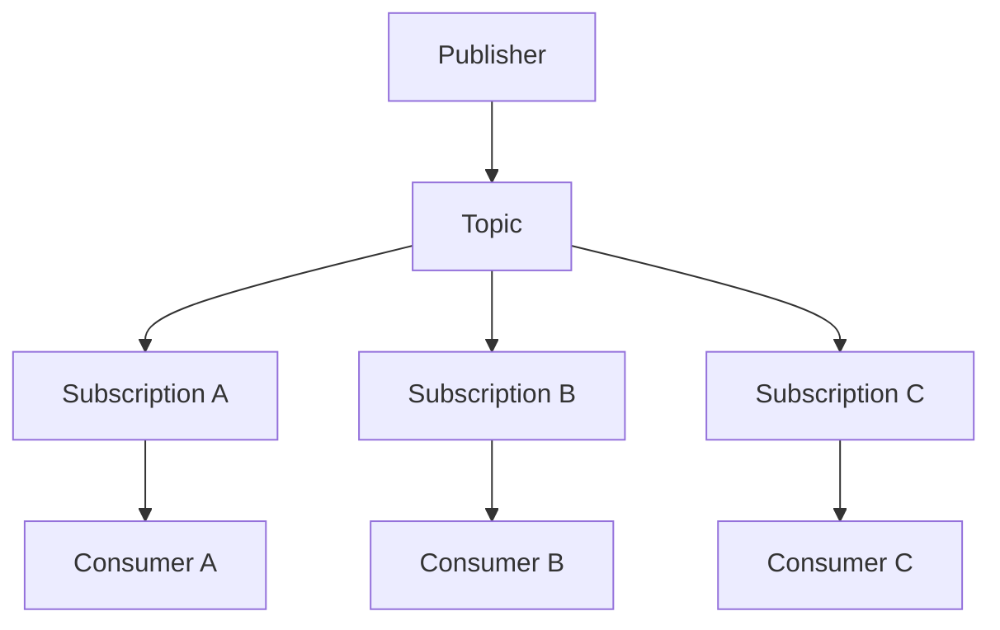
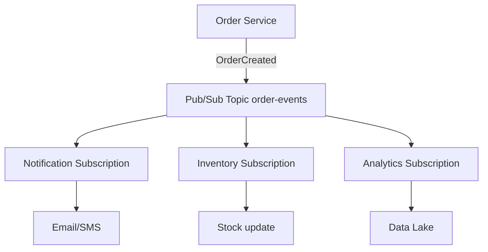
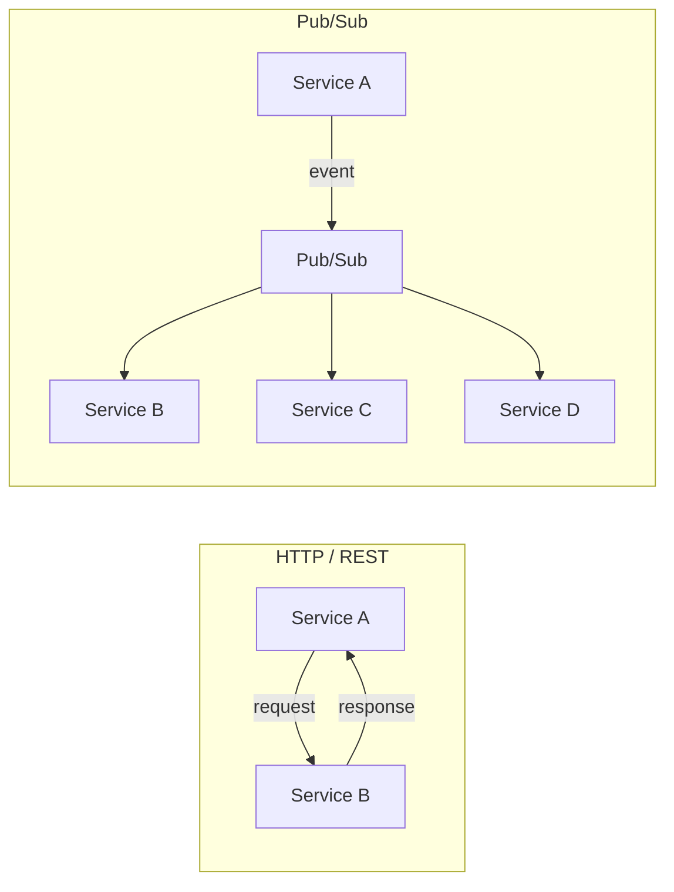
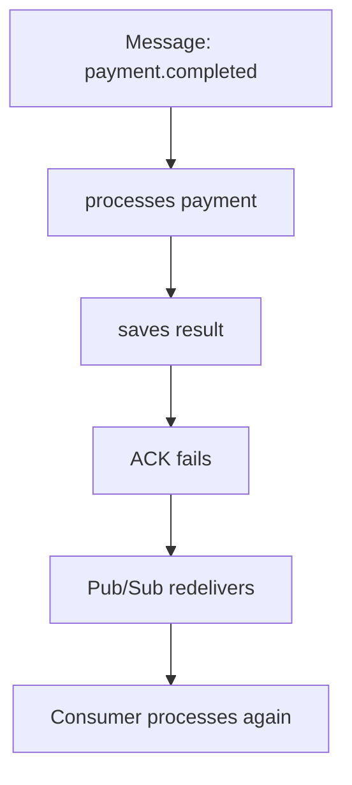
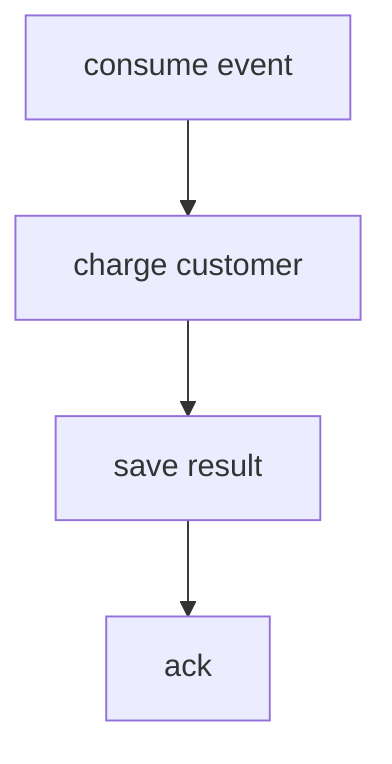
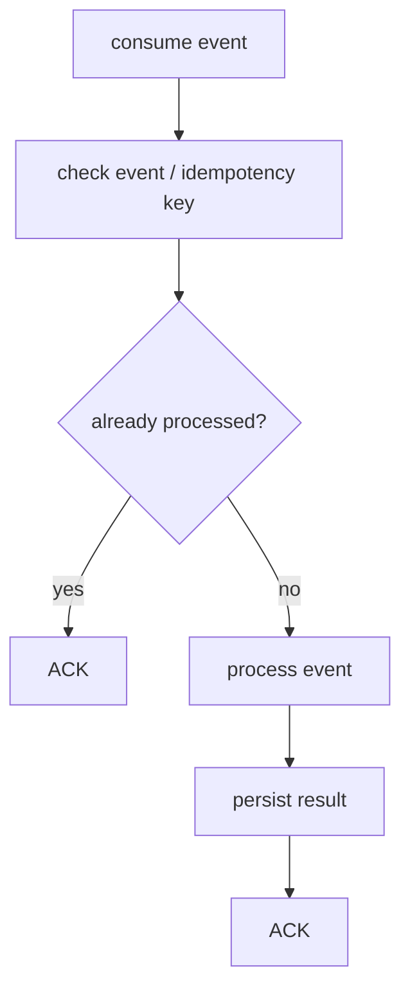
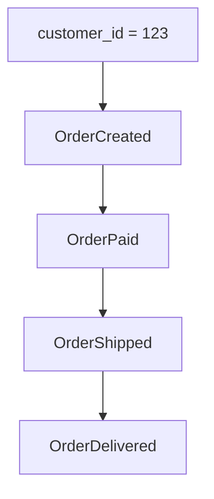
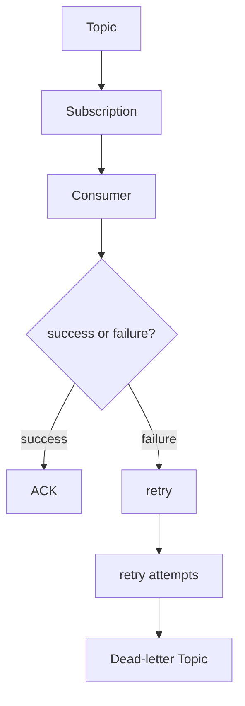
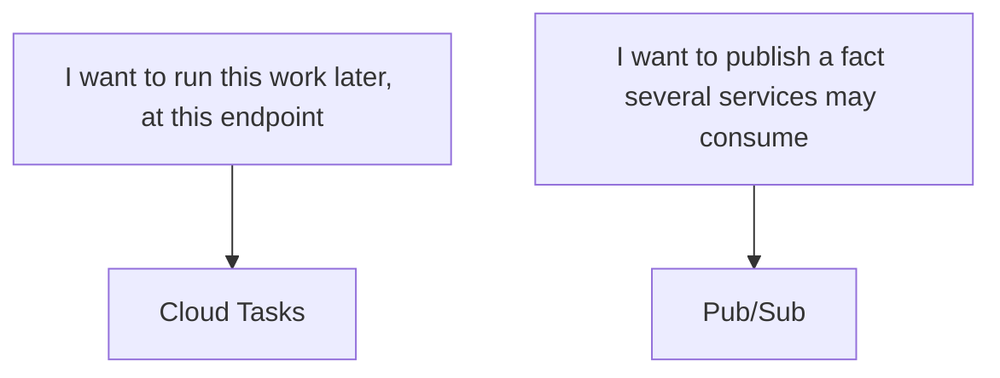
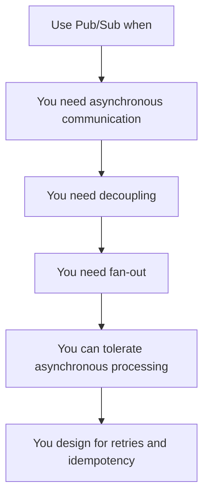

Tu servicio de pagos no debería esperar a que notificaciones, analytics, auditoría y facturación terminen de procesar un evento.

Esa frase es todo el problema. Un handler de checkout que llama a cuatro servicios por HTTP antes de devolver 200 ha acoplado cuatro dominios de fallo a una petición de usuario. Si email es lento, el cargo de tarjeta se siente lento. Si analytics está caído, el pedido falla. Si añades un quinto consumidor el trimestre que viene, cambias el servicio de pagos de nuevo.

Las llamadas síncronas son la herramienta correcta cuando quien llama necesita una respuesta. Son la herramienta equivocada cuando quien llama solo necesita registrar que algo ya pasó.

Google Cloud Pub/Sub es un servicio de mensajería asíncrona. Los publishers envían mensajes a un topic. Los subscribers reciben esos mensajes después, de forma independiente, a través de subscriptions. La garantía del producto es **at-least-once delivery**, no «tu arquitectura ahora es event-driven». Pub/Sub no te da transacciones distribuidas, request/response, ni efectos de negocio exactly-once por defecto.

Úsalo cuando necesites desacoplamiento, fan-out, o trabajo que puede terminar después de la petición. Sáltalo cuando una sola llamada HTTP es el diseño real.

## El modelo mental: un topic no es una cola

Estas son las piezas que importan en producción.

- **Publisher** — produce un mensaje y lo publica a un topic.
- **Topic** — un canal con nombre. No es una cola de consumidores.
- **Message** — datos más atributos opcionales y una ordering key opcional. Pub/Sub añade un message ID y un timestamp de publicación.
- **Subscription** — un interés nombrado en un topic. Cada subscription recibe su propia copia de cada mensaje publicado.
- **Subscriber** — la aplicación que recibe mensajes de una subscription.
- **Ack** — el subscriber le dice a Pub/Sub que el mensaje está procesado. Hasta entonces, el mensaje está pendiente.
- **Redelivery** — si el ack deadline expira o el subscriber hace nack, Pub/Sub envía el mensaje de nuevo.
- **Dead-letter topic** — después de fallos de entrega repetidos, Pub/Sub puede reenviar el mensaje a otro topic para inspección.
- **Ordering key** — una cadena que agrupa mensajes relacionados para que una subscription pueda recibirlos en orden de publicación, si habilitas ordering.
- **Schema** — un contrato opcional Avro o Protocol Buffer en el topic. Los publishes que no cumplen se rechazan.
- **Push subscription** — Pub/Sub llama a tu endpoint HTTPS.
- **Pull / StreamingPull** — tu cliente solicita mensajes. Las librerías de alto nivel usan StreamingPull.

La relación es fan-out desde un topic, no una línea única de consumidores:



Un topic es un canal de eventos. Las subscriptions son las copias independientes. Si Notificaciones, Inventario y Analytics necesitan cada uno el mismo evento `OrderCreated`, eso son **tres subscriptions**, no tres workers compitiendo en una cola.

Múltiples subscribers en la **misma** subscription son un patrón diferente. Pub/Sub hace load balancing: cada subscriber recibe un subconjunto de los mensajes, y ningún par de subscribers en esa subscription recibe el mismo subconjunto. Así es como escalas horizontalmente un tipo de consumidor. No es como haces fan-out a diferentes capacidades de negocio.

Confundir esas dos formas es el error de diseño más común que veo. Una subscription para «todos los que les importan los pedidos» significa que Inventario y Analytics compiten por los mismos mensajes. Uno de ellos pierde eventos. El topic no hizo nada mal.

## Fan-out en un flujo de pedidos



Order Service publica `OrderCreated` y retorna. No sabe quién se suscribió. Añadir un consumidor de fraude el mes que viene es una nueva subscription, no un cambio en checkout.

Esa es la victoria de desacoplamiento. El productor es dueño del hecho. Cada consumidor es dueño de su reacción, sus reintentos y su modo de fallo. Que email esté caído no hace rollback del pedido.

Este es también el límite. Order Service no puede esperar a que Inventory confirme stock. Si la respuesta HTTP debe incluir «artículo reservado», Pub/Sub es el salto equivocado en ese path.

## No necesitas Pub/Sub para todo

Pub/Sub encaja cuando el trabajo es genuinamente asíncrono:

- una petición debería retornar antes de que terminen los efectos secundarios
- varios servicios deben reaccionar al mismo hecho
- los productores no deberían conocer la lista de consumidores
- estás ingiriendo eventos en un pipeline o data lake
- puedes tolerar procesamiento que ocurre después de que el usuario se fue

Es normalmente la opción equivocada cuando:

- quien llama necesita una respuesta para continuar
- estás modelando una API request/response
- necesitas una transacción distribuida entre servicios
- una llamada HTTP a un endpoint conocido es todo el trabajo
- no hay trabajo asíncrono real, solo un deseo de «parecer event-driven»



HTTP es una conversación. Pub/Sub es un broadcast de un hecho. Si publicas `ChargeCard` y después haces polling a otro servicio para obtener el resultado para que el usuario pueda ver un recibo, has reconstruido RPC con modos de fallo extra. Eso no es desacoplamiento. Es una cola delante de una llamada a función.

## At-least-once delivery es el contrato por defecto

Pub/Sub entrega cada mensaje **al menos una vez** a una subscription. Un subscriber que no hace acknowledge antes del deadline, o que hace nack, recibe el mensaje de nuevo. La guía oficial de subscribers es explícita: se esperan duplicados ocasionales, y tu sistema debe tolerarlos.



El ack significa «Pub/Sub puede dejar de ofrecer esta entrega». No significa «el efecto de negocio se ejecutó exactamente una vez». Si cobraste la tarjeta y después perdiste el ack, la siguiente entrega intentará cobrar de nuevo a menos que diseñes para eso.

Un ack exitoso tampoco hace al handler idempotente. La idempotencia es tu path de escritura, no un flag de Pub/Sub.

## La regla de oro: los consumidores deben ser idempotentes

Un consumidor de pagos que asume una entrega es un incidente de producción esperando un parpadeo.

Incorrecto:



Más robusto:



Usa una clave estable — normalmente `eventId`, o una clave de negocio como `paymentId` más `eventType` — y persístela en la misma transacción que el efecto secundario cuando puedas. Si la fila ya existe, haz ack y para. Si la API de cobro en sí no es idempotente, envía _su_ clave de idempotencia también. Pub/Sub no lo hará por ti.

Esta es una regla de diseño, no una feature del producto. Exactly-once delivery, que cubro a continuación, reduce las _entregas_ duplicadas. No elimina la necesidad de hacer seguros bajo reintento a cobros, emails y actualizaciones de stock.

## Exactly-once delivery no es un default mágico

Pub/Sub puede habilitar **exactly-once delivery** en una subscription. Está apagado a menos que lo actives. Cuando está activo, la semántica documentada es:

- los subscribers pueden saber si un ack tuvo éxito
- después de un ack exitoso, ese mensaje no se reentrega
- mientras un mensaje está pendiente, no se reentrega
- si una entrega se reintenta (deadline expirado o nack), solo el último ack ID es válido

Condiciones que importan en sistemas reales:

- **Solo Pull y StreamingPull.** Las subscriptions Push y export no lo soportan.
- **Subscribers en la misma región.** La garantía se mantiene cuando los subscribers se conectan en una región cloud. Una flota de subscribers repartida entre regiones todavía puede ver duplicados. Los publishers pueden publicar desde cualquier región.
- **Todavía manejas fallos de ack.** Si el RPC de ack falla, deberías esperar reentrega y saltar trabajo que ya terminaste.

Los trade-offs están documentados, no implícitos: mayor latencia publish-to-subscribe, y deberías extender leases agresivamente para que el jitter de red no expire un ack ID. La guía oficial de subscribers dice habilitarlo solo si la aplicación no puede tolerar duplicados, y sopesar ese coste de latencia primero.

Exactly-once delivery es una propiedad de entrega. La idempotencia es una propiedad de negocio. Usa la feature cuando los _duplicados de entrega_ sean caros de filtrar. Aun así escribe el consumidor como si un reintento pudiera ocurrir — porque fallos de ack, clientes multi-región, y efectos secundarios fuera de Pub/Sub siguen siendo tu problema.

## El ordenamiento de mensajes es por key, no global

No trates Pub/Sub como un log globalmente ordenado. Sin ordering habilitado, el orden de entrega no está garantizado. Con él habilitado, el orden es **por ordering key**, y solo si el publisher envió esos mensajes **en la misma región**. Los subscribers pueden conectarse desde cualquier región y aun así ver ese orden por key.



Pon `ordering_key` a `123` (u otro id de entidad estable), habilita message ordering en la subscription, y publica esos cuatro eventos desde una región — típicamente vía un endpoint regional. Entonces se espera que `OrderPaid` llegue antes de `OrderShipped` para ese cliente. Eventos para el cliente `456` tienen su propia secuencia. No hay promesa de que el primer evento del cliente 123 llegue antes del último del cliente 456.

Coste de esa promesa:

- el throughput de publicación por ordering key está limitado a **1 MBps**
- la entrega ordenada reduce la disponibilidad de publicación y aumenta la latencia end-to-end versus entrega sin orden
- una reentrega del mensaje 2 también reentrega mensajes posteriores en esa key, incluyendo los que ya hiciste ack
- una key caliente — un id que supera a su consumidor — acumula su propio backlog; Pub/Sub no paralelizará esa key por ti
- las subscriptions push permiten solo un mensaje pendiente por key, así que son mala opción cuando la misma key está caliente

Necesitas ordering cuando el consumidor no puede reconstruir la secuencia (actualizaciones tipo ledger, algunos flujos de sesión). No lo necesitas porque «los pedidos deberían pasar en orden» en abstracto. Muchos consumidores pueden aplicar `OrderShipped` después de `OrderCreated` con comprobaciones de estado e ignorar un duplicado tardío. Eso es más barato que convertir el topic en una cola por cliente.

## Los dead-letter topics capturan veneno, no lo borran

Un mensaje que nunca hace ack se reintentará hasta que expire de la retención. Un payload malo, un bug, o una dependencia caída por horas puede fijar un consumidor en el mismo registro. Un dead-letter topic es cómo paras ese bucle sin pretender que el evento nunca existió.



Después de un número aproximado de intentos de entrega — por defecto **5**, configurable de **5 a 100** — Pub/Sub puede reenviar el mensaje a un dead-letter topic. El reenvío es **best-effort**. El servicio puede mover un mensaje unos intentos antes o después, y el contador de intentos puede reiniciarse en una subscription pull idle. Diseña para «esto aparecerá en el DLT», no para un N exacto.

Adjunta una subscription al dead-letter topic. Inspecciona, arregla y reproduce. Descartar mensajes envenenados a `/dev/null` oculta pérdida de datos. La métrica a vigilar es `subscription/dead_letter_message_count`.

## Reintenta errores transitorios. Limita todo lo demás.

No todo fallo merece el mismo reintento.

- **Transitorio** — timeout, 429, un failover de réplica. Haz nack o deja que expire el deadline. Prefiere backoff exponencial en la subscription (mínimo y máximo entre 0 y 600 segundos). La política por defecto es **reintentar inmediatamente**.
- **Dependencia caída** — igual que transitorio, pero vigila el backlog. Reintentos inmediatos infinitos amplifican un outage en una tormenta de reintentos.
- **Mensaje inválido** — desajuste de esquema, falta `orderId`. Reintentar no ayudará. Falla hacia el dead-letter topic después de los intentos configurados, o haz nack solo si vas a arreglar el publisher rápido.
- **Rechazo de negocio permanente** — «tarjeta robada», «SKU retirado». Haz ack después de registrar el resultado. Reintentar un pago correctamente rechazado es cómo cobras doble o haces spam.

La política de reintentos en sí es best-effort. Los docs de Google advierten contra usar nacks para inventar delays, y contra hacer nack a grandes volúmenes: algunos mensajes pueden volver con poco o ningún backoff, y la entrega de toda la subscription puede ralentizarse.

Reintentos ilimitados sin dead-letter topic significa que un mensaje envenenado ocupa un slot hasta que la retención (por defecto **7 días**, de 10 minutos a 31 días) lo descarte. Eso es un descarte silencioso con un delay largo. Pon un techo a los intentos y mira qué llega al techo.

## Prácticas de publisher que están realmente documentadas

Estas son de la guía de mejores prácticas de publicación de Google, no folklore. Ajústalas cuando tu caso de uso lo necesite; los defaults están ahí por una razón.

**Adjunta una subscription o habilita topic retention antes de publicar.** Los mensajes publicados a un topic sin subscription y sin topic retention no se guardan. Un consumidor que añadas después no los verá.

**Batching** está activo por defecto en las librerías cliente. Cambias latencia por mensaje por throughput y coste. Un batch publica cuando tamaño, conteo o delay alcanza su umbral. Un límite de 10 MB / 1000 mensajes aplica a una sola petición de publicación. Si necesitas que el path de cara al usuario sea rápido, no agrandes batches en ese path.

**Publisher flow control** limita bytes y mensajes pendientes de publicación para que un pico no llene la memoria y muera con `DEADLINE_EXCEEDED`. Pon límites a la máquina en la que corres. Bloquear o dar error cuando se alcanza el límite es una elección de producto: absorbe el pico, o empuja de vuelta a quien llama.

**Los reintentos de publisher** ya tienen defaults (en la librería Java, por ejemplo, delay inicial de reintento 100 ms, multiplicador 4, delay máximo de reintento 60 s, timeout total 600 s). Guía oficial: déjalos a menos que tengas evidencia de que están mal. Redes con problemas o alta latencia son la razón habitual para tocar timeouts de RPC, no «publicamos mucho».

**Schemas** (Avro o Protocol Buffer) imponen el campo `data`. Un tipo top-level, sin imports de otros tipos, esquema de 300 KB, 20 revisiones. Usa un schema cuando múltiples equipos consumen el stream y quieres que el broker rechace basura. Versiona el payload de todas formas; un schema no reemplaza `eventType` + `version` en el evento.

**Ordering** en el lado de publicación significa endpoints regionales para que una key se quede en una región, y un path de resume-publish si un error no retriable detiene esa key.

**Message storage policy** es cómo mantienes datos en disco dentro de un conjunto permitido de regiones. Úsalo para requisitos de residencia, no como una perilla de rendimiento.

## Prácticas de subscriber que te mantienen fuera del infierno de reentrega

**Procesa, después haz ack.** Un ack antes de la escritura es cómo pierdes un mensaje en un crash. Pub/Sub no reentregará un mensaje con ack exitoso a menos que hagas seek.

**Ack deadline** por defecto es **10 segundos** (10–600). Las librerías cliente extienden leases. Si el procesamiento regularmente excede el deadline, obtienes duplicados que parecen «Pub/Sub está roto». Son leases expirados. Los handlers lentos deberían extender, hacer nack, o hacer menos trabajo inline.

**StreamingPull** vía la librería cliente de alto nivel es la recomendación por defecto para pull. Pull unitario con `returnImmediately=true` está deprecado y perjudica el rendimiento.

**Subscriber flow control** limita mensajes y bytes pendientes. Cuando se alcanza el límite, el cliente deja de hacer pull. Eso es backpressure. Es cómo un consumidor lento evita ahogarse y después hacer nack a todo.

**Un consumidor lento produce reentregas.** Los mensajes pendientes alcanzan el deadline, Pub/Sub los envía de nuevo, el consumidor recibe más trabajo, el deadline expira otra vez. Flow control, más réplicas en la misma subscription, y un deadline que coincida con el p99 de tiempo de procesamiento rompen ese bucle. Un dead-letter topic detiene los pocos mensajes que nunca tendrán éxito.

**Push** es la forma correcta para un webhook que no quieres sondear — Cloud Run, un solo handler HTTPS, sin librería cliente. Pub/Sub controla el flow. Errores HTTP son nacks. El backoff de push (100 ms a 60 s, no configurable) puede detener toda la subscription si el endpoint no está sano. Monitoriza los códigos de respuesta de push.

**Observa la subscription**, no solo el proceso. Backlog y ack deadlines expirados te dicen que el consumidor está mintiendo sobre estar sano.

## No publiques JSON arbitrario

Un mensaje de Pub/Sub puede ser cualquier byte. Eso no hace que cualquier byte sea un buen evento.

```json
{
  "eventId": "evt_123",
  "eventType": "order.created",
  "version": 1,
  "occurredAt": "2026-08-14T20:00:00Z",
  "source": "order-service",
  "data": {
    "orderId": "ord_123",
    "customerId": "cus_456"
  }
}
```

- **eventId** — único, estable, tu clave de idempotencia.
- **eventType** — el hecho, nombrado en tiempo pasado.
- **version** — el contrato de `data`. Los consumidores ramifican o rechazan basándose en él.
- **occurredAt** — cuándo ocurrió el hecho de negocio, que no siempre es `publishTime`.
- **source** — qué bounded context lo produjo.
- **data** — el payload. Mantenlo como un hecho, no una lista de tareas para otros equipos.

Este envelope es una decisión de diseño. Pub/Sub no lo requerirá. Un schema de topic puede bloquear la forma de `data` si adjuntas Avro o Protobuf.

Evoluciona añadiendo campos opcionales o incrementando `version` y corriendo dos paths de consumidor. No renombres un campo bajo `version: 1` y esperes que todos los subscribers hayan desplegado el martes.

Nombra eventos como hechos, no comandos:

```text
❌ sendEmail
❌ updateInventory

✅ OrderCreated
✅ PaymentCompleted
```

`sendEmail` le dice a Notificaciones qué hacer. Cuando Facturación también necesita el pago, publicas un segundo comando o sobrecargas el primero. `PaymentCompleted` es algo que ya pasó. Cualquiera que le importe puede suscribirse. La guía event-driven de Google hace la misma distinción: los comandos imperativos hacen que el orden y la propiedad importen más de lo que deberían; los hechos no.

## Pub/Sub vs HTTP

Trata esto como una heurística, no como un marcador. Muchos sistemas usan ambos: HTTP para la escritura de cara al usuario, Pub/Sub para todo lo que puede esperar.

| Característica          | HTTP                     | Pub/Sub                              |
| ----------------------- | ------------------------ | ------------------------------------ |
| Comunicación            | Síncrona                 | Asíncrona                            |
| Acoplamiento            | Quien llama conoce al destino | El publisher no necesita conocer a los subscribers |
| Fan-out                 | Lo implementas tú        | Un topic, muchas subscriptions       |
| Reintento               | Tu cliente               | Reentrega, política de reintentos, DLT |
| Persistencia de mensajes| No por defecto           | Retenido hasta ack o retención       |
| Respuesta inmediata     | Sí                       | No                                   |
| Trabajo event-driven    | Incómodo                 | La forma nativa                      |

Si Service B debe decir sí o no antes de que Service A haga commit, usa HTTP (o una transacción de base de datos en el mismo servicio). Si Service B, C y D deben reaccionar cuando A ya hizo commit, usa Pub/Sub.

## Pub/Sub vs Cloud Tasks

No todo job en background es un evento.



La comparación de Google es **invocación explícita vs implícita**. Cloud Tasks: el productor nombra el handler, puede programar una hora, puede limitar la tasa, y puede deduplicar la creación de tareas. Pub/Sub: el productor publica, y quien se suscribió ejecuta. Pub/Sub no le da al publisher entrega programada ni deduplicación en tiempo de creación. Cloud Tasks no hace fan-out de una tarea a muchos handlers independientes.

Un job de «envía este PDF de factura en 15 minutos» es Cloud Tasks. Un evento `InvoiceFinalized` que email, el data warehouse, y el servicio de cobros necesitan es Pub/Sub. Si solo tienes un worker conocido y necesitas que corra una vez a las 17:00, un topic es ceremonia.

## Qué vigilar en producción

Usa los nombres que Cloud Monitoring realmente exporta. No inventes una métrica de «tasa de reentrega» y asumas que existe.

- **Backlog** — `subscription/num_unacked_messages_by_region` y `subscription/oldest_unacked_message_age_by_region`. Una edad creciente es peor que un conteo creciente: unos pocos mensajes atascados harán que tu SLO expire aunque el volumen se vea bien.
- **Salud de latencia de entrega** — `subscription/delivery_latency_health_score` sobre una ventana móvil de 10 minutos. Puntúa si la subscription puede mantenerse en baja latencia, no un solo percentil que puedas citar sin los docs.
- **Deadlines perdidos** — `subscription/expired_ack_deadlines_count` en pull/StreamingPull. Esa es tu presión de reentrega de handlers lentos o crasheados. Para push, usa `subscription/push_request_count` filtrado fuera de éxito.
- **Throughput** — `subscription/sent_message_count` (y `subscription/pull_request_count` si te importan los pulls vacíos).
- **Dead letters** — `subscription/dead_letter_message_count`. Un DLT silencioso no es «sin errores» a menos que confirmes que la subscription está configurada e IAM es correcto.

Alerta sobre oldest unacked age y conteo de DLT antes de alertar sobre QPS de publicación crudo. QPS de publicación sin consumidor es una manguera hacia la retención.

## Siete errores que sigo viendo

**1. Reemplazar REST con Pub/Sub.** La UI necesita un id de reserva. Publicas `ReserveStock` y esperas en otro topic por `StockReserved`. Ahora tienes RPC con una política de reintentos de 7 días. Llama a Inventario.

**2. Consumidores que no son idempotentes.** El servicio de email envía en cada entrega. Un deadline expirado en una llamada SMTP lenta se convierte en tres mensajes «Tu pedido fue enviado». Indexa el envío por `eventId`.

**3. Asumir que exactly-once es el default.** No lo es. Es opt-in, solo pull, y regional. El default es at-least-once. Diseña para eso primero.

**4. Habilitar ordering porque suena correcto.** Un `customer_id` caliente serializa un fragmento de tu throughput a 1 MBps de publicación y lo que tu callback pueda procesar. La mayoría de consumidores pueden aplicar eventos con comprobaciones de versión en su lugar.

**5. Sin dead-letter topic.** Un solo payload que no se puede parsear reintenta por días, ocupa slots de flow-control, y después desaparece en la retención. Nunca lo ves.

**6. Eventos sin versionar.** Añades `discountCode` en el lugar, un consumidor de hace una semana lanza excepción, y el DLT se llena de mensajes que eran válidos ayer. Incrementa `version` o añade solo campos opcionales.

**7. No vigilar backlog y acks expirados.** El dashboard de subscribers está verde porque el proceso está arriba. `oldest_unacked_message_age_by_region` es 40 minutos. Los usuarios ya lo notaron.

## Cómo usa Google esta infraestructura

El resumen arquitectónico de Google es cuidadoso con la redacción, y nosotros deberíamos serlo también. Cloud Pub/Sub está construido sobre un componente core de infraestructura de Google que productos como **Ads, Search y Gmail** han usado durante más de una década para enviar **más de 500 millones de mensajes por segundo**, totalizando **más de 1 TB/s**. Eso es una declaración sobre el fabric interno de mensajería, no una afirmación de que la UI de Gmail es un tutorial de Pub/Sub.

Lo que se transfiere a un sistema que nunca verá ese throughput:

- **Desacoplamiento** — los productores no bloquean en el conjunto completo de consumidores.
- **Escala horizontal** — la carga es por mensaje, no por partición que provisionas.
- **Distribución** — publicar y suscribir no están atados a una caja o una región en la API del cliente.
- **Resiliencia** — la disponibilidad se define como sobrevivir fallos de máquina, red y carga sin que el publisher sepa cómo ocurrió la entrega.
- **Asincronía** — el producto existe porque el fan-out síncrono a ese volumen no es una arquitectura.

No necesitas 500 millones de mensajes por segundo para necesitar esas propiedades. Las necesitas tan pronto como una petición de usuario está esperando trabajo que no es parte de la respuesta.

## Pub/Sub no está ahí para hacer que el diagrama parezca distribuido

Pub/Sub existe para resolver problemas concretos: comunicación asíncrona, desacoplamiento, y distribución de eventos. No existe para decorar un monolito con topics.



Si algún paso es no, para. HTTP o Cloud Tasks es probablemente el diseño más pequeño.

Antes de añadir Pub/Sub a la arquitectura, ¿qué problema estás intentando resolver?

## Fuentes

- [What is Pub/Sub?](https://docs.cloud.google.com/pubsub/docs/overview)
- [Overview of the Pub/Sub service](https://docs.cloud.google.com/pubsub/docs/pubsub-basics)
- [Architectural overview of Pub/Sub](https://docs.cloud.google.com/pubsub/architecture)
- [Event-driven architecture with Pub/Sub](https://docs.cloud.google.com/solutions/event-driven-architecture-pubsub)
- [Publish messages to topics](https://docs.cloud.google.com/pubsub/docs/publisher)
- [Best practices to publish](https://docs.cloud.google.com/pubsub/docs/publish-best-practices)
- [Choose a subscription type](https://docs.cloud.google.com/pubsub/docs/subscriber)
- [Best practices to subscribe](https://docs.cloud.google.com/pubsub/docs/subscribe-best-practices)
- [Subscription properties](https://docs.cloud.google.com/pubsub/docs/subscription-properties)
- [Exactly-once delivery](https://docs.cloud.google.com/pubsub/docs/exactly-once-delivery)
- [Order messages](https://docs.cloud.google.com/pubsub/docs/ordering)
- [Dead-letter topics](https://docs.cloud.google.com/pubsub/docs/dead-letter-topics)
- [Subscription retry policy](https://docs.cloud.google.com/pubsub/docs/subscription-retry-policy)
- [Schema overview](https://docs.cloud.google.com/pubsub/docs/schemas)
- [Choosing Pub/Sub or Cloud Tasks](https://docs.cloud.google.com/pubsub/docs/choosing-pubsub-or-cloud-tasks)
- [Monitor Pub/Sub](https://docs.cloud.google.com/pubsub/docs/monitoring)
- [Pub/Sub reliability](https://docs.cloud.google.com/pubsub/docs/reliability-intro)
