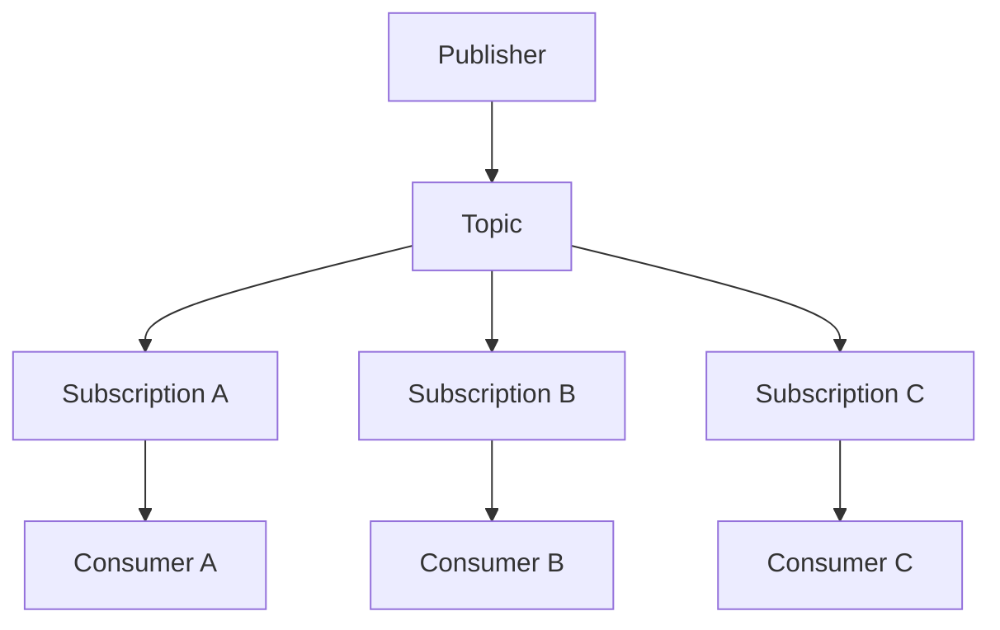
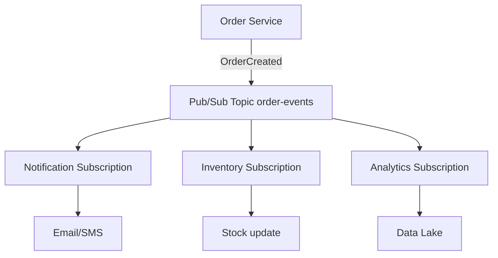
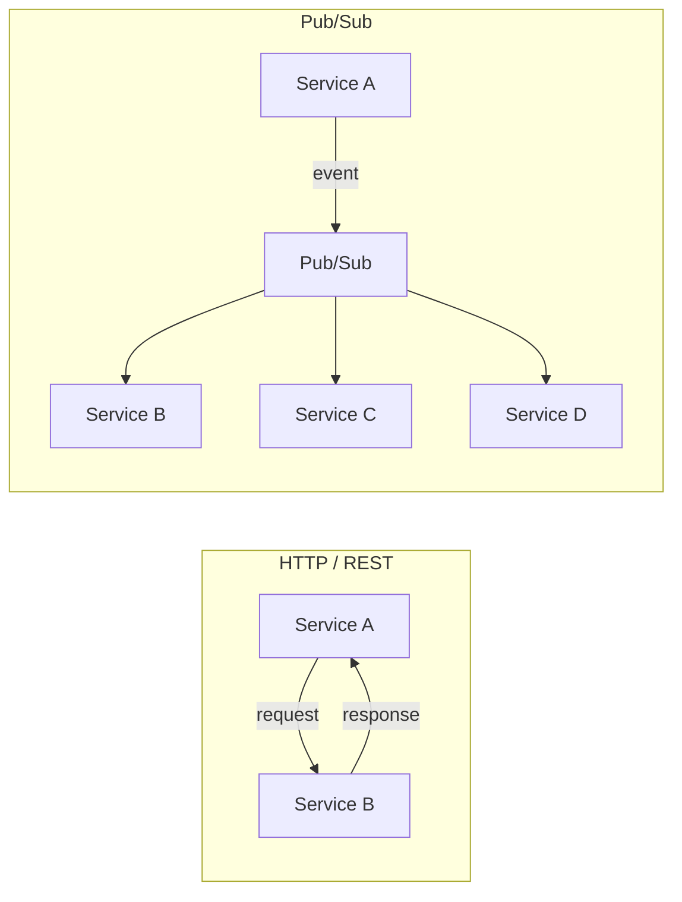
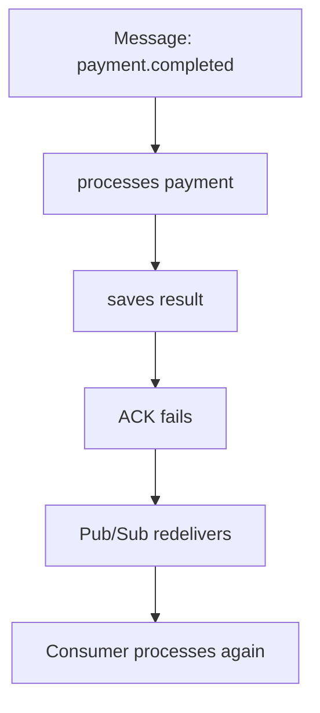
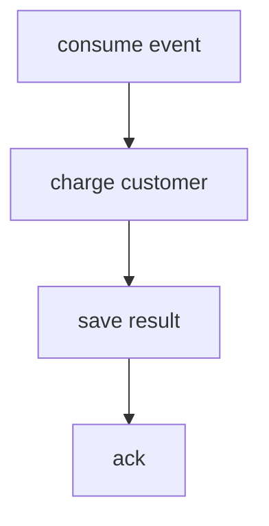
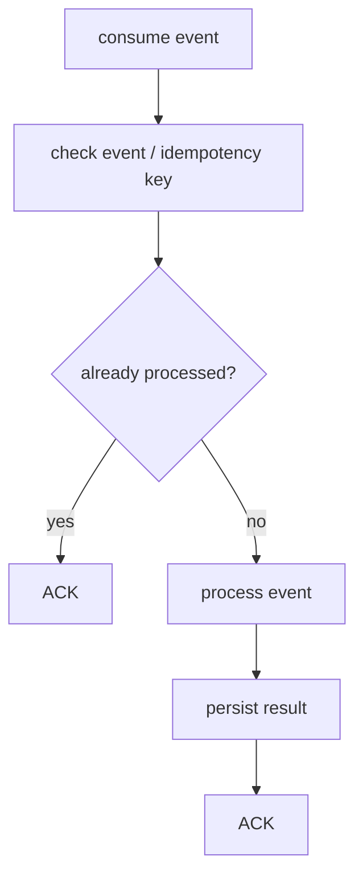
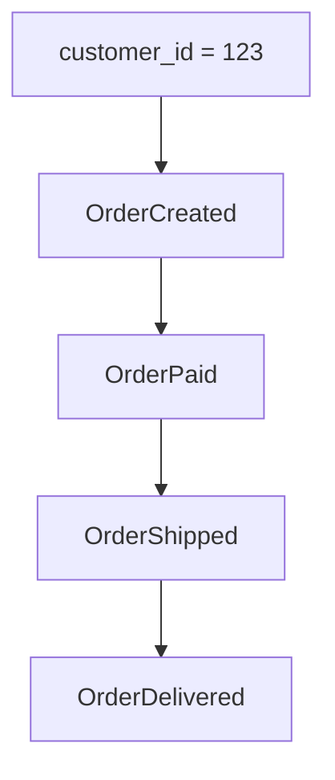
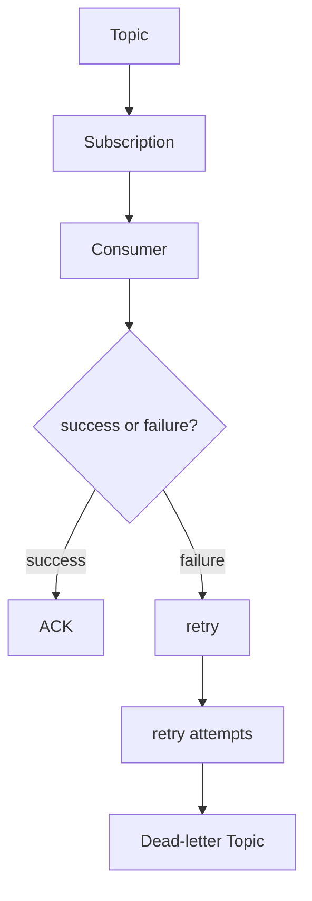
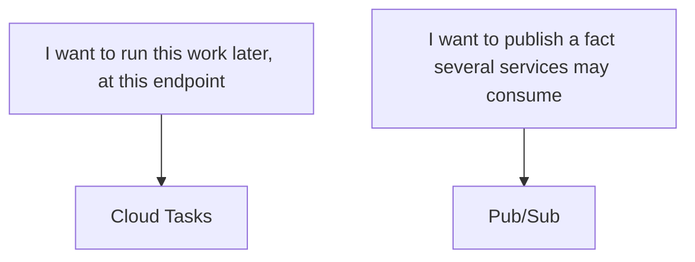
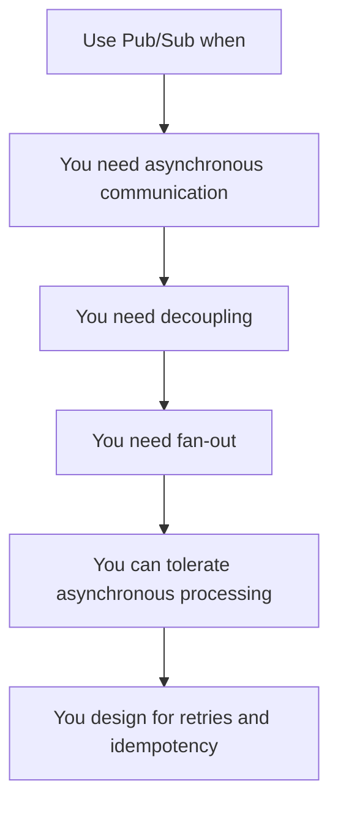

Your payment service should not wait for notifications, analytics, audit, and billing to finish processing an event.

That sentence is the whole problem. A checkout handler that calls four other services over HTTP before it returns 200 has coupled four failure domains to one user request. If email is slow, the card charge feels slow. If analytics is down, the order fails. If you add a fifth consumer next quarter, you change the payment service again.

Synchronous calls are the right tool when the caller needs an answer. They are the wrong tool when the caller only needs to record that something already happened.

Google Cloud Pub/Sub is an asynchronous messaging service. Publishers send messages to a topic. Subscribers receive those messages later, independently, through subscriptions. The product guarantee is **at-least-once delivery**, not “your architecture is now event-driven.” Pub/Sub does not give you distributed transactions, request/response, or exactly-once business effects by default.

Use it when you need decoupling, fan-out, or work that can finish after the request. Skip it when a single HTTP call is the actual design.

## The mental model: a topic is not a queue

These are the pieces that matter in production.

- **Publisher** — produces a message and publishes it to a topic.
- **Topic** — a named channel. It is not a consumer queue.
- **Message** — data plus optional attributes and an optional ordering key. Pub/Sub adds a message ID and a publish timestamp.
- **Subscription** — a named interest in a topic. Each subscription gets its own copy of every published message.
- **Subscriber** — the application that receives messages from a subscription.
- **Ack** — the subscriber tells Pub/Sub the message is done. Until then, the message is outstanding.
- **Redelivery** — if the ack deadline expires or the subscriber nacks, Pub/Sub sends the message again.
- **Dead-letter topic** — after repeated failed deliveries, Pub/Sub can forward the message to another topic for inspection.
- **Ordering key** — a string that groups related messages so a subscription can receive them in publish order, if you enable ordering.
- **Schema** — an optional Avro or Protocol Buffer contract on the topic. Non-conforming publishes are rejected.
- **Push subscription** — Pub/Sub calls your HTTPS endpoint.
- **Pull / StreamingPull** — your client requests messages. The high-level client libraries use StreamingPull.

The relationship is fan-out from a topic, not a single line of consumers:



A topic is a channel of events. Subscriptions are the independent copies. If Notification, Inventory, and Analytics each need the same `OrderCreated` event, that is **three subscriptions**, not three competing workers on one queue.

Multiple subscribers on the **same** subscription are a different pattern. Pub/Sub load-balances: each subscriber gets a subset of the messages, and no two subscribers on that subscription get the same subset. That is how you scale one consumer type horizontally. It is not how you fan out to different business capabilities.

Confusing those two shapes is the most common design error I see. One subscription for “everyone who cares about orders” means Inventory and Analytics race for the same messages. One of them loses events. The topic did nothing wrong.

## Fan-out in an order flow



Order Service publishes `OrderCreated` and returns. It does not know who subscribed. Adding a fraud consumer next month is a new subscription, not a change to checkout.

That is the coupling win. The producer owns the fact. Each consumer owns its reaction, its retries, and its failure mode. Email being down does not roll back the order.

This is also the limit. Order Service cannot wait for Inventory to confirm stock. If the HTTP response must include “item reserved,” Pub/Sub is the wrong hop in that path.

## You do not need Pub/Sub for everything

Pub/Sub fits when the work is genuinely asynchronous:

- a request should return before side effects finish
- several services must react to the same fact
- producers should not know the consumer list
- you are ingesting events into a pipeline or data lake
- you can tolerate processing that happens after the user is gone

It is usually the wrong default when:

- the caller needs a response to continue
- you are modeling a request/response API
- you need a distributed transaction across services
- one HTTP call to one known endpoint is the whole job
- there is no real async work, only a desire to “look event-driven”



HTTP is a conversation. Pub/Sub is a broadcast of a fact. If you publish `ChargeCard` and then poll another service for the result so the user can see a receipt, you have rebuilt RPC with extra failure modes. That is not decoupling. That is a queue in front of a function call.

## At-least-once delivery is the default contract

Pub/Sub delivers each message **at least once** to a subscription. A subscriber that does not acknowledge before the deadline, or that nacks, gets the message again. Official subscriber guidance is explicit: occasional duplicates are expected, and your system must tolerate them.



The ack means “Pub/Sub may stop offering this delivery.” It does not mean “the business effect ran exactly once.” If you charged the card and then lost the ack, the next delivery will try to charge again unless you designed for that.

A successful ack also does not make the handler idempotent. Idempotency is your write path, not a Pub/Sub flag.

## The golden rule: consumers must be idempotent

A payment consumer that assumes one delivery is a production incident waiting for a blip.

Incorrect:



More robust:



Use a stable key — usually `eventId`, or a business key such as `paymentId` plus `eventType` — and persist it in the same transaction as the side effect when you can. If the row already exists, ack and stop. If the charge API itself is not idempotent, send _its_ idempotency key too. Pub/Sub will not do that for you.

This is a design rule, not a product feature. Exactly-once delivery, covered next, narrows duplicate _deliveries_. It does not remove the need to make charges, emails, and stock updates safe under retry.

## Exactly-once delivery is not a magic default

Pub/Sub can enable **exactly-once delivery** on a subscription. It is off unless you turn it on. When it is on, the documented semantics are:

- subscribers can tell whether an ack succeeded
- after a successful ack, that message is not redelivered
- while a message is outstanding, it is not redelivered
- if a delivery is retried (deadline expiry or nack), only the latest ack ID is valid

Conditions that matter in real systems:

- **Pull and StreamingPull only.** Push and export subscriptions do not support it.
- **Same-region subscribers.** The guarantee holds when subscribers connect in one cloud region. A subscriber fleet spread across regions can still see duplicates. Publishers may publish from any region.
- **You still handle ack failure.** If the ack RPC fails, you should expect redelivery and skip work you already finished.

Trade-offs are documented, not implied: higher publish-to-subscribe latency, and you should extend leases aggressively so network jitter does not expire an ack ID. Official subscriber guidance says to enable it only if the application cannot tolerate duplicates, and to weigh that latency cost first.

Exactly-once delivery is a delivery property. Idempotency is a business property. Use the feature when duplicate _deliveries_ are expensive to filter. Still write the consumer as if a retry can happen — because ack failure, multi-region clients, and side effects outside Pub/Sub remain your problem.

## Message ordering is per key, not global

Do not treat Pub/Sub as a globally ordered log. Without ordering enabled, delivery order is not guaranteed. With it enabled, order is **per ordering key**, and only if the publisher sent those messages **in the same region**. Subscribers may connect from any region and still see that per-key order.



Set `ordering_key` to `123` (or another stable entity id), enable message ordering on the subscription, and publish those four events from one region — typically via a locational endpoint. `OrderPaid` is then expected before `OrderShipped` for that customer. Events for customer `456` have their own sequence. There is no promise that customer 123’s first event arrives before customer 456’s last.

Cost of that promise:

- publish throughput per ordering key is limited to **1 MBps**
- ordered delivery reduces publish availability and increases end-to-end latency versus unordered delivery
- a redelivery of message 2 also redelivers later messages on that key, including ones you already acked
- a hot key — one id that outruns its consumer — builds its own backlog; Pub/Sub will not parallelize that key for you
- push subscriptions allow only one outstanding message per key, so they are a poor fit when the same key is hot

You need ordering when the consumer cannot reconstruct sequence (ledger-style updates, some session flows). You do not need it because “orders should happen in order” in the abstract. Many consumers can apply `OrderShipped` after `OrderCreated` with state checks and ignore a late duplicate. That is cheaper than turning the topic into a per-customer queue.

## Dead-letter topics catch poison, they do not delete it

A message that never acks will be retried until it expires from retention. A bad payload, a bug, or a dependency that is down for hours can pin a consumer on the same record. A dead-letter topic is how you stop that loop without pretending the event never existed.



After an approximate number of delivery attempts — default **5**, configurable from **5 to 100** — Pub/Sub can forward the message to a dead-letter topic. Forwarding is **best-effort**. The service may move a message a few attempts early or late, and the attempt counter can reset on an idle pull subscription. Design for “this will show up on the DLT,” not for an exact N.

Attach a subscription to the dead-letter topic. Inspect, fix, and replay. Dropping poison messages to `/dev/null` hides data loss. The metric to watch is `subscription/dead_letter_message_count`.

## Retry transient errors. Bound everything else.

Not every failure deserves the same retry.

- **Transient** — timeout, 429, a replica failover. Nack or let the deadline expire. Prefer exponential backoff on the subscription (minimum and maximum between 0 and 600 seconds). The default policy is **retry immediately**.
- **Dependency down** — same as transient, but watch the backlog. Infinite immediate retries amplify an outage into a retry storm.
- **Invalid message** — schema mismatch, missing `orderId`. Retrying will not help. Fail toward the dead-letter topic after the configured attempts, or nack only if you will fix the publisher quickly.
- **Permanent business rejection** — “card stolen,” “SKU retired.” Ack after you record the outcome. Retrying a correctly rejected payment is how you double-charge or spam.

Retry policy itself is best-effort. Google’s docs warn against using nacks to invent delays, and against nacking large volumes: some messages may come back with little or no backoff, and delivery of the whole subscription can slow down.

Unbounded retry without a dead-letter topic means a poison message occupies a slot until retention (default **7 days**, 10 minutes to 31 days) drops it. That is a silent discard with a long delay. Put a ceiling on attempts and look at what hits the ceiling.

## Publisher practices that are actually documented

These are from Google’s publish best-practice guide, not folklore. Tune them when your use case needs it; the defaults are there for a reason.

**Attach a subscription or enable topic retention before you publish.** Messages published to a topic with no subscription and no topic retention are not kept. A consumer you add later will not see them.

**Batching** is on by default in the client libraries. You trade per-message latency for throughput and cost. A batch publishes when size, count, or delay hits its threshold. A 10 MB / 1000-message cap applies to a single publish request. If you need the user-facing path to be fast, do not enlarge batches on that path.

**Publisher flow control** limits outstanding publish bytes and messages so a spike does not fill memory and die with `DEADLINE_EXCEEDED`. Set limits to the machine you run on. Blocking or erroring when the limit is hit is a product choice: absorb the spike, or push back to the caller.

**Publisher retries** already have defaults (in the Java library, for example, initial retry delay 100 ms, multiplier 4, max retry delay 60 s, total timeout 600 s). Official guidance: leave them unless you have evidence they are wrong. Flaky or high-latency networks are the usual reason to touch RPC timeouts, not “we publish a lot.”

**Schemas** (Avro or Protocol Buffer) enforce the `data` field. One top-level type, no imports of other types, 300 KB schema, 20 revisions. Use a schema when multiple teams consume the stream and you want the broker to reject garbage. Version the payload anyway; a schema does not replace `eventType` + `version` in the event.

**Ordering** on the publish side means locational endpoints so a key stays in one region, and a resume-publish path if a non-retryable error stalls that key.

**Message storage policy** is how you keep data on disk inside an allowed set of regions. Use it for residency requirements, not as a performance knob.

## Subscriber practices that keep you out of redelivery hell

**Process, then ack.** An ack before the write is how you lose a message on a crash. Pub/Sub will not redeliver a successfully acked message unless you seek.

**Ack deadline** defaults to **10 seconds** (10–600). Client libraries extend leases. If processing regularly exceeds the deadline, you get duplicates that look like “Pub/Sub is broken.” They are expired leases. Slow handlers should extend, nack, or do less work inline.

**StreamingPull** via the high-level client library is the default recommendation for pull. Unary pull with `returnImmediately=true` is deprecated and hurts performance.

**Subscriber flow control** caps outstanding messages and bytes. When the cap is hit, the client stops pulling. That is backpressure. It is how a slow consumer avoids drowning and then nacking everything.

**A slow consumer produces redeliveries.** Outstanding messages hit the deadline, Pub/Sub sends them again, the consumer gets more work, the deadline expires again. Flow control, more replicas on the same subscription, and a deadline that matches p99 processing time break that loop. A dead-letter topic stops the few messages that will never succeed.

**Push** is the right shape for a webhook you do not want to poll — Cloud Run, a single HTTPS handler, no client library. Pub/Sub owns flow control. HTTP errors are nacks. Push backoff (100 ms to 60 s, not configurable) can stall the whole subscription if the endpoint is unhealthy. Monitor push response codes.

**Observe the subscription**, not just the process. Backlog and expired ack deadlines tell you the consumer is lying about being healthy.

## Do not publish arbitrary JSON

A Pub/Sub message can be any bytes. That does not make any bytes a good event.

```json
{
  "eventId": "evt_123",
  "eventType": "order.created",
  "version": 1,
  "occurredAt": "2026-08-14T20:00:00Z",
  "source": "order-service",
  "data": {
    "orderId": "ord_123",
    "customerId": "cus_456"
  }
}
```

- **eventId** — unique, stable, your idempotency key.
- **eventType** — the fact, named in the past tense.
- **version** — the contract of `data`. Consumers branch or reject on it.
- **occurredAt** — when the business fact happened, which is not always `publishTime`.
- **source** — which bounded context produced it.
- **data** — the payload. Keep it a fact, not a to-do list for other teams.

This envelope is a design choice. Pub/Sub will not require it. A topic schema can lock the shape of `data` if you attach Avro or Protobuf.

Evolve by adding optional fields or by bumping `version` and running two consumer paths. Do not rename a field under `version: 1` and hope every subscriber deployed on Tuesday.

Name events as facts, not commands:

```text
❌ sendEmail
❌ updateInventory

✅ OrderCreated
✅ PaymentCompleted
```

`sendEmail` tells Notification what to do. When Billing also needs the payment, you publish a second command or you overload the first. `PaymentCompleted` is something that already happened. Anyone who cares can subscribe. Google’s event-driven guidance makes the same distinction: imperative commands make order and ownership matter more than they should; facts do not.

## Pub/Sub vs HTTP

Treat this as a heuristic, not a scoreboard. Plenty of systems use both: HTTP for the user-facing write, Pub/Sub for everything that can wait.

| Characteristic      | HTTP                    | Pub/Sub                             |
| ------------------- | ----------------------- | ----------------------------------- |
| Communication       | Synchronous             | Asynchronous                        |
| Coupling            | Caller knows the callee | Publisher need not know subscribers |
| Fan-out             | You implement it        | One topic, many subscriptions       |
| Retry               | Your client             | Redelivery, retry policy, DLT       |
| Message persistence | Not by default          | Retained until ack or retention     |
| Immediate response  | Yes                     | No                                  |
| Event-driven work   | Awkward                 | The native shape                    |

If Service B must say yes or no before Service A commits, use HTTP (or a database transaction in the same service). If Service B, C, and D should react when A already committed, use Pub/Sub.

## Pub/Sub vs Cloud Tasks

Not every background job is an event.



Google’s comparison is **explicit vs implicit invocation**. Cloud Tasks: the producer names the handler, can schedule a time, can cap rate, and can deduplicate task creation. Pub/Sub: the producer publishes, and whoever subscribed runs. Pub/Sub does not give the publisher scheduled delivery or create-time deduplication. Cloud Tasks does not fan out one task to many independent handlers.

A “send this invoice PDF in 15 minutes” job is Cloud Tasks. An `InvoiceFinalized` event that email, the data warehouse, and the collections service all need is Pub/Sub. If you only have one known worker and you need it to run once at 17:00, a topic is ceremony.

## What to watch in production

Use the names Cloud Monitoring actually exports. Do not invent a “redelivery rate” metric and assume it exists.

- **Backlog** — `subscription/num_unacked_messages_by_region` and `subscription/oldest_unacked_message_age_by_region`. Growing age is worse than growing count: a few stuck messages will age out your SLO even if volume looks fine.
- **Delivery latency health** — `subscription/delivery_latency_health_score` over a rolling 10-minute window. It scores whether the subscription can stay low-latency, not a single percentile you can quote without the docs.
- **Missed deadlines** — `subscription/expired_ack_deadlines_count` on pull/StreamingPull. That is your redelivery pressure from slow or crashed handlers. For push, use `subscription/push_request_count` filtered away from success.
- **Throughput** — `subscription/sent_message_count` (and `subscription/pull_request_count` if you care about empty pulls).
- **Dead letters** — `subscription/dead_letter_message_count`. A quiet DLT is not “no errors” unless you confirmed the subscription is configured and IAM is correct.

Alert on oldest unacked age and DLT count before you alert on raw publish QPS. Publish QPS without a consumer is a firehose into retention.

## Seven mistakes I keep seeing

**1. Replacing REST with Pub/Sub.** The UI needs a reservation id. You publish `ReserveStock` and wait on another topic for `StockReserved`. You now have RPC with a 7-day retry policy. Call Inventory.

**2. Consumers that are not idempotent.** Email service sends on every delivery. A deadline expiry on a slow SMTP call becomes three “Your order shipped” messages. Key the send on `eventId`.

**3. Assuming exactly-once is the default.** It is not. It is opt-in, pull-only, and regional. The default is at-least-once. Design for that first.

**4. Enabling ordering because it sounds correct.** One hot `customer_id` serializes a shard of your throughput at 1 MBps publish and whatever your callback can process. Most consumers can apply events with version checks instead.

**5. No dead-letter topic.** A single unparseable payload retries for days, occupies flow-control slots, and then vanishes at retention. You never see it.

**6. Unversioned events.** You add `discountCode` in place, a week-old consumer throws, and the DLT fills with messages that were valid yesterday. Bump `version` or add optional fields only.

**7. Not watching backlog and expired acks.** The subscriber dashboard is green because the process is up. `oldest_unacked_message_age_by_region` is 40 minutes. Users already noticed.

## How Google uses this infrastructure

Google’s architectural overview is careful about the wording, and we should be too. Cloud Pub/Sub is built on a core Google infrastructure component that products including **Ads, Search, and Gmail** have used for over a decade to send **over 500 million messages per second**, totaling **over 1 TB/s**. That is a statement about the internal messaging fabric, not a claim that Gmail’s UI is a Pub/Sub tutorial.

What transfers to a system that will never see that throughput:

- **Decoupling** — producers do not block on the full consumer set.
- **Horizontal scale** — load is per message, not per partition you provision.
- **Distribution** — publish and subscribe are not tied to one box or one region in the client API.
- **Resilience** — availability is defined as surviving machine, network, and load failures without the publisher knowing how delivery happened.
- **Asynchrony** — the product exists because synchronous fan-out at that volume is not an architecture.

You do not need 500 million messages per second to need those properties. You need them as soon as one user request is waiting on work that is not part of the response.

## Pub/Sub is not there to make the diagram look distributed

Pub/Sub exists to solve concrete problems: asynchronous communication, decoupling, and distribution of events. It does not exist to decorate a monolith with topics.



If any step is a no, stop. HTTP or Cloud Tasks is probably the smaller design.

Before you add Pub/Sub to the architecture, what problem are you trying to solve?

## Sources

- [What is Pub/Sub?](https://docs.cloud.google.com/pubsub/docs/overview)
- [Overview of the Pub/Sub service](https://docs.cloud.google.com/pubsub/docs/pubsub-basics)
- [Architectural overview of Pub/Sub](https://docs.cloud.google.com/pubsub/architecture)
- [Event-driven architecture with Pub/Sub](https://docs.cloud.google.com/solutions/event-driven-architecture-pubsub)
- [Publish messages to topics](https://docs.cloud.google.com/pubsub/docs/publisher)
- [Best practices to publish](https://docs.cloud.google.com/pubsub/docs/publish-best-practices)
- [Choose a subscription type](https://docs.cloud.google.com/pubsub/docs/subscriber)
- [Best practices to subscribe](https://docs.cloud.google.com/pubsub/docs/subscribe-best-practices)
- [Subscription properties](https://docs.cloud.google.com/pubsub/docs/subscription-properties)
- [Exactly-once delivery](https://docs.cloud.google.com/pubsub/docs/exactly-once-delivery)
- [Order messages](https://docs.cloud.google.com/pubsub/docs/ordering)
- [Dead-letter topics](https://docs.cloud.google.com/pubsub/docs/dead-letter-topics)
- [Subscription retry policy](https://docs.cloud.google.com/pubsub/docs/subscription-retry-policy)
- [Schema overview](https://docs.cloud.google.com/pubsub/docs/schemas)
- [Choosing Pub/Sub or Cloud Tasks](https://docs.cloud.google.com/pubsub/docs/choosing-pubsub-or-cloud-tasks)
- [Monitor Pub/Sub](https://docs.cloud.google.com/pubsub/docs/monitoring)
- [Pub/Sub reliability](https://docs.cloud.google.com/pubsub/docs/reliability-intro)
