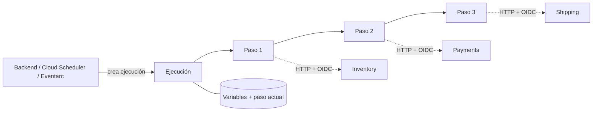
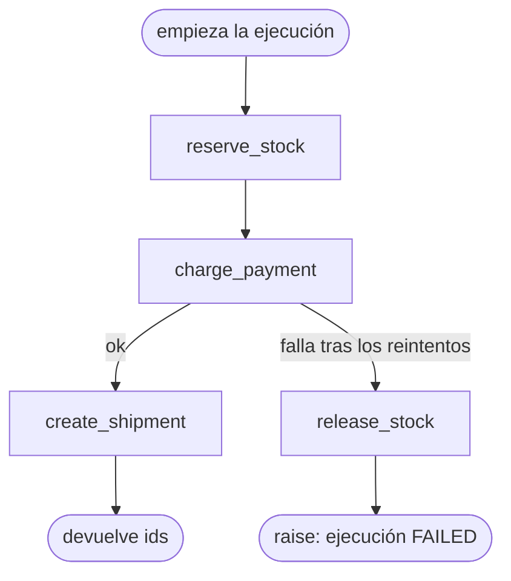

Cuando se confirma un pago, tu backend tiene que reservar stock, cobrar la tarjeta y crear un envío. Son tres servicios y tres llamadas HTTP para un solo resultado de negocio.

La primera versión suele vivir en un handler: llama a Inventory, después a Payments, después a Shipping, y responde. Funciona hasta que el proceso muere entre el cobro y el envío. El cliente ya pagó, no se envía nada y en ningún lugar del sistema consta que el flujo se quedó en el paso dos. La lógica de reintentos está repartida en tres `try/catch`. Nadie escribió el código que libera el stock cuando falla el cobro, porque el único camino que se probó fue el feliz.

La segunda versión reparte el flujo entre colas y eventos, y cada servicio reacciona al anterior. El problema del crash se reduce, pero ahora el flujo no está escrito en ningún sitio. Para responder «¿dónde está el pedido 123?» toca leer logs de cuatro servicios.

Google Cloud Workflows resuelve ese problema concreto. Es un orquestador gestionado y serverless. Describes los pasos en YAML o JSON y Workflows los ejecuta en orden. Guarda el estado entre pasos, reintenta lo que le indiques y ejecuta tu lógica de compensación cuando un paso falla. Una ejecución puede esperar, hacer polling o mantener estado hasta un año. El flujo es una sola definición, y el estado de cada pedido es una ejecución que puedes inspeccionar.

No es un runtime de cómputo ni un bus de mensajes. La lógica de negocio sigue en tus servicios. Workflows decide qué servicio va después, qué pasa cuando uno falla y cuánto hay que esperar.

## De qué está hecho un workflow

- **Workflow**: una definición regional con nombre, escrita en YAML o JSON. Desplegar un cambio crea una nueva revisión.
- **Ejecución**: una corrida de la revisión actual. Tiene un ID, un estado (`ACTIVE`, `SUCCEEDED`, `FAILED`, …), un argumento y un resultado. El historial de ejecuciones se conserva 90 días.
- **`main` y `params`**: el punto de entrada. `main` recibe un argumento de runtime, normalmente un objeto JSON, de hasta 512 KB.
- **Steps**: las unidades de trabajo. `assign` asigna variables, `call` invoca una función, un connector o un subworkflow, `switch` ramifica, `for` itera, `parallel` ejecuta ramas en concurrencia, `next` salta y `return` termina. `raise` y `try/retry/except` gestionan los errores.
- **Variables**: el estado de la ejecución, persistido entre pasos. Están limitadas a 512 KB por ejecución.
- **Llamadas HTTP**: `http.get`, `http.post`, `http.put`, `http.delete` y otras. Con `auth: {type: OIDC}`, la llamada a Cloud Run lleva un identity token de la service account del workflow.
- **Connectors**: llamadas tipadas a APIs de Google Cloud (`googleapis.*`). Construyen la petición, reintentan y esperan a las operaciones de larga duración por ti.
- **Subworkflows**: funciones dentro de la misma definición, con parámetros y valor de retorno.
- **Callbacks**: `events.create_callback_endpoint` crea una URL, y `events.await_callback` pausa la ejecución hasta que alguien la llame, por ejemplo un webhook o una aprobación humana.
- **Service account**: la identidad con la que corre el workflow. Todos los permisos sobre otros servicios son suyos.



El diagrama muestra la propiedad por la que pagas. Si una llamada HTTP tarda 20 segundos o un callback tarda dos días, el servicio conserva el paso actual y sus variables. No necesitas un servidor vivo mientras el flujo espera.

## Orquestar es una decisión, no un default

La guía de buenas prácticas de Google distingue tres formas de comunicar servicios:

- **Llamadas directas.** Son lo más simple y lo que más acopla.
- **Coreografía.** Los servicios reaccionan a eventos. El acoplamiento es bajo, pero no hay un único lugar que describa el flujo, así que monitorear y depurar cuesta más.
- **Orquestación.** Un coordinador central llama a cada servicio. Es menos flexible que los eventos, y a cambio el flujo es explícito, inspeccionable y está en un solo sitio.

El lado de la coreografía está en [Google Cloud Pub/Sub: cómo usarlo bien](/blog/google-cloud-pubsub-how-to-use-it-correctly/). Las dos no se excluyen. Un montaje habitual orquesta con Workflows una secuencia acoplada (reservar, cobrar, enviar). Al terminar, publica un evento `OrderFulfilled` que notificaciones y analytics consumen por su cuenta.

La prueba es sencilla: **¿alguien tiene que ser dueño de la secuencia y de sus caminos de fallo?** Si es así, orquesta. Si cada consumidor reacciona a un hecho a su manera, publica un evento.

## Workflows vs Cloud Tasks vs Pub/Sub vs Cloud Scheduler

Los cuatro pueden lanzar «trabajo para después», y por eso se confunden. Resuelven problemas distintos.

| | Workflows | Cloud Tasks | Pub/Sub | Cloud Scheduler |
| --- | --- | --- | --- | --- |
| Trabajo principal | Ejecutar una secuencia de varios pasos | Entregar una petición a un handler | Distribuir un hecho a muchos consumidores | Disparar algo con un cron |
| Quién conoce el siguiente paso | La definición del workflow | El productor nombra el handler | Nadie; deciden los subscribers | El job nombra un target |
| Estado entre pasos | Sí, por ejecución | No | No | No |
| Control de tasa | Límites de concurrencia en `parallel` | Tasa y concurrencia de la cola | Flow control del subscriber | Una ejecución por tick |
| Fan-out | Ramas `parallel` explícitas | No | Sí, una subscription por consumidor | No |
| Reintentos | Por paso, con tu predicate | Por tarea, política de la cola | Redelivery, retry policy, dead-letter topic | Retry config del job |
| Duración | Hasta 1 año por ejecución | Deadline de HTTP target: 10 min por defecto, 30 máx. | Hasta el ack o la retención | Una petición |

Reglas prácticas:

- **«Llama a este endpoint una vez, quizá más tarde, a una tasa controlada»**: Cloud Tasks. Tiene entrega at-least-once y deduplicación de tareas al crearlas. Es la herramienta para «envía este email en 15 minutos» o «llama a esta API externa a no más de 10 rps».
- **«Esto ocurrió, quien le importe que reaccione»**: Pub/Sub.
- **«Haz esto cada noche a las 02:00»**: Cloud Scheduler. Puede crear una ejecución de workflow directamente, con una service account que tenga `roles/workflows.invoker`.
- **«Haz A, después B con el resultado de A, deshaz A si B falla, espera a que C confirme»**: Workflows.

Se combinan bien. Scheduler arranca un workflow nocturno. Un paso del workflow encola Cloud Tasks para llamadas con límite de tasa, o publica en Pub/Sub al terminar. Para pipelines de datos en forma de DAG (ETL, backfills, cientos de operators), Google recomienda Managed Airflow. Workflows está pensado para orquestar servicios con baja latencia, no para programar pipelines de datos.

## Cuándo usar Workflows, y cuándo no

Úsalo cuando:

- un proceso de negocio cruza varios servicios y debe terminar o compensarse como unidad.
- el flujo necesita esperar: a una operación de larga duración, a un Cloud Run job, a un webhook o a una aprobación humana.
- quieres poder inspeccionar cada ejecución: en qué paso está, qué devolvió cada llamada y por qué falló.
- la mayoría de los pasos son llamadas a APIs y, sin Workflows, escribirías servicios «pegamento» que solo llaman a otros servicios.

Evítalo cuando:

- **el trabajo es cómputo.** La guía de Google lo dice claramente: crea servicios para todo lo que sea demasiado complejo para las expresiones de Workflows, como lógica de negocio reutilizable, transformaciones pesadas o cálculos complejos. YAML es un mal lenguaje de programación.
- **los payloads son grandes.** Las variables tienen un tope de 512 KB por ejecución y las respuestas HTTP de 2 MB. Pasa IDs y rutas de Cloud Storage, no documentos.
- **es procesamiento por evento, de alto volumen y de un solo paso.** Una subscription de Pub/Sub con un consumidor idempotente es más simple y más barata.
- **es una llamada a un endpoint.** Eso es una llamada HTTP, o una Cloud Task si tiene que ocurrir más tarde.
- **quien llama necesita el resultado en la misma petición.** Workflows es asíncrono. Puedes esperar una ejecución, pero mantener una petición HTTP abierta mientras haces polling anula la ventaja.

## Una saga de fulfillment en YAML

El ejemplo es el flujo de la introducción: reservar stock, cobrar y enviar. Si el cobro falla, se libera la reserva. Es el patrón saga que la guía de buenas prácticas de Google recomienda para transacciones entre servicios: cada paso tiene una acción compensatoria en lugar de una transacción distribuida.



```yaml
main:
  params: [args]
  steps:
    - init:
        assign:
          - order_id: ${args.orderId}
          - inventory_url: ${args.urls.inventory}
          - payments_url: ${args.urls.payments}
          - shipping_url: ${args.urls.shipping}
    - reserve_stock:
        try:
          call: http.post
          args:
            url: ${inventory_url + "/reservations"}
            auth:
              type: OIDC
            headers:
              Idempotency-Key: ${"reserve-" + order_id}
            body:
              orderId: ${order_id}
            timeout: 30
          result: reservation
        retry: ${http.default_retry_non_idempotent}
    - charge_payment:
        try:
          call: http.post
          args:
            url: ${payments_url + "/charges"}
            auth:
              type: OIDC
            headers:
              Idempotency-Key: ${"charge-" + order_id}
            body:
              orderId: ${order_id}
              reservationId: ${reservation.body.reservationId}
            timeout: 30
          result: charge
        retry: ${http.default_retry_non_idempotent}
        except:
          as: e
          steps:
            - compensate:
                call: release_stock
                args:
                  base_url: ${inventory_url}
                  reservation_id: ${reservation.body.reservationId}
            - fail:
                raise: ${e}
    - create_shipment:
        try:
          call: http.put
          args:
            url: ${shipping_url + "/shipments/" + order_id}
            auth:
              type: OIDC
            body:
              chargeId: ${charge.body.chargeId}
            timeout: 30
          result: shipment
        retry: ${http.default_retry}
    - done:
        return:
          orderId: ${order_id}
          chargeId: ${charge.body.chargeId}
          shipmentId: ${shipment.body.shipmentId}

release_stock:
  params: [base_url, reservation_id]
  steps:
    - release:
        try:
          call: http.delete
          args:
            url: ${base_url + "/reservations/" + reservation_id}
            auth:
              type: OIDC
        retry: ${http.default_retry}
```

Las decisiones de ese archivo importan más que la sintaxis:

**Las URLs de los servicios llegan por argumento.** La guía de Google recomienda no hardcodear URLs. Así, la misma definición corre contra staging y contra producción. También puedes inyectarlas al desplegar con Terraform o Cloud Build, o leerlas de Secret Manager con su connector.

**Cada POST lleva una clave de idempotencia.** `http.default_retry_non_idempotent` solo reintenta 429, 503 y fallos de conexión. Aun así, una petición que llegó al servidor puede enviarse dos veces. La clave, derivada de `orderId`, permite que Payments devuelva el cobro original en lugar de crear otro. Workflows no hace esto por ti; el lado del servidor está en [idempotencia en APIs](/blog/idempotency-in-apis/).

**El envío usa `PUT` sobre un recurso con el nombre del pedido.** Llamarlo dos veces converge en el mismo envío. Por eso es seguro usar `http.default_retry`, que reintenta más casos.

**La compensación es un subworkflow, y también reintenta.** Una compensación que falla una vez y se rinde deja el stock reservado para siempre. Si la liberación puede fallar de forma permanente, pon una alerta sobre las ejecuciones fallidas y resuélvelo a mano. No finjas que no puede pasar.

**Un fallo de envío después de un cobro correcto no tiene compensación aquí, a propósito.** Reembolsar de forma automática es una decisión de negocio. Puedes añadir un paso `refund`, o esperar un callback para que decida un operador. Tal como está, la ejecución falla con el cobro registrado en su historial, así que sabes exactamente qué pedidos necesitan atención.

**`result` guarda la respuesta completa.** Con bodies JSON pequeños no es un problema. Si un servicio devuelve payloads grandes, asigna solo los campos que necesitas y pon el resto a `null`. El límite de 512 KB se aplica a todas las variables de la ejecución.

## Errores, reintentos, timeouts y variables

### Los reintentos son por paso, y el predicate lo eliges tú

Una retry policy es un predicate (qué errores reintentar) más `max_retries` y un `backoff`. Workflows trae dos por defecto:

| Política | Reintenta | `max_retries` | Backoff |
| --- | --- | --- | --- |
| `${http.default_retry}` | 429, 502, 503, 504, errores de conexión, timeouts | 5 | 1 s inicial, 60 s máx., ×1.25 |
| `${http.default_retry_non_idempotent}` | 429, 503, fallos de conexión | 5 | 1 s inicial, 60 s máx., ×1.25 |

La diferencia es lo importante. Un 502 o un timeout pueden significar que la petición llegó, se procesó y se perdió la respuesta. La política no idempotente se niega a reintentar esos casos porque podrías cobrar dos veces. Elige la política por lo que garantiza el endpoint, no por el nombre del método HTTP.

Si los defaults no encajan, escribe un predicate propio: un subworkflow que recibe el mapa de error y devuelve `true` para reintentar.

```yaml
retry:
  predicate: ${retry_on_lock}
  max_retries: 8
  backoff:
    initial_delay: 1
    max_delay: 60
    multiplier: 2
```

```yaml
retry_on_lock:
  params: [e]
  steps:
    - check:
        switch:
          - condition: ${"HttpError" in e.tags and e.code == 423}
            return: true
    - otherwise:
        return: false
```

Un predicate propio solo se evalúa con errores que se lanzan. Las llamadas HTTP lanzan automáticamente en 4xx y 5xx. Para reintentar un 202 de «todavía procesando», revisa tú la respuesta y haz `raise`. Cada reintento se factura como un paso adicional.

### Los errores son mapas con tags

Un error sin capturar hace fallar la ejecución y devuelve un mapa de error. Revisa sus `tags` en lugar de parsear `message`:

- **`HttpError`**: el status de la respuesta fue ≥ 400. El mapa incluye `code`, `headers` y `body`.
- **`ConnectionFailedError`**: no se llegó a establecer la conexión (DNS, conexión rechazada). Google documenta que aquí los reintentos son idempotentes, porque la petición nunca salió.
- **`ConnectionError`**: la conexión se cortó a mitad de la transferencia. La petición *pudo* haberse entregado, así que los reintentos pueden no ser idempotentes.
- **`TimeoutError`**: la llamada superó su timeout.
- **`ResourceLimitError`**: se agotó un límite, como la memoria. Cuando lo lanza el propio sistema, no se puede capturar y la ejecución falla de inmediato.

La compensación va en `except`. Hacer `raise` con el mapa de error original mantiene la causa real visible en el resultado de la ejecución.

### Toda llamada necesita un timeout

Las llamadas `http.*` tienen por defecto un timeout de **300 segundos**, con un máximo de **1800 segundos**. Cinco minutos es mucho tiempo esperando a una API de pagos que normalmente responde en 300 ms. Define `timeout` en cada llamada según la latencia real de la dependencia. Así los reintentos empiezan antes y la ejecución completa tiene un peor caso acotado.

Las esperas tienen sus propios límites. `events.await_callback` usa por defecto **43.200 segundos** (12 horas) y lanza `TimeoutError` al vencer. La ejecución en sí puede durar hasta **1 año**. Para trabajo de más de 30 minutos, lanza un Cloud Run job o un job de Batch con un connector. Los connectors esperan la operación de larga duración por ti, así que no necesitas una sola llamada HTTP abierta todo ese tiempo.

### Las variables son estado, no almacenamiento

Todo lo que asignas con `assign` o guardas como `result` forma parte del estado persistido de la ejecución. Los límites son fijos: **512 KB** de variables por ejecución, **2 MB** por respuesta HTTP, **256 KB** por string y **100.000 pasos** por ejecución. Pasa identificadores, no documentos. En los pasos `parallel`, una variable tiene que declararse en `shared` para que las ramas puedan escribir en ella.

## Lanzar un workflow desde tu backend

El backend debe iniciar la ejecución, registrarla y responder. No debe mantener abierta la petición HTTP mientras corre el workflow.

```typescript
import { ExecutionsClient } from "@google-cloud/workflows";

const executions = new ExecutionsClient();

export async function startFulfillment(orderId: string) {
  const [execution] = await executions.createExecution({
    parent: executions.workflowPath(PROJECT_ID, "us-central1", "order-fulfillment"),
    execution: {
      argument: JSON.stringify({
        orderId,
        urls: { inventory: INVENTORY_URL, payments: PAYMENTS_URL, shipping: SHIPPING_URL },
      }),
    },
  });

  await orders.update(orderId, { fulfillmentExecution: execution.name });
  return execution.name;
}
```

Lo que importa en producción:

- **Guarda `execution.name`.** Es como respondes más tarde a «¿qué pasó con el pedido 123?». `getExecution` devuelve el estado, el resultado o el error.
- **Cada llamada a `createExecution` inicia una ejecución nueva.** Si tu handler reintenta tras un error de red, puedes acabar con dos fulfillments para un mismo pedido. Protégete en tu lado, por ejemplo con una columna `fulfillmentExecution` y una escritura condicional, y mantén igualmente las claves de idempotencia en los servicios.
- **Responde `202 Accepted`, no el resultado del workflow.** El ejemplo de cliente de Google hace polling de `getExecution` con backoff. Está bien en un script y está mal dentro de un request handler. Conoce el desenlace después: consulta la ejecución, o haz que el último paso del workflow llame a tu backend o publique en Pub/Sub.
- **Da a quien llama `roles/workflows.invoker`**, y nada más amplio. Dale al workflow su propia service account, con solo los permisos que necesitan sus llamadas (por ejemplo `roles/run.invoker` sobre los tres servicios).
- **Entiende el backlogging.** Las ejecuciones concurrentes están limitadas por región. Al llegar al límite, las ejecuciones nuevas se crean por defecto en estado `QUEUED` y arrancan cuando hay capacidad, en orden FIFO best-effort. Si el backlogging está desactivado, o el backlog también está lleno, `createExecution` falla con **429**. Las ejecuciones que crean triggers de Pub/Sub nunca entran en backlog. Si te importa más la latencia que la ejecución eventual, desactiva el backlogging y gestiona el 429 tú mismo.

Para probar a mano, `gcloud workflows run order-fulfillment --data='{"orderId":"ord_123","urls":{...}}'` lanza una ejecución y espera su resultado.

## Cuánto cuesta

Workflows cobra por **pasos ejecutados**, no por tiempo:

| Tipo de paso | Gratis al mes | Después |
| --- | ---: | ---: |
| Interno | 5.000 | $0.01 por 1.000 |
| Externo | 2.000 | $0.025 por 1.000 |

Los bloques parciales de 1.000 se cobran como bloques completos. Son internos las asignaciones, las condiciones, las funciones built-in, las llamadas a subworkflows, el polling de connectors y las llamadas HTTP a `*.googleapis.com`, `*.run.app`, `*.cloudfunctions.net`, `*.appspot.com` y `*.cloud.goog`. Son externas las llamadas a cualquier otro destino, **incluidos tus propios servicios de Google Cloud detrás de un dominio personalizado**. `events.await_callback` también se factura como externo. El tiempo de espera no se cobra: un workflow que espera dos días un callback cuesta lo mismo que uno que espera dos segundos.

Lo que sorprende es cómo se cuentan los pasos. Cada bloque `try`, `retry`, `except` y `raise` cuenta por separado. El propio ejemplo de Google: un paso con un `try` alrededor de un `call` son tres pasos, y añadir `retry` los convierte en seis. Cada intento de reintento también cuenta.

Para hacerse una idea: si el workflow de arriba promedia unos 25 pasos internos por pedido en el camino feliz, 100.000 pedidos al mes son unos 2,5 millones de pasos. Eso son unos $25. Mide tu conteo real en el historial de ejecuciones antes de fiarte de cualquier estimación, incluida esta. Para la mayoría de backends la factura no es el problema. El problema es un bucle de reintentos o de polling que multiplica un conteo de pasos que nunca miraste.

Recomendaciones de costo de Google:

- llama a Cloud Run y a los servicios de Google Cloud por sus dominios por defecto, para que los pasos sigan siendo internos.
- combina asignaciones en un solo paso `assign`.
- usa call logging en lugar de muchos pasos `sys.log`.
- ajusta el backoff de reintentos y las polling policies de los connectors a lo que de verdad necesita la operación. Hacer polling cada pocos segundos a un job que tarda una hora solo suma pasos.

## Siete errores que sigo viendo

**1. Lógica de negocio en YAML.** Reglas de precios, mapeos de datos con bucles anidados, parseo de strings. Es difícil de testear, cuesta pasos y falla en runtime con `TypeError`. Llévala a un servicio y llama a ese servicio.

**2. `http.default_retry` sobre un POST no idempotente.** Un 502 después de procesar el cobro se reintenta y el cliente paga dos veces. Usa la política no idempotente y envía igualmente una clave de idempotencia.

**3. Solo el camino feliz.** Sin `except` ni compensación. El primer cobro fallido deja una reserva que nadie libera. Cada paso que cambia estado en otro servicio necesita una respuesta a «¿qué lo deshace?».

**4. Mantener la petición abierta mientras corre el workflow.** El backend llama a `createExecution` y después hace polling hasta que la ejecución termina, dentro de una petición de la API. Ahora la latencia de tu API es la del workflow, y un timeout del cliente provoca un reintento que lanza una segunda ejecución.

**5. Mover datos grandes por variables.** Un paso lee un export JSON de 1,5 MB en `result`. Cabe en el límite HTTP y revienta contra el límite de memoria de 512 KB tres pasos después. Pasa una ruta de Cloud Storage.

**6. Dominios personalizados para servicios internos.** `api.example.com` delante de Cloud Run queda más limpio y factura cada llamada como externa, a 2,5 veces el precio interno. Desde el workflow, usa la URL `*.run.app`.

**7. Usar el historial de ejecuciones como log de auditoría.** Las ejecuciones se conservan 90 días. Si en marzo necesitas saber qué pasó con un pedido de noviembre, escríbelo en tu propia base de datos. La referencia `fulfillmentExecution` sirve para depurar, no como registro.

## Antes de producción

- Una service account por workflow, solo con los roles que necesitan sus llamadas.
- Un `timeout` explícito en cada llamada HTTP, y una retry policy elegida por endpoint.
- Call logging en solo errores por defecto. Cambia a todas las llamadas mientras depuras: registra cada llamada y su resultado.
- Una alerta sobre ejecuciones fallidas. Una saga fallida significa que un cliente está esperando a alguien.
- Despliegue de las definiciones con Terraform o Cloud Build, un workflow por entorno y sin ediciones desde la consola.
- El workflow desplegado en la misma región que los servicios a los que llama.

## Un orquestador es dueño de la secuencia, no del trabajo

Workflows se gana su sitio cuando un proceso cruza servicios, puede fallar a mitad de camino y alguien tiene que saber dónde se quedó y cómo deshacerlo. Encaja mal para cómputo, para datos grandes y para una sola llamada disfrazada de pipeline.

Antes de añadirlo, escribe los pasos de tu flujo y qué deshace cada uno. Si esa lista cabe en una función, quédate con la función. Si no cabe, necesitas un orquestador. ¿Está escrita hoy en algún sitio la lógica de orquestación de tu sistema?

## Fuentes

- [Workflows overview](https://docs.cloud.google.com/workflows/docs/overview)
- [Best practices for Workflows](https://docs.cloud.google.com/workflows/docs/best-practice)
- [Workflows quotas and limits](https://docs.cloud.google.com/workflows/quotas)
- [Workflows pricing](https://cloud.google.com/workflows/pricing)
- [Retry steps](https://docs.cloud.google.com/workflows/docs/reference/syntax/retrying)
- [Catch errors](https://docs.cloud.google.com/workflows/docs/reference/syntax/catching-errors)
- [Workflow errors](https://docs.cloud.google.com/workflows/docs/reference/syntax/error-types)
- [Function: http.post](https://docs.cloud.google.com/workflows/docs/reference/stdlib/http/post)
- [Make authenticated requests from a workflow](https://docs.cloud.google.com/workflows/docs/authenticate-from-workflow)
- [Parallel steps](https://docs.cloud.google.com/workflows/docs/reference/syntax/parallel-steps)
- [Wait using callbacks](https://docs.cloud.google.com/workflows/docs/creating-callback-endpoints)
- [Pass runtime arguments in an execution request](https://docs.cloud.google.com/workflows/docs/passing-runtime-arguments)
- [Execute a workflow](https://docs.cloud.google.com/workflows/docs/executing-workflow)
- [Use client libraries to execute a workflow](https://docs.cloud.google.com/workflows/docs/samples/workflows-api-quickstart)
- [Schedule a workflow using Cloud Scheduler](https://docs.cloud.google.com/workflows/docs/schedule-workflow)
- [Choose Workflows or Managed Airflow](https://docs.cloud.google.com/workflows/docs/choose-orchestration)
- [Cloud Tasks overview](https://docs.cloud.google.com/tasks/docs/dual-overview)
- [Cloud Scheduler overview](https://docs.cloud.google.com/scheduler/docs/overview)
- [Choosing Pub/Sub or Cloud Tasks](https://docs.cloud.google.com/pubsub/docs/choosing-pubsub-or-cloud-tasks)
