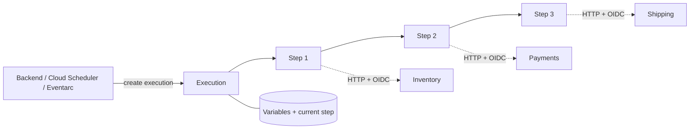
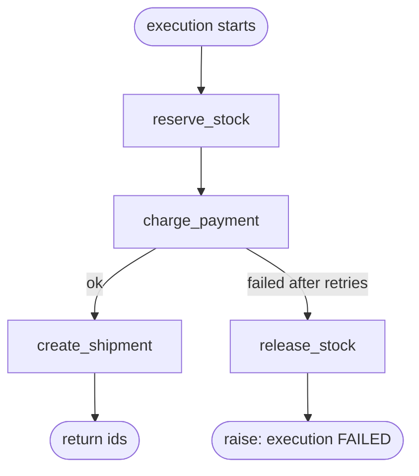

After a payment is confirmed, your backend must reserve stock, charge the card, and create a shipment. Three services, three HTTP calls, one business outcome.

The first version usually lives in a handler. It calls Inventory, then Payments, then Shipping, and returns. It works until the process dies between the charge and the shipment. Now the customer paid, nothing ships, and nothing in your system records that the flow stopped at step two. The retry logic is spread across three `try/catch` blocks. Nobody wrote the code that releases the stock when the charge fails, because the happy path was the only one anyone tested.

The second version spreads the flow across queues and events. Each service reacts to the previous one. The crash problem gets smaller, but now the flow itself is not written down anywhere. To answer "where is order 123?", you read logs from four services.

Google Cloud Workflows solves that specific problem. It is a managed, serverless orchestrator. You describe the steps in YAML or JSON, and Workflows runs them in order. It keeps the state between steps, retries what you tell it to retry, and runs your compensation logic when a step fails. An execution can wait, poll, or hold state for up to a year. The flow is one definition, and the state of each order is one execution you can inspect.

It is not a compute runtime and it is not a message bus. Business logic stays in your services. Workflows decides which service runs next, what happens when one fails, and how long to wait.

## What a workflow is made of

- **Workflow**: a named, regional definition written in YAML or JSON. Deploying a change creates a new revision.
- **Execution**: one run of the current revision. It has an ID, a state (`ACTIVE`, `SUCCEEDED`, `FAILED`, …), an argument, and a result. Execution history is kept for 90 days.
- **`main` and `params`**: the entry point. `main` takes one runtime argument, usually a JSON object, of up to 512 KB.
- **Steps**: the units of work. `assign` sets variables, `call` invokes a function, connector, or subworkflow, `switch` branches, `for` iterates, `parallel` runs branches concurrently, `next` jumps, `return` ends. `raise` and `try/retry/except` handle errors.
- **Variables**: the execution state, persisted between steps. They are limited to 512 KB per execution.
- **HTTP calls**: `http.get`, `http.post`, `http.put`, `http.delete`, and others. With `auth: {type: OIDC}`, the call to Cloud Run carries an identity token for the workflow's service account.
- **Connectors**: typed calls to Google Cloud APIs (`googleapis.*`). They build the request, retry, and wait on long-running operations for you.
- **Subworkflows**: functions inside the same definition, with parameters and a return value.
- **Callbacks**: `events.create_callback_endpoint` creates a URL. `events.await_callback` pauses the execution until something calls it, for example a webhook or a human approval.
- **Service account**: the identity the workflow runs as. Every downstream permission belongs to it.



The diagram shows the property you are paying for. If an HTTP call takes 20 seconds, or a callback takes two days, the current step and its variables are kept by the service. You do not need a server to stay alive while the flow waits.

## Orchestration is a choice, not a default

Google's best-practice guide names three ways for services to communicate:

- **Direct calls.** They are the simplest, and they create the tightest coupling.
- **Choreography.** Services react to events. Coupling is loose, but there is no single place that describes the flow, so monitoring and debugging get harder.
- **Orchestration.** A central coordinator calls each service. It is less flexible than events, and the flow is explicit, inspectable, and in one place.

The choreography side is covered in [Google Cloud Pub/Sub: how to use it correctly](/blog/google-cloud-pubsub-how-to-use-it-correctly/). The two are not exclusive. A common setup orchestrates a tight sequence (reserve, charge, ship) with Workflows. When the sequence finishes, it publishes an `OrderFulfilled` event that notifications and analytics consume independently.

The test is simple: **does someone need to own the sequence and its failure paths?** If yes, orchestrate. If each consumer reacts to a fact on its own terms, publish an event.

## Workflows vs Cloud Tasks vs Pub/Sub vs Cloud Scheduler

All four can trigger "work later," which is why they get confused. They solve different problems.

| | Workflows | Cloud Tasks | Pub/Sub | Cloud Scheduler |
| --- | --- | --- | --- | --- |
| Primary job | Run a multi-step sequence | Deliver one request to one handler | Distribute a fact to many consumers | Trigger something on a cron schedule |
| Who knows the next step | The workflow definition | The producer names the handler | Nobody; subscribers decide | The job names one target |
| State across steps | Yes, per execution | No | No | No |
| Rate control | Concurrency limits on `parallel` | Queue rate and concurrency | Subscriber flow control | One run per schedule tick |
| Fan-out | Explicit `parallel` branches | No | Yes, one subscription each | No |
| Retries | Per step, with your predicate | Per task, queue policy | Redelivery, retry policy, dead-letter topic | Per job retry config |
| Duration | Up to 1 year per execution | HTTP target deadline: 10 min default, 30 max | Until ack or retention | Single request |

Rules of thumb:

- **"Call this endpoint once, maybe later, at a controlled rate"**: Cloud Tasks. It has at-least-once delivery and task deduplication on creation. It is the right tool for "send this email in 15 minutes" or "call this third-party API at no more than 10 rps."
- **"This happened, whoever cares should react"**: Pub/Sub.
- **"Do this every night at 02:00"**: Cloud Scheduler. It can create a workflow execution directly, using a service account with `roles/workflows.invoker`.
- **"Do A, then B with A's result, undo A if B fails, wait for C to confirm"**: Workflows.

They combine well. Scheduler starts a nightly workflow. A workflow step enqueues Cloud Tasks for rate-limited calls, or publishes to Pub/Sub when it finishes. For data pipelines built as DAGs (ETL, backfills, hundreds of operators), Google points to Managed Airflow instead. Workflows is designed for low-latency service orchestration, not for scheduling data pipelines.

## When to use Workflows, and when not

Use it when:

- a business process spans several services and must finish or compensate as a unit.
- the flow needs to wait: for a long-running operation, a Cloud Run job, a webhook, or a human approval.
- you want each run to be inspectable: which step it is on, what each call returned, why it failed.
- most steps are API calls, and you would otherwise write glue services that only call other services.

Skip it when:

- **the work is computation.** Google's guidance is explicit: create services for anything too complex for Workflows expressions, such as reusable business logic, heavy transformations, or complex calculations. YAML is a bad programming language.
- **the payloads are large.** Variables are capped at 512 KB per execution and HTTP responses at 2 MB. Pass IDs and Cloud Storage paths, not documents.
- **it is per-event processing at high volume with one step.** A Pub/Sub subscription with an idempotent consumer is simpler and cheaper.
- **it is one call to one endpoint.** That is an HTTP call, or a Cloud Task if it must happen later.
- **the caller needs the result in the same request.** Workflows runs asynchronously. You can wait on an execution, but holding an HTTP request open while you poll defeats the purpose.

## A fulfillment saga in YAML

The example is the flow from the introduction: reserve stock, charge, ship. If the charge fails, the reservation is released. This is the saga pattern that Google's best-practice guide recommends for transactions that span services. Each step has a compensating action instead of a distributed transaction.



```yaml
main:
  params: [args]
  steps:
    - init:
        assign:
          - order_id: ${args.orderId}
          - inventory_url: ${args.urls.inventory}
          - payments_url: ${args.urls.payments}
          - shipping_url: ${args.urls.shipping}
    - reserve_stock:
        try:
          call: http.post
          args:
            url: ${inventory_url + "/reservations"}
            auth:
              type: OIDC
            headers:
              Idempotency-Key: ${"reserve-" + order_id}
            body:
              orderId: ${order_id}
            timeout: 30
          result: reservation
        retry: ${http.default_retry_non_idempotent}
    - charge_payment:
        try:
          call: http.post
          args:
            url: ${payments_url + "/charges"}
            auth:
              type: OIDC
            headers:
              Idempotency-Key: ${"charge-" + order_id}
            body:
              orderId: ${order_id}
              reservationId: ${reservation.body.reservationId}
            timeout: 30
          result: charge
        retry: ${http.default_retry_non_idempotent}
        except:
          as: e
          steps:
            - compensate:
                call: release_stock
                args:
                  base_url: ${inventory_url}
                  reservation_id: ${reservation.body.reservationId}
            - fail:
                raise: ${e}
    - create_shipment:
        try:
          call: http.put
          args:
            url: ${shipping_url + "/shipments/" + order_id}
            auth:
              type: OIDC
            body:
              chargeId: ${charge.body.chargeId}
            timeout: 30
          result: shipment
        retry: ${http.default_retry}
    - done:
        return:
          orderId: ${order_id}
          chargeId: ${charge.body.chargeId}
          shipmentId: ${shipment.body.shipmentId}

release_stock:
  params: [base_url, reservation_id]
  steps:
    - release:
        try:
          call: http.delete
          args:
            url: ${base_url + "/reservations/" + reservation_id}
            auth:
              type: OIDC
        retry: ${http.default_retry}
```

Decisions in that file that matter more than the syntax:

**Service URLs come from the arguments.** Google's guidance is to avoid hardcoded URLs. The same definition can then run against staging and production. You can also inject URLs at deploy time with Terraform or Cloud Build, or read them from Secret Manager through its connector.

**Every POST carries an idempotency key.** `http.default_retry_non_idempotent` only retries 429, 503, and connection failures. Even then, a request that reached the server can be sent twice. The key, derived from `orderId`, lets Payments return the original charge instead of creating a second one. Workflows does not do this for you. [API idempotency](/blog/idempotency-in-apis/) covers the server side.

**Shipment creation uses `PUT` on a resource named by the order.** Calling it twice converges on the same shipment. That makes it safe to use the broader `http.default_retry`.

**The compensation is a subworkflow, and it retries too.** A compensation that fails once and gives up leaves the stock reserved forever. If release can fail permanently, alert on failed executions and fix it by hand. Do not pretend it cannot happen.

**A shipment failure after a successful charge has no compensation here, on purpose.** Refunding automatically is a business decision. You could add a `refund` step, or wait on a callback for an operator to decide. Today, the execution fails with the charge recorded in its history, so you know exactly which orders need attention.

**`result` keeps the whole response.** That is fine for small JSON bodies. If a service returns large payloads, assign only the fields you need and set the rest to `null`. The 512 KB limit applies to all variables in the execution.

## Errors, retries, timeouts, and variables

### Retries are per step, and you choose the predicate

A retry policy is a predicate (which errors to retry) plus `max_retries` and a `backoff`. Workflows ships two defaults:

| Policy | Retries | `max_retries` | Backoff |
| --- | --- | --- | --- |
| `${http.default_retry}` | 429, 502, 503, 504, connection errors, timeouts | 5 | 1 s initial, 60 s max, ×1.25 |
| `${http.default_retry_non_idempotent}` | 429, 503, connection failures | 5 | 1 s initial, 60 s max, ×1.25 |

The difference is the point. A 502 or a timeout can mean the request reached the server and was processed, but the response was lost. The non-idempotent policy refuses to retry those cases, because a retry could charge twice. Choose the policy by what the endpoint guarantees, not by the HTTP method name.

If the defaults are wrong, write a custom predicate. It is a subworkflow that receives the error map and returns `true` to retry:

```yaml
retry:
  predicate: ${retry_on_lock}
  max_retries: 8
  backoff:
    initial_delay: 1
    max_delay: 60
    multiplier: 2
```

```yaml
retry_on_lock:
  params: [e]
  steps:
    - check:
        switch:
          - condition: ${"HttpError" in e.tags and e.code == 423}
            return: true
    - otherwise:
        return: false
```

A custom predicate is only evaluated for errors that are raised. HTTP calls raise automatically for 4xx and 5xx. To retry on a 202 "still processing," check the response yourself and `raise` it. Every retry is billed as an additional step.

### Errors are maps with tags

An uncaught error fails the execution and returns an error map. Check its `tags` instead of parsing `message`:

- **`HttpError`**: the response status was ≥ 400. The map includes `code`, `headers`, and `body`.
- **`ConnectionFailedError`**: no connection was established (DNS, refused connection). Google documents retries as idempotent here, because the request never left.
- **`ConnectionError`**: the connection broke mid-transfer. The request *might* have been delivered, so retries might not be idempotent.
- **`TimeoutError`**: the call exceeded its timeout.
- **`ResourceLimitError`**: a limit, such as memory, was exhausted. When it is raised internally, it cannot be caught and the execution fails immediately.

`except` is where compensation goes. `raise` with the original error map keeps the real cause visible in the execution's result.

### Timeouts belong on every call

`http.*` calls default to a **300-second** timeout, with a maximum of **1800 seconds**. Five minutes is a long time to wait for a payment API that normally answers in 300 ms. Set `timeout` per call to something tied to the dependency's real latency. Retries then start sooner and the whole execution has a bounded worst case.

Waits have their own limits. `events.await_callback` defaults to **43,200 seconds** (12 hours) and raises `TimeoutError` when it expires. The execution itself can run for up to **1 year**. For work longer than 30 minutes, start a Cloud Run job or Batch job through a connector. Connectors wait on the long-running operation for you, so you don't need a single HTTP call that stays open.

### Variables are state, not storage

Everything you `assign` or store as a `result` is part of the execution's persisted state. The limits are fixed: **512 KB** of variables per execution, **2 MB** per HTTP response, **256 KB** per string, **100,000 steps** per execution. Pass identifiers, not documents. In `parallel` steps, a variable must be declared in `shared` before branches can write to it.

## Starting a workflow from your backend

The backend should start the execution, record it, and return. It should not hold the HTTP request open while the workflow runs.

```typescript
import { ExecutionsClient } from "@google-cloud/workflows";

const executions = new ExecutionsClient();

export async function startFulfillment(orderId: string) {
  const [execution] = await executions.createExecution({
    parent: executions.workflowPath(PROJECT_ID, "us-central1", "order-fulfillment"),
    execution: {
      argument: JSON.stringify({
        orderId,
        urls: { inventory: INVENTORY_URL, payments: PAYMENTS_URL, shipping: SHIPPING_URL },
      }),
    },
  });

  await orders.update(orderId, { fulfillmentExecution: execution.name });
  return execution.name;
}
```

What matters in production:

- **Store `execution.name`.** It is how you answer "what happened to order 123?" later. `getExecution` returns the state, the result, or the error.
- **Every `createExecution` call starts a new execution.** If your handler retries after a network error, you may now have two fulfillments for one order. Guard it on your side, for example with a `fulfillmentExecution` column and a conditional write, and keep the downstream idempotency keys anyway.
- **Return `202 Accepted`, not the workflow result.** Google's client sample polls `getExecution` with backoff. That is fine in a script and wrong in a request handler. Learn the outcome later: query the execution, or have the workflow's last step call your backend or publish to Pub/Sub.
- **Grant the caller `roles/workflows.invoker`** and nothing broader. Give the workflow its own service account, with only the permissions its calls need (for example `roles/run.invoker` on the three services).
- **Understand backlogging.** Concurrent executions are limited per region. When the limit is reached, new executions are created as `QUEUED` by default and start when capacity frees up, on a best-effort FIFO basis. If backlogging is disabled, or the backlog is also full, `createExecution` fails with **429**. Executions created from Pub/Sub triggers are never backlogged. If latency matters more than eventual execution, disable backlogging and handle 429 yourself.

For manual testing, `gcloud workflows run order-fulfillment --data='{"orderId":"ord_123","urls":{...}}'` runs an execution and waits for its result.

## What it costs

Workflows bills **steps executed**, not time:

| Step type | Free per month | Then |
| --- | ---: | ---: |
| Internal | 5,000 | $0.01 per 1,000 |
| External | 2,000 | $0.025 per 1,000 |

Partial blocks of 1,000 are billed as full blocks. Internal steps include assignments, conditions, built-in function calls, subworkflow calls, connector polling, and HTTP calls to `*.googleapis.com`, `*.run.app`, `*.cloudfunctions.net`, `*.appspot.com`, and `*.cloud.goog`. External steps are calls to anything else, **including your own Google Cloud services behind a custom domain**. `events.await_callback` is also billed as external. Idle time is not billed. A workflow that waits two days for a callback costs the same as one that waits two seconds.

What surprises people is how steps are counted. Each `try`, `retry`, `except`, and `raise` block counts separately. Google's own example: a step with a `try` around a `call` is three steps, and adding `retry` makes it six. Every retry attempt counts too.

For scale: if the fulfillment workflow above averages about 25 internal steps per order on the happy path, 100,000 orders a month is about 2.5 million steps. That is roughly $25. Measure your real count from execution history before trusting any estimate, including this one. For most backends, the bill is not the issue. The issue is a tight retry loop or a polling loop multiplying a step count you never looked at.

Google's cost guidance:

- call Cloud Run and Google Cloud services on their default domains so the steps stay internal.
- combine assignments into one `assign` step.
- prefer call logging over many `sys.log` steps.
- tune retry backoff and connector polling policies to what the operation actually needs. Polling every few seconds for a job that takes an hour is pure step count.

## Seven mistakes I keep seeing

**1. Business logic in YAML.** Pricing rules, data mapping with nested loops, string parsing. It is hard to test, it costs steps, and it fails at runtime with `TypeError`. Put it in a service and call that service.

**2. `http.default_retry` on a non-idempotent POST.** A 502 after the charge was processed gets retried, and the customer pays twice. Use the non-idempotent policy, and send an idempotency key anyway.

**3. Happy path only.** No `except`, no compensation. The first failed charge leaves a reservation that nobody releases. Every step that changes state in another service needs an answer to "what undoes this?"

**4. Holding the request open while the workflow runs.** The backend calls `createExecution`, then polls until the execution finishes, inside an API request. Now your API latency is the workflow's latency, and a client timeout triggers a retry that starts a second execution.

**5. Moving large data through variables.** A step reads a 1.5 MB JSON export into `result`. It fits in the HTTP limit and fails against the 512 KB memory limit three steps later. Pass a Cloud Storage path instead.

**6. Custom domains for internal services.** `api.example.com` in front of Cloud Run looks cleaner and bills every call as external, at 2.5× the internal price. Use the `*.run.app` URL from the workflow.

**7. Using execution history as an audit log.** Executions are retained for 90 days. If you need to know in March what happened to an order from last November, write it to your own database. The `fulfillmentExecution` reference is for debugging, not for records.

## Before production

- One service account per workflow, with only the roles its calls need.
- An explicit `timeout` on every HTTP call, and a retry policy chosen per endpoint.
- Call logging set to errors only by default. Switch to all calls while debugging, which logs every call and its result.
- An alert on failed executions. A failed saga means a customer is waiting on someone.
- Deploy definitions through Terraform or Cloud Build, one workflow per environment, with no console edits.
- Deploy the workflow in the same region as the services it calls.

## An orchestrator owns the sequence, not the work

Workflows earns its place when a process crosses services, can fail halfway, and someone has to know where it stopped and how to undo it. It is a poor fit for computation, for large data, and for a single call dressed up as a pipeline.

Before you add it, write down your flow's steps and what undoes each one. If that list fits in one function, keep the function. If it does not, you need an orchestrator. Is the orchestration logic in your system written down anywhere today?

## Sources

- [Workflows overview](https://docs.cloud.google.com/workflows/docs/overview)
- [Best practices for Workflows](https://docs.cloud.google.com/workflows/docs/best-practice)
- [Workflows quotas and limits](https://docs.cloud.google.com/workflows/quotas)
- [Workflows pricing](https://cloud.google.com/workflows/pricing)
- [Retry steps](https://docs.cloud.google.com/workflows/docs/reference/syntax/retrying)
- [Catch errors](https://docs.cloud.google.com/workflows/docs/reference/syntax/catching-errors)
- [Workflow errors](https://docs.cloud.google.com/workflows/docs/reference/syntax/error-types)
- [Function: http.post](https://docs.cloud.google.com/workflows/docs/reference/stdlib/http/post)
- [Make authenticated requests from a workflow](https://docs.cloud.google.com/workflows/docs/authenticate-from-workflow)
- [Parallel steps](https://docs.cloud.google.com/workflows/docs/reference/syntax/parallel-steps)
- [Wait using callbacks](https://docs.cloud.google.com/workflows/docs/creating-callback-endpoints)
- [Pass runtime arguments in an execution request](https://docs.cloud.google.com/workflows/docs/passing-runtime-arguments)
- [Execute a workflow](https://docs.cloud.google.com/workflows/docs/executing-workflow)
- [Use client libraries to execute a workflow](https://docs.cloud.google.com/workflows/docs/samples/workflows-api-quickstart)
- [Schedule a workflow using Cloud Scheduler](https://docs.cloud.google.com/workflows/docs/schedule-workflow)
- [Choose Workflows or Managed Airflow](https://docs.cloud.google.com/workflows/docs/choose-orchestration)
- [Cloud Tasks overview](https://docs.cloud.google.com/tasks/docs/dual-overview)
- [Cloud Scheduler overview](https://docs.cloud.google.com/scheduler/docs/overview)
- [Choosing Pub/Sub or Cloud Tasks](https://docs.cloud.google.com/pubsub/docs/choosing-pubsub-or-cloud-tasks)
