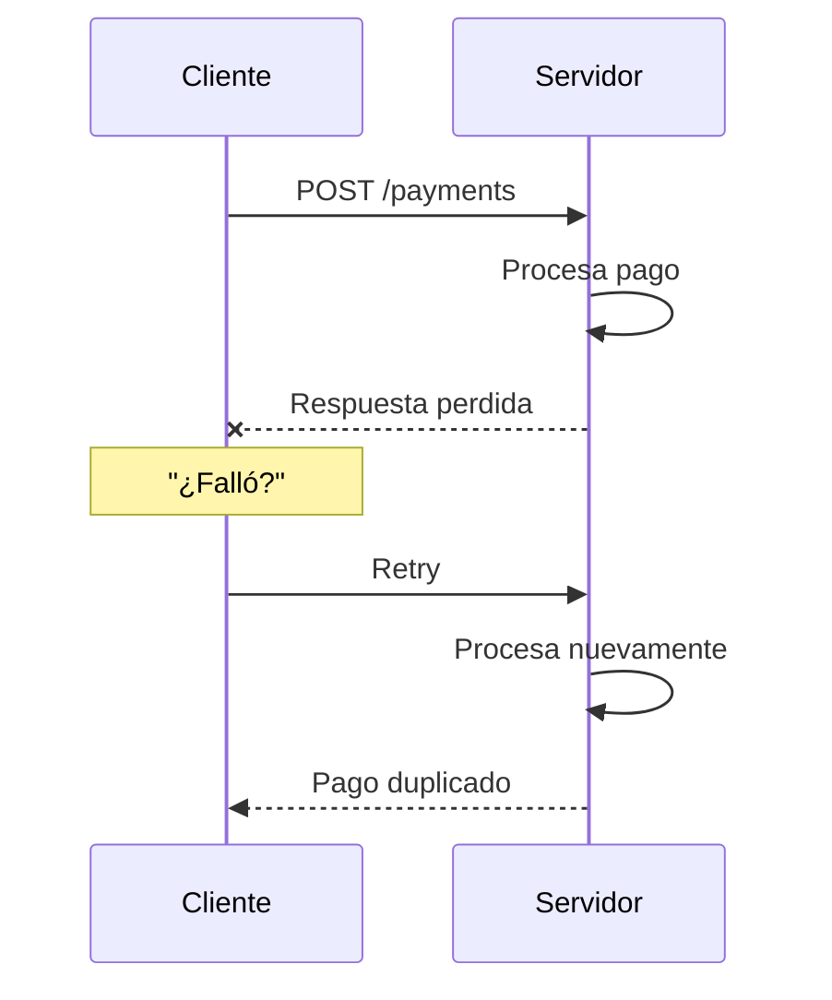
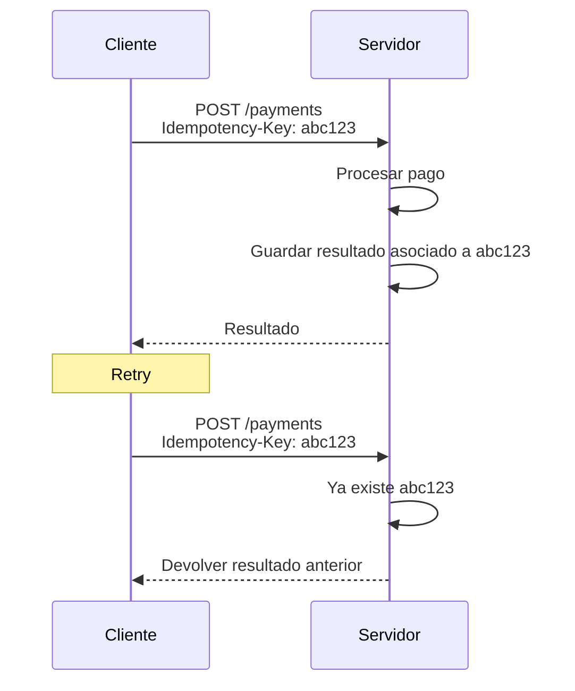
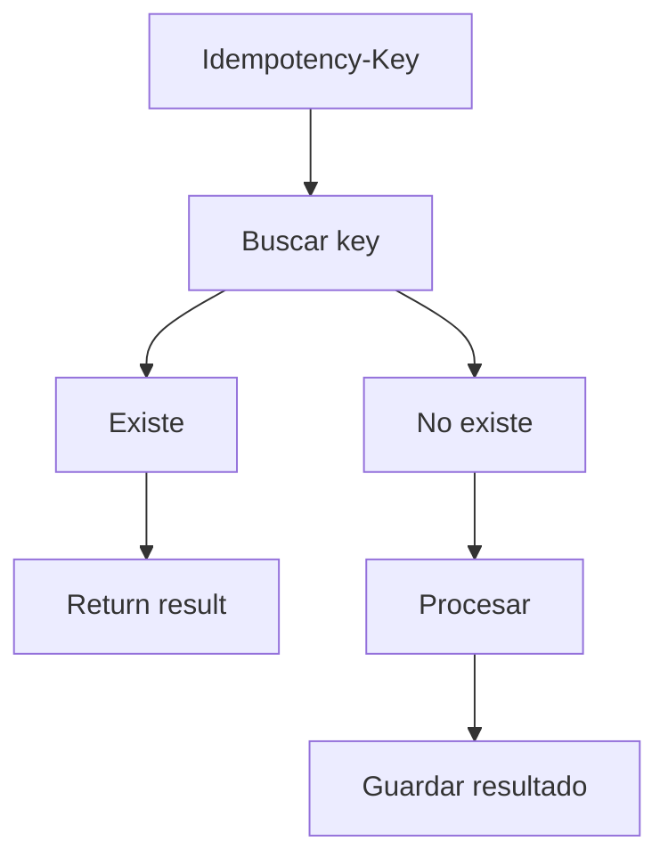
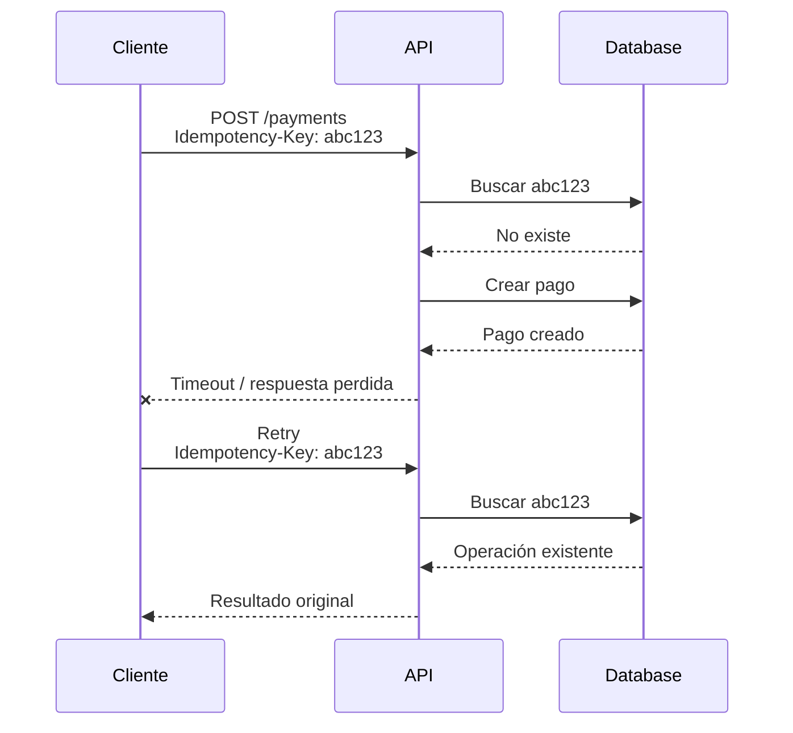
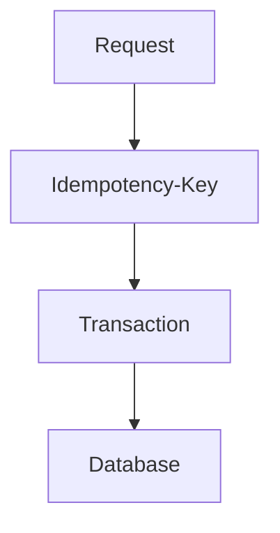

El cliente envía `POST /payments`. El servidor cobra la tarjeta. Antes de que la respuesta cruce la red, hay un timeout o se corta la conexión.

El cliente no sabe cuál de estas tres cosas ocurrió:

- el servidor nunca recibió la petición.
- el servidor la recibió y no la procesó.
- el servidor la procesó y la respuesta se perdió.

El cliente reintenta. Eso parece razonable. Si el servidor ya cobró, el retry cobra otra vez.



Eso no es un bug de HTTP. Es el estado normal de dos máquinas hablando por una red que puede fallar a mitad de camino. [Stripe](https://stripe.com/blog/idempotency) lo resume así: fallar al conectar, fallar a mitad de la operación, o completar el trabajo y perder la respuesta dejan al cliente en la misma incertidumbre. AWS, en el [Well-Architected Framework](https://docs.aws.amazon.com/wellarchitected/latest/framework/rel_prevent_interaction_failure_idempotent.html), lo dice de otro modo: en un sistema distribuido es relativamente fácil hacer algo _como máximo una vez_ o _al menos una vez_; lo difícil es que varios intentos idénticos no produzcan un segundo efecto.

> El timeout no te dice si la operación ocurrió. Te dice que no tienes la respuesta. La pregunta útil es: ¿cómo diseñas la API para que reintentar sea seguro?

## Qué significa que una operación sea idempotente

Ejecutar una misma operación una o varias veces produce el mismo efecto final que ejecutarla una sola vez.

A veces se escribe así:

```text
f(f(x)) = f(x)
```

Esa expresión es una intuición, no una especificación de APIs. En HTTP la definición está en [RFC 9110 §9.2.2](https://www.rfc-editor.org/rfc/rfc9110.html#name-idempotent-methods): un método es idempotente si el efecto _solicitado_ sobre el servidor de varias peticiones idénticas es el mismo que el de una sola.

Tres propiedades se confunden en reviews:

| Propiedad      | Qué pide el cliente                                                                | Ejemplo HTTP                           |
| -------------- | ---------------------------------------------------------------------------------- | -------------------------------------- |
| Safe           | No pide un cambio de estado. La semántica es esencialmente de solo lectura.        | `GET`, `HEAD`, `OPTIONS`, `TRACE`      |
| Idempotent     | Varias peticiones idénticas deben dejar el mismo efecto solicitado que una.        | Safe + `PUT` + `DELETE`                |
| Non-idempotent | El método no promete ese efecto. Cada request puede crear o aplicar trabajo nuevo. | `POST` por definición; `PATCH` también |

[RFC 9110 §9.2.1](https://www.rfc-editor.org/rfc/rfc9110.html#name-safe-methods) es explícito: _safe_ no prohíbe que el servidor escriba un log, cobre un anuncio o tenga otros efectos que el cliente no pidió. [§9.2.2](https://www.rfc-editor.org/rfc/rfc9110.html#name-idempotent-methods) aplica la misma idea a la idempotencia: el servidor puede registrar cada request, guardar historial o producir side effects no solicitados. Lo que importa es el efecto que el cliente pidió.

Idempotencia no significa «no pasa nada la segunda vez». Significa que el estado solicitado no cambia por repetir la petición. Un `DELETE /orders/42` que ya no encuentra el recurso sigue siendo idempotente: el pedido sigue eliminado. Un log más en el servidor no rompe esa promesa.

Tampoco significa «se ejecuta solo una vez». Una operación idempotente puede ejecutarse muchas veces. Lo que no debe ocurrir es un segundo efecto de negocio.

## Idempotencia en HTTP

RFC 9110 declara idempotentes a `PUT`, `DELETE` y a los métodos safe: `GET`, `HEAD`, `OPTIONS` y `TRACE`. Por eso un cliente **NO DEBERÍA** reintentar automáticamente un método no idempotente, salvo que tenga otra forma de saber que la semántica sí lo es, o de detectar que la petición original nunca se aplicó.

| Método   | Idempotente por definición | Qué promete la semántica                                                                         |
| -------- | -------------------------: | ------------------------------------------------------------------------------------------------ |
| `GET`    |                         Sí | Leer un recurso no debería cambiar el estado solicitado.                                         |
| `PUT`    |                         Sí | Reemplazar un recurso con la misma representación deja el mismo estado.                          |
| `DELETE` |                         Sí | Eliminar un recurso varias veces deja el recurso eliminado.                                      |
| `POST`   |                         No | El destino trata la representación según su propia semántica; puede crear trabajo nuevo.         |
| `PATCH`  |                         No | [RFC 5789](https://datatracker.ietf.org/doc/html/rfc5789) lo define como ni safe ni idempotente. |

Eso es la propiedad del _método_, no un certificado de tu implementación.

Un `PUT /users/123` que incrementa `loginCount` en cada request no es idempotente, aunque el verbo lo sea. Un `POST /payments` que acepta una `Idempotency-Key` y devuelve el cobro original en el retry _sí_ puede comportarse de forma idempotente. RFC 9110 lo contempla: un cliente puede reintentar un método no idempotente si tiene medios para saber que la semántica real sí lo es. [RFC 5789](https://datatracker.ietf.org/doc/html/rfc5789) dice lo mismo de `PATCH`: el método no es idempotente por definición, pero una petición concreta puede emitirse de forma que sí lo sea.

`GET` y `DELETE` no necesitan una key para ser reintentables según HTTP. [Stripe](https://docs.stripe.com/api/idempotent_requests) lo documenta así: no envíes `Idempotency-Key` en `GET` o `DELETE`; no tiene efecto. El problema aparece en operaciones que _crean_ trabajo.

## Qué problema resuelve de verdad

El objetivo no es «ejecutar una sola vez». Es hacer que un retry no cree un segundo pago, un segundo pedido o un segundo recurso.

Sin un identificador de intento:

```text
POST /payments  ->  crea un pago
POST /payments  ->  crea otro pago
```

Con uno:



El cliente sigue sin saber, tras el timeout, si el primer intento llegó. No necesita saberlo. Reenvía la misma key y el servidor decide si hay trabajo nuevo o una respuesta ya conocida.

Eso es especialmente importante en sistemas distribuidos porque el fallo es _parcial_. AWS describe el caso en [EC2](https://docs.aws.amazon.com/ec2/latest/devguide/ec2-api-idempotency.html): la API puede devolver un resultado antes de que el workflow asíncrono termine, o hacer timeout cuando la petición ya produjo trabajo. Sin un token, varios retries exitosos crean más recursos de los que pediste. Stripe añade que dos ordenadores pasando mensajes por una red ya son un sistema distribuido: tu API y un solo cliente bastan.

Dos usuarios peleando por la misma butaca es otro problema. Eso es una [race condition sobre un recurso exclusivo](/blog/race-conditions-when-two-requests-buy-the-same-thing/). Aquí el actor es el mismo cliente, o el load balancer, reintentando la misma intención. El locking responde quién puede cambiar el recurso ahora. La idempotencia responde si esta petición es el mismo intento que ya aceptaste.

## Cuándo usarla, y cuándo no

Tiene más valor cuando se cumplen cuatro condiciones a la vez:

1. la operación modifica estado.
2. puede producir un side effect que importa (un cobro, un envío, un alta).
3. alguien puede reintentar: el cliente, un proxy, un worker, un usuario que toca otra vez.
4. ejecutarla dos veces es un problema.

Eso cubre pagos, creación de órdenes, transfers, altas de recursos, jobs que un broker puede reentregar, y llamadas entre microservicios con timeout. En mensajería, la misma idea aparece como consumidor que recuerda un `eventId`: [Pub/Sub entrega at-least-once](/blog/google-cloud-pubsub-how-to-use-it-correctly/), no exactamente una vez.

No hace falta una `Idempotency-Key` en todos los endpoints. AWS lista como anti-patrón aplicarla de forma indiscriminada. Un `GET` ya es idempotente por semántica. Un `PUT /users/123` que reemplaza el perfil con la misma representación no necesita un token extra para que el retry deje el mismo documento.

```http
PUT /users/123
Content-Type: application/json

{
  "name": "Ada",
  "email": "ada@example.com"
}
```

Repetir ese `PUT` debería dejar a Ada con el mismo nombre y el mismo email. En cambio:

```http
POST /payments
Content-Type: application/json

{
  "amount": 100,
  "currency": "USD"
}
```

no promete nada sobre el segundo envío. Ahí el mecanismo explícito sí gana su sitio.

## Idempotency Keys

El patrón es simple: el cliente genera un identificador para _esta_ operación lógica y lo reutiliza en cada retry. El servidor lo usa para reconocer el mismo intento.

```http
POST /payments
Idempotency-Key: 7f8e9a2b-4c1d-4e0f-9a3b-12ab34cd56ef
Content-Type: application/json

{
  "amount": 100,
  "currency": "USD"
}
```



`Idempotency-Key` no es un header de RFC 9110. Es el contrato que [documenta Stripe](https://docs.stripe.com/api/idempotent_requests) y el nombre de un [Internet-Draft de IETF HTTPAPI](https://datatracker.ietf.org/doc/html/draft-ietf-httpapi-idempotency-key-header). Amazon EC2 hace lo mismo con un parámetro `ClientToken`: si reintentas con el mismo token y los mismos parámetros, la acción no se relanza; si los parámetros cambian, responde `IdempotentParameterMismatch`.

Stripe sugiere UUID v4 u otra cadena con suficiente entropía, hasta 255 caracteres, y evita usar email u otros identificadores personales como key. Guarda el status y el body de la primera ejecución —también un `500`— y los reproduce. Compara los parámetros entrantes con los originales y falla si no coinciden. Retiene las keys al menos 24 horas. No guarda resultado si la petición ni siquiera entra a ejecutar el endpoint: validación fallida o conflicto con otra request concurrente se pueden reintentar.

AWS recomienda tokens únicos por operación, estados como `pending`, `completed` o `failed`, y un store persistente con control de concurrencia. También recomienda no usar timestamps como key: el skew de reloj y dos clientes con el mismo instante producen colisiones.



El diagrama no dice que la red entregó el mensaje una sola vez. Dice que el segundo intento reconoció la misma operación y no cobró otra vez.

## Un ejemplo deliberadamente incompleto

Un `POST /orders` con la misma forma:

```http
POST /orders
Idempotency-Key: abc-123
Content-Type: application/json

{
  "sku": "F12",
  "qty": 1
}
```

```ts
const existing = await idempotencyStore.get(key);

if (existing) {
  return existing.response;
}

const order = await createOrder(data);

await idempotencyStore.set(key, {
  response: order,
});

return order;
```

Ese código enseña el contrato. No es una implementación de producción.

Dos requests con `abc-123` pueden pasar el `get` al mismo tiempo, crear dos pedidos y pelear por quién escribe la key. Si el proceso muere después de `createOrder` y antes de `set`, el retry no encuentra nada y crea otro pedido. Si guardas solo la key y no la respuesta, el retry sabe que «ya pasó algo» y no puede devolver el mismo body. Si no tienes un estado `processing`, el segundo request no sabe si debe esperar o arrancar.

Una implementación real necesita persistencia, una inserción atómica de la key (unique constraint o lock), estados `processing` / `completed` / `failed`, una política de expiración, y una decisión sobre qué ocurre si el servidor aplica el side effect y no llega a persistir el resultado. AWS lo formula como registrar el token y ejecutar las mutaciones asociadas con el mismo control de concurrencia. Persistir la key en la misma transacción que el pedido es la forma habitual de no dejar un hueco entre ambos writes. El detalle de cómo serializar dos writers sobre el mismo recurso está en [race conditions](/blog/race-conditions-when-two-requests-buy-the-same-thing/); aquí el invariante extra es: dos HTTP requests con la misma key son un solo intento.

## Buenas prácticas

**Una key por operación lógica.** El retry reutiliza la misma. Una key nueva es una operación nueva.

```text
Primera petición -> key=A
Retry            -> key=A
Retry            -> key=A
```

No:

```text
Primera petición -> key=A
Retry            -> key=B
```

**No reutilizar una key para otra intención.** Stripe poda keys y si reaparece una ya expirada, la trata como request nueva. AWS recomienda TTL. El periodo depende del dominio: el tiempo durante el cual un retry tardío sigue siendo el mismo intento, no «guardarlas para siempre».

**Validar consistencia del payload.** La misma key con otro body no es el mismo intento.

```text
key = abc123

request 1: amount = 100
request 2: amount = 500
```

Stripe compara parámetros y errores. EC2 responde `IdempotentParameterMismatch`. Tratarlo como un segundo cobro, o como el primero, es peor que fallar en voz alta.

**Persistir el resultado, no solo la key.** El retry tiene que poder devolver el mismo status y un body útil. En operaciones asíncronas, EC2 aclara que el resultado puede traer información actualizada —por ejemplo el estado actual de creación— sin relanzar la acción.

**Resolver concurrencia.** Este patrón es inseguro:

```ts
if (!exists(key)) {
  create();
  save(key);
}
```

Dos requests simultáneos pasan el `if`. La key tiene que reclamarse de forma atómica _antes_ o _junto con_ el side effect, no después.

**No usar timestamps como key.** AWS lo lista como anti-patrón. Un UUID del cliente, o un id de negocio estable (`checkoutAttemptId`), es el identificador. El reloj no lo es.

**Diseñar retries con backoff.** Idempotencia y retry no son el mismo concepto. Retry es volver a intentar. Idempotencia es lo que hace que ese intento no duplique el efecto. Stripe recomienda backoff exponencial y jitter para no convertir un incidente en un thundering herd. EC2 es más concreto en la tabla de respuestas: no reintentar un `200`; no reintentar un 4xx típico; sí reintentar un 5xx con backoff.

## Errores comunes

- Creer que `POST` nunca puede ser idempotente. El método no lo es por definición. Tu operación puede serlo.
- Creer que `PUT` hace segura cualquier implementación. El verbo promete reemplazo. Un incremento disfrazado de `PUT` no es idempotente.
- Generar una `Idempotency-Key` nueva en cada retry. Entonces no hay idempotencia: hay dos operaciones.
- Hacer `get` y luego `set` sin protección de concurrencia.
- Guardar la key y olvidar el resultado o el estado.
- Aceptar la misma key con payloads distintos.
- Confundir idempotencia con transacción. Una transacción agrupa writes relacionados. No convierte un `POST` repetido en un solo cobro.
- Confundir idempotencia con exactly-once delivery. La red y los brokers siguen siendo at-least-once o peores. La operación se diseña para que varios intentos produzcan el mismo efecto lógico.
- Asumir que «tenemos keys» hace seguro cualquier retry. Una key mal generada, expirada, o persistida fuera de la mutación no protege el cobro.

AWS Well-Architected habla a veces de procesar «exactly once». En el mismo documento aclara el mecanismo real: varios requests idénticos deben tener el mismo efecto que uno. Eso no es una garantía de que la red entregó el mensaje una sola vez. Es una propiedad de la operación.

## Idempotencia, transacciones y retries

| Concepto     | Problema que aborda                                                                                     |
| ------------ | ------------------------------------------------------------------------------------------------------- |
| Idempotencia | Evitar un segundo efecto de negocio cuando hay varios intentos.                                         |
| Transacción  | Mantener consistencia entre writes relacionados en un mismo commit.                                     |
| Retry        | Volver a intentar cuando no hay una respuesta de éxito.                                                 |
| Timeout      | Dejar de esperar una respuesta. No decide si el servidor aplicó el trabajo.                             |
| Exactly-once | Garantía de entrega o procesamiento único. En sistemas distribuidos es mucho más dura de lo que parece. |

Pueden coexistir:



La transacción ayuda a no dejar un pedido sin su fila de idempotencia, o al revés. No sustituye a la key. El timeout dispara el retry. El retry solo es seguro si la operación —por semántica HTTP o por una key— no crea un segundo efecto.

## Una regla práctica

No todos los endpoints necesitan este mecanismo. Los que ya son idempotentes por HTTP o por el dominio —reemplazar un documento, borrar un recurso, leer un estado— ya toleran el retry. Los que crean un cobro, un pedido o un job no.

> Si una operación puede reintentarse y repetirla produce un efecto que no quieres, diséñala como idempotente.

Eso no es una regla absoluta. Es una prueba de diseño. El timeout va a ocurrir. El cliente va a reintentar. La API o bien trata esos dos HTTP requests como el mismo intento, o bien cobra dos veces.

## Fuentes

- IETF, [RFC 9110 — HTTP Semantics](https://www.rfc-editor.org/rfc/rfc9110.html) — §9.2.1 métodos safe; §9.2.2 métodos idempotentes (`PUT`, `DELETE` y los safe); un cliente no debería reintentar automáticamente un método no idempotente salvo que conozca la semántica real
- IETF, [RFC 5789 — PATCH Method for HTTP](https://datatracker.ietf.org/doc/html/rfc5789) — `PATCH` no es safe ni idempotente por definición; una petición concreta puede emitirse de forma idempotente
- IETF HTTPAPI, [The Idempotency-Key HTTP Header Field](https://datatracker.ietf.org/doc/html/draft-ietf-httpapi-idempotency-key-header) — Internet-Draft, no un RFC; el header no es semántica HTTP cerrada
- AWS, [REL04-BP04 Make mutating operations idempotent](https://docs.aws.amazon.com/wellarchitected/latest/framework/rel_prevent_interaction_failure_idempotent.html) — tokens, estados, concurrencia, TTL; at most once / at least once frente a varios intentos con el mismo efecto
- AWS, [Ensuring idempotency in Amazon EC2 API requests](https://docs.aws.amazon.com/ec2/latest/devguide/ec2-api-idempotency.html) — `ClientToken`, `IdempotentParameterMismatch`, recomendaciones de retry por clase de status
- Stripe, [Designing robust and predictable APIs with idempotency](https://stripe.com/blog/idempotency) — tres fallos de red; `Idempotency-Key`; backoff y jitter
- Stripe, [Idempotent requests](https://docs.stripe.com/api/idempotent_requests) — retención de keys, comparación de parámetros, qué se guarda y qué se puede reintentar
