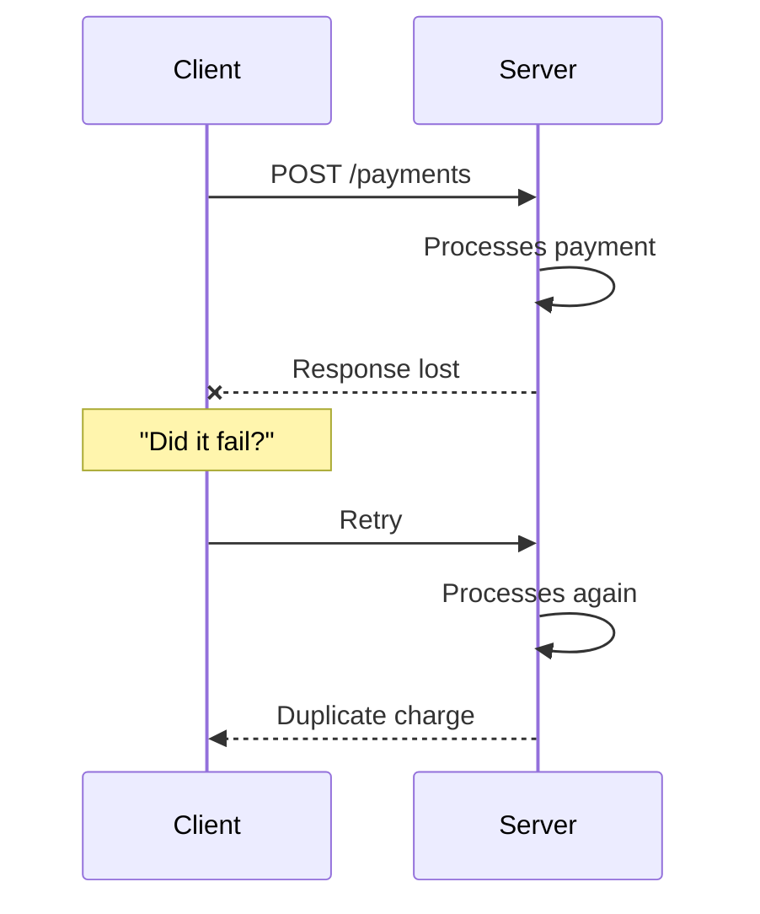
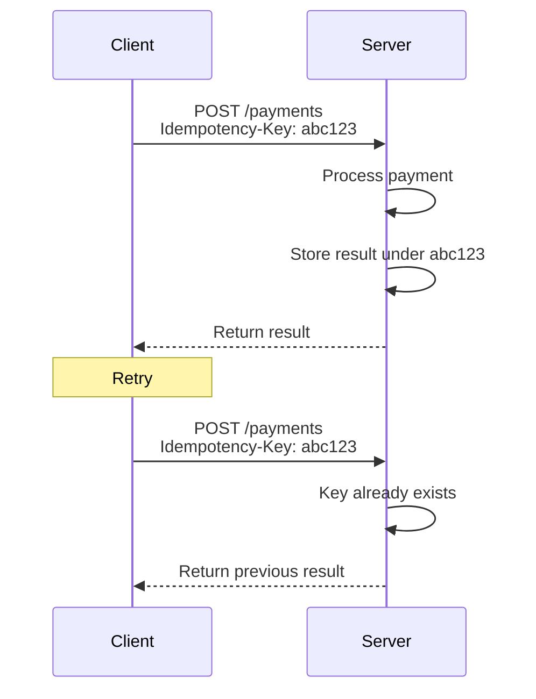
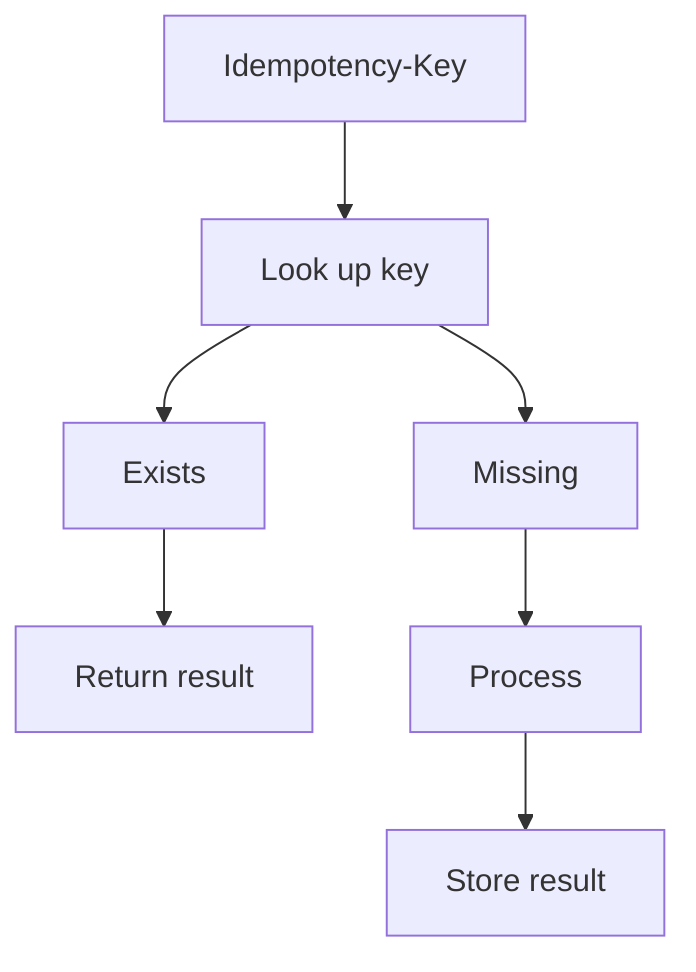
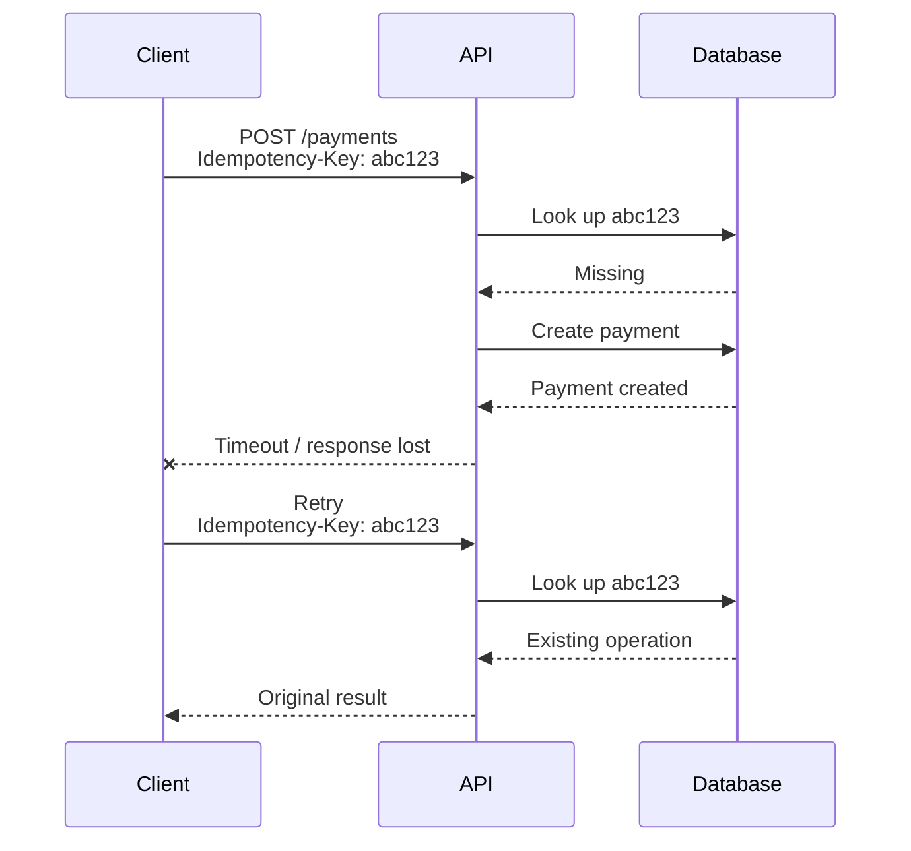
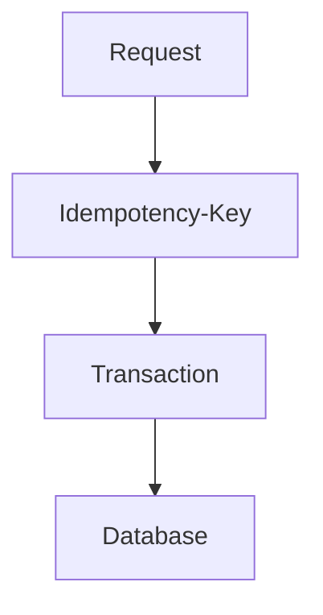

The client sends `POST /payments`. The server charges the card. Before the response crosses the network, a timeout fires or the connection drops.

The client cannot tell which of these three things happened:

- the server never received the request.
- the server received it and did not process it.
- the server processed it and the response was lost.

The client retries. That looks reasonable. If the server already charged, the retry charges again.



That is not an HTTP bug. It is the normal state of two machines talking over a network that can fail halfway. [Stripe](https://stripe.com/blog/idempotency) splits the same uncertainty into three failures: the connection never forms, the call dies mid-operation, or the work finishes and the client never hears about it. AWS, in the [Well-Architected Framework](https://docs.aws.amazon.com/wellarchitected/latest/framework/rel_prevent_interaction_failure_idempotent.html), puts it another way: in a distributed system it is relatively easy to do something _at most once_ or _at least once_. What is hard is making several identical attempts produce one effect.

> The timeout does not tell you whether the operation happened. It tells you that you do not have the response. The useful question is: how do you design the API so that retrying is safe?

## What an idempotent operation actually means

Running the same operation once or several times leaves the same final effect as running it once.

People sometimes write that as:

```text
f(f(x)) = f(x)
```

That expression is intuition, not an API spec. HTTP defines the property in [RFC 9110 §9.2.2](https://www.rfc-editor.org/rfc/rfc9110.html#name-idempotent-methods): a request method is idempotent if the _intended_ effect on the server of multiple identical requests is the same as the effect of a single such request.

Three properties get mixed up in reviews:

| Property       | What the client is asking for                                                | HTTP example                          |
| -------------- | ---------------------------------------------------------------------------- | ------------------------------------- |
| Safe           | No requested state change. The semantics are essentially read-only.          | `GET`, `HEAD`, `OPTIONS`, `TRACE`     |
| Idempotent     | Several identical requests must leave the same requested effect as one.      | Safe + `PUT` + `DELETE`               |
| Non-idempotent | The method does not promise that. Each request may create or apply new work. | `POST` by definition; `PATCH` as well |

[RFC 9110 §9.2.1](https://www.rfc-editor.org/rfc/rfc9110.html#name-safe-methods) is explicit: _safe_ does not forbid the server from writing a log, charging an ad account, or producing other effects the client did not request. [§9.2.2](https://www.rfc-editor.org/rfc/rfc9110.html#name-idempotent-methods) applies the same idea to idempotency: the server may log each request, keep revision history, or implement other non-idempotent side effects. What matters is the effect the client asked for.

Idempotency does not mean "nothing happens the second time." It means the requested state does not change because the request was repeated. A `DELETE /orders/42` that no longer finds the resource is still idempotent: the order stays gone. One more access log does not break that promise.

It also does not mean "it runs only once." An idempotent operation can run many times. What must not happen is a second business effect.

## Idempotency in HTTP

RFC 9110 calls `PUT`, `DELETE`, and the safe methods — `GET`, `HEAD`, `OPTIONS`, and `TRACE` — idempotent. That is why a client **SHOULD NOT** automatically retry a non-idempotent method unless it has some other way to know the semantics are actually idempotent, or to detect that the original request was never applied.

| Method   | Idempotent by definition | What the semantics promise                                                                           |
| -------- | -----------------------: | ---------------------------------------------------------------------------------------------------- |
| `GET`    |                      Yes | Reading a resource should not change its requested state.                                            |
| `PUT`    |                      Yes | Replacing a resource with the same representation leaves the same state.                             |
| `DELETE` |                      Yes | Deleting a resource several times leaves the resource deleted.                                       |
| `POST`   |                       No | The target handles the representation under its own semantics; it may create new work.               |
| `PATCH`  |                       No | [RFC 5789](https://datatracker.ietf.org/doc/html/rfc5789) defines it as neither safe nor idempotent. |

That is a property of the _method_, not a certificate for your handler.

A `PUT /users/123` that increments `loginCount` on every request is not idempotent, even though the verb is. A `POST /payments` that accepts an `Idempotency-Key` and returns the original charge on retry _can_ behave idempotently. RFC 9110 already allows that: a client may retry a non-idempotent method if it has a way to know the real semantics are safe to repeat. [RFC 5789](https://datatracker.ietf.org/doc/html/rfc5789) says the same of `PATCH`: the method is not idempotent by definition, but a given request can be issued in a way that is.

`GET` and `DELETE` do not need a key to be retryable under HTTP. [Stripe](https://docs.stripe.com/api/idempotent_requests) documents it that way: do not send `Idempotency-Key` on `GET` or `DELETE`; it has no effect. The problem shows up on operations that _create_ work.

## The problem it actually solves

The goal is not "run this exactly once." It is making a retry not create a second payment, a second order, or a second resource.

Without an attempt identifier:

```text
POST /payments  ->  creates a payment
POST /payments  ->  creates another payment
```

With one:



After the timeout the client still does not know whether the first attempt landed. It does not need to. It resends the same key, and the server decides whether there is new work or a known response.

That matters in distributed systems because the failure is _partial_. AWS describes the case in [EC2](https://docs.aws.amazon.com/ec2/latest/devguide/ec2-api-idempotency.html): the API may return a result before an asynchronous workflow finishes, or time out after the request has already done work. Without a token, several successful retries create more resources than you asked for. Stripe adds that two computers passing messages over a network are already a distributed system: your API and a single client are enough.

Two users fighting over the same seat is a different problem. That is a [race condition on an exclusive resource](/blog/race-conditions-when-two-requests-buy-the-same-thing/). Here the actor is the same client — or the load balancer — retrying the same intent. Locking answers who may change the resource now. Idempotency answers whether this request is the same attempt you already accepted.

## When to use it, and when not to

It earns its keep when four things are true at once:

1. the operation mutates state.
2. it can produce a side effect that matters (a charge, a shipment, a create).
3. someone may retry: the client, a proxy, a worker, a user who taps again.
4. running it twice is a problem.

That covers payments, order creation, transfers, resource creates, jobs a broker may redeliver, and microservice calls that time out. In messaging, the same idea shows up as a consumer that remembers an `eventId`: [Pub/Sub delivers at-least-once](/blog/google-cloud-pubsub-how-to-use-it-correctly/), not exactly-once.

Not every endpoint needs an `Idempotency-Key`. AWS lists applying idempotency indiscriminately as an anti-pattern. A `GET` is already idempotent by semantics. A `PUT /users/123` that replaces the profile with the same representation does not need an extra token for a retry to leave the same document.

```http
PUT /users/123
Content-Type: application/json

{
  "name": "Ada",
  "email": "ada@example.com"
}
```

Repeating that `PUT` should leave Ada with the same name and the same email. By contrast:

```http
POST /payments
Content-Type: application/json

{
  "amount": 100,
  "currency": "USD"
}
```

promises nothing about the second send. That is where an explicit mechanism earns its place.

## Idempotency keys

The pattern is simple: the client generates an identifier for _this_ logical operation and reuses it on every retry. The server uses it to recognize the same attempt.

```http
POST /payments
Idempotency-Key: 7f8e9a2b-4c1d-4e0f-9a3b-12ab34cd56ef
Content-Type: application/json

{
  "amount": 100,
  "currency": "USD"
}
```



`Idempotency-Key` is not an RFC 9110 header. It is the contract [Stripe documents](https://docs.stripe.com/api/idempotent_requests) and the name of an [IETF HTTPAPI Internet-Draft](https://datatracker.ietf.org/doc/html/draft-ietf-httpapi-idempotency-key-header). Amazon EC2 does the same job with a `ClientToken` parameter: retrying with the same token and the same parameters does not rerun the action; if the parameters change, it returns `IdempotentParameterMismatch`.

Stripe suggests a v4 UUID or another string with enough entropy, up to 255 characters, and tells you not to use email addresses or other personal identifiers as keys. It stores the status code and body of the first execution — including a `500` — and replays them. It compares incoming parameters to the original and errors if they differ. Keys are retained for at least 24 hours. It does not store a result if the request never starts executing the endpoint: a validation failure or a conflict with a concurrent request can be retried.

AWS recommends a unique token per operation, states such as `pending`, `completed`, or `failed`, and a persistent store with concurrency control. It also recommends against timestamps as keys: clock skew and two clients sharing an instant produce collisions.



The diagram does not say the network delivered the message once. It says the second attempt recognized the same operation and did not charge again.

## A deliberately incomplete example

A `POST /orders` with the same shape:

```http
POST /orders
Idempotency-Key: abc-123
Content-Type: application/json

{
  "sku": "F12",
  "qty": 1
}
```

```ts
const existing = await idempotencyStore.get(key);

if (existing) {
  return existing.response;
}

const order = await createOrder(data);

await idempotencyStore.set(key, {
  response: order,
});

return order;
```

That code teaches the contract. It is not a production implementation.

Two requests with `abc-123` can both pass the `get`, create two orders, and race to write the key. If the process dies after `createOrder` and before `set`, the retry finds nothing and creates another order. If you store only the key and not the response, the retry knows "something happened" and cannot return the same body. If you have no `processing` state, the second request does not know whether to wait or start.

A real implementation needs persistence, an atomic claim on the key (a unique constraint or a lock), `processing` / `completed` / `failed` states, an expiration policy, and a decision for the case where the server applies the side effect and never persists the result. AWS puts it as recording the token and running the associated mutations under the same concurrency control. Persisting the key in the same transaction as the order is the usual way not to leave a gap between the two writes. How to serialize two writers on the same resource is covered in [race conditions](/blog/race-conditions-when-two-requests-buy-the-same-thing/); the extra invariant here is that two HTTP requests with the same key are one attempt.

## Practices that hold up

**One key per logical operation.** The retry reuses it. A new key is a new operation.

```text
First request -> key=A
Retry         -> key=A
Retry         -> key=A
```

Not:

```text
First request -> key=A
Retry         -> key=B
```

**Do not reuse a key for a different intent.** Stripe prunes keys and treats a reused, expired key as a new request. AWS recommends a TTL. The window is domain-specific: how long a late retry is still the same attempt, not "keep them forever."

**Check payload consistency.** The same key with a different body is not the same attempt.

```text
key = abc123

request 1: amount = 100
request 2: amount = 500
```

Stripe compares parameters and errors. EC2 returns `IdempotentParameterMismatch`. Treating that as a second charge, or as the first one, is worse than failing loudly.

**Persist the result, not only the key.** The retry has to return the same status and a useful body. For asynchronous operations, EC2 notes that the result may carry updated information — the current creation status, for example — without rerunning the action.

**Deal with concurrency.** This pattern is unsafe:

```ts
if (!exists(key)) {
  create();
  save(key);
}
```

Two concurrent requests both pass the `if`. The key has to be claimed atomically _before_ or _with_ the side effect, not after it.

**Do not use timestamps as keys.** AWS lists that as an anti-pattern. A client UUID, or a stable business id (`checkoutAttemptId`), is the identifier. The clock is not.

**Design retries with backoff.** Idempotency and retry are not the same idea. Retry is trying again. Idempotency is what keeps that attempt from duplicating the effect. Stripe recommends exponential backoff and jitter so an incident does not become a thundering herd. EC2 is more concrete in its response table: do not retry a `200`; do not retry a typical 4xx; do retry a 5xx with backoff.

## Common mistakes

- Believing `POST` can never be idempotent. The method is not, by definition. Your operation can be.
- Believing `PUT` makes any implementation safe. The verb promises replacement. An increment dressed as `PUT` is not idempotent.
- Minting a new `Idempotency-Key` on every retry. Then there is no idempotency: there are two operations.
- Doing `get` then `set` with no concurrency protection.
- Storing the key and forgetting the result or the state.
- Accepting the same key with different payloads.
- Confusing idempotency with a transaction. A transaction groups related writes. It does not turn a repeated `POST` into one charge.
- Confusing idempotency with exactly-once delivery. Networks and brokers remain at-least-once or worse. The operation is designed so multiple attempts produce the same logical effect.
- Assuming "we have keys" makes every retry safe. A key that is minted wrong, already expired, or persisted outside the mutation does not protect the charge.

AWS Well-Architected sometimes says a request is processed "exactly once." The same page describes the actual mechanism: multiple identical requests should have the same effect as one. That is not a guarantee that the network delivered the message once. It is a property of the operation.

## Idempotency, transactions, and retries

| Concept      | Problem it addresses                                                                         |
| ------------ | -------------------------------------------------------------------------------------------- |
| Idempotency  | Avoid a second business effect when there are multiple attempts.                             |
| Transaction  | Keep related writes consistent in one commit.                                                |
| Retry        | Try again when there is no success response.                                                 |
| Timeout      | Stop waiting for a response. It does not decide whether the server applied the work.         |
| Exactly-once | A delivery or processing guarantee. In distributed systems it is much harder than it sounds. |

They can sit together:



The transaction helps you not leave an order without its idempotency row, or the reverse. It does not replace the key. The timeout triggers the retry. The retry is only safe if the operation — by HTTP semantics or by a key — will not create a second effect.

## A working rule

Not every endpoint needs this mechanism. Operations that are already idempotent under HTTP or under the domain — replace a document, delete a resource, read a state — already tolerate a retry. Operations that create a charge, an order, or a job do not.

> If an operation can be retried and repeating it produces an effect you do not want, design it to be idempotent.

That is not an absolute rule. It is a design test. The timeout will happen. The client will retry. The API either treats those two HTTP requests as the same attempt, or it charges twice.

## Sources

- IETF, [RFC 9110 — HTTP Semantics](https://www.rfc-editor.org/rfc/rfc9110.html) — §9.2.1 safe methods; §9.2.2 idempotent methods (`PUT`, `DELETE`, and the safe methods); a client should not automatically retry a non-idempotent method unless it knows the real semantics
- IETF, [RFC 5789 — PATCH Method for HTTP](https://datatracker.ietf.org/doc/html/rfc5789) — `PATCH` is neither safe nor idempotent by definition; a given request can still be issued idempotently
- IETF HTTPAPI, [The Idempotency-Key HTTP Header Field](https://datatracker.ietf.org/doc/html/draft-ietf-httpapi-idempotency-key-header) — Internet-Draft, not an RFC; the header is not closed HTTP semantics
- AWS, [REL04-BP04 Make mutating operations idempotent](https://docs.aws.amazon.com/wellarchitected/latest/framework/rel_prevent_interaction_failure_idempotent.html) — tokens, states, concurrency, TTL; at most once / at least once versus several attempts with the same effect
- AWS, [Ensuring idempotency in Amazon EC2 API requests](https://docs.aws.amazon.com/ec2/latest/devguide/ec2-api-idempotency.html) — `ClientToken`, `IdempotentParameterMismatch`, retry advice by status class
- Stripe, [Designing robust and predictable APIs with idempotency](https://stripe.com/blog/idempotency) — three network failures; `Idempotency-Key`; backoff and jitter
- Stripe, [Idempotent requests](https://docs.stripe.com/api/idempotent_requests) — key retention, parameter comparison, what gets stored and what can be retried
