La reunión de producto termina en una votación. Web y móvil llamarán a la API con un JWT. El partner de facturación llamará a la misma API con una API Key. Alguien pregunta cuál mecanismo es «el correcto». La sala lo trata como si hubiera que elegir uno.

No hay que elegir uno. La aplicación web tiene un usuario autenticado que debe estar autorizado a leer sus propias facturas. El partner no tiene un usuario en tu almacén de identidad. Es un consumidor que necesitas identificar, medir y limitar. Son trabajos distintos. Forzarlos a una sola credencial es cómo los equipos acaban publicando un JWT de 30 días que en realidad es una contraseña, o una API Key que en realidad es una sesión.

> «¿JWT o API Key?» es la pregunta equivocada. La útil es: qué tipo de cliente tienes, qué necesitas identificar, qué necesitas autorizar y cuál es tu modelo de confianza.

JWT y API Keys no son alternativas obligatorias. Pueden convivir en la misma arquitectura porque pueden resolver problemas distintos.

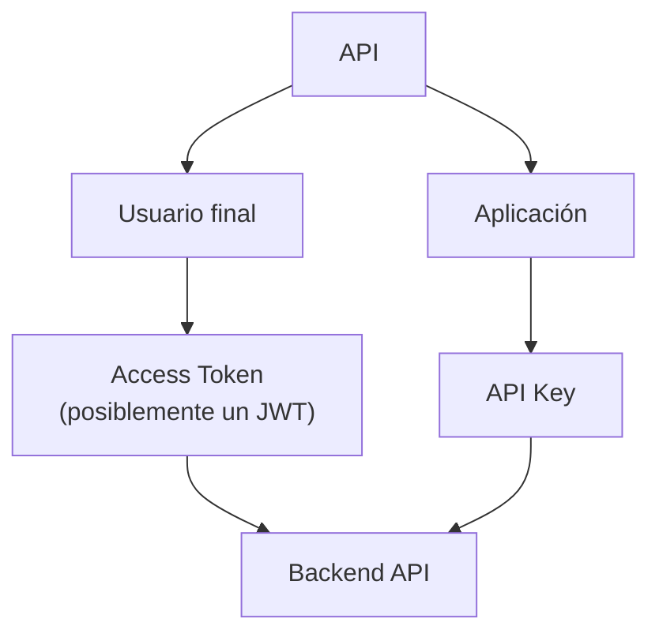

Ese diagrama es una decisión de arquitectura, no un estándar. [RFC 7519](https://www.rfc-editor.org/rfc/rfc7519) no te dice que pongas JWT en usuarios. [OWASP](https://cheatsheetseries.owasp.org/cheatsheets/REST_Security_Cheat_Sheet.html) no te dice que pongas API Keys en partners. La separación sale de los consumidores. Decide por caso de uso, por tipo de consumidor y por frontera de confianza. NestJS aparece al final como un bosquejo. Vida útil, refresh y logout de sesiones de usuario son otro artículo: [Un refresh token no mantiene vivo un access token](/blog/refresh-tokens-do-not-keep-access-tokens-alive/). Rate limiting y cuotas se sitúan delante de esta capa; no la sustituyen — [CORS, rate limiting y Helmet en NestJS](/blog/cors-rate-limiting-security-headers-nestjs/).

## La autenticación no es autorización

Los equipos comprimen «estar logueado» en un solo bloque y después discuten formatos de token. Los nombres parecen parientes. Los trabajos no lo son.

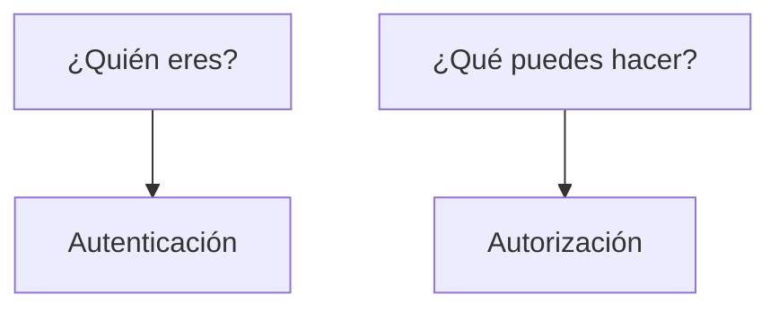

| Término        | Trabajo                                                                                            |
| -------------- | -------------------------------------------------------------------------------------------------- |
| Identidad      | El sujeto del que hablas: un usuario, un servicio, una aplicación partner                          |
| Credencial     | El secreto o token que se presenta para probar algo sobre ese sujeto, o sobre un grant             |
| Autenticación  | Establecer quién (o qué cliente) está hablando                                                     |
| Autorización   | Decidir qué puede hacer ese sujeto en esta petición                                                |
| Access token   | Una credencial que representa una autorización emitida a un cliente                                |
| Claim          | Una aserción nombre/valor dentro de un JWT: quién lo emitió, de quién trata, cuándo caduca         |

**Identidad** es el principal. `user-123` es una identidad. `partner-acme` es una identidad. No son el mismo tipo de principal y no necesitan la misma credencial.

**Credencial** es lo que viaja en la petición. Una contraseña, una API Key, un bearer access token, un certificado de cliente. La credencial no es la identidad. Es evidencia.

**Autenticación** responde «¿quién es este?» o, con más cuidado, «¿a qué principal une esta credencial?» [OWASP API2:2023](https://owasp.org/API-Security/editions/2023/en/0xa2-broken-authentication/) es explícito: OAuth no es autenticación, y las API Keys tampoco. OAuth emite una autorización. Una API Key identifica un cliente. Confundir eso con «el usuario inició sesión» es cómo se tuercen los diseños.

**Autorización** responde «¿puede seguir esta petición?» Scopes, roles, propiedad del recurso, planes de uso. La autenticación puede tener éxito y la autorización fallar: eso es HTTP 403 después de 401, no una librería JWT que falta.

**Access token** es [RFC 6749 §1.4](https://www.rfc-editor.org/rfc/rfc6749#section-1.4): «una cadena que representa una autorización emitida al cliente». La cadena suele ser opaca para el cliente. Puede ser un identificador que el servidor consulta, o puede autocontener la autorización de forma verificable. Esa última opción es donde suele entrar JWT. Es opcional. El RFC no exige un JWT.

**Claim** es [RFC 7519](https://www.rfc-editor.org/rfc/rfc7519): una pieza de información afirmada sobre un sujeto, como par nombre/valor. `sub`, `aud`, `scope` son claims cuando aparecen en un JWT. No son una propiedad de las API Keys.

Si tratas autenticación como autorización, emites un token que solo significa «esta petición llegó» y te saltas qué puede hacer quien llama. Si tratas autorización como autenticación, metes permisos en un secreto de larga vida y nunca preguntas quién lo sostiene. Ambos errores aparecen como «elegimos JWT» o «elegimos API Keys» cuando el fallo real es que los trabajos nunca se nombraron.

## Qué es realmente un JWT

[RFC 7519](https://www.rfc-editor.org/rfc/rfc7519) define JSON Web Token: un medio compacto y seguro para URL de representar claims que se transfieren entre dos partes. Los claims son un objeto JSON usado como payload de una estructura JSON Web Signature (JWS) o como plaintext de una estructura JSON Web Encryption (JWE). Esa frase es todo el formato.

JWT es un formato de token. JWT no es, por sí mismo, un sistema de autenticación. No inicia sesión. No define logout, sesiones ni revocación. Un JWT que verifica es un JWT que verifica, hasta que lo rechazas.

La forma compacta habitual de un JWT firmado son tres segmentos base64url:

```text
xxxxx.yyyyy.zzzzz
```


**Header** (JOSE header) nombra el algoritmo criptográfico y, a menudo, un tipo. Campos típicos: `alg`, `typ`. [RFC 8725](https://www.rfc-editor.org/rfc/rfc8725) exige que el verificador decida qué algoritmos son aceptables. No dejes que el token elija `alg` por ti. El algoritmo `none` existe en la especificación como JWT no asegurado. El [REST Security Cheat Sheet](https://cheatsheetseries.owasp.org/cheatsheets/REST_Security_Cheat_Sheet.html) de OWASP dice que no lo aceptes para control de acceso.

**Payload** es el JWT Claims Set: un objeto JSON de claims.

**Signature** (para JWS) cubre header y payload. Es una firma digital o un MAC. Protege la integridad y la autenticidad de esos bytes bajo el algoritmo y la clave elegidos. No cifra el payload. Quien tiene el token puede leer los claims. Firmado frente a cifrado es una sección posterior; la distinción empieza aquí.

Los nombres de claims registrados en RFC 7519 §4.1 son un conjunto de partida para interoperar. **Ninguno es obligatorio en todos los JWT.** El RFC dice que las aplicaciones deben definir qué claims usan y cuándo son required. OWASP REST recomienda verificar `iss`, `aud`, `exp` y `nbf` cuando un JWT se usa para control de acceso. Eso es una recomendación de seguridad para ese uso, no un requisito IETF de que todo JWT lleve esos campos.

| Claim | Significado en RFC 7519 |
| ----- | ----------------------- |
| `iss` | Issuer: quién creó el JWT. OPTIONAL. |
| `sub` | Subject: de quién trata el JWT. OPTIONAL. Debe ser único en el contexto del issuer o globalmente único. |
| `aud` | Audience: quién debe consumirlo. Si está presente, un destinatario que no esté en `aud` MUST rechazar el JWT. |
| `exp` | Expiration time. Si procesas este claim, ahora debe ser anterior a `exp`. |
| `nbf` | Not-before. Si procesas este claim, ahora debe ser posterior a `nbf`. |
| `iat` | Issued-at. Útil para conocer la edad del token. |
| `jti` | JWT ID. Un identificador único; el RFC indica que puede usarse para prevenir replay. |

`scope` no es un claim registrado en RFC 7519. OAuth usa scope como parámetro de protocolo. Si pones `"scope": "orders:read"` en un JWT, esa es una decisión de aplicación o de perfil — [RFC 9068](https://www.rfc-editor.org/rfc/rfc9068) es uno de esos perfiles para access tokens de OAuth.

Un payload conceptual, no un token de producción:

```json
{
  "sub": "user-123",
  "iss": "https://auth.example.com",
  "aud": "orders-api",
  "exp": 1780000000,
  "scope": "orders:read"
}
```

La validación, a grandes rasgos, es: parsear la forma compacta, confirmar que el algoritmo está en tu allowlist, verificar la firma o el MAC con claves en las que ya confías, y después aplicar los claims que tu aplicación exige (`iss`, `aud`, `exp` y lo demás que hayas definido). RFC 8725 añade: vincula las claves al issuer, valida audience cuando el mismo issuer sirve a más de una parte, no sigas URLs `jku`/`x5u` del header hacia una consulta que no hayas fijado, y rechaza `alg: none` salvo que hayas pedido explícitamente un JWT no asegurado.

Firmar y cifrar son operaciones distintas. RFC 7519 permite que los claims estén firmados, con MAC, cifrados, o combinaciones anidadas. Un JWT firmado no es confidencial. Un JWT cifrado (JWE) es otra serialización. El soporte de cifrado es opcional en la spec de JWT. La mayoría de access tokens que verás en una API NestJS están firmados, no cifrados. TLS protege el token en tránsito. El JWT en sí sigue leyéndose como JSON para quien lo tenga.

## Qué es realmente una API Key

Una API Key es una credencial emitida a un cliente — normalmente una aplicación, un partner o una cuenta de desarrollador — y presentada en las peticiones para que el servidor identifique a ese consumidor. No hay un documento IETF titulado «API Keys» que defina claims, scopes o expiración como RFC 7519 define JWT. El concepto vive en documentación de plataformas y en guías de seguridad.

[OWASP REST](https://cheatsheetseries.owasp.org/cheatsheets/REST_Security_Cheat_Sheet.html) trata las API Keys como una forma de reducir el abuso de servicios REST públicos, de medir planes de pago y de suavizar un poco la denegación de servicio. Te dice que exijas la key en los endpoints protegidos, que devuelvas `429 Too Many Requests` cuando el cliente va demasiado rápido, que revoques la key si el cliente viola el acuerdo de uso, y **que no te apoyes exclusivamente en API Keys para proteger recursos sensibles, críticos o de alto valor.**

Las [mejores prácticas de API Keys de Google Cloud](https://docs.cloud.google.com/docs/authentication/api-keys-best-practices) tratan las keys como credenciales bearer: quien tiene la cadena puede usarla. Restringe cada key. No la pongas en query parameters. No la subas a un repositorio. Rótala. Borra las keys que no uses. Aísla keys por aplicación y por persona cuando eso ayude a auditar. Google también señala que algunas «authorization keys» ocultan al usuario final en los logs de auditoría; esa es una razón para preferir un método que represente a un usuario cuando lo que necesitas identificar es un usuario.

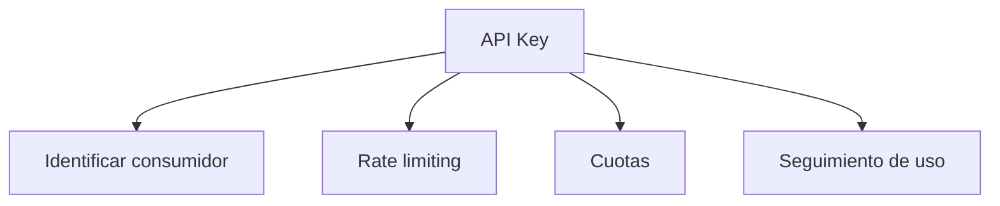

Trabajos típicos que se le piden a una API Key:

- identificar una aplicación o un desarrollador;
- identificar un consumidor externo (una integración partner);
- controlar el acceso a groso modo (esta key puede llamar a esta API);
- rate limit por consumidor;
- aplicar cuotas y planes de pago;
- atribuir uso para facturación o revisión de abuso.

Una API Key **no** lleva de por sí:

- identidad de usuario final;
- claims;
- scopes;
- expiración;
- autorización de grano fino.

Puedes construir eso alrededor de una key: una fila en base de datos con `expiresAt`, un plan, una lista de rutas permitidas, un usuario que «posee» la key. Esas son propiedades de tu sistema, no de «API Key» como concepto. No se las atribuyas a la credencial como `exp` es un claim definido de JWT.

[OWASP API2:2023](https://owasp.org/API-Security/editions/2023/en/0xa2-broken-authentication/) dice que las API Keys no deberían usarse para autenticación de usuario. Deberían usarse para autenticación del cliente de la API. Esa es la separación de trabajos en una frase.

## La comparación no es simétrica

JWT y API Keys no son dos tecnologías equivalentes entre las que siempre hay que elegir.

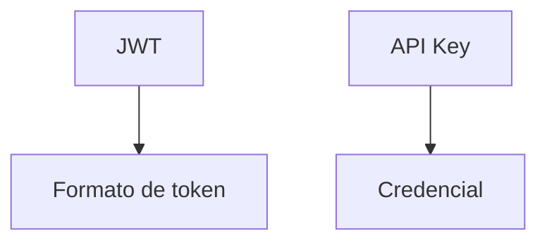

Uno es una forma de codificar claims. El otro es un secreto que emites a un consumidor. Puedes comparar cómo los usan los equipos en APIs HTTP. No puedes tratar la comparación como «elige el formato A o el formato B».

OAuth 2.0 vive en otro eje.

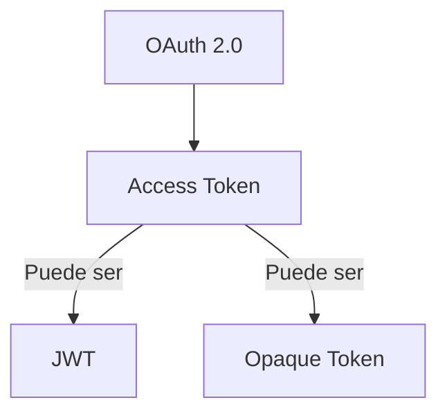

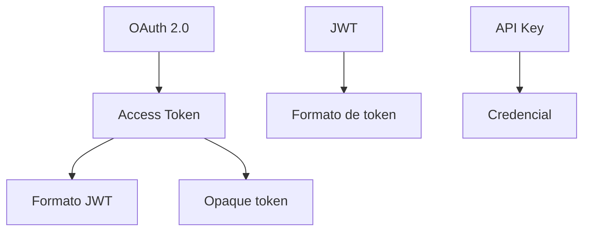

**OAuth 2.0 ≠ JWT.** [RFC 6749](https://www.rfc-editor.org/rfc/rfc6749) es un framework de autorización. Emite access tokens. [RFC 6750](https://www.rfc-editor.org/rfc/rfc6750) describe cómo enviar un access token **bearer** en HTTP — normalmente `Authorization: Bearer ...`. Bearer significa que poseerlo basta. Los RFC no exigen que esa cadena sea un JWT. RFC 6749 §1.4 dice que la cadena suele ser opaca para el cliente, y que los access tokens pueden tener formatos distintos.

**JWT ≠ OAuth 2.0.** RFC 7519 es un formato de claims. Puedes firmar un JWT en NestJS con `@nestjs/jwt` y no hablar nunca de OAuth. Puedes correr OAuth con tokens opacos e [introspection](https://www.rfc-editor.org/rfc/rfc7662) y no emitir nunca un JWT. [RFC 9068](https://www.rfc-editor.org/rfc/rfc9068) es un perfil para cuando un access token de OAuth _es_ un JWT (`typ` debería ser `at+jwt`). Existe porque la gente ya metía layouts JWT propietarios en access tokens. Un perfil no es identidad entre las dos specs.

Un ID Token en OpenID Connect es un JWT usado para representar al usuario ante un cliente. Eso sigue sin ser «JWT = login», y no es una API Key. No comprimas ID Token, access token y API Key en un solo «auth token».

## JWT vs API Key, con matices

La tabla es un mapa de propiedades típicas, no una ley.

| Característica     | JWT                                    | API Key                                              |
| ------------------ | -------------------------------------- | ---------------------------------------------------- |
| Naturaleza         | Formato de token                       | Credencial                                           |
| Claims             | Sí                                     | No inherentes                                        |
| Expiración         | Puede representarse con `exp`          | Depende de la implementación                         |
| Identidad de usuario | Puede representarse (`sub` y compañía) | No necesariamente                                  |
| Scopes             | Puede representarlos                   | No inherentes                                        |
| Rate limiting      | Puede ayudar a identificar un sujeto   | Uso habitual                                         |
| Cuotas             | Puede ayudar                           | Uso habitual                                         |
| Revocación         | Necesita una estrategia                | Puede ser más directa si el servidor guarda la key   |
| Rotación           | Necesita una estrategia                | Recomendada por las guías de plataforma              |
| Machine-to-machine | Sí                                     | Sí                                                   |
| Usuario final      | Sí, según el flujo                     | En general no es su trabajo principal                |
| OAuth 2.0          | Puede usarse como access token         | No es OAuth 2.0                                      |

Lee los matices. «Puede» no es «lo hace». Un JWT sin `exp` no caduca por magia del formato. Una API Key en un sistema que nunca borra filas no es «fácil de revocar». El rate limiting es un control HTTP; cualquiera de las dos credenciales puede ser la clave de partición si la consultas. [RFC 6750](https://www.rfc-editor.org/rfc/rfc6750) no menciona API Keys. Google Cloud no dice que un JWT no pueda tener rate limiting.

La revocación es la fila que más falsa confianza genera. Un JWT que solo se comprueba en local es válido hasta `exp`. Matarlo antes implica una denylist, un TTL corto más un flujo de refresh, estado del token, o rotar claves — todo maquinaria extra. Una API Key que es una fila en tu base de datos puede deshabilitarse en la siguiente petición. Eso es una propiedad de implementación, no una victoria metafísica de las keys. Los access tokens opacos tienen la misma palanca: el authorization server puede borrar la fila.

## ¿Qué tipo de consumidor tienes?

Clasifica a quien llama antes de clasificar el token.

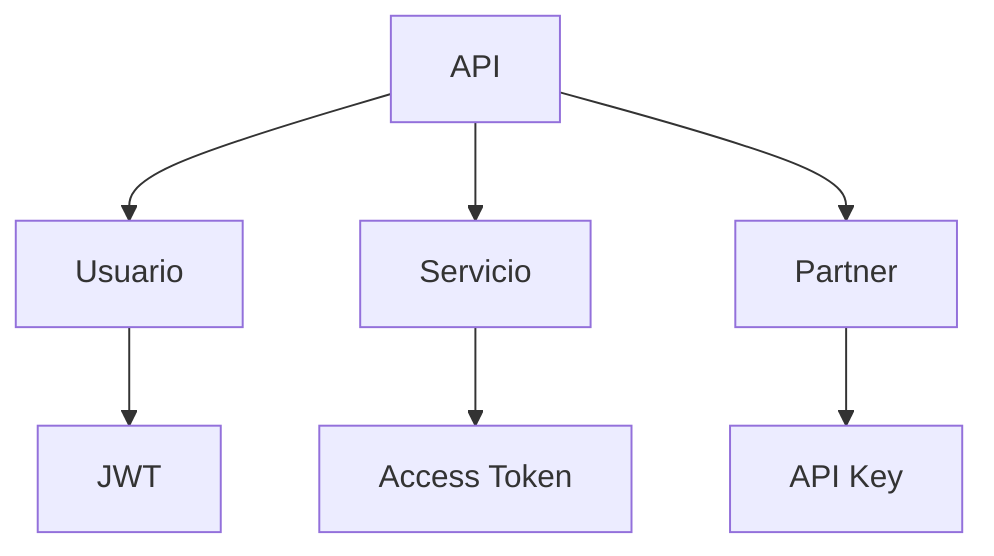

Esas etiquetas son ejemplos. Existen otras soluciones. Una API orientada a usuario puede usar una cookie de sesión clásica en el servidor y no emitir nunca un JWT. Un partner puede usar OAuth. Un servicio interno puede usar mTLS y saltarse los bearer tokens por completo.

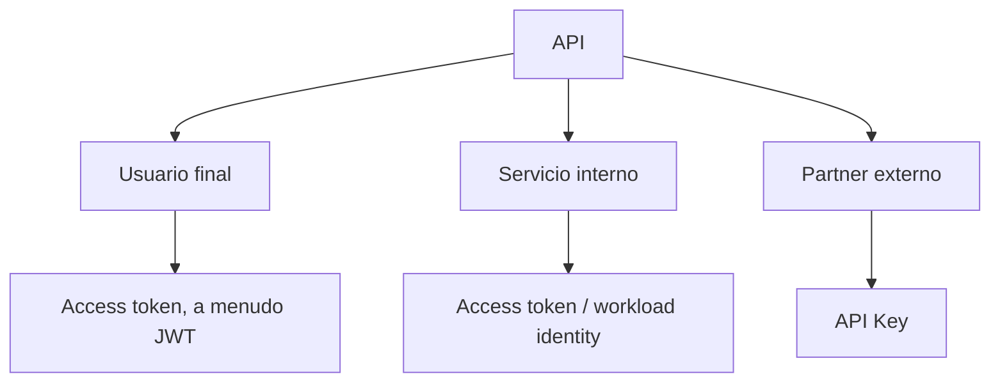

### Usuario final

Necesitas identidad y autorización. Quien llama actúa como una persona (o un grant delegado de esa persona). Necesitas conocer `sub`, qué puede hacer, y normalmente una vida útil lo bastante corta para que el robo tenga un límite. Un access token encaja. Que ese token sea JWT u opaco es una decisión de formato. Una API Key que un humano pega en una SPA es un secreto bearer de larga vida sin `exp` salvo que lo inventes. La línea de OWASP se sostiene: no uses API Keys para autenticación de usuario.

### Servicio interno

Necesitas saber qué workload está llamando, y a menudo que tiene permiso para llamar a esta audience. Opciones que existen en plataformas reales — no una lista de la compra obligatoria — incluyen OAuth 2.0 Client Credentials, workload identity, service accounts, mTLS, y network policy más un token de servicio. JWT puede aparecer aquí como una aserción firmada. Una API Key puede aparecer aquí como un secreto estático. Los secretos estáticos dentro de un mesh son un problema de rotación y de fugas. Elige desde el modelo de confianza que ya operas (IAM del cloud, service mesh, tu authorization server). No añadas JWT porque la API pública usa JWT.

### Integración externa

Un partner, un conector al estilo Zapier, el backend de un cliente. Puede que solo necesites identificar la aplicación, medirla y cortarla. Una API Key encaja a menudo. Si el partner debe actuar como uno de sus usuarios, o necesitas acceso delegado, OAuth es el framework construido para eso. «Partner» no es sinónimo de «API Key». Es un tipo de consumidor cuyo riesgo y modelo de autorización todavía tienes que escribir.

## Sí, puedes usar JWT y API Keys juntos

Sí.

Hay más de una forma de combinarlos. Las combinaciones no son igual de buenas, ni igual de baratas.

### Caso A — consumidores distintos

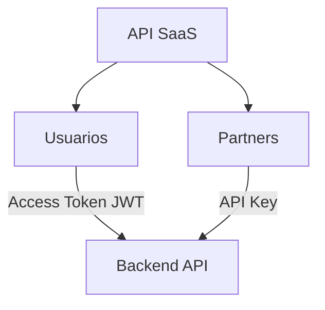

Los usuarios presentan un access token. Ese token puede ser un JWT. Los partners presentan una API Key. La misma API HTTP acepta ambos. Cada mecanismo tiene un trabajo distinto: autorización de usuario frente a identificación y medición del consumidor. Esta es la convivencia de la que hablaba el diagrama inicial. Es una decisión de arquitectura. Nada en RFC 7519 ni RFC 6750 la prohíbe. Nada la exige tampoco.

### Caso B — API Gateway, después la API

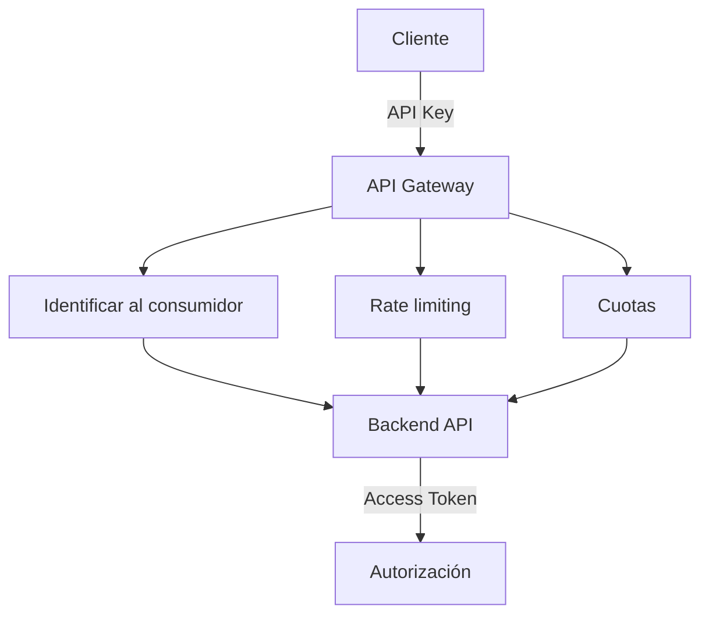

El gateway usa la key para saber _qué aplicación_ está llamando y aplicar un plan. El backend usa un access token para autorizar _qué puede hacer esta petición_. Esa separación es una arquitectura posible. No es una regla de que toda API deba validar primero una API Key y después un JWT.

Añadir un segundo mecanismo añade configuración, modos de fallo y carga operativa. Hazlo cuando el trabajo del gateway (medir desarrolladores de terceros, proteger el origin, facturar) sea real. No lo hagas porque un diagrama tenía dos cajas.

### Caso C — ambos en la misma petición

Es técnicamente posible exigir:

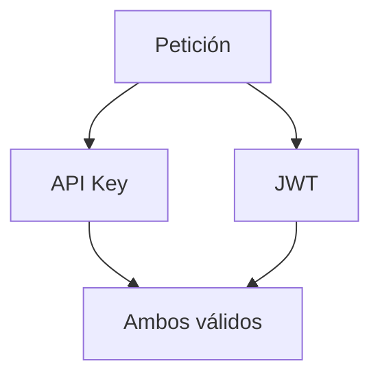

Eso puede subir el listón en un threat model concreto: un token de usuario robado no sirve sin la key del partner, o una key filtrada no puede llamar rutas con alcance de usuario sin un token de usuario. También sube la complejidad, la configuración, el coste de depurar y la probabilidad de que una de las dos comprobaciones se aplique mal.

No lo recomiendes como default. No añadas dos credenciales a una petición porque «más autenticación es más seguridad». [OWASP](https://owasp.org/API-Security/editions/2023/en/0xa2-broken-authentication/) quiere que entiendas los mecanismos que ya tienes, no que los apiles por tranquilidad. Tiene que haber una amenaza concreta o una necesidad de arquitectura — dos fronteras de confianza que ambas tienen que hablar en esta llamada — antes de que la segunda credencial merezca su coste.

## Un SaaS realista: una API, tres consumidores

Una plataforma B2B publica una app web, una app móvil, integraciones externas y workers internos.

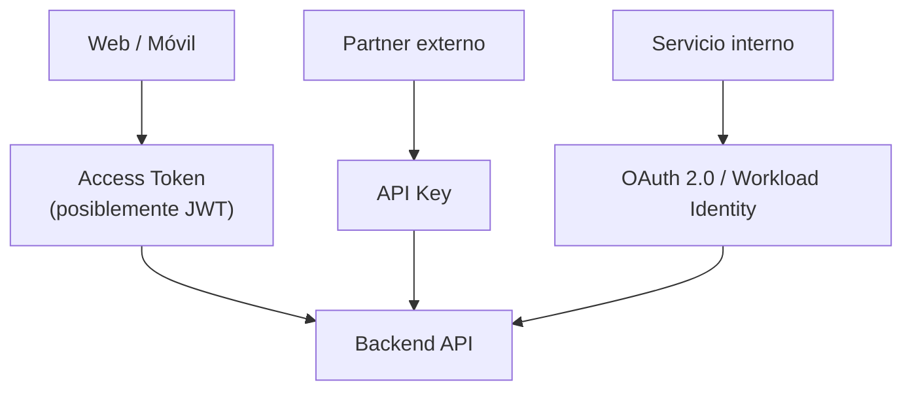

**Web y móvil** inician sesión de un usuario. Necesitan un subject, scopes o equivalente, una audience y una vida útil. El access token es la credencial de la petición. JWT es un formato razonable si la API va a validar en local; opaco es razonable si ya haces introspection. La sesión detrás de ese token — refresh, rotación, logout — es el otro artículo. No estires `exp` a treinta días para evitar ese diseño.

**Partner externo** sincroniza datos de catálogo por la noche. No hay usuario final en la llamada. Necesitas saber de qué tenant es esta integración, limitar su rate, facturar el plan y revocarlos cuando termine el contrato. Una API Key (restringida, rotada, guardada hasheada, nunca en una URL) encaja con ese trabajo. Si más adelante deben actuar en nombre de uno de sus usuarios, eso es un grant nuevo. Añade OAuth entonces. No pretendas que la key era una sesión de usuario.

**Servicio interno** emite facturas desde un worker. No es un navegador. Workload identity del cloud o Client Credentials contra tu authorization server vinculan el workload a una audience. Una API Key de larga vida en el env del worker funciona hasta que alguien copia el env. Un JWT que el worker se emite a sí mismo con un secreto HS256 compartido es un secreto estático con pasos extra. Prefiere el sistema de identidad en el que ya confías para compute.

No necesitas el mismo mecanismo para cada consumidor. La uniformidad es un nice-to-have. El requisito es unir bien principal, grant y threat model.

## La seguridad es un ciclo de vida, no un formato

JWT no es automáticamente más seguro. Las API Keys no son automáticamente inseguras. La seguridad depende de cómo se emite, guarda, transmite, valida, rota y revoca una credencial.

### API Keys

La guía de Google Cloud es concreta porque las keys se filtran de formas aburridas.

- **Exposición.** Una key en un repo Git, un binario móvil, una captura de pantalla o un ticket de soporte es una credencial bearer. Trátala como una contraseña. El cheat sheet de [Secrets Management](https://cheatsheetseries.owasp.org/cheatsheets/Secrets_Management_Cheat_Sheet.html) de OWASP existe porque los equipos siguen hardcodeándolas.
- **Variables de entorno.** Mejor que el control de versiones. Siguen visibles para cada proceso y cada dump del env. Restringe quién puede leer la configuración del runtime.
- **Logs y proxies.** Los access logs, las traces de APM y los reverse proxies van a guardar la petición. Si la key está en la URL, está en el log. Si está en un header, algunas herramientas igual registran headers. No la imprimas en logs de aplicación.
- **URLs.** Sección aparte más abajo. No pongas la key en el query string.
- **Rotación.** Google Cloud recomienda crear una key nueva, mover a los clientes y borrar la antigua. La rotación no es una propiedad de «API Key»; es una práctica operativa. Si nunca rotas, una fuga del año pasado sigue funcionando.
- **Revocación.** Deshabilita o borra la fila. Directo, si construiste la fila.
- **Restricciones.** Limita por API, IP, referrer o identidad GCP según permita la plataforma. Una key que puede llamar a todos los métodos desde cualquier red está a un string robado de una suplantación completa del consumidor.
- **Rate limiting.** OWASP REST: exige la key, devuelve 429, revoca ante abuso. Rate limiting no es autenticación. Es cómo evitas que una superficie pública se convierta en una factura. La mitad NestJS de ese control está en el [artículo de rate limiting](/blog/cors-rate-limiting-security-headers-nestjs/).

Una API Key bien operada es un secreto hasheado, con alcance, rotatable, y nunca usada como sesión de usuario. Un JWT mal operado es peor que esa key.

### JWT

RFC 8725 es el BCP. Los ataques que lista no son teóricos: confusión de `alg`, `none`, secretos HMAC débiles, sustituir un token pensado para otra audience.

- **Validación criptográfica.** Verifica con claves que ya asocias al issuer. Permite solo los algoritmos que pretendes. Una clave, un algoritmo.
- **Allowlist de algoritmos.** Las aplicaciones MUST permitir solo algoritmos criptográficamente actuales que acepten. Las librerías MUST dejar que quien llama fije ese conjunto. `none` solo cuando quieres explícitamente un JWT no asegurado y otra cosa (normalmente TLS más un entorno cerrado) ya protege el payload.
- **Issuer.** Si `iss` está presente, las claves MUST pertenecer a ese issuer o rechazas el token (RFC 8725 §3.8).
- **Audience.** Si el mismo issuer sirve a más de una relying party, el JWT MUST tener `aud`, y el destinatario MUST comprobarlo (RFC 8725 §3.9). Si no, un token para la API de facturación es un token para la API de admin.
- **Expiración.** Procesa `exp` cuando uses el JWT como credencial acotada en el tiempo. OWASP REST incluye `exp` y `nbf` entre los claims que una relying party debería verificar para control de acceso. Un JWT sin `exp` no «dura para siempre» por spec; dura hasta que tú decides que es inválido. En la práctica, un `exp` que falta es cómo se publican incidentes de 30 días.
- **Almacenamiento.** Un JWT bearer en `localStorage` está al alcance de XSS. Un JWT en una URL está al alcance de los logs. El token es tan público como su almacenamiento. Cookie de sesión vs header es una decisión de modelo de amenazas que cubre el [artículo de refresh tokens](/blog/refresh-tokens-do-not-keep-access-tokens-alive/).
- **Robo y replay.** Bearer significa que poseerlo basta (RFC 6750). Un TTL corto limita la ventana. `jti` más una denylist pueden bloquear un token concreto si estás dispuesto a guardar estado. Los tokens acotados al emisor (DPoP, mTLS-bound) existen en OAuth; no son «usar JWT».
- **Duración.** Access tokens cortos, credenciales de refresh más largas si necesitas una sesión. Esa separación es arquitectura, especificada para refresh de OAuth en RFC 6749, no una feature de JWT.
- **Revocación.** Ver más abajo. `exp` no es un interruptor de apagado.
- **Validación de claims.** No confíes en `kid`, `jku` ni `x5u` como fuente de claves (RFC 8725 §3.10). No tomes un claim de rol del token como autorización sin un modelo: la firma dice que el issuer lo afirmó, no que tu ACL sigue de acuerdo.

El [JWT cheat sheet](https://cheatsheetseries.owasp.org/cheatsheets/JSON_Web_Token_Cheat_Sheet.html) de OWASP es directo con las «sesiones stateless»: si necesitas logout, necesitas una denylist o deberías usar una sesión. Stateless es una conveniencia de despliegue, no una propiedad de seguridad.

## Un JWT firmado no es un JWT cifrado

```text
Signed JWT ≠ Encrypted JWT
```

RFC 7519 permite ambos. No son la misma protección.

Un JWT **firmado** (serialización compacta JWS) son tres segmentos legibles. Base64url es encoding, no cifrado. Quien tiene la cadena puede decodificar el header y los claims. La firma responde «¿se alteró esto, y vino de alguien que tiene la clave?» bajo el algoritmo que aceptaste. No responde «¿quién más puede leerlo?».

Un JWT **cifrado** (JWE) usa otra forma compacta y protege la confidencialidad de los claims, con los matices de RFC 8725 (fugas por compresión, ataques de curva inválida, JWTs anidados que deben validar cada capa).

TLS cifra el hop. No hace el token almacenado opaco para el navegador, el disco del móvil o el atacante que ya lo robó. Si el payload debe permanecer confidencial frente al cliente que lo presenta, un JWT firmado es la herramienta equivocada — y meter secretos en claims era el diseño equivocado. Prefiere tokens opacos o deja los atributos sensibles en el servidor.

La frase que hay que matar en code review: «Está firmado, así que nadie puede leerlo».

## API Keys y URLs

Compara:

```http
GET /users?api_key=secret
```

con:

```http
GET /users
X-API-Key: secret
```

[OWASP REST](https://cheatsheetseries.owasp.org/cheatsheets/REST_Security_Cheat_Sheet.html) dice que contraseñas, tokens de seguridad y API Keys no deberían aparecer en la URL. Las URLs aterrizan en access logs, historial del navegador, headers `Referer`, proxies y APM. En GET, pon los datos sensibles en un header. Google Cloud dice lo mismo para sus APIs: no pases la key como query parameter; usa `x-goog-api-key` o una client library.

[RFC 6750 §2.3](https://www.rfc-editor.org/rfc/rfc6750#section-2.3) permite un access token en el query string y después te dice que no: SHOULD NOT usarse salvo que el header `Authorization` y el body sean imposibles, porque las URIs se loguean.

Un header no es una transformación de seguridad. `X-API-Key: secret` sobre HTTP en un gist sigue siendo una credencial bearer filtrada. HTTPS, hash en reposo, rotación y restricciones son lo que cambia el riesgo. El header solo corta las copias accidentales más habituales.

## Expiración no es revocación

### JWT

Un JWT puede contener `exp`. Si el verificador lo comprueba, el token muere en ese instante. Hasta entonces, un JWT validado en local sigue siendo aceptable aunque el usuario haya cerrado sesión, haya cambiado la contraseña o un admin haya deshabilitado la cuenta — salvo que añadas otra comprobación.

Los access tokens de vida corta encogen esa ventana. No te dan revocación inmediata. La revocación inmediata necesita estado: una denylist indexada por `jti` (OWASP REST / JWT cheat sheet), introspection de un token opaco, una fila de sesión, o una lista de estado de tokens. RFC 7519 dice que `jti` _puede_ usarse para prevenir replay. No implementa una denylist por ti.

Si necesitas sesiones, diseña sesiones. No comentes `// JWT is stateless` en un producto que tiene un botón de Logout. El artículo de refresh tokens es la arquitectura de ese botón.

### API Key

El ciclo de vida es lo que hayas construido:

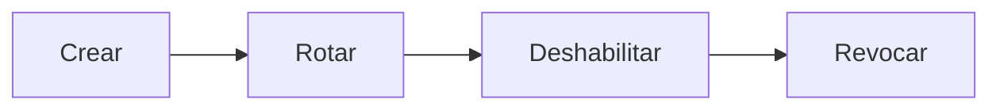

Google Cloud documenta rotar y borrar. OWASP REST dice revocar ante abuso. Nada de eso aparece por magia porque el string se llama API Key. Una key hardcodeada en una librería que no puedes actualizar no rota. Una key que nunca hasheas no se distingue de una fuga en el dump de tu propia base de datos.

Los access tokens opacos se acercan a las keys en este eje: el servidor posee la fila. JWT se acerca a un certificado: válido hasta caducar salvo que añadas una lista.

## ¿Cuándo basta una API Key?

«Basta» depende del riesgo y del modelo de autorización, no de la moda.

Una API Key puede encajar razonablemente cuando:

- operas una API pública para desarrolladores y necesitas identificar a quien llama, medirlos y frenar el abuso (el uso original de OWASP REST);
- necesitas identidad de consumidor, no identidad de usuario;
- rate limiting y cuotas son los controles principales;
- la integración es una aplicación hablando como ella misma;
- no hay identidad de usuario final que deba representarse en la petición.

No basta, por la propia advertencia de OWASP REST, como control exclusivo sobre recursos sensibles, críticos o de alto valor. No es un login de usuario. No es OAuth. Si el partner más adelante necesita acceso delegado de usuario, te quedaste corto de la key para ese camino; no demostraste que «las keys no funcionan».

## ¿Cuándo necesitas access tokens?

Necesitas algo que represente una autorización cuando:

- llama un usuario autenticado;
- necesitas scopes (o un grant equivalente);
- necesitas restricción de audience;
- necesitas una credencial que caduca;
- necesitas representar identidad en la petición;
- necesitas delegación (el trabajo real de OAuth);
- la API está protegida como un recurso OAuth.

Access token **no** significa JWT. RFC 6749 permite formatos distintos. El token puede ser:

```text
JWT
```

o:

```text
Opaque token
```

Un access token JWT puede validarse en local con las claves del issuer (RFC 9068 describe ese perfil). Un token opaco se valida consultándolo o haciendo introspection. La validación JWT local no habla con el authorization server en cada petición; tampoco ve una revocación hasta `exp` o una denylist. Elige el trade operativo, no el buzzword.

## ¿Cuándo JWT puede ser innecesario?

JWT no es un upgrade por defecto.

Puede que no lo necesites cuando:

- solo necesitas identificar a un consumidor;
- solo necesitas rate limiting y cuotas;
- no necesitas transportar claims;
- una credencial más simple ya nombra correctamente a quien llama;
- cada petición ya pega contra un almacén de sesiones, así que el discurso «stateless» es ficción.

No introduzcas complejidad criptográfica y operativa que el problema no pide. Firmar, rotar claves, comprobar `aud` y mantener allowlists de `alg` es trabajo real. Compensa cuando los claims tienen que viajar. Es ceremonia cuando la API habría sido correcta con una API Key hasheada y una fila.

El JWT cheat sheet de OWASP hace la misma pregunta antes de la tabla de algoritmos: plantéate si necesitas JWTs en absoluto.

## Un árbol de decisión, no una spec

Esto es una guía conceptual. No es un algoritmo normativo.

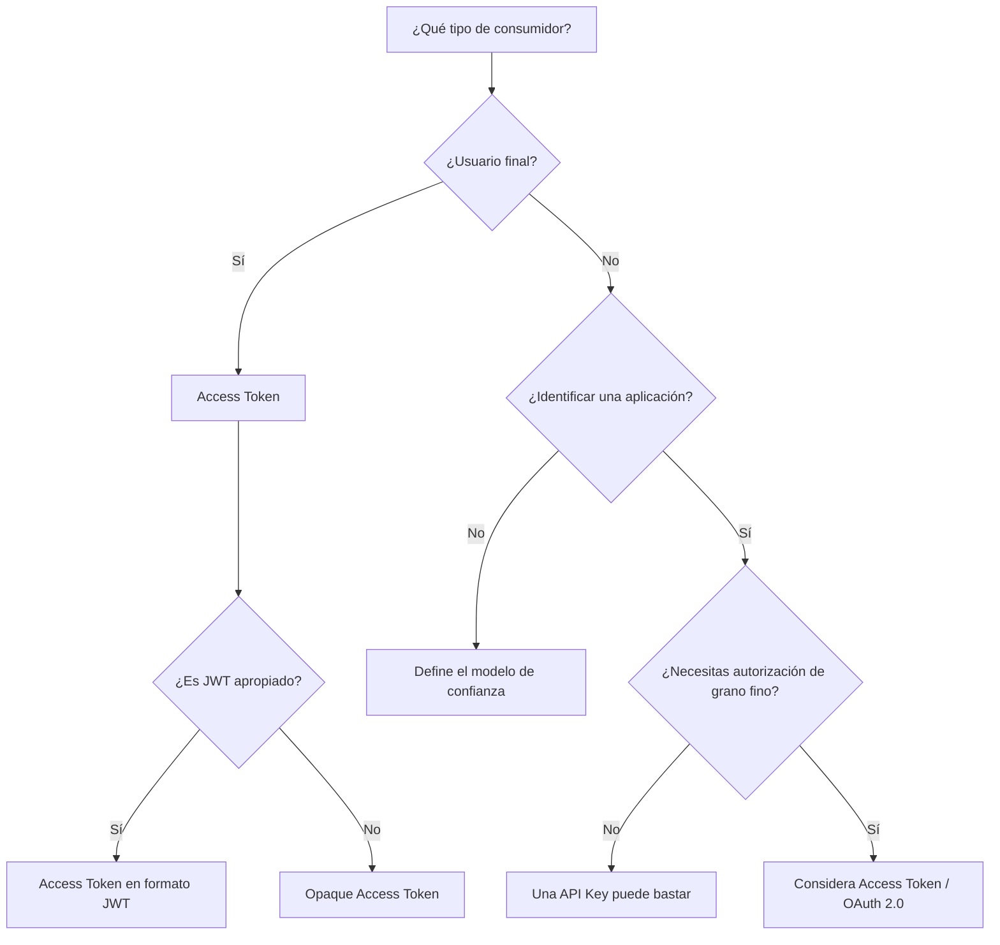

«Autorización de grano fino» aquí significa que la petición debe llevar o resolver un grant (scopes, usuario, audience), no que te caigan mal las API Keys. «¿Es JWT apropiado?» significa: ¿necesitas claims autocontenidos y validación local, y vas a operar claves y `exp` con honestidad? Si de todas formas vas a hacer introspection, opaco es más simple.

## Arquitectura híbrida

Consumidores distintos, mecanismos distintos, una API. Otra vez: el dibujo de un sistema posible, no un mandato.

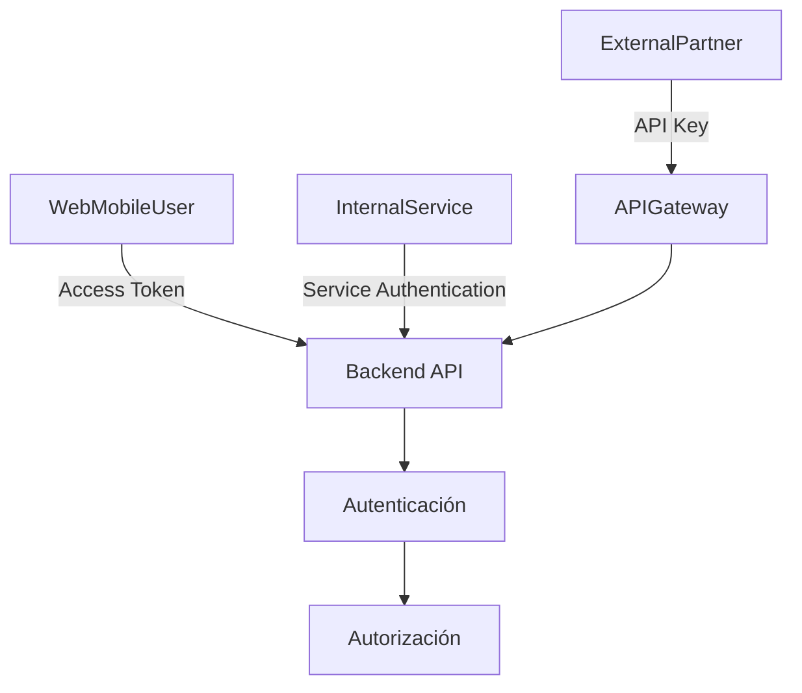

La autenticación sigue ocurriendo antes de la autorización. La credencial que llega puede diferir. La API sigue teniendo que nombrar al principal y después aplicar el grant. Mezclar keys y tokens no se salta ese orden.

## Un bosquejo NestJS, después de la arquitectura

NestJS puede implementar esto. No lo inventa. Los [Guards](https://docs.nestjs.com/guards) deciden si una ruta puede ejecutarse. [Authentication](https://docs.nestjs.com/security/authentication) muestra un guard JWT que verifica un bearer token y asigna el payload a la petición. [Authorization](https://docs.nestjs.com/security/authorization) es un guard posterior que lee ese principal. Mantén esos trabajos separados.

Dos formas HTTP, dos consumidores:

```http
GET /v1/products
X-API-Key: ...
```

```http
GET /v1/orders
Authorization: Bearer ...
```

Guards conceptuales, no un módulo completo:

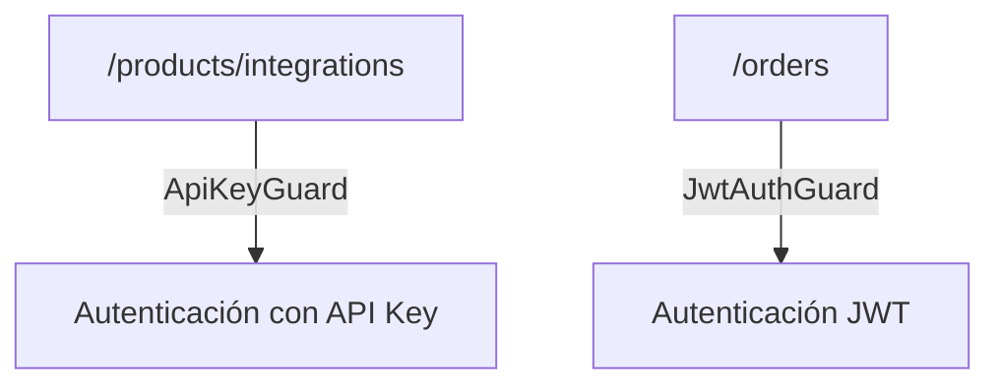

Lee la API Key de un header, no del query string. Compara contra un hash. Carga el consumidor. No loguees la key en crudo.

```ts
@Injectable()
export class ApiKeyGuard implements CanActivate {
  constructor(private readonly consumers: ConsumerService) {}

  async canActivate(context: ExecutionContext): Promise<boolean> {
    const request = context.switchToHttp().getRequest();
    const apiKey = request.headers["x-api-key"];
    if (typeof apiKey !== "string" || apiKey.length === 0) {
      throw new UnauthorizedException();
    }

    const consumer = await this.consumers.findByKeyHash(sha256(apiKey));
    if (!consumer || consumer.revokedAt) {
      throw new UnauthorizedException();
    }

    request.consumer = consumer;
    return true;
  }
}
```

El camino JWT verifica un bearer token con un secreto o JWKS de la configuración. `algorithms` es una allowlist. Issuer y audience son política de la aplicación, alineada con RFC 8725 cuando usas esos claims.

```ts
@Injectable()
export class JwtAuthGuard implements CanActivate {
  constructor(private readonly jwt: JwtService) {}

  async canActivate(context: ExecutionContext): Promise<boolean> {
    const request = context.switchToHttp().getRequest();
    const [scheme, token] = request.headers.authorization?.split(" ") ?? [];
    if (scheme !== "Bearer" || !token) {
      throw new UnauthorizedException();
    }

    try {
      request.user = await this.jwt.verifyAsync(token, {
        secret: process.env.JWT_ACCESS_SECRET,
        algorithms: ["RS256"],
        issuer: process.env.JWT_ISSUER,
        audience: process.env.JWT_AUDIENCE,
      });
    } catch {
      throw new UnauthorizedException();
    }

    return true;
  }
}
```

`JwtAuthGuard` autentica. Un `RolesGuard` o un guard de policies autoriza. No escondas comprobaciones de ACL dentro de la verificación de firma.

Una ruta que acepta cualquiera de las dos credenciales es posible — Caso A en un handler — si el handler puede unir `request.user` y `request.consumer` a un modelo de autorización común. Una ruta que exige ambas es el Caso C. No hagas glob de `APP_GUARD` con los dos y lo llames defensa en profundidad.

Los secretos salen del entorno, no del repo. Si logueas `Authorization` o `x-api-key`, has copiado la credencial al pipeline de logs. Hashea, redacta o descarta el header antes de que el logger lo vea.

Esto es un bosquejo. Passport JWT, un guard a medida o un gateway delante de Nest son detalles de implementación. La arquitectura es: elige el guard que encaja con el consumidor, y después autoriza.

## Errores habituales

- **«JWT es un sistema de autenticación».** RFC 7519 define un formato de claims. Login, sesión y logout son trabajo de aplicación o de protocolo (OAuth, OIDC, cookies). Un JWT verificado es un conjunto verificado de claims.
- **«JWT y OAuth son lo mismo».** OAuth emite access tokens (RFC 6749). JWT es un formato que esos tokens pueden usar (RFC 9068) o no (cadenas opacas, RFC 6750). Puedes usar uno sin el otro.
- **«JWT es siempre mejor que una API Key».** Mejor en qué. Claims y validación local son el trabajo de JWT. Medir consumidores es un trabajo habitual de API Key. La seguridad sigue el ciclo de vida, no el acrónimo.
- **«Las API Keys son inseguras por naturaleza».** Son secretos bearer. También lo es un JWT bearer (RFC 6750). OWASP advierte contra usar keys como autenticación de _usuario_ y contra usarlas como único control en recursos de alto valor. Eso no es «las keys no se pueden usar».
- **«Si el JWT está firmado, nadie puede leerlo».** Firmado no es cifrado. RFC 7519 separa JWS y JWE. El payload de un JWT firmado es legible.
- **«JWT siempre tiene que ser stateless».** El JWT cheat sheet de OWASP trata las sesiones de usuario totalmente stateless como un diseño a cuestionar. Logout y revocación necesitan estado, un TTL corto más refresh, o otro modelo de sesión.
- **«Una API Key no necesita rotación».** Google Cloud te dice que rotes. Un secreto bearer estático que nunca cambia es una ventana de fuga permanente.
- **«Deberíamos usar JWT y una API Key juntos para estar más seguros».** El Caso C es una decisión concreta de threat model. Dos comprobaciones rotas no son más fuertes que una correcta. Añade la segunda credencial cuando dos principales deban quedar unidos a la petición.
- **«Una API debe usar un solo mecanismo de autenticación».** El Caso A es normal en SaaS: usuarios y partners no son el mismo consumidor. La uniformidad es opcional. La responsabilidad clara por mecanismo no lo es.

## Una tabla práctica de decisión

No es un estándar. Es un empujón para la conversación de diseño.

| Necesidad                         |      API Key | Access Token / JWT |
| --------------------------------- | -----------: | -----------------: |
| Identificar una aplicación        |            ✓ |                  ✓ |
| Identificar un usuario            |            — |                  ✓ |
| Rate limiting                     |            ✓ |                  ✓ |
| Cuotas                            |            ✓ |                  ✓ |
| Claims                            |            — |              JWT ✓ |
| Scopes                            |            — |                  ✓ |
| Usuario final                     | En general no |                 ✓ |
| Integración externa               |            ✓ |                  ✓ |
| Service-to-service                |            ✓ |                  ✓ |
| OAuth 2.0                         |            — |                  ✓ |
| API pública para desarrolladores  |            ✓ |     Puede complementar |
| SaaS con usuarios y partners      |            ✓ |                  ✓ |

Ambas columnas pueden ser ciertas en la misma plataforma. Ese es el punto del Caso A. «En general no» para usuarios finales es OWASP API2, no un gusto.

## Ideas clave

- No tienes que elegir JWT _o_ API Keys. No son el mismo tipo de cosa, y pueden coexistir cuando los consumidores difieren.
- Una API Key identifica y mide a un cliente. Un access token representa una autorización. JWT es un formato que ese access token podría usar.
- Autenticación no es autorización. Mezclarlas produce keys de larga vida que pretenden ser sesiones y JWTs que pretenden ser identity providers.
- OAuth 2.0 no es JWT. Un access token no es necesariamente un JWT. RFC 6749, RFC 6750 y RFC 9068 son tres documentos distintos por una razón.
- Un JWT firmado es legible. La confidencialidad es JWE o, más a menudo, no meter secretos en claims.
- Mantén las credenciales fuera de las URLs. Un header es higiene necesaria, no un control completo.
- `exp` no es revocación. La rotación no es un comentario opcional sobre un secreto bearer.
- No apiles JWT y API Key en una petición por suerte. Sepáralos entre usuarios y partners cuando los trabajos son distintos.

> Primero diseña la identidad, la autorización y el modelo de confianza. Después elige el mecanismo que mejor representa cada tipo de consumidor.

Una arquitectura bien pensada puede usar API Keys, access tokens y JWT al mismo tiempo, siempre que cada mecanismo tenga un trabajo claro y una razón concreta de existir.

## Fuentes

- IETF, [RFC 7519 — JSON Web Token](https://www.rfc-editor.org/rfc/rfc7519) — formato compacto de claims; los claims registrados son OPTIONAL; firmado (JWS) frente a cifrado (JWE)
- IETF, [RFC 6749 — The OAuth 2.0 Authorization Framework](https://www.rfc-editor.org/rfc/rfc6749) — §1.4 access token como cadena de autorización, normalmente opaca, formato no fijo
- IETF, [RFC 6750 — OAuth 2.0 Bearer Token Usage](https://www.rfc-editor.org/rfc/rfc6750) — `Authorization: Bearer`; poseerlo basta; tokens en query string SHOULD NOT usarse
- IETF, [RFC 7662 — OAuth 2.0 Token Introspection](https://www.rfc-editor.org/rfc/rfc7662) — cómo un resource server valida un access token opaco
- IETF, [RFC 8725 — JSON Web Token Best Current Practices](https://www.rfc-editor.org/rfc/rfc8725) — allowlist de algoritmos, `iss`/`aud`, no confiar en claves del header, rechazar `none` salvo que sea explícito
- IETF, [RFC 9068 — JWT Profile for OAuth 2.0 Access Tokens](https://www.rfc-editor.org/rfc/rfc9068) — JWT como un formato de access token (`typ: at+jwt`), no una identidad con OAuth
- OWASP, [REST Security Cheat Sheet](https://cheatsheetseries.owasp.org/cheatsheets/REST_Security_Cheat_Sheet.html) — comprobaciones JWT de control de acceso; API Keys para medir; nada de secretos en URLs; las keys no bastan para recursos de alto valor
- OWASP, [JSON Web Token Cheat Sheet](https://cheatsheetseries.owasp.org/cheatsheets/JSON_Web_Token_Cheat_Sheet.html) — firmado frente a cifrado; sesiones stateless; matices de denylist con `jti`
- OWASP, [API2:2023 Broken Authentication](https://owasp.org/API-Security/editions/2023/en/0xa2-broken-authentication/) — OAuth no es autenticación; las API Keys no son autenticación de usuario
- OWASP, [Secrets Management Cheat Sheet](https://cheatsheetseries.owasp.org/cheatsheets/Secrets_Management_Cheat_Sheet.html) — API Keys como secretos: nada de plaintext en repos
- Google Cloud, [Best practices for managing API keys](https://docs.cloud.google.com/docs/authentication/api-keys-best-practices) — restricciones, sin query parameters, sin keys en el código, rotación, naturaleza bearer
- NestJS, [Guards](https://docs.nestjs.com/guards), [Authentication](https://docs.nestjs.com/security/authentication), [Authorization](https://docs.nestjs.com/security/authorization) — solo un bosquejo; los guards autentican, guards posteriores autorizan
