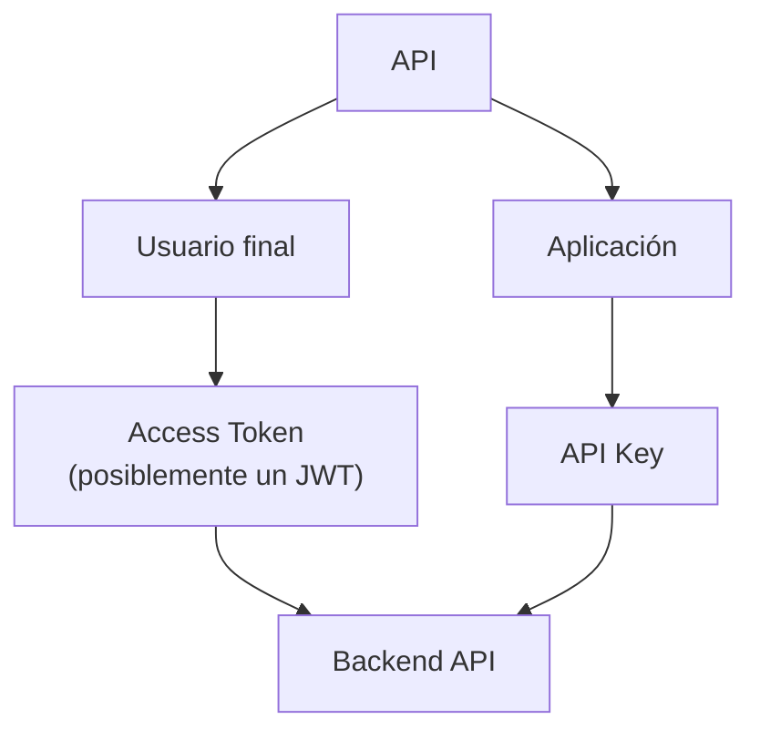
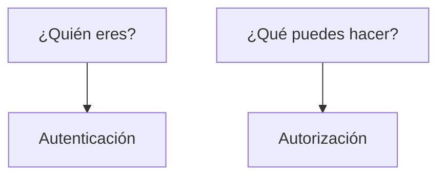
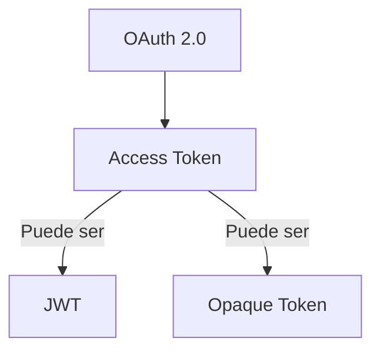
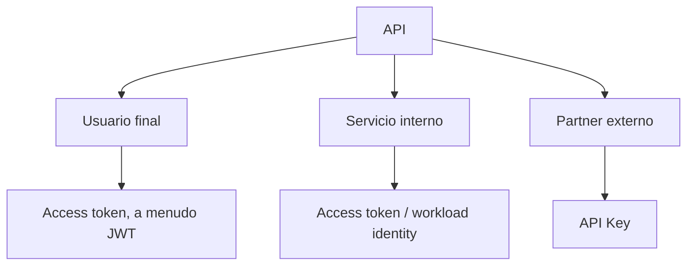
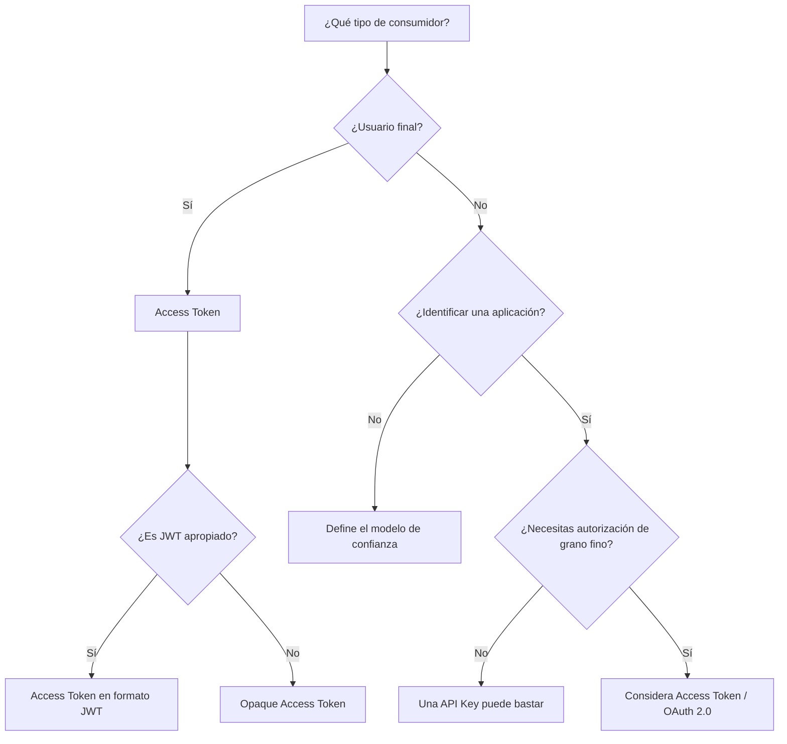

La reunión sobre el producto termina en una votación. Web y móvil llamarán a la API con un JWT. El partner de facturación llamará a la misma API con una API Key. Alguien pregunta cuál mecanismo es «el correcto». La sala lo trata como si hubiera que elegir uno.

No hay que elegir uno. La aplicación web tiene un usuario autenticado que debe estar autorizado a leer sus propias facturas. El partner no tiene un usuario en tu almacén de identidad. Es un consumidor que necesitas identificar, medir y limitar. Son trabajos distintos. Forzarlos a una sola credencial es cómo los equipos acaban publicando un JWT de 30 días que en realidad es una contraseña, o una API Key que en realidad es una sesión.

> «¿JWT o API Key?» es la pregunta equivocada. La útil es: qué tipo de cliente tienes, qué necesitas identificar, qué necesitas autorizar y cuál es tu modelo de confianza.

JWT y API Keys no son alternativas obligatorias. Pueden convivir en la misma arquitectura porque pueden resolver problemas distintos.



Ese diagrama es una decisión de arquitectura, no un estándar. [RFC 7519](https://www.rfc-editor.org/rfc/rfc7519) no te dice que pongas JWT en usuarios. [OWASP](https://cheatsheetseries.owasp.org/cheatsheets/REST_Security_Cheat_Sheet.html) no te dice que pongas API Keys en partners. La separación sale de los consumidores.

## La autenticación no es autorización

Los equipos comprimen «estar logueado» en un solo bloque y después discuten formatos de token. Los nombres parecen parientes. Los trabajos no lo son.



| Término       | Trabajo                                                                                    |
| ------------- | ------------------------------------------------------------------------------------------ |
| Identidad     | El sujeto del que hablas: un usuario, un servicio, una aplicación partner                  |
| Credencial    | El secreto o token que se presenta para probar algo sobre ese sujeto, o sobre un grant     |
| Autenticación | Establecer quién (o qué cliente) está hablando                                             |
| Autorización  | Decidir qué puede hacer ese sujeto en esta petición                                        |
| Access token  | Una credencial que representa una autorización emitida a un cliente                        |
| Claim         | Una aserción nombre/valor dentro de un JWT: quién lo emitió, de quién trata, cuándo caduca |

`user-123` y `partner-acme` son ambas identidades. No son el mismo tipo de principal. La credencial en la petición (contraseña, API Key, bearer token) es evidencia, no la identidad. [OWASP API2:2023](https://owasp.org/API-Security/editions/2023/en/0xa2-broken-authentication/) es explícito: OAuth no es autenticación, y las API Keys tampoco: OAuth emite una autorización; una API Key identifica un cliente. La autorización es una pregunta posterior — scopes, roles, propiedad — y puede fallar con HTTP 403 después de un 401 correcto.

Un **access token** es [RFC 6749 §1.4](https://www.rfc-editor.org/rfc/rfc6749#section-1.4): «una cadena que representa una autorización emitida al cliente». Suele ser opaca para el cliente. Puede ser una clave de consulta, o puede autocontener el grant como JWT. El RFC no exige un JWT. Un **claim** es [RFC 7519](https://www.rfc-editor.org/rfc/rfc7519): una aserción sobre un sujeto. `sub`, `aud`, `scope` son claims en un JWT. No son una propiedad de las API Keys.

Si tratas autenticación como autorización, emites un token que solo significa «esta petición llegó». Si tratas autorización como autenticación, metes permisos en un secreto de larga vida. Ambos aparecen como «elegimos JWT» o «elegimos API Keys» cuando los trabajos nunca se nombraron.

## Qué es realmente un JWT

[RFC 7519](https://www.rfc-editor.org/rfc/rfc7519) define JSON Web Token: un medio compacto y seguro para URL de representar claims que se transfieren entre dos partes. JWT es un formato de token. No es un sistema de autenticación. No define login, logout, sesiones ni revocación. Un JWT que se valida correctamente sigue siendo válido hasta que se rechaza.

La forma compacta habitual de un JWT firmado son tres segmentos base64url: `header.payload.signature`.

**Header** (JOSE header) nombra el algoritmo (`alg`) y, a menudo, un tipo (`typ`). [RFC 8725](https://www.rfc-editor.org/rfc/rfc8725) exige que el verificador decida qué algoritmos son aceptables. No dejes que el token elija `alg` por ti. El algoritmo `none` existe en la especificación como JWT no asegurado. El [REST Security Cheat Sheet](https://cheatsheetseries.owasp.org/cheatsheets/REST_Security_Cheat_Sheet.html) de OWASP dice que no lo aceptes para control de acceso.

**Payload** es el conjunto de claims. **Signature** (JWS) protege el header y el payload. Proporciona protección de integridad y permite verificar que el token fue firmado con la clave correspondiente. No cifra el payload. Cualquiera que tenga el token puede leer los claims. Firmado (JWS) no significa cifrado (JWE). Base64url es una codificación, no un cifrado. La mayoría de los access tokens que encontrarás en una API de NestJS están firmados, no cifrados. TLS protege los datos en tránsito. El payload del JWT sigue siendo legible para cualquiera que posea el token.

Los claims registrados en RFC 7519 §4.1 son opcionales. Las aplicaciones definen cuáles exigen. Para una API, los que importan son:

| Claim | Por qué le importan a una API                                                                                        |
| ----- | -------------------------------------------------------------------------------------------------------------------- |
| `iss` | Quién lo emitió. Vincula las claves de verificación a ese issuer (RFC 8725 §3.8).                                    |
| `sub` | De qué principal trata el grant.                                                                                     |
| `aud` | Qué API puede aceptarlo. Un token de facturación no es un token de admin (RFC 8725 §3.9).                            |
| `exp` | Cuándo la credencial deja de ser aceptable. OWASP REST también quiere que se compruebe `nbf` para control de acceso. |

`jti` puede identificar un token para proteger contra replay o para una denylist; el RFC no implementa ninguna de las dos. `scope` no es un claim registrado de RFC 7519. Si pones `"scope": "orders:read"` en un JWT, esa es una decisión de aplicación o de perfil — [RFC 9068](https://www.rfc-editor.org/rfc/rfc9068) es uno de esos perfiles para access tokens de OAuth.

```json
{
  "sub": "user-123",
  "iss": "https://auth.example.com",
  "aud": "orders-api",
  "exp": 1780000000,
  "scope": "orders:read"
}
```

La validación, a grandes rasgos: parsear la forma compacta, confirmar que `alg` está en tu allowlist, verificar la firma con claves en las que ya confías, y aplicar `iss`, `aud`, `exp` y lo demás que hayas definido. RFC 8725 añade: no sigas URLs `jku`/`x5u` del header, y rechaza `alg: none` salvo que hayas pedido explícitamente un JWT no asegurado.

## Qué es realmente una API Key

Una API Key es una credencial emitida a un cliente — normalmente una aplicación, un partner o una cuenta de desarrollador — y presentada en las peticiones para que el servidor identifique a ese consumidor. No hay un documento IETF titulado «API Keys» que defina claims, scopes o expiración como RFC 7519 define JWT.

[OWASP REST](https://cheatsheetseries.owasp.org/cheatsheets/REST_Security_Cheat_Sheet.html) trata las API Keys como una forma de reducir el abuso de servicios REST públicos, de medir planes de pago y de suavizar un poco la denegación de servicio. Te dice que exijas la key en los endpoints protegidos, que devuelvas `429 Too Many Requests` cuando el cliente va demasiado rápido, que revoques la key si el cliente viola el acuerdo de uso, y **que no te apoyes exclusivamente en API Keys para proteger recursos sensibles, críticos o de alto valor.**

Las [mejores prácticas de API Keys de Google Cloud](https://docs.cloud.google.com/docs/authentication/api-keys-best-practices) tratan las keys como credenciales bearer: quien tiene la cadena puede usarla. Restringe cada key. No la pongas en query parameters. No la subas a un repositorio. Rótala. Borra las keys que no uses.

Trabajos típicos: identificar una aplicación o un partner; controlar el acceso a groso modo; rate limit; aplicar cuotas; atribuir uso para facturación. Una API Key **no** lleva de por sí identidad de usuario final, claims, scopes, expiración ni autorización de grano fino. Puedes colgar eso de una fila en base de datos (`expiresAt`, un plan, rutas permitidas). Son propiedades de tu sistema, no de «API Key» como concepto.

[OWASP API2:2023](https://owasp.org/API-Security/editions/2023/en/0xa2-broken-authentication/) dice que las API Keys no deberían usarse para autenticación de usuario. Deberían usarse para autenticación del cliente de la API.

## La comparación no es simétrica

JWT y API Keys no son dos tecnologías equivalentes entre las que siempre hay que elegir. Uno es una forma de codificar claims. El otro es un secreto que emites a un consumidor.

OAuth 2.0 vive en otro eje.



**OAuth 2.0 ≠ JWT.** [RFC 6749](https://www.rfc-editor.org/rfc/rfc6749) es un framework de autorización. Emite access tokens. [RFC 6750](https://www.rfc-editor.org/rfc/rfc6750) describe cómo enviar un access token **bearer** en HTTP — normalmente `Authorization: Bearer ...`. Bearer significa que poseerlo basta. Los RFC no exigen que esa cadena sea un JWT.

**JWT ≠ OAuth 2.0.** RFC 7519 es un formato de claims. Puedes firmar un JWT en NestJS con `@nestjs/jwt` y no hablar nunca de OAuth. Puedes correr OAuth con tokens opacos e [introspection](https://www.rfc-editor.org/rfc/rfc7662) y no emitir nunca un JWT. [RFC 9068](https://www.rfc-editor.org/rfc/rfc9068) es un perfil para cuando un access token de OAuth _es_ un JWT (`typ` debería ser `at+jwt`). Un perfil no es identidad entre las dos specs.

Un ID Token en OpenID Connect es un JWT usado para representar al usuario ante un cliente. Eso sigue sin ser «JWT = login», y no es una API Key.

| Característica       | JWT                                                     | API Key                                            |
| -------------------- | ------------------------------------------------------- | -------------------------------------------------- |
| Naturaleza           | Formato de token                                        | Credencial                                         |
| Claims               | Sí                                                      | No inherentes                                      |
| Expiración           | Puede representarse con `exp`                           | Depende de la implementación                       |
| Identidad de usuario | Puede representarse (`sub` y otros claims relacionados) | No necesariamente                                  |
| Scopes               | Puede representarlos                                    | No inherentes                                      |
| Rate limiting        | Puede ayudar a identificar un sujeto                    | Uso habitual                                       |
| Revocación           | Necesita una estrategia                                 | Puede ser más directa si el servidor guarda la key |
| Usuario final        | Sí, según el flujo                                      | En general no es su trabajo principal              |
| OAuth 2.0            | Puede usarse como access token                          | No es OAuth 2.0                                    |

«Puede» no es «lo hace». Un JWT sin `exp` no caduca por magia del formato. Una API Key en un sistema que nunca borra filas no es «fácil de revocar». Un JWT que solo se comprueba en local es válido hasta `exp`. Matarlo antes implica una denylist, un TTL corto más refresh, o rotar claves. Una API Key que es una fila puede deshabilitarse en la siguiente petición. Los access tokens opacos tienen la misma palanca.

## ¿Qué tipo de consumidor tienes?

Clasifica a quien llama antes de clasificar el token.



Esas etiquetas son ejemplos. Una API orientada a usuario puede usar una cookie de sesión en el servidor y no emitir nunca un JWT. Un partner puede usar OAuth. Un servicio interno puede usar mTLS y saltarse los bearer tokens por completo.

**Usuario final.** Necesitas identidad y autorización: `sub`, qué puede hacer, y una vida útil lo bastante corta para que el robo tenga un límite. Un access token encaja. Que ese token sea JWT u opaco es una decisión de formato. Una API Key que un humano pega en una SPA es un secreto bearer de larga vida sin `exp` salvo que lo inventes. No uses API Keys para autenticación de usuario.

**Servicio interno.** Necesitas saber qué workload está llamando, y a menudo que tiene permiso para llamar a esta audience. Opciones: OAuth 2.0 Client Credentials, workload identity, service accounts, mTLS, un token de servicio. Los secretos estáticos dentro de un mesh son un problema de rotación y de fugas. Elige desde el modelo de confianza que ya operas. No añadas JWT porque la API pública usa JWT.

**Integración externa.** Un partner, un conector al estilo Zapier, el backend de un cliente. Puede que solo necesites identificar la aplicación, medirla y cortarla. Una API Key encaja a menudo. Si el partner debe actuar como uno de sus usuarios, o necesitas acceso delegado, OAuth es el framework construido para eso. «Partner» no es sinónimo de «API Key».

## Arquitectura híbrida

Sí, puedes usar JWT y API Keys juntos. Las combinaciones no son igual de buenas, ni igual de baratas.

**Consumidores distintos (SaaS típico).** Los usuarios presentan un access token — posiblemente un JWT. Los partners presentan una API Key. La misma API HTTP acepta ambos. Cada mecanismo tiene un trabajo distinto: autorización de usuario frente a identificación y medición del consumidor. Nada en RFC 7519 ni RFC 6750 lo prohíbe. Nada lo exige tampoco.

Una plataforma B2B con app web, app móvil, integraciones externas y workers internos no necesita el mismo mecanismo para cada caller:

- **Web y móvil** inician sesión de un usuario. Necesitan un subject, scopes o equivalente, una audience y una vida útil. JWT es un formato razonable si la API va a validar en local; opaco es razonable si ya haces introspection. No estires `exp` a treinta días para evitar un diseño de sesión.
- **Partner externo** sincroniza datos de catálogo por la noche. No hay usuario final en la llamada. Una API Key (restringida, rotada, guardada hasheada, nunca en una URL) encaja con ese trabajo. Si más adelante deben actuar en nombre de uno de sus usuarios, eso es un grant nuevo. Añade OAuth entonces.
- **Servicio interno** emite facturas desde un worker. Workload identity del cloud o Client Credentials vinculan el workload a una audience. Una API Key de larga vida en el env del worker funciona hasta que alguien copia el env. Un JWT que el worker se emite a sí mismo con un secreto HS256 compartido es un secreto estático con pasos extra.

**API Gateway, después la API.** El gateway usa una key para saber _qué aplicación_ está llamando y aplicar un plan. El backend usa un access token para autorizar _qué puede hacer esta petición_. Hazlo cuando el trabajo del gateway (medir desarrolladores de terceros, proteger el origin, facturar) sea real. No lo hagas porque un diagrama tenía dos cajas.

**Ambos en la misma petición.** Es técnicamente posible: un token de usuario robado no sirve sin la key del partner, o una key filtrada no puede llamar rutas con alcance de usuario sin un token de usuario. También sube la complejidad y la probabilidad de que una de las dos comprobaciones se aplique mal. No añadas dos credenciales porque «más autenticación es más seguridad». [OWASP](https://owasp.org/API-Security/editions/2023/en/0xa2-broken-authentication/) quiere que entiendas los mecanismos que ya tienes. Tiene que haber una amenaza concreta — dos fronteras de confianza que ambas tienen que hablar en esta llamada — antes de que la segunda credencial merezca su coste.

La autenticación sigue ocurriendo antes de la autorización. Mezclar keys y tokens no se salta ese orden.

## La seguridad es un ciclo de vida, no un formato

JWT no es automáticamente más seguro. Las API Keys no son automáticamente inseguras. La seguridad es emisión, almacenamiento, transmisión, validación, rotación y revocación.

Trata una API Key como una contraseña. El cheat sheet de [Secrets Management](https://cheatsheetseries.owasp.org/cheatsheets/Secrets_Management_Cheat_Sheet.html) de OWASP existe porque los equipos siguen hardcodeándolas. [OWASP REST](https://cheatsheetseries.owasp.org/cheatsheets/REST_Security_Cheat_Sheet.html) y Google Cloud coinciden: la key no debe aparecer en la URL — usa un header (`x-goog-api-key` o equivalente). [RFC 6750 §2.3](https://www.rfc-editor.org/rfc/rfc6750#section-2.3) dice lo mismo para access tokens. Un header es higiene, no una transformación: `X-API-Key: secret` sobre HTTP en un gist sigue siendo una credencial bearer filtrada. Restringe la key. Rota emitiendo una nueva, moviendo a los clientes y borrando la antigua. Deshabilita la fila para revocar.

Para JWT, RFC 8725 es el BCP: allowlist de `alg`, vincula claves a `iss`, exige y comprueba `aud` cuando un issuer sirve a varias APIs, no descargues claves desde `jku`/`x5u`. Un JWT bearer en `localStorage` está al alcance de XSS; un JWT en una URL está al alcance de los logs. Un TTL corto limita la ventana de robo; no es un interruptor de apagado. La frase que hay que matar en code review: «Está firmado, así que nadie puede leerlo». Firmado no es cifrado. El [JWT cheat sheet](https://cheatsheetseries.owasp.org/cheatsheets/JSON_Web_Token_Cheat_Sheet.html) de OWASP es directo: si necesitas logout, necesitas una denylist o una sesión. Stateless es una conveniencia de despliegue, no una propiedad de seguridad.

## Expiración no es revocación

Un JWT puede contener `exp`. Si el verificador lo comprueba, el token muere en ese instante. Hasta entonces, un JWT validado en local sigue siendo aceptable aunque el usuario haya cerrado sesión, haya cambiado la contraseña o un admin haya deshabilitado la cuenta — salvo que añadas otra comprobación.

Los access tokens de vida corta encogen esa ventana. No te dan revocación inmediata. La revocación inmediata necesita estado: una denylist indexada por `jti`, introspection de un token opaco, una fila de sesión, o una lista de estado de tokens. RFC 7519 dice que `jti` _puede_ usarse para prevenir replay. No implementa una denylist por ti.

Si necesitas sesiones, diseña sesiones. No comentes `// JWT is stateless` en un producto que tiene un botón de Logout. El artículo de refresh tokens es la arquitectura de ese botón.

El ciclo de vida de una API Key es lo que hayas construido. Google Cloud documenta rotar y borrar. OWASP REST dice revocar ante abuso. Una key hardcodeada en una librería que no puedes actualizar no rota. Los access tokens opacos se acercan a las keys en este eje: el servidor posee la fila. JWT se acerca a un certificado: válido hasta caducar salvo que añadas una lista.

## ¿Cuándo basta una API Key?

Una API Key puede encajar razonablemente cuando:

- operas una API pública para desarrolladores y necesitas identificar a quien llama, medirlos y frenar el abuso (el uso original de OWASP REST);
- necesitas identidad de consumidor, no identidad de usuario;
- rate limiting y cuotas son los controles principales;
- la integración es una aplicación hablando como ella misma;
- no hay identidad de usuario final que deba representarse en la petición.

No basta, por la propia advertencia de OWASP REST, como control exclusivo sobre recursos sensibles, críticos o de alto valor. No es un login de usuario. No es OAuth. Si el partner más adelante necesita acceso delegado de usuario, te quedaste corto de la key para ese camino; no demostraste que «las keys no funcionan».

## ¿Cuándo necesitas access tokens?

Necesitas algo que represente una autorización cuando llama un usuario autenticado; cuando necesitas scopes, restricción de audience, una credencial que caduca, identidad en la petición o delegación (el trabajo real de OAuth); o cuando la API está protegida como un recurso OAuth.

Access token **no** significa JWT. RFC 6749 permite formatos distintos. Un access token JWT puede validarse en local con las claves del issuer (RFC 9068 describe ese perfil). Un token opaco se valida consultándolo o haciendo introspection. La validación JWT local no habla con el authorization server en cada petición; tampoco ve una revocación hasta `exp` o una denylist. Elige el trade operativo, no el buzzword.

## ¿Cuándo JWT puede ser innecesario?

JWT no es un upgrade por defecto. Puede que no lo necesites cuando solo necesitas identificar a un consumidor, solo necesitas rate limiting y cuotas, no necesitas transportar claims, una credencial más simple ya nombra correctamente a quien llama, o cada petición ya pega contra un almacén de sesiones y el discurso «stateless» es ficción.

Firmar, rotar claves, comprobar `aud` y mantener allowlists de `alg` es trabajo real. Compensa cuando los claims tienen que viajar. Es ceremonia cuando la API habría sido correcta con una API Key hasheada y una fila. El JWT cheat sheet de OWASP hace la misma pregunta antes de la tabla de algoritmos: plantéate si necesitas JWTs en absoluto.

## Un árbol de decisión, no una spec

Esto es una guía conceptual. No es un algoritmo normativo.



«Autorización de grano fino» aquí significa que la petición debe llevar o resolver un grant (scopes, usuario, audience), no que te caigan mal las API Keys. «¿Es JWT apropiado?» significa: ¿necesitas claims autocontenidos y validación local, y vas a operar keys y `exp` con honestidad? Si de todas formas vas a hacer introspection, opaco es más simple.

## Un bosquejo NestJS, después de la arquitectura

NestJS puede implementar esto. No lo inventa. Los [Guards](https://docs.nestjs.com/guards) deciden si una ruta puede ejecutarse. [Authentication](https://docs.nestjs.com/security/authentication) muestra un guard JWT que verifica un bearer token y asigna el payload a la petición. [Authorization](https://docs.nestjs.com/security/authorization) es un guard posterior que lee ese principal. Mantén esos trabajos separados.

```http
GET /v1/products
X-API-Key: ...
```

```http
GET /v1/orders
Authorization: Bearer ...
```

```ts
@Injectable()
export class ApiKeyGuard implements CanActivate {
  constructor(private readonly consumers: ConsumerService) {}

  async canActivate(context: ExecutionContext): Promise<boolean> {
    const request = context.switchToHttp().getRequest();
    const apiKey = request.headers["x-api-key"];
    if (typeof apiKey !== "string" || apiKey.length === 0) {
      throw new UnauthorizedException();
    }

    const consumer = await this.consumers.findByKeyHash(sha256(apiKey));
    if (!consumer || consumer.revokedAt) {
      throw new UnauthorizedException();
    }

    request.consumer = consumer;
    return true;
  }
}
```

```ts
@Injectable()
export class JwtAuthGuard implements CanActivate {
  constructor(private readonly jwt: JwtService) {}

  async canActivate(context: ExecutionContext): Promise<boolean> {
    const request = context.switchToHttp().getRequest();
    const [scheme, token] = request.headers.authorization?.split(" ") ?? [];
    if (scheme !== "Bearer" || !token) {
      throw new UnauthorizedException();
    }

    try {
      request.user = await this.jwt.verifyAsync(token, {
        secret: process.env.JWT_ACCESS_SECRET,
        algorithms: ["RS256"],
        issuer: process.env.JWT_ISSUER,
        audience: process.env.JWT_AUDIENCE,
      });
    } catch {
      throw new UnauthorizedException();
    }

    return true;
  }
}
```

Lee la API Key de un header, no del query string. Compara contra un hash. No loguees la key en crudo. `algorithms` es una allowlist. Issuer y audience son política de la aplicación, alineada con RFC 8725 cuando usas esos claims.

`JwtAuthGuard` autentica. Un `RolesGuard` o un guard de policies autoriza. No escondas comprobaciones de ACL dentro de la verificación de firma. Una ruta que acepta cualquiera de las dos credenciales es posible si el handler puede unir `request.user` y `request.consumer` a un modelo de autorización común. Una ruta que exige ambas es el caso de «dos credenciales» de arriba. No hagas glob de `APP_GUARD` con los dos y lo llames defensa en profundidad.

Los secretos salen del entorno, no del repo. Esto es un bosquejo. La arquitectura es: elige el guard que encaja con el consumidor, y después autoriza.

## Errores habituales

- **«JWT es un sistema de autenticación».** RFC 7519 define un formato de claims. Login, sesión y logout son trabajo de aplicación o de protocolo (OAuth, OIDC, cookies).
- **«JWT y OAuth son lo mismo».** OAuth emite access tokens (RFC 6749). JWT es un formato que esos tokens pueden usar (RFC 9068) o no (cadenas opacas, RFC 6750).
- **«JWT es siempre mejor que una API Key».** Claims y validación local son el trabajo de JWT. Medir consumidores es un trabajo habitual de API Key. La seguridad sigue el ciclo de vida, no el acrónimo.
- **«Las API Keys son inseguras por naturaleza».** Son secretos bearer. También lo es un JWT bearer (RFC 6750). OWASP advierte contra usar keys como autenticación de _usuario_ y como único control en recursos de alto valor.
- **«Si el JWT está firmado, nadie puede leerlo».** Firmado no es cifrado. RFC 7519 separa JWS y JWE.
- **«JWT siempre tiene que ser stateless».** El JWT cheat sheet de OWASP trata las sesiones de usuario totalmente stateless como un diseño a cuestionar. Logout y revocación necesitan estado, un TTL corto más refresh, o otro modelo de sesión.
- **«Una API Key no necesita rotación».** Google Cloud te dice que rotes. Un secreto bearer estático que nunca cambia es una ventana de fuga permanente.
- **«Deberíamos usar JWT y una API Key juntos para estar más seguros».** Dos comprobaciones rotas no son más fuertes que una correcta. Añade la segunda credencial cuando dos principales deban quedar unidos a la petición.
- **«Una API debe usar un solo mecanismo de autenticación».** Usuarios y partners no son el mismo consumidor. La uniformidad es opcional. La responsabilidad clara por mecanismo no lo es.

## Una tabla práctica de decisión

No es un estándar. Es un empujón para la conversación de diseño.

| Necesidad                        |       API Key | Access Token / JWT |
| -------------------------------- | ------------: | -----------------: |
| Identificar una aplicación       |             ✓ |                  ✓ |
| Identificar un usuario           |             — |                  ✓ |
| Rate limiting                    |             ✓ |                  ✓ |
| Cuotas                           |             ✓ |                  ✓ |
| Claims                           |             — |              JWT ✓ |
| Scopes                           |             — |                  ✓ |
| Usuario final                    | En general no |                  ✓ |
| Integración externa              |             ✓ |                  ✓ |
| Service-to-service               |             ✓ |                  ✓ |
| OAuth 2.0                        |             — |                  ✓ |
| API pública para desarrolladores |             ✓ | Puede complementar |
| SaaS con usuarios y partners     |             ✓ |                  ✓ |

Ambas columnas pueden ser ciertas en la misma plataforma. «En general no» para usuarios finales es OWASP API2, no un gusto.

## Fuentes

- IETF, [RFC 7519 — JSON Web Token](https://www.rfc-editor.org/rfc/rfc7519) — formato compacto de claims; los claims registrados son OPTIONAL; firmado (JWS) frente a cifrado (JWE)
- IETF, [RFC 6749 — The OAuth 2.0 Authorization Framework](https://www.rfc-editor.org/rfc/rfc6749) — §1.4 access token como cadena de autorización, normalmente opaca, formato no fijo
- IETF, [RFC 6750 — OAuth 2.0 Bearer Token Usage](https://www.rfc-editor.org/rfc/rfc6750) — `Authorization: Bearer`; poseerlo basta; tokens en query string SHOULD NOT usarse
- IETF, [RFC 7662 — OAuth 2.0 Token Introspection](https://www.rfc-editor.org/rfc/rfc7662) — cómo un resource server valida un access token opaco
- IETF, [RFC 8725 — JSON Web Token Best Current Practices](https://www.rfc-editor.org/rfc/rfc8725) — allowlist de algoritmos, `iss`/`aud`, no confiar en claves del header, rechazar `none` salvo que sea explícito
- IETF, [RFC 9068 — JWT Profile for OAuth 2.0 Access Tokens](https://www.rfc-editor.org/rfc/rfc9068) — JWT como un formato de access token (`typ: at+jwt`), no una identidad con OAuth
- OWASP, [REST Security Cheat Sheet](https://cheatsheetseries.owasp.org/cheatsheets/REST_Security_Cheat_Sheet.html) — comprobaciones JWT de control de acceso; API Keys para medir; nada de secretos en URLs; las keys no bastan para recursos de alto valor
- OWASP, [JSON Web Token Cheat Sheet](https://cheatsheetseries.owasp.org/cheatsheets/JSON_Web_Token_Cheat_Sheet.html) — firmado frente a cifrado; sesiones stateless; matices de denylist con `jti`
- OWASP, [API2:2023 Broken Authentication](https://owasp.org/API-Security/editions/2023/en/0xa2-broken-authentication/) — OAuth no es autenticación; las API Keys no son autenticación de usuario
- OWASP, [Secrets Management Cheat Sheet](https://cheatsheetseries.owasp.org/cheatsheets/Secrets_Management_Cheat_Sheet.html) — API Keys como secretos: nada de plaintext en repos
- Google Cloud, [Best practices for managing API keys](https://docs.cloud.google.com/docs/authentication/api-keys-best-practices) — restricciones, sin query parameters, sin keys en el código, rotación, naturaleza bearer
- NestJS, [Guards](https://docs.nestjs.com/guards), [Authentication](https://docs.nestjs.com/security/authentication), [Authorization](https://docs.nestjs.com/security/authorization) — solo un bosquejo; los guards autentican, guards posteriores autorizan
