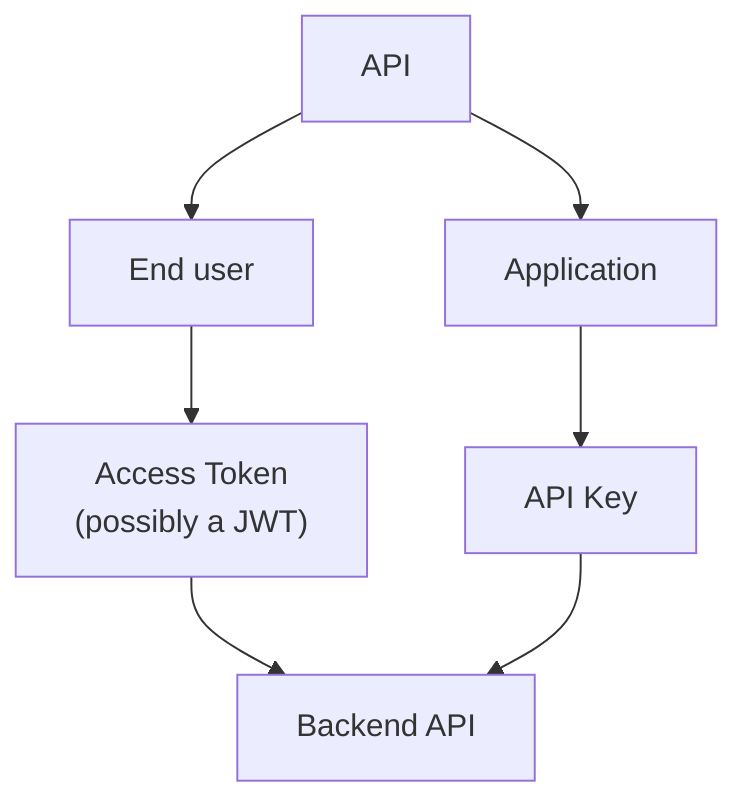
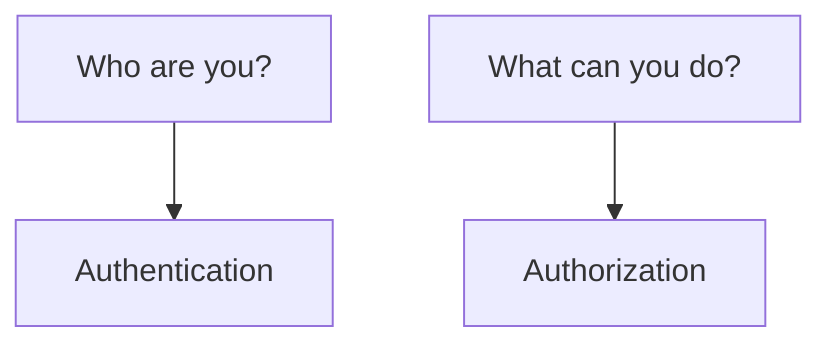
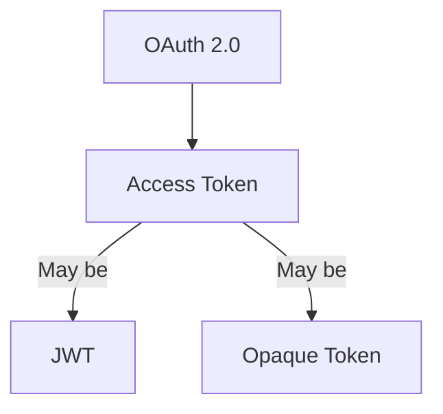
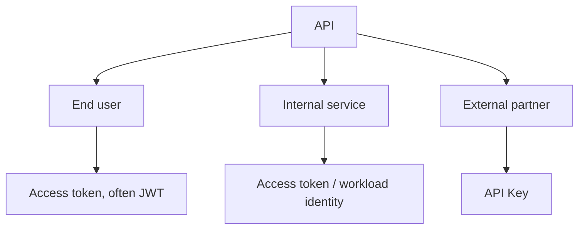
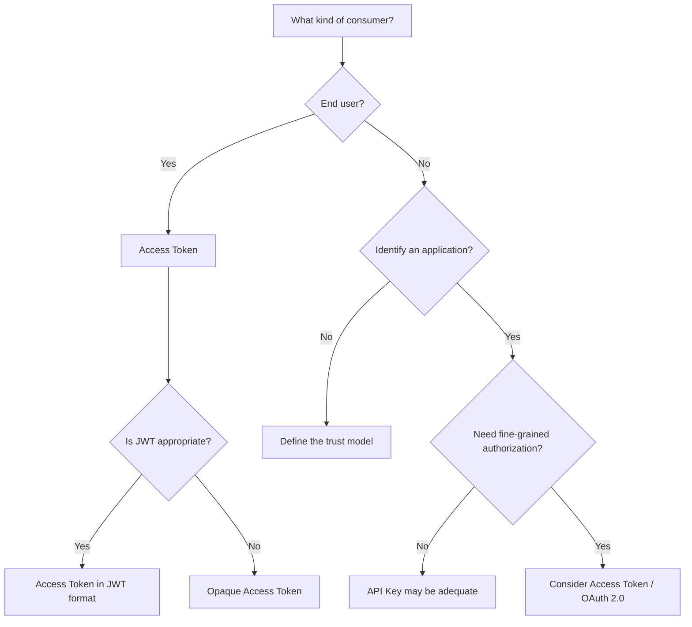

The product meeting ends on a vote. Web and mobile will call the API with a JWT. The billing partner will call the same API with an API key. Someone asks which mechanism is "the right one." The room treats that as a fork.

It is not a fork. The web app has a signed-in user who must be authorized to read their own invoices. The partner has no user in your identity store. It is a consumer you need to identify, meter, and throttle. Those are different jobs. Forcing them onto one credential is how teams ship a 30-day JWT that is really a password, or an API key that is really a session.

> "JWT or API Key?" is the wrong question. The useful one is: what kind of client do you have, what do you need to identify, what do you need to authorize, and what is your trust model?

JWT and API keys are not mandatory alternatives. They can sit in the same architecture because they can solve different problems.



That diagram is an architecture choice, not a standard. [RFC 7519](https://www.rfc-editor.org/rfc/rfc7519) does not tell you to put JWT on users. [OWASP](https://cheatsheetseries.owasp.org/cheatsheets/REST_Security_Cheat_Sheet.html) does not tell you to put API keys on partners. The split follows from the consumers.

## Authentication is not authorization

Teams collapse "logged in" into one blob and then argue about token formats. The names look related. The jobs are not.



| Term           | Job                                                                                   |
| -------------- | ------------------------------------------------------------------------------------- |
| Identity       | The subject you are talking about: a user, a service, a partner application           |
| Credential     | The secret or token presented to prove something about that subject, or about a grant |
| Authentication | Establishing who (or which client) is speaking                                        |
| Authorization  | Deciding what that subject is allowed to do on this request                           |
| Access token   | A credential that represents an authorization issued to a client                      |
| Claim          | A name/value assertion inside a JWT: who issued it, who it is about, when it expires  |

`user-123` and `partner-acme` are both identities. They are not the same kind of principal. The credential on the wire (password, API key, bearer token) is evidence, not the identity. [OWASP API2:2023](https://owasp.org/API-Security/editions/2023/en/0xa2-broken-authentication/) is explicit that OAuth is not authentication, and neither are API keys: OAuth issues an authorization; an API key identifies a client. Authorization is a later question — scopes, roles, ownership — and can fail with HTTP 403 after a successful 401 path.

An **access token** is [RFC 6749 §1.4](https://www.rfc-editor.org/rfc/rfc6749#section-1.4): "a string representing an authorization issued to the client." It is usually opaque to the client. It may be a lookup key, or it may self-contain the grant as a JWT. The RFC does not require a JWT. A **claim** is [RFC 7519](https://www.rfc-editor.org/rfc/rfc7519): an assertion about a subject. `sub`, `aud`, `scope` are claims in a JWT. They are not a property of API keys.

If you treat authentication as authorization, you issue a token that only means "this request arrived." If you treat authorization as authentication, you stuff permissions into a long-lived secret. Both show up as "we picked JWT" or "we picked API keys" when the jobs were never named.

## What a JWT actually is

[RFC 7519](https://www.rfc-editor.org/rfc/rfc7519) defines JSON Web Token: a compact, URL-safe means of representing claims to be transferred between two parties. JWT is a token format. It is not an authentication system. It does not define login, logout, sessions, or revocation. A JWT that validates successfully remains valid until it is rejected.

The common compact form of a signed JWT is three base64url segments: `header.payload.signature`.

**Header** (JOSE header) names the algorithm (`alg`) and, often, a type (`typ`). [RFC 8725](https://www.rfc-editor.org/rfc/rfc8725) requires the verifier to decide which algorithms are acceptable. Do not let the token pick `alg` for you. The `none` algorithm exists in the spec as an unsecured JWT. OWASP's [REST Security Cheat Sheet](https://cheatsheetseries.owasp.org/cheatsheets/REST_Security_Cheat_Sheet.html) says not to accept it for access control.

**Payload** is the claims set. **Signature** (for JWS) protects the header and payload. It provides integrity protection and proof that the token was signed by the holder of the signing key. It does not encrypt the payload. Anyone who has the token can read the claims. Signed (JWS) is not encrypted (JWE). Base64url is encoding, not encryption. Most access tokens you will see in a NestJS API are signed, not encrypted. TLS protects the data in transit. The JWT payload itself is still readable by anyone who possesses the token.

Registered claims in RFC 7519 §4.1 are optional. Applications define which they require. For an API, the ones that matter are:

| Claim | Why an API cares                                                                                    |
| ----- | --------------------------------------------------------------------------------------------------- |
| `iss` | Who minted it. Bind verification keys to that issuer (RFC 8725 §3.8).                               |
| `sub` | Which principal the grant is about.                                                                 |
| `aud` | Which API may accept it. A token for billing is not a token for admin (RFC 8725 §3.9).              |
| `exp` | When the credential stops being acceptable. OWASP REST also wants `nbf` checked for access control. |

`jti` can identify a token for replay protection or a denylist; the RFC does not implement either. `scope` is not a registered RFC 7519 claim. If you put `"scope": "orders:read"` in a JWT, that is an application or profile choice — [RFC 9068](https://www.rfc-editor.org/rfc/rfc9068) is one such profile for OAuth access tokens.

```json
{
  "sub": "user-123",
  "iss": "https://auth.example.com",
  "aud": "orders-api",
  "exp": 1780000000,
  "scope": "orders:read"
}
```

Validation, in outline: parse the compact form, confirm `alg` is in your allowlist, verify the signature with keys you already trust, then apply `iss`, `aud`, `exp`, and anything else you defined. RFC 8725 adds: do not follow `jku`/`x5u` URLs from the header, and reject `alg: none` unless you explicitly asked for an unsecured JWT.

## What an API key actually is

An API key is a credential issued to a client — usually an application, a partner, or a developer account — and presented on requests so the server can identify that consumer. There is no IETF document titled "API Keys" that defines claims, scopes, or expiration the way RFC 7519 defines JWT.

[OWASP REST](https://cheatsheetseries.owasp.org/cheatsheets/REST_Security_Cheat_Sheet.html) treats API keys as a way to reduce farming of public REST services, to meter paid plans, and to take some of the edge off denial-of-service. It tells you to require the key on protected endpoints, to return `429 Too Many Requests` when the client is too fast, to revoke the key if the client violates the usage agreement, and **not to rely exclusively on API keys to protect sensitive, critical, or high-value resources.**

[Google Cloud's API key best practices](https://docs.cloud.google.com/docs/authentication/api-keys-best-practices) treat keys as bearer credentials: whoever holds the string can use it. Restrict each key. Do not put it in query parameters. Do not commit it to a repository. Rotate it. Delete keys you are not using.

Typical jobs: identify an application or partner; gate access at a coarse level; rate limit; enforce quotas; attribute usage for billing. An API key does **not** inherently carry end-user identity, claims, scopes, expiration, or fine-grained authorization. You can hang those on a database row (`expiresAt`, a plan, allowed routes). Those are properties of your system, not of "API Key" as a concept.

[OWASP API2:2023](https://owasp.org/API-Security/editions/2023/en/0xa2-broken-authentication/) says API keys should not be used for user authentication. They should be used for API client authentication.

## The comparison is not symmetric

JWT and API keys are not two equivalent technologies you must always choose between. One is a way to encode claims. The other is a secret you issue to a consumer.

OAuth 2.0 sits on a different axis.



**OAuth 2.0 ≠ JWT.** [RFC 6749](https://www.rfc-editor.org/rfc/rfc6749) is an authorization framework. It issues access tokens. [RFC 6750](https://www.rfc-editor.org/rfc/rfc6750) describes how to send a **bearer** access token in HTTP — typically `Authorization: Bearer ...`. Bearer means possession is enough. The RFCs do not require that the bearer string be a JWT.

**JWT ≠ OAuth 2.0.** RFC 7519 is a claims format. You can sign a JWT in NestJS with `@nestjs/jwt` and never speak OAuth. You can run OAuth with opaque tokens and [introspection](https://www.rfc-editor.org/rfc/rfc7662) and never mint a JWT. [RFC 9068](https://www.rfc-editor.org/rfc/rfc9068) is a profile for when an OAuth access token _is_ a JWT (`typ` should be `at+jwt`). A profile is not identity between the two specs.

An ID Token in OpenID Connect is a JWT used to represent the user to a client. That is still not "JWT = login," and it is not an API key.

| Characteristic | JWT                                                 | API Key                                         |
| -------------- | --------------------------------------------------- | ----------------------------------------------- |
| Nature         | Token format                                        | Credential                                      |
| Claims         | Yes                                                 | Not inherent                                    |
| Expiration     | Can be represented with `exp`                       | Depends on the implementation                   |
| User identity  | Can be represented (`sub` and other related claims) | Not necessarily                                 |
| Scopes         | Can represent them                                  | Not inherent                                    |
| Rate limiting  | Can help identify a subject                         | Common use                                      |
| Revocation     | Needs a strategy                                    | Can be more direct if the server stores the key |
| End user       | Yes, depending on the flow                          | Generally not its main job                      |
| OAuth 2.0      | Can be used as an access token                      | Not OAuth 2.0                                   |

"Can" is not "does." A JWT without `exp` does not expire by format magic. An API key in a system that never deletes rows is not "easy to revoke." A JWT that is only checked locally is valid until `exp`. Killing it early means a denylist, a short TTL plus refresh, or rotating keys. An API key that is a row can be disabled on the next request. Opaque access tokens have the same lever.

## What kind of consumer do you have?

Classify the caller before you classify the token.



Those labels are examples. A user-facing API can use a server-side session cookie and never mint a JWT. A partner can use OAuth. An internal service can use mTLS and skip bearer tokens entirely.

**End user.** You need identity and authorization: `sub`, what they may do, and a lifetime short enough that theft has a bound. An access token fits. Whether that token is a JWT or opaque is a format decision. An API key that one human pastes into a SPA is a long-lived bearer secret with no `exp` unless you invent one. Do not use API keys for user authentication.

**Internal service.** You need to know which workload is calling, and often that it is allowed to call this audience. Options include OAuth 2.0 Client Credentials, workload identity, service accounts, mTLS, and a service token. Static secrets inside a mesh are a rotation and leak problem. Pick from the trust model you already run. Do not add JWT because the public API uses JWT.

**External integration.** A partner, a Zapier-style connector, a customer's backend. You may only need to identify the application, meter it, and cut it off. An API key is a common fit. If the partner must act as one of their users, or you need delegated access, OAuth is the framework built for that. "Partner" is not a synonym for "API key."

## Hybrid architecture

Yes, you can use JWT and API keys together. The combinations are not equally good, and they are not equally cheap.

**Different consumers (typical SaaS).** Users present an access token — possibly a JWT. Partners present an API key. The same HTTP API accepts both. Each mechanism has a different job: user authorization versus consumer identification and metering. Nothing in RFC 7519 or RFC 6750 forbids it. Nothing requires it either.

A B2B platform with a web app, a mobile app, external integrations, and internal workers does not need the same mechanism for every caller:

- **Web and mobile** sign a user in. They need a subject, scopes or equivalent, an audience, and a lifetime. JWT is a reasonable format if the API will validate locally; opaque is reasonable if you already introspect. Do not stretch `exp` to thirty days to avoid a session design.
- **External partner** syncs catalog data at night. There is no end user on the call. An API key (restricted, rotated, stored hashed, never in a URL) matches that job. If later they must act on behalf of one of their users, that is a new grant. Add OAuth then.
- **Internal service** issues invoices from a worker. Cloud workload identity or Client Credentials binds the workload to an audience. A long-lived API key in the worker's env works until someone copies the env. A JWT the worker mints for itself with a shared HS256 secret is a static secret with extra steps.

**API Gateway, then the API.** The gateway uses a key to know _which application_ is calling and to apply a plan. The backend uses an access token to authorize _what this request may do_. Do that when the gateway's job (metering third-party developers, protecting origin, billing) is real. Do not do it because a diagram had two boxes.

**Both on the same request.** Technically possible: a stolen user token is useless without the partner key, or a leaked key cannot call user-scoped routes without a user token. It also raises complexity and the chance that one of the two checks is misapplied. Do not add two credentials because "more authentication means more security." [OWASP](https://owasp.org/API-Security/editions/2023/en/0xa2-broken-authentication/) wants you to understand the mechanisms you already have. There must be a concrete threat — two trust boundaries that both have to speak on this call — before the second credential earns its keep.

Authentication still happens before authorization. Mixing keys and tokens does not skip that order.

## Security is a lifecycle, not a format

JWT is not automatically safer. API keys are not automatically unsafe. Security is issuance, storage, transmission, validation, rotation, and revocation.

Treat an API key like a password. OWASP's [Secrets Management](https://cheatsheetseries.owasp.org/cheatsheets/Secrets_Management_Cheat_Sheet.html) cheat sheet exists because teams still hardcode them. [OWASP REST](https://cheatsheetseries.owasp.org/cheatsheets/REST_Security_Cheat_Sheet.html) and Google Cloud both say the key must not appear in the URL — use a header (`x-goog-api-key` or equivalent). [RFC 6750 §2.3](https://www.rfc-editor.org/rfc/rfc6750#section-2.3) says the same for access tokens. A header is hygiene, not a transformation: `X-API-Key: secret` over HTTP in a gist is still a leaked bearer credential. Restrict the key. Rotate by minting a new one, moving clients, deleting the old. Disable the row to revoke.

For JWT, RFC 8725 is the BCP: allowlist `alg`, bind keys to `iss`, require and check `aud` when one issuer serves several APIs, do not fetch keys from `jku`/`x5u`. A bearer JWT in `localStorage` is available to XSS; a JWT in a URL is available to logs. Short TTL limits the theft window; it is not a kill switch. The sentence to kill in code review: "It is signed, so nobody can read it." Signed is not encrypted. OWASP's [JWT cheat sheet](https://cheatsheetseries.owasp.org/cheatsheets/JSON_Web_Token_Cheat_Sheet.html) is blunt: if you need logout, you need a denylist or a session. Stateless is a deployment convenience, not a security property.

## Expiration is not revocation

A JWT may contain `exp`. If the verifier checks it, the token dies at that instant. Until then, a locally validated JWT remains acceptable even if the user logged out, the password changed, or the admin disabled the account — unless you add another check.

Short-lived access tokens shrink that window. They do not give you immediate revocation. Immediate revocation needs state: a denylist keyed on `jti`, introspection of an opaque token, a session row, or a token status list. RFC 7519 says `jti` _can_ be used to prevent replay. It does not implement a denylist for you.

If you need sessions, design sessions. Do not comment `// JWT is stateless` on a product that has a Logout button. The refresh-token article is the architecture of that button.

An API key's lifecycle is whatever you built. Google Cloud documents rotate and delete. OWASP REST says revoke on abuse. A key hardcoded in a library you cannot update does not rotate. Opaque access tokens sit closer to keys on this axis: the server owns the row. JWT sits closer to a certificate: valid until expiry unless you add a list.

## When an API key is enough

An API key can be a reasonable fit when:

- you run a public developer API and need to identify callers, meter them, and stop farming (OWASP REST's original use);
- you need consumer identity, not user identity;
- rate limiting and quotas are the main controls;
- the integration is an application talking as itself;
- there is no end-user identity that must be represented on the request.

It is not enough, by OWASP REST's own warning, as the exclusive control on sensitive, critical, or high-value resources. It is not a user login. It is not OAuth. If the partner later needs delegated user access, you outgrew the key for that path; you did not prove that keys "don't work."

## When you need access tokens

You need something that represents an authorization when an authenticated user is calling; when you need scopes, audience restriction, a credential that expires, identity on the request, or delegation (OAuth's actual job); or when the API is protected as an OAuth resource.

Access token does **not** mean JWT. RFC 6749 allows different formats. A JWT access token can be validated locally with the issuer's keys (RFC 9068 describes that profile). An opaque token is validated by looking it up or introspecting it. Local JWT validation does not talk to the authorization server on every request; it also does not see a revocation until `exp` or a denylist. Choose the operational trade, not the buzzword.

## When JWT is unnecessary

JWT is not a default upgrade. You may not need it when you only need to identify a consumer, only need rate limiting and quotas, do not need to transport claims, a simpler credential already names the caller correctly, or every request already hits a session store so the "stateless" pitch is fiction.

Signing, key rotation, `aud` checks, and `alg` allowlists are real work. They pay off when claims must travel. They are ceremony when the API would have been correct with a hashed API key and a row. OWASP's JWT cheat sheet asks the same question before the algorithms table: consider whether you need JWTs at all.

## A decision tree, not a spec

This is a conceptual guide. It is not a normative algorithm.



"Fine-grained authorization" here means the request must carry or resolve a grant (scopes, user, audience), not that you dislike API keys. "Is JWT appropriate?" means: do you need self-contained claims and local validation, and will you operate keys and `exp` honestly? If you will introspect anyway, opaque is simpler.

## A NestJS sketch, after the architecture

NestJS can implement this. It does not invent it. [Guards](https://docs.nestjs.com/guards) decide whether a route may run. [Authentication](https://docs.nestjs.com/security/authentication) shows a JWT guard that verifies a bearer token and assigns the payload to the request. [Authorization](https://docs.nestjs.com/security/authorization) is a later guard that reads that principal. Keep those jobs split.

```http
GET /v1/products
X-API-Key: ...
```

```http
GET /v1/orders
Authorization: Bearer ...
```

```ts
@Injectable()
export class ApiKeyGuard implements CanActivate {
  constructor(private readonly consumers: ConsumerService) {}

  async canActivate(context: ExecutionContext): Promise<boolean> {
    const request = context.switchToHttp().getRequest();
    const apiKey = request.headers["x-api-key"];
    if (typeof apiKey !== "string" || apiKey.length === 0) {
      throw new UnauthorizedException();
    }

    const consumer = await this.consumers.findByKeyHash(sha256(apiKey));
    if (!consumer || consumer.revokedAt) {
      throw new UnauthorizedException();
    }

    request.consumer = consumer;
    return true;
  }
}
```

```ts
@Injectable()
export class JwtAuthGuard implements CanActivate {
  constructor(private readonly jwt: JwtService) {}

  async canActivate(context: ExecutionContext): Promise<boolean> {
    const request = context.switchToHttp().getRequest();
    const [scheme, token] = request.headers.authorization?.split(" ") ?? [];
    if (scheme !== "Bearer" || !token) {
      throw new UnauthorizedException();
    }

    try {
      request.user = await this.jwt.verifyAsync(token, {
        secret: process.env.JWT_ACCESS_SECRET,
        algorithms: ["RS256"],
        issuer: process.env.JWT_ISSUER,
        audience: process.env.JWT_AUDIENCE,
      });
    } catch {
      throw new UnauthorizedException();
    }

    return true;
  }
}
```

Read the API key from a header, not from the query string. Compare against a hash. Do not log the raw key. `algorithms` is an allowlist. Issuer and audience are application policy, matching RFC 8725 when you use those claims.

`JwtAuthGuard` authenticates. A `RolesGuard` or policies guard authorizes. Do not hide ACL checks inside signature verification. A route that accepts either credential is possible if the handler can bind both `request.user` and `request.consumer` to a common authorization model. A route that requires both is the "two credentials" case above. Do not glob `APP_GUARD` for both and call it defense in depth.

Secrets come from the environment, not from the repo. This is a sketch. The architecture is: pick the guard that matches the consumer, then authorize.

## Common mistakes

- **"JWT is an authentication system."** RFC 7519 defines a claims format. Login, session, and logout are application or protocol work (OAuth, OIDC, cookies).
- **"JWT and OAuth are the same thing."** OAuth issues access tokens (RFC 6749). JWT is a format those tokens may use (RFC 9068) or may not (opaque strings, RFC 6750).
- **"JWT is always better than an API key."** Claims and local validation are JWT's job. Consumer metering is a common API-key job. Security follows the lifecycle, not the acronym.
- **"API keys are insecure by nature."** They are bearer secrets. So is a bearer JWT (RFC 6750). OWASP warns against using keys as _user_ authentication and as the only control on high-value resources.
- **"If the JWT is signed, nobody can read it."** Signed is not encrypted. RFC 7519 separates JWS and JWE.
- **"JWT must always be stateless."** OWASP's JWT cheat sheet treats fully stateless user sessions as a design to question. Logout and revocation need state, a short TTL plus refresh, or a different session model.
- **"An API key does not need rotation."** Google Cloud tells you to rotate. A static bearer secret that never changes is a permanent leak window.
- **"We should use JWT and an API key together to be safer."** Two broken checks are not stronger than one correct one. Add the second credential when two principals must both be bound to the request.
- **"An API must use a single authentication mechanism."** Users and partners are not the same consumer. Uniformity is optional. Clear responsibility per mechanism is not.

## A practical decision table

Not a standard. A prompt for the design conversation.

| Need                         |      API Key | Access Token / JWT |
| ---------------------------- | -----------: | -----------------: |
| Identify an application      |            ✓ |                  ✓ |
| Identify a user              |            — |                  ✓ |
| Rate limiting                |            ✓ |                  ✓ |
| Quotas                       |            ✓ |                  ✓ |
| Claims                       |            — |              JWT ✓ |
| Scopes                       |            — |                  ✓ |
| End user                     | Generally no |                  ✓ |
| External integration         |            ✓ |                  ✓ |
| Service-to-service           |            ✓ |                  ✓ |
| OAuth 2.0                    |            — |                  ✓ |
| Public developer API         |            ✓ |     May complement |
| SaaS with users and partners |            ✓ |                  ✓ |

Both columns can be true on the same platform. "Generally no" for end users is OWASP API2, not a taste.

## Sources

- IETF, [RFC 7519 — JSON Web Token](https://www.rfc-editor.org/rfc/rfc7519) — compact claims format; registered claims are OPTIONAL; signed (JWS) versus encrypted (JWE)
- IETF, [RFC 6749 — The OAuth 2.0 Authorization Framework](https://www.rfc-editor.org/rfc/rfc6749) — §1.4 access token as an authorization string, usually opaque, format not fixed
- IETF, [RFC 6750 — OAuth 2.0 Bearer Token Usage](https://www.rfc-editor.org/rfc/rfc6750) — `Authorization: Bearer`; possession is enough; query-string tokens SHOULD NOT be used
- IETF, [RFC 7662 — OAuth 2.0 Token Introspection](https://www.rfc-editor.org/rfc/rfc7662) — how a resource server validates an opaque access token
- IETF, [RFC 8725 — JSON Web Token Best Current Practices](https://www.rfc-editor.org/rfc/rfc8725) — algorithm allowlist, `iss`/`aud`, do not trust header-supplied keys, reject `none` unless explicit
- IETF, [RFC 9068 — JWT Profile for OAuth 2.0 Access Tokens](https://www.rfc-editor.org/rfc/rfc9068) — JWT as one access-token format (`typ: at+jwt`), not an identity with OAuth
- OWASP, [REST Security Cheat Sheet](https://cheatsheetseries.owasp.org/cheatsheets/REST_Security_Cheat_Sheet.html) — JWT access-control checks; API keys for metering; no secrets in URLs; keys are not enough for high-value resources
- OWASP, [JSON Web Token Cheat Sheet](https://cheatsheetseries.owasp.org/cheatsheets/JSON_Web_Token_Cheat_Sheet.html) — signed versus encrypted; stateless sessions; `jti` denylist caveats
- OWASP, [API2:2023 Broken Authentication](https://owasp.org/API-Security/editions/2023/en/0xa2-broken-authentication/) — OAuth is not authentication; API keys are not user authentication
- OWASP, [Secrets Management Cheat Sheet](https://cheatsheetseries.owasp.org/cheatsheets/Secrets_Management_Cheat_Sheet.html) — API keys as secrets: no plaintext in repos
- Google Cloud, [Best practices for managing API keys](https://docs.cloud.google.com/docs/authentication/api-keys-best-practices) — restrictions, no query parameters, no keys in source, rotation, bearer nature
- NestJS, [Guards](https://docs.nestjs.com/guards), [Authentication](https://docs.nestjs.com/security/authentication), [Authorization](https://docs.nestjs.com/security/authorization) — sketch only; guards authenticate, later guards authorize
