The product meeting ends on a vote. Web and mobile will call the API with a JWT. The billing partner will call the same API with an API key. Someone asks which mechanism is "the right one." The room treats that as a fork.

It is not a fork. The web app has a signed-in user who must be authorized to read their own invoices. The partner has no user in your identity store. It is a consumer you need to identify, meter, and throttle. Those are different jobs. Forcing them onto one credential is how teams ship a 30-day JWT that is really a password, or an API key that is really a session.

> "JWT or API Key?" is the wrong question. The useful one is: what kind of client do you have, what do you need to identify, what do you need to authorize, and what is your trust model?

JWT and API keys are not mandatory alternatives. They can sit in the same architecture because they can solve different problems.

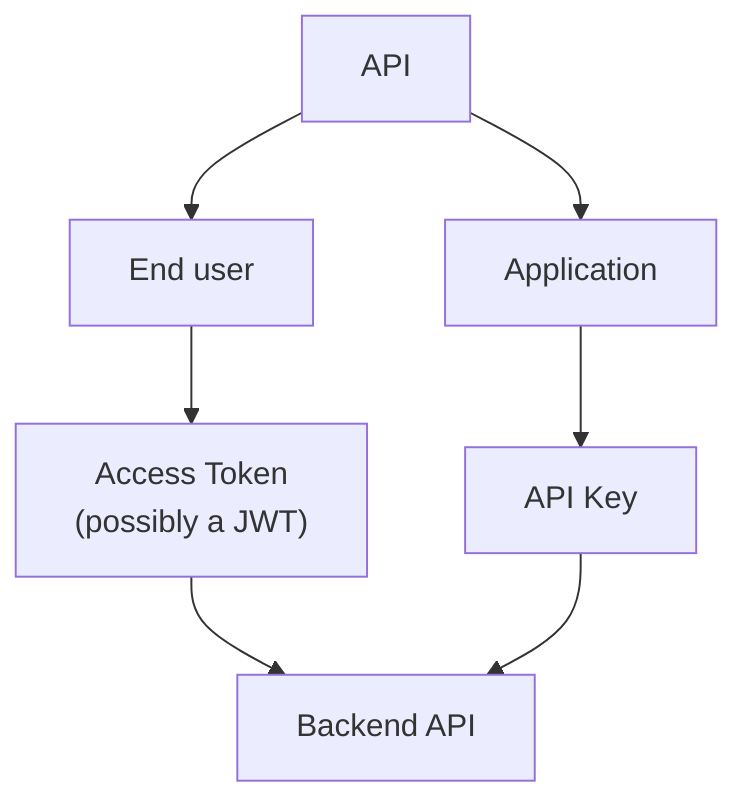

That diagram is an architecture choice, not a standard. [RFC 7519](https://www.rfc-editor.org/rfc/rfc7519) does not tell you to put JWT on users. [OWASP](https://cheatsheetseries.owasp.org/cheatsheets/REST_Security_Cheat_Sheet.html) does not tell you to put API keys on partners. The split follows from the consumers. Decide per use case, per consumer type, and per trust boundary. NestJS appears at the end as a sketch. Lifetime, refresh, and logout for user sessions are a different article: [A refresh token does not keep an access token alive](/blog/refresh-tokens-do-not-keep-access-tokens-alive/). Rate limiting and quotas sit in front of this layer; they do not replace it — [CORS, rate limiting, and Helmet in NestJS](/blog/cors-rate-limiting-security-headers-nestjs/).

## Authentication is not authorization

Teams collapse "logged in" into one blob and then argue about token formats. The names look related. The jobs are not.

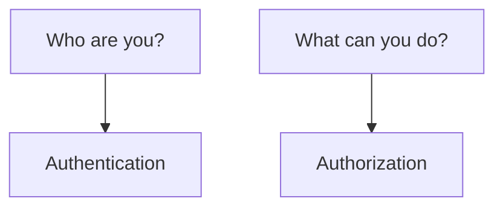

| Term           | Job                                                                                   |
| -------------- | ------------------------------------------------------------------------------------- |
| Identity       | The subject you are talking about: a user, a service, a partner application           |
| Credential     | The secret or token presented to prove something about that subject, or about a grant |
| Authentication | Establishing who (or which client) is speaking                                        |
| Authorization  | Deciding what that subject is allowed to do on this request                           |
| Access token   | A credential that represents an authorization issued to a client                      |
| Claim          | A name/value assertion inside a JWT: who issued it, who it is about, when it expires  |

**Identity** is the principal. `user-123` is an identity. `partner-acme` is an identity. They are not the same kind of principal, and they do not need the same credential.

**Credential** is what travels on the wire. A password, an API key, a bearer access token, a client certificate. The credential is not the identity. It is evidence.

**Authentication** answers "who is this?" or, more carefully, "which principal does this credential bind to?" [OWASP API2:2023](https://owasp.org/API-Security/editions/2023/en/0xa2-broken-authentication/) is explicit that OAuth is not authentication, and neither are API keys. OAuth issues an authorization. An API key identifies a client. Confusing those with "the user logged in" is how designs go wrong.

**Authorization** answers "may this request proceed?" Scopes, roles, resource ownership, rate plans. Authentication can succeed and authorization can still fail: that is HTTP 403 after 401, not a missing JWT library.

**Access token** is [RFC 6749 §1.4](https://www.rfc-editor.org/rfc/rfc6749#section-1.4): "a string representing an authorization issued to the client." The string is usually opaque to the client. It may be an identifier the server looks up, or it may self-contain the authorization in a verifiable way. That last option is where JWT often enters. It is optional. The RFC does not require a JWT.

**Claim** is [RFC 7519](https://www.rfc-editor.org/rfc/rfc7519): a piece of information asserted about a subject, as a name/value pair. `sub`, `aud`, `scope` are claims when they appear in a JWT. They are not a property of API keys.

If you treat authentication as authorization, you issue a token that only means "this request arrived" and then skip the question of what the caller may do. If you treat authorization as authentication, you stuff permissions into a long-lived secret and never ask who is holding it. Both mistakes show up as "we picked JWT" or "we picked API keys" when the real failure was that the jobs were never named.

## What a JWT actually is

[RFC 7519](https://www.rfc-editor.org/rfc/rfc7519) defines JSON Web Token: a compact, URL-safe means of representing claims to be transferred between two parties. The claims are a JSON object used as the payload of a JSON Web Signature (JWS) structure or as the plaintext of a JSON Web Encryption (JWE) structure. That sentence is the whole format.

JWT is a token format. JWT is not, by itself, an authentication system. It does not log anyone in. It does not define logout, sessions, or revocation. A JWT that verifies is a JWT that verifies, until you reject it.

The common compact form of a signed JWT is three base64url segments:

```text
xxxxx.yyyyy.zzzzz
```


**Header** (JOSE header) names the cryptographic algorithm and, often, a type. Typical fields: `alg`, `typ`. [RFC 8725](https://www.rfc-editor.org/rfc/rfc8725) requires the verifier to decide which algorithms are acceptable. Do not let the token pick `alg` for you. The `none` algorithm exists in the spec as an unsecured JWT. OWASP's [REST Security Cheat Sheet](https://cheatsheetseries.owasp.org/cheatsheets/REST_Security_Cheat_Sheet.html) says not to accept it for access control.

**Payload** is the JWT Claims Set: a JSON object of claims.

**Signature** (for JWS) covers header and payload. It is a digital signature or a MAC. It protects integrity and authenticity of those bytes under the chosen algorithm and key. It does not encrypt the payload. Anyone who has the token can read the claims. Signed versus encrypted is a later section; the distinction starts here.

Registered claim names in RFC 7519 §4.1 are a starting set for interoperability. **None of them is mandatory in every JWT.** The RFC says applications should define which claims they use and when those claims are required. OWASP REST recommends verifying `iss`, `aud`, `exp`, and `nbf` when a JWT is used for access control. That is a security recommendation for that use, not an IETF requirement that every JWT carry those fields.

| Claim | Meaning in RFC 7519                                                                                        |
| ----- | ---------------------------------------------------------------------------------------------------------- |
| `iss` | Issuer: who created the JWT. OPTIONAL.                                                                     |
| `sub` | Subject: who the JWT is about. OPTIONAL. Must be unique in the issuer's context or globally unique.        |
| `aud` | Audience: who is supposed to consume it. If present, a recipient that is not in `aud` MUST reject the JWT. |
| `exp` | Expiration time. If you process this claim, now must be before `exp`.                                      |
| `nbf` | Not-before. If you process this claim, now must be after `nbf`.                                            |
| `iat` | Issued-at. Useful to know the age of the token.                                                            |
| `jti` | JWT ID. A unique identifier; the RFC notes it can be used to prevent replay.                               |

`scope` is not a registered claim in RFC 7519. OAuth uses scope as a protocol parameter. If you put `"scope": "orders:read"` in a JWT, that is an application or profile choice — [RFC 9068](https://www.rfc-editor.org/rfc/rfc9068) is one such profile for OAuth access tokens.

A conceptual payload, not a production token:

```json
{
  "sub": "user-123",
  "iss": "https://auth.example.com",
  "aud": "orders-api",
  "exp": 1780000000,
  "scope": "orders:read"
}
```

Validation, in outline, is: parse the compact form, confirm the algorithm is in your allowlist, verify the signature or MAC with keys you already trust, then apply the claims your application requires (`iss`, `aud`, `exp`, and anything else you defined). RFC 8725 adds: bind keys to the issuer, validate audience when the same issuer serves more than one party, do not follow `jku`/`x5u` URLs from the header into a lookup you did not pin, and reject `alg: none` unless you explicitly asked for an unsecured JWT.

Signing and encrypting are different operations. RFC 7519 allows claims to be signed, MACed, encrypted, or nested combinations. A signed JWT is not confidential. An encrypted JWT (JWE) is a different serialization. Support for encryption is optional in the JWT spec. Most access tokens you will see in a NestJS API are signed, not encrypted. TLS protects the token in transit. The JWT itself still reads as JSON to anyone who holds it.

## What an API key actually is

An API key is a credential issued to a client — usually an application, a partner, or a developer account — and presented on requests so the server can identify that consumer. There is no IETF document titled "API Keys" that defines claims, scopes, or expiration the way RFC 7519 defines JWT. The concept lives in platform documentation and in security guidance.

[OWASP REST](https://cheatsheetseries.owasp.org/cheatsheets/REST_Security_Cheat_Sheet.html) treats API keys as a way to reduce farming of public REST services, to meter paid plans, and to take some of the edge off denial-of-service. It tells you to require the key on protected endpoints, to return `429 Too Many Requests` when the client is too fast, to revoke the key if the client violates the usage agreement, and **not to rely exclusively on API keys to protect sensitive, critical, or high-value resources.**

[Google Cloud's API key best practices](https://docs.cloud.google.com/docs/authentication/api-keys-best-practices) treat keys as bearer credentials: whoever holds the string can use it. Restrict each key. Do not put it in query parameters. Do not commit it to a repository. Rotate it. Delete keys you are not using. Isolate keys per application and per person where that helps audit. Google also notes that some "authorization keys" obscure the end user in audit logs; that is a reason to prefer a method that represents a user when a user is what you need to identify.

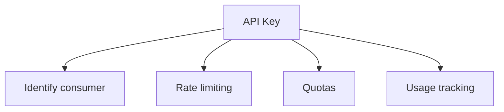

Typical jobs an API key is asked to do:

- identify an application or a developer;
- identify an external consumer (a partner integration);
- gate access at a coarse level (this key is allowed to call this API);
- rate limit per consumer;
- enforce quotas and paid plans;
- attribute usage for billing or abuse review.

An API key does **not** inherently carry:

- end-user identity;
- claims;
- scopes;
- expiration;
- fine-grained authorization.

You can build those around a key: a database row with `expiresAt`, a plan, a list of allowed routes, a user that "owns" the key. Those are properties of your system, not of "API Key" as a concept. Do not attribute them to the credential the way `exp` is a defined JWT claim.

[OWASP API2:2023](https://owasp.org/API-Security/editions/2023/en/0xa2-broken-authentication/) says API keys should not be used for user authentication. They should be used for API client authentication. That is the job split in one sentence.

## The comparison is not symmetric

JWT and API keys are not two equivalent technologies you must always choose between.

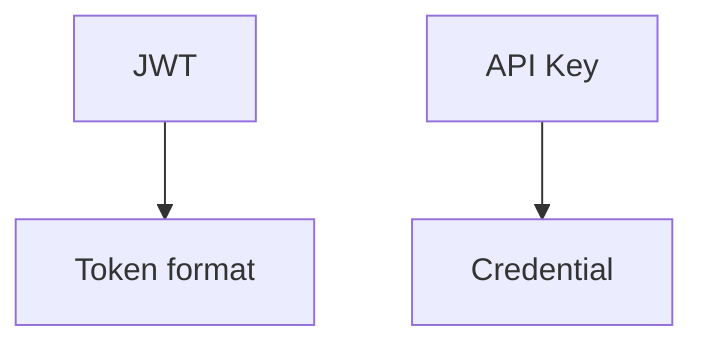

One is a way to encode claims. The other is a secret you issue to a consumer. You can compare how teams use them on HTTP APIs. You cannot treat the comparison as "pick format A or format B."

OAuth 2.0 sits on a different axis.

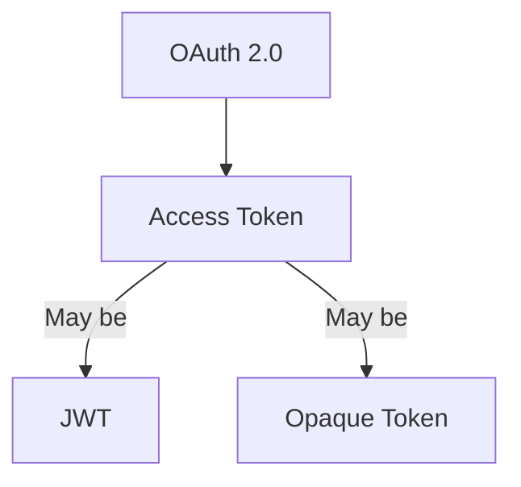

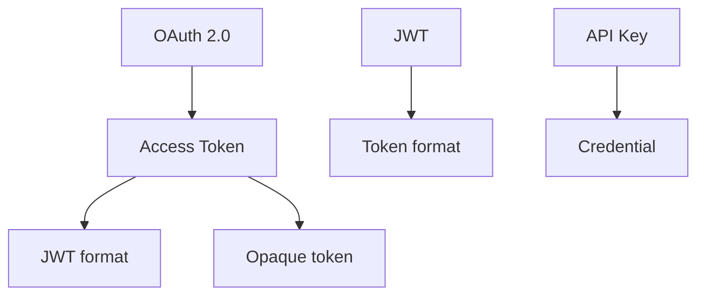

**OAuth 2.0 ≠ JWT.** [RFC 6749](https://www.rfc-editor.org/rfc/rfc6749) is an authorization framework. It issues access tokens. [RFC 6750](https://www.rfc-editor.org/rfc/rfc6750) describes how to send a **bearer** access token in HTTP — typically `Authorization: Bearer ...`. Bearer means possession is enough. The RFCs do not require that the bearer string be a JWT. RFC 6749 §1.4 says the string is usually opaque to the client, and that access tokens can have different formats.

**JWT ≠ OAuth 2.0.** RFC 7519 is a claims format. You can sign a JWT in NestJS with `@nestjs/jwt` and never speak OAuth. You can run OAuth with opaque tokens and [introspection](https://www.rfc-editor.org/rfc/rfc7662) and never mint a JWT. [RFC 9068](https://www.rfc-editor.org/rfc/rfc9068) is a profile for when an OAuth access token _is_ a JWT (`typ` should be `at+jwt`). It exists because people were already stuffing proprietary JWT layouts into access tokens. A profile is not identity between the two specs.

An ID Token in OpenID Connect is a JWT used to represent the user to a client. That is still not "JWT = login," and it is not an API key. Do not collapse ID Token, access token, and API key into one "auth token."

## JWT vs API key, with caveats

The table is a map of typical properties, not a law.

| Characteristic     | JWT                                    | API Key                                         |
| ------------------ | -------------------------------------- | ----------------------------------------------- |
| Nature             | Token format                           | Credential                                      |
| Claims             | Yes                                    | Not inherent                                    |
| Expiration         | Can be represented with `exp`          | Depends on the implementation                   |
| User identity      | Can be represented (`sub` and friends) | Not necessarily                                 |
| Scopes             | Can represent them                     | Not inherent                                    |
| Rate limiting      | Can help identify a subject            | Common use                                      |
| Quotas             | Can help                               | Common use                                      |
| Revocation         | Needs a strategy                       | Can be more direct if the server stores the key |
| Rotation           | Needs a strategy                       | Recommended by platform guidance                |
| Machine-to-machine | Yes                                    | Yes                                             |
| End user           | Yes, depending on the flow             | Generally not its main job                      |
| OAuth 2.0          | Can be used as an access token         | Not OAuth 2.0                                   |

Read the hedges. "Can" is not "does." A JWT without `exp` does not expire by format magic. An API key in a system that never deletes rows is not "easy to revoke." Rate limiting is an HTTP control; either credential can be the partition key if you look it up. [RFC 6750](https://www.rfc-editor.org/rfc/rfc6750) does not mention API keys. Google Cloud does not say JWT cannot be rate-limited.

Revocation is the row that causes the most false confidence. A JWT that is only checked locally is valid until `exp`. Killing it early means a denylist, a short TTL plus a refresh flow, token status, or rotating keys — all extra machinery. An API key that is a row in your database can be disabled on the next request. That is an implementation property, not a metaphysical win for keys. Opaque access tokens have the same lever: the authorization server can drop the row.

## What kind of consumer do you have?

Classify the caller before you classify the token.

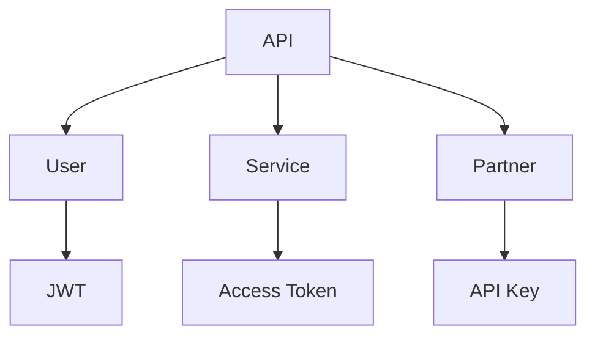

Those labels are examples. Other solutions exist. A user-facing API can use a classic server-side session cookie and never mint a JWT. A partner can use OAuth. An internal service can use mTLS and skip bearer tokens entirely.

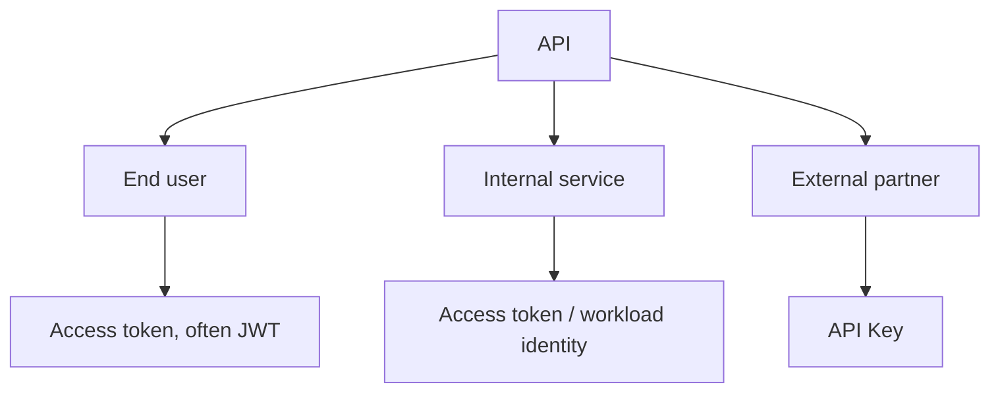

### End user

You need identity and authorization. The caller is acting as a person (or a delegated grant from that person). You need to know `sub`, what they may do, and usually a lifetime short enough that theft has a bound. An access token fits. Whether that token is a JWT or opaque is a format decision. An API key that one human pastes into a SPA is a long-lived bearer secret with no `exp` unless you invent one. OWASP's line stands: do not use API keys for user authentication.

### Internal service

You need to know which workload is calling, and often that it is allowed to call this audience. Options that exist in real platforms — not a required shopping list — include OAuth 2.0 Client Credentials, workload identity, service accounts, mTLS, and network policy plus a service token. JWT can appear here as a signed assertion. An API key can appear here as a static secret. Static secrets inside a mesh are a rotation and leak problem. Pick from the trust model you already run (cloud IAM, service mesh, your authorization server). Do not add JWT because the public API uses JWT.

### External integration

A partner, a Zapier-style connector, a customer's backend. You may only need to identify the application, meter it, and cut it off. An API key is a common fit. If the partner must act as one of their users, or you need delegated access, OAuth is the framework built for that. "Partner" is not a synonym for "API key." It is a consumer type whose risk and authorization model you still have to write down.

## Yes, you can use JWT and API keys together

Yes.

There is more than one way to combine them. The combinations are not equally good, and they are not equally cheap.

### Case A — different consumers

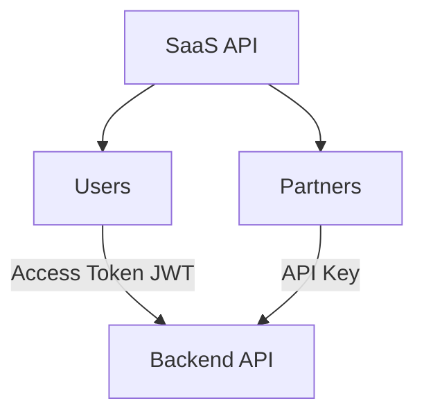

Users present an access token. That token may be a JWT. Partners present an API key. The same HTTP API accepts both. Each mechanism has a different job: user authorization versus consumer identification and metering. This is the coexistence the opening diagram was about. It is an architecture decision. Nothing in RFC 7519 or RFC 6750 forbids it. Nothing requires it either.

### Case B — API Gateway, then the API

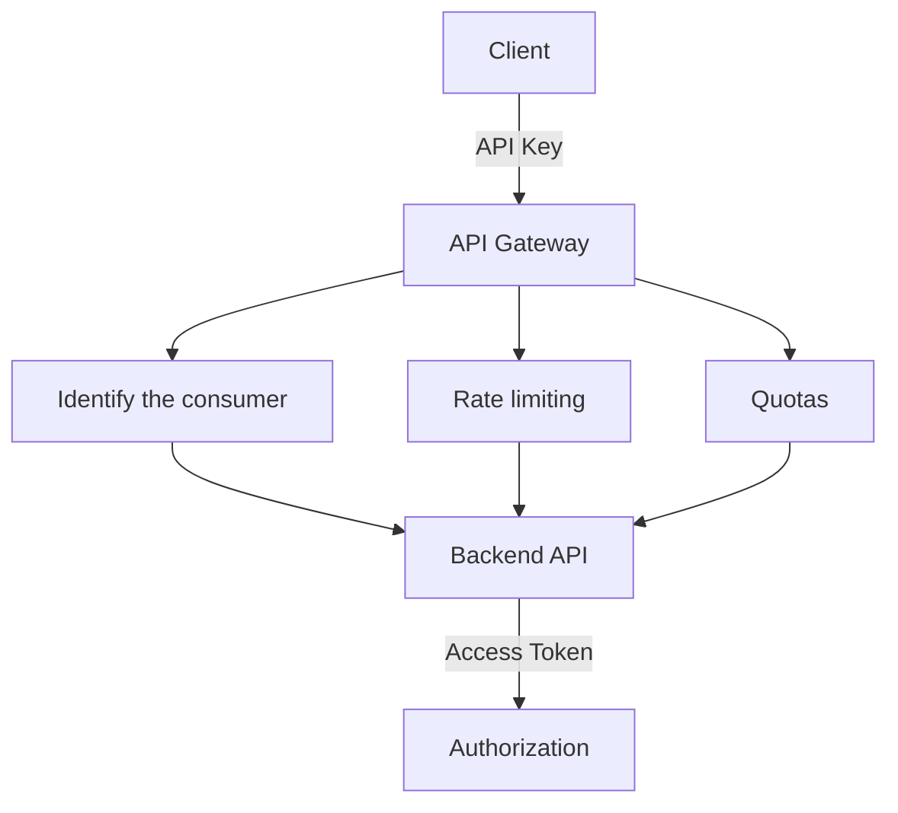

The gateway uses the key to know _which application_ is calling and to apply a plan. The backend uses an access token to authorize _what this request may do_. That split is a possible architecture. It is not a rule that every API must validate an API key first and a JWT second.

Adding a second mechanism adds configuration, failure modes, and operational load. Do it when the gateway's job (metering third-party developers, protecting origin, billing) is real. Do not do it because a diagram had two boxes.

### Case C — both on the same request

It is technically possible to require:

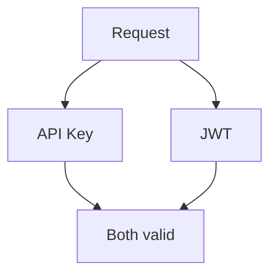

That can raise the bar in a specific threat model: a stolen user token is useless without the partner key, or a leaked key cannot call user-scoped routes without a user token. It also raises complexity, configuration, debugging cost, and the chance that one of the two checks is misapplied.

Do not recommend this as a default. Do not add two credentials to a request because "more authentication means more security." [OWASP](https://owasp.org/API-Security/editions/2023/en/0xa2-broken-authentication/) wants you to understand the mechanisms you already have, not to stack them for comfort. There must be a concrete threat or an architectural need — two trust boundaries that both have to speak on this call — before the second credential earns its keep.

## A realistic SaaS: one API, three consumers

A B2B platform ships a web app, a mobile app, external integrations, and internal workers.

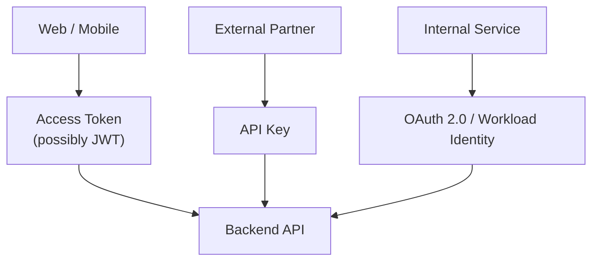

**Web and mobile** sign a user in. They need a subject, scopes or equivalent, an audience, and a lifetime. An access token is the request credential. JWT is a reasonable format if the API will validate locally; opaque is reasonable if you already introspect. The session behind that token — refresh, rotation, logout — is the other article. Do not stretch `exp` to thirty days to avoid that design.

**External partner** syncs catalog data at night. There is no end user on the call. You need to know which tenant's integration this is, cap their rate, bill the plan, and revoke them when the contract ends. An API key (restricted, rotated, stored hashed, never in a URL) matches that job. If later they must act on behalf of one of their users, that is a new grant. Add OAuth then. Do not pretend the key was a user session.

**Internal service** issues invoices from a worker. It is not a browser. Cloud workload identity or Client Credentials against your authorization server binds the workload to an audience. A long-lived API key in the worker's env works until someone copies the env. A JWT the worker mints for itself with a shared HS256 secret is a static secret with extra steps. Prefer the identity system you already trust for compute.

You do not need the same mechanism for every consumer. Uniformity is a nice-to-have. Correct binding of principal, grant, and threat model is the requirement.

## Security is a lifecycle, not a format

JWT is not automatically safer. API keys are not automatically unsafe. Security depends on how a credential is issued, stored, transmitted, validated, rotated, and revoked.

### API keys

Google Cloud's guidance is concrete because keys leak in boring ways.

- **Exposure.** A key in a Git repo, a mobile binary, a screenshot, or a support ticket is a bearer credential. Treat it like a password. OWASP's [Secrets Management](https://cheatsheetseries.owasp.org/cheatsheets/Secrets_Management_Cheat_Sheet.html) cheat sheet exists because teams still hardcode them.
- **Environment variables.** Better than source control. Still visible to every process and every dump of the env. Restrict who can read the runtime config.
- **Logs and proxies.** Access logs, APM traces, and reverse proxies will store the request. If the key is in the URL, it is in the log. If it is in a header, some tools still record headers. Do not print it in application logs.
- **URLs.** Separate section below. Do not put the key in the query string.
- **Rotation.** Google Cloud recommends creating a new key, moving clients, deleting the old one. Rotation is not a property of "API Key"; it is an operational practice. If you never rotate, a leak from last year still works.
- **Revocation.** Disable or delete the row. Direct, if you built the row.
- **Restrictions.** Limit by API, IP, referrer, or GCP identity as the platform allows. A key that can call every method from every network is a single stolen string away from a full consumer impersonation.
- **Rate limiting.** OWASP REST: require the key, return 429, revoke on abuse. Rate limiting is not authentication. It is how you keep a public surface from becoming a bill. The NestJS half of that control is in the [rate limiting article](/blog/cors-rate-limiting-security-headers-nestjs/).

A well-run API key is a hashed secret, scoped, rotatable, and never used as a user session. A poorly run JWT is worse than that key.

### JWT

RFC 8725 is the BCP. The attacks it lists are not theoretical: `alg` confusion, `none`, weak HMAC secrets, substitution of a token meant for another audience.

- **Cryptographic validation.** Verify with keys you already associate with the issuer. Allow only the algorithms you intend. One key, one algorithm.
- **Algorithm allowlist.** Applications MUST only allow cryptographically current algorithms they accept. Libraries MUST let the caller set that set. `none` only when you explicitly want an unsecured JWT and something else (usually TLS plus a closed environment) already protects the payload.
- **Issuer.** If `iss` is present, the keys MUST belong to that issuer or you reject the token (RFC 8725 §3.8).
- **Audience.** If the same issuer serves more than one relying party, the JWT MUST have `aud`, and the recipient MUST check it (RFC 8725 §3.9). Otherwise a token for the billing API is a token for the admin API.
- **Expiration.** Process `exp` when you use the JWT as a time-bounded credential. OWASP REST includes `exp` and `nbf` in the claims a relying party should verify for access control. A JWT with no `exp` does not "last forever" by spec; it lasts until you decide it is invalid. In practice, missing `exp` is how 30-day incidents get shipped.
- **Storage.** A bearer JWT in `localStorage` is available to XSS. A JWT in a URL is available to logs. The token is as public as its storage. Session cookie vs header is a threat-model choice covered in the [refresh-token article](/blog/refresh-tokens-do-not-keep-access-tokens-alive/).
- **Theft and replay.** Bearer means possession is enough (RFC 6750). Short TTL limits the window. `jti` plus a denylist can block a specific token if you are willing to store state. Sender-constrained tokens (DPoP, mTLS-bound) exist in OAuth; they are not "use JWT."
- **Duration.** Short access tokens, longer refresh credentials if you need a session. That split is architecture, specified for OAuth refresh in RFC 6749, not a JWT feature.
- **Revocation.** See below. `exp` is not a kill switch.
- **Claims validation.** Do not trust `kid`, `jku`, or `x5u` as a source of keys (RFC 8725 §3.10). Do not take a role claim from the token as authorization without a model: the signature says the issuer asserted it, not that your ACL still agrees.

OWASP's [JWT cheat sheet](https://cheatsheetseries.owasp.org/cheatsheets/JSON_Web_Token_Cheat_Sheet.html) is blunt about "stateless sessions": if you need logout, you need a denylist or you should use a session. Stateless is a deployment convenience, not a security property.

## A signed JWT is not an encrypted JWT

```text
Signed JWT ≠ Encrypted JWT
```

RFC 7519 allows both. They are not the same protection.

A **signed** JWT (JWS compact serialization) is three readable segments. Base64url is encoding, not encryption. Anyone with the string can decode the header and the claims. The signature answers "was this altered, and did it come from a holder of the key?" under the algorithm you accepted. It does not answer "who else can read this?"

An **encrypted** JWT (JWE) uses a different compact form and protects confidentiality of the claims, with the caveats in RFC 8725 (compression leaks, invalid-curve attacks, nested JWTs that must validate every layer).

TLS encrypts the hop. It does not make the stored token opaque to the browser, the mobile disk, or the attacker who already stole it. If the payload must stay confidential from the client that presents it, a signed JWT is the wrong tool — and putting secrets in claims was the wrong design. Prefer opaque tokens or keep sensitive attributes on the server.

The sentence to kill in code review: "It is signed, so nobody can read it."

## API keys and URLs

Compare:

```http
GET /users?api_key=secret
```

with:

```http
GET /users
X-API-Key: secret
```

[OWASP REST](https://cheatsheetseries.owasp.org/cheatsheets/REST_Security_Cheat_Sheet.html) says passwords, security tokens, and API keys should not appear in the URL. URLs land in access logs, browser history, `Referer` headers, proxies, and APM. For GET, put sensitive data in a header. Google Cloud says the same for their APIs: do not pass the key as a query parameter; use `x-goog-api-key` or a client library.

[RFC 6750 §2.3](https://www.rfc-editor.org/rfc/rfc6750#section-2.3) allows an access token in the query string and then tells you not to: it SHOULD NOT be used unless the `Authorization` header and the body are impossible, because URIs get logged.

A header is not a security transformation. `X-API-Key: secret` over HTTP in a gist is still a leaked bearer credential. HTTPS, hashing at rest, rotation, and restrictions are what change the risk. The header only stops the most common accidental copies.

## Expiration is not revocation

### JWT

A JWT may contain `exp`. If the verifier checks it, the token dies at that instant. Until then, a locally validated JWT remains acceptable even if the user logged out, the password changed, or the admin disabled the account — unless you add another check.

Short-lived access tokens shrink that window. They do not give you immediate revocation. Immediate revocation needs state: a denylist keyed on `jti` (OWASP REST / JWT cheat sheet), introspection of an opaque token, a session row, or a token status list. RFC 7519 says `jti` _can_ be used to prevent replay. It does not implement a denylist for you.

If you need sessions, design sessions. Do not comment `// JWT is stateless` on a product that has a Logout button. The refresh-token article is the architecture of that button.

### API key

Lifecycle is whatever you built:

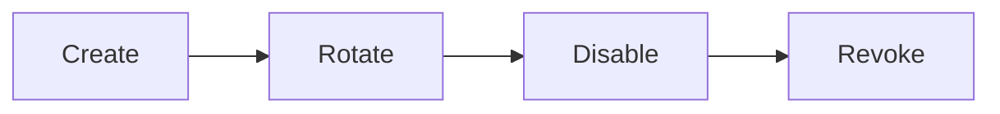

Google Cloud documents rotate and delete. OWASP REST says revoke on abuse. None of that appears magically because the string is called an API key. A key hardcoded in a library you cannot update does not rotate. A key you never hash cannot be distinguished from a leak in your own database dump.

Opaque access tokens sit closer to keys on this axis: the server owns the row. JWT sits closer to a certificate: valid until expiry unless you add a list.

## When an API key is enough

"Enough" depends on risk and on the authorization model, not on fashion.

An API key can be a reasonable fit when:

- you run a public developer API and need to identify callers, meter them, and stop farming (OWASP REST's original use);
- you need consumer identity, not user identity;
- rate limiting and quotas are the main controls;
- the integration is an application talking as itself;
- there is no end-user identity that must be represented on the request.

It is not enough, by OWASP REST's own warning, as the exclusive control on sensitive, critical, or high-value resources. It is not a user login. It is not OAuth. If the partner later needs delegated user access, you outgrew the key for that path; you did not prove that keys "don't work."

## When you need access tokens

You need something that represents an authorization when:

- an authenticated user is calling;
- you need scopes (or an equivalent grant);
- you need audience restriction;
- you need a credential that expires;
- you need to represent identity on the request;
- you need delegation (OAuth's actual job);
- the API is protected as an OAuth resource.

Access token does **not** mean JWT. RFC 6749 allows different formats. The token may be:

```text
JWT
```

or:

```text
Opaque token
```

A JWT access token can be validated locally with the issuer's keys (RFC 9068 describes that profile). An opaque token is validated by looking it up or introspecting it. Local JWT validation does not talk to the authorization server on every request; it also does not see a revocation until `exp` or a denylist. Choose the operational trade, not the buzzword.

## When JWT is unnecessary

JWT is not a default upgrade.

You may not need it when:

- you only need to identify a consumer;
- you only need rate limiting and quotas;
- you do not need to transport claims;
- a simpler credential already names the caller correctly;
- every request already hits a session store, so the "stateless" pitch is fiction.

Do not introduce cryptographic and operational complexity the problem does not need. Signing, key rotation, `aud` checks, and `alg` allowlists are real work. They pay off when claims must travel. They are ceremony when the API would have been correct with a hashed API key and a row.

OWASP's JWT cheat sheet asks the same question before the algorithms table: consider whether you need JWTs at all.

## A decision tree, not a spec

This is a conceptual guide. It is not a normative algorithm.

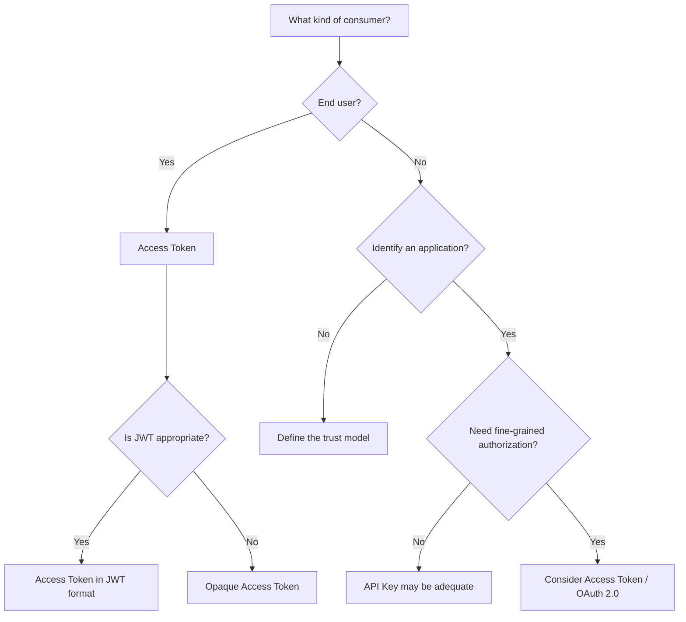

"Fine-grained authorization" here means the request must carry or resolve a grant (scopes, user, audience), not that you dislike API keys. "Is JWT appropriate?" means: do you need self-contained claims and local validation, and will you operate keys and `exp` honestly? If you will introspect anyway, opaque is simpler.

## Hybrid architecture

Different consumers, different mechanisms, one API. Again: a picture of a possible system, not a mandate.

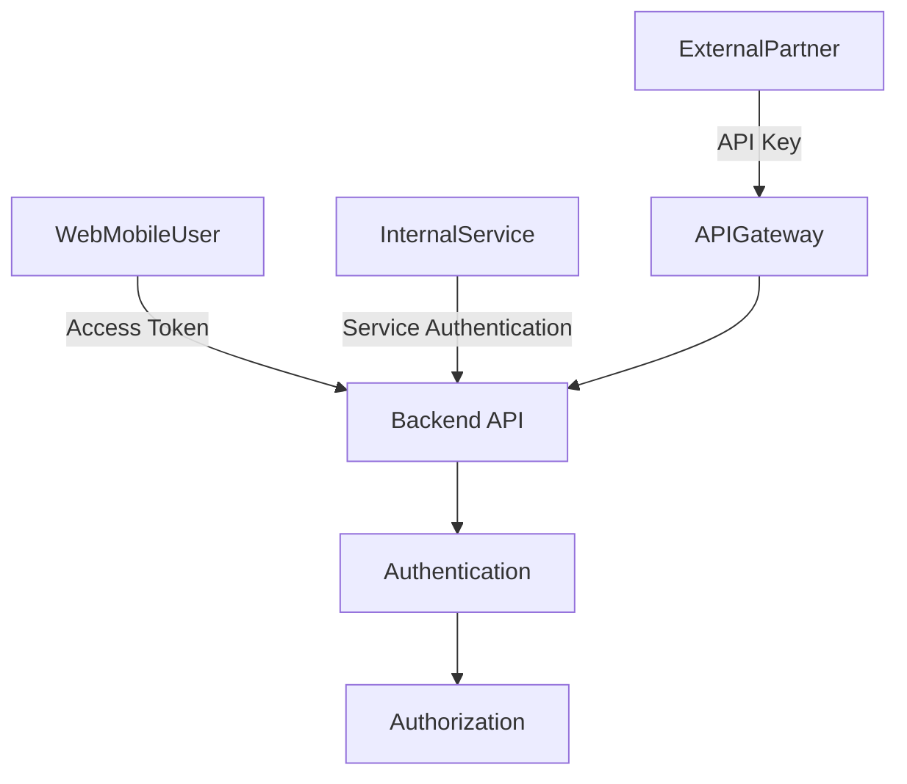

Authentication still happens before authorization. The credential that arrives may differ. The API still has to name the principal and then enforce the grant. Mixing keys and tokens does not skip that order.

## A NestJS sketch, after the architecture

NestJS can implement this. It does not invent it. [Guards](https://docs.nestjs.com/guards) decide whether a route may run. [Authentication](https://docs.nestjs.com/security/authentication) shows a JWT guard that verifies a bearer token and assigns the payload to the request. [Authorization](https://docs.nestjs.com/security/authorization) is a later guard that reads that principal. Keep those jobs split.

Two HTTP shapes, two consumers:

```http
GET /v1/products
X-API-Key: ...
```

```http
GET /v1/orders
Authorization: Bearer ...
```

Conceptual guards, not a complete module:

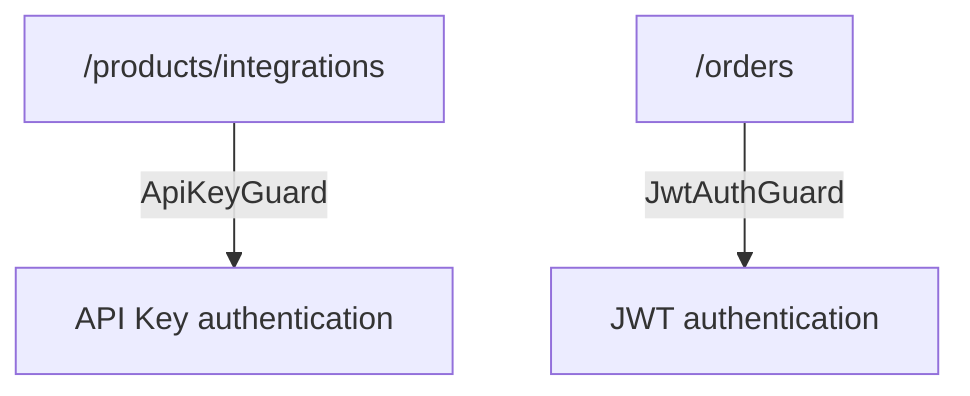

Read the API key from a header, not from the query string. Compare against a hash. Load the consumer. Do not log the raw key.

```ts
@Injectable()
export class ApiKeyGuard implements CanActivate {
  constructor(private readonly consumers: ConsumerService) {}

  async canActivate(context: ExecutionContext): Promise<boolean> {
    const request = context.switchToHttp().getRequest();
    const apiKey = request.headers["x-api-key"];
    if (typeof apiKey !== "string" || apiKey.length === 0) {
      throw new UnauthorizedException();
    }

    const consumer = await this.consumers.findByKeyHash(sha256(apiKey));
    if (!consumer || consumer.revokedAt) {
      throw new UnauthorizedException();
    }

    request.consumer = consumer;
    return true;
  }
}
```

The JWT path verifies a bearer token with a secret or JWKS from configuration. `algorithms` is an allowlist. Issuer and audience are application policy, matching RFC 8725 when you use those claims.

```ts
@Injectable()
export class JwtAuthGuard implements CanActivate {
  constructor(private readonly jwt: JwtService) {}

  async canActivate(context: ExecutionContext): Promise<boolean> {
    const request = context.switchToHttp().getRequest();
    const [scheme, token] = request.headers.authorization?.split(" ") ?? [];
    if (scheme !== "Bearer" || !token) {
      throw new UnauthorizedException();
    }

    try {
      request.user = await this.jwt.verifyAsync(token, {
        secret: process.env.JWT_ACCESS_SECRET,
        algorithms: ["RS256"],
        issuer: process.env.JWT_ISSUER,
        audience: process.env.JWT_AUDIENCE,
      });
    } catch {
      throw new UnauthorizedException();
    }

    return true;
  }
}
```

`JwtAuthGuard` authenticates. A `RolesGuard` or policies guard authorizes. Do not hide ACL checks inside signature verification.

A route that accepts either credential is possible — Case A on one handler — if the handler can bind both `request.user` and `request.consumer` to a common authorization model. A route that requires both is Case C. Do not glob `APP_GUARD` for both and call it defense in depth.

Secrets come from the environment, not from the repo. If you log `Authorization` or `x-api-key`, you have copied the credential into the log pipeline. Hash, redact, or drop the header before the logger sees it.

This is a sketch. Passport JWT, a custom guard, or a gateway in front of Nest are implementation details. The architecture is: pick the guard that matches the consumer, then authorize.

## Common mistakes

- **"JWT is an authentication system."** RFC 7519 defines a claims format. Login, session, and logout are application or protocol work (OAuth, OIDC, cookies). A verified JWT is a verified set of claims.
- **"JWT and OAuth are the same thing."** OAuth issues access tokens (RFC 6749). JWT is a format those tokens may use (RFC 9068) or may not (opaque strings, RFC 6750). You can use either without the other.
- **"JWT is always better than an API key."** Better at what. Claims and local validation are JWT's job. Consumer metering is a common API-key job. Security follows the lifecycle, not the acronym.
- **"API keys are insecure by nature."** They are bearer secrets. So is a bearer JWT (RFC 6750). OWASP warns against using keys as _user_ authentication and against using them as the only control on high-value resources. That is not "keys cannot be used."
- **"If the JWT is signed, nobody can read it."** Signed is not encrypted. RFC 7519 separates JWS and JWE. The payload of a signed JWT is readable.
- **"JWT must always be stateless."** OWASP's JWT cheat sheet treats fully stateless user sessions as a design to question. Logout and revocation need state, a short TTL plus refresh, or a different session model.
- **"An API key does not need rotation."** Google Cloud tells you to rotate. A static bearer secret that never changes is a permanent leak window.
- **"We should use JWT and an API key together to be safer."** Case C is a specific threat-model choice. Two broken checks are not stronger than one correct one. Add the second credential when two principals must both be bound to the request.
- **"An API must use a single authentication mechanism."** Case A is normal in SaaS: users and partners are not the same consumer. Uniformity is optional. Clear responsibility per mechanism is not.

## A practical decision table

Not a standard. A prompt for the design conversation.

| Need                         |      API Key | Access Token / JWT |
| ---------------------------- | -----------: | -----------------: |
| Identify an application      |            ✓ |                  ✓ |
| Identify a user              |            — |                  ✓ |
| Rate limiting                |            ✓ |                  ✓ |
| Quotas                       |            ✓ |                  ✓ |
| Claims                       |            — |              JWT ✓ |
| Scopes                       |            — |                  ✓ |
| End user                     | Generally no |                  ✓ |
| External integration         |            ✓ |                  ✓ |
| Service-to-service           |            ✓ |                  ✓ |
| OAuth 2.0                    |            — |                  ✓ |
| Public developer API         |            ✓ |     May complement |
| SaaS with users and partners |            ✓ |                  ✓ |

Both columns can be true on the same platform. That is the point of Case A. "Generally no" for end users is OWASP API2, not a taste.

## Key takeaways

- You do not have to choose JWT _or_ API keys. They are not the same kind of thing, and they can coexist when the consumers differ.
- An API key identifies and meters a client. An access token represents an authorization. JWT is a format that access token might use.
- Authentication is not authorization. Mixing them produces long-lived keys that pretend to be sessions and JWTs that pretend to be identity providers.
- OAuth 2.0 is not JWT. An access token is not necessarily a JWT. RFC 6749, RFC 6750, and RFC 9068 are three different documents for a reason.
- A signed JWT is readable. Confidentiality is JWE or, more often, not putting secrets in claims.
- Keep credentials out of URLs. A header is necessary hygiene, not a complete control.
- `exp` is not revocation. Rotation is not optional commentary on a bearer secret.
- Do not stack JWT and API key on one request for luck. Do split them across users and partners when the jobs are different.

> First design the identity, authorization, and trust model. Then pick the mechanism that best represents each kind of consumer.

A well-designed architecture can use API keys, access tokens, and JWT at the same time, as long as each mechanism has a clear job and a concrete reason to exist.

## Sources

- IETF, [RFC 7519 — JSON Web Token](https://www.rfc-editor.org/rfc/rfc7519) — compact claims format; registered claims are OPTIONAL; signed (JWS) versus encrypted (JWE)
- IETF, [RFC 6749 — The OAuth 2.0 Authorization Framework](https://www.rfc-editor.org/rfc/rfc6749) — §1.4 access token as an authorization string, usually opaque, format not fixed
- IETF, [RFC 6750 — OAuth 2.0 Bearer Token Usage](https://www.rfc-editor.org/rfc/rfc6750) — `Authorization: Bearer`; possession is enough; query-string tokens SHOULD NOT be used
- IETF, [RFC 7662 — OAuth 2.0 Token Introspection](https://www.rfc-editor.org/rfc/rfc7662) — how a resource server validates an opaque access token
- IETF, [RFC 8725 — JSON Web Token Best Current Practices](https://www.rfc-editor.org/rfc/rfc8725) — algorithm allowlist, `iss`/`aud`, do not trust header-supplied keys, reject `none` unless explicit
- IETF, [RFC 9068 — JWT Profile for OAuth 2.0 Access Tokens](https://www.rfc-editor.org/rfc/rfc9068) — JWT as one access-token format (`typ: at+jwt`), not an identity with OAuth
- OWASP, [REST Security Cheat Sheet](https://cheatsheetseries.owasp.org/cheatsheets/REST_Security_Cheat_Sheet.html) — JWT access-control checks; API keys for metering; no secrets in URLs; keys are not enough for high-value resources
- OWASP, [JSON Web Token Cheat Sheet](https://cheatsheetseries.owasp.org/cheatsheets/JSON_Web_Token_Cheat_Sheet.html) — signed versus encrypted; stateless sessions; `jti` denylist caveats
- OWASP, [API2:2023 Broken Authentication](https://owasp.org/API-Security/editions/2023/en/0xa2-broken-authentication/) — OAuth is not authentication; API keys are not user authentication
- OWASP, [Secrets Management Cheat Sheet](https://cheatsheetseries.owasp.org/cheatsheets/Secrets_Management_Cheat_Sheet.html) — API keys as secrets: no plaintext in repos
- Google Cloud, [Best practices for managing API keys](https://docs.cloud.google.com/docs/authentication/api-keys-best-practices) — restrictions, no query parameters, no keys in source, rotation, bearer nature
- NestJS, [Guards](https://docs.nestjs.com/guards), [Authentication](https://docs.nestjs.com/security/authentication), [Authorization](https://docs.nestjs.com/security/authorization) — sketch only; guards authenticate, later guards authorize
