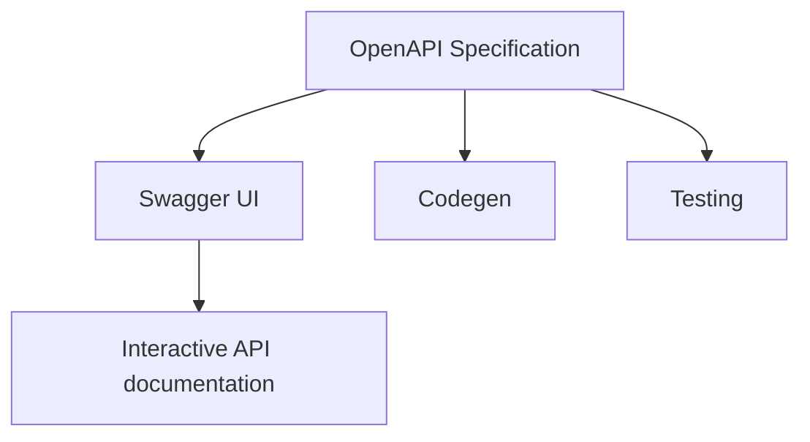
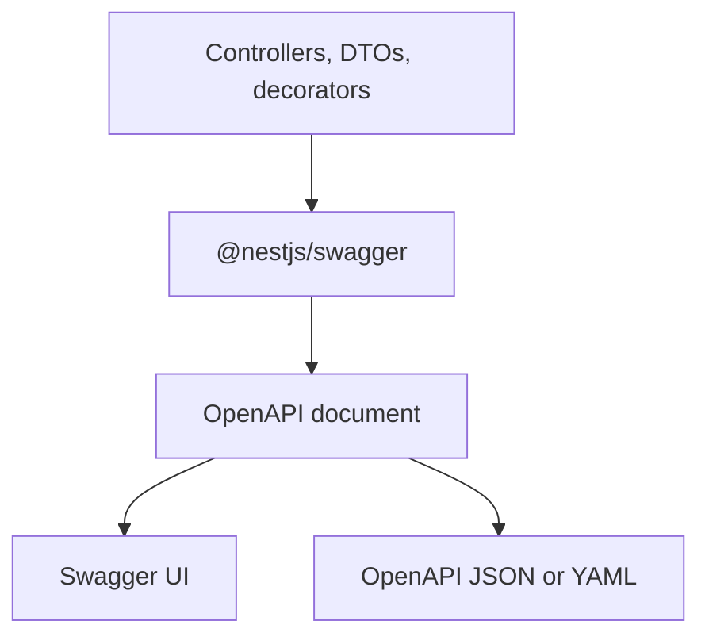

El equipo de móvil pregunta si `POST /users` devuelve `201` o `200`. Frontend trata `role` como un string. Backend publicó un enum el martes pasado. QA no puede distinguir un error de validación de un error de auth porque ambos se ven como `{ "statusCode": 400 }`. La API funciona. Nadie puede consumirla sin preguntarle al autor.

Eso no es un README que falta. Es un contrato que falta.

Una API NestJS sin un documento OpenAPI va a la deriva. Los controladores cambian, los DTOs ganan campos opcionales, y los clientes adivinan. OpenAPI es la forma más barata de mantener ese contrato honesto — si tratas el documento como parte de la API, no como una página que abres una vez en Swagger UI.

> OpenAPI describe el contrato. Swagger UI lo renderiza. `@nestjs/swagger` genera el documento desde la aplicación. No son el mismo trabajo.

## Una API funcional puede seguir siendo inutilizable

Un endpoint que devuelve el JSON correcto en Postman puede seguir siendo caro de integrar. Los fallos habituales no son 500s. Son ambigüedades: rutas que nadie descubre sin Slack; un `id` que podría ser UUID o entero; un DTO con cinco campos TypeScript y un schema OpenAPI vacío porque la reflexión los borró; un éxito que puede ser `200`, `201` o `204`; ejemplos que todavía dicen `"string"`. Frontend, móvil y otros servicios entonces se integran por folclore.

OpenAPI no hace que esos problemas desaparezcan. Te da un lugar único y legible por máquinas para declarar el contrato HTTP: paths, operations, parameters, request bodies, responses, schemas y authentication. NestJS puede construir ese documento desde los mismos controladores y DTOs que implementan la API. El trabajo es mantener el documento verdadero.

## OpenAPI es el contrato

La [OpenAPI Specification](https://spec.openapis.org/oas/latest.html) es un formato agnóstico de lenguaje para describir APIs HTTP. La OpenAPI Initiative la publica. A septiembre de 2025 la última versión es **3.2.0**. Un archivo que conforma es un **documento OpenAPI**. Lo escribes en JSON o YAML.

El documento responde, para cada operation: qué server y path, qué método HTTP, qué parameters, cómo es el request body, qué responses esperar, y qué authentication se requiere.

Un documento mínimo necesita `openapi`, `info` (`title` y `version`), y al menos uno de `paths`, `components` o `webhooks`. `openapi` es la versión de la especificación. `info.version` es la versión de _tu_ descripción de API. No son intercambiables.

Un fragmento conceptual de lo que Nest genera cuando la metadata está completa:

```yaml
openapi: 3.0.0
info:
  title: Users API
  version: 1.0.0
paths:
  /users:
    post:
      requestBody:
        content:
          application/json:
            schema:
              $ref: "#/components/schemas/CreateUserDto"
      responses:
        "201":
          description: User created
        "409":
          description: Email already registered
```

Cada campo que dejas sin documentar es un campo que otro equipo adivinará.

## OpenAPI no es Swagger

Swagger empezó como una especificación. SmartBear después donó esa especificación a la OpenAPI Initiative, y se convirtió en la OpenAPI Specification. Swagger quedó como un conjunto de herramientas alrededor de esa especificación. La gente todavía dice "agregar Swagger" cuando quiere decir "generar un documento OpenAPI y servir Swagger UI".

| Concepto              | Qué es                                                                     |
| --------------------- | -------------------------------------------------------------------------- |
| OpenAPI Specification | El estándar que define cómo describir una API HTTP                         |
| Documento OpenAPI     | Un archivo JSON o YAML que conforma a ese estándar                         |
| Swagger UI            | Una UI en navegador que renderiza un documento y te deja llamar operations |
| Swagger Editor        | Un editor en navegador para escribir e inspeccionar documentos             |
| Swagger Codegen       | Una herramienta que genera clientes y stubs de servidor desde un documento |
| `@nestjs/swagger`     | El módulo NestJS que construye un documento OpenAPI desde tu app           |

La propia documentación de Swagger establece la separación: OpenAPI es el formato de descripción; Swagger es el tooling.



La confusión es barata porque `@nestjs/swagger` todavía usa `SwaggerModule`, el path por defecto de la UI en los docs de Nest es `/api`, y el README del paquete dice "OpenAPI (Swagger)". El documento que generas es un documento OpenAPI. La página en `/docs` es Swagger UI. Si tratas ambas cosas como lo mismo, optimizarás para un demo y publicarás un contrato que nadie más puede consumir.

## Por qué el contrato importa

Un documento OpenAPI completo es cómo frontend, móvil, QA y otros servicios comparten una descripción: nombres, tipos, status codes y ejemplos — sin hacer pair sobre el controlador ni copiar una interfaz de Slack. Obtienes un diff cuando un campo obligatorio se vuelve opcional, clientes y contract tests generados desde schemas en lugar de folclore, y un check de CI cuando el documento no se puede generar. Si Swagger UI es el único artefacto que conservas, no tienes un contrato. Tienes un demo.

## Cómo NestJS construye el documento

`@nestjs/swagger` recorre la aplicación Nest: módulos, controladores, route handlers, decoradores de parámetros, y las clases que esos handlers usan como DTOs. Los decoradores agregan la metadata que TypeScript no puede guardar. El resultado es un documento OpenAPI serializable.



`SwaggerModule.createDocument()` produce ese objeto. Puedes servirlo a través de Swagger UI, exponerlo como JSON o YAML, o escribirlo a disco en CI. La introducción de Nest es explícita: el objeto es el documento; servirlo por HTTP es opcional.

Lo que el módulo puede inferir sin decoradores extra: método HTTP y path desde `@Get()`, `@Post()`, `@Controller()`; que un parámetro es path, query o body desde `@Param()`, `@Query()`, `@Body()`; un _nombre_ de modelo desde la clase DTO.

Lo que no puede inferir solo desde TypeScript: propiedades de la clase (la metadata design:type no lista campos); opcionalidad; valores de enum; tipos de elementos de array, generics o interfaces; descripciones útiles, ejemplos o respuestas de error. Esos vacíos son por qué existe `@ApiProperty()`, y por qué existe el CLI plugin oficial como alternativa. Dejarlos vacíos es cómo obtienes un Swagger UI lleno de schemas en blanco.

## Bootstrap de `@nestjs/swagger`

Instala el paquete. Las aplicaciones actuales de Nest 11 usan `@nestjs/swagger` 11.x (11.4.6 a julio de 2026).

```bash
npm install --save @nestjs/swagger
```

Los docs actuales de Nest usan una **factory**: `createDocument()` se ejecuta cuando se solicita el documento, no durante el bootstrap. Eso evita pagar el costo de generación al iniciar.

```ts
import { NestFactory } from "@nestjs/core";
import { DocumentBuilder, SwaggerModule } from "@nestjs/swagger";
import { AppModule } from "./app.module";

async function bootstrap() {
  const app = await NestFactory.create(AppModule);

  const config = new DocumentBuilder()
    .setTitle("Users API")
    .setDescription("User accounts for the Mytheon platform")
    .setVersion("1.0")
    .addBearerAuth()
    .addTag("users", "User account operations")
    .addGlobalResponse({
      status: 500,
      description: "Unexpected server error",
    })
    .build();

  const documentFactory = () => SwaggerModule.createDocument(app, config);
  SwaggerModule.setup("docs", app, documentFactory);

  await app.listen(process.env.PORT ?? 3000);
}
bootstrap();
```

**`DocumentBuilder`** llena `info`, tags y security schemes — no escanea rutas. **`setVersion("1.0")`** es `info.version`, no la versión de la OpenAPI Specification. **`addBearerAuth()`** registra un HTTP bearer scheme. **`addTag()`** declara un tag; `@ApiTags('users')` asocia operations a él. **`addGlobalResponse()`** es para errores verdaderamente globales (`500`). **`setup("docs", ...)`** monta Swagger UI en `/docs` y, por defecto, el documento crudo en `/docs-json` y `/docs-yaml`.

Abre `http://localhost:3000/docs` para la UI y `http://localhost:3000/docs-json` para el artefacto que consumen los clientes. Renombra las rutas crudas con `jsonDocumentUrl` / `yamlDocumentUrl`.

### Desarrollo versus producción

Sirve Swagger UI en desarrollo. En producción, deshabilita la UI o ponla detrás de autenticación. Un `/docs` público es un mapa de cada operation, incluyendo las que olvidaste proteger.

`ui` y `raw` son independientes. `swaggerUiEnabled` está deprecado; usa `ui`. Deshabilitar la UI no deshabilita el JSON.

```ts
const isProd = process.env.NODE_ENV === "production";

SwaggerModule.setup("docs", app, documentFactory, {
  ui: !isProd,
  raw: ["json"],
});
```

Esto mantiene `/docs-json` para CI y consumidores internos y deja de servir la UI interactiva. Si el documento en sí es sensible, tampoco expongas `raw` en el listener público. Escribe el archivo en CI en su lugar:

```ts
import { writeFileSync } from "node:fs";

const document = SwaggerModule.createDocument(app, config);
writeFileSync("./openapi.json", JSON.stringify(document, null, 2));
```

Trata un documento que no se puede generar como un build fallido.

El documento generado declara `openapi: 3.0.0` a menos que lo cambies. Los tags jerárquicos requieren OpenAPI 3.2 y `setOpenAPIVersion("3.2.0")`. Activa ese switch solo cuando todos los consumidores entiendan esa versión.

## Documenta controladores cuando la metadata no es suficiente

`SwaggerModule` ya conoce el path, el método, y qué argumentos son `@Body()`, `@Query()` o `@Param()`. Necesitas metadata extra cuando el panorama automático está incompleto o es engañoso.

| Decorador                     | Cuándo usarlo                                                                                                                         |
| ----------------------------- | ------------------------------------------------------------------------------------------------------------------------------------- |
| `@ApiTags()`                  | Cuando `autoTagControllers` tagearía desde un nombre de controlador engañoso (`UsersHttpController` → no `users`).                    |
| `@ApiOperation()`             | Summary, description, `operationId`, deprecation — cuando el nombre del método no es una frase en la que un consumidor pueda confiar. |
| `@ApiResponse()` y atajos     | Status codes y response schemas. Documentación solo de éxito es cómo los clientes aprenden los errores en producción.                 |
| `@ApiParam()` / `@ApiQuery()` | Descripción extra, ejemplo o `enum` / `isArray`. Omítelos cuando el argumento decorado ya es suficiente.                              |
| `@ApiBody()`                  | Schema de body explícito. Requerido para arrays y generics (`CreateUserDto[]`).                                                       |

Prefiere el atajo que coincide con el status que realmente devuelves: `@ApiCreatedResponse`, `@ApiBadRequestResponse`, `@ApiConflictResponse` y el resto de la guía de operations de Nest. `@ApiDefaultResponse()` es la respuesta `default` de OpenAPI, no "el happy path".

```ts
@Post("bulk")
@ApiBody({ type: [CreateUserDto] })
createBulk(@Body() body: CreateUserDto[]) {
  return this.usersService.createBulk(body);
}
```

Sin `@ApiBody()`, un body genérico o array frecuentemente se genera como un schema vacío o incorrecto. Eso es un límite de la metadata de TypeScript, no un bug de Nest.

## Los DTOs son el schema

El documento es tan bueno como las clases que pones en `@Body()` y en `@ApiOkResponse({ type })`. Si esas clases no tienen metadata OpenAPI, Swagger UI muestra un modelo vacío.

```ts
@ApiProperty({
  example: "ada@example.com",
  description: "Unique login email. Case-insensitive.",
})
@IsEmail()
email: string;
```

`@ApiProperty()` hace el campo visible y te permite establecer campos del Schema Object: `description`, `example`, `enum`, `type`, `minimum`, `default`. `@ApiPropertyOptional()` es `{ required: false }`. `@ApiProperty` no valida la petición — `class-validator` sí, si ejecutas `ValidationPipe`. Mantenlos alineados.

**Los ejemplos son parte del contrato.** Un schema sin ejemplos obliga a cada consumidor a inventar un payload. Un schema con `"string"` / `0` / `true` los entrena con valores que la API rechazará. Usa valores reales de staging: emails que parecen emails, UUIDs en `id`, timestamps ISO-8601, un ejemplo de `409` que muestre el envelope de error. También puedes poner `examples` (alternativas nombradas) y adjuntar ejemplos a nivel de payload en `@ApiBody()` / `@ApiCreatedResponse()`. Un ejemplo que todavía incluye `password` después de que eliminaste el campo es un defecto.

**Los arrays** necesitan un tipo de elemento explícito (`type: [String]` o `isArray: true`). **Los enums** deberían pasar `enumName` para que el codegen no emita dos enums para los mismos tres strings. **Las referencias circulares** necesitan `@ApiProperty({ type: () => AddressDto })`. **Generics e interfaces** no emiten nada útil — usa `@ApiBody({ type: [CreateUserDto] })` o una clase concreta. Oculta secretos con `@ApiHideProperty()`.

`PATCH /users/:id` no debería duplicar `CreateUserDto` con cada campo opcional. Importa `PartialType` desde `@nestjs/swagger`, no desde `@nestjs/mapped-types` — solo la copia de Swagger copia metadata OpenAPI:

```ts
import { PartialType } from "@nestjs/swagger";

export class UpdateUserDto extends PartialType(CreateUserDto) {}
```

`PickType`, `OmitType` e `IntersectionType` se componen: `PartialType(OmitType(CreateUserDto, ['email'] as const))` si email es inmutable.

### El CLI plugin

El CLI plugin oficial de Swagger es opt-in. Recorre el AST en tiempo de compilación e inyecta los decoradores que TypeScript no puede expresar en runtime: `@ApiProperty` a menos que esté `@ApiHideProperty`; `required` desde `?`; `type` / `enum`; `default` desde inicializadores; restricciones opcionales de `class-validator`; un decorador de respuesta desde el tipo de retorno y si `introspectComments` está en true, descripciones JSDoc y valores `@example`.

```json
{
  "compilerOptions": {
    "plugins": [
      {
        "name": "@nestjs/swagger",
        "options": {
          "introspectComments": true
        }
      }
    ]
  }
}
```

Con el plugin, un `create-user.dto.ts` puede verse así:

```ts
export class CreateUserDto {
  /**
   * Unique login email. Case-insensitive.
   * @example ada@example.com
   */
  @IsEmail()
  email: string;

  @IsEnum(UserRole)
  role: UserRole = UserRole.Viewer;

  @IsOptional()
  @IsString()
  department?: string;
}
```

Menos metadata duplicada. Las contrapartidas: por defecto solo se analizan `*.dto.ts` y `*.entity.ts`; la validación runtime sigue siendo tuya; SWC necesita `--type-check` o `SwaggerModule.loadPluginMetadata()`; Jest e2e debe registrar el transformer; un `@ApiProperty()` explícito gana para `enumName` y cualquier cosa que el AST no pueda ver.

Usa el plugin cuando el equipo mantendrá la convención de nombres de archivo y el pipeline de compilación. Usa decoradores explícitos cuando el proyecto es pequeño, usa SWC sin metadata, o ya tiene un estilo de DTO que no coincide con `*.dto.ts`. Mezclarlos sin una regla es cómo la mitad de los schemas están vacíos.

## Bearer auth en el documento y en Swagger UI

Declarar autenticación en el documento no es lo mismo que aplicarla. Los guards la aplican. OpenAPI les dice a los consumidores que el guard existe.

Registra el scheme con `DocumentBuilder.addBearerAuth()`, después asócialo con `@ApiBearerAuth()` en el controlador o solo en las operations de escritura si `GET /users` es público. Si registras más de un bearer scheme, pasa el mismo nombre a ambas llamadas.

En Swagger UI, **Authorize** guarda el token y envía `Authorization: Bearer <token>` en Try it out. Eso es una conveniencia para humanos. No es un control de seguridad.

## Organiza una API grande

Los tags siguen dominios (`users`, `orders`, `billing`), no capas. Los controladores se mantienen delgados: la metadata OpenAPI pertenece al borde HTTP, no a entidades que tienen `passwordHash`. `CreateUserDto`, `UpdateUserDto` y `UserResponseDto` son tres contratos — compartir una clase es cómo `PATCH` de repente requiere `email`. Los nombres se mantienen estables; un rename cosmético es un breaking change para clientes generados. Los bodies de error se mantienen con una forma (`addGlobalResponse()` para `401`/`500` uniformes; errores de dominio en la operation). `createDocument(app, config, { include: [UsersModule] })` construye un subconjunto cuando una UI incluye información que no es relevante.

Un PR que agrega un campo obligatorio y no cambia el documento es un PR incompleto. Revisa el diff del JSON de la misma forma que revisas el handler.

## Tres "versiones" diferentes

`/api/v1` y `/api/v2` no son la versión de OpenAPI. Tres números de versión aparecen en este stack:

| Lo que la gente dice | Lo que realmente es                                         | Dónde vive                                                                      |
| -------------------- | ----------------------------------------------------------- | ------------------------------------------------------------------------------- |
| "OpenAPI 3.0"        | Versión de la especificación a la que conforma el documento | Campo raíz `openapi`. Default: `3.0.0`. Cambia con `setOpenAPIVersion()`.       |
| "API version 1.0"    | Versión de esta descripción / este release de la API        | `info.version`, establecido por `DocumentBuilder.setVersion()`.                 |
| "`/v1/users`"        | Una versión de routing de la API HTTP                       | `enableVersioning()` de Nest. URI versioning prefija rutas con `v` por defecto. |

```ts
app.enableVersioning({ type: VersioningType.URI, defaultVersion: "1" });

@Controller({ path: "users", version: "1" })
export class UsersControllerV1 {}
```

Esos controladores se convierten en `/v1/users`. `setVersion("2.0")` **no** crea `/v2`. `setOpenAPIVersion("3.2.0")` **no** versiona tu producto. Cuando introduzcas `/v2`, decide si el documento es un contrato con dos prefijos de path o dos contratos con dos valores de `info.version`. Pretender que `setVersion("2.0")` hizo el routing no es válido.

## OpenAPI más allá de Swagger UI

Swagger UI es el consumidor más visible del documento, no la razón para generar uno. El mismo archivo impulsa generación de clientes, validación de schema en CI, servidores mock, y el artefacto que adjuntas a un ticket. El camino habitual de Nest es implementation-first; los equipos design-first escriben el documento primero y generan stubs. De cualquier manera, exporta el documento en CI aunque nunca abras `/docs` en producción. La UI es un visor. El archivo es el contrato.

## Una API pequeña de Users

Un ejemplo completo: autenticación en escrituras, lecturas públicas, errores documentados, ejemplos que enviarías. El bootstrap es el `main.ts` de arriba, más un `ValidationPipe` y un guard que realmente verifique el bearer token — el documento no hará eso por ti.

```ts
import { ApiProperty, ApiPropertyOptional, PartialType } from "@nestjs/swagger";
import { IsEmail, IsEnum, IsOptional, IsString, MaxLength } from "class-validator";

export enum UserRole {
  Admin = "admin",
  Editor = "editor",
  Viewer = "viewer",
}

export class CreateUserDto {
  @ApiProperty({
    example: "ada@example.com",
    description: "Unique login email. Case-insensitive.",
  })
  @IsEmail()
  email: string;

  @ApiProperty({ example: "Ada Lovelace", maxLength: 80 })
  @IsString()
  @MaxLength(80)
  name: string;

  @ApiProperty({
    enum: UserRole,
    enumName: "UserRole",
    example: UserRole.Editor,
  })
  @IsEnum(UserRole)
  role: UserRole;

  @ApiPropertyOptional({ example: "Engineering" })
  @IsOptional()
  @IsString()
  department?: string;
}

export class UpdateUserDto extends PartialType(CreateUserDto) {}

export class UserResponseDto {
  @ApiProperty({
    format: "uuid",
    example: "3b0d1a2e-7c4f-4a11-9d2a-1f0b6c8e9a10",
  })
  id: string;

  @ApiProperty({ example: "ada@example.com" })
  email: string;

  @ApiProperty({ example: "Ada Lovelace" })
  name: string;

  @ApiProperty({ enum: UserRole, enumName: "UserRole", example: UserRole.Editor })
  role: UserRole;

  @ApiPropertyOptional({ example: "Engineering", nullable: true })
  department?: string | null;

  @ApiProperty({ example: "2026-08-15T18:02:11.000Z" })
  createdAt: Date;
}
```

```ts
@ApiTags("users")
@Controller("users")
export class UsersController {
  constructor(private readonly usersService: UsersService) {}

  @Get()
  @ApiOperation({ summary: "List users" })
  @ApiQuery({ name: "role", enum: UserRole, required: false })
  @ApiOkResponse({ type: [UserResponseDto] })
  findAll(@Query("role") role?: UserRole): Promise<UserResponseDto[]> {
    return this.usersService.findAll(role);
  }

  @Get(":id")
  @ApiOperation({ summary: "Get a user by id" })
  @ApiOkResponse({ type: UserResponseDto })
  @ApiNotFoundResponse({ description: "No user with that id." })
  findOne(@Param("id", ParseUUIDPipe) id: string): Promise<UserResponseDto> {
    return this.usersService.findOne(id);
  }

  @Post()
  @ApiBearerAuth()
  @ApiOperation({ summary: "Create a user" })
  @ApiCreatedResponse({ type: UserResponseDto, description: "User created." })
  @ApiBadRequestResponse({ description: "Validation failed." })
  @ApiUnauthorizedResponse({ description: "Missing or invalid bearer token." })
  @ApiConflictResponse({ description: "Email already registered." })
  create(@Body() body: CreateUserDto): Promise<UserResponseDto> {
    return this.usersService.create(body);
  }

  @Patch(":id")
  @ApiBearerAuth()
  @ApiOperation({ summary: "Update a user" })
  @ApiOkResponse({ type: UserResponseDto })
  @ApiBadRequestResponse({ description: "Validation failed." })
  @ApiUnauthorizedResponse({ description: "Missing or invalid bearer token." })
  @ApiNotFoundResponse({ description: "No user with that id." })
  update(
    @Param("id", ParseUUIDPipe) id: string,
    @Body() body: UpdateUserDto,
  ): Promise<UserResponseDto> {
    return this.usersService.update(id, body);
  }

  @Delete(":id")
  @ApiBearerAuth()
  @HttpCode(204)
  @ApiOperation({ summary: "Delete a user" })
  @ApiNoContentResponse({ description: "User deleted." })
  @ApiUnauthorizedResponse({ description: "Missing or invalid bearer token." })
  @ApiNotFoundResponse({ description: "No user with that id." })
  remove(@Param("id", ParseUUIDPipe) id: string): Promise<void> {
    return this.usersService.remove(id);
  }
}
```

`ParseUUIDPipe` y `@ApiProperty({ format: "uuid" })` concuerdan: `id` es un UUID. `@HttpCode(204)` y `@ApiNoContentResponse()` concuerdan: delete no tiene body. `@ApiBearerAuth()` está en las escrituras. Si tu exception filter envuelve errores como `{ code, message, details }`, documenta esa clase y apunta las respuestas de error hacia ella — un `400` con solo una descripción todavía deja al cliente adivinando.

## Errores que rompen el contrato

**Documentar solo el camino exitoso.** Un cliente que solo conoce `201` manejará mal `409`.

**Dejar propiedades de DTO sin documentar.** Una clase sin `@ApiProperty()` (y sin el CLI plugin) genera `{}`.

**Ejemplos que la API rechaza.** `"string"` para `email`, `"1"` para un UUID, un ejemplo de request que todavía incluye `password`.

**Un archivo YAML escrito a mano como fuente de verdad.** Presentará divergencias. Se generará a partir de controladores y DTOs.

**Tratar Swagger UI como el contrato.** La UI es un renderer. El documento OpenAPI es el artefacto que versionas, difeas y alimenta al codegen.

**Exponer la UI — o el documento completo — en un host de producción público sin una decisión.** `ui: false` es el mínimo, no una revisión de seguridad.

**Mezclar versiones de OpenAPI.** Tags jerárquicos 3.2 en un documento que todavía declara `3.0.0`.

**Habilitar el CLI plugin sin una nombre de archivo ni una historia del compilador.** Schemas vacíos en e2e, bajo SWC, o para `*.model.ts`.

**`setVersion("2.0")` como sustituto de `/v2`.** Eso actualiza `info.version`. No agrega una ruta.

**Importar `PartialType` desde `@nestjs/mapped-types`.** Los DTOs de update pierden metadata OpenAPI.

**Validación y documentación que no concuerdan.** `@IsOptional()` con un `@ApiProperty()` obligatorio, o al revés. El `classValidatorShim` del plugin puede copiar restricciones; no puede inventar un pipe que olvidaste registrar.

## Checklist

- Las operations públicas aparecen en el documento OpenAPI.
- Cada operation documenta su request y su respuesta de éxito.
- Los status codes HTTP coinciden con lo que el handler y los filters realmente devuelven.
- Los ejemplos son payloads que la API acepta.
- Los authentication schemes están declarados y asociados a operations protegidas.
- Los campos de DTO son visibles (`@ApiProperty` o el CLI plugin) y se mantienen alineados con `class-validator`.
- Los nombres son consistentes entre schemas de create, update y response.
- Las respuestas de error que los clientes deben manejar están documentadas.
- Swagger UI y los documentos crudos no están expuestos en producción sin una decisión.
- El documento se genera en CI y se revisa cuando el contrato cambia.

## El documento es código

Si el documento OpenAPI y la API en ejecución no concuerdan, el cliente está mal de cualquier forma: confió en el documento, o confió en una conversación de pasillo. Genera el documento desde los mismos controladores y DTOs que publicas. Conserva Swagger UI para humanos que necesitan hacer click. Conserva el JSON para máquinas que necesitan generar, testear y mockear.

Un Try it out verde en localhost no es un contrato. Un documento que CI puede emitir, difear y fallar — eso es el contrato.

## Fuentes

- NestJS, [OpenAPI introduction](https://docs.nestjs.com/openapi/introduction) — `DocumentBuilder`, `createDocument`, factory setup, `ui` / `raw`, JSON and YAML URLs
- NestJS, [Types and parameters](https://docs.nestjs.com/openapi/types-and-parameters) — `@ApiProperty`, arrays, enums, `enumName`, examples, generics, `@ApiSchema`
- NestJS, [Operations](https://docs.nestjs.com/openapi/operations) — tags, `@ApiResponse` shortcuts, `addGlobalResponse`, OpenAPI 3.2 hierarchical tags, `setOpenAPIVersion`
- NestJS, [Security](https://docs.nestjs.com/openapi/security) — `addBearerAuth`, `@ApiBearerAuth`
- NestJS, [CLI plugin](https://docs.nestjs.com/openapi/cli-plugin) — AST plugin, filename suffixes, `introspectComments`, SWC and Jest trade-offs
- NestJS, [Mapped types](https://docs.nestjs.com/openapi/mapped-types) — `PartialType`, `PickType`, `OmitType` from `@nestjs/swagger`
- NestJS, [Other features](https://docs.nestjs.com/openapi/other-features) — global prefix, global responses, multiple specifications
- NestJS, [Decorators](https://docs.nestjs.com/openapi/decorators) — official decorator list and apply levels
- NestJS, [Versioning](https://docs.nestjs.com/techniques/versioning) — URI `/v1` versus document version
- OpenAPI Initiative, [OpenAPI Specification](https://spec.openapis.org/oas/latest.html) — current specification (3.2.0, 19 September 2025)
- OpenAPI Initiative, [Structure of an OpenAPI Description](https://learn.openapis.org/specification/structure.html) — `openapi` versus `info.version`, JSON/YAML
- Swagger, [What is OpenAPI?](https://swagger.io/docs/specification/v3_0/about/) — OpenAPI as the format, Swagger as the tooling, codegen and UI
- Swagger, [OpenAPI Specification](https://swagger.io/specification/) — published specification entry point
