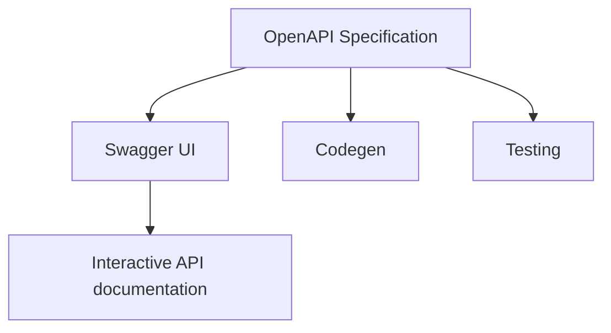
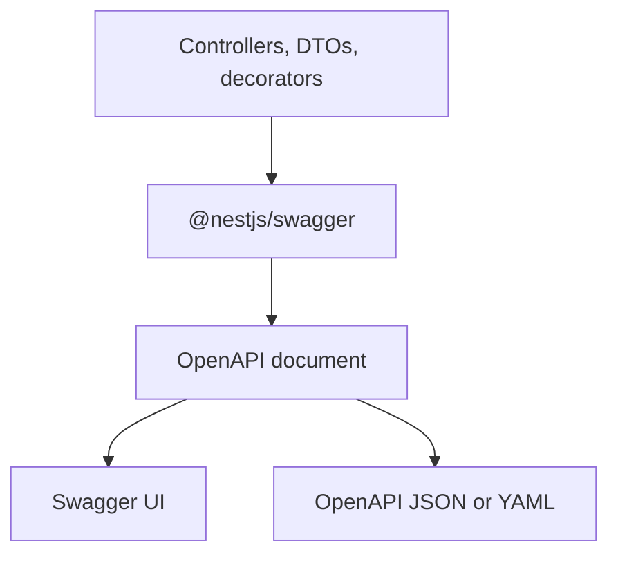
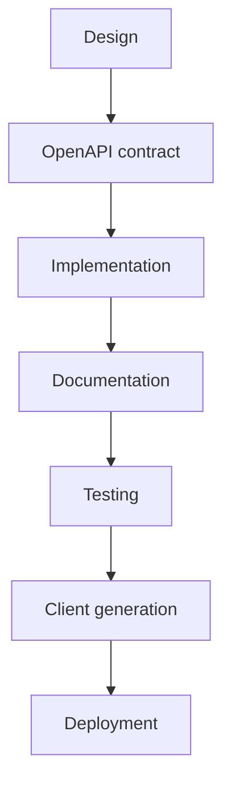
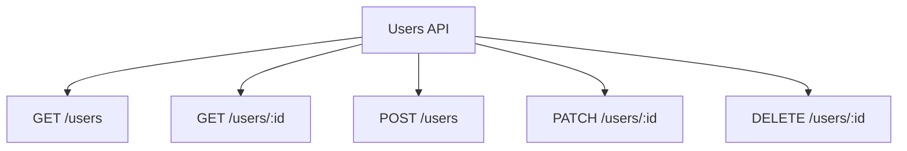

El equipo de móvil pregunta si `POST /users` devuelve `201` o `200`. Frontend trata `role` como un string. Backend publicó un enum el martes pasado. QA no puede distinguir un error de validación de un error de auth porque ambos se ven como `{ "statusCode": 400 }`. La API funciona. Nadie puede consumirla sin preguntarle al autor.

Eso no es un README que falta. Es un contrato que falta.

Una API NestJS sin un documento OpenAPI va a derivar. Los controladores cambian, los DTOs ganan campos opcionales, y los clientes adivinan. OpenAPI es la forma más barata de mantener ese contrato honesto — si tratas el documento como parte de la API, no como una página que abres una vez en Swagger UI.

> OpenAPI describe el contrato. Swagger UI lo renderiza. `@nestjs/swagger` genera el documento desde la aplicación. No son el mismo trabajo.

## Una API funcional puede seguir siendo inutilizable

Un endpoint que devuelve el JSON correcto en Postman puede seguir siendo caro de integrar. Los fallos habituales no son 500s. Son ambigüedades.

**Los endpoints son difíciles de descubrir.** La ruta existe. El método existe. Nadie sabe si la colección es `/users`, `/user` o `/v1/accounts` sin leer el controlador o preguntar en Slack.

**Los parámetros no están claros.** ¿`id` es un UUID o un entero? ¿`status` es un filtro en query o un segmento en el path? ¿Qué campos son obligatorios al crear, y cuáles se ignoran al actualizar?

**Los DTOs no coinciden con el contrato.** La clase tiene cinco propiedades. El schema OpenAPI está vacío porque TypeScript las borró. La UI muestra `{}`. Los clientes inventan la forma.

**Las respuestas son ambiguas.** El éxito puede ser `200` con un body, `201` con un header `Location`, o `204` sin nada. Los errores pueden ser el body de excepción por defecto de Nest, un envelope personalizado, o ambos, según el filter.

**No hay ejemplos.** Un schema que dice `email: string` no te dice si la API acepta `Ada Lovelace` en `name` o lo rechaza. Un ejemplo que todavía usa `"string"` es peor que no tener ejemplo: parece completo y está mal.

**Frontend, móvil y otros servicios integran por folclore.** Los tipos se copian a mano. Un rename de campo se convierte en un incidente de producción. Onboardear a un nuevo consumidor significa hacer pair con quien escribió el controlador.

OpenAPI no hace que esos problemas desaparezcan. Te da un lugar único y legible por máquinas para declarar el contrato HTTP: paths, operations, parameters, request bodies, responses, schemas y authentication. NestJS puede construir ese documento desde los mismos controladores y DTOs que implementan la API. El trabajo es mantener el documento verdadero.

## OpenAPI es el contrato

La [OpenAPI Specification](https://spec.openapis.org/oas/latest.html) es un formato agnóstico de lenguaje para describir APIs HTTP. La OpenAPI Initiative la publica. A septiembre de 2025 la última versión es **3.2.0**. Un archivo que conforma a esa especificación es un **documento OpenAPI** (la Initiative también llama OpenAPI Description al conjunto enlazado de archivos). Lo escribes en JSON o YAML. Los humanos pueden leerlo. Las herramientas pueden parsearlo.

El documento es el contrato. Responde, para cada operation:

- qué **server** y **path** llamas;
- qué **método HTTP** (la operation);
- qué **parameters** van en el path, query, header o cookie;
- cómo es el **request body**;
- qué **responses** deberías esperar, por status code y schema;
- qué **authentication** requiere la operation.

Un documento mínimo necesita `openapi`, `info` (`title` y `version`), y al menos uno de `paths`, `components` o `webhooks`. `openapi` es la versión de la especificación. `info.version` es la versión de _tu_ descripción de API. No son intercambiables. Learn OpenAPI es explícito sobre esa separación.

Un fragmento conceptual de Users se ve así. No es un archivo NestJS. Es la forma que Nest generará si la metadata está completa:

```yaml
openapi: 3.0.0
info:
  title: Users API
  version: 1.0.0
servers:
  - url: https://api.example.com
paths:
  /users:
    post:
      tags: [users]
      summary: Create a user
      requestBody:
        required: true
        content:
          application/json:
            schema:
              $ref: "#/components/schemas/CreateUserDto"
      responses:
        "201":
          description: User created
          content:
            application/json:
              schema:
                $ref: "#/components/schemas/UserResponseDto"
        "400":
          description: Validation failed
        "409":
          description: Email already registered
components:
  schemas:
    CreateUserDto:
      type: object
      required: [email, name, role]
      properties:
        email:
          type: string
          format: email
          example: ada@example.com
        name:
          type: string
          example: Ada Lovelace
        role:
          $ref: "#/components/schemas/UserRole"
    UserRole:
      type: string
      enum: [admin, editor, viewer]
```

No necesitas memorizar la especificación completa. Necesitas saber que cada campo que dejas sin documentar es un campo que otro equipo adivinará.

## OpenAPI no es Swagger

Swagger empezó como una especificación. SmartBear después donó esa especificación a la OpenAPI Initiative, y se convirtió en la OpenAPI Specification. Swagger quedó como un conjunto de herramientas alrededor de esa especificación. Los nombres quedaron. La gente todavía dice "agregar Swagger" cuando quiere decir "generar un documento OpenAPI y servir Swagger UI".

| Concepto              | Qué es                                                            |
| --------------------- | ----------------------------------------------------------------- |
| OpenAPI Specification | El estándar que define cómo describir una API HTTP                |
| Documento OpenAPI     | Un archivo JSON o YAML que conforma a ese estándar                |
| Swagger UI            | Una UI en navegador que renderiza un documento y te deja llamar operations |
| Swagger Editor        | Un editor en navegador para escribir e inspeccionar documentos    |
| Swagger Codegen       | Una herramienta que genera clientes y stubs de servidor desde un documento |
| `@nestjs/swagger`     | El módulo NestJS que construye un documento OpenAPI desde tu app  |

La propia documentación de Swagger establece la separación: OpenAPI es el formato de descripción; Swagger es el tooling (Editor, UI, Codegen y librerías relacionadas).



La confusión es barata porque `@nestjs/swagger` todavía usa `SwaggerModule`, el path por defecto de la UI en los docs de Nest es `/api`, y el README del paquete dice "OpenAPI (Swagger)". El documento que generas es un documento OpenAPI. La página en `/docs` es Swagger UI. Si tratas ambas cosas como lo mismo, optimizarás para un demo y publicarás un contrato que nadie más puede consumir.

## Por qué el contrato importa

Un ingeniero de frontend no debería necesitar una sesión de pair para saber que `PATCH /users/:id` omite `email`. Un ingeniero de QA no debería descubrir `409 Conflict` por accidente. Un segundo servicio no debería copiar una interfaz TypeScript de un hilo de Slack.

Un documento OpenAPI completo es cómo esos equipos comparten una descripción:

- **Experiencia de desarrollador.** El siguiente consumidor abre el documento, no el controlador.
- **Integración.** Frontend, móvil y backend acuerdan nombres, tipos y status codes antes del primer PR review que dice "el campo en realidad es `displayName`".
- **Menos roturas accidentales.** Un campo obligatorio que se vuelve opcional, o al revés, es visible en el diff del documento.
- **Onboarding.** Un nuevo miembro del equipo puede llamar `POST /users` desde Swagger UI con un ejemplo realista en lugar de reconstruir el body desde un DTO.
- **Testing.** Los contract tests y los mocks pueden validar contra el documento, no contra una colección de Postman grabada que expiró el trimestre pasado.
- **Generación de clientes.** El tooling oficial de Swagger puede generar clientes desde el documento. La calidad de esos clientes es la calidad de tus schemas.
- **Automatización.** CI puede fallar el build cuando el documento no se puede generar o cuando regresa.
- **Mantenimiento.** El documento envejece con el código si lo generas desde el código. Un archivo YAML escrito a mano envejece con quien se acordó de editarlo por última vez.

Si Swagger UI es el único artefacto que conservas, no tienes un contrato. Tienes un demo.

## Cómo NestJS construye el documento

`@nestjs/swagger` no scrapea comentarios y espera lo mejor. Recorre la aplicación Nest: módulos, controladores, route handlers, decoradores de parámetros, y las clases que esos handlers usan como DTOs. Los decoradores agregan la metadata que TypeScript no puede guardar. El resultado es un objeto serializable que conforma al documento OpenAPI.



`SwaggerModule.createDocument()` es el paso que produce ese objeto. Puedes servirlo a través de Swagger UI, exponerlo como JSON o YAML, o escribirlo a disco en CI. La introducción de Nest es explícita: el objeto es el documento; servirlo por HTTP es opcional.

Lo que el módulo puede inferir sin decoradores extra:

- El método HTTP y el path desde `@Get()`, `@Post()`, `@Controller()` y el resto de los decoradores de routing de Nest;
- que un parámetro es un argumento de path, query o body, desde `@Param()`, `@Query()` y `@Body()`;
- un _nombre_ de modelo desde la clase DTO.

Lo que no puede inferir solo desde TypeScript:

- las propiedades de esa clase (la metadata design:type no lista campos);
- si una propiedad es opcional;
- valores de enum, a menos que los declares;
- tipos de elementos de array, generics o interfaces;
- descripciones útiles, ejemplos o respuestas de error.

Esos vacíos son por qué existe `@ApiProperty()`, y por qué existe el CLI plugin oficial como alternativa. Dejarlos vacíos es cómo obtienes un Swagger UI lleno de schemas en blanco.

## Bootstrap de `@nestjs/swagger`

Instala el paquete. Las aplicaciones actuales de Nest 11 usan `@nestjs/swagger` 11.x (11.4.6 a julio de 2026). La API pública abajo es de la introducción oficial de OpenAPI.

```bash
npm install --save @nestjs/swagger
```

Después construye el documento en `main.ts`. Los docs actuales de Nest usan una **factory**: `createDocument()` se ejecuta cuando se solicita el documento, no durante el bootstrap. Ejemplos más antiguos — incluyendo la primera versión de este artículo — creaban el documento inmediatamente y pasaban el objeto a `setup()`. Eso todavía funciona. La factory evita pagar el costo de generación al iniciar.

```ts
import { NestFactory } from "@nestjs/core";
import { DocumentBuilder, SwaggerModule } from "@nestjs/swagger";
import { AppModule } from "./app.module";

async function bootstrap() {
  const app = await NestFactory.create(AppModule);

  const config = new DocumentBuilder()
    .setTitle("Users API")
    .setDescription("User accounts for the Mytheon platform")
    .setVersion("1.0")
    .addBearerAuth()
    .addTag("users", "User account operations")
    .addGlobalResponse({
      status: 500,
      description: "Unexpected server error",
    })
    .build();

  const documentFactory = () => SwaggerModule.createDocument(app, config);
  SwaggerModule.setup("docs", app, documentFactory);

  await app.listen(process.env.PORT ?? 3000);
}
bootstrap();
```

Qué hace cada pieza:

- **`DocumentBuilder`** llena el objeto base OpenAPI: `info.title`, `info.description`, `info.version`, tags y security schemes. No escanea rutas.
- **`setVersion("1.0")`** es `info.version` — la versión de _esta descripción de API_. No es la versión de la OpenAPI Specification.
- **`addBearerAuth()`** registra un HTTP bearer security scheme en el documento para que las operations puedan referenciarlo.
- **`addTag()`** declara un tag con descripción. `@ApiTags('users')` en un controlador asocia operations a ese tag.
- **`addGlobalResponse()`** adjunta una respuesta a cada operation. Úsalo para errores que son verdaderamente globales (`500`), no para errores de negocio que solo algunas rutas devuelven.
- **`createDocument(app, config)`** recorre la aplicación y fusiona las rutas en el documento base.
- **`setup("docs", app, documentFactory)`** monta Swagger UI en `/docs`. Por defecto Nest también sirve el documento crudo en `/docs-json` y `/docs-yaml`.

Abre `http://localhost:3000/docs`. Deberías ver la UI. Abre `http://localhost:3000/docs-json` y deberías ver el documento OpenAPI. Ese archivo JSON es el artefacto que consumen los clientes, los contract tests y el codegen.

Puedes renombrar las rutas crudas:

```ts
SwaggerModule.setup("docs", app, documentFactory, {
  jsonDocumentUrl: "docs/openapi.json",
  yamlDocumentUrl: "docs/openapi.yaml",
});
```

### Desarrollo versus producción

Sirve Swagger UI en desarrollo. En producción, o deshabilita la UI o ponla detrás de autenticación. Un `/docs` público en una API de producción es un mapa de cada operation, incluyendo las que olvidaste proteger.

`ui` y `raw` son independientes. `swaggerUiEnabled` está deprecado; usa `ui`. Deshabilitar la UI no deshabilita el JSON. Deshabilitar `raw` no deshabilita la UI.

```ts
const isProd = process.env.NODE_ENV === "production";

SwaggerModule.setup("docs", app, documentFactory, {
  ui: !isProd,
  raw: ["json"],
});
```

En producción esto mantiene `/docs-json` (o tu `jsonDocumentUrl` personalizado) disponible para CI y consumidores internos, y deja de servir la UI interactiva. Si el documento en sí es sensible, tampoco expongas `raw` en el listener público. Escribe el archivo en CI en su lugar:

```ts
import { writeFileSync } from "node:fs";

const document = SwaggerModule.createDocument(app, config);
writeFileSync("./openapi.json", JSON.stringify(document, null, 2));
```

Trata un documento que no se puede generar como un build fallido. Un pipeline verde con un schema vacío es cómo la deriva se convierte en un release.

El documento generado declara `openapi: 3.0.0` a menos que lo cambies. `@nestjs/swagger` 11.x puede emitir 3.1 y 3.2. Los tags jerárquicos (`parent`, `kind` en `addTag()`) requieren OpenAPI 3.2 y una versión explícita:

```ts
const config = new DocumentBuilder()
  .setOpenAPIVersion("3.2.0")
  .addTag("Accounts", "Account domain", undefined, { kind: "nav" })
  .addTag("users", "User account operations", undefined, { parent: "Accounts" })
  .build();
```

No actives ese switch porque 3.2 es más nuevo. Actívalo cuando todos los consumidores del documento — UI, validadores, codegen, gateways — entiendan esa versión. Un campo 3.2 en un documento que todavía dice `openapi: 3.0.0` fallará en validadores estrictos. Nest documenta esa advertencia en la página de operations.

## Documenta controladores cuando la metadata no es suficiente

`SwaggerModule` ya conoce el path, el método, y qué argumentos son `@Body()`, `@Query()` o `@Param()`. No necesitas un decorador en cada línea para probar que leíste los docs. Necesitas metadata extra cuando el panorama automático está incompleto o es engañoso.

| Decorador                      | Cuándo usarlo                                                                                                                                                                                                                      |
| ------------------------------ | ---------------------------------------------------------------------------------------------------------------------------------------------------------------------------------------------------------------------------------- |
| `@ApiTags()`                   | Agrupa operations en la UI. Opcional si `autoTagControllers` está en su default (`true`), que tagea desde el nombre del controlador menos `Controller`. Úsalo cuando el nombre sería incorrecto (`UsersHttpController` → no `users`). |
| `@ApiOperation()`              | Summary, description, `operationId`, deprecation. Úsalo cuando el nombre del método no es una frase en la que un consumidor pueda confiar.                                                                                         |
| `@ApiResponse()` y atajos      | Status codes y response schemas. Úsalos. Documentación solo de éxito es cómo los clientes aprenden los errores en producción.                                                                                                       |
| `@ApiParam()`                  | Descripción extra, ejemplo o enum en un path parameter. Omítelo cuando `@Param('id') id: string` ya es suficiente.                                                                                                                  |
| `@ApiQuery()`                  | Lo mismo, para query parameters. Requerido cuando el query no es un argumento simple decorado, o cuando necesitas `enum` / `isArray`.                                                                                               |
| `@ApiBody()`                   | Schema de body explícito. Requerido para arrays y generics (`CreateUserDto[]`). Opcional cuando `@Body() dto: CreateUserDto` ya apunta a una clase documentada.                                                                     |

Los atajos heredan de `@ApiResponse()`. Prefiere el que coincide con el status que realmente devuelves:

```ts
@ApiCreatedResponse({ type: UserResponseDto, description: "User created" })
@ApiBadRequestResponse({ description: "Validation failed" })
@ApiConflictResponse({ description: "Email already registered" })
```

El conjunto completo está en la guía de operations de Nest (`@ApiOkResponse`, `@ApiNoContentResponse`, `@ApiUnauthorizedResponse`, `@ApiNotFoundResponse` y el resto). `@ApiDefaultResponse()` es la respuesta `default` de OpenAPI, no "el happy path".

Un controlador que solo lista usuarios puede quedarse delgado:

```ts
@ApiTags("users")
@Controller("users")
export class UsersController {
  @Get()
  @ApiOkResponse({ type: [UserResponseDto] })
  findAll(@Query("role") role?: UserRole): Promise<UserResponseDto[]> {
    return this.usersService.findAll(role);
  }
}
```

`@ApiQuery({ name: "role", enum: UserRole, required: false })` vale la pena en el momento en que quieres que la UI muestre un select en lugar de una caja de texto libre. Hasta entonces, el argumento `@Query()` es suficiente para que el parámetro exista en el documento.

`@ApiBody()` es la válvula de escape que la reflexión de TypeScript no te da:

```ts
@Post("bulk")
@ApiBody({ type: [CreateUserDto] })
createBulk(@Body() body: CreateUserDto[]) {
  return this.usersService.createBulk(body);
}
```

Sin `@ApiBody()`, un body genérico o array frecuentemente se genera como un schema vacío o incorrecto. Eso es un límite de la metadata de TypeScript, no un bug de Nest.

## Los DTOs son el schema

El documento es tan bueno como las clases que pones en `@Body()` y en `@ApiOkResponse({ type })`. Si esas clases no tienen metadata OpenAPI, Swagger UI muestra un modelo vacío. La página de types-and-parameters de Nest demuestra esto con un DTO que tiene campos en TypeScript y ninguno en el documento hasta que agregas `@ApiProperty()` o habilitas el CLI plugin.

```ts
import { ApiProperty, ApiPropertyOptional } from "@nestjs/swagger";
import { IsEmail, IsEnum, IsOptional, IsString, MaxLength } from "class-validator";

export enum UserRole {
  Admin = "admin",
  Editor = "editor",
  Viewer = "viewer",
}

export class CreateUserDto {
  @ApiProperty({
    example: "ada@example.com",
    description: "Unique login email. Case-insensitive.",
  })
  @IsEmail()
  email: string;

  @ApiProperty({
    example: "Ada Lovelace",
    description: "Display name shown in the product.",
    maxLength: 80,
  })
  @IsString()
  @MaxLength(80)
  name: string;

  @ApiProperty({
    enum: UserRole,
    enumName: "UserRole",
    example: UserRole.Editor,
  })
  @IsEnum(UserRole)
  role: UserRole;

  @ApiPropertyOptional({
    example: "Engineering",
    description: "Optional department label. Omitted means unset, not empty.",
  })
  @IsOptional()
  @IsString()
  department?: string;
}
```

`@ApiProperty()` hace el campo visible y te permite establecer campos del Schema Object: `description`, `example`, `enum`, `type`, `minimum`, `default`. `@ApiPropertyOptional()` es el atajo oficial para `{ required: false }`.

`@ApiProperty` no valida la petición. `class-validator` sí, si ejecutas `ValidationPipe`. Mantenlos alineados: un campo que es obligatorio en el pipe debe ser obligatorio en el documento. Un desajuste es una mentira en uno de los dos lugares en los que confían los clientes.

### Tipos que TypeScript no conservará

**Arrays.** La reflexión no guarda el tipo de elemento. Decláralo:

```ts
@ApiProperty({ type: [String], example: ["engineering", "platform"] })
tags: string[];
```

`type: [String]` o `isArray: true` son las dos formas oficiales.

**Enums.** Pasa el enum (o un array de valores) y, si los clientes generarán código, pasa `enumName`. Sin `enumName`, cada propiedad inlinea su propio enum. El codegen entonces emite `CreateUserDtoRoleEnum` y `UserResponseDtoRoleEnum` para los mismos tres strings.

**Referencias circulares.** Usa un tipo lazy: `@ApiProperty({ type: () => AddressDto })`.

**Generics e interfaces.** TypeScript no emite nada útil. No pongas `CreateUserDto[]` o `Paginated<User>` en un handler y esperes un schema correcto. Usa `@ApiBody({ type: [CreateUserDto] })`, `allOf` + `getSchemaPath()`, o una clase concreta.

**Nombre del schema.** El nombre de la clase se convierte en el nombre del schema (`CreateUserDto`). `@ApiSchema({ name: "CreateUserRequest", description: "..." })` cambia eso cuando el nombre de la clase filtrarría un sufijo DTO que no quieres en clientes generados.

Oculta campos que nunca deben aparecer: `@ApiHideProperty()` en passwords, tokens y flags internos.

### Mapped types

`PATCH /users/:id` no debería duplicar `CreateUserDto` con cada campo opcional. Importa `PartialType` desde `@nestjs/swagger`, no desde `@nestjs/mapped-types`. La copia de Swagger copia metadata OpenAPI. La copia de mapped-types no.

```ts
import { PartialType } from "@nestjs/swagger";

export class UpdateUserDto extends PartialType(CreateUserDto) {}
```

`PickType`, `OmitType` e `IntersectionType` son la misma familia. Se componen: `PartialType(OmitType(CreateUserDto, ['email'] as const))` es un tipo de update válido si email es inmutable.

### El CLI plugin

El CLI plugin oficial de Swagger es opt-in. Se ejecuta en tiempo de compilación, recorre el AST, e inyecta los decoradores que TypeScript no puede expresar en runtime. Nest lista lo que hace: anota propiedades de DTO con `@ApiProperty` a menos que esté presente `@ApiHideProperty`; establece `required` desde `?`; establece `type` / `enum` (incluyendo arrays); establece `default` desde inicializadores; opcionalmente copia restricciones de `class-validator`; agrega un decorador de respuesta desde el tipo de retorno; y, si `introspectComments` está en true, convierte JSDoc en descripciones y valores `@example`.

Habilítalo en `nest-cli.json`:

```json
{
  "compilerOptions": {
    "plugins": [
      {
        "name": "@nestjs/swagger",
        "options": {
          "introspectComments": true
        }
      }
    ]
  }
}
```

Con el plugin, el DTO de create puede verse así — si el archivo se llama `create-user.dto.ts`:

```ts
export class CreateUserDto {
  /**
   * Unique login email. Case-insensitive.
   * @example ada@example.com
   */
  @IsEmail()
  email: string;

  /**
   * Display name shown in the product.
   * @example Ada Lovelace
   */
  @IsString()
  @MaxLength(80)
  name: string;

  @IsEnum(UserRole)
  role: UserRole = UserRole.Viewer;

  @IsOptional()
  @IsString()
  department?: string;
}
```

Esa es la ventaja: menos metadata duplicada. Las contrapartidas son reales.

- **Nombres de archivo.** Por defecto solo se analizan `*.dto.ts` y `*.entity.ts`. Un `create-user.model.ts` es invisible. Cambia `dtoFileNameSuffix` o renombra el archivo.
- **La validación runtime sigue siendo tuya.** El plugin documenta. `class-validator` todavía tiene que ejecutarse. La página del plugin de Nest es explícita: mantén `@IsEmail()` y sus compañeros.
- **SWC.** El plugin es un transformer de TypeScript. `nest start -b swc` necesita `--type-check`, o generas metadata serializada y la cargas con `SwaggerModule.loadPluginMetadata()`.
- **Jest e2e.** `ts-jest` no usa el Nest CLI. Debes registrar el transformer o tu app e2e generará schemas vacíos.
- **Overrides.** Un `@ApiProperty()` explícito gana. Úsalo para enums con `enumName`, raw schemas, y cualquier cosa que el AST no pueda ver.

Usa el plugin cuando el equipo mantendrá la convención de nombres de archivo y el pipeline de compilación. Usa decoradores explícitos cuando el proyecto es pequeño, usa SWC sin metadata, o ya tiene un estilo de DTO que no coincide con `*.dto.ts`. Cualquiera de las dos opciones es válida. Mezclarlas sin una regla es cómo la mitad de los schemas están vacíos.

## Un contrato útil de `POST /users`

Una operation útil le dice a otro desarrollador cómo llamarla, cómo es el éxito, y cómo es el fallo. `POST /users` es el primer camino de escritura habitual. Documenta el body, el recurso creado, y los errores que son parte de la interfaz — no solo `201`.

```ts
@Post()
@ApiOperation({
  summary: "Create a user",
  description:
    "Registers a user with a unique email. The password is set through a separate invite flow; this operation does not accept one.",
})
@ApiCreatedResponse({
  description: "User created. The id is a server-generated UUID.",
  type: UserResponseDto,
})
@ApiBadRequestResponse({ description: "Validation failed." })
@ApiUnauthorizedResponse({ description: "Missing or invalid bearer token." })
@ApiConflictResponse({ description: "Email already registered." })
create(@Body() body: CreateUserDto): Promise<UserResponseDto> {
  return this.usersService.create(body);
}
```

```ts
export class UserResponseDto {
  @ApiProperty({
    format: "uuid",
    example: "3b0d1a2e-7c4f-4a11-9d2a-1f0b6c8e9a10",
  })
  id: string;

  @ApiProperty({ example: "ada@example.com" })
  email: string;

  @ApiProperty({ example: "Ada Lovelace" })
  name: string;

  @ApiProperty({ enum: UserRole, enumName: "UserRole", example: UserRole.Editor })
  role: UserRole;

  @ApiPropertyOptional({ example: "Engineering", nullable: true })
  department?: string | null;

  @ApiProperty({ example: "2026-08-15T18:02:11.000Z" })
  createdAt: Date;
}
```

Lo que un consumidor ahora puede hacer sin abrir el servicio:

- enviar `{ email, name, role, department? }`;
- esperar `201` y un body con `id` y `createdAt`;
- esperar `400` cuando el email no es un email;
- esperar `401` cuando falta el bearer token;
- esperar `409` cuando el email ya está tomado;
- no enviar una contraseña, porque no está en el schema.

Si tu exception filter envuelve errores como `{ code, message, details }`, documenta esa clase y apunta las respuestas de error hacia ella. Un `400` con solo una descripción y sin schema todavía deja al cliente adivinando el body. La excepción JSON por defecto de Nest también es un schema. O te comprometes con ella o la reemplazas — después describe la que realmente devuelves.

## Bearer auth en el documento y en Swagger UI

Declarar autenticación en el documento no es lo mismo que aplicarla. Los guards la aplican. OpenAPI les dice a los consumidores que el guard existe y qué scheme usar.

Dos pasos, ambos requeridos:

1. Registra el scheme en el documento con `DocumentBuilder.addBearerAuth()`.
2. Asocia el scheme a un controlador u operation con `@ApiBearerAuth()`.

```ts
const config = new DocumentBuilder()
  .setTitle("Users API")
  .setVersion("1.0")
  .addBearerAuth()
  .build();
```

```ts
@ApiTags("users")
@ApiBearerAuth()
@Controller("users")
export class UsersController {}
```

`@ApiBearerAuth()` en el controlador aplica a cada operation. Ponlo solo en `create`, `update` y `remove` si `GET /users` es público. `@ApiSecurity('basic')` es la forma genérica; `addBearerAuth` / `@ApiBearerAuth` son el par integrado para HTTP bearer.

En Swagger UI, **Authorize** guarda el token y envía `Authorization: Bearer <token>` en los siguientes llamados de Try it out. Eso es una conveniencia para humanos. No es un control de seguridad. Una UI sin autenticación que puede llegar a producción sigue siendo una API de producción con una superficie de ataque documentada.

Si registras más de un bearer scheme, pasa un nombre como segundo argumento a `addBearerAuth()` y el mismo nombre a `@ApiBearerAuth('access-token')`. La forma sin argumentos es suficiente para un solo JWT.

## Los ejemplos son parte del contrato

Un schema sin ejemplos obliga a cada consumidor a inventar un payload. Un schema con `"string"` / `0` / `true` como ejemplos los entrena con valores que la API rechazará. El soporte oficial de Nest es la clave `example` en `@ApiProperty()`, y `examples` cuando quieres alternativas nombradas.

```ts
@ApiProperty({
  example: "ada@example.com",
  description: "Unique login email. Case-insensitive.",
})
email: string;
```

```ts
@ApiProperty({
  examples: {
    editor: { value: UserRole.Editor },
    admin: { value: UserRole.Admin },
  },
  enum: UserRole,
  enumName: "UserRole",
})
role: UserRole;
```

Usa valores que aceptarías en staging:

- emails que parecen emails, no `"user@user.com"` copiado de un tutorial si tu dominio rechaza ese host;
- UUIDs en `id`, no `"1"` si la columna es un UUID;
- timestamps ISO-8601 si serializas `Date` como strings ISO;
- un ejemplo de `409` que muestre el envelope de error, no otra copia de `UserResponseDto`.

También puedes adjuntar ejemplos en `@ApiBody()` y `@ApiCreatedResponse()` cuando los ejemplos a nivel de propiedad no son suficientes para mostrar un payload completo. Mantenlos sincronizados con el DTO. Un ejemplo que incluye `password` después de que eliminaste el campo es un defecto.

El CLI plugin puede extraer `@example` de JSDoc cuando `introspectComments` está en true. Esa es la forma con menos duplicación para mantener prosa y ejemplos junto al campo. Sigue siendo tu trabajo hacer que esos ejemplos sean verdaderos.

## Organiza una API grande

Una API de Users de 12 rutas puede vivir en un controlador. Una API de plataforma no. El documento se pudrirá en los mismos lugares donde se pudre el código: tags mezclados, nombres inconsistentes, formas de error ad-hoc, y una sola UI que vuelca cada dominio en una página.

**Los tags siguen dominios, no capas.** `users`, `orders`, `billing` — no `controllers` y `admin`. `@ApiTags()` más `DocumentBuilder.addTag()` le da a la UI una descripción, no solo una etiqueta. Los tags jerárquicos de OpenAPI 3.2 (`parent`, `kind`) existen en `@nestjs/swagger` 11.4+ si estableces `setOpenAPIVersion('3.2.0')`. Omítelos hasta que el resto de la cadena de herramientas entienda 3.2.

**Los controladores se mantienen delgados.** La metadata OpenAPI pertenece al borde HTTP: controladores y DTOs. No decores entidades para "reutilizar" un schema si la entidad tiene `passwordHash`.

**Los DTOs son los tipos públicos.** `CreateUserDto`, `UpdateUserDto`, `UserResponseDto` son tres contratos. Compartir una clase para los tres es cómo `PATCH` de repente requiere `email`.

**Los nombres se mantienen estables.** `email` es `email` en create, update y response. Los clientes generados copian esos nombres. Un rename cosmético es un breaking change.

**Los bodies de error se mantienen con una forma.** `addGlobalResponse()` cubre `401` y `500` si son uniformes. Los errores de dominio (`409` en create, `404` en get) se quedan en la operation. Si cada equipo inventa un `{ error: string }` diferente, el codegen no puede ayudar.

**Los schemas reutilizables ganan al copy-paste.** `UserRole` con `enumName`, `UserResponseDto` en cada path de éxito, `PartialType` para updates. `@ApiExtraModels()` existe para clases que nunca aparecen directamente en un handler (pagination wrappers, uniones discriminadas). `getSchemaPath()` es cómo les haces `$ref`.

**Múltiples documentos cuando una UI es ruido.** `createDocument(app, config, { include: [UsersModule] })` construye un documento desde un subconjunto de módulos. Puedes montar `/docs/users` y `/docs/billing`, u ofrecer un dropdown con `explorer: true` y `swaggerOptions.urls`. Eso es una feature oficial, no un hack.

El documento tiene que cambiar cuando el contrato cambia. Un PR que agrega un campo obligatorio y no cambia el documento es un PR incompleto. Genera desde el código para que esa afirmación sea mayormente automática. Revisa la UI renderizada o el diff del JSON de la misma forma que revisas el handler.

## Tres "versiones" diferentes

`/api/v1` y `/api/v2` no son la versión de OpenAPI. Tres números de versión aparecen en este stack, y mezclarlos es una fuente común de clientes rotos.

| Lo que la gente dice | Lo que realmente es                                   | Dónde vive                                                                                          |
| -------------------- | ----------------------------------------------------- | --------------------------------------------------------------------------------------------------- |
| "OpenAPI 3.0"        | Versión de la especificación a la que conforma el documento | Campo raíz `openapi`. Default de `@nestjs/swagger`: `3.0.0`. Cambia con `setOpenAPIVersion()`. |
| "API version 1.0"    | Versión de esta descripción / este release de la API | `info.version`, establecido por `DocumentBuilder.setVersion()`.                                     |
| "`/v1/users`"        | Una versión de routing de la API HTTP                | `enableVersioning()` de Nest. URI versioning prefija rutas con `v` por defecto.                     |

Versionando la aplicación:

```ts
import { VersioningType } from "@nestjs/common";

app.enableVersioning({
  type: VersioningType.URI,
  defaultVersion: "1",
});
```

```ts
@Controller({ path: "users", version: "1" })
export class UsersControllerV1 {}

@Controller({ path: "users", version: "2" })
export class UsersControllerV2 {}
```

Esos controladores se convierten en `/v1/users` y `/v2/users` (después de cualquier prefijo global). Pueden aparecer en un documento OpenAPI como dos path items, o en dos documentos vía `include` si v1 y v2 no deben compartir una UI.

`setVersion("2.0")` **no** crea `/v2`. Solo cambia `info.version`. `setOpenAPIVersion("3.2.0")` **no** versiona tu producto. Cambia el formato del documento. Learn OpenAPI y la OpenAPI Specification ambos advierten que `openapi` e `info.version` son campos diferentes. El versioning de Nest es un tercer mecanismo encima.

Cuando introduzcas `/v2`, decide si el documento es un contrato con dos prefijos de path o dos contratos con dos valores de `info.version`. Ambos son válidos. Pretender que `setVersion("2.0")` hizo el routing no lo es.

## OpenAPI más allá de Swagger UI

Swagger UI es el consumidor más visible del documento. No es la razón para generar uno. Una vez que la API puede describirse a sí misma, el mismo archivo impulsa el resto del ciclo de vida.



Los equipos empiezan en flechas diferentes. Algunos escriben el documento primero y generan stubs (design-first). El camino habitual de Nest es implementation-first: la aplicación es la fuente, `@nestjs/swagger` emite el documento. De cualquier manera, el documento es el artefacto compartido.

La propia lista de Swagger "Why use OpenAPI?" es la oficial: generar stubs de servidor, generar clientes en muchos lenguajes, renderizar documentación interactiva, y alimentar herramientas de API (testing, gateways, linting). El ecosistema de herramientas de la OpenAPI Initiative está construido sobre la misma idea. Ninguno de esos trabajos requiere una pestaña de navegador.

Usos prácticos que no son la UI:

- **Documentación** — el archivo JSON/YAML o un portal de documentación, todo desde el mismo documento.
- **Generación de clientes** — tipos TypeScript para el frontend, un cliente Kotlin para móvil. Schemas basura producen clientes basura.
- **Testing** — validación de schema de respuestas en CI; contract tests que fallan cuando desaparece un status code.
- **Mocking** — un servidor mock desde el documento para que frontend pueda empezar antes de que `POST /users` esté implementado.
- **Validación** — validación de peticiones contra el documento en el edge, además del `ValidationPipe` en el proceso.
- **Integración** — el archivo que adjuntas al ticket en lugar de un screenshot de Swagger UI.

Exporta el documento en CI aunque nunca abras `/docs` en producción. La UI es un visor. El archivo es el contrato.

## Una API pequeña de Users

El mismo dominio, lo suficientemente completo para copiar, lo suficientemente pequeño para leer. La autenticación es obligatoria en escrituras. Las lecturas son públicas. Los errores están documentados. Los ejemplos son valores que enviarías.



### `main.ts`

```ts
import { ValidationPipe } from "@nestjs/common";
import { NestFactory } from "@nestjs/core";
import { DocumentBuilder, SwaggerModule } from "@nestjs/swagger";
import { AppModule } from "./app.module";

async function bootstrap() {
  const app = await NestFactory.create(AppModule);
  app.useGlobalPipes(new ValidationPipe({ whitelist: true, forbidNonWhitelisted: true }));

  const config = new DocumentBuilder()
    .setTitle("Users API")
    .setDescription("Create, read, update, and disable user accounts.")
    .setVersion("1.0")
    .addBearerAuth()
    .addTag("users", "User account operations")
    .addGlobalResponse({ status: 500, description: "Unexpected server error" })
    .build();

  const documentFactory = () => SwaggerModule.createDocument(app, config);
  const isProd = process.env.NODE_ENV === "production";

  SwaggerModule.setup("docs", app, documentFactory, {
    ui: !isProd,
    raw: ["json"],
  });

  await app.listen(process.env.PORT ?? 3000);
}
bootstrap();
```

### DTOs

```ts
import { ApiProperty, ApiPropertyOptional, PartialType } from "@nestjs/swagger";
import { IsEmail, IsEnum, IsOptional, IsString, MaxLength } from "class-validator";

export enum UserRole {
  Admin = "admin",
  Editor = "editor",
  Viewer = "viewer",
}

export class CreateUserDto {
  @ApiProperty({
    example: "ada@example.com",
    description: "Unique login email. Case-insensitive.",
  })
  @IsEmail()
  email: string;

  @ApiProperty({ example: "Ada Lovelace", maxLength: 80 })
  @IsString()
  @MaxLength(80)
  name: string;

  @ApiProperty({
    enum: UserRole,
    enumName: "UserRole",
    example: UserRole.Editor,
  })
  @IsEnum(UserRole)
  role: UserRole;

  @ApiPropertyOptional({ example: "Engineering" })
  @IsOptional()
  @IsString()
  department?: string;
}

export class UpdateUserDto extends PartialType(CreateUserDto) {}

export class UserResponseDto {
  @ApiProperty({
    format: "uuid",
    example: "3b0d1a2e-7c4f-4a11-9d2a-1f0b6c8e9a10",
  })
  id: string;

  @ApiProperty({ example: "ada@example.com" })
  email: string;

  @ApiProperty({ example: "Ada Lovelace" })
  name: string;

  @ApiProperty({ enum: UserRole, enumName: "UserRole", example: UserRole.Editor })
  role: UserRole;

  @ApiPropertyOptional({ example: "Engineering", nullable: true })
  department?: string | null;

  @ApiProperty({ example: "2026-08-15T18:02:11.000Z" })
  createdAt: Date;
}
```

`UpdateUserDto` hereda metadata OpenAPI porque `PartialType` viene de `@nestjs/swagger`. Email sigue siendo patcheable aquí; si tu producto prohíbe cambiarlo, usa `PartialType(OmitType(CreateUserDto, ['email'] as const))` en lugar de un comentario en el controlador.

### Controller

```ts
import {
  Body,
  Controller,
  Delete,
  Get,
  HttpCode,
  Param,
  ParseUUIDPipe,
  Patch,
  Post,
  Query,
} from "@nestjs/common";
import {
  ApiBadRequestResponse,
  ApiBearerAuth,
  ApiConflictResponse,
  ApiCreatedResponse,
  ApiNoContentResponse,
  ApiNotFoundResponse,
  ApiOkResponse,
  ApiOperation,
  ApiQuery,
  ApiTags,
  ApiUnauthorizedResponse,
} from "@nestjs/swagger";
import { CreateUserDto, UpdateUserDto, UserResponseDto, UserRole } from "./dto/create-user.dto";
import { UsersService } from "./users.service";

@ApiTags("users")
@Controller("users")
export class UsersController {
  constructor(private readonly usersService: UsersService) {}

  @Get()
  @ApiOperation({ summary: "List users" })
  @ApiQuery({ name: "role", enum: UserRole, required: false })
  @ApiOkResponse({ type: [UserResponseDto] })
  findAll(@Query("role") role?: UserRole): Promise<UserResponseDto[]> {
    return this.usersService.findAll(role);
  }

  @Get(":id")
  @ApiOperation({ summary: "Get a user by id" })
  @ApiOkResponse({ type: UserResponseDto })
  @ApiNotFoundResponse({ description: "No user with that id." })
  findOne(@Param("id", ParseUUIDPipe) id: string): Promise<UserResponseDto> {
    return this.usersService.findOne(id);
  }

  @Post()
  @ApiBearerAuth()
  @ApiOperation({ summary: "Create a user" })
  @ApiCreatedResponse({ type: UserResponseDto, description: "User created." })
  @ApiBadRequestResponse({ description: "Validation failed." })
  @ApiUnauthorizedResponse({ description: "Missing or invalid bearer token." })
  @ApiConflictResponse({ description: "Email already registered." })
  create(@Body() body: CreateUserDto): Promise<UserResponseDto> {
    return this.usersService.create(body);
  }

  @Patch(":id")
  @ApiBearerAuth()
  @ApiOperation({ summary: "Update a user" })
  @ApiOkResponse({ type: UserResponseDto })
  @ApiBadRequestResponse({ description: "Validation failed." })
  @ApiUnauthorizedResponse({ description: "Missing or invalid bearer token." })
  @ApiNotFoundResponse({ description: "No user with that id." })
  update(
    @Param("id", ParseUUIDPipe) id: string,
    @Body() body: UpdateUserDto,
  ): Promise<UserResponseDto> {
    return this.usersService.update(id, body);
  }

  @Delete(":id")
  @ApiBearerAuth()
  @HttpCode(204)
  @ApiOperation({ summary: "Delete a user" })
  @ApiNoContentResponse({ description: "User deleted." })
  @ApiUnauthorizedResponse({ description: "Missing or invalid bearer token." })
  @ApiNotFoundResponse({ description: "No user with that id." })
  remove(@Param("id", ParseUUIDPipe) id: string): Promise<void> {
    return this.usersService.remove(id);
  }
}
```

`ParseUUIDPipe` y `@ApiProperty({ format: "uuid" })` concuerdan: `id` es un UUID. `@HttpCode(204)` y `@ApiNoContentResponse()` concuerdan: delete no tiene body. `@ApiBearerAuth()` está en las escrituras, no en el list. El servicio es Nest ordinario y se omite a propósito — no cambia el contrato.

Conecta un `ValidationPipe` y un guard que realmente verifique el bearer token. El documento no hará eso por ti.

## Errores que rompen el contrato

**Documentar solo el camino exitoso.** Un cliente que solo conoce `201` manejará mal `409`. Los status codes que devuelves en producción pertenecen al documento.

**Dejar propiedades de DTO sin documentar.** Una clase sin `@ApiProperty()` (y sin el CLI plugin) genera un schema vacío. La UI parece configurada. El contrato es `{}`.

**Ejemplos que la API rechaza.** `"string"` para `email`, `"1"` para un UUID, un ejemplo de request que todavía incluye `password`. Los consumidores los copiarán.

**Un archivo YAML escrito a mano como fuente de verdad.** Divergirá. Genera desde controladores y DTOs. Si diseñas primero, el documento todavía tiene que verificarse contra la app en ejecución.

**Tratar Swagger UI como el contrato.** La UI es un renderer. El documento OpenAPI es el artefacto que versionas, difeas y alimentas al codegen.

**Exponer la UI — o el documento completo — en un host de producción público sin una decisión.** Las operations de admin internas, los campos no publicados y los auth schemes no deberían ser legibles por el mundo por defecto. `ui: false` no es una revisión de seguridad. Es el mínimo.

**Mezclar versiones de OpenAPI.** Tags jerárquicos 3.2 en un documento que todavía declara `3.0.0`. Los clientes y validadores no estarán de acuerdo. Establece `setOpenAPIVersion()` solo cuando quieras cambiar el formato.

**Habilitar el CLI plugin sin una historia de nombres de archivo y compilador.** Schemas vacíos en e2e, vacíos bajo SWC, vacíos para `*.model.ts`. El plugin es oficial. No es gratis.

**`setVersion("2.0")` como sustituto de `/v2`.** Eso actualiza `info.version`. No agrega una ruta.

**Importar `PartialType` desde `@nestjs/mapped-types` en un proyecto Swagger.** Los DTOs de update pierden metadata OpenAPI. Impórtalo desde `@nestjs/swagger`.

**Validación y documentación que no concuerdan.** `@IsOptional()` con un `@ApiProperty()` obligatorio, o al revés. Elige una fuente de obligatoriedad y mantén la otra sincronizada. El `classValidatorShim` del plugin (default `true`) puede copiar restricciones al schema; no puede inventar un pipe que olvidaste registrar.

## Checklist

- Las operations públicas aparecen en el documento OpenAPI.
- Cada operation documenta su request y su respuesta de éxito.
- Los status codes HTTP coinciden con lo que el handler y los filters realmente devuelven.
- Los ejemplos son payloads que la API acepta.
- Los authentication schemes están declarados y asociados a operations protegidas.
- Los campos de DTO son visibles (`@ApiProperty` o el CLI plugin) y se mantienen alineados con `class-validator`.
- Los nombres son consistentes entre schemas de create, update y response.
- Las respuestas de error que los clientes deben manejar están documentadas.
- Swagger UI y los documentos crudos no están expuestos en producción sin una decisión.
- El documento se genera en CI y se revisa cuando el contrato cambia.

## El documento es código

Si el documento OpenAPI y la API en ejecución no concuerdan, el cliente está mal de cualquier forma: confió en el documento, o confió en una conversación de pasillo. Genera el documento desde los mismos controladores y DTOs que publicas. Conserva Swagger UI para humanos que necesitan hacer click. Conserva el JSON para máquinas que necesitan generar, testear y mockear.

Un Try it out verde en localhost no es un contrato. Un documento que CI puede emitir, difear y fallar — eso es el contrato.

## Fuentes

- NestJS, [OpenAPI introduction](https://docs.nestjs.com/openapi/introduction) — `DocumentBuilder`, `createDocument`, factory setup, `ui` / `raw`, JSON and YAML URLs
- NestJS, [Types and parameters](https://docs.nestjs.com/openapi/types-and-parameters) — `@ApiProperty`, arrays, enums, `enumName`, examples, generics, `@ApiSchema`
- NestJS, [Operations](https://docs.nestjs.com/openapi/operations) — tags, `@ApiResponse` shortcuts, `addGlobalResponse`, OpenAPI 3.2 hierarchical tags, `setOpenAPIVersion`
- NestJS, [Security](https://docs.nestjs.com/openapi/security) — `addBearerAuth`, `@ApiBearerAuth`
- NestJS, [CLI plugin](https://docs.nestjs.com/openapi/cli-plugin) — AST plugin, filename suffixes, `introspectComments`, SWC and Jest trade-offs
- NestJS, [Mapped types](https://docs.nestjs.com/openapi/mapped-types) — `PartialType`, `PickType`, `OmitType` from `@nestjs/swagger`
- NestJS, [Other features](https://docs.nestjs.com/openapi/other-features) — global prefix, global responses, multiple specifications
- NestJS, [Decorators](https://docs.nestjs.com/openapi/decorators) — official decorator list and apply levels
- NestJS, [Versioning](https://docs.nestjs.com/techniques/versioning) — URI `/v1` versus document version
- OpenAPI Initiative, [OpenAPI Specification](https://spec.openapis.org/oas/latest.html) — current specification (3.2.0, 19 September 2025)
- OpenAPI Initiative, [Structure of an OpenAPI Description](https://learn.openapis.org/specification/structure.html) — `openapi` versus `info.version`, JSON/YAML
- Swagger, [What is OpenAPI?](https://swagger.io/docs/specification/v3_0/about/) — OpenAPI as the format, Swagger as the tooling, codegen and UI
- Swagger, [OpenAPI Specification](https://swagger.io/specification/) — published specification entry point
