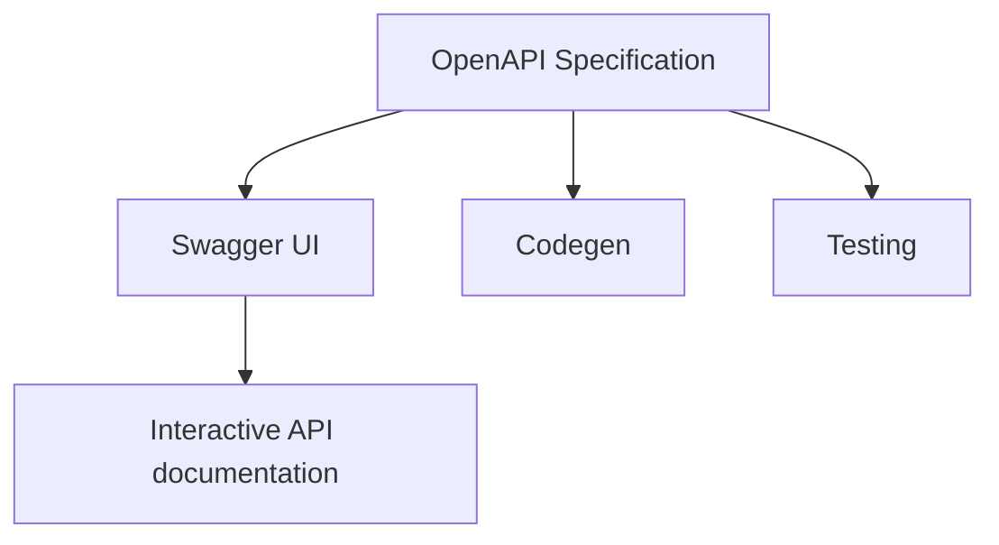
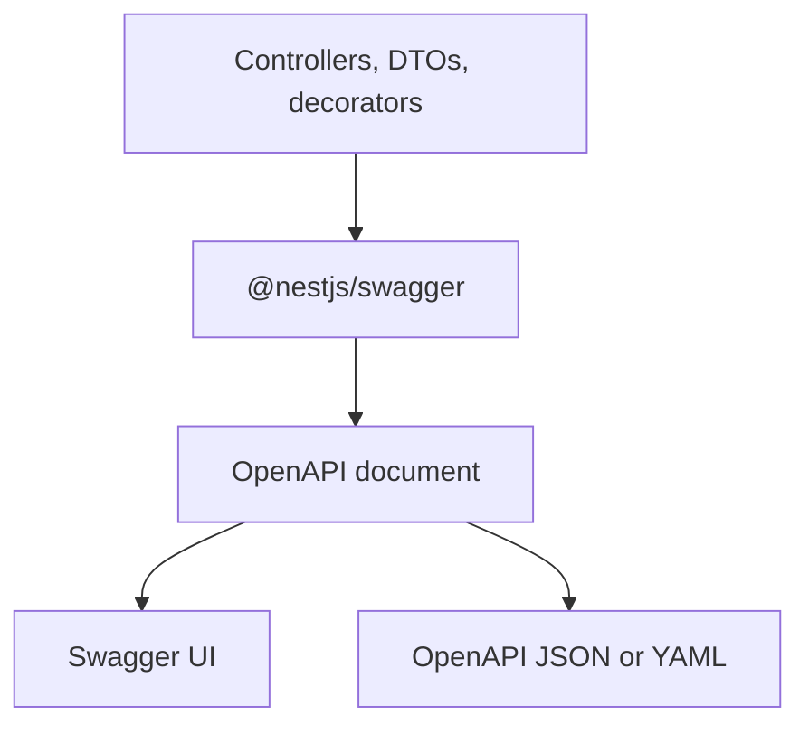

The mobile team asks whether `POST /users` returns `201` or `200`. Frontend treats `role` as a string. Backend shipped an enum last Tuesday. QA cannot tell a validation error from an auth error because both look like `{ "statusCode": 400 }`. The API works. Nobody can consume it without asking the author.

That is not a missing README. It is a missing contract.

A NestJS API without an OpenAPI document will drift. Controllers change, DTOs grow optional fields, and clients guess. OpenAPI is the cheapest way to keep that contract honest — if you treat the document as part of the API, not as a page you open once in Swagger UI.

> OpenAPI describes the contract. Swagger UI renders it. `@nestjs/swagger` generates the document from the application. They are not the same job.

## A working API can still be unusable

An endpoint that returns the right JSON in Postman can still be expensive to integrate. The usual failures are not 500s. They are ambiguities: routes nobody can discover without Slack; `id` that might be a UUID or an integer; a DTO with five TypeScript fields and an empty OpenAPI schema because reflection erased them; success that might be `200`, `201`, or `204`; examples that still say `"string"`. Frontend, mobile, and other services then integrate by folklore.

OpenAPI does not make those problems disappear. It gives you a single, machine-readable place to state the HTTP contract: paths, operations, parameters, request bodies, responses, schemas, and authentication. NestJS can build that document from the same controllers and DTOs that implement the API. The work is keeping the document true.

## OpenAPI is the contract

The [OpenAPI Specification](https://spec.openapis.org/oas/latest.html) is a language-agnostic format for describing HTTP APIs. The OpenAPI Initiative publishes it. As of September 2025 the latest version is **3.2.0**. A conforming file is an **OpenAPI document**. You write it in JSON or YAML.

The document answers, for each operation: which server and path, which HTTP method, which parameters, what the request body looks like, which responses to expect, and which authentication is required.

A minimal document needs `openapi`, `info` (`title` and `version`), and at least one of `paths`, `components`, or `webhooks`. `openapi` is the specification version. `info.version` is the version of _your_ API description. They are not interchangeable.

A conceptual fragment of what Nest generates when the metadata is complete:

```yaml
openapi: 3.0.0
info:
  title: Users API
  version: 1.0.0
paths:
  /users:
    post:
      requestBody:
        content:
          application/json:
            schema:
              $ref: "#/components/schemas/CreateUserDto"
      responses:
        "201":
          description: User created
        "409":
          description: Email already registered
```

Every field you leave undocumented is a field another team will guess.

## OpenAPI is not Swagger

Swagger started as a specification. SmartBear later donated that specification to the OpenAPI Initiative, and it became the OpenAPI Specification. Swagger remained as a set of tools around that specification. People still say "add Swagger" when they mean "generate an OpenAPI document and serve Swagger UI."

| Concept               | What it is                                                        |
| --------------------- | ----------------------------------------------------------------- |
| OpenAPI Specification | The standard that defines how to describe an HTTP API             |
| OpenAPI document      | A JSON or YAML file that conforms to that standard                |
| Swagger UI            | A browser UI that renders a document and lets you call operations |
| Swagger Editor        | A browser editor for writing and inspecting documents             |
| Swagger Codegen       | A tool that generates clients and server stubs from a document    |
| `@nestjs/swagger`     | The NestJS module that builds an OpenAPI document from your app   |

Swagger's own documentation states the split: OpenAPI is the description format; Swagger is the tooling.



The confusion is cheap because `@nestjs/swagger` still uses `SwaggerModule`, the default UI path in the Nest docs is `/api`, and the package README says "OpenAPI (Swagger)." The document you generate is an OpenAPI document. The page at `/docs` is Swagger UI. If you treat those as the same thing, you will optimize for a demo and ship a contract nobody else can consume.

## Why the contract matters

A complete OpenAPI document is how frontend, mobile, QA, and other services share one description: names, types, status codes, and examples — without pairing on the controller or copying an interface out of Slack. You get a diff when a required field becomes optional, clients and contract tests generated from schemas instead of folklore, and a CI check when the document cannot be generated. If Swagger UI is the only artifact you keep, you do not have a contract. You have a demo.

## How NestJS builds the document

`@nestjs/swagger` walks the Nest application: modules, controllers, route handlers, parameter decorators, and the classes those handlers use as DTOs. Decorators add the metadata TypeScript cannot store. The result is a serializable OpenAPI document.



`SwaggerModule.createDocument()` produces that object. You can serve it through Swagger UI, expose it as JSON or YAML, or write it to disk in CI. Nest's introduction is explicit: the object is the document; serving it over HTTP is optional.

What the module can infer without extra decorators: HTTP method and path from `@Get()`, `@Post()`, `@Controller()`; that a parameter is path, query, or body from `@Param()`, `@Query()`, `@Body()`; a model _name_ from the DTO class.

What it cannot infer from TypeScript alone: class properties (design:type metadata does not list fields); optionality; enum values; array item types, generics, or interfaces; useful descriptions, examples, or error responses. Those gaps are why `@ApiProperty()` exists, and why the official CLI plugin exists as an alternative. Leaving them empty is how you get a Swagger UI full of blank schemas.

## Bootstrap `@nestjs/swagger`

Install the package. Current Nest 11 applications use `@nestjs/swagger` 11.x (11.4.6 as of July 2026).

```bash
npm install --save @nestjs/swagger
```

The current Nest docs use a **factory**: `createDocument()` runs when the document is requested, not during bootstrap. That avoids paying the generation cost at startup.

```ts
import { NestFactory } from "@nestjs/core";
import { DocumentBuilder, SwaggerModule } from "@nestjs/swagger";
import { AppModule } from "./app.module";

async function bootstrap() {
  const app = await NestFactory.create(AppModule);

  const config = new DocumentBuilder()
    .setTitle("Users API")
    .setDescription("User accounts for the Mytheon platform")
    .setVersion("1.0")
    .addBearerAuth()
    .addTag("users", "User account operations")
    .addGlobalResponse({
      status: 500,
      description: "Unexpected server error",
    })
    .build();

  const documentFactory = () => SwaggerModule.createDocument(app, config);
  SwaggerModule.setup("docs", app, documentFactory);

  await app.listen(process.env.PORT ?? 3000);
}
bootstrap();
```

**`DocumentBuilder`** fills `info`, tags, and security schemes — it does not scan routes. **`setVersion("1.0")`** is `info.version`, not the OpenAPI Specification version. **`addBearerAuth()`** registers an HTTP bearer scheme. **`addTag()`** declares a tag; `@ApiTags('users')` attaches operations to it. **`addGlobalResponse()`** is for truly global errors (`500`). **`setup("docs", ...)`** mounts Swagger UI at `/docs` and, by default, the raw document at `/docs-json` and `/docs-yaml`.

Open `http://localhost:3000/docs` for the UI and `http://localhost:3000/docs-json` for the artifact clients consume. Rename the raw routes with `jsonDocumentUrl` / `yamlDocumentUrl`.

### Development versus production

Serve Swagger UI in development. In production, disable the UI or put it behind authentication. A public `/docs` is a map of every operation, including the ones you forgot to lock down.

`ui` and `raw` are independent. `swaggerUiEnabled` is deprecated; use `ui`. Disabling the UI does not disable the JSON.

```ts
const isProd = process.env.NODE_ENV === "production";

SwaggerModule.setup("docs", app, documentFactory, {
  ui: !isProd,
  raw: ["json"],
});
```

This keeps `/docs-json` for CI and internal consumers and stops serving the interactive UI. If the document itself is sensitive, do not expose `raw` on the public listener. Write the file in CI instead:

```ts
import { writeFileSync } from "node:fs";

const document = SwaggerModule.createDocument(app, config);
writeFileSync("./openapi.json", JSON.stringify(document, null, 2));
```

Treat a document that fails to generate as a failed build.

The generated document declares `openapi: 3.0.0` unless you change it. Hierarchical tags require OpenAPI 3.2 and `setOpenAPIVersion("3.2.0")`. Flip that switch only when every consumer understands that version.

## Document controllers when metadata is not enough

`SwaggerModule` already knows the path, the method, and which arguments are `@Body()`, `@Query()`, or `@Param()`. You need extra metadata when the automatic picture is incomplete or misleading.

| Decorator                      | When to use it                                                                                                  |
| ------------------------------ | --------------------------------------------------------------------------------------------------------------- |
| `@ApiTags()`                   | When `autoTagControllers` would tag from a misleading controller name (`UsersHttpController` → not `users`).    |
| `@ApiOperation()`              | Summary, description, `operationId`, deprecation — when the method name is not a sentence a consumer can trust. |
| `@ApiResponse()` and shortcuts | Status codes and response schemas. Success-only documentation is how clients learn errors in production.        |
| `@ApiParam()` / `@ApiQuery()`  | Extra description, example, or `enum` / `isArray`. Skip them when the decorated argument is already enough.     |
| `@ApiBody()`                   | Explicit body schema. Required for arrays and generics (`CreateUserDto[]`).                                     |

Prefer the shortcut that matches the status you actually return: `@ApiCreatedResponse`, `@ApiBadRequestResponse`, `@ApiConflictResponse`, and the rest from the Nest operations guide. `@ApiDefaultResponse()` is the OpenAPI `default` response, not "the happy path."

```ts
@Post("bulk")
@ApiBody({ type: [CreateUserDto] })
createBulk(@Body() body: CreateUserDto[]) {
  return this.usersService.createBulk(body);
}
```

Without `@ApiBody()`, a generic or array body is often generated as an empty or incorrect schema. That is a TypeScript metadata limit, not a Nest bug.

## DTOs are the schema

The document is only as good as the classes you put on `@Body()` and on `@ApiOkResponse({ type })`. If those classes have no OpenAPI metadata, Swagger UI shows an empty model.

```ts
@ApiProperty({
  example: "ada@example.com",
  description: "Unique login email. Case-insensitive.",
})
@IsEmail()
email: string;
```

`@ApiProperty()` makes the field visible and lets you set Schema Object fields: `description`, `example`, `enum`, `type`, `minimum`, `default`. `@ApiPropertyOptional()` is `{ required: false }`. `@ApiProperty` does not validate the request — `class-validator` does, if you run `ValidationPipe`. Keep them aligned.

**Examples are part of the contract.** A schema without examples forces every consumer to invent a payload. A schema with `"string"` / `0` / `true` trains them on values the API will reject. Use staging-real values: emails that look like emails, UUIDs in `id`, ISO-8601 timestamps, a `409` example that shows the error envelope. You can also set `examples` (named alternatives) and attach payload-level examples on `@ApiBody()` / `@ApiCreatedResponse()`. An example that still includes `password` after you removed the field is a defect.

**Arrays** need an explicit item type (`type: [String]` or `isArray: true`). **Enums** should pass `enumName` so codegen does not emit two enums for the same three strings. **Circular references** need `@ApiProperty({ type: () => AddressDto })`. **Generics and interfaces** emit nothing useful — use `@ApiBody({ type: [CreateUserDto] })` or a concrete class. Hide secrets with `@ApiHideProperty()`.

`PATCH /users/:id` should not duplicate `CreateUserDto` with every field optional. Import `PartialType` from `@nestjs/swagger`, not from `@nestjs/mapped-types` — only the Swagger copy copies OpenAPI metadata:

```ts
import { PartialType } from "@nestjs/swagger";

export class UpdateUserDto extends PartialType(CreateUserDto) {}
```

`PickType`, `OmitType`, and `IntersectionType` compose: `PartialType(OmitType(CreateUserDto, ['email'] as const))` if email is immutable.

### The CLI plugin

The official Swagger CLI plugin is opt-in. It walks the AST at compile time and injects the decorators TypeScript cannot express at runtime: `@ApiProperty` unless `@ApiHideProperty` is present; `required` from `?`; `type` / `enum`; `default` from initializers; optional `class-validator` constraints; a response decorator from the return type and if `introspectComments` is true, JSDoc descriptions and `@example` values.

```json
{
  "compilerOptions": {
    "plugins": [
      {
        "name": "@nestjs/swagger",
        "options": {
          "introspectComments": true
        }
      }
    ]
  }
}
```

With the plugin, a `create-user.dto.ts` can look like this:

```ts
export class CreateUserDto {
  /**
   * Unique login email. Case-insensitive.
   * @example ada@example.com
   */
  @IsEmail()
  email: string;

  @IsEnum(UserRole)
  role: UserRole = UserRole.Viewer;

  @IsOptional()
  @IsString()
  department?: string;
}
```

Less duplicated metadata. The trade-offs: only `*.dto.ts` and `*.entity.ts` are analysed by default; runtime validation is still yours; SWC needs `--type-check` or `SwaggerModule.loadPluginMetadata()`; Jest e2e must register the transformer; an explicit `@ApiProperty()` wins for `enumName` and anything the AST cannot see.

Use the plugin when the team will keep the filename convention and the compiler pipeline. Use explicit decorators when the project is small, uses SWC without metadata, or already has a DTO style that does not match `*.dto.ts`. Mixing them without a rule is how half the schemas are empty.

## Bearer auth in the document and in Swagger UI

Declaring authentication on the document is not the same as enforcing it. Guards enforce it. OpenAPI tells consumers that the guard exists.

Register the scheme with `DocumentBuilder.addBearerAuth()`, then attach it with `@ApiBearerAuth()` on the controller or on write operations only if `GET /users` is public. If you register more than one bearer scheme, pass the same name to both calls.

In Swagger UI, **Authorize** stores the token and sends `Authorization: Bearer <token>` on Try it out. That is a convenience for humans. It is not a security control.

## Organize a large API

Tags follow domains (`users`, `orders`, `billing`), not layers. Controllers stay thin: OpenAPI metadata belongs on the HTTP edge, not on entities that have `passwordHash`. `CreateUserDto`, `UpdateUserDto`, and `UserResponseDto` are three contracts — sharing one class is how `PATCH` suddenly requires `email`. Names stay stable; a cosmetic rename is a breaking change for generated clients. Error bodies stay one shape (`addGlobalResponse()` for uniform `401`/`500`; domain errors on the operation). `createDocument(app, config, { include: [UsersModule] })` builds a subset when one UI is noise.

A PR that adds a required field and does not change the document is an incomplete PR. Review the JSON diff the same way you review the handler.

## Three different "versions"

`/api/v1` and `/api/v2` are not the OpenAPI version. Three version numbers show up in this stack:

| What people say   | What it actually is                            | Where it lives                                                                 |
| ----------------- | ---------------------------------------------- | ------------------------------------------------------------------------------ |
| "OpenAPI 3.0"     | Specification version the document conforms to | Root field `openapi`. Default: `3.0.0`. Override with `setOpenAPIVersion()`.   |
| "API version 1.0" | Version of this description / this API release | `info.version`, set by `DocumentBuilder.setVersion()`.                         |
| "`/v1/users`"     | A routing version of the HTTP API              | Nest `enableVersioning()`. URI versioning prefixes routes with `v` by default. |

```ts
app.enableVersioning({ type: VersioningType.URI, defaultVersion: "1" });

@Controller({ path: "users", version: "1" })
export class UsersControllerV1 {}
```

Those controllers become `/v1/users`. `setVersion("2.0")` does **not** create `/v2`. `setOpenAPIVersion("3.2.0")` does **not** version your product. When you introduce `/v2`, decide whether the document is one contract with two path prefixes or two contracts with two `info.version` values. Pretending `setVersion("2.0")` did the routing is not valid.

## OpenAPI beyond Swagger UI

Swagger UI is the most visible consumer of the document, not the reason to generate one. The same file drives client generation, schema validation in CI, mock servers, and the artifact you attach to a ticket. Nest's usual path is implementation-first; design-first teams write the document first and generate stubs. Either way, export the document in CI even if you never open `/docs` in production. The UI is a viewer. The file is the contract.

## A small Users API

One complete example: authentication on writes, public reads, documented errors, examples you would send. Bootstrap is the `main.ts` above, plus a `ValidationPipe` and a guard that actually checks the bearer token — the document will not do that for you.

```ts
import { ApiProperty, ApiPropertyOptional, PartialType } from "@nestjs/swagger";
import { IsEmail, IsEnum, IsOptional, IsString, MaxLength } from "class-validator";

export enum UserRole {
  Admin = "admin",
  Editor = "editor",
  Viewer = "viewer",
}

export class CreateUserDto {
  @ApiProperty({
    example: "ada@example.com",
    description: "Unique login email. Case-insensitive.",
  })
  @IsEmail()
  email: string;

  @ApiProperty({ example: "Ada Lovelace", maxLength: 80 })
  @IsString()
  @MaxLength(80)
  name: string;

  @ApiProperty({
    enum: UserRole,
    enumName: "UserRole",
    example: UserRole.Editor,
  })
  @IsEnum(UserRole)
  role: UserRole;

  @ApiPropertyOptional({ example: "Engineering" })
  @IsOptional()
  @IsString()
  department?: string;
}

export class UpdateUserDto extends PartialType(CreateUserDto) {}

export class UserResponseDto {
  @ApiProperty({
    format: "uuid",
    example: "3b0d1a2e-7c4f-4a11-9d2a-1f0b6c8e9a10",
  })
  id: string;

  @ApiProperty({ example: "ada@example.com" })
  email: string;

  @ApiProperty({ example: "Ada Lovelace" })
  name: string;

  @ApiProperty({ enum: UserRole, enumName: "UserRole", example: UserRole.Editor })
  role: UserRole;

  @ApiPropertyOptional({ example: "Engineering", nullable: true })
  department?: string | null;

  @ApiProperty({ example: "2026-08-15T18:02:11.000Z" })
  createdAt: Date;
}
```

```ts
@ApiTags("users")
@Controller("users")
export class UsersController {
  constructor(private readonly usersService: UsersService) {}

  @Get()
  @ApiOperation({ summary: "List users" })
  @ApiQuery({ name: "role", enum: UserRole, required: false })
  @ApiOkResponse({ type: [UserResponseDto] })
  findAll(@Query("role") role?: UserRole): Promise<UserResponseDto[]> {
    return this.usersService.findAll(role);
  }

  @Get(":id")
  @ApiOperation({ summary: "Get a user by id" })
  @ApiOkResponse({ type: UserResponseDto })
  @ApiNotFoundResponse({ description: "No user with that id." })
  findOne(@Param("id", ParseUUIDPipe) id: string): Promise<UserResponseDto> {
    return this.usersService.findOne(id);
  }

  @Post()
  @ApiBearerAuth()
  @ApiOperation({ summary: "Create a user" })
  @ApiCreatedResponse({ type: UserResponseDto, description: "User created." })
  @ApiBadRequestResponse({ description: "Validation failed." })
  @ApiUnauthorizedResponse({ description: "Missing or invalid bearer token." })
  @ApiConflictResponse({ description: "Email already registered." })
  create(@Body() body: CreateUserDto): Promise<UserResponseDto> {
    return this.usersService.create(body);
  }

  @Patch(":id")
  @ApiBearerAuth()
  @ApiOperation({ summary: "Update a user" })
  @ApiOkResponse({ type: UserResponseDto })
  @ApiBadRequestResponse({ description: "Validation failed." })
  @ApiUnauthorizedResponse({ description: "Missing or invalid bearer token." })
  @ApiNotFoundResponse({ description: "No user with that id." })
  update(
    @Param("id", ParseUUIDPipe) id: string,
    @Body() body: UpdateUserDto,
  ): Promise<UserResponseDto> {
    return this.usersService.update(id, body);
  }

  @Delete(":id")
  @ApiBearerAuth()
  @HttpCode(204)
  @ApiOperation({ summary: "Delete a user" })
  @ApiNoContentResponse({ description: "User deleted." })
  @ApiUnauthorizedResponse({ description: "Missing or invalid bearer token." })
  @ApiNotFoundResponse({ description: "No user with that id." })
  remove(@Param("id", ParseUUIDPipe) id: string): Promise<void> {
    return this.usersService.remove(id);
  }
}
```

`ParseUUIDPipe` and `@ApiProperty({ format: "uuid" })` agree: `id` is a UUID. `@HttpCode(204)` and `@ApiNoContentResponse()` agree: delete has no body. `@ApiBearerAuth()` sits on the writes. If your exception filter wraps errors as `{ code, message, details }`, document that class and point the error responses at it — a `400` with only a description still leaves the client guessing.

## Mistakes that break the contract

**Documenting only the successful path.** A client that only knows `201` will mishandle `409`.

**Leaving DTO properties undocumented.** A class without `@ApiProperty()` (and without the CLI plugin) generates `{}`.

**Examples that the API rejects.** `"string"` for `email`, `"1"` for a UUID, a request example that still includes `password`.

**A hand-written YAML file as the source of truth.** It will diverge. Generate from controllers and DTOs.

**Treating Swagger UI as the contract.** The UI is a renderer. The OpenAPI document is the artifact you version, diff, and feed to codegen.

**Exposing the UI — or the full document — on a public production host without a decision.** `ui: false` is the minimum, not a security review.

**Mixing OpenAPI versions.** Hierarchical 3.2 tags in a document that still declares `3.0.0`.

**Enabling the CLI plugin without a filename and compiler story.** Empty schemas in e2e, under SWC, or for `*.model.ts`.

**`setVersion("2.0")` as a substitute for `/v2`.** That updates `info.version`. It does not add a route.

**Importing `PartialType` from `@nestjs/mapped-types`.** Update DTOs lose OpenAPI metadata.

**Validation and documentation that disagree.** `@IsOptional()` with a required `@ApiProperty()`, or the reverse. The plugin's `classValidatorShim` can copy constraints; it cannot invent a pipe you forgot to register.

## Checklist

- Public operations appear in the OpenAPI document.
- Each operation documents its request and its success response.
- HTTP status codes match what the handler and filters actually return.
- Examples are payloads the API accepts.
- Authentication schemes are declared and attached to protected operations.
- DTO fields are visible (`@ApiProperty` or the CLI plugin) and stay aligned with `class-validator`.
- Names are consistent across create, update, and response schemas.
- Error responses that clients must handle are documented.
- Swagger UI and raw documents are not exposed in production without a decision.
- The document is generated in CI and reviewed when the contract changes.

## The document is code

If the OpenAPI document and the running API disagree, the client is wrong either way: it trusted the document, or it trusted a hallway conversation. Generate the document from the same controllers and DTOs you ship. Keep Swagger UI for humans who need to click. Keep the JSON for machines that need to generate, test, and mock.

A green Try it out on localhost is not a contract. A document that CI can emit, diff, and fail on — that is the contract.

## Sources

- NestJS, [OpenAPI introduction](https://docs.nestjs.com/openapi/introduction) — `DocumentBuilder`, `createDocument`, factory setup, `ui` / `raw`, JSON and YAML URLs
- NestJS, [Types and parameters](https://docs.nestjs.com/openapi/types-and-parameters) — `@ApiProperty`, arrays, enums, `enumName`, examples, generics, `@ApiSchema`
- NestJS, [Operations](https://docs.nestjs.com/openapi/operations) — tags, `@ApiResponse` shortcuts, `addGlobalResponse`, OpenAPI 3.2 hierarchical tags, `setOpenAPIVersion`
- NestJS, [Security](https://docs.nestjs.com/openapi/security) — `addBearerAuth`, `@ApiBearerAuth`
- NestJS, [CLI plugin](https://docs.nestjs.com/openapi/cli-plugin) — AST plugin, filename suffixes, `introspectComments`, SWC and Jest trade-offs
- NestJS, [Mapped types](https://docs.nestjs.com/openapi/mapped-types) — `PartialType`, `PickType`, `OmitType` from `@nestjs/swagger`
- NestJS, [Other features](https://docs.nestjs.com/openapi/other-features) — global prefix, global responses, multiple specifications
- NestJS, [Decorators](https://docs.nestjs.com/openapi/decorators) — official decorator list and apply levels
- NestJS, [Versioning](https://docs.nestjs.com/techniques/versioning) — URI `/v1` versus document version
- OpenAPI Initiative, [OpenAPI Specification](https://spec.openapis.org/oas/latest.html) — current specification (3.2.0, 19 September 2025)
- OpenAPI Initiative, [Structure of an OpenAPI Description](https://learn.openapis.org/specification/structure.html) — `openapi` versus `info.version`, JSON/YAML
- Swagger, [What is OpenAPI?](https://swagger.io/docs/specification/v3_0/about/) — OpenAPI as the format, Swagger as the tooling, codegen and UI
- Swagger, [OpenAPI Specification](https://swagger.io/specification/) — published specification entry point
