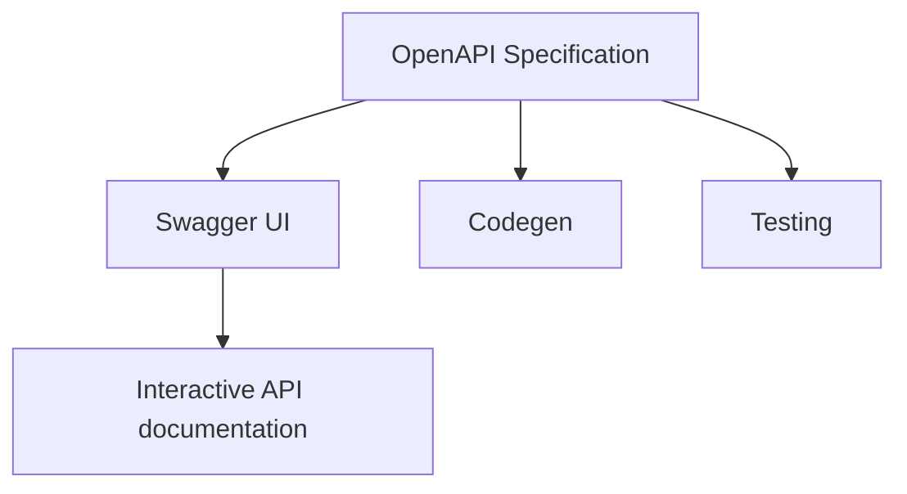
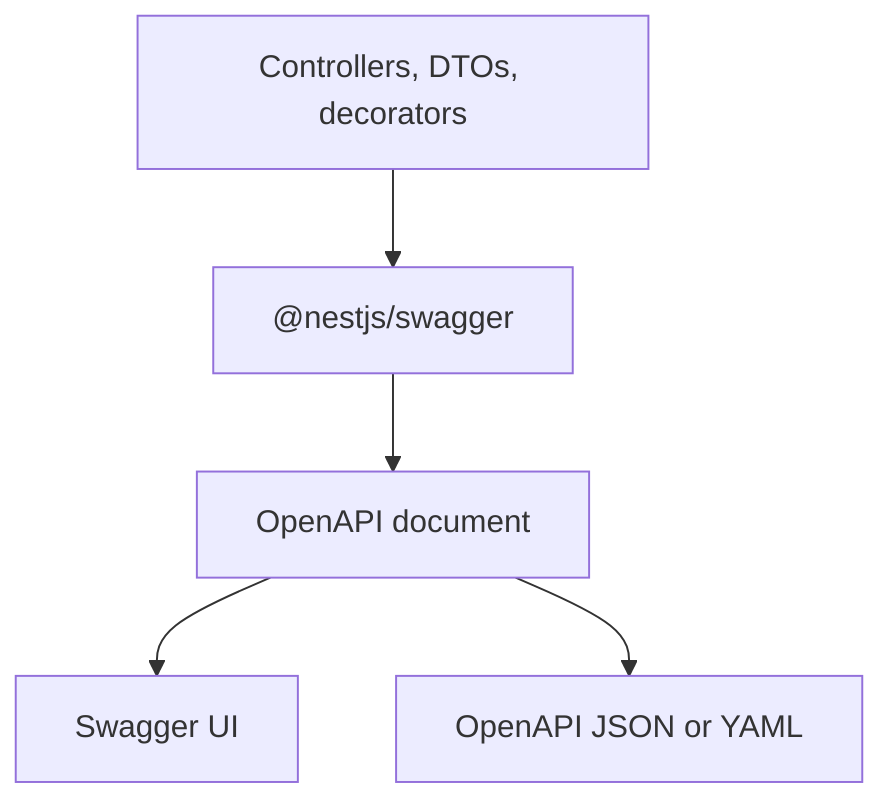
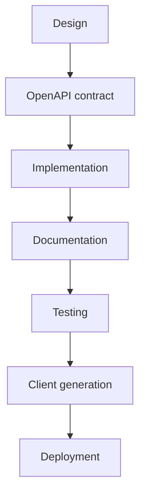
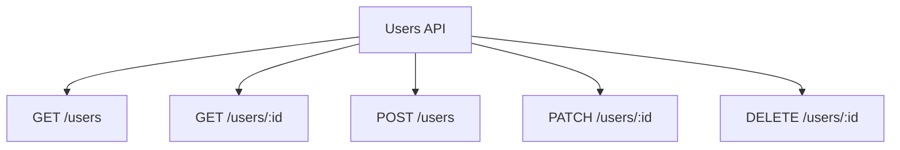

The mobile team asks whether `POST /users` returns `201` or `200`. Frontend treats `role` as a string. Backend shipped an enum last Tuesday. QA cannot tell a validation error from an auth error because both look like `{ "statusCode": 400 }`. The API works. Nobody can consume it without asking the author.

That is not a missing README. It is a missing contract.

A NestJS API without an OpenAPI document will drift. Controllers change, DTOs grow optional fields, and clients guess. OpenAPI is the cheapest way to keep that contract honest — if you treat the document as part of the API, not as a page you open once in Swagger UI.

> OpenAPI describes the contract. Swagger UI renders it. `@nestjs/swagger` generates the document from the application. They are not the same job.

## A working API can still be unusable

An endpoint that returns the right JSON in Postman can still be expensive to integrate. The usual failures are not 500s. They are ambiguities.

**Endpoints are hard to discover.** The route exists. The method exists. Nobody knows whether the collection is `/users`, `/user`, or `/v1/accounts` without reading the controller or asking Slack.

**Parameters are unclear.** Is `id` a UUID or an integer? Is `status` a query filter or a path segment? Which fields are required on create, and which are ignored on update?

**DTOs do not match the contract.** The class has five properties. The OpenAPI schema is empty because TypeScript erased them. The UI shows `{}`. Clients invent the shape.

**Responses are ambiguous.** Success might be `200` with a body, `201` with a `Location` header, or `204` with nothing. Errors might be Nest's default exception body, a custom envelope, or both, depending on the filter.

**There are no examples.** A schema that says `email: string` does not tell you whether the API accepts `Ada Lovelace` in `name` or rejects it. An example that still uses `"string"` is worse than no example: it looks complete and is wrong.

**Frontend, mobile, and other services integrate by folklore.** Types are copied by hand. A field rename becomes a production incident. Onboarding a new consumer means pairing with whoever wrote the controller.

OpenAPI does not make those problems disappear. It gives you a single, machine-readable place to state the HTTP contract: paths, operations, parameters, request bodies, responses, schemas, and authentication. NestJS can build that document from the same controllers and DTOs that implement the API. The work is keeping the document true.

## OpenAPI is the contract

The [OpenAPI Specification](https://spec.openapis.org/oas/latest.html) is a language-agnostic format for describing HTTP APIs. The OpenAPI Initiative publishes it. As of September 2025 the latest version is **3.2.0**. A file that conforms to that specification is an **OpenAPI document** (the Initiative also calls the linked set of files an OpenAPI Description). You write it in JSON or YAML. Humans can read it. Tools can parse it.

The document is the contract. It answers, for each operation:

- which **server** and **path** you call;
- which **HTTP method** (the operation);
- which **parameters** go in the path, query, header, or cookie;
- what the **request body** looks like;
- which **responses** you should expect, by status code and schema;
- which **authentication** the operation requires.

A minimal document needs `openapi`, `info` (`title` and `version`), and at least one of `paths`, `components`, or `webhooks`. `openapi` is the specification version. `info.version` is the version of _your_ API description. They are not interchangeable. Learn OpenAPI is explicit about that split.

A conceptual Users fragment looks like this. It is not a NestJS file. It is the shape Nest will generate if the metadata is complete:

```yaml
openapi: 3.0.0
info:
  title: Users API
  version: 1.0.0
servers:
  - url: https://api.example.com
paths:
  /users:
    post:
      tags: [users]
      summary: Create a user
      requestBody:
        required: true
        content:
          application/json:
            schema:
              $ref: "#/components/schemas/CreateUserDto"
      responses:
        "201":
          description: User created
          content:
            application/json:
              schema:
                $ref: "#/components/schemas/UserResponseDto"
        "400":
          description: Validation failed
        "409":
          description: Email already registered
components:
  schemas:
    CreateUserDto:
      type: object
      required: [email, name, role]
      properties:
        email:
          type: string
          format: email
          example: ada@example.com
        name:
          type: string
          example: Ada Lovelace
        role:
          $ref: "#/components/schemas/UserRole"
    UserRole:
      type: string
      enum: [admin, editor, viewer]
```

You do not need the full specification memorized. You need to know that every field you leave undocumented is a field another team will guess.

## OpenAPI is not Swagger

Swagger started as a specification. SmartBear later donated that specification to the OpenAPI Initiative, and it became the OpenAPI Specification. Swagger remained as a set of tools around that specification. The names stuck. People still say "add Swagger" when they mean "generate an OpenAPI document and serve Swagger UI."

| Concept               | What it is                                                        |
| --------------------- | ----------------------------------------------------------------- |
| OpenAPI Specification | The standard that defines how to describe an HTTP API             |
| OpenAPI document      | A JSON or YAML file that conforms to that standard                |
| Swagger UI            | A browser UI that renders a document and lets you call operations |
| Swagger Editor        | A browser editor for writing and inspecting documents             |
| Swagger Codegen       | A tool that generates clients and server stubs from a document    |
| `@nestjs/swagger`     | The NestJS module that builds an OpenAPI document from your app   |

Swagger's own documentation states the split: OpenAPI is the description format; Swagger is the tooling (Editor, UI, Codegen, and related libraries).



The confusion is cheap because `@nestjs/swagger` still uses `SwaggerModule`, the default UI path in the Nest docs is `/api`, and the package README says "OpenAPI (Swagger)." The document you generate is an OpenAPI document. The page at `/docs` is Swagger UI. If you treat those as the same thing, you will optimize for a demo and ship a contract nobody else can consume.

## Why the contract matters

A frontend engineer should not need a pairing session to learn that `PATCH /users/:id` omits `email`. A QA engineer should not discover `409 Conflict` by accident. A second service should not copy a TypeScript interface out of a Slack thread.

A complete OpenAPI document is how those teams share one description:

- **Developer experience.** The next consumer opens the document, not the controller.
- **Integration.** Frontend, mobile, and backend agree on names, types, and status codes before the first PR review that says "the field is actually `displayName`."
- **Fewer accidental breaks.** A required field that becomes optional, or the reverse, is visible in the document diff.
- **Onboarding.** A new hire can call `POST /users` from Swagger UI with a realistic example instead of reconstructing the body from a DTO.
- **Testing.** Contract tests and mocks can assert against the document, not against a recorded Postman collection that expired last quarter.
- **Client generation.** Official Swagger tooling can generate clients from the document. The quality of those clients is the quality of your schemas.
- **Automation.** CI can fail the build when the document cannot be generated or when it regresses.
- **Maintenance.** The document ages with the code if you generate it from the code. A hand-written YAML file ages with whoever last remembered to edit it.

If Swagger UI is the only artifact you keep, you do not have a contract. You have a demo.

## How NestJS builds the document

`@nestjs/swagger` does not scrape comments and hope. It walks the Nest application: modules, controllers, route handlers, parameter decorators, and the classes those handlers use as DTOs. Decorators add the metadata TypeScript cannot store. The result is a serializable object that conforms to the OpenAPI document.



`SwaggerModule.createDocument()` is the step that produces that object. You can serve it through Swagger UI, expose it as JSON or YAML, or write it to disk in CI. Nest's introduction is explicit: the object is the document; serving it over HTTP is optional.

What the module can infer without extra decorators:

- HTTP method and path from `@Get()`, `@Post()`, `@Controller()`, and the rest of the Nest routing decorators;
- that a parameter is a path, query, or body argument, from `@Param()`, `@Query()`, and `@Body()`;
- a model _name_ from the DTO class.

What it cannot infer from TypeScript alone:

- the properties of that class (design:type metadata does not list fields);
- whether a property is optional;
- enum values, unless you declare them;
- array item types, generics, or interfaces;
- useful descriptions, examples, or error responses.

Those gaps are why `@ApiProperty()` exists, and why the official CLI plugin exists as an alternative. Leaving them empty is how you get a Swagger UI full of blank schemas.

## Bootstrap `@nestjs/swagger`

Install the package. Current Nest 11 applications use `@nestjs/swagger` 11.x (11.4.6 as of July 2026). The public API below is from the official OpenAPI introduction.

```bash
npm install --save @nestjs/swagger
```

Then build the document in `main.ts`. The current Nest docs use a **factory**: `createDocument()` runs when the document is requested, not during bootstrap. Older examples — including the first version of this article — created the document immediately and passed the object to `setup()`. That still works. The factory avoids paying the generation cost at startup.

```ts
import { NestFactory } from "@nestjs/core";
import { DocumentBuilder, SwaggerModule } from "@nestjs/swagger";
import { AppModule } from "./app.module";

async function bootstrap() {
  const app = await NestFactory.create(AppModule);

  const config = new DocumentBuilder()
    .setTitle("Users API")
    .setDescription("User accounts for the Mytheon platform")
    .setVersion("1.0")
    .addBearerAuth()
    .addTag("users", "User account operations")
    .addGlobalResponse({
      status: 500,
      description: "Unexpected server error",
    })
    .build();

  const documentFactory = () => SwaggerModule.createDocument(app, config);
  SwaggerModule.setup("docs", app, documentFactory);

  await app.listen(process.env.PORT ?? 3000);
}
bootstrap();
```

What each piece does:

- **`DocumentBuilder`** fills the base OpenAPI object: `info.title`, `info.description`, `info.version`, tags, and security schemes. It does not scan routes.
- **`setVersion("1.0")`** is `info.version` — the version of _this API description_. It is not the OpenAPI Specification version.
- **`addBearerAuth()`** registers an HTTP bearer security scheme on the document so operations can reference it.
- **`addTag()`** declares a tag with a description. `@ApiTags('users')` on a controller attaches operations to that tag.
- **`addGlobalResponse()`** attaches a response to every operation. Use it for errors that are truly global (`500`), not for business errors that only some routes return.
- **`createDocument(app, config)`** walks the application and merges routes into the base document.
- **`setup("docs", app, documentFactory)`** mounts Swagger UI at `/docs`. By default Nest also serves the raw document at `/docs-json` and `/docs-yaml`.

Open `http://localhost:3000/docs`. You should see the UI. Open `http://localhost:3000/docs-json` and you should see the OpenAPI document. That JSON file is the artifact clients, contract tests, and codegen consume.

You can rename the raw routes:

```ts
SwaggerModule.setup("docs", app, documentFactory, {
  jsonDocumentUrl: "docs/openapi.json",
  yamlDocumentUrl: "docs/openapi.yaml",
});
```

### Development versus production

Serve Swagger UI in development. In production, either disable the UI or put it behind authentication. A public `/docs` on a production API is a map of every operation, including the ones you forgot to lock down.

`ui` and `raw` are independent. `swaggerUiEnabled` is deprecated; use `ui`. Disabling the UI does not disable the JSON. Disabling `raw` does not disable the UI.

```ts
const isProd = process.env.NODE_ENV === "production";

SwaggerModule.setup("docs", app, documentFactory, {
  ui: !isProd,
  raw: ["json"],
});
```

In production this keeps `/docs-json` (or your custom `jsonDocumentUrl`) available for CI and internal consumers, and it stops serving the interactive UI. If the document itself is sensitive, do not expose `raw` on the public listener either. Write the file in CI instead:

```ts
import { writeFileSync } from "node:fs";

const document = SwaggerModule.createDocument(app, config);
writeFileSync("./openapi.json", JSON.stringify(document, null, 2));
```

Treat a document that fails to generate as a failed build. A green pipeline with an empty schema is how drift becomes a release.

The generated document declares `openapi: 3.0.0` unless you change it. `@nestjs/swagger` 11.x can emit 3.1 and 3.2. Hierarchical tags (`parent`, `kind` on `addTag()`) require OpenAPI 3.2 and an explicit version:

```ts
const config = new DocumentBuilder()
  .setOpenAPIVersion("3.2.0")
  .addTag("Accounts", "Account domain", undefined, { kind: "nav" })
  .addTag("users", "User account operations", undefined, { parent: "Accounts" })
  .build();
```

Do not flip that switch because 3.2 is newer. Flip it when every consumer of the document — UI, validators, codegen, gateways — understands that version. A 3.2 field in a document that still says `openapi: 3.0.0` will fail strict validators. Nest documents that warning on the operations page.

## Document controllers when metadata is not enough

`SwaggerModule` already knows the path, the method, and which arguments are `@Body()`, `@Query()`, or `@Param()`. You do not need a decorator on every line to prove you read the docs. You need extra metadata when the automatic picture is incomplete or misleading.

| Decorator                      | When to use it                                                                                                                                                                                                                   |
| ------------------------------ | -------------------------------------------------------------------------------------------------------------------------------------------------------------------------------------------------------------------------------- |
| `@ApiTags()`                   | Group operations in the UI. Optional if `autoTagControllers` is left at its default (`true`), which tags from the controller name minus `Controller`. Use it when the name would be wrong (`UsersHttpController` → not `users`). |
| `@ApiOperation()`              | Summary, description, `operationId`, deprecation. Use it when the method name is not a sentence a consumer can trust.                                                                                                            |
| `@ApiResponse()` and shortcuts | Status codes and response schemas. Use them. Success-only documentation is how clients learn errors in production.                                                                                                               |
| `@ApiParam()`                  | Extra description, example, or enum on a path parameter. Skip it when `@Param('id') id: string` is already enough.                                                                                                               |
| `@ApiQuery()`                  | Same, for query parameters. Required when the query is not a simple decorated argument, or when you need `enum` / `isArray`.                                                                                                     |
| `@ApiBody()`                   | Explicit body schema. Required for arrays and generics (`CreateUserDto[]`). Optional when `@Body() dto: CreateUserDto` already points at a documented class.                                                                     |

Shortcuts inherit from `@ApiResponse()`. Prefer the one that matches the status you actually return:

```ts
@ApiCreatedResponse({ type: UserResponseDto, description: "User created" })
@ApiBadRequestResponse({ description: "Validation failed" })
@ApiConflictResponse({ description: "Email already registered" })
```

The full set is in the Nest operations guide (`@ApiOkResponse`, `@ApiNoContentResponse`, `@ApiUnauthorizedResponse`, `@ApiNotFoundResponse`, and the rest). `@ApiDefaultResponse()` is the OpenAPI `default` response, not "the happy path."

A controller that only lists users can stay thin:

```ts
@ApiTags("users")
@Controller("users")
export class UsersController {
  @Get()
  @ApiOkResponse({ type: [UserResponseDto] })
  findAll(@Query("role") role?: UserRole): Promise<UserResponseDto[]> {
    return this.usersService.findAll(role);
  }
}
```

`@ApiQuery({ name: "role", enum: UserRole, required: false })` becomes worth it the moment you want the UI to show a select instead of a free-text box. Until then, the `@Query()` argument is enough for the parameter to exist in the document.

`@ApiBody()` is the escape hatch TypeScript reflection does not give you:

```ts
@Post("bulk")
@ApiBody({ type: [CreateUserDto] })
createBulk(@Body() body: CreateUserDto[]) {
  return this.usersService.createBulk(body);
}
```

Without `@ApiBody()`, a generic or array body is often generated as an empty or incorrect schema. That is a TypeScript metadata limit, not a Nest bug.

## DTOs are the schema

The document is only as good as the classes you put on `@Body()` and on `@ApiOkResponse({ type })`. If those classes have no OpenAPI metadata, Swagger UI shows an empty model. Nest's types-and-parameters page demonstrates this with a DTO that has fields in TypeScript and none in the document until you add `@ApiProperty()` or enable the CLI plugin.

```ts
import { ApiProperty, ApiPropertyOptional } from "@nestjs/swagger";
import { IsEmail, IsEnum, IsOptional, IsString, MaxLength } from "class-validator";

export enum UserRole {
  Admin = "admin",
  Editor = "editor",
  Viewer = "viewer",
}

export class CreateUserDto {
  @ApiProperty({
    example: "ada@example.com",
    description: "Unique login email. Case-insensitive.",
  })
  @IsEmail()
  email: string;

  @ApiProperty({
    example: "Ada Lovelace",
    description: "Display name shown in the product.",
    maxLength: 80,
  })
  @IsString()
  @MaxLength(80)
  name: string;

  @ApiProperty({
    enum: UserRole,
    enumName: "UserRole",
    example: UserRole.Editor,
  })
  @IsEnum(UserRole)
  role: UserRole;

  @ApiPropertyOptional({
    example: "Engineering",
    description: "Optional department label. Omitted means unset, not empty.",
  })
  @IsOptional()
  @IsString()
  department?: string;
}
```

`@ApiProperty()` makes the field visible and lets you set Schema Object fields: `description`, `example`, `enum`, `type`, `minimum`, `default`. `@ApiPropertyOptional()` is the official shorthand for `{ required: false }`.

`@ApiProperty` does not validate the request. `class-validator` does, if you run `ValidationPipe`. Keep them aligned: a field that is required in the pipe must be required in the document. A mismatch is a lie in one of the two places clients trust.

### Types TypeScript will not keep

**Arrays.** Reflection does not store the item type. Declare it:

```ts
@ApiProperty({ type: [String], example: ["engineering", "platform"] })
tags: string[];
```

`type: [String]` or `isArray: true` are the two official forms.

**Enums.** Pass the enum (or an array of values) and, if clients will generate code, pass `enumName`. Without `enumName`, each property inlines its own enum. Codegen then emits `CreateUserDtoRoleEnum` and `UserResponseDtoRoleEnum` for the same three strings.

**Circular references.** Use a lazy type: `@ApiProperty({ type: () => AddressDto })`.

**Generics and interfaces.** TypeScript emits nothing useful. Do not put `CreateUserDto[]` or `Paginated<User>` on a handler and expect a correct schema. Use `@ApiBody({ type: [CreateUserDto] })`, `allOf` + `getSchemaPath()`, or a concrete class.

**Schema name.** The class name becomes the schema name (`CreateUserDto`). `@ApiSchema({ name: "CreateUserRequest", description: "..." })` changes that when the class name would leak a DTO suffix you do not want in generated clients.

Hide fields that must never appear: `@ApiHideProperty()` on passwords, tokens, and internal flags.

### Mapped types

`PATCH /users/:id` should not duplicate `CreateUserDto` with every field optional. Import `PartialType` from `@nestjs/swagger`, not from `@nestjs/mapped-types`. The Swagger copy copies OpenAPI metadata. The mapped-types copy does not.

```ts
import { PartialType } from "@nestjs/swagger";

export class UpdateUserDto extends PartialType(CreateUserDto) {}
```

`PickType`, `OmitType`, and `IntersectionType` are the same family. They compose: `PartialType(OmitType(CreateUserDto, ['email'] as const))` is a valid update type if email is immutable.

### The CLI plugin

The official Swagger CLI plugin is opt-in. It runs at compile time, walks the AST, and injects the decorators TypeScript cannot express at runtime. Nest lists what it does: annotate DTO properties with `@ApiProperty` unless `@ApiHideProperty` is present; set `required` from `?`; set `type` / `enum` (including arrays); set `default` from initializers; optionally copy `class-validator` constraints; add a response decorator from the return type; and, if `introspectComments` is true, turn JSDoc into descriptions and `@example` values.

Enable it in `nest-cli.json`:

```json
{
  "compilerOptions": {
    "plugins": [
      {
        "name": "@nestjs/swagger",
        "options": {
          "introspectComments": true
        }
      }
    ]
  }
}
```

With the plugin, the create DTO can look like this — if the file is named `create-user.dto.ts`:

```ts
export class CreateUserDto {
  /**
   * Unique login email. Case-insensitive.
   * @example ada@example.com
   */
  @IsEmail()
  email: string;

  /**
   * Display name shown in the product.
   * @example Ada Lovelace
   */
  @IsString()
  @MaxLength(80)
  name: string;

  @IsEnum(UserRole)
  role: UserRole = UserRole.Viewer;

  @IsOptional()
  @IsString()
  department?: string;
}
```

That is the advantage: less duplicated metadata. The trade-offs are real.

- **Filenames.** By default only `*.dto.ts` and `*.entity.ts` are analysed. A `create-user.model.ts` is invisible. Change `dtoFileNameSuffix` or rename the file.
- **Runtime validation is still yours.** The plugin documents. `class-validator` still has to run. Nest's plugin page is explicit: keep `@IsEmail()` and friends.
- **SWC.** The plugin is a TypeScript transformer. `nest start -b swc` needs `--type-check`, or you generate serialized metadata and load it with `SwaggerModule.loadPluginMetadata()`.
- **Jest e2e.** `ts-jest` does not use the Nest CLI. You must register the transformer or your e2e app will generate empty schemas.
- **Overrides.** An explicit `@ApiProperty()` wins. Use that for enums with `enumName`, raw schemas, and anything the AST cannot see.

Use the plugin when the team will keep the filename convention and the compiler pipeline. Use explicit decorators when the project is small, uses SWC without metadata, or already has a DTO style that does not match `*.dto.ts`. Either choice is valid. Mixing them without a rule is how half the schemas are empty.

## A useful `POST /users` contract

A useful operation tells another developer how to call it, what success looks like, and what failure looks like. `POST /users` is the usual first write path. Document the body, the created resource, and the errors that are part of the interface — not only `201`.

```ts
@Post()
@ApiOperation({
  summary: "Create a user",
  description:
    "Registers a user with a unique email. The password is set through a separate invite flow; this operation does not accept one.",
})
@ApiCreatedResponse({
  description: "User created. The id is a server-generated UUID.",
  type: UserResponseDto,
})
@ApiBadRequestResponse({ description: "Validation failed." })
@ApiUnauthorizedResponse({ description: "Missing or invalid bearer token." })
@ApiConflictResponse({ description: "Email already registered." })
create(@Body() body: CreateUserDto): Promise<UserResponseDto> {
  return this.usersService.create(body);
}
```

```ts
export class UserResponseDto {
  @ApiProperty({
    format: "uuid",
    example: "3b0d1a2e-7c4f-4a11-9d2a-1f0b6c8e9a10",
  })
  id: string;

  @ApiProperty({ example: "ada@example.com" })
  email: string;

  @ApiProperty({ example: "Ada Lovelace" })
  name: string;

  @ApiProperty({ enum: UserRole, enumName: "UserRole", example: UserRole.Editor })
  role: UserRole;

  @ApiPropertyOptional({ example: "Engineering", nullable: true })
  department?: string | null;

  @ApiProperty({ example: "2026-08-15T18:02:11.000Z" })
  createdAt: Date;
}
```

What a consumer can now do without opening the service:

- send `{ email, name, role, department? }`;
- expect `201` and a body with `id` and `createdAt`;
- expect `400` when the email is not an email;
- expect `401` when the bearer token is missing;
- expect `409` when the email is taken;
- not send a password, because it is not on the schema.

If your exception filter wraps errors as `{ code, message, details }`, document that class and point the error responses at it. A `400` with only a description and no schema still leaves the client guessing the body. Nest's default JSON exception is a schema too. Either commit to it or replace it — then describe the one you actually return.

## Bearer auth in the document and in Swagger UI

Declaring authentication on the document is not the same as enforcing it. Guards enforce it. OpenAPI tells consumers that the guard exists and which scheme to use.

Two steps, both required:

1. Register the scheme on the document with `DocumentBuilder.addBearerAuth()`.
2. Attach the scheme to a controller or operation with `@ApiBearerAuth()`.

```ts
const config = new DocumentBuilder()
  .setTitle("Users API")
  .setVersion("1.0")
  .addBearerAuth()
  .build();
```

```ts
@ApiTags("users")
@ApiBearerAuth()
@Controller("users")
export class UsersController {}
```

`@ApiBearerAuth()` on the controller applies to every operation. Put it on `create`, `update`, and `remove` only if `GET /users` is public. `@ApiSecurity('basic')` is the generic form; `addBearerAuth` / `@ApiBearerAuth` are the built-in pair for HTTP bearer.

In Swagger UI, **Authorize** stores the token and sends `Authorization: Bearer <token>` on subsequent Try it out calls. That is a convenience for humans. It is not a security control. An unauthenticated UI that can reach production is still a production API with a documented attack surface.

If you register more than one bearer scheme, pass a name as the second argument to `addBearerAuth()` and the same name to `@ApiBearerAuth('access-token')`. The no-argument form is enough for a single JWT.

## Examples are part of the contract

A schema without examples forces every consumer to invent a payload. A schema with `"string"` / `0` / `true` as examples trains them on values the API will reject. Official Nest support is the `example` key on `@ApiProperty()`, and `examples` when you want named alternatives.

```ts
@ApiProperty({
  example: "ada@example.com",
  description: "Unique login email. Case-insensitive.",
})
email: string;
```

```ts
@ApiProperty({
  examples: {
    editor: { value: UserRole.Editor },
    admin: { value: UserRole.Admin },
  },
  enum: UserRole,
  enumName: "UserRole",
})
role: UserRole;
```

Use values you would accept in staging:

- emails that look like emails, not `"user@user.com"` copied from a tutorial if your domain rejects that host;
- UUIDs in `id`, not `"1"` if the column is a UUID;
- ISO-8601 timestamps if you serialize `Date` as ISO strings;
- a `409` example that shows the error envelope, not another copy of `UserResponseDto`.

You can also attach examples on `@ApiBody()` and `@ApiCreatedResponse()` when the property-level examples are not enough to show a full payload. Keep them in sync with the DTO. An example that includes `password` after you removed the field is a defect.

The CLI plugin can pull `@example` out of JSDoc when `introspectComments` is true. That is the least duplicated way to keep prose and examples next to the field. It is still your job to make those examples true.

## Organize a large API

A 12-route Users API can live in one controller. A platform API cannot. The document will rot in the same places the code rots: mixed tags, inconsistent names, one-off error shapes, and a single UI that dumps every domain on one page.

**Tags follow domains, not layers.** `users`, `orders`, `billing` — not `controllers` and `admin`. `@ApiTags()` plus `DocumentBuilder.addTag()` gives the UI a description, not just a label. OpenAPI 3.2 hierarchical tags (`parent`, `kind`) exist in `@nestjs/swagger` 11.4+ if you set `setOpenAPIVersion('3.2.0')`. Skip them until the rest of the toolchain understands 3.2.

**Controllers stay thin.** OpenAPI metadata belongs on the HTTP edge: controllers and DTOs. Do not decorate entities to "reuse" a schema if the entity has `passwordHash`.

**DTOs are the public types.** `CreateUserDto`, `UpdateUserDto`, `UserResponseDto` are three contracts. Sharing one class for all three is how `PATCH` suddenly requires `email`.

**Names stay stable.** `email` is `email` on create, update, and response. Generated clients copy those names. A cosmetic rename is a breaking change.

**Error bodies stay one shape.** `addGlobalResponse()` covers `401` and `500` if they are uniform. Domain errors (`409` on create, `404` on get) stay on the operation. If every team invents a different `{ error: string }`, codegen cannot help.

**Reusable schemas beat copy-paste.** `UserRole` with `enumName`, `UserResponseDto` on every success path, `PartialType` for updates. `@ApiExtraModels()` exists for classes that never appear directly on a handler (pagination wrappers, discriminated unions). `getSchemaPath()` is how you `$ref` them.

**Multiple documents when one UI is noise.** `createDocument(app, config, { include: [UsersModule] })` builds a document from a subset of modules. You can mount `/docs/users` and `/docs/billing`, or offer a dropdown with `explorer: true` and `swaggerOptions.urls`. That is an official feature, not a hack.

The document has to change when the contract changes. A PR that adds a required field and does not change the document is an incomplete PR. Generate from code so that statement is mostly automatic. Review the rendered UI or the JSON diff the same way you review the handler.

## Three different "versions"

`/api/v1` and `/api/v2` are not the OpenAPI version. Three version numbers show up in this stack, and mixing them is a common source of broken clients.

| What people say   | What it actually is                                   | Where it lives                                                                                      |
| ----------------- | ----------------------------------------------------- | --------------------------------------------------------------------------------------------------- |
| "OpenAPI 3.0"     | Specification version the document conforms to        | Root field `openapi`. Default from `@nestjs/swagger`: `3.0.0`. Override with `setOpenAPIVersion()`. |
| "API version 1.0" | Version of this description / this release of the API | `info.version`, set by `DocumentBuilder.setVersion()`.                                              |
| "`/v1/users`"     | A routing version of the HTTP API                     | Nest `enableVersioning()`. URI versioning prefixes routes with `v` by default.                      |

Versioning the application:

```ts
import { VersioningType } from "@nestjs/common";

app.enableVersioning({
  type: VersioningType.URI,
  defaultVersion: "1",
});
```

```ts
@Controller({ path: "users", version: "1" })
export class UsersControllerV1 {}

@Controller({ path: "users", version: "2" })
export class UsersControllerV2 {}
```

Those controllers become `/v1/users` and `/v2/users` (after any global prefix). They can appear in one OpenAPI document as two path items, or in two documents via `include` if v1 and v2 should not share a UI.

`setVersion("2.0")` does **not** create `/v2`. It only changes `info.version`. `setOpenAPIVersion("3.2.0")` does **not** version your product. It changes the format of the document. Learn OpenAPI and the OpenAPI Specification both warn that `openapi` and `info.version` are different fields. Nest versioning is a third mechanism on top.

When you introduce `/v2`, decide whether the document is one contract with two path prefixes or two contracts with two `info.version` values. Both are valid. Pretending `setVersion("2.0")` did the routing is not.

## OpenAPI beyond Swagger UI

Swagger UI is the most visible consumer of the document. It is not the reason to generate one. Once the API can describe itself, the same file drives the rest of the lifecycle.



Teams start at different arrows. Some write the document first and generate stubs (design-first). Nest's usual path is implementation-first: the application is the source, `@nestjs/swagger` emits the document. Either way, the document is the shared artifact.

Swagger's own "Why use OpenAPI?" list is the official one: generate server stubs, generate clients in many languages, render interactive documentation, and feed API tools (testing, gateways, linting). The OpenAPI Initiative's tooling ecosystem is built on the same idea. None of those jobs require a browser tab.

Practical uses that are not the UI:

- **Documentation** — the JSON/YAML file or a documentation portal, all from the same document.
- **Client generation** — TypeScript types for the frontend, a Kotlin client for mobile. Garbage schemas produce garbage clients.
- **Testing** — schema validation of responses in CI; contract tests that fail when a status code disappears.
- **Mocking** — a mock server from the document so frontend can start before `POST /users` is implemented.
- **Validation** — request validation against the document at the edge, in addition to `ValidationPipe` in the process.
- **Integration** — the file you attach to the ticket instead of a screenshot of Swagger UI.

Export the document in CI even if you never open `/docs` in production. The UI is a viewer. The file is the contract.

## A small Users API

The same domain, complete enough to copy, small enough to read. Authentication is required on writes. Reads are public. Errors are documented. Examples are values you would send.



### `main.ts`

```ts
import { ValidationPipe } from "@nestjs/common";
import { NestFactory } from "@nestjs/core";
import { DocumentBuilder, SwaggerModule } from "@nestjs/swagger";
import { AppModule } from "./app.module";

async function bootstrap() {
  const app = await NestFactory.create(AppModule);
  app.useGlobalPipes(new ValidationPipe({ whitelist: true, forbidNonWhitelisted: true }));

  const config = new DocumentBuilder()
    .setTitle("Users API")
    .setDescription("Create, read, update, and disable user accounts.")
    .setVersion("1.0")
    .addBearerAuth()
    .addTag("users", "User account operations")
    .addGlobalResponse({ status: 500, description: "Unexpected server error" })
    .build();

  const documentFactory = () => SwaggerModule.createDocument(app, config);
  const isProd = process.env.NODE_ENV === "production";

  SwaggerModule.setup("docs", app, documentFactory, {
    ui: !isProd,
    raw: ["json"],
  });

  await app.listen(process.env.PORT ?? 3000);
}
bootstrap();
```

### DTOs

```ts
import { ApiProperty, ApiPropertyOptional, PartialType } from "@nestjs/swagger";
import { IsEmail, IsEnum, IsOptional, IsString, MaxLength } from "class-validator";

export enum UserRole {
  Admin = "admin",
  Editor = "editor",
  Viewer = "viewer",
}

export class CreateUserDto {
  @ApiProperty({
    example: "ada@example.com",
    description: "Unique login email. Case-insensitive.",
  })
  @IsEmail()
  email: string;

  @ApiProperty({ example: "Ada Lovelace", maxLength: 80 })
  @IsString()
  @MaxLength(80)
  name: string;

  @ApiProperty({
    enum: UserRole,
    enumName: "UserRole",
    example: UserRole.Editor,
  })
  @IsEnum(UserRole)
  role: UserRole;

  @ApiPropertyOptional({ example: "Engineering" })
  @IsOptional()
  @IsString()
  department?: string;
}

export class UpdateUserDto extends PartialType(CreateUserDto) {}

export class UserResponseDto {
  @ApiProperty({
    format: "uuid",
    example: "3b0d1a2e-7c4f-4a11-9d2a-1f0b6c8e9a10",
  })
  id: string;

  @ApiProperty({ example: "ada@example.com" })
  email: string;

  @ApiProperty({ example: "Ada Lovelace" })
  name: string;

  @ApiProperty({ enum: UserRole, enumName: "UserRole", example: UserRole.Editor })
  role: UserRole;

  @ApiPropertyOptional({ example: "Engineering", nullable: true })
  department?: string | null;

  @ApiProperty({ example: "2026-08-15T18:02:11.000Z" })
  createdAt: Date;
}
```

`UpdateUserDto` inherits OpenAPI metadata because `PartialType` comes from `@nestjs/swagger`. Email stays patchable here; if your product forbids changing it, use `PartialType(OmitType(CreateUserDto, ['email'] as const))` instead of a comment in the controller.

### Controller

```ts
import {
  Body,
  Controller,
  Delete,
  Get,
  HttpCode,
  Param,
  ParseUUIDPipe,
  Patch,
  Post,
  Query,
} from "@nestjs/common";
import {
  ApiBadRequestResponse,
  ApiBearerAuth,
  ApiConflictResponse,
  ApiCreatedResponse,
  ApiNoContentResponse,
  ApiNotFoundResponse,
  ApiOkResponse,
  ApiOperation,
  ApiQuery,
  ApiTags,
  ApiUnauthorizedResponse,
} from "@nestjs/swagger";
import { CreateUserDto, UpdateUserDto, UserResponseDto, UserRole } from "./dto/create-user.dto";
import { UsersService } from "./users.service";

@ApiTags("users")
@Controller("users")
export class UsersController {
  constructor(private readonly usersService: UsersService) {}

  @Get()
  @ApiOperation({ summary: "List users" })
  @ApiQuery({ name: "role", enum: UserRole, required: false })
  @ApiOkResponse({ type: [UserResponseDto] })
  findAll(@Query("role") role?: UserRole): Promise<UserResponseDto[]> {
    return this.usersService.findAll(role);
  }

  @Get(":id")
  @ApiOperation({ summary: "Get a user by id" })
  @ApiOkResponse({ type: UserResponseDto })
  @ApiNotFoundResponse({ description: "No user with that id." })
  findOne(@Param("id", ParseUUIDPipe) id: string): Promise<UserResponseDto> {
    return this.usersService.findOne(id);
  }

  @Post()
  @ApiBearerAuth()
  @ApiOperation({ summary: "Create a user" })
  @ApiCreatedResponse({ type: UserResponseDto, description: "User created." })
  @ApiBadRequestResponse({ description: "Validation failed." })
  @ApiUnauthorizedResponse({ description: "Missing or invalid bearer token." })
  @ApiConflictResponse({ description: "Email already registered." })
  create(@Body() body: CreateUserDto): Promise<UserResponseDto> {
    return this.usersService.create(body);
  }

  @Patch(":id")
  @ApiBearerAuth()
  @ApiOperation({ summary: "Update a user" })
  @ApiOkResponse({ type: UserResponseDto })
  @ApiBadRequestResponse({ description: "Validation failed." })
  @ApiUnauthorizedResponse({ description: "Missing or invalid bearer token." })
  @ApiNotFoundResponse({ description: "No user with that id." })
  update(
    @Param("id", ParseUUIDPipe) id: string,
    @Body() body: UpdateUserDto,
  ): Promise<UserResponseDto> {
    return this.usersService.update(id, body);
  }

  @Delete(":id")
  @ApiBearerAuth()
  @HttpCode(204)
  @ApiOperation({ summary: "Delete a user" })
  @ApiNoContentResponse({ description: "User deleted." })
  @ApiUnauthorizedResponse({ description: "Missing or invalid bearer token." })
  @ApiNotFoundResponse({ description: "No user with that id." })
  remove(@Param("id", ParseUUIDPipe) id: string): Promise<void> {
    return this.usersService.remove(id);
  }
}
```

`ParseUUIDPipe` and `@ApiProperty({ format: "uuid" })` agree: `id` is a UUID. `@HttpCode(204)` and `@ApiNoContentResponse()` agree: delete has no body. `@ApiBearerAuth()` sits on the writes, not on the list. The service is ordinary Nest and is omitted on purpose — it does not change the contract.

Wire a `ValidationPipe` and a guard that actually checks the bearer token. The document will not do that for you.

## Mistakes that break the contract

**Documenting only the successful path.** A client that only knows `201` will mishandle `409`. Status codes you return in production belong in the document.

**Leaving DTO properties undocumented.** A class without `@ApiProperty()` (and without the CLI plugin) generates an empty schema. The UI looks configured. The contract is `{}`.

**Examples that the API rejects.** `"string"` for `email`, `"1"` for a UUID, a request example that still includes `password`. Consumers will copy them.

**A hand-written YAML file as the source of truth.** It will diverge. Generate from controllers and DTOs. If you design-first, the document still has to be verified against the running app.

**Treating Swagger UI as the contract.** The UI is a renderer. The OpenAPI document is the artifact you version, diff, and feed to codegen.

**Exposing the UI — or the full document — on a public production host without a decision.** Internal admin operations, unpublished fields, and auth schemes should not be world-readable by default. `ui: false` is not a security review. It is the minimum.

**Mixing OpenAPI versions.** Hierarchical 3.2 tags in a document that still declares `3.0.0`. Clients and validators will disagree. Set `setOpenAPIVersion()` only when you mean to change the format.

**Enabling the CLI plugin without a filename and compiler story.** Schemas empty in e2e, empty under SWC, empty for `*.model.ts`. The plugin is official. It is not free.

**`setVersion("2.0")` as a substitute for `/v2`.** That updates `info.version`. It does not add a route.

**Importing `PartialType` from `@nestjs/mapped-types` in a Swagger project.** Update DTOs lose OpenAPI metadata. Import it from `@nestjs/swagger`.

**Validation and documentation that disagree.** `@IsOptional()` with a required `@ApiProperty()`, or the reverse. Pick one source of requiredness and keep the other in sync. The plugin's `classValidatorShim` (default `true`) can copy constraints into the schema; it cannot invent a pipe you forgot to register.

## Checklist

- Public operations appear in the OpenAPI document.
- Each operation documents its request and its success response.
- HTTP status codes match what the handler and filters actually return.
- Examples are payloads the API accepts.
- Authentication schemes are declared and attached to protected operations.
- DTO fields are visible (`@ApiProperty` or the CLI plugin) and stay aligned with `class-validator`.
- Names are consistent across create, update, and response schemas.
- Error responses that clients must handle are documented.
- Swagger UI and raw documents are not exposed in production without a decision.
- The document is generated in CI and reviewed when the contract changes.

## The document is code

If the OpenAPI document and the running API disagree, the client is wrong either way: it trusted the document, or it trusted a hallway conversation. Generate the document from the same controllers and DTOs you ship. Keep Swagger UI for humans who need to click. Keep the JSON for machines that need to generate, test, and mock.

A green Try it out on localhost is not a contract. A document that CI can emit, diff, and fail on — that is the contract.

## Sources

- NestJS, [OpenAPI introduction](https://docs.nestjs.com/openapi/introduction) — `DocumentBuilder`, `createDocument`, factory setup, `ui` / `raw`, JSON and YAML URLs
- NestJS, [Types and parameters](https://docs.nestjs.com/openapi/types-and-parameters) — `@ApiProperty`, arrays, enums, `enumName`, examples, generics, `@ApiSchema`
- NestJS, [Operations](https://docs.nestjs.com/openapi/operations) — tags, `@ApiResponse` shortcuts, `addGlobalResponse`, OpenAPI 3.2 hierarchical tags, `setOpenAPIVersion`
- NestJS, [Security](https://docs.nestjs.com/openapi/security) — `addBearerAuth`, `@ApiBearerAuth`
- NestJS, [CLI plugin](https://docs.nestjs.com/openapi/cli-plugin) — AST plugin, filename suffixes, `introspectComments`, SWC and Jest trade-offs
- NestJS, [Mapped types](https://docs.nestjs.com/openapi/mapped-types) — `PartialType`, `PickType`, `OmitType` from `@nestjs/swagger`
- NestJS, [Other features](https://docs.nestjs.com/openapi/other-features) — global prefix, global responses, multiple specifications
- NestJS, [Decorators](https://docs.nestjs.com/openapi/decorators) — official decorator list and apply levels
- NestJS, [Versioning](https://docs.nestjs.com/techniques/versioning) — URI `/v1` versus document version
- OpenAPI Initiative, [OpenAPI Specification](https://spec.openapis.org/oas/latest.html) — current specification (3.2.0, 19 September 2025)
- OpenAPI Initiative, [Structure of an OpenAPI Description](https://learn.openapis.org/specification/structure.html) — `openapi` versus `info.version`, JSON/YAML
- Swagger, [What is OpenAPI?](https://swagger.io/docs/specification/v3_0/about/) — OpenAPI as the format, Swagger as the tooling, codegen and UI
- Swagger, [OpenAPI Specification](https://swagger.io/specification/) — published specification entry point
