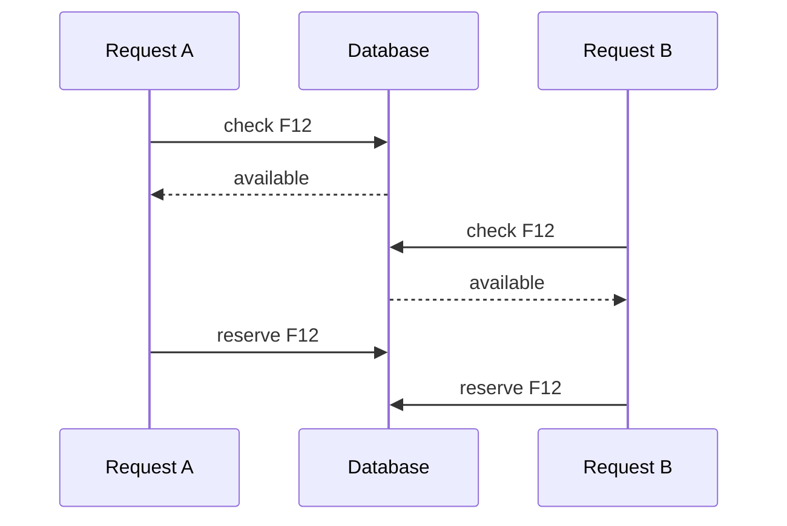
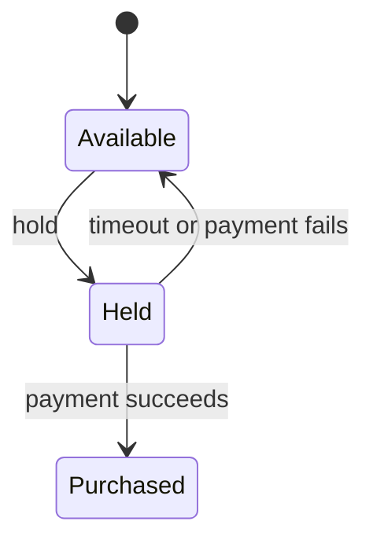
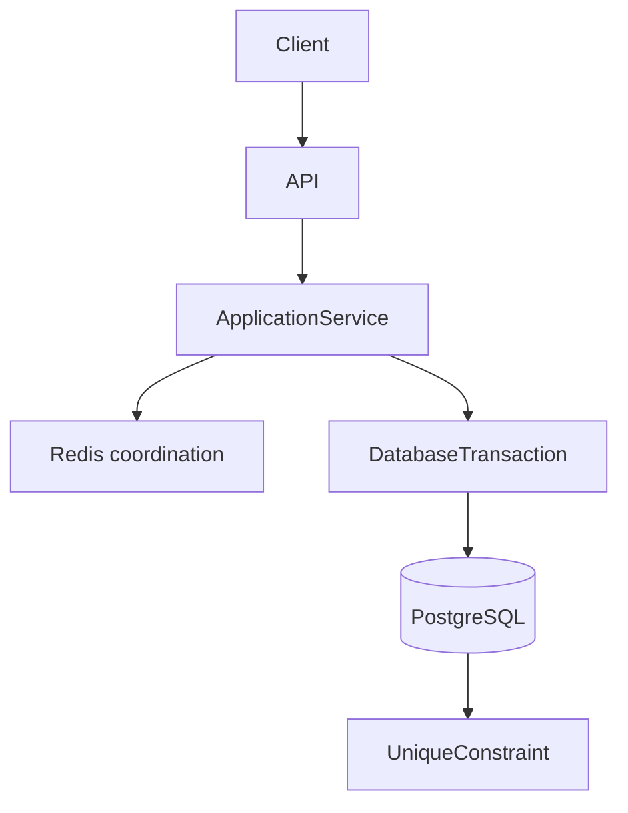

Hace un tiempo, compré una entrada de cine desde el móvil. Llegué con tiempo, me senté en la butaca impresa en el ticket, y justo antes de apagar las luces, llegó una pareja. Una de sus entradas tenía el mismo número. La mía también era válida.

No sé qué hacía aquel sistema de reservas. No vi el código, el esquema ni los logs. La historia sirve como forma, no como postmortem:

```text
User A -> Seat F12 -> valid ticket
User B -> Seat F12 -> valid ticket
```

Desde el pasillo, el producto parece absurdo. Desde el servidor, es una pregunta que tiene que responder cualquier API de checkout, inventario o reservas:

> ¿Cómo puede una butaca tener dos dueños si la app la mostraba disponible?

La pregunta útil no es la definición de _race condition_. Es esta: **¿cómo mantienes consistente un recurso exclusivo cuando varias peticiones concurrentes intentan reclamarlo?**

## Las dos peticiones vieron un mundo válido

Una race condition es un fallo de corrección que depende del timing. Dos ejecuciones se entrelazan de un modo que el programa no contempló. Ninguna petición tiene que estar mal por sí sola. Las dos observaron un estado que era cierto cuando miraron.



La app no mentía. F12 _estaba_ disponible cuando la petición A la leyó. Seguía disponible cuando la leyó B. Después las dos la reservaron.

> El fallo no es una petición incorrecta. Las dos observaron el mismo estado válido antes de que cualquiera de las dos lo cambiara.

Eso no es lo mismo que los fenómenos de aislamiento del estándar SQL. Conviene no mezclar los nombres.

| Término            | Qué falló                                                                                                  |
| ------------------ | ---------------------------------------------------------------------------------------------------------- |
| Race condition     | La corrección depende del entrelazado. Aquí: dos claims ganan sobre un recurso exclusivo.                  |
| Lost update        | Dos writers hacen read-modify-write sobre la misma fila; el commit posterior pisa el anterior en silencio. |
| Dirty read         | Una transacción lee datos que otra escribió y aún no ha confirmado.                                        |
| Nonrepeatable read | La transacción vuelve a leer la misma fila y ve un cambio ya confirmado.                                   |
| Phantom read       | La transacción reejecuta una query y el _conjunto_ de filas que cumplen la condición ha cambiado.          |

El fallo del cine suele ser una race sobre un flujo **check-then-act**. Un lost update puede aparecer al lado — dos `UPDATE` sin predicado, gana el último write — pero «gana el último write» no es lo mismo que «se imprimieron dos tickets». [OWASP](https://owasp.org/www-community/pages/vulnerabilities/race_conditions) trata esta clase de bug como un problema de timing en estado compartido, no como un problema de criptografía.

## Check, then act

El patrón peligroso parece correcto si lo recorres en un solo hilo.

```sql
SELECT id, status
FROM seats
WHERE id = 'F12'
  AND status = 'available';
```

Y, si volvió una fila:

```sql
UPDATE seats
SET status = 'reserved'
WHERE id = 'F12';
```

Entre esos dos statements hay una ventana. Otra petición puede ejecutar el mismo `SELECT` y obtener la misma respuesta.

```text
T1: SELECT -> available
T2: SELECT -> available
T1: UPDATE -> reserved
T2: UPDATE -> reserved
```

El bug no es el `SELECT`. Tampoco el `UPDATE`. El bug es tratar la observación como si fuera la reserva.

Meter ambos statements en `BEGIN` / `COMMIT` no cierra esa ventana por sí solo. Una transacción agrupa trabajo y te da reglas de aislamiento. No inventa un lock que no tomaste, y no reevalúa un predicado que dejaste fuera del `UPDATE`.

## Haz atómica la transición

Pon la condición en el write.

```sql
UPDATE seats
SET status = 'held',
    held_by = $2,
    hold_expires_at = now() + interval '10 minutes'
WHERE id = $1
  AND status = 'available';
```

Esa operación es otra. La disponibilidad ya no es un hecho que aprendiste antes. Es un predicado de la mutación.

```text
affected rows = 1 -> el hold se hizo
affected rows = 0 -> alguien más la tomó, o nunca estuvo available
```

```ts
const result = await db.query(
  `UPDATE seats
   SET status = 'held',
       held_by = $2,
       hold_expires_at = now() + interval '10 minutes'
   WHERE id = $1
     AND status = 'available'`,
  [seatId, userId],
);

if (result.rowCount !== 1) {
  throw new SeatUnavailableError();
}
```

En [Read Committed de PostgreSQL](https://www.postgresql.org/docs/current/transaction-iso.html) — el default — un `UPDATE` concurrente sobre la misma fila espera al primer writer. Cuando ese writer hace commit, el segundo comando **reevalúa el `WHERE` contra la fila actualizada**. Si `status` ya no es `available`, el segundo update afecta cero filas. No necesitas otro `SELECT` para enterarte. Necesitas tratar `rowCount === 0` como un conflicto.

> No compruebes si el recurso está disponible y después lo reserves. Haz que la reserva dependa de que siga disponible.

La misma forma protege un wallet:

```sql
UPDATE accounts
SET balance = balance - 2500
WHERE id = $1
  AND balance >= 2500;
```

Un decremento que puede ir a negativo es un check-then-act disfrazado: leíste `balance`, restaste en la aplicación y escribiste el resultado. Dos retiros concurrentes vieron `2500` y los dos escribieron `0`.

## Las transacciones no son magia

Una transacción te da atomicity, consistency, isolation y durability para el trabajo que metes dentro. No convierte un workflow incorrecto en uno correcto.

Lo que obtienes depende de los statements, del [isolation level](https://www.postgresql.org/docs/current/transaction-iso.html), de los locks que esos statements toman, de las constraints de las tablas, y de cómo la aplicación trata `rowCount === 0` o un error de unicidad.

El estándar SQL define cuatro niveles de aislamiento. PostgreSQL implementa tres. Si se solicita Read Uncommitted, se obtiene Read Committed. La función Repeatable Read de PostgreSQL es más estricta que el estándar en cuanto a los objetos fantasma: están «allowed, but not in PG». Las anomalías de serialización — resultados que no coinciden con ningún orden serial de las transacciones — siguen siendo posibles hasta que usas Serializable.

| Nivel                          | Qué te da                                                                                                                            | Qué no te da                                                                                                                                                     |
| ------------------------------ | ------------------------------------------------------------------------------------------------------------------------------------ | ---------------------------------------------------------------------------------------------------------------------------------------------------------------- |
| Read Committed (default de PG) | No hay dirty reads. Cada statement ve un snapshot en el instante en que arranca.                                                     | Dos `SELECT` seguidos en la misma transacción pueden discrepar. El check-then-act sigue compitiendo salvo que el write sea condicional o la fila esté bloqueada. |
| Repeatable Read                | Un snapshot estable para la transacción. Sin lecturas irrepetibles. En PostgreSQL, tampoco hay registros fantasma.                   | Desviación de escritura y otras anomalías de serialización. Dos transacciones aún pueden confirmar un par de escrituras que nunca podrían ocurrir una a la vez.  |
| Serializable                   | Serializable Snapshot Isolation: abortar con un fallo de serialización si la confirmación no fuera equivalente a algún orden serial. | Carta blanca. La aplicación tiene que reintentar la transacción fallida.                                                                                         |

No «actives Serializable» como sustituto de un `UPDATE` condicional. Serializable es la herramienta correcta para invariantes que cruzan varias filas y no caben en un predicado ni en una constraint — el ejemplo habitual de desequilibrio en la escritura es cuando dos médicos de guardia terminan su turno tras ver que el otro sigue trabajando. Para indicar si «un asiento está disponible o no», una única escritura condicional es más clara, más económica y no requiere un bucle de reintento para los fallos de serialización.

Una transacción _sí_ es el sitio correcto para varios writes relacionados: insertar el hold, decrementar un contador, registrar un evento de outbox. El aislamiento no sustituye a declarar la transición.

## Optimistic vs pessimistic locking

A veces el write necesita más que `status = 'available'`. El cliente leyó una versión, pensó un rato, y ahora quiere aplicar un cambio que no debe pisar el de otro.

El **optimistic locking** asume que el conflicto es raro. Guardas una `version` (o un `updated_at` que tratas como versión) y te niegas a escribir si se movió.

```sql
UPDATE seats
SET status = 'held',
    version = version + 1
WHERE id = $1
  AND version = $2;
```

`affected rows = 0` significa que otra transacción hizo commit antes. Reintenta desde una lectura fresca, o dile al cliente que el recurso cambió. Es una convención de aplicación. PostgreSQL no te inventa la columna `version`.

El **pessimistic locking** serializa a los lectores que pretenden escribir. Dentro de una transacción:

```sql
SELECT id, status, held_by
FROM seats
WHERE id = $1
FOR UPDATE;
```

[PostgreSQL](https://www.postgresql.org/docs/current/explicit-locking.html): `FOR UPDATE` bloquea las filas seleccionadas contra modificación concurrente hasta que termina la transacción. Un segundo `SELECT FOR UPDATE` sobre F12 espera. Cuando la primera transacción hace commit, el que esperaba recibe la fila **actualizada** — o ninguna fila, si se borró. En Repeatable Read o Serializable, si la fila cambió desde el snapshot, PostgreSQL lanza un error en lugar de entregarte en silencio una versión nueva.

`FOR UPDATE` solo ayuda si inspeccionas lo que bloqueaste. Si bloqueas F12 y luego haces `UPDATE` sin mirar `status`, sigues pisando un hold que acabas de esperar para ver.

Usa optimistic locking cuando los conflictos son raros y reintentar es barato: editar una nota de reserva, aplicar un descuento, actualizar un perfil. Usa pessimistic locking cuando la fila es un hotspot y la sección crítica es corta: última butaca, última unidad de stock, una línea de ledger que tienes que leer y escribir juntas. Mantener `FOR UPDATE` durante el round trip a un payment provider es cómo atascas a todos los demás compradores de esa butaca.

Ninguna de las dos estrategias es «la solución de concurrencia». Las dos son formas de enterarte de que el mundo se movió.

## Que la base de datos proteja el invariante

La lógica de aplicación protege un workflow. Las constraints protegen un invariante.

El invariante de una función no es «la fila del asiento dice reservada». Es: **una butaca de un showtime tiene como máximo una reserva activa.**

Si las reservas son filas — y deberían serlo si necesitas historial, reembolsos y holds caducados — dos inserts concurrentes pueden pasar una sentencia `SELECT` que no encontró nada.

```sql
CREATE UNIQUE INDEX one_active_reservation
  ON reservations (showtime_id, seat_id)
  WHERE status IN ('held', 'purchased');
```

Eso es un [partial unique index](https://www.postgresql.org/docs/current/ddl-constraints.html). PostgreSQL no expresa «único entre algunas filas» como una constraint `UNIQUE` de tabla. Una restricción de unicidad que solo cubre reservas activas tiene que ser un unique index con `WHERE`. Las filas canceladas y caducadas salen del índice y dejan de bloquear un hold nuevo.

Si dos transacciones insertan `(showtime_42, F12, 'held')`, una hace commit. La otra falla con uniqueness violation. Mapeas ese error al mismo camino de conflicto que `rowCount === 0`.

Los [unique indexes](https://www.postgresql.org/docs/current/indexes-unique.html) son cómo PostgreSQL hace cumplir `UNIQUE` y las primary keys. La constraint no es un capricho de estilo. Es la última línea de defensa cuando un bug, un retry o un segundo code path se olvidan del `UPDATE` condicional.

No trates el índice como el motor de reservas. No va a caducar un hold, cobrar una tarjeta ni enviar un ticket. Se va a negar a guardar dos dueños activos. Ese es otro trabajo, y es el que la base de datos puede hacer incluso cuando la aplicación se equivoca.

## Holds temporales: AVAILABLE -> HELD -> PURCHASED

Un flujo real de tickets no es `available -> purchased` en un clic. El pago tarda. El comprador necesita una ventana exclusiva corta. El resto necesita recuperar la butaca si esa ventana muere.



Un hold que funciona tiene todo esto, no solo un enum de status:

- **ownership** — quién puede completarlo o liberarlo.
- **expiration** — un timestamp que la base de datos puede comparar, no la esperanza de que el cliente vuelva.
- **transiciones controladas** — cada `UPDATE` nombra el status que abandona.
- **reclamation** — un job o el siguiente writer que devuelve los holds caducados a `available`.

```sql
UPDATE seats
SET status = 'purchased'
WHERE id = $1
  AND held_by = $2
  AND status = 'held'
  AND hold_expires_at > now();
```

```sql
UPDATE seats
SET status = 'available',
    held_by = NULL,
    hold_expires_at = NULL
WHERE status = 'held'
  AND hold_expires_at <= now();
```

El segundo statement es cómo liberas inventario sin un distributed lock. Es, de nuevo, un update condicional. Dos reclaimers no pueden «ganar» de un modo que importe: los dos dejan el mismo estado final.

No inventes aquí los internos de una plataforma de cine. El patrón es el mismo para habitaciones de hotel, huecos de cita y SKUs de flash sale: claim exclusivo, acotado en el tiempo, y después un éxito terminal o la vuelta al pool.

`AVAILABLE -> PURCHASED` puede existir como un solo paso cuando el pago no entra en el bucle: una compensación administrativa, una reserva a precio cero. Codifícalo como su propia transición. No dejes que un `UPDATE seats SET status = 'purchased'` suelto se salte los invariantes del hold que acabas de diseñar.

## Dile al cliente que perdió: 409 Conflict

Cuando el write es condicional, la API tiene que decir qué significa `rowCount === 0`.

[RFC 9110 §15.5.10](https://www.rfc-editor.org/rfc/rfc9110#name-409-conflict): **409 Conflict** significa que la petición no pudo completarse porque entra en conflicto con el estado actual del recurso. El servidor DEBERÍA enviar un body con información suficiente para reconocer el conflicto. El ejemplo del RFC es un PUT que pierde una carrera de versionado. Una butaca que ya no está available es el mismo tipo de problema: la petición estaba bien formada; el recurso no acepta ese cambio de estado.

```http
HTTP/1.1 409 Conflict
Content-Type: application/json

{
  "error": "seat_unavailable",
  "seatId": "F12",
  "showtimeId": "show_20h"
}
```

| Status | Úsalo cuando                                                                                                                                                                |
| ------ | --------------------------------------------------------------------------------------------------------------------------------------------------------------------------- |
| 400    | La petición está mal formada. Ni siquiera puedes evaluar la transición.                                                                                                     |
| 409    | La butaca existe; esta transición es ilegal en el estado actual. Ganó otro comprador, o el hold caducó.                                                                     |
| 412    | Falló un header de precondición: `If-Match` sobre un ETag, `If-Unmodified-Since`. [RFC 9110 §15.5.13](https://www.rfc-editor.org/rfc/rfc9110#name-412-precondition-failed). |

409 no es «reintenta el mismo hold ahora mismo». El cliente debería refrescar disponibilidad y elegir otra butaca — o la misma solo después de verla libre. Documenta el body del 409 en el contrato OpenAPI; un cliente que solo conoce `201` va a manejar mal este camino. Ese trabajo de contrato está en [OpenAPI y Swagger en NestJS](/blog/openapi-swagger-nestjs/).

## Redis coordina. PostgreSQL decide.

Redis sirve para coordinación de vida corta: un lock mientras hablas con un payment provider, una caché de «butacas restantes», un TTL que coincide con la ventana del hold. No sustituye el invariante.

El lock documentado de una sola instancia es atómico:

```text
SET seat:show_20h:F12 <unique-token> NX PX 30000
```

[`SET` de Redis](https://redis.io/docs/latest/commands/set/) con `NX` y un expiry pone la key solo si no existe. El valor tiene que ser un token que creó quien toma el lock. Suelta el lock solo si el token sigue coincidiendo — Redis documenta que un cliente que sobrevive a `PX` puede, si usa `DEL` a secas, borrar un lock que ahora es de otro.

Eso ya enumera los fallos que importan:

- **expiration** — el lock muere mientras el pago sigue en marcha; un segundo cliente lo adquiere.
- **crash after expire** — el primer proceso despierta y borra el lock del segundo si usaste `DEL` sin comprobar el token.
- **async replication** — [la propia página de locks de Redis](https://redis.io/docs/latest/develop/clients/patterns/distributed-locks/) describe la race: el cliente A toma el lock en el master, el master muere antes de que la réplica vea la key, la réplica pasa a master, el cliente B bloquea el mismo recurso. Se rompe la exclusión mutua.

A veces eso vale: querías recortar carga, no decidir ownership. Para una butaca, un cupón o un wallet, no vale. La base de datos sigue teniendo que rechazar un segundo dueño activo. Un lock de Redis delante de un `UPDATE` check-then-act sigue siendo check-then-act, con un segundo sistema que puede discrepar.

> Un lock de Redis es coordinación. No es integridad de base de datos.

## La idempotencia no es locking

Dos usuarios golpeando F12 es una race. Un usuario golpeando **Pagar** es un duplicado.

```text
POST /orders
```

El cliente hace timeout. El usuario toca otra vez. El load balancer reintenta. Ahora tienes dos peticiones HTTP para una sola compra.

[RFC 9110 §9.2.2](https://www.rfc-editor.org/rfc/rfc9110#name-idempotent-methods): un método es idempotente si el efecto previsto de varias peticiones idénticas es el mismo que el de una. `PUT` y `DELETE` lo son. `POST` no. Un cliente NO DEBE reintentar automáticamente un método no idempotente salvo que tenga otra forma de saber que la semántica es segura.

La otra forma habitual es una key generada por el cliente:

```http
POST /orders
Idempotency-Key: 7b8f0c2a-3d91-4e1e-9c4a-12ab34cd56ef
```

Ese header no es un estándar HTTP. Es un [Internet-Draft de IETF HTTPAPI](https://datatracker.ietf.org/doc/html/draft-ietf-httpapi-idempotency-key-header) y el header que [documenta Stripe](https://docs.stripe.com/api/idempotent_requests) para reintentos seguros: guarda la primera respuesta de esa key, reprodúcela en peticiones posteriores con la misma key, y no apliques el side effect dos veces.

El locking responde «quién puede cambiar F12 ahora». La idempotencia responde «¿es esta la misma operación que ya acepté?». Un segundo usuario con otra key debería seguir perdiendo la butaca. Un retry con la **misma** key debería devolver el hold original, no un 409 contra ti mismo.

Persiste la key en la misma transacción que el hold cuando puedas. Es la misma regla que persistir un `eventId` de Pub/Sub junto al side effect — el lado consumidor de los retries está en [cómo usar Pub/Sub correctamente](/blog/google-cloud-pubsub-how-to-use-it-correctly/). Cómo diseñar el `POST` para que el retry no cobre dos veces está en [idempotencia en APIs](/blog/idempotency-in-apis/).

> El locking controla el acceso concurrente a un recurso. La idempotencia controla los reintentos de la misma operación.

## El mismo problema de recurso exclusivo

La butaca de cine es un claim exclusivo. El invariante cambia; el diseño no.

| Recurso                             | Qué tiene que seguir siendo cierto                                                                        |
| ----------------------------------- | --------------------------------------------------------------------------------------------------------- |
| Butaca de cine / asiento de vuelo   | Un hold o purchase activo por asiento y por salida.                                                       |
| Inventario de producto              | `stock` nunca queda negativo; las unidades reservadas a un carrito no se venden dos veces.                |
| Habitación de hotel / hueco de cita | Un ocupante (o una reserva) para el intervalo.                                                            |
| Cupón                               | Canjeado como máximo una vez según la regla: global, o una vez por cliente.                               |
| Wallet / transferencia              | Los balances no quedan negativos (o no cruzan el límite acordado); un débito corresponde a una intención. |
| Creación de pedido                  | Un checkout lógico no crea dos pedidos pagados.                                                           |
| Edición limitada                    | El recuento emitido no supera el tope.                                                                    |

El inventario suele ser `UPDATE ... SET stock = stock - $n WHERE id = $1 AND stock >= $n`. Un cupón es un update condicional (`redeemed_at IS NULL`) más un unique `(coupon_id, user_id)` si la regla es por cliente. Una transferencia son dos updates condicionales en una transacción, o un insert de ledger cuya unicidad es el transfer id. Un pedido es una idempotency key más una business key única (`cart_id`, `checkout_attempt_id`) para que los reintentos no cobren dos veces.

Si dos clientes pueden cambiar el mismo contador, el mismo hueco o el mismo bote de dinero, la concurrencia no es un caso raro. Es la API.

## Diseña las transiciones que no pueden romper

Deja de preguntar «¿está disponible esta butaca?». Esa pregunta es un `SELECT` sobre el que vas a actuar tarde. Pregunta qué transición tiene que ser imposible de violar.

```text
AVAILABLE -> HELD        only if still AVAILABLE
HELD      -> PURCHASED   only by the owner, only before expiry
HELD      -> AVAILABLE   expiry, cancel, or failed payment
AVAILABLE -> PURCHASED   only on an explicit, valid path
```

Eso es una máquina de estados. Las flechas ilegales no son «vamos a intentar no hacerlo». Son predicados en el `UPDATE`, unique indexes sobre filas activas, y 409 cuando el write no aterriza.



La API autentica, valida el body y devuelve 409 con un body útil. El application service elige la transición y mapea `rowCount` y errores de unicidad. La transacción agrupa el hold, el outbox y la fila de idempotencia. PostgreSQL es la fuente de verdad. Redis, si está, recorta contención o cachea un recuento. No tiene voto sobre si F12 tiene dos dueños.

La concurrencia pertenece a ese diseño, no a la review del incidente después de imprimir dos tickets para una butaca.

Un sistema correcto bajo concurrencia no depende de que las peticiones lleguen en un orden educado. Una petición, cien o diez mil pueden apuntar a la misma fila. El invariante se sostiene porque el write que lo rompería no puede hacer commit.

Si más de un cliente puede cambiar el mismo estado, la concurrencia no es un edge case. Es tráfico normal. Diseña teniendo esto en cuenta, o los demás te explicarán el bug.

## Sources

- PostgreSQL, [13.2. Transaction Isolation](https://www.postgresql.org/docs/current/transaction-iso.html) — Read Committed reevalúa el `WHERE` después de esperar; Read Uncommitted se mapea a Read Committed; Repeatable Read no tiene phantoms en PostgreSQL; Serializable usa SSI y exige retry
- PostgreSQL, [13.3. Explicit Locking](https://www.postgresql.org/docs/current/explicit-locking.html) — `SELECT … FOR UPDATE` bloquea filas hasta el final de la transacción; quien espera ve la fila actualizada
- PostgreSQL, [5.5. Constraints](https://www.postgresql.org/docs/current/ddl-constraints.html) — unique constraints; la unicidad sobre un subconjunto de filas exige un unique partial index
- PostgreSQL, [11.6. Unique Indexes](https://www.postgresql.org/docs/current/indexes-unique.html) — los unique indexes hacen cumplir `UNIQUE` y las primary keys
- PostgreSQL, [UPDATE](https://www.postgresql.org/docs/current/sql-update.html) — `UPDATE` como un solo comando con search condition
- IETF, [RFC 9110 — HTTP Semantics](https://www.rfc-editor.org/rfc/rfc9110) — §9.2.2 métodos idempotentes (`POST` no lo es); §15.5.10 `409 Conflict`; §15.5.13 `412 Precondition Failed`
- IETF HTTPAPI, [The Idempotency-Key HTTP Header Field](https://datatracker.ietf.org/doc/html/draft-ietf-httpapi-idempotency-key-header) — Internet-Draft, no un RFC
- Stripe, [Idempotent requests](https://docs.stripe.com/api/idempotent_requests) — `Idempotency-Key` como contrato documentado de retry
- Redis, [SET](https://redis.io/docs/latest/commands/set/) — `NX` más expiry como acquire atómico del lock
- Redis, [Distributed locks](https://redis.io/docs/latest/develop/clients/patterns/distributed-locks/) — token al soltar; expiry mientras el trabajo sigue; violación de safety con replicación asíncrona
- OWASP, [Race Conditions](https://owasp.org/www-community/pages/vulnerabilities/race_conditions) — peticiones concurrentes sobre estado compartido sin coordinación
