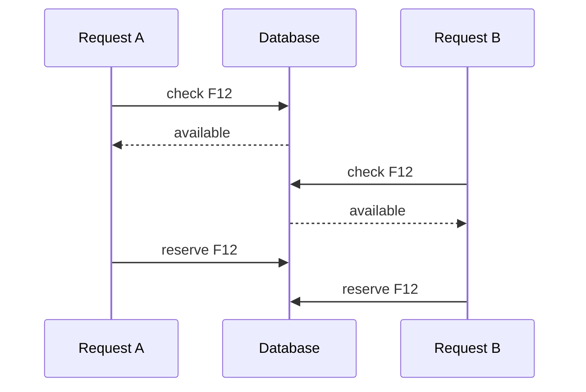
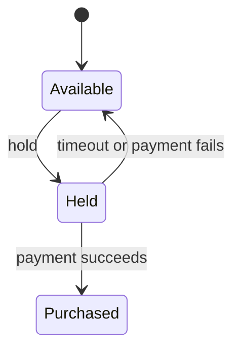
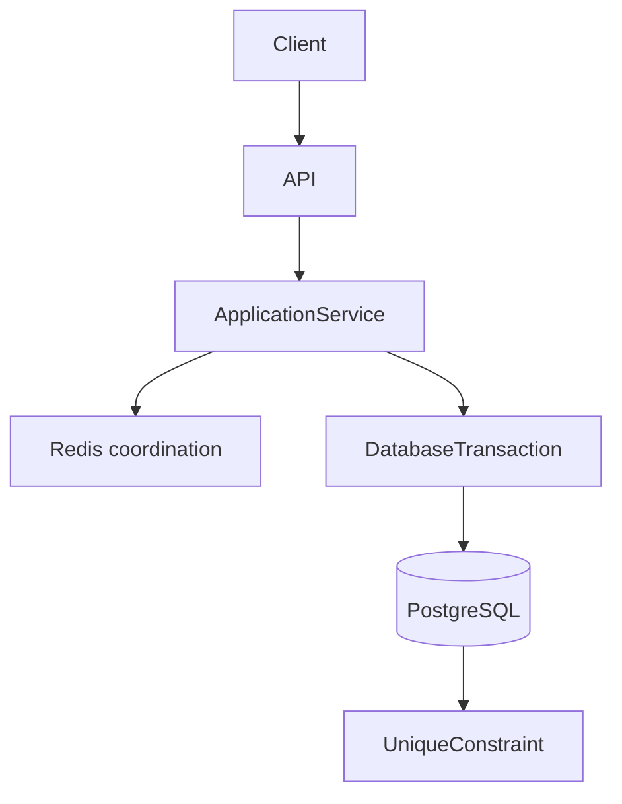

Some time ago, I bought a cinema ticket on my phone. I arrived early, sat in the seat printed on the stub, and a couple walked in just before the lights went down. One of their tickets had the same seat number. Mine was valid too.

I do not know what that booking system did. I never saw the code, the schema, or the logs. The story is useful as a shape, not as a postmortem:

```text
User A -> Seat F12 -> valid ticket
User B -> Seat F12 -> valid ticket
```

From the aisle, the product looks absurd. From the server, it is a question every checkout, inventory, and reservation API has to answer:

> How can one seat have two owners if the app showed it available?

The useful question is not the definition of a race condition. It is this: **how do you keep an exclusive resource consistent when concurrent requests try to claim it?**

## Both requests saw a valid world

A race condition is a correctness bug that depends on timing. Two executions interleave in a way the program did not account for. Neither request has to be wrong by itself. Both observed a state that was true when they looked.



The app was not lying. F12 _was_ available when request A read it. It was still available when request B read it. Then both reserved it.

> The failure is not a bad request. Both requests observed the same valid state before either request changed it.

That is a different phenomenon from the isolation terms in the SQL standard, and it helps to keep the names apart.

| Term               | What went wrong                                                                                   |
| ------------------ | ------------------------------------------------------------------------------------------------- |
| Race condition     | Correctness depends on interleaving. Here: two claims succeed for one exclusive resource.         |
| Lost update        | Two writers read-modify-write the same row; the later commit silently overwrites the earlier one. |
| Dirty read         | A transaction reads data another transaction has written but not committed.                       |
| Nonrepeatable read | A transaction reads the same row again and sees a committed change.                               |
| Phantom read       | A transaction re-runs a query and the _set_ of matching rows has changed.                         |

The cinema failure is usually a race on a **check-then-act** workflow. A lost update can sit next to it — two `UPDATE`s without a predicate, last write wins — but "last write wins" is not the same as "two tickets printed." [OWASP](https://owasp.org/www-community/pages/vulnerabilities/race_conditions) treats this class of bug as a server-side timing problem on shared state, not as a cryptography problem.

## Check, then act

The dangerous pattern looks correct in a single-threaded walkthrough.

```sql
SELECT id, status
FROM seats
WHERE id = 'F12'
  AND status = 'available';
```

Then, if a row came back:

```sql
UPDATE seats
SET status = 'reserved'
WHERE id = 'F12';
```

Between those two statements there is a window. Another request can run the same `SELECT` and get the same answer.

```text
T1: SELECT -> available
T2: SELECT -> available
T1: UPDATE -> reserved
T2: UPDATE -> reserved
```

`SELECT` is not the bug. `UPDATE` is not the bug. The bug is treating the observation as a reservation.

Wrapping both statements in `BEGIN` / `COMMIT` does not close that window by itself. A transaction groups work and gives you isolation rules. It does not invent a lock you never took, and it does not re-check a predicate you left off the `UPDATE`.

## Make the transition atomic

Put the condition on the write.

```sql
UPDATE seats
SET status = 'held',
    held_by = $2,
    hold_expires_at = now() + interval '10 minutes'
WHERE id = $1
  AND status = 'available';
```

That is a different operation. Availability is no longer a fact you learned earlier. It is a predicate of the mutation.

```text
affected rows = 1 -> the hold succeeded
affected rows = 0 -> someone else already took it, or it was never available
```

```ts
const result = await db.query(
  `UPDATE seats
   SET status = 'held',
       held_by = $2,
       hold_expires_at = now() + interval '10 minutes'
   WHERE id = $1
     AND status = 'available'`,
  [seatId, userId],
);

if (result.rowCount !== 1) {
  throw new SeatUnavailableError();
}
```

In [PostgreSQL's Read Committed](https://www.postgresql.org/docs/current/transaction-iso.html) — the default — a concurrent `UPDATE` on the same row waits for the first writer. When that writer commits, the second command **re-evaluates its `WHERE` against the updated row**. If `status` is no longer `available`, the second update affects zero rows. You do not need a second `SELECT` to learn that. You need to treat `rowCount === 0` as a conflict.

> Don't check whether the resource is available and then reserve it. Make the reservation conditional on it still being available.

The same shape protects a wallet:

```sql
UPDATE accounts
SET balance = balance - 2500
WHERE id = $1
  AND balance >= 2500;
```

A decrement that can go negative is a check-then-act in disguise: you read `balance`, subtracted in the application, then wrote the result. Two concurrent withdrawals both saw `2500` and both wrote `0`.

## Transactions are not magic

A transaction gives you atomicity, consistency, isolation, and durability for the work you put inside it. It does not make an incorrect workflow correct.

What you get depends on the statements, the [isolation level](https://www.postgresql.org/docs/current/transaction-iso.html), the locks those statements take, the constraints on the tables, and how the application handles `rowCount === 0` or a uniqueness error.

The SQL standard names four isolation levels. PostgreSQL implements three. If you ask for Read Uncommitted, you get Read Committed. PostgreSQL's Repeatable Read is stricter than the standard on phantoms: they are "allowed, but not in PG." Serialization anomalies — results that match no serial order of the transactions — remain possible until you use Serializable.

| Level                       | What it buys you                                                                                                                | What it does not buy you                                                                                                                   |
| --------------------------- | ------------------------------------------------------------------------------------------------------------------------------- | ------------------------------------------------------------------------------------------------------------------------------------------ |
| Read Committed (PG default) | No dirty reads. Each statement sees a snapshot as of that statement.                                                            | Two successive `SELECT`s in one transaction can disagree. Check-then-act still races unless the write is conditional or the row is locked. |
| Repeatable Read             | A stable snapshot for the transaction. No nonrepeatable reads. In PostgreSQL, no phantoms either.                               | Write skew and other serialization anomalies. Two transactions can still commit a pair of writes that could never happen one-at-a-time.    |
| Serializable                | Serializable Snapshot Isolation: abort with a serialization failure if the commit would not be equivalent to some serial order. | A free pass. The application must retry the failed transaction.                                                                            |

Do not "turn on Serializable" as a substitute for a conditional `UPDATE`. Serializable is the right tool for invariants that span several rows and cannot be expressed as one predicate or one constraint — two on-call doctors each going off duty after seeing the other still on is the usual write-skew example. For "this seat is available or it is not," a single conditional write is clearer, cheaper, and does not require a retry loop for serialization failures.

A transaction _is_ the right place to do several related writes: insert the hold, decrement a counter, record an outbox event. Isolation is not a substitute for stating the transition.

## Optimistic vs pessimistic locking

Sometimes the write needs more than `status = 'available'`. The client read a version, thought for a while, and now wants to apply a change that must not overwrite someone else's.

**Optimistic locking** assumes conflict is uncommon. You store a version (or an `updated_at` you treat as a version) and refuse to write if it moved.

```sql
UPDATE seats
SET status = 'held',
    version = version + 1
WHERE id = $1
  AND version = $2;
```

`affected rows = 0` means another transaction committed first. Retry from a fresh read, or tell the client the resource changed. This is an application convention. PostgreSQL will not invent a `version` column for you.

**Pessimistic locking** serializes the readers that intend to write. Inside a transaction:

```sql
SELECT id, status, held_by
FROM seats
WHERE id = $1
FOR UPDATE;
```

[PostgreSQL](https://www.postgresql.org/docs/current/explicit-locking.html): `FOR UPDATE` locks the selected rows against concurrent modification until the transaction ends. A second `SELECT FOR UPDATE` on F12 waits. When the first transaction commits, the waiter receives the **updated** row — or no row, if it was deleted. In Repeatable Read or Serializable, if the row changed since the snapshot, PostgreSQL raises an error instead of silently handing you a new version.

`FOR UPDATE` only helps if you inspect what you locked. If you lock F12 and then `UPDATE` it without looking at `status`, you still overwrite a hold you just waited to see.

Use optimistic locking when conflicts are rare and a retry is cheap — editing a booking note, applying a discount, updating a profile. Use pessimistic locking when the row is a hotspot and the critical section is short: last seat, last unit of stock, a ledger line you must read and write together. Holding `FOR UPDATE` across a payment-provider round trip is how you stall every other buyer of that seat.

Neither strategy is "the concurrency solution." Both are ways to notice that the world moved.

## Let the database protect the invariant

Application logic protects a workflow. Constraints protect an invariant.

The invariant for a screening is not "the seat row says reserved." It is: **a seat for a showtime has at most one active reservation.**

If reservations are rows — and they should be, if you need history, refunds, and expired holds — two concurrent inserts can both pass a `SELECT` that found nothing.

```sql
CREATE UNIQUE INDEX one_active_reservation
  ON reservations (showtime_id, seat_id)
  WHERE status IN ('held', 'purchased');
```

That is a [partial unique index](https://www.postgresql.org/docs/current/ddl-constraints.html). PostgreSQL will not express "unique among some rows" as a table `UNIQUE` constraint. A uniqueness restriction that covers only active reservations has to be a unique index with a `WHERE` clause. Cancelled and expired rows drop out of the index and stop blocking a new hold.

If two transactions insert `(showtime_42, F12, 'held')`, one commits. The other fails with a uniqueness violation. You map that error to the same conflict path as `rowCount === 0`.

[Unique indexes](https://www.postgresql.org/docs/current/indexes-unique.html) are how PostgreSQL enforces `UNIQUE` and primary keys. The constraint is not a style preference. It is the last line of defense when a bug, a retry, or a second code path forgets the conditional `UPDATE`.

Do not treat the index as the booking engine. It will not expire a hold, charge a card, or send a ticket. It will refuse to store two active owners. That is a different job, and it is the one the database can do even when the application is wrong.

## Temporary holds: AVAILABLE -> HELD -> PURCHASED

A real ticket flow is not `available -> purchased` in one click. Payment takes time. The buyer needs a short exclusive window. Everyone else needs the seat back if that window dies.



A hold that works has all of these, not just a status enum:

- **ownership** — who may complete or release it.
- **expiration** — a timestamp the database can compare, not a hope that the client will come back.
- **controlled transitions** — each `UPDATE` names the status it is leaving.
- **reclamation** — a job or a next-writer path that returns expired holds to `available`.

```sql
UPDATE seats
SET status = 'purchased'
WHERE id = $1
  AND held_by = $2
  AND status = 'held'
  AND hold_expires_at > now();
```

```sql
UPDATE seats
SET status = 'available',
    held_by = NULL,
    hold_expires_at = NULL
WHERE status = 'held'
  AND hold_expires_at <= now();
```

The second statement is how you release inventory without a distributed lock. It is itself a conditional update. Two reclaimers cannot both "succeed" in a way that matters: both set the same final state.

Do not invent a cinema vendor's internals here. The pattern is the same for hotel rooms, appointment slots, and flash-sale SKUs: exclusive claim, time-bounded, then a terminal success or a return to the pool.

`AVAILABLE -> PURCHASED` can exist as a single step when payment is not in the loop — an admin comp, a zero-price reservation. Encode it as its own transition. Do not let a stray `UPDATE seats SET status = 'purchased'` skip the hold invariants you just designed.

## Tell the client it lost: 409 Conflict

Once the write is conditional, the API has to say what `rowCount === 0` means.

[RFC 9110 §15.5.10](https://www.rfc-editor.org/rfc/rfc9110#name-409-conflict): **409 Conflict** means the request could not be completed because it conflicts with the current state of the target resource. The server SHOULD send a body with enough information for the user to recognize the conflict. The example in the RFC is a PUT that loses a versioning race. A seat that is no longer available is the same class of problem: the request was well-formed; the resource will not accept that state change.

```http
HTTP/1.1 409 Conflict
Content-Type: application/json

{
  "error": "seat_unavailable",
  "seatId": "F12",
  "showtimeId": "show_20h"
}
```

| Status | Use it when                                                                                                                                                           |
| ------ | --------------------------------------------------------------------------------------------------------------------------------------------------------------------- |
| 400    | The request is malformed. You cannot even evaluate the transition.                                                                                                    |
| 409    | The seat exists; this transition is illegal in the current state. Another buyer won, or the hold expired.                                                             |
| 412    | A precondition header failed: `If-Match` on an ETag, `If-Unmodified-Since`. [RFC 9110 §15.5.13](https://www.rfc-editor.org/rfc/rfc9110#name-412-precondition-failed). |

409 is not "try the same hold again immediately." The client should refresh availability and pick a different seat — or the same seat only after seeing it free. Document the 409 body in the OpenAPI contract; a client that only knows `201` will mishandle this path. That contract work is in [OpenAPI and Swagger in NestJS](/blog/openapi-swagger-nestjs/).

## Redis coordinates. PostgreSQL decides.

Redis is good at short-lived coordination: a lock while you talk to a payment provider, a cache of "seats remaining," a TTL that matches a hold window. It is not a substitute for the invariant.

The documented single-instance lock is atomic:

```text
SET seat:show_20h:F12 <unique-token> NX PX 30000
```

[Redis `SET`](https://redis.io/docs/latest/commands/set/) with `NX` and an expiry sets the key only if it is absent. The value must be a token the locker created. You release the lock only if the token still matches — Redis documents that a client which outlives `PX` can otherwise `DEL` a lock someone else now owns.

That already lists the failure modes that matter:

- **expiration** — the lock dies while payment is still running; a second client acquires it.
- **crash after expire** — the first process wakes up and deletes the second client's lock if you used bare `DEL`.
- **async replication** — [Redis's own lock page](https://redis.io/docs/latest/develop/clients/patterns/distributed-locks/) describes the race: client A locks on the master, the master dies before the replica sees the key, the replica is promoted, client B locks the same resource. Mutual exclusion is broken.

Sometimes that is acceptable: you wanted to shed load, not to decide ownership. For a seat, a coupon, or a wallet, it is not acceptable. The database still has to refuse a second active owner. A Redis lock in front of a check-then-act `UPDATE` is still check-then-act, with a second system that can disagree.

> A Redis lock is coordination. It is not database integrity.

## Idempotency is not locking

Two users hammering F12 is a race. One user hammering **Pay** is a duplicate.

```text
POST /orders
```

The client times out. The user taps again. A load balancer retries. You now have two HTTP requests for one intended purchase.

[RFC 9110 §9.2.2](https://www.rfc-editor.org/rfc/rfc9110#name-idempotent-methods): a method is idempotent if the intended effect of several identical requests is the same as one. `PUT` and `DELETE` are. `POST` is not. A client SHOULD NOT automatically retry a non-idempotent method unless it has some other way to know the semantics are safe.

The usual other way is a client-generated key:

```http
POST /orders
Idempotency-Key: 7b8f0c2a-3d91-4e1e-9c4a-12ab34cd56ef
```

That header is not an HTTP standard. It is an [IETF HTTPAPI Internet-Draft](https://datatracker.ietf.org/doc/html/draft-ietf-httpapi-idempotency-key-header) and the header [Stripe documents](https://docs.stripe.com/api/idempotent_requests) for safe retries: store the first response for that key, replay it on later requests with the same key, and do not apply the side effect twice.

Locking answers "who may change F12 right now." Idempotency answers "is this the same operation I already accepted." A second user with a different key should still lose the seat. A retry with the **same** key should return the original hold, not a 409 against yourself.

Persist the key in the same transaction as the hold when you can. That is the same rule as persisting a Pub/Sub `eventId` with the side effect — see [how to use Pub/Sub correctly](/blog/google-cloud-pubsub-how-to-use-it-correctly/) for the consumer side of retries.

> Locking controls concurrent access to a resource. Idempotency controls repeated attempts of the same operation.

## The same exclusive-resource problem

The cinema seat is one exclusive claim. The invariant changes; the design does not.

| Resource                      | What must stay true                                                                   |
| ----------------------------- | ------------------------------------------------------------------------------------- |
| Cinema seat / flight seat     | One active hold or purchase per seat per departure.                                   |
| Product inventory             | `stock` never goes negative; units reserved for a cart are not sold twice.            |
| Hotel room / appointment slot | One occupant (or one booking) for the interval.                                       |
| Coupon                        | Redeemed at most once per the rule — globally, or once per customer.                  |
| Wallet / bank transfer        | Balances stay non-negative (or within an agreed limit); one debit matches one intent. |
| Order creation                | One logical checkout does not create two paid orders.                                 |
| Limited edition               | Issued count never exceeds the cap.                                                   |

Inventory is usually `UPDATE ... SET stock = stock - $n WHERE id = $1 AND stock >= $n`. A coupon is a conditional update (`redeemed_at IS NULL`) plus a unique `(coupon_id, user_id)` if the rule is per customer. A transfer is two conditional updates in one transaction, or a ledger insert whose uniqueness is the transfer id. An order is an idempotency key plus a unique business key (`cart_id`, `checkout_attempt_id`) so retries do not double-charge.

If two clients can change the same counter, the same slot, or the same pot of money, concurrency is not an edge case. It is the API.

## Design the transitions that must never happen

Stop asking "is this seat available?" That question is a `SELECT` you will act on too late. Ask what transition must be impossible to violate.

```text
AVAILABLE -> HELD        only if still AVAILABLE
HELD      -> PURCHASED   only by the owner, only before expiry
HELD      -> AVAILABLE   expiry, cancel, or failed payment
AVAILABLE -> PURCHASED   only on an explicit, valid path
```

That is a state machine. Illegal arrows are not "we will try not to." They are predicates on `UPDATE`, unique indexes on active rows, and 409s when the write does not land.



The API authenticates, validates the body, and returns 409 with a useful body. The application service chooses the transition and maps `rowCount` and uniqueness errors. The transaction groups the hold, the outbox, the idempotency row. PostgreSQL is the source of truth. Redis, if it is there, sheds contention or caches a count. It does not get a vote on whether F12 has two owners.

Concurrency belongs in that design, not in the incident review after two tickets print for one seat.

A system that is correct under concurrency does not depend on requests arriving in a polite order. One request, a hundred, or ten thousand can aim at the same row. The invariant still holds, because the write that would break it cannot commit.

If more than one client can change the same state, concurrency is not an edge case. It is normal traffic. Design for that, or the aisle will explain the bug to you.

## Sources

- PostgreSQL, [13.2. Transaction Isolation](https://www.postgresql.org/docs/current/transaction-iso.html) — Read Committed re-evaluates `WHERE` after waiting; Read Uncommitted maps to Read Committed; Repeatable Read has no phantoms in PostgreSQL; Serializable uses SSI and requires retry
- PostgreSQL, [13.3. Explicit Locking](https://www.postgresql.org/docs/current/explicit-locking.html) — `SELECT … FOR UPDATE` locks rows until the transaction ends; waiter sees the updated row
- PostgreSQL, [5.5. Constraints](https://www.postgresql.org/docs/current/ddl-constraints.html) — unique constraints; uniqueness over a subset of rows requires a unique partial index
- PostgreSQL, [11.6. Unique Indexes](https://www.postgresql.org/docs/current/indexes-unique.html) — unique indexes enforce `UNIQUE` and primary keys
- PostgreSQL, [UPDATE](https://www.postgresql.org/docs/current/sql-update.html) — `UPDATE` as a single command with a search condition
- IETF, [RFC 9110 — HTTP Semantics](https://www.rfc-editor.org/rfc/rfc9110) — §9.2.2 idempotent methods (`POST` is not); §15.5.10 `409 Conflict`; §15.5.13 `412 Precondition Failed`
- IETF HTTPAPI, [The Idempotency-Key HTTP Header Field](https://datatracker.ietf.org/doc/html/draft-ietf-httpapi-idempotency-key-header) — Internet-Draft, not an RFC
- Stripe, [Idempotent requests](https://docs.stripe.com/api/idempotent_requests) — `Idempotency-Key` as the documented retry contract
- Redis, [SET](https://redis.io/docs/latest/commands/set/) — `NX` plus expiry as an atomic lock acquire
- Redis, [Distributed locks](https://redis.io/docs/latest/develop/clients/patterns/distributed-locks/) — token on release; expiry while work continues; async-replication safety violation
- OWASP, [Race Conditions](https://owasp.org/www-community/pages/vulnerabilities/race_conditions) — concurrent requests on shared state without coordination
