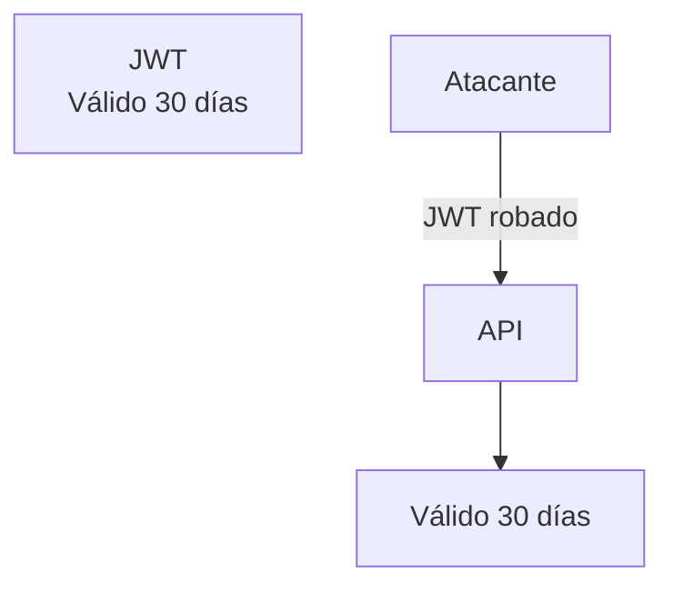
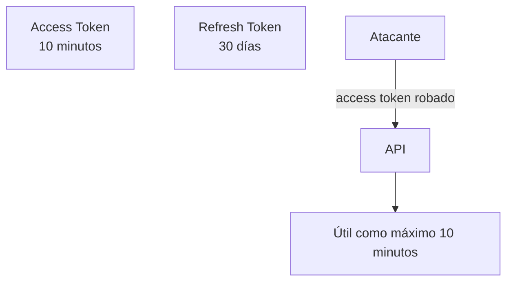
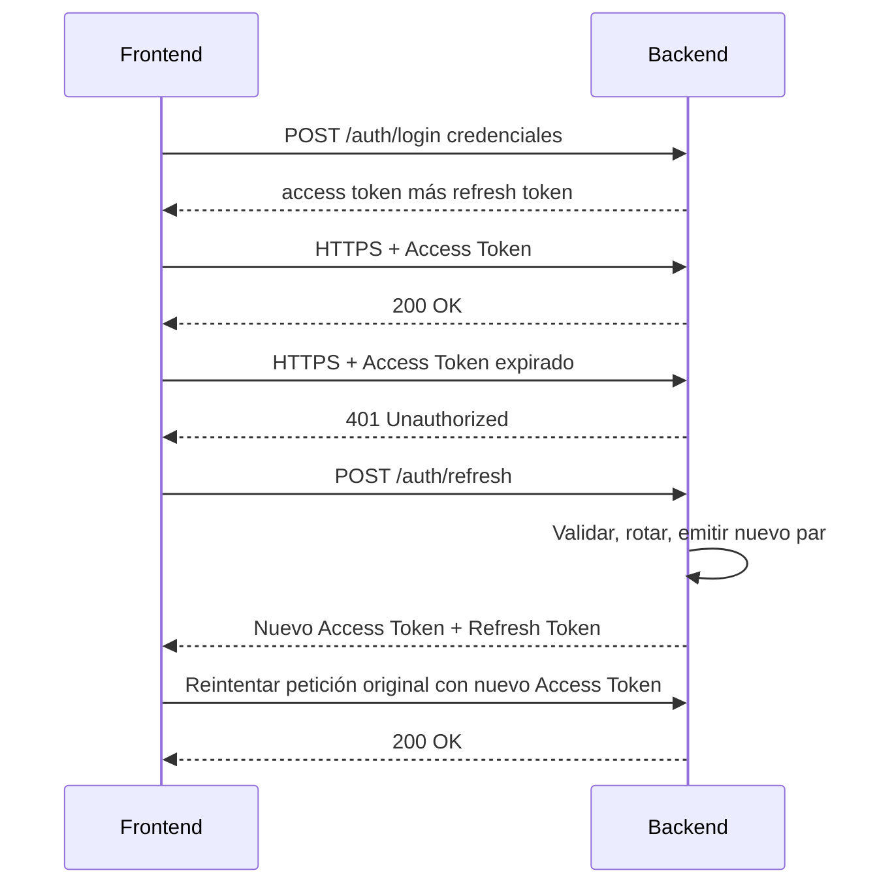
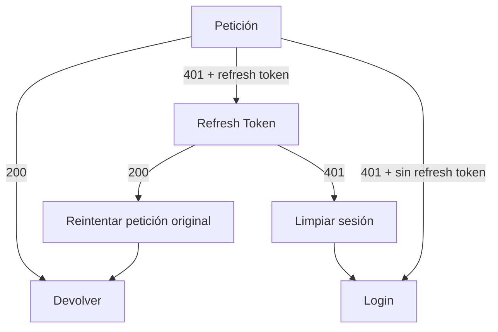
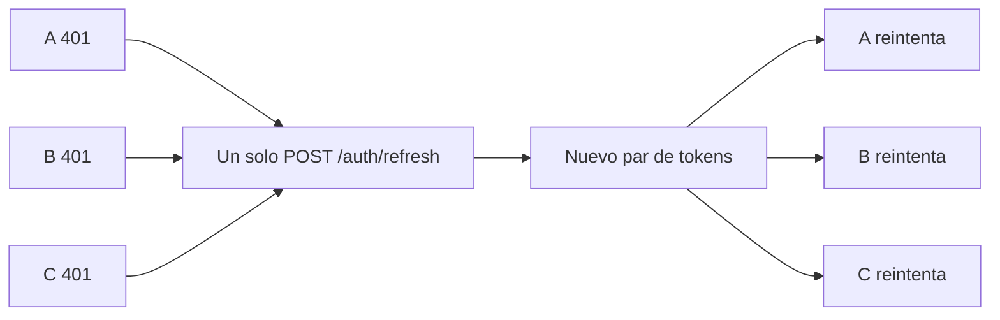
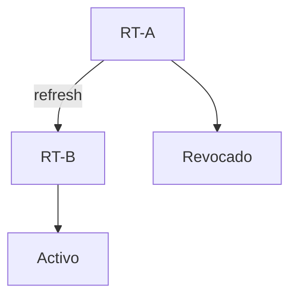
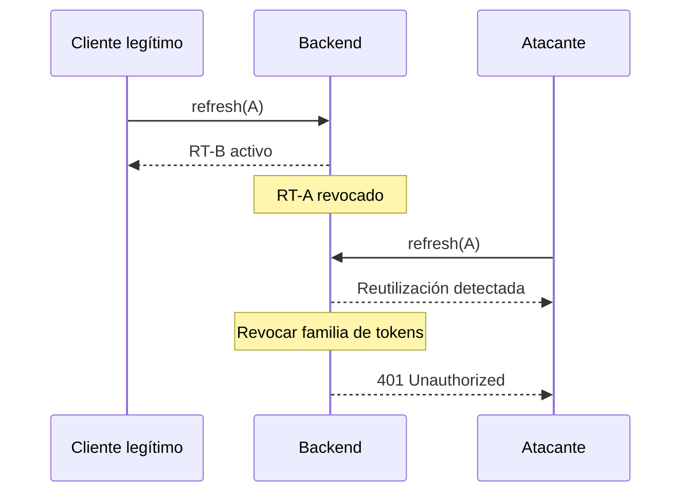
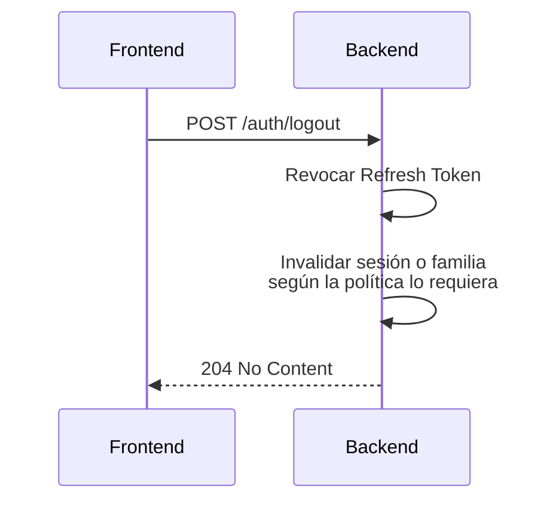
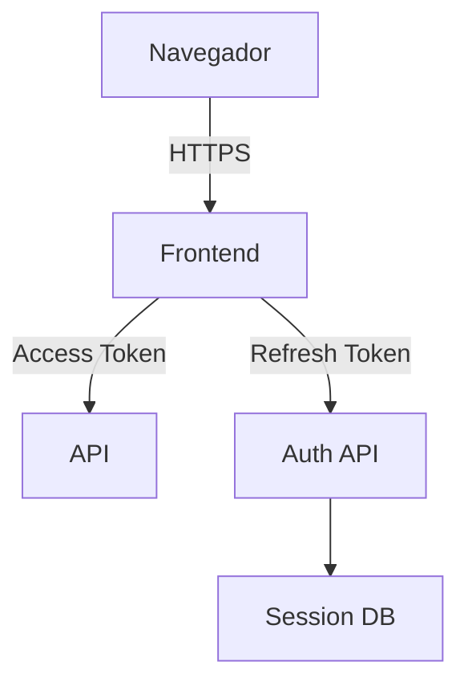

Un usuario inicia sesión en una app SaaS a las 09:00. Seguirá trabajando a las 17:00. Nadie quiere escribir una contraseña cada quince minutos. Nadie debería publicar un JWT que siga válido durante treinta días.

Esa tensión es el problema entero. La credencial que viaja con cada petición es valiosa para un atacante. Cuanto más vive, mayor es la ventana si se filtra. Cuanto menos vive, más a menudo el usuario parece desconectado.

El atajo habitual es un access token de larga vida. La queja habitual es que los tokens de corta vida «rompen la sesión». Ambos pasan por alto la división de responsabilidades.

> El access token autoriza peticiones. El refresh token obtiene nuevas credenciales de acceso sin volver a pedir la contraseña del usuario. Juntos mantienen una sesión utilizable y limitan la vida de la credencial que viaja con cada petición.

Un refresh token **no** mantiene vivo un access token. El access token expira. El cliente usa entonces el refresh token para emitir un par nuevo. El usuario nunca ve ese salto si el cliente está bien escrito.

Este artículo es la arquitectura de ese salto: por qué existe el par, cómo deberían comportarse frontend y backend, dónde viven los tokens, cómo funcionan la rotación y la revocación, y cuándo una sesión clásica en el servidor es el mejor diseño. NestJS aparece al final como un bosquejo, no como el objetivo. CORS, rate limiting y Helmet van delante de esta capa; no la sustituyen — ese stack está en [CORS, rate limiting y Helmet en NestJS](/blog/cors-rate-limiting-security-headers-nestjs/).

El vocabulario viene de [OAuth 2.0](https://www.rfc-editor.org/rfc/rfc6749). Una API NestJS first-party que emite sus propios tokens **no** es automáticamente un servidor de autorización. Es un modelo de sesión que tomó prestados los nombres de OAuth. Los principios de seguridad siguen vigentes. La ceremonia de protocolo no se realiza simplemente porque hayas firmado un JWT.

## Un JWT de 30 días es un incidente de 30 días

[RFC 7519](https://www.rfc-editor.org/rfc/rfc7519) define JSON Web Token: un conjunto de claims firmado (o cifrado). No define una sesión. No define logout. No define revocación. Un JWT que verifica es un JWT que verifica, hasta `exp`.

Trátalo como una sesión y el modo de fallo es simple.



Cambiar la contraseña no ayuda salvo que también rotes las signing keys o mantengas una denylist que la API consulte en cada petición. Hacer logout en el navegador no ayuda: el token sigue siendo una credencial bearer válida. [OWASP Session Management](https://cheatsheetseries.owasp.org/cheatsheets/Session_Management_Cheat_Sheet.html) es explícito: un identificador de sesión es temporalmente equivalente al método de autenticación que lo creó. Un bearer token de 30 días es una contraseña de 30 días que no puedes cambiar.

Compara el mismo robo frente a una vida dividida:



El refresh token sigue siendo un secreto de alto valor. Debe almacenarse con más cuidado, enviarse con menos frecuencia y ser revocable. La ganancia no es «el refresh token es inofensivo». La ganancia es que la credencial en cada `GET /invoices` ya no es una llave de un mes.

Esos números son ejemplos. Una app bancaria, una herramienta de admin interna y un SaaS de consumo no comparten modelo de amenazas. Cinco minutos y siete días es un par de partida habitual. Quince minutos y treinta días es otro. La combinación correcta depende del riesgo, del tipo de dispositivo y de si se puede revocar la parte de larga duración.

Un JWT es un formato. Una sesión es una decisión en el servidor de que el usuario todavía puede actuar. Confundir las dos cosas es cómo los access tokens de larga vida llegan a producción.

## Estas palabras no son el mismo trabajo

Los equipos comprimen «estar autenticado» en un solo bloque y luego discuten el TTL del token. Los nombres parecen parientes. Los trabajos no lo son.

| Término       | Trabajo                                                                                        |
| ------------- | ---------------------------------------------------------------------------------------------- |
| Autenticación | Probar quién es el usuario, una vez, con credenciales o un factor más fuerte                   |
| Sesión        | La decisión en el servidor de que esa prueba sigue en vigor                                    |
| Access token  | Una credencial de corta vida que la API acepta en peticiones ordinarias                        |
| Refresh token | Una credencial de vida más larga usada solo para obtener un access token nuevo                 |
| Expiración    | Un límite de reloj tras el cual un token no debe aceptarse                                     |
| Rotación      | Emitir un refresh token nuevo e invalidar el que se acaba de usar                              |
| Revocación    | Marcar un token, una familia o cada sesión como inutilizable antes de la expiración            |
| Logout        | Terminar la sesión. Logout local limpia el cliente. Logout en el servidor revoca lo que emitió |

**Autenticación** ocurre en el login — y otra vez si haces step-up para una acción sensible. Es un evento.

**Sesión** es el periodo después de ese evento durante el cual el sistema todavía confía en el usuario. En una app clásica con cookie la sesión es una fila (o una cookie firmada) que el servidor puede borrar. En un diseño access-plus-refresh la sesión suele ser el registro del refresh token: valor hasheado, expiración, familia, bandera de revocación, dispositivo.

**Access token** responde «¿puede proceder esta petición ahora mismo?» Se presenta a menudo. Debe ser corto.

**Refresh token** responde «¿puede este cliente obtener un access token nuevo sin contraseña?» Se presenta rara vez. Debe estar mejor protegido, y el servidor debe poder decir que no.

**Expiración** es un reloj. No es revocación. Un token expirado es inválido. Un token revocado puede seguir sin expirar.

**Rotación** es cómo un refresh token de larga vida deja de ser un único secreto estático. Cada uso emite un sucesor y mata al predecesor.

**Revocación** es cómo terminas una sesión a propósito: logout, cambio de contraseña, sospecha de robo, bloqueo de admin.

**Logout** no es «borrar `localStorage`». Eso es limpieza local. Si el refresh token sigue verificando en el servidor, la sesión sigue viva en otra pestaña, otro dispositivo o en el replay de un atacante.

## El flujo que el cliente tiene que acertar

Un access token válido es aburrido: lo envías, recibes 200. La expiración no es un error en el sentido de producto. Es el diseño funcionando. El frontend debe tratar ese 401 como «intenta renovar», no como «el usuario se fue», hasta que el refresh mismo falle. Luego se reintenta la llamada original. El componente que inició la petición debería ver un 200, no una página de login.



Esa secuencia es el producto: un access token de corta vida y una sesión que sigue sintiéndose continua. Alguien que nunca haya implementado refresh tokens debería poder leerla y predecir qué mostrará la pestaña de red a las 09:05.

## Cómo debería comportarse el frontend

La UI no debe encargarse de esto. Una página que captura 401, llama a refresh y reintenta lo hará mal la tercera vez que tres peticiones fallen juntas. El cliente HTTP es el dueño del patrón: interceptor de Axios, wrapper de `fetch`, middleware de cliente generado. La librería no es la arquitectura.

Comportamiento esperado:

1. Enviar la petición con el access token.
2. Si la API devuelve 200, devolver esa respuesta al caller.
3. Si la API devuelve 401 porque el access token expiró:
   - interceptar.
   - llamar a `POST /auth/refresh` una vez.
   - guardar los tokens nuevos en el mecanismo que hayas elegido.
   - repetir la petición original.
   - devolver esa respuesta al caller.
4. Si el refresh falla, limpiar la sesión y enviar al usuario al login.

Un 401 no siempre significa «access token expirado». Un usuario revocado, un token malformado y una cabecera `Authorization` ausente pueden producir 401. El camino de refresh debería ejecutarse cuando tienes un refresh token y la petición estaba autenticada. Si el refresh también devuelve 401, para. No hagas refresh en bucle.



Pseudocódigo del interceptor. Este es el patrón, no un tutorial de Axios.

```ts
let refreshInFlight: Promise<TokenPair> | null = null;

async function request(input: Request) {
  const response = await http(withAccessToken(input));
  if (response.status !== 401 || isRefreshCall(input)) {
    return response;
  }

  try {
    const tokens = await refreshSingleFlight();
    storeTokens(tokens);
    return http(withAccessToken(input));
  } catch {
    clearSession();
    redirectToLogin();
    throw new SessionExpiredError();
  }
}

function refreshSingleFlight() {
  if (!refreshInFlight) {
    refreshInFlight = refresh().finally(() => {
      refreshInFlight = null;
    });
  }
  return refreshInFlight;
}
```

`isRefreshCall` importa. Si `/auth/refresh` devuelve 401 y el mismo interceptor lo trata como «refresh otra vez», tienes un bucle infinito. Excluye las rutas de refresh (y login) del camino de reintento.

### Single-flight refresh

Un dashboard no hace una petición. Hace tres. Si cada interceptor llama a `/auth/refresh`, emites tres rotaciones del mismo refresh token. Con rotación habilitada, el primero tiene éxito e invalida el token. El segundo presenta un token revocado. La detección de reutilización puede entonces matar la familia, incluido el token que la primera llamada acaba de emitir. El usuario queda desconectado porque la UI cargó tres widgets.

**Single-flight refresh** significa que un solo refresh está en curso. A, B y C esperan la misma promise. Cuando resuelve, los tres reintentan con el access token nuevo. Cuando rechaza, los tres van al login.



Esa es una regla de concurrencia del cliente. El backend no puede salvarte de tres rotaciones en paralelo de un token de un solo uso.

## Qué debería hacer el backend

### Login

Valida la contraseña (o la aserción del IdP) primero. Luego emite dos credenciales distintas.

El **access token** suele ser un JWT. Conceptualmente lleva:

- `sub` — quién es.
- `exp` — cuándo muere esta credencial.
- `iat` / `nbf` — issued-at / not-before cuando los uses.
- `iss` / `aud` — quién lo emitió y quién debería aceptarlo.
- roles o scopes contra los que la API autorizará.

Mantenlo pequeño. No metas el perfil. No pongas secretos en claims. Quien pueda leer el token puede leer el payload de un JWT firmado.

El **refresh token** es un handle de sesión. Dos formas habituales:

- un valor aleatorio **opaco**, almacenado solo como hash, como una contraseña.
- un token **firmado** cuyo `jti` (o equivalente) apunta a una fila de sesión.

En ambos casos el servidor guarda una fila que puede revocar. El valor que tiene el cliente no debe almacenarse en texto plano en el servidor. Hashéalo. Si la tabla se filtra, los tokens no deberían poder replicarse.

El login crea esa fila: usuario, hash, expiración, id de familia, metadatos de dispositivo si los tienes. El id de familia es cómo la detección de reutilización posterior revoca «este login», no una cadena suelta.

### Una petición ordinaria

```text
Authorization: Bearer <access-token>
```

La API valida el access token, no el refresh token. Comprobaciones típicas:

- firma, con la clave actual.
- algoritmo esperado — rechazar `none`, rechazar confusión de alg.
- `iss` / `aud` cuando los hayas definido.
- `exp` (y `nbf`).
- claims contra los que la ruta autorizará.
- estado de sesión o denylist **si** tu arquitectura lo requiere.

Un JWT firmado puede aceptarse sin consultar un almacén. Ese es el beneficio operativo y el coste de revocación. Si la API nunca consulta un store, una sesión revocada sigue funcionando hasta `exp`. Un TTL corto del access token es cómo haces ese coste aceptable. Si necesitas corte instantáneo, añades introspection o una denylist y has reintroducido estado del servidor en el camino crítico.

### Refresh

```text
POST /auth/refresh
```

Este endpoint no es «login otra vez». Es «demuestra que todavía tienes el secreto de la sesión».

El backend debería:

1. recibir el refresh token (body, cookie, o ambos — elige un modelo y cúmplelo).
2. localizar su representación en el servidor (búsqueda por hash, o `jti` --> fila).
3. validar integridad (aleatoriedad + hash, o firma).
4. comprobar expiración.
5. comprobar revocación.
6. comprobar contexto o familia cuando uses uno (el usuario sigue existiendo, el cliente sigue permitido, el dispositivo sigue reconocido).
7. revocar o rotar el token que se acaba de presentar.
8. generar un access token nuevo.
9. generar un refresh token nuevo.
10. devolver el par nuevo.

Si cualquier comprobación falla, devolver 401 y no emitir tokens. Si la detección de reutilización dispara, revocar la familia primero, luego devolver 401.

[RFC 6749 §6](https://www.rfc-editor.org/rfc/rfc6749#section-6) es la forma OAuth de este intercambio: el refresh token es un grant usado en el token endpoint para obtener un access token nuevo. Un first-party `/auth/refresh` es la misma idea con menos protocolo.

## Rotación de refresh tokens

El modelo ingenuo mantiene un refresh token durante toda la vida de la sesión. Si A se filtra, el atacante hace refresh indefinidamente, o hasta que A expire. No puedes distinguir la filtración del cliente legítimo. Ambos presentan un A válido.

La rotación hace A de un solo uso. A debe morir cuando nace B.



Eso es **rotación de refresh tokens**: cada refresh exitoso emite un refresh token nuevo e invalida el anterior. [RFC 9700 §4.14](https://www.rfc-editor.org/rfc/rfc9700.html#section-4.14) exige que los clientes públicos usen rotación o tokens vinculados al emisor (DPoP, mTLS). Una SPA en el navegador es un cliente público. No puede guardar un client secret.

### Detección de reutilización

Supón que A fue robado. El cliente legítimo hace refresh primero y recibe B. El atacante presenta A después.



El servidor no puede saber cuál de los dos es el ladrón. RFC 9700 es explícito al respecto. La reacción segura es revocar la **familia**: A, B y cualquier sucesor. El usuario legítimo inicia sesión otra vez. El atacante deja de emitir access tokens.

Eso es **detección de reutilización de refresh tokens**. No es obligatoria para cada herramienta interna. Vale la pena cuando el refresh token vive en un cliente público, viaja por un navegador, o sería de otro modo un secreto reutilizable de larga vida. Los tokens vinculados al emisor (el token no sirve sin una clave privada a la que el servidor lo ató) son la alternativa más fuerte en la misma sección de RFC 9700. La mayoría de first-party SPAs empiezan con rotación más revocación de familia. Menciona DPoP cuando el modelo de amenazas dice que los tokens robados se van a replicar desde otra máquina.

La rotación sin detección de reutilización sigue limitando un token robado a un uso. La detección de reutilización es lo que convierte el segundo uso en un evento de seguridad en vez de un 401 confuso.

## Dónde viven los tokens

No hay un almacén universalmente correcto. Hay un modelo de amenazas.

| Almacén          | JavaScript puede leerlo      | Sobrevive al reload | Riesgo típico                                     |
| ---------------- | ---------------------------- | ------------------- | ------------------------------------------------- |
| `localStorage`   | sí                           | sí                  | XSS roba tokens del origin                        |
| `sessionStorage` | sí                           | vida de la pestaña  | misma superficie XSS, vida más corta              |
| memory           | sí, mientras vive la pestaña | no                  | XSS todavía puede leerlo; el reload cierra sesión |
| cookie HttpOnly  | no                           | sí                  | XSS no puede leerlo; CSRF pasa a ser relevante    |

[OWASP Session Management](https://cheatsheetseries.owasp.org/cheatsheets/Session_Management_Cheat_Sheet.html) te dice que no pongas tokens de autenticación, JWTs ni refresh tokens en `localStorage` o `sessionStorage`. Esas APIs son visibles para cada script del origin. Un bug de XSS revela la sesión.

Memory es mejor contra persistencia y un poco mejor contra XSS casual (el token no está sentado en una clave conocida). Un XSS completo sigue corriendo en la página y puede leer lo que tenga el interceptor, o simplemente llamar a tu API como el usuario. Memory también pierde la sesión en el reload, así que los equipos suelen devolver el refresh token a un almacén que intentaban evitar.

Las cookies HttpOnly mantienen el refresh token fuera de `document.cookie` y de los lectores XSS. [La guía de cookies de MDN](https://developer.mozilla.org/en-US/docs/Web/HTTP/Guides/Cookies) y [`Set-Cookie`](https://developer.mozilla.org/en-US/docs/Web/HTTP/Headers/Set-Cookie) describen las banderas que importan:

- **HttpOnly** — no expuesto a JavaScript.
- **Secure** — enviado solo en HTTPS.
- **SameSite** — `Strict` o `Lax` reducen envíos cross-site; `None` exige `Secure` y es la opción sensible a CSRF para SPAs cross-site.

Las cookies no eliminan XSS. Cambian lo que XSS puede robar. Un script inyectado todavía puede disparar peticiones que el navegador autenticará. También introducen **CSRF** si un sitio externo puede hacer que el navegador envíe la cookie. [OWASP CSRF Prevention](https://cheatsheetseries.owasp.org/cheatsheets/Cross-Site_Request_Forgery_Prevention_Cheat_Sheet.html) es la otra mitad de un diseño con cookies: SameSite, cabeceras de petición personalizadas que el navegador no añadirá cross-site, y tokens anti-CSRF cuando SameSite no basta.

Una división habitual para una first-party web app:

- access token en memory, enviado como `Authorization: Bearer`.
- refresh token en una cookie HttpOnly, Secure, SameSite con alcance a `/auth/refresh`.

El access token sigue apareciendo en JS (lo pones en la cabecera). El secreto de larga vida no. Las SPAs cross-origin entonces necesitan CORS con credenciales, disciplina de `Domain`/`Path` de la cookie, y una estrategia de CSRF. Las apps del mismo origin tienen un modelo de cookies más fácil.

Un Backend-for-Frontend que guarda tokens en el servidor y le da al navegador solo una cookie de sesión es otra forma de mantener los refresh tokens fuera del origin. Es una elección de arquitectura, no una bandera de cabecera.

Elige el almacén según la amenaza, el diseño de origins y lo que de verdad puedas revocar. No lo elijas por un tweet que dice «nunca cookies» o «nunca localStorage» sin el resto de la frase.

## Logout es una decisión del servidor

Limpiar tokens en el frontend impide que **esta** pestaña llame a la API. No detiene un refresh token robado, un segundo dispositivo o un service worker que todavía tiene el par.

```text
Logout local
      │
      └── el cliente olvida los tokens
          el servidor todavía acepta el refresh token
```

```text
Logout en el servidor
      │
      └── el servidor revoca la sesión
          el cliente entonces olvida los tokens
```

El flujo que encaja con la arquitectura:



Luego el cliente limpia storage y memory. El orden importa menos que hacer ambas cosas. Si la llamada de red falla, limpia el cliente de todas formas — y sigue intentando revocar cuando puedas, porque un refresh token dejado vivo es una sesión.

Tres alcances que la gente comprime en un botón:

- **este dispositivo** — revocar el refresh token / familia actual.
- **todos los dispositivos** — revocar cada familia del usuario.
- **global** — cambio de contraseña, desactivación de admin, filtración de credenciales: revocar cada sesión y, si puedes, invalidar access tokens que siguen dentro de su TTL.

El JWT de acceso seguirá siendo aceptable hasta `exp` salvo que lo pongas en denylist o hagas introspection. Eso es lo esperado. Por eso diez minutos es más fácil de defender que treinta días. RFC 9700 permite a los servidores de autorización revocar refresh tokens en logout o cambio de contraseña. Haz lo mismo en una tabla de sesión.

## Access token versus refresh token

Este es el modelo general, no una ley.

| Característica | Access token               | Refresh token                  |
| -------------- | -------------------------- | ------------------------------ |
| Propósito      | autorizar peticiones       | obtener tokens nuevos          |
| Vida           | corta                      | larga                          |
| Uso            | frecuente                  | ocasional                      |
| Exposición     | mayor                      | debe estar mejor protegido     |
| Revocación     | normalmente difícil o cara | debe ser posible               |
| Rotación       | normalmente no             | recomendada                    |
| Almacenamiento | depende de la arquitectura | necesita protección más fuerte |

Un access token puede ser un JWT o un handle opaco. Un refresh token puede rotarse o ser vinculado al emisor. La tabla describe la división habitual: access tokens cortos, presentados con frecuencia, difíciles de revocar, más refresh tokens largos, presentados rara vez, rastreados en el servidor.

## Los refresh tokens no hacen seguro el diseño

Cambian la vida de la credencial en el camino crítico. Todo lo demás sigue siendo tu trabajo:

- almacenamiento que encaje con XSS y CSRF.
- HTTPS en cada salto que vea un token.
- rotación de refresh tokens para clientes públicos.
- revocación que de verdad puedas ejecutar.
- detección de reutilización cuando la rotación es el control.
- expiración en **ambos** tokens — un refresh token sin `exp` es una sesión permanente.
- un registro de sesión, no solo un blob firmado.
- secretos y signing keys que roten.
- validación JWT que compruebe alg, firma, `exp` e `iss`/`aud` cuando los uses.

Sáltate el almacén y tienes un JWT de larga vida con pasos extra. Sáltate HTTPS y el par es visible en la red. Sáltate la rotación y un refresh token robado es una llave duradera. Sáltate CSRF en cookies y una página externa puede hacer refresh por el usuario. El par es un patrón. No es un control.

## 09:00, y el usuario nunca lo ve

Un access token de diez minutos en una app SaaS: login a las 09:00, `GET /invoices` a las 09:04 devuelve 200, Exportar a las 09:05 recibe 401, el interceptor ejecuta `POST /auth/refresh`, el backend rota, el reintento devuelve 200. El usuario hizo clic en un botón. El producto no pide una contraseña. **La sesión puede continuar mientras las credenciales de acceso siguen siendo de corta vida.** Si el refresh falla — familia revocada, refresh token expirado, token reutilizado — el mismo interceptor limpia la sesión y muestra el login.

## Un bosquejo de NestJS, después de la arquitectura

NestJS puede implementar esto. No lo inventa. [Authentication](https://docs.nestjs.com/security/authentication) y la [receta de Passport JWT](https://docs.nestjs.com/recipes/passport) cubren firmar un access token y proteger rutas. No implementan rotación de refresh por ti. La tabla de sesión es tu diseño.

Prisma aquí es una forma de persistir sesiones. Una tabla SQL, Redis u otro almacén con las mismas columnas es la misma arquitectura.

```prisma
model Session {
  id             String    @id @default(cuid())
  userId         String
  tokenHash      String    @unique
  familyId       String
  replacedByHash String?
  revokedAt      DateTime?
  expiresAt      DateTime
  createdAt      DateTime  @default(now())
}
```

Guarda `sha256(refreshToken)`, no el token. `familyId` es el login que la detección de reutilización posterior mata como grupo.

Emite el access token con `@nestjs/jwt`. `expiresIn` corto. Claims que la API de verdad va a comprobar.

```ts
const accessToken = await this.jwt.signAsync(
  { sub: user.id, role: user.role },
  { expiresIn: "10m", issuer: "auth.example.com", audience: "api.example.com" },
);
```

La estrategia JWT es el camino de petición ordinaria. Firma, algoritmo y expiración son el trabajo de Passport si los configuras. `validate` es donde mapeas claims a `request.user`. No es donde aceptas un token expirado.

```ts
@Injectable()
export class JwtStrategy extends PassportStrategy(Strategy) {
  constructor() {
    super({
      jwtFromRequest: ExtractJwt.fromAuthHeaderAsBearerToken(),
      ignoreExpiration: false,
      secretOrKey: process.env.JWT_ACCESS_SECRET,
      issuer: "auth.example.com",
      audience: "api.example.com",
      algorithms: ["HS256"],
    });
  }

  validate(payload: { sub: string; role: string }) {
    return { userId: payload.sub, role: payload.role };
  }
}
```

Refresh es una ruta dedicada. Hashea el token entrante, carga la fila, luego decide.

```ts
@Post('refresh')
async refresh(@Body('refreshToken') token: string) {
  const session = await this.sessions.findByHash(sha256(token));

  if (!session || session.revokedAt || session.expiresAt < new Date()) {
    throw new UnauthorizedException();
  }

  if (session.replacedByHash) {
    await this.sessions.revokeFamily(session.familyId);
    throw new UnauthorizedException();
  }

  const next = await this.sessions.rotate(session);
  return this.issuePair(session.userId, next);
}
```

`replacedByHash` (o un `usedAt` más el hash retenido) es la señal de reutilización. El primer refresh marca la fila antigua como usada e inserta el sucesor. Una segunda presentación del valor antiguo revoca la familia.

Logout es la misma tabla:

```ts
@Post('logout')
async logout(@Body('refreshToken') token: string) {
  await this.sessions.revokeByHash(sha256(token));
}
```

Una variante «logout en todos los dispositivos» revoca cada fila de `userId`. El access token ya en vuelo muere en `exp` salvo que añadas una denylist.

El interceptor del frontend se queda en el pseudocódigo de arriba. Conecta `storeTokens` a memory, cookies o un BFF. Excluye `/auth/refresh` del reintento de 401. Haz single-flight de la promesa del refresh.

Eso es suficiente NestJS para ver el mapeo. La arquitectura es la fila de sesión, las dos vidas y el reintento del cliente. El framework es cómo enganchas un guard.

## Arquitectura de autenticación recomendada

Una forma razonable para una web app moderna con frontend y API separados:



**Navegador** — el endpoint TLS en el que el usuario confía. Nada de tokens en URLs, nada de tokens en fragmentos que loguees.

**Frontend** — es dueño del cliente HTTP, el refresh single-flight, el reintento y la redirección al login. No inventa seguridad escondiendo un token en un módulo de Vuex.

**Access token** — se presenta a la API en rutas de negocio. TTL corto. Validado en local (JWT) o por introspection.

**API** — autentica el access token, luego autoriza el recurso. No debería aceptar un refresh token como credencial bearer en `/invoices`.

**Auth API** — login, refresh, logout, cambio de contraseña. El único escritor de filas de sesión. En un monolito modular esto es un módulo, no un segundo desplegable. El entorno es una responsabilidad.

**Session DB** — refresh tokens hasheados, familias, expiración, revocación, dispositivo. Esto es lo que hace reales el logout y la detección de reutilización. Prisma, SQL o Redis pueden guardarlo. El schema importa más que el producto.

Auth API y API pueden ser un solo proceso de NestJS. Sepáralos cuando la emisión y el acceso a recursos necesiten distinta escala, equipos o fronteras de confianza. No los separes porque el diagrama tiene dos cajas.

## Errores habituales

- **Access tokens que duran horas o días.** Recreaste el JWT de 30 días con un segundo nombre.
- **Refresh tokens que nunca expiran.** Un token robado es una sesión permanente. RFC 9700 dice que los refresh tokens también deberían morir tras inactividad.
- **Guardar refresh tokens en texto plano.** Un volcado de la base de datos se convierte en un volcado de sesiones. Hashéalos.
- **Sin rotación.** El refresh token es un secreto estático de larga vida.
- **Sin revocación.** Logout es teatro. El cambio de contraseña no termina otros dispositivos.
- **Refresh eterno ante 401 de `/auth/refresh`.** El interceptor debe excluir esa ruta o entras en bucle hasta que muera la pestaña.
- **Tres refreshes en paralelo.** Sin single-flight, rotación más detección de reutilización desconecta al usuario durante una carga de página normal.
- **Cookies sin banderas.** Que falte `HttpOnly`, `Secure` o `SameSite` deshace la razón por la que elegiste cookies.
- **«Es un JWT, así que es seguro».** JWT es un objeto JSON firmado. El resto es validación, almacenamiento y vida.
- **Tokens en `localStorage` sin estrategia de XSS.** La guía de sesión de OWASP no es sutil aquí.
- **Cookies sin estrategia de CSRF.** SameSite no es comentario opcional. Las SPAs cross-site necesitan más que SameSite.
- **Sin registro de sesión o dispositivo.** No puedes listar sesiones, revocar un portátil o detectar reutilización sin una familia.
- **Ignorar la reutilización.** Rotación sin recordar al predecesor no puede distinguir robo de un reintento.

## Cuándo encaja este patrón — y cuándo no

Access token más refresh token es un buen punto de partida cuando:

- la UI es una SPA en otro origin.
- una app móvil debe seguir autenticada sin incrustar una contraseña.
- una API SaaS es llamada por un cliente durante horas.
- frontend y backend son desplegables separados.
- quieres credenciales bearer de corta vida en la API y una sesión revocable detrás.

No es la actualización obligatoria desde una cookie.

Una **sesión clásica en el servidor** — un session id HttpOnly, almacén en el servidor, sin JWT en cada petición — suele ser más simple cuando el navegador y la app comparten origin, no necesitas un bearer token para móvil o terceros, y ya consultas la sesión en cada petición. Ya tienes revocación. Ya tienes logout. No necesitas teatro de rotación para compensar un access token stateless que nunca necesitaste.

OAuth completo — authorization code, PKCE, un Authorization Server de verdad, quizá DPoP — es la herramienta correcta cuando el problema son clientes de terceros, un IdP o acceso delegado. Emitir tu propio par JWT en NestJS no es ese sistema. Es una sesión que tomó prestados dos tipos de token.

No adoptes access-plus-refresh porque un tutorial tituló el archivo `jwt-refresh.strategy.ts`. Adóptalo porque necesitas una credencial de petición de corta vida y una prueba de vida más larga, revocable, de que el usuario debería obtener otra.

## Ideas clave

Un refresh token obtiene un access token nuevo después de que el anterior expire. No extiende el anterior. Divide las vidas, rota el refresh token, detecta reutilización, revoca en el servidor y haz single-flight del reintento en el cliente. El almacenamiento y los controles XSS/CSRF son el resto del diseño, no una nota al pie.

## Fuentes

- IETF, [RFC 7519 — JSON Web Token](https://www.rfc-editor.org/rfc/rfc7519)
- IETF, [RFC 6749 — The OAuth 2.0 Authorization Framework](https://www.rfc-editor.org/rfc/rfc6749) — §1.5 refresh tokens, §6 refreshing an access token
- IETF, [RFC 9700 — OAuth 2.0 Security Best Current Practice](https://www.rfc-editor.org/rfc/rfc9700.html) — §2.2.2 refresh tokens, §4.14 rotation and reuse detection
- OWASP, [Authentication Cheat Sheet](https://cheatsheetseries.owasp.org/cheatsheets/Authentication_Cheat_Sheet.html)
- OWASP, [Session Management Cheat Sheet](https://cheatsheetseries.owasp.org/cheatsheets/Session_Management_Cheat_Sheet.html)
- OWASP, [Cross-Site Request Forgery Prevention Cheat Sheet](https://cheatsheetseries.owasp.org/cheatsheets/Cross-Site_Request_Forgery_Prevention_Cheat_Sheet.html)
- OWASP, [OAuth 2.0 Cheat Sheet](https://cheatsheetseries.owasp.org/cheatsheets/OAuth2_Cheat_Sheet.html)
- NestJS, [Authentication](https://docs.nestjs.com/security/authentication)
- NestJS, [Passport / JWT](https://docs.nestjs.com/recipes/passport)
- MDN, [Using HTTP cookies](https://developer.mozilla.org/en-US/docs/Web/HTTP/Guides/Cookies)
- MDN, [Set-Cookie](https://developer.mozilla.org/en-US/docs/Web/HTTP/Headers/Set-Cookie)
