A user signs into a SaaS app at 09:00. They will still be working at 17:00. Nobody wants to type a password every fifteen minutes. Nobody should ship a JWT that stays valid for thirty days either.

That tension is the whole problem. The credential that travels with every request is valuable to an attacker. The longer it lives, the larger the window if it leaks. The shorter it lives, the more often the user looks signed out.

The usual shortcut is a long-lived access token. The usual complaint is that short-lived tokens "break the session." Both miss the job split.

> The access token authorizes requests. The refresh token obtains new access credentials without asking for the user's password again. Together they keep a session usable while limiting the lifetime of the credential that travels with every request.

A refresh token does **not** keep an access token alive. The access token expires. The client then uses the refresh token to mint a new pair. The user never sees that hop if the client is written correctly.

This article is the architecture of that hop: why the pair exists, how frontend and backend should behave, where tokens live, how rotation and revocation work, and when a classic server-side session is the better design. NestJS appears at the end as a sketch, not as the point. CORS, rate limiting, and Helmet sit in front of this layer; they do not replace it — that stack is in [CORS, rate limiting, and Helmet in NestJS](/blog/cors-rate-limiting-security-headers-nestjs/).

The vocabulary comes from [OAuth 2.0](https://www.rfc-editor.org/rfc/rfc6749). A first-party NestJS API that issues its own tokens is **not** automatically an Authorization Server. It is a session model that borrowed OAuth's names. The security ideas still apply. The protocol ceremony does not appear just because you signed a JWT.

## A 30-day JWT is a 30-day incident

[RFC 7519](https://www.rfc-editor.org/rfc/rfc7519) defines JSON Web Token: a signed (or encrypted) set of claims. It does not define a session. It does not define logout. It does not define revocation. A JWT that verifies is a JWT that verifies, until `exp`.

Treat that as a session and the failure mode is simple.

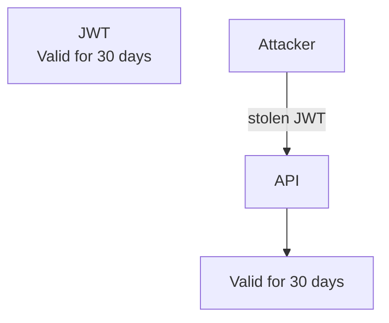

Password change does not help unless you also rotate signing keys or keep a denylist the API consults on every request. Logout in the browser does not help: the token is still a valid bearer credential. [OWASP Session Management](https://cheatsheetseries.owasp.org/cheatsheets/Session_Management_Cheat_Sheet.html) is explicit that a session identifier is temporarily equivalent to the authentication method that created it. A 30-day bearer token is a 30-day password you cannot change.

Compare the same theft against a split lifetime:

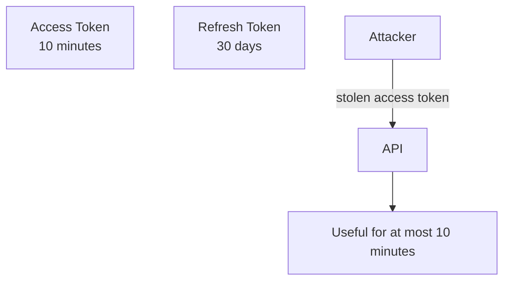

The refresh token is still a high-value secret. It must be stored more carefully, sent less often, and be revocable. The gain is not "the refresh token is harmless." The gain is that the credential on every `GET /invoices` is no longer a month-long key.

Those numbers are examples. A banking app, an internal admin tool, and a consumer SaaS do not share a threat model. Five minutes and seven days is a common starting pair. Fifteen minutes and thirty days is another. The correct pair depends on risk, device type, and whether you can revoke the long-lived half.

A JWT is a format. A session is a server-side decision that the user is still allowed to act. Confusing the two is how long-lived access tokens get into production.

## These words are not the same job

Teams collapse "logged in" into one blob and then argue about token TTL. The names look related. The jobs are not.

| Term             | Job                                                                                                |
| ---------------- | -------------------------------------------------------------------------------------------------- |
| Authentication   | Prove who the user is, once, with credentials or a stronger factor                                 |
| Session          | The server-side decision that this proof is still in force                                         |
| Access token     | A short-lived credential the API accepts on ordinary requests                                      |
| Refresh token    | A longer-lived credential used only to obtain a new access token                                   |
| Token expiration | A clock limit after which a token must not be accepted                                             |
| Token rotation   | Issue a new refresh token and invalidate the one that was just used                                |
| Token revocation | Mark a token, a family, or every session as unusable before expiration                             |
| Logout           | End the session. Local logout clears the client. Server-side logout revokes what the server issued |

**Authentication** happens at login — and again if you step up for a sensitive action. It is an event.

**Session** is the period after that event during which the system still trusts the user. In a classic cookie app the session is a row (or a signed cookie) the server can delete. In an access-plus-refresh design the session is usually the refresh-token record: hashed value, expiry, family, revocation flag, device.

**Access token** answers "may this request proceed right now?" It is presented often. It should be short.

**Refresh token** answers "may this client obtain a new access token without a password?" It is presented rarely. It should be better protected, and the server should be able to say no.

**Expiration** is a clock. It is not revocation. An expired token is invalid. A revoked token may still be unexpired.

**Rotation** is how a long-lived refresh token stops being a single static secret. Each use mints a successor and kills the predecessor.

**Revocation** is how you end a session on purpose: logout, password change, suspected theft, admin lockout.

**Logout** is not "delete `localStorage`." That is local cleanup. If the refresh token still verifies on the server, the session is still alive on another tab, another device, or an attacker's replay.

```text
Authentication
      │
      └── Proves identity

Session
      │
      └── Keeps that proof in force

Access token
      │
      └── Authorizes this request

Refresh token
      │
      └── Issues a new access token
          It does not extend the old one
```

## The flow the client must get right

A valid access token is boring. That is the happy path.

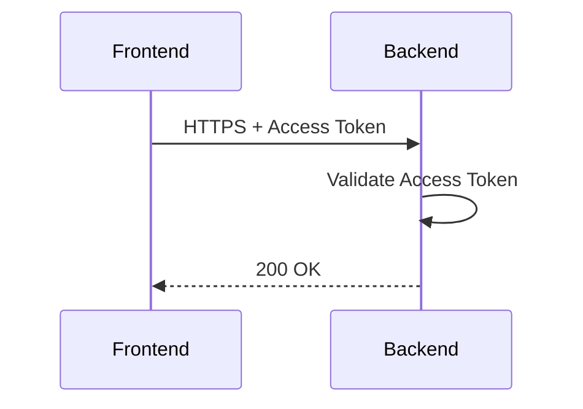

Expiration is not an error in the product sense. It is the design working.

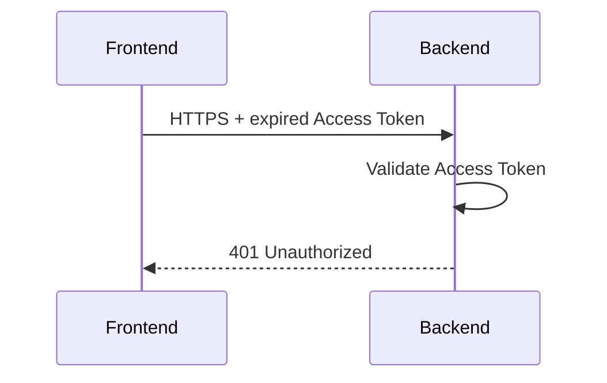

The frontend must treat that 401 as "try to renew," not as "the user is gone," until refresh itself fails.

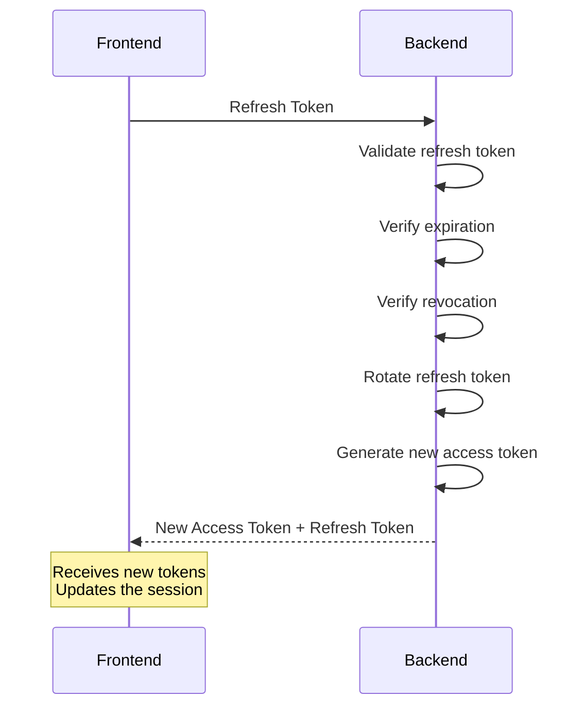

Then the original call is retried with the new access token. The component that started the request should see a 200, not a login page.

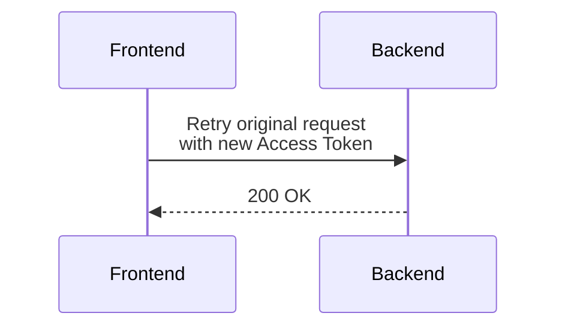

That sequence is the product: a short-lived access token and a session that still feels continuous.

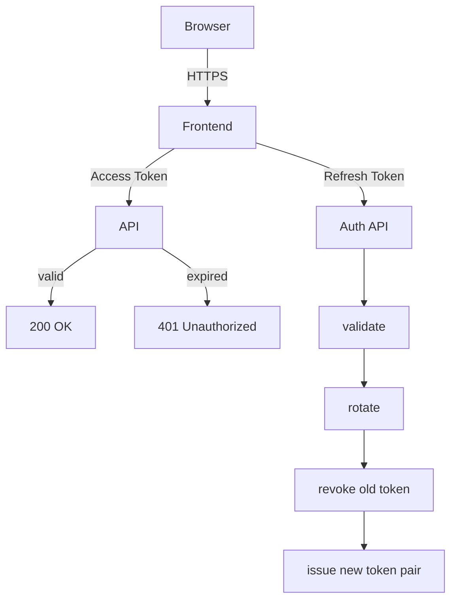

The same story as a sequence, including login:

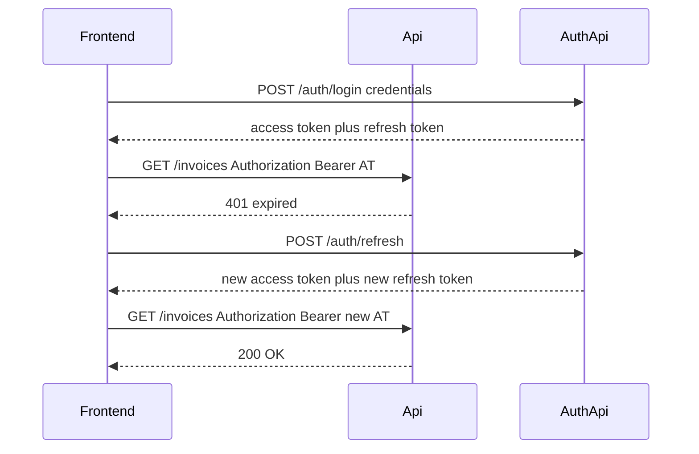

Someone who has never implemented refresh tokens should still be able to read those two diagrams and predict what the network tab will show at 09:05.

## How the frontend should behave

The UI must not own this. A page that catches 401, calls refresh, and retries will do it badly the third time three requests fail together. The HTTP client owns the pattern: Axios interceptor, `fetch` wrapper, generated client middleware. The library is not the architecture.

Expected behavior:

1. Send the request with the access token.
2. If the API returns 200, return that response to the caller.
3. If the API returns 401 because the access token expired:
   - intercept;
   - call `POST /auth/refresh` once;
   - store the new tokens in whatever mechanism you chose;
   - replay the original request;
   - return that response to the caller.
4. If refresh fails, clear the session and send the user to login.

A 401 is not always "access token expired." A revoked user, a malformed token, and a missing `Authorization` header can all produce 401. The refresh path should run when you have a refresh token and the request was authenticated. If refresh also returns 401, stop. Do not refresh in a loop.

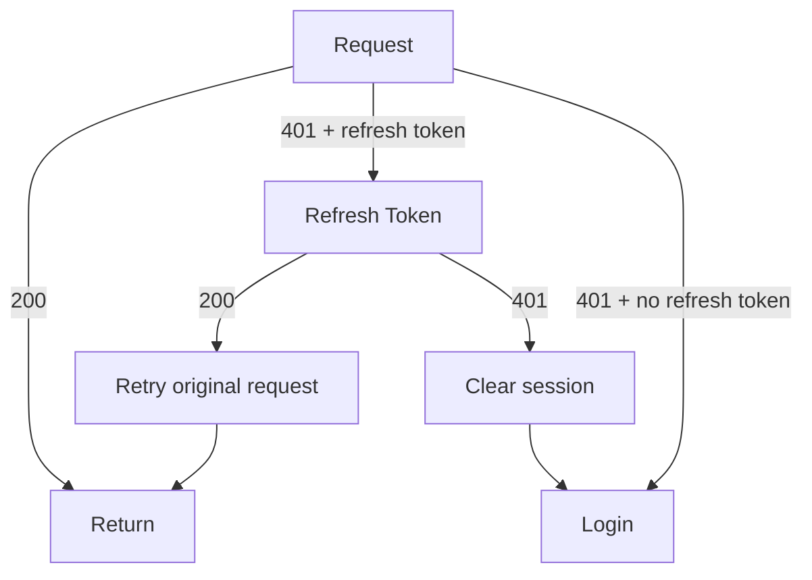

Pseudocode for the interceptor. This is the pattern, not an Axios tutorial.

```ts
let refreshInFlight: Promise<TokenPair> | null = null;

async function request(input: Request) {
  const response = await http(withAccessToken(input));
  if (response.status !== 401 || isRefreshCall(input)) {
    return response;
  }

  try {
    const tokens = await refreshSingleFlight();
    storeTokens(tokens);
    return http(withAccessToken(input));
  } catch {
    clearSession();
    redirectToLogin();
    throw new SessionExpiredError();
  }
}

function refreshSingleFlight() {
  if (!refreshInFlight) {
    refreshInFlight = refresh().finally(() => {
      refreshInFlight = null;
    });
  }
  return refreshInFlight;
}
```

`isRefreshCall` matters. If `/auth/refresh` returns 401 and the same interceptor treats it as "refresh again," you have an infinite loop. Exclude the refresh (and login) routes from the retry path.

### Single-flight refresh

A dashboard does not make one request. It makes three.

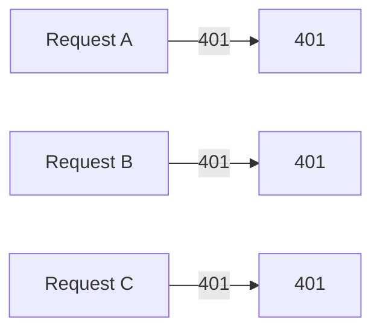

If each interceptor calls `/auth/refresh`, you issue three rotations of the same refresh token. With rotation enabled, the first succeeds and invalidates the token. The second presents a revoked token. Reuse detection may then kill the family, including the token the first call just issued. The user is signed out because the UI loaded three widgets.

**Single-flight refresh** means one refresh is in progress. A, B, and C wait on the same promise. When it resolves, all three retry with the new access token. When it rejects, all three go to login.

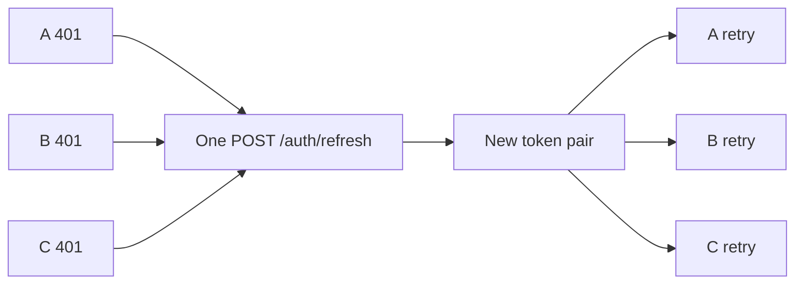

That is a client concurrency rule. The backend cannot save you from three parallel rotations of a single-use token.

## What the backend should do

### Login

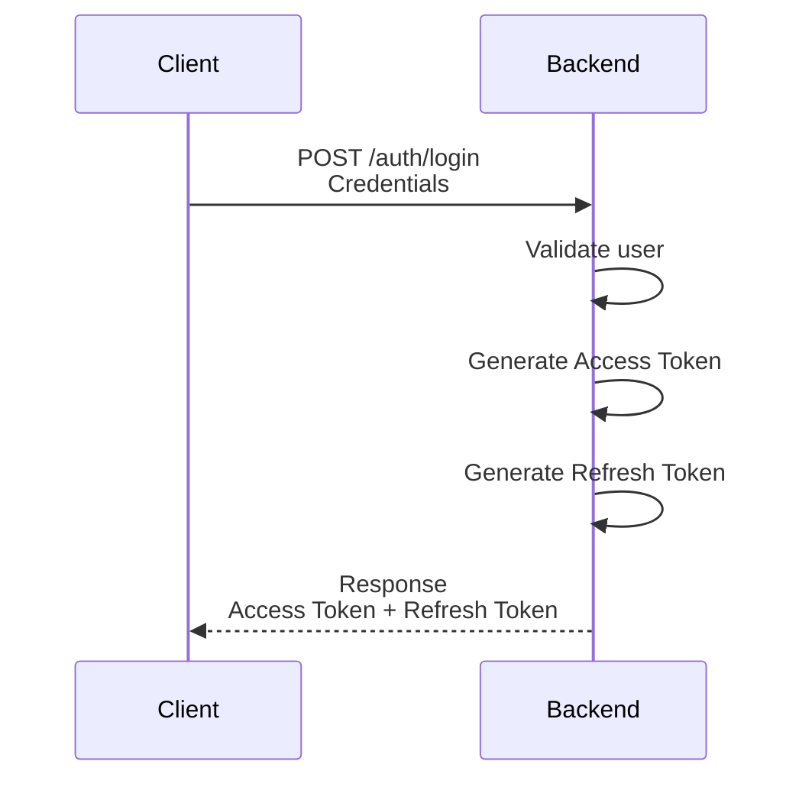

Validate the password (or the IdP assertion) first. Then issue two different credentials.

The **access token** is usually a JWT. Conceptually it carries:

- `sub` — who this is;
- `exp` — when this credential dies;
- `iat` / `nbf` — issued-at / not-before when you use them;
- `iss` / `aud` — who minted it and who should accept it;
- roles or scopes the API will authorize against.

Keep it small. Do not stuff the profile. Do not put secrets in claims. Anyone who can read the token can read the payload of a signed JWT.

The **refresh token** is a session handle. Two common shapes:

- an **opaque** random value, stored only as a hash, like a password;
- a **signed** token whose `jti` (or equivalent) points at a session row.

In both cases the server keeps a row it can revoke. The value the client holds must not be stored in plaintext on the server. Hash it. If the table leaks, the tokens should not be replayable.

Login creates that row: user, hash, expiry, family id, device metadata if you have it. The family id is how later reuse detection revokes "this login," not one string.

### An ordinary request

```text
Authorization: Bearer <access-token>
```

The API validates the access token, not the refresh token. Typical checks:

- signature, with the current key;
- expected algorithm — reject `none`, reject alg confusion;
- `iss` / `aud` when you set them;
- `exp` (and `nbf`);
- claims the route will authorize on;
- session or denylist state **if** your architecture requires it.

A signed JWT can be accepted offline. That is the operational benefit and the revocation cost. If the API never looks at a store, a revoked session still works until `exp`. Short access-token TTL is how you make that cost acceptable. If you need instant cut-off, you add introspection or a denylist and you have reintroduced server state on the hot path.

### Refresh

```text
POST /auth/refresh
```

This endpoint is not "login again." It is "prove you still hold the session secret."

The backend should:

1. receive the refresh token (body, cookie, or both — pick one model and stick to it);
2. locate its server-side representation (hash lookup, or `jti` → row);
3. validate integrity (randomness + hash, or signature);
4. check expiration;
5. check revocation;
6. check context or family when you use one (user still exists, client still allowed, device still recognized);
7. revoke or rotate the token that was just presented;
8. generate a new access token;
9. generate a new refresh token;
10. return the new pair.

If any check fails, return 401 and do not issue tokens. If reuse detection fires, revoke the family first, then return 401.

[RFC 6749 §6](https://www.rfc-editor.org/rfc/rfc6749#section-6) is the OAuth form of this exchange: the refresh token is a grant used at the token endpoint to obtain a new access token. A first-party `/auth/refresh` is the same idea with less protocol.

## Refresh token rotation

The naive model keeps one refresh token for the life of the session.

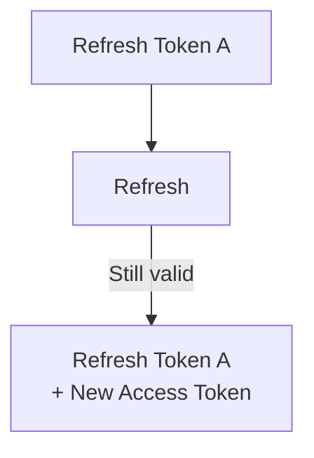

If A leaks, the attacker refreshes forever, or until A expires. You cannot tell the leak from the legitimate client. Both present a valid A.

Rotation makes A single-use.

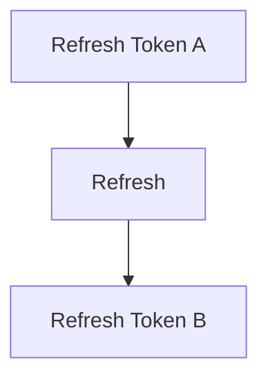

A must die when B is born.

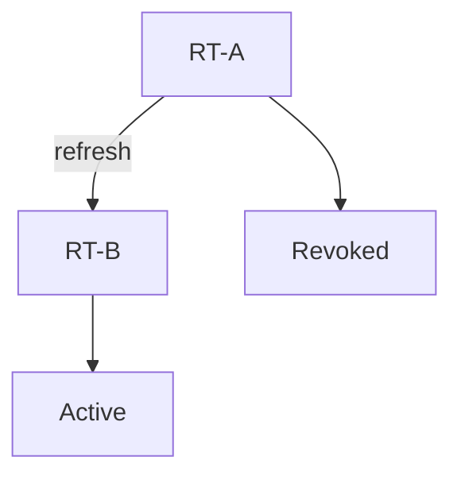

That is **refresh token rotation**: every successful refresh issues a new refresh token and invalidates the previous one. [RFC 9700 §4.14](https://www.rfc-editor.org/rfc/rfc9700.html#section-4.14) requires public clients to use rotation or sender-constrained tokens (DPoP, mTLS). A browser SPA is a public client. It cannot keep a client secret.

### Reuse detection

Suppose A was stolen. The legitimate client refreshes first and receives B. The attacker later presents A.

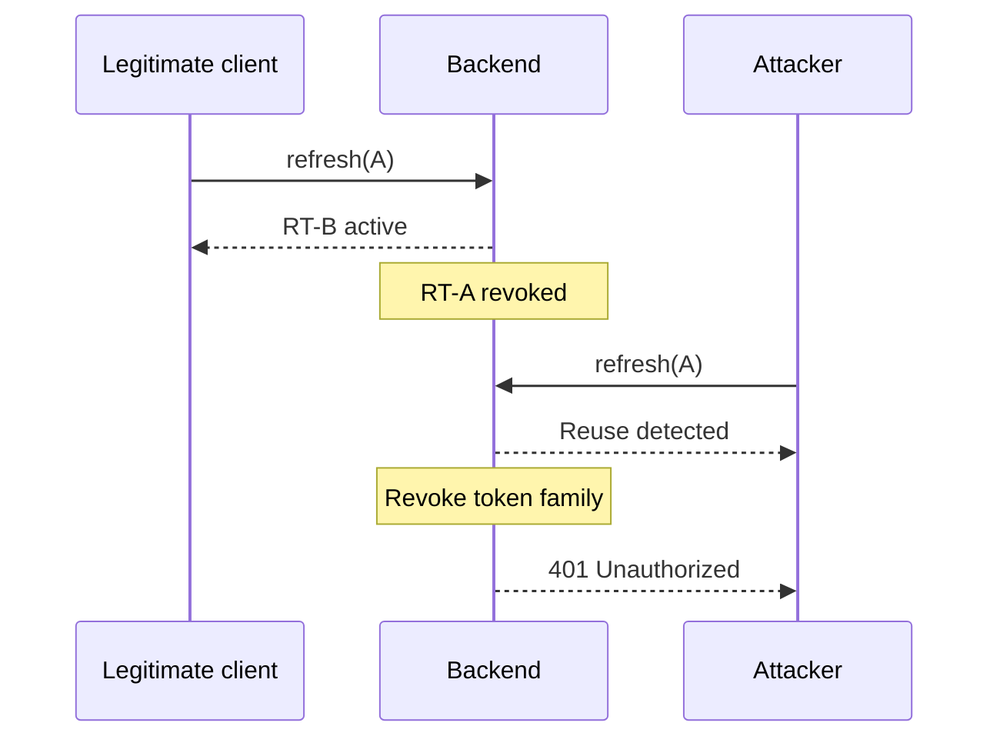

The server cannot know which party is the thief. RFC 9700 is explicit about that. The safe reaction is to revoke the **family**: A, B, and any successor. The legitimate user signs in again. The attacker stops minting access tokens.

That is **refresh token reuse detection**. It is not required for every internal tool. It is worth it when the refresh token lives in a public client, travels through a browser, or would otherwise be a long-lived reusable secret. Sender-constrained tokens (the token is useless without a private key the server bound it to) are the stronger alternative in the same section of RFC 9700. Most first-party SPAs start with rotation plus family revocation. Mention DPoP when the threat model says stolen tokens will be replayed from another machine.

Rotation without reuse detection still limits a stolen token to one use. Reuse detection is what turns the second use into a security event instead of a confusing 401.

## Where the tokens live

There is no universally correct store. There is a threat model.

| Store            | JavaScript can read it   | Survives refresh | Typical risk                              |
| ---------------- | ------------------------ | ---------------- | ----------------------------------------- |
| `localStorage`   | yes                      | yes              | XSS steals tokens for the origin          |
| `sessionStorage` | yes                      | tab lifetime     | same XSS surface, smaller lifetime        |
| memory           | yes, while the tab lives | no               | XSS can still read it; reload logs out    |
| HttpOnly cookie  | no                       | yes              | XSS cannot read it; CSRF becomes relevant |

[OWASP Session Management](https://cheatsheetseries.owasp.org/cheatsheets/Session_Management_Cheat_Sheet.html) tells you not to put authentication tokens, JWTs, or refresh tokens in `localStorage` or `sessionStorage`. Those APIs are visible to every script on the origin. One XSS bug discloses the session.

Memory is better against persistence and slightly better against casual XSS (the token is not sitting in a well-known key). A full XSS still runs in the page and can read whatever the interceptor holds, or just call your API as the user. Memory also loses the session on reload, so teams often put the refresh token back into a store they were trying to avoid.

HttpOnly cookies keep the refresh token out of `document.cookie` and out of XSS readers. [MDN's cookie guide](https://developer.mozilla.org/en-US/docs/Web/HTTP/Guides/Cookies) and [`Set-Cookie`](https://developer.mozilla.org/en-US/docs/Web/HTTP/Headers/Set-Cookie) are the flags that matter:

- **HttpOnly** — not exposed to JavaScript;
- **Secure** — sent only on HTTPS;
- **SameSite** — `Strict` or `Lax` reduce cross-site sends; `None` requires `Secure` and is the CSRF-sensitive choice for cross-site SPAs.

Cookies do not delete XSS. They change what XSS can steal. An injected script can still trigger requests the browser will authenticate. They also introduce **CSRF** if a foreign site can cause the browser to send the cookie. [OWASP CSRF Prevention](https://cheatsheetseries.owasp.org/cheatsheets/Cross-Site_Request_Forgery_Prevention_Cheat_Sheet.html) is the other half of a cookie design: SameSite, custom request headers the browser will not add cross-site, and anti-CSRF tokens when SameSite is not enough.

A common split for a first-party web app:

- access token in memory, sent as `Authorization: Bearer`;
- refresh token in an HttpOnly, Secure, SameSite cookie scoped to `/auth/refresh`.

The access token still appears in JS (you put it on the header). The longer-lived secret does not. Cross-origin SPAs then need CORS with credentials, cookie `Domain`/`Path` discipline, and a CSRF story. Same-origin apps have an easier cookie model.

A Backend-for-Frontend that keeps tokens on the server and gives the browser only a session cookie is another way to keep refresh tokens off the origin. It is an architecture choice, not a header flag.

Pick the store from the threat, the origin layout, and what you can actually revoke. Do not pick it from a tweet that says "never cookies" or "never localStorage" without the rest of the sentence.

## Logout is a server decision

Clearing tokens in the frontend stops **this** tab from calling the API. It does not stop a stolen refresh token, a second device, or a service worker that still holds the pair.

```text
Logout local
      │
      └── client forgets the tokens
          server still accepts the refresh token
```

```text
Logout server-side
      │
      └── server revokes the session
          client then forgets the tokens
```

The flow that matches the architecture:

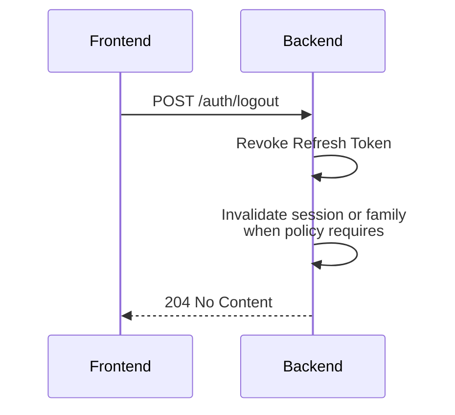

Then the client clears storage and memory. Order matters less than doing both. If the network call fails, still clear the client — and still try to revoke when you can, because a refresh token left alive is a session.

Three scopes people collapse into one button:

- **this device** — revoke the current refresh token / family;
- **all devices** — revoke every family for the user;
- **global** — password change, admin disable, credential leak: revoke every session and, if you can, invalidate access tokens that are still inside their TTL.

The access JWT will remain acceptable until `exp` unless you denylist it or introspect. That is expected. It is why ten minutes is easier to defend than thirty days. RFC 9700 allows authorization servers to revoke refresh tokens on logout or password change. Do the same in a first-party session table.

## Access token versus refresh token

This is the general model, not a law.

| Characteristic | Access token              | Refresh token             |
| -------------- | ------------------------- | ------------------------- |
| Purpose        | authorize requests        | obtain new tokens         |
| Lifetime       | short                     | long                      |
| Use            | frequent                  | occasional                |
| Exposure       | higher                    | must be better protected  |
| Revocation     | usually hard or expensive | must be possible          |
| Rotation       | usually no                | recommended               |
| Storage        | depends on architecture   | needs stronger protection |

An access token can be a JWT or an opaque handle. A refresh token can be rotated or sender-constrained. Some APIs introspect every access token and can revoke them immediately. The table describes the common first-party split: short, frequently presented, hard-to-revoke access tokens plus long, rarely presented, server-tracked refresh tokens.

## Refresh tokens do not make the design safe

They change the lifetime of the credential on the hot path. Everything else is still your job:

- storage that matches XSS and CSRF;
- HTTPS on every hop that sees a token;
- rotation of refresh tokens for public clients;
- revocation you can actually execute;
- reuse detection when rotation is the control;
- expiration on **both** tokens — a refresh token with no `exp` is a permanent session;
- a session record, not only a signed blob;
- secrets and signing keys that rotate;
- JWT validation that checks alg, signature, `exp`, and `iss`/`aud` when you use them.

Skip the store and you have a long-lived JWT with extra steps. Skip HTTPS and the pair is wire-visible. Skip rotation and a stolen refresh token is a durable key. Skip CSRF on cookies and a foreign page can refresh for the user. The pair is a pattern. It is not a control.

## 09:00, and the user never sees it

A realistic day in a SaaS app with a ten-minute access token:

```text
09:00 → login
09:00 → access token issued, refresh token issued
09:04 → GET /invoices → 200
09:05 → access token expires
09:05 → user clicks "Export"
09:05 → API responds 401
09:05 → frontend runs POST /auth/refresh
09:05 → backend rotates the refresh token, issues a new pair
09:05 → frontend retries Export
09:05 → API responds 200
```

The user clicked a button. The network tab shows an extra `401` and a `POST /auth/refresh` if they look. The product does not ask for a password. That is the reason the pattern exists: **the session can continue while the access credentials stay short-lived.**

If refresh had failed — revoked family, expired refresh token, reused token — the same interceptor would have cleared the session and shown login. The user would understand that. They should not have to understand the 401 in the middle.

## A NestJS sketch, after the architecture

NestJS can implement this. It does not invent it. [Authentication](https://docs.nestjs.com/security/authentication) and the [Passport JWT recipe](https://docs.nestjs.com/recipes/passport) cover signing an access token and guarding routes. They do not implement refresh rotation for you. The session table is your design.

Prisma here is one way to persist sessions. A SQL table, Redis, or another store with the same columns is the same architecture.

```prisma
model Session {
  id             String    @id @default(cuid())
  userId         String
  tokenHash      String    @unique
  familyId       String
  replacedByHash String?
  revokedAt      DateTime?
  expiresAt      DateTime
  createdAt      DateTime  @default(now())
}
```

Store `sha256(refreshToken)`, not the token. `familyId` is the login that later reuse detection kills as a group.

Issue the access token with `@nestjs/jwt`. Short `expiresIn`. Claims the API will actually check.

```ts
const accessToken = await this.jwt.signAsync(
  { sub: user.id, role: user.role },
  { expiresIn: "10m", issuer: "auth.example.com", audience: "api.example.com" },
);
```

The JWT strategy is the ordinary-request path. Signature, algorithm, and expiration are Passport's job if you configure them. `validate` is where you map claims onto `request.user`. It is not where you accept an expired token.

```ts
@Injectable()
export class JwtStrategy extends PassportStrategy(Strategy) {
  constructor() {
    super({
      jwtFromRequest: ExtractJwt.fromAuthHeaderAsBearerToken(),
      ignoreExpiration: false,
      secretOrKey: process.env.JWT_ACCESS_SECRET,
      issuer: "auth.example.com",
      audience: "api.example.com",
      algorithms: ["HS256"],
    });
  }

  validate(payload: { sub: string; role: string }) {
    return { userId: payload.sub, role: payload.role };
  }
}
```

Refresh is a dedicated route. Hash the incoming token, load the row, then decide.

```ts
@Post('refresh')
async refresh(@Body('refreshToken') token: string) {
  const session = await this.sessions.findByHash(sha256(token));

  if (!session || session.revokedAt || session.expiresAt < new Date()) {
    throw new UnauthorizedException();
  }

  if (session.replacedByHash) {
    await this.sessions.revokeFamily(session.familyId);
    throw new UnauthorizedException();
  }

  const next = await this.sessions.rotate(session);
  return this.issuePair(session.userId, next);
}
```

`replacedByHash` (or a `usedAt` plus retained hash) is the reuse signal. The first refresh marks the old row used and inserts the successor. A second present of the old value revokes the family.

Logout is the same table:

```ts
@Post('logout')
async logout(@Body('refreshToken') token: string) {
  await this.sessions.revokeByHash(sha256(token));
}
```

A "logout all devices" variant revokes every row for `userId`. The access token already in flight dies at `exp` unless you add a denylist.

The frontend interceptor stays the pseudocode above. Wire `storeTokens` to memory, cookies, or a BFF. Exclude `/auth/refresh` from the 401 retry. Single-flight the refresh promise.

That is enough NestJS to see the mapping. The architecture is the session row, the two lifetimes, and the client retry. The framework is how you attach a guard.

## Recommended authentication architecture

A reasonable shape for a modern web app with a separate frontend and API:

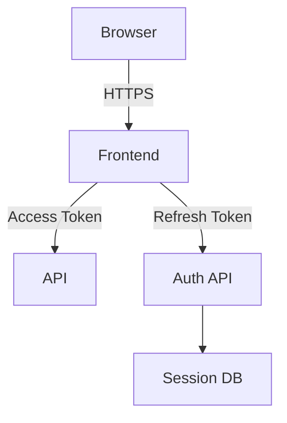

**Browser** — the TLS endpoint the user trusts. No tokens in URLs, no tokens in fragments you log.

**Frontend** — owns the HTTP client, the single-flight refresh, the retry, and the redirect to login. It does not invent security by hiding a token in a Vuex module.

**Access token** — presented to the API on business routes. Short TTL. Validated locally (JWT) or by introspection.

**API** — authenticates the access token, then authorizes the resource. It should not accept a refresh token as a bearer credential on `/invoices`.

**Auth API** — login, refresh, logout, password change. The only writer of session rows. In a modular monolith this is a module, not a second deployable. The box is a responsibility.

**Session DB** — hashed refresh tokens, families, expiry, revocation, device. This is what makes logout and reuse detection real. Prisma, SQL, or Redis can hold it. The schema matters more than the product.

Auth API and API may be one NestJS process. Split them when issuance and resource access need different scale, teams, or trust boundaries. Do not split them because the diagram has two boxes.

## Common mistakes

- **Access tokens that last hours or days.** You recreated the 30-day JWT with a second name.
- **Refresh tokens that never expire.** A stolen token is a permanent session. RFC 9700 says refresh tokens should also die after inactivity.
- **Storing refresh tokens in plaintext.** A database dump becomes a session dump. Hash them.
- **No rotation.** The refresh token is a static long-lived secret.
- **No revocation.** Logout is theater. Password change does not end other devices.
- **Refreshing forever on 401 from `/auth/refresh`.** The interceptor must exclude that route or you loop until the tab dies.
- **Three parallel refreshes.** Without single-flight, rotation plus reuse detection signs the user out during a normal page load.
- **Cookies without flags.** Missing `HttpOnly`, `Secure`, or `SameSite` undoes the reason you chose cookies.
- **"It is a JWT, so it is secure."** JWT is a signed JSON object. The rest is validation, storage, and lifetime.
- **Tokens in `localStorage` with no XSS story.** OWASP's session guidance is not subtle here.
- **Cookies with no CSRF story.** SameSite is not optional commentary. Cross-site SPAs need more than SameSite.
- **No session or device record.** You cannot list sessions, revoke one laptop, or detect reuse without a family.
- **Ignoring reuse.** Rotation without remembering the predecessor cannot tell theft from a retry.

## When this pattern fits — and when it does not

Access token plus refresh token is a good default when:

- the UI is a SPA on another origin;
- a mobile app must stay signed in without embedding a password;
- a SaaS API is called by a first-party client for hours at a time;
- frontend and backend are separate deployables;
- you want short-lived bearer credentials on the API and a revocable session behind them.

It is not the required upgrade from a cookie.

A **classic server-side session** — one HttpOnly session id, server store, no JWT on every request — is often simpler when the browser and the app share an origin, you do not need a bearer token for mobile or third parties, and you already look up the session on each request. You already have revocation. You already have logout. You do not need rotation theater to compensate for a stateless access token you never needed.

OAuth in full — authorization code, PKCE, a real Authorization Server, maybe DPoP — is the right tool when third-party clients, an IdP, or delegated access are the problem. Issuing your own JWT pair in NestJS is not that system. It is a first-party session that borrowed two token types.

Do not adopt access-plus-refresh because a tutorial titled the file `jwt-refresh.strategy.ts`. Adopt it because you need a short-lived request credential and a longer-lived, revocable proof that the user should get another one.

## Key takeaways

- A refresh token does not extend an access token. It obtains a new one after the old one expires, so the session can continue without a password prompt.
- A long-lived JWT is a long-lived incident. Split the lifetimes: short access tokens on the hot path, a longer refresh token you can revoke.
- The important client behavior is intercept → single-flight refresh → retry. Three parallel refreshes will fight rotation and look like theft.
- Rotation plus reuse detection turns a replayed refresh token into a family-wide revocation. That is a security signal, not a retry.
- Clearing the frontend is not logout. Logout revokes the server-side session. The access JWT may still work until `exp`.
- Storage is a threat-model choice. HttpOnly cookies reduce JavaScript exposure of the refresh token and make CSRF your problem. `localStorage` does the opposite.
- JWT plus refresh tokens is a session pattern, not a guarantee. HTTPS, validation, expiration, rotation, revocation, and XSS/CSRF controls are what make the pattern hold.

## Sources

- IETF, [RFC 7519 — JSON Web Token](https://www.rfc-editor.org/rfc/rfc7519)
- IETF, [RFC 6749 — The OAuth 2.0 Authorization Framework](https://www.rfc-editor.org/rfc/rfc6749) — §1.5 refresh tokens, §6 refreshing an access token
- IETF, [RFC 9700 — OAuth 2.0 Security Best Current Practice](https://www.rfc-editor.org/rfc/rfc9700.html) — §2.2.2 refresh tokens, §4.14 rotation and reuse detection
- OWASP, [Authentication Cheat Sheet](https://cheatsheetseries.owasp.org/cheatsheets/Authentication_Cheat_Sheet.html)
- OWASP, [Session Management Cheat Sheet](https://cheatsheetseries.owasp.org/cheatsheets/Session_Management_Cheat_Sheet.html)
- OWASP, [Cross-Site Request Forgery Prevention Cheat Sheet](https://cheatsheetseries.owasp.org/cheatsheets/Cross-Site_Request_Forgery_Prevention_Cheat_Sheet.html)
- OWASP, [OAuth 2.0 Cheat Sheet](https://cheatsheetseries.owasp.org/cheatsheets/OAuth2_Cheat_Sheet.html)
- NestJS, [Authentication](https://docs.nestjs.com/security/authentication)
- NestJS, [Passport / JWT](https://docs.nestjs.com/recipes/passport)
- MDN, [Using HTTP cookies](https://developer.mozilla.org/en-US/docs/Web/HTTP/Guides/Cookies)
- MDN, [Set-Cookie](https://developer.mozilla.org/en-US/docs/Web/HTTP/Headers/Set-Cookie)
