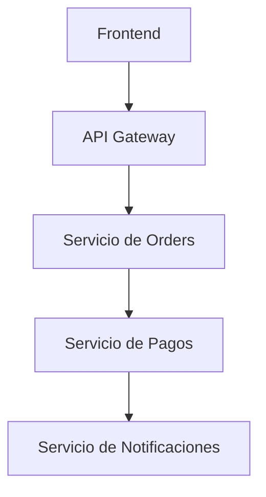
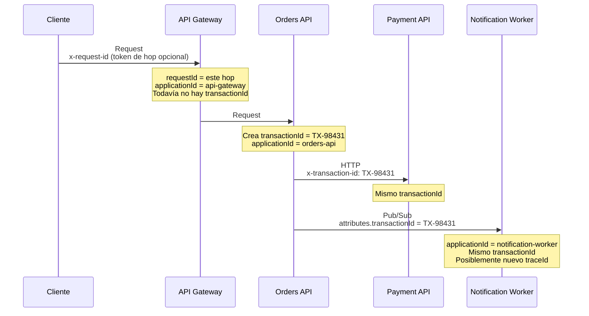
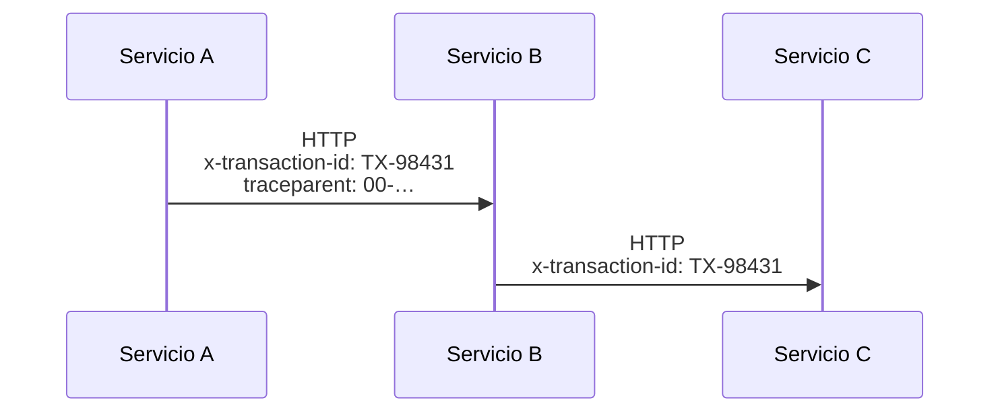
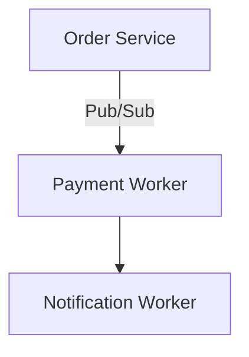
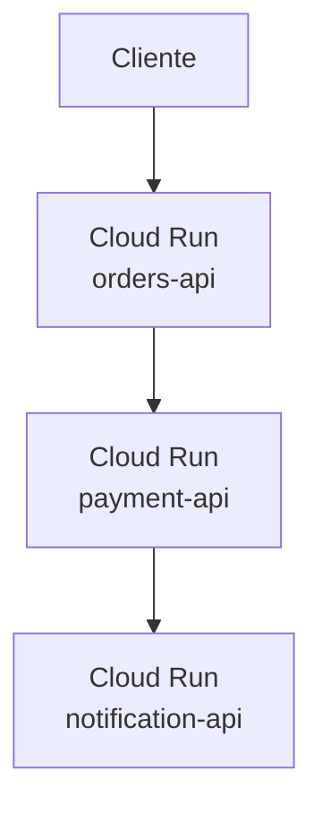
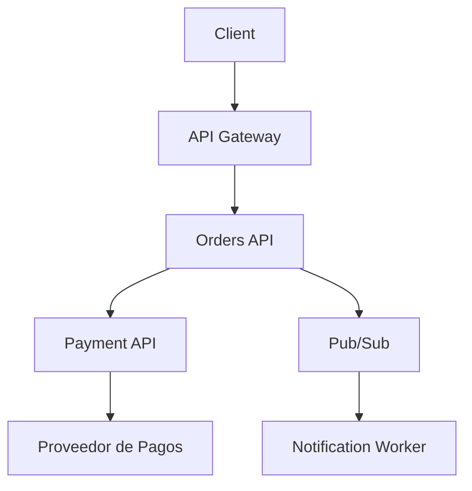

El cobro falló. Soporte tiene un email, un timestamp y un screenshot. Orders escribió `order.created`. Payments escribió `card_declined`. Notifications no escribió nada. Tres servicios en Cloud Run, tres buckets de logs, relojes que difieren dos segundos. Nadie puede demostrar que esas líneas pertenecen a la misma compra.

Eso no es falta de `console.log`. Es una identidad de **negocio** que falta.

[Un traceId no es un transactionId](/blog/trace-id-is-not-transaction-id/) es el artículo compañero de este. Define los identificadores: `transactionId` es el pago, `traceId` es una pasada por el sistema, `spanId` es un paso. Este artículo es la mitad NestJS — cómo esos campos llegan a cada línea de log, a través de HTTP y Pub/Sub, sin pasarlos a mano.

El trabajo no es estampar un UUID en un string y llamarlo correlación. El trabajo es poner `TX-98431` en cada evento que pertenece a ese cobro, incluyendo el worker que corre una hora después bajo un nuevo trace.

> Una petición distribuida necesita una identidad de negocio que la siga a través de gateways, APIs, workers y sistemas que no te pertenecen. El logging estructurado es cómo `transactionId` se vuelve buscable. W3C `traceparent` es cómo la ejecución sigue siendo un árbol. No son el mismo campo.

## Logs sin una clave para correlacionar son folklore

Un monolito falla en un proceso. Abres un archivo. Un checkout en 2026 falla a través de procesos a los que no puedes hacer attach al mismo tiempo.



Cada caja escribe a su propio stdout. Cloud Run recoge esos streams independientemente. Si el único hecho compartido es "alrededor de las 03:04 UTC", estás alineando relojes y esperando que la siguiente petición no haya caído en el mismo segundo.

Las líneas no estructuradas lo empeoran:

```ts
console.log("Payment failed for order 123");
```

Esa frase no se puede filtrar por servicio, unir a un worker, ni contar por proveedor. El order id es inglés. El siguiente ingeniero escribirá `order #123` o `OrderID=123`. Grep se convierte en arqueología.

Los timestamps son una clave de unión débil:

- las instancias no están perfectamente sincronizadas.
- los reintentos caen minutos después.
- un worker puede correr una hora después de la respuesta HTTP.
- dos checkouts en el mismo segundo producen líneas indistinguibles.

Necesitas un campo que sea igual en cada hop de **este pago**. Entonces el incidente es una consulta, no una reconstrucción. Ese campo es `transactionId`. Un `requestId` local a un hop o un `correlationId` casero no sobrevivirán al reintento del worker que describe el artículo compañero.

## El logging estructurado es un contrato, no un formato de archivo

Logging estructurado significa que cada línea es un **evento** con una forma estable: un nivel, un mensaje y campos que vas a consultar. JSON es la codificación usual. JSON no es la estrategia.

Esto es un string que resulta mencionar un order:

```ts
console.log("Payment failed for order 123");
```

Esto es un evento:

```json
{
  "level": "error",
  "event": "payment.failed",
  "transactionId": "TX-98431",
  "applicationId": "payment-service",
  "timestamp": "2026-08-15T08:04:12.331Z"
}
```

La segunda línea es **legible por máquina**. Cloud Logging la almacena como `jsonPayload`. Filtras `jsonPayload.transactionId="TX-98431"` y `jsonPayload.event="payment.failed"`. Agregas fallos por `paymentProvider` sin una expresión regular. Soporte puede preguntar por `TX-98431` la semana que viene, después de que el `traceId` original haya expirado.

Un evento útil tiene cuatro tipos de datos:

| Pieza       | Rol                                  | Ejemplo                          |
| ----------- | ------------------------------------ | -------------------------------- |
| **Level**   | Qué tan urgente es esta línea        | `error`                          |
| **Event**   | Qué pasó, como nombre estable        | `payment.failed`                 |
| **Context** | Qué operación, qué servicio          | `transactionId`, `applicationId` |
| **Message** | Frase humana para la línea de tiempo | `Payment processing failed`      |

Mantén los nombres de eventos aburridos y consistentes: `order.created`, `payment.started`, `payment.failed`. Trátalos como paths de API. Si cada servicio inventa su propio vocabulario, vuelves al folklore con llaves extra.

Volcar un objeto como JSON no es logging estructurado. `logger.info({ req }, "request")` es una fuga estructurada. Diseñar los campos es el trabajo.

## Estos identificadores no son intercambiables

El [artículo compañero](/blog/trace-id-is-not-transaction-id/) define los trabajos. Esta página solo necesita lo suficiente para que NestJS no los colapse:

- **`transactionId`** — el pago. Sobrevive reintentos y un worker que abre un segundo `traceId`. Esta es la clave de unión que implementas abajo.
- **`applicationId`** — qué servicio escribió la línea. Se escribe localmente. No es identidad de petición.
- **`requestId`** — un hop entrante. Útil en un access log. Muerto en el momento en que el siguiente servicio genera un UUID nuevo.
- **`correlationId`** — un header casero. Vale antes de que exista `TX-98431`. No es un `transactionId`. No sustituye a `traceparent`.
- **`traceId` / `spanId`** — una ejecución y un paso. Llévalos en paralelo vía W3C Trace Context. No reemplaces `transactionId` con ellos.

## Un contexto que realmente puedes ejecutar

Para un estate NestJS en Cloud Run, este es el conjunto que paga renta:



Reglas que mantienen el conjunto pequeño:

1. **El dominio es dueño de `transactionId`.** Orders (o Payments) genera `TX-98431` cuando existe el registro de negocio. Acepta un `x-transaction-id` entrante solo si coincide con una allowlist estricta — misma disciplina que un UUID, diferente charset (`TX-` más dígitos, o tu formato casero). Devuélvelo en la respuesta para que soporte pueda abrir un ticket con un id real.
2. **El borde es dueño de `requestId`.** Acepta `x-request-id` / `x-correlation-id` cuando es un UUID. Si no, genera `crypto.randomUUID()`. Esto cubre hops que pasan _antes_ de que exista `TX-98431`. No es la clave de unión del incidente.
3. **Cada servicio escribe `applicationId` localmente.** No confíes en que el llamador te diga quién eres.
4. **`traceId` / `spanId` aparecen cuando hay un tracer activado.** Propaga [W3C `traceparent`](https://www.w3.org/TR/trace-context-1/) en paralelo. No reemplaces `transactionId` con él. No reemplaces `traceparent` con `x-transaction-id`.

Una línea de log de Payment debería verse así — campos, no un párrafo:

```json
{
  "severity": "ERROR",
  "message": "Payment processing failed",
  "event": "payment.failed",
  "transactionId": "TX-98431",
  "applicationId": "payment-api",
  "paymentProvider": "stripe",
  "errorCode": "card_declined"
}
```

Mismo `transactionId` en Orders, Payment y el worker. Distinto `applicationId` en cada línea. Un reintento posterior puede llevar un `traceId` diferente. Sigues encontrando el pago.

## Un checkout que falla en Payment

El usuario hace clic en Pagar. El navegador llama al gateway. El gateway llama a Orders. Orders crea el pedido, luego llama a Payment. Payment llama al proveedor. La tarjeta es rechazada. Orders registra el fallo y publica `order.payment_failed`. El notification worker debería avisar al usuario.

```text
Orders Service
transactionId=TX-98431
event=order.created

Payment Service
transactionId=TX-98431
event=payment.started

Payment Service
transactionId=TX-98431
event=payment.failed
errorCode=card_declined

Orders Service
transactionId=TX-98431
event=order.payment_failed

Notification Worker
transactionId=TX-98431
traceId=def789
event=notification.payment_failed.sent
```

Cinco líneas, tres procesos, un campo de negocio. El worker puede haber abierto un segundo trace — el diagrama del artículo compañero. Sigues buscando `transactionId="TX-98431"` y leyendo la historia en orden.

Sin ese campo buscas `textPayload:"payment"` alrededor de las 03:04 y obtienes cada rechazo de la región. El siguiente checkout está en la misma ventana. Eliges el cobro equivocado. Pagas al dueño equivocado.

## Implementación: NestJS, Pino y un contexto que no pasas a mano

El stack es aburrido a propósito: NestJS, TypeScript, [Pino](https://github.com/pinojs/pino), [`nestjs-pino`](https://github.com/iamolegga/nestjs-pino), y [`AsyncLocalStorage`](https://nodejs.org/api/async_context.html) de Node.

`nestjs-pino` envuelve `pino-http`. Cada petición HTTP entrante obtiene un child logger. `Logger` y `PinoLogger` leen ese child a través de `AsyncLocalStorage`, así que un servicio tres capas abajo hereda `req.id` sin ver la petición. Por eso no deberías escribir esto en cada método:

```ts
this.logger.info({ transactionId }, "Payment started");
```

Si estás escribiendo `transactionId` en el call site después de que el order existe, el contexto no está vinculado.

Registra `LoggerModule.forRoot` **una vez**, en el módulo raíz. La librería es `@Global()`. Un segundo import registra `pino-http` de nuevo y duplica cada access log. El fallo es silencioso.

```ts
import { randomUUID } from "node:crypto";
import { Module } from "@nestjs/common";
import { LoggerModule } from "nestjs-pino";
import type { IncomingMessage, ServerResponse } from "node:http";
import { headerValue, isUuid, SERVICE_NAME } from "./request-context";

const REQUEST_ID_HEADER = "x-request-id";

function resolveRequestId(req: IncomingMessage): string {
  const incoming =
    headerValue(req.headers[REQUEST_ID_HEADER]) ?? headerValue(req.headers["x-correlation-id"]);
  return incoming && isUuid(incoming) ? incoming : randomUUID();
}

@Module({
  imports: [
    LoggerModule.forRoot({
      pinoHttp: {
        level: process.env.NODE_ENV === "production" ? "info" : "debug",
        genReqId: (req: IncomingMessage, res: ServerResponse) => {
          const requestId = resolveRequestId(req);
          res.setHeader(REQUEST_ID_HEADER, requestId);
          return requestId;
        },
        customProps: (req) => ({
          requestId: req.id,
          applicationId: SERVICE_NAME,
        }),
        redact: {
          paths: [
            "req.headers.authorization",
            "req.headers.cookie",
            'req.headers["x-api-key"]',
            "req.body.password",
            "req.body.accessToken",
            "req.body.refreshToken",
            "req.body.cvv",
            "req.body.cardNumber",
          ],
          censor: "[Redacted]",
        },
        autoLogging: {
          ignore: (req) => req.url === "/health" || req.url === "/ready",
        },
      },
    }),
  ],
})
export class AppModule {}
```

`genReqId` es el hook de [pino-http](https://github.com/pinojs/pino-http) al que apunta el FAQ de nestjs-pino para `X-Request-ID`. Úsalo para el id del **hop**. Devuélvelo en la respuesta. No es `TX-98431`. Los clientes que reintentan un create antes de que exista un order todavía necesitan _algún_ id; soporte que pregunta por un pago la semana que viene necesita la transacción.

Valida los identificadores entrantes. Un header de 4 KB que contiene espacios, comillas o un payload malicioso terminará en cada log downstream. Un UUID es una allowlist estricta para `requestId`. `transactionId` tiene su propio charset (`TX-` más dígitos, o lo que generes). No aceptes "lo que el llamador envió".

Conecta el logger en `main.ts` de la forma que documentan tanto Nest como nestjs-pino. `bufferLogs` mantiene las líneas tempranas del bootstrap hasta que Pino está listo:

```ts
import { NestFactory } from "@nestjs/core";
import { Logger } from "nestjs-pino";
import { AppModule } from "./app.module";
import { LoggerErrorInterceptor } from "nestjs-pino";

async function bootstrap() {
  const app = await NestFactory.create(AppModule, { bufferLogs: true });
  app.useLogger(app.get(Logger));
  app.useGlobalInterceptors(new LoggerErrorInterceptor());
  await app.listen(process.env.PORT ?? 3000);
}

bootstrap();
```

`LoggerErrorInterceptor` copia la excepción real a la respuesta para que la línea automática `request errored` contenga el error que lanzaste, no un `Error` genérico.

En servicios, usa el `Logger` de Nest. Después de `app.useLogger()`, esas llamadas van a Pino y heredan el child de la petición:

```ts
import { Injectable, Logger } from "@nestjs/common";

@Injectable()
export class PaymentsService {
  private readonly logger = new Logger(PaymentsService.name);

  async charge(transactionId: string, paymentProvider: string): Promise<void> {
    this.logger.log({ event: "payment.started", paymentProvider }, "Charging card");

    try {
      await this.provider.charge(transactionId);
    } catch (error) {
      const errorCode = this.providerErrorCode(error);
      this.logger.error(
        { event: "payment.failed", paymentProvider, errorCode },
        "Payment processing failed",
      );
      throw error;
    }
  }
}
```

No hay `transactionId` en la llamada. Una vez que Orders lo asignó, cada línea posterior en esta petición ya lo tiene.

Usa `PinoLogger.assign()` cuando aparezca el id de negocio — ese es el momento en que `TX-98431` empieza a existir. También asigna un `userId` después de auth si vas a consultarlo. No asignes un segundo UUID y lo llames transacción:

```ts
import { Controller, Post, Body, Res } from "@nestjs/common";
import type { Response } from "express";
import { PinoLogger } from "nestjs-pino";
import { setTransactionId } from "./request-context";

@Controller("orders")
export class OrdersController {
  constructor(
    private readonly logger: PinoLogger,
    private readonly orders: OrdersService,
  ) {
    this.logger.setContext(OrdersController.name);
  }

  @Post()
  async create(@Body() body: CreateOrderDto, @Res({ passthrough: true }) res: Response) {
    const order = await this.orders.create(body);
    this.logger.assign({ transactionId: order.transactionId });
    setTransactionId(order.transactionId);
    res.setHeader("x-transaction-id", order.transactionId);
    return order;
  }
}
```

`assign` tiene alcance de petición. No es un logger mutable global. Ese es el punto.

Si Payment se llama en una petición posterior, lee `x-transaction-id` en middleware y haz `assign` inmediatamente — no generes un nuevo `TX-`. El id de negocio es carga. Lo reenvías; no lo reinventas.

### AsyncLocalStorage para hops que no son HTTP

El store de `nestjs-pino` muere en el borde de la petición HTTP. Los clientes salientes y los publishers de Pub/Sub todavía necesitan **leer** `transactionId`. Los workers que nunca pasaron por `pino-http` necesitan **restaurarlo**.

Un store delgado es suficiente. Nest documenta el mismo patrón en la receta de [Async local storage](https://docs.nestjs.com/recipes/async-local-storage).

```ts
import { AsyncLocalStorage } from "node:async_hooks";

export const SERVICE_NAME = process.env.APPLICATION_ID ?? "orders-api";

export type RequestContext = {
  requestId: string;
  applicationId: string;
  transactionId?: string;
};

export const requestAls = new AsyncLocalStorage<RequestContext>();

export function getTransactionId(): string | undefined {
  return requestAls.getStore()?.transactionId;
}

export function setTransactionId(transactionId: string) {
  const store = requestAls.getStore();
  if (store) store.transactionId = transactionId;
}

export function headerValue(value: string | string[] | undefined): string | undefined {
  if (Array.isArray(value)) return value[0];
  return value;
}

export function isUuid(value: string): boolean {
  return /^[0-9a-f]{8}-[0-9a-f]{4}-[1-8][0-9a-f]{3}-[89ab][0-9a-f]{3}-[0-9a-f]{12}$/i.test(value);
}

export function isTransactionId(value: string): boolean {
  return /^TX-[A-Z0-9]{4,32}$/.test(value);
}
```

Entra al store después de que `pino-http` haya establecido `req.id`. Si el llamador ya tiene `TX-98431`, vincúlalo aquí para que Payment nunca espere a que Orders lo asigne de nuevo:

```ts
import { Injectable, NestMiddleware } from "@nestjs/common";
import type { NextFunction, Request, Response } from "express";
import { headerValue, isTransactionId, requestAls, SERVICE_NAME } from "./request-context";

@Injectable()
export class RequestContextMiddleware implements NestMiddleware {
  use(req: Request, res: Response, next: NextFunction) {
    const incoming = headerValue(req.headers["x-transaction-id"]);
    const transactionId = incoming && isTransactionId(incoming) ? incoming : undefined;
    if (transactionId) {
      res.setHeader("x-transaction-id", transactionId);
    }

    requestAls.run({ requestId: String(req.id), applicationId: SERVICE_NAME, transactionId }, () =>
      next(),
    );
  }
}
```

Dos stores, dos trabajos. `nestjs-pino` vincula logs. El tuyo vincula I/O saliente. No inventes un tercero. Si `transactionId` estaba en el header entrante, también haz `assign` al child logger en este middleware (o un pequeño interceptor) para que cada línea del hop lleve `TX-98431`.

## Propaga en cada llamada HTTP

El id es inútil si el Servicio B nunca lo ve.



El cliente HTTP de Nest es [`HttpService` de `@nestjs/axios`](https://docs.nestjs.com/techniques/http-module). Configura Axios una vez a través de `axiosRef`. No añadas el header en cada método del servicio.

```ts
import { Injectable, OnModuleInit } from "@nestjs/common";
import { HttpService } from "@nestjs/axios";
import { getTransactionId } from "./request-context";

@Injectable()
export class OutboundTransactionInterceptor implements OnModuleInit {
  constructor(private readonly http: HttpService) {}

  onModuleInit() {
    this.http.axiosRef.interceptors.request.use((config) => {
      const transactionId = getTransactionId();
      if (transactionId) {
        config.headers.set("x-transaction-id", transactionId);
      }
      return config;
    });
  }
}
```

Registra ese provider en el mismo módulo que importa `HttpModule`. Cada `this.http.post(...)` ahora reenvía el pago. El middleware del Servicio B acepta `TX-98431` y lo asigna.

Si también corres OpenTelemetry, reenvía `traceparent` / `tracestate` con el propagador oficial. Ese es un header distinto y un trabajo distinto. `x-transaction-id` es carga. `traceparent` es el pasaporte de ejecución. El artículo compañero es explícito: no reemplaces uno con el otro. Envía ambos.

Qué rompe la cadena:

- un `fetch` o `undici` raw que salta `HttpService`.
- un cron que empieza trabajo sin `transactionId` entrante y nunca lo carga del payload del job.
- un SDK de terceros que abre su propio HTTP agent.

Envuélvelos de la misma forma: lee `getTransactionId()`, pon el header, o niégate a llamar sin un store una vez que el registro de negocio existe.

## Propaga a través de Pub/Sub y jobs

Los headers HTTP mueren en la respuesta. El email de notificación lo envía un worker que no estaba en el socket.



Los [mensajes de Pub/Sub](https://cloud.google.com/pubsub/docs/publisher) tienen `data` y **attributes** opcionales: pares clave-valor de strings, máximo 100, claves ≤ 256 bytes, valores ≤ 1024 bytes. Google documenta los attributes para metadatos como timestamps y **transaction ids**. Ese es el transporte.

```ts
import { PubSub } from "@google-cloud/pubsub";
import { getTransactionId, SERVICE_NAME } from "./request-context";

const pubsub = new PubSub();

export async function publishOrderEvent(event: string, payload: Record<string, unknown>) {
  const transactionId = getTransactionId();
  if (!transactionId) {
    throw new Error("Refusing to publish without a transactionId");
  }

  await pubsub.topic("order-events").publishMessage({
    json: { event, ...payload },
    attributes: {
      transactionId,
      applicationId: SERVICE_NAME,
    },
  });
}
```

Prefiere attributes sobre meter un objeto `metadata` en `data`:

```json
{
  "data": { "event": "order.payment_failed" },
  "attributes": {
    "transactionId": "TX-98431",
    "applicationId": "orders-api"
  }
}
```

Los attributes son filtrables en la subscription. Sobreviven un cambio en el schema del payload. Se mantienen fuera del documento de negocio. Un bloque `metadata` anidado dentro de `data` funciona si cada consumidor recuerda buscarlo. El siguiente schema, el siguiente lenguaje y el siguiente intern no lo harán.

El worker debe restaurar el store **antes** de loguear o publicar de nuevo. Una push subscription es una petición HTTP: copia `attributes.transactionId` a `x-transaction-id` y deja que el middleware lo vincule. Un pull worker no tiene child de `pino-http`. Vincula los campos tú mismo:

```ts
import { Injectable, Logger } from "@nestjs/common";
import { PinoLogger } from "nestjs-pino";
import { isTransactionId, requestAls, SERVICE_NAME } from "./request-context";
import { randomUUID } from "node:crypto";

@Injectable()
export class NotificationWorker {
  private readonly logger = new Logger(NotificationWorker.name);

  constructor(private readonly pino: PinoLogger) {}

  async handle(message: { attributes: Record<string, string>; data: Buffer }) {
    const incoming = message.attributes.transactionId;
    if (!incoming || !isTransactionId(incoming)) {
      this.logger.error({ event: "notification.orphaned" }, "Message missing transactionId");
      return;
    }

    await requestAls.run(
      { requestId: randomUUID(), applicationId: SERVICE_NAME, transactionId: incoming },
      async () => {
        this.pino.assign({ transactionId: incoming, applicationId: SERVICE_NAME });
        this.logger.log({ event: "notification.started" }, "Sending payment-failed email");
      },
    );
  }
}
```

Si falta el attribute, no generes un nuevo `TX-`. Un nuevo transaction id silencioso es cómo un reintento se convierte en un segundo pago en los logs. Mueve a dead-letter, o loguea `notification.orphaned` y para.

El mismo paso de restauración aplica a Bull, Cloud Tasks y cron. El transporte cambia. La regla no: **quien empieza trabajo debe entrar al store con el id de negocio**. El middleware HTTP lo hace para peticiones. El consumidor lo hace para mensajes. El scheduler lo hace para jobs.

Tres mecanismos distintos, un propósito:

| Mecanismo               | Carrier                                 | Restaurado por                      |
| ----------------------- | --------------------------------------- | ----------------------------------- |
| Propagación HTTP        | `x-transaction-id`                      | middleware + `assign`               |
| Propagación de mensajes | Pub/Sub attributes (o metadata del job) | el consumidor, vía `requestAls.run` |
| Contexto de petición    | `AsyncLocalStorage` en proceso          | nada — no cruza un proceso          |
| Distributed tracing     | W3C `traceparent`                       | el propagador de OpenTelemetry      |

No esperes que ALS sobreviva un publish. No esperes que `traceparent` sobreviva un worker que nunca lo extrajo. Copia `transactionId` al mensaje. El nuevo `traceId` del worker es esperado. El artículo compañero ya dibujó ese grafo.

## Cloud Run: tres servicios, tres streams, una consulta

Pon Orders, Payment y Notifications en Cloud Run y la plataforma hará exactamente lo que promete: recoger stdout de cada servicio en Cloud Logging, etiquetado con el recurso de ese servicio. No notará que los tres streams son una compra.



Sin un campo compartido abres tres servicios en Logs Explorer y scrolleas. Con `transactionId` en cada línea JSON, una consulta reconstruye la compra — incluyendo el worker que corrió después:

```text
jsonPayload.transactionId="TX-98431"
```

[El logging de Cloud Run](https://cloud.google.com/run/docs/logging) parsea cada línea de stdout. Un objeto JSON se convierte en `jsonPayload`. Un string plano se convierte en `textPayload`. `textPayload` es lo que obtienes de `console.log("Payment failed")`. Lo buscarás con substrings hasta que lo dejes.

Cloud Logging también eleva **campos especiales** del JSON al `LogEntry`. Los que importan aquí:

| Campo JSON                             | Campo LogEntry | Para qué lo pones                                            |
| -------------------------------------- | -------------- | ------------------------------------------------------------ |
| `severity`                             | `severity`     | Filtrar por nivel sin parsear el `level` numérico de Pino    |
| `message`                              | texto display  | La frase en la línea de tiempo                               |
| `logging.googleapis.com/trace`         | `trace`        | Anidar esta línea bajo el log de petición y unir Cloud Trace |
| `logging.googleapis.com/spanId`        | `spanId`       | Qué span produjo la línea                                    |
| `logging.googleapis.com/trace_sampled` | `traceSampled` | Si se almacenó un span                                       |

Los defaults de Pino son `level: 30` y `msg`. Cloud Logging no los trata como especiales. Mapéalos una vez:

```ts
const SEVERITY: Record<string, string> = {
  trace: "DEBUG",
  debug: "DEBUG",
  info: "INFO",
  warn: "WARNING",
  error: "ERROR",
  fatal: "CRITICAL",
};

// dentro de pinoHttp:
{
  messageKey: "message",
  formatters: {
    level(label) {
      return { severity: SEVERITY[label] ?? label.toUpperCase() };
    },
  },
}
```

El sample propio de Cloud Run todavía lee `X-Cloud-Trace-Context` y escribe `logging.googleapis.com/trace` como `projects/PROJECT_ID/traces/TRACE_ID`. Prefiere `traceparent` cuando esté presente — Cloud Run lo pone en peticiones entrantes a servicios — y mantén el header legacy como fallback. Añade eso a `customProps`:

```ts
function cloudTrace(req: IncomingMessage, projectId: string): Record<string, string> {
  const traceparent = headerValue(req.headers.traceparent);
  const w3c = traceparent?.split("-");
  if (w3c?.[0] === "00" && w3c[1] && w3c[1] !== "0".repeat(32)) {
    return {
      "logging.googleapis.com/trace": `projects/${projectId}/traces/${w3c[1]}`,
      "logging.googleapis.com/spanId": w3c[2] ?? "",
    };
  }

  const legacy = headerValue(req.headers["x-cloud-trace-context"]);
  const traceId = legacy?.split("/")[0];
  if (traceId) {
    return {
      "logging.googleapis.com/trace": `projects/${projectId}/traces/${traceId}`,
    };
  }

  return {};
}
```

Los logs de contenedor se anidan bajo el log de petición en Logs Explorer solo cuando comparten ese campo `trace`. Escribir JSON no es suficiente. Escribir `transactionId` es suficiente para buscar entre servicios incluso cuando el trace no fue muestreado — el artículo compañero nota que `traceSampled: false` sigue siendo una unión válida a logs, no prueba de que la petición nunca existió. Usa ambos: `transactionId` para el pago, `trace` para la unión de plataforma.

La retención es una decisión de producto. Un `transactionId` que no puedes consultar después de 24 horas es un postmortem que no puedes terminar. Establece una retención que coincida con cuánto tiempo soporte sigue preguntando "¿qué pasó con este pago?"

## No loguees la petición

La redacción no es una cortesía. Los logs son un almacén durable con una audiencia más amplia que la base de datos de producción: guardia, contratistas, exportadores SIEM, el siguiente intern con acceso a Logs Explorer.

Nunca escribas:

- contraseñas y hashes de contraseñas.
- access tokens, refresh tokens, session tokens.
- cookies y `Set-Cookie`.
- `Authorization` y API keys.
- payloads completos de pago, PAN, CVV, expiración, números de cuenta bancaria.
- secretos, claves privadas, connection strings.
- datos personales que no necesitas para debuggear (`email` a menudo es suficiente; un documento de identidad nacional nunca lo es).

Esta línea es cómo esos valores escapan:

```ts
this.logger.log({ req }, "incoming request");
```

`pino-http` ya serializa un objeto de petición en el access log. Ese objeto incluye headers. Si también pasas `req` o `req.body` desde un handler, obtienes el body, el bearer token, y lo que sea que el cliente haya enviado como `cvv`. `redact` es una red de seguridad, no una licencia.

Pino redacta **paths que listes**, en tiempo de serialización, usando [`fast-redact`](https://github.com/pinojs/pino/blob/main/docs/redaction.md). Los paths son case-sensitive. Headers con guiones necesitan notación de corchetes. Existen wildcards (`req.headers["x-api-key"]`, `users[*].password`). El input de usuario nunca debe definir esos paths — la librería los evalúa en una VM.

```ts
redact: {
  paths: [
    "req.headers.authorization",
    "req.headers.cookie",
    'res.headers["set-cookie"]',
    "req.body.password",
    "req.body.accessToken",
    "req.body.refreshToken",
    "req.body.cvv",
    "req.body.cardNumber",
    "*.secret",
  ],
  censor: "[Redacted]",
}
```

Defensa en capas:

1. **No loguees el objeto.** Loguea `event`, `transactionId`, `errorCode`. Eso es una allowlist.
2. **Redacta paths conocidos de secretos** para que un access log o un futuro `logger.log({ req })` no los pueda filtrar.
3. **Clasifica campos** en el DTO: identificadores están bien, credenciales no, PII es una decisión.
4. **Deshabilita la serialización de body** en el access log si no la necesitas. Casi nunca la necesitas.

`censor: "[Redacted]"` todavía te dice que la clave existía. `remove: true` elimina la clave. Para tokens, cualquiera está bien. Para CVV, prefiere nunca tener el path en el logger para empezar.

## Los niveles son un presupuesto

Los niveles de Pino son `trace`, `debug`, `info`, `warn`, `error`, `fatal`. El `Logger` de Nest mapea `verbose` → `trace` y `log` → `info`. Producción no debería defaultear a `debug`.

| Nivel   | Cuándo                                                                         | Ejemplo                                                           | ¿Producción?                          |
| ------- | ------------------------------------------------------------------------------ | ----------------------------------------------------------------- | ------------------------------------- |
| `trace` | Ruido a nivel de instrucción                                                   | Entré a `mapProviderError`                                        | No                                    |
| `debug` | Diagnóstico local, feature flags, payloads raw del proveedor que ya redactaste | Response id del proveedor, intento de retry                       | Muestreado o apagado                  |
| `info`  | Un cambio de estado que querrás en la línea de tiempo del incidente            | `order.created`, `payment.started`                                | Sí, para eventos de negocio dispersos |
| `warn`  | Recuperable, pero alguien debería mirar                                        | Timeout del proveedor, luego retry; notificación opcional omitida | Sí                                    |
| `error` | Esta unidad de trabajo falló                                                   | `payment.failed`, excepción no manejada en handler                | Sí                                    |
| `fatal` | El proceso no debería continuar                                                | Falló al bootear, se perdió el pool de DB, sin memoria            | Sí, y raro                            |

Un buen sistema de logs te deja investigar un incidente sin producir millones de líneas irrelevantes.

`/health` en `info` en cada instancia, cada diez segundos, es cómo entierras `payment.failed`. GETs exitosos de un catálogo público en `info` son el mismo firehose. Mantén los completion logs HTTP automáticos, o baja 2xx a `debug` con `customLogLevel` y mantén 5xx en `error`.

```ts
customLogLevel: (_req, res, err) => {
  if (res.statusCode >= 500 || err) return "error";
  if (res.statusCode >= 400) return "warn";
  return "info";
},
```

Incluso ese `info` en cada 200 dominará un servicio de alto QPS. Ignora health. Muestrea o silencia el resto si el stream es el producto.

No loguees `error` para un 404 que el cliente causó, o `info` para una tarjeta rechazada que ya manejas. Un rechazo es un resultado de negocio: `warn` o `info` con `event=payment.failed` es suficiente a menos que la llamada al proveedor haya lanzado.

## Mal logging vs buen logging

```ts
console.log("Error processing payment");
console.log(order);
console.log(req);
```

Tres líneas, sin nombre de evento, sin clave de unión, un objeto order completo (cliente, hints de tarjeta, lo que sea que el ORM cargó), y la petición (Authorization, cookies, body). No puedes filtrarlas. No puedes probar que son el mismo checkout. Puede que acabes de escribir un PAN en un bucket con retención de 30 días.

```ts
this.logger.error(
  {
    event: "payment.failed",
    paymentProvider,
    errorCode,
  },
  "Payment processing failed",
);
```

Un evento. Campos que vas a consultar. Una frase para la línea de tiempo. `transactionId` y `applicationId` ya vinculados. Nada en `order` o `req` que no hayas elegido.

La segunda forma es más lenta de escribir la primera vez y más rápida cada vez que estás de guardia.

## transactionId no es un traceId

Esa es la misma división que el [artículo compañero](/blog/trace-id-is-not-transaction-id/). Un `transactionId` lista cada línea de log del pago, incluyendo un worker que corrió después bajo un nuevo `traceId`. No te da un grafo padre/hijo, latencia por hop, ni una decisión de sampling.

Todavía quieres `transactionId` cuando un hop no habla `traceparent`, cuando un worker inicia un nuevo trace, cuando soporte necesita un id de ticket, cuando el trace no fue muestreado, o cuando finanzas pregunta por el cobro la semana que viene. No presentes `x-transaction-id` como un OpenTelemetry más barato. No presentes `x-correlation-id` como un `transactionId`.

## 3:00 AM — un pago falló

Un cliente escribe: la tarjeta fue cobrada, o no, y la app mostró un error. Incluyen `TX-98431` del recibo, o encuentras `x-transaction-id` en la respuesta.

**1. Busca el transaction id.** En Cloud Logging: `jsonPayload.transactionId="TX-98431"`. No empieces con el timestamp. No empieces con un UUID de correlación casero.

**2. Aterriza en Orders.** `event=order.created`, `applicationId=orders-api`. La petición te llegó. El registro de negocio existe.

**3. Sigue a Payment.** Mismo `transactionId`. `event=payment.started`, luego `event=payment.failed`, `errorCode=card_declined`, `paymentProvider=stripe`. El fallo es el rechazo del proveedor, no un 500 en Orders. Anota el `traceId` en esas líneas — ese es el checkout HTTP.

**4. Lee los campos del proveedor que permitiste.** Un `errorCode` y un request id del proveedor, no la tarjeta. Si esos campos faltan, el siguiente incidente será este de nuevo.

**5. Revisa el worker.** `applicationId=notification-worker`, `event=notification.payment_failed.sent` — o ninguna línea en absoluto. El `traceId` aquí puede ser `def789`. Ese no es un pago diferente. Es la segunda ejecución de la que advirtió el artículo compañero.

**6. Di dónde realmente falló.** No "payments está caído." La tarjeta fue rechazada. Orders lo registró. El usuario debería haber recibido el email. Si no lo recibió, el worker es el page, no el cobro.

Ese recorrido es la razón por la que existe el resto del artículo. El MTTR es el tiempo hasta el campo, no el tiempo hasta la teoría.

## Arquitectura que vale la pena copiar



`transactionId` se genera en Orders y se copia en cada flecha después de eso: header HTTP en Orders → Payment → Provider (si el proveedor permite headers personalizados), Pub/Sub attributes en Orders → Worker.

`applicationId` lo escribe cada caja. Cambia. Así es como ves quién habló.

`traceId` sigue la ruta HTTP síncrona cuando OpenTelemetry o el `traceparent` de Cloud Run está en juego. El worker puede iniciar un nuevo trace. `TX-98431` no cambia.

Forma recomendada para un servicio NestJS:

1. `LoggerModule.forRoot` una vez. `genReqId` para el hop, `customProps` para `applicationId`, `redact`, ignorar health.
2. `RequestContextMiddleware` entra en `AsyncLocalStorage` y vincula `x-transaction-id` entrante.
3. Los controladores hacen `assign({ transactionId })` cuando se crea el registro de negocio.
4. `OutboundTransactionInterceptor` en `HttpService.axiosRef`.
5. Los publishers copian `getTransactionId()` a los attributes del mensaje.
6. Los consumidores llaman `requestAls.run` con el mismo `transactionId` antes de loguear o publicar.
7. Opcional: SDK de OpenTelemetry. Mismo store, `traceparent` en un header diferente.

## Checklist

- Logs estructurados: un evento JSON por línea, nombres de campos estables
- `transactionId` en cada evento de negocio, asignado una vez, nunca reinventado
- Propagación de contexto: ALS en proceso, no parámetros de método
- Redacción: secretos eliminados en el logger
- Niveles de log: producción no es `debug`
- Eventos consistentes: `order.created`, no prosa libre
- Metadatos útiles: `errorCode`, `applicationId`
- Sin secretos, tokens, cookies, PAN, CVV
- Propagación HTTP: `x-transaction-id` una vez que el registro existe
- Propagación async: Pub/Sub attributes y metadata de jobs llevan `transactionId`
- `traceparent` cuando distributed tracing está activado; no es sustituto de `transactionId`
- Retención lo suficientemente larga para terminar un incidente

## La petición tiene que seguir siendo reconstruible

Un fallo de producción es una ruta. El logging estructurado hace de cada paso una fila. `transactionId` hace de esas filas un solo result set — incluyendo el worker que abrió un segundo `traceId`. La redacción evita que el result set se convierta en una brecha. Los niveles evitan que se convierta en ruido.

Pon un UUID en `x-request-id` si quieres. Ese es el hop. El diseño es el contexto de negocio: quién genera `TX-98431`, quién rechaza uno malo, quién lo copia al siguiente hop, y qué campos estás dispuesto a almacenar durante un mes.

Cuando eso está en su lugar, "¿qué pasó con este pago?" es un filtro. Hasta entonces, sigues alineando timestamps. Los identificadores mismos están en el [artículo compañero](/blog/trace-id-is-not-transaction-id/). Esta página es cómo llegan a NestJS.

## Fuentes

- NestJS, [Logger](https://docs.nestjs.com/techniques/logger) — `useLogger`, `bufferLogs`, `Logger` de `@nestjs/common`
- NestJS, [HTTP module](https://docs.nestjs.com/techniques/http-module) — `HttpModule`, `HttpService`, `axiosRef`
- NestJS, [Middleware](https://docs.nestjs.com/middleware) — aplicando middleware en `configure`
- NestJS, [Interceptors](https://docs.nestjs.com/interceptors) — interceptores globales
- NestJS, [Async local storage](https://docs.nestjs.com/recipes/async-local-storage) — contexto con alcance de petición sin providers REQUEST-scoped
- [nestjs-pino](https://github.com/iamolegga/nestjs-pino) — `LoggerModule.forRoot`, `genReqId`, `assign`, AsyncLocalStorage, no re-importar el módulo
- Pino, [API](https://github.com/pinojs/pino/blob/master/docs/api.md) — niveles, `redact`, `formatters`, `messageKey`
- Pino, [Redaction](https://github.com/pinojs/pino/blob/main/docs/redaction.md) — sintaxis de paths, `censor`, `remove`, no paths definidos por usuario
- [pino-http](https://github.com/pinojs/pino-http) — `genReqId`, `customProps`, `autoLogging`, `customLogLevel`
- Node.js, [`crypto.randomUUID`](https://nodejs.org/api/crypto.html#cryptorandomuuidoptions)
- Node.js, [AsyncLocalStorage](https://nodejs.org/api/async_context.html#class-asynclocalstorage)
- Google Cloud, [Structured logging](https://cloud.google.com/logging/docs/structured-logging) — campos JSON especiales
- Google Cloud, [Logging and viewing logs in Cloud Run](https://cloud.google.com/run/docs/logging) — stdout JSON, sample de `X-Cloud-Trace-Context`
- Google Cloud, [Using distributed tracing — Cloud Run](https://cloud.google.com/run/docs/trace)
- Google Cloud, [Trace context — Cloud Trace](https://docs.cloud.google.com/trace/docs/trace-context) — `traceparent` y `X-Cloud-Trace-Context`
- Google Cloud, [LogEntry](https://cloud.google.com/logging/docs/reference/v2/rest/v2/LogEntry) — `trace`, `spanId`, `traceSampled`
- Google Cloud, [Publish messages](https://cloud.google.com/pubsub/docs/publisher) — attributes como metadata
- Google Cloud, [PubsubMessage](https://cloud.google.com/pubsub/docs/reference/rest/v1/PubsubMessage)
- OpenTelemetry, [Logs](https://opentelemetry.io/docs/concepts/signals/logs/)
- OpenTelemetry, [Traces](https://opentelemetry.io/docs/concepts/signals/traces/)
- OpenTelemetry, [Context propagation](https://opentelemetry.io/docs/concepts/context-propagation/)
- [W3C Trace Context](https://www.w3.org/TR/trace-context-1/)
