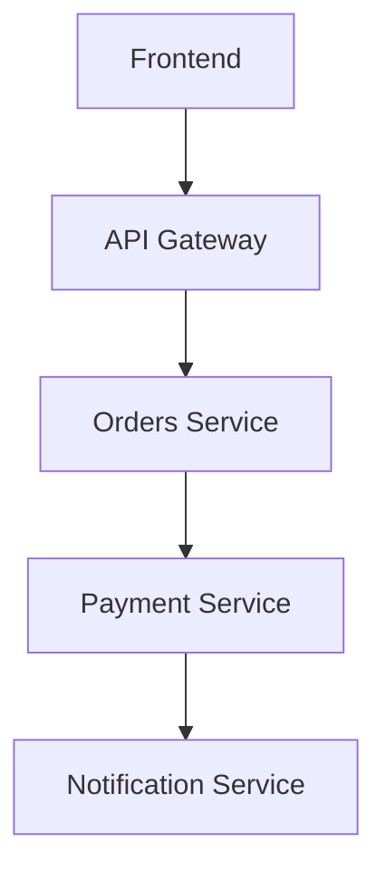
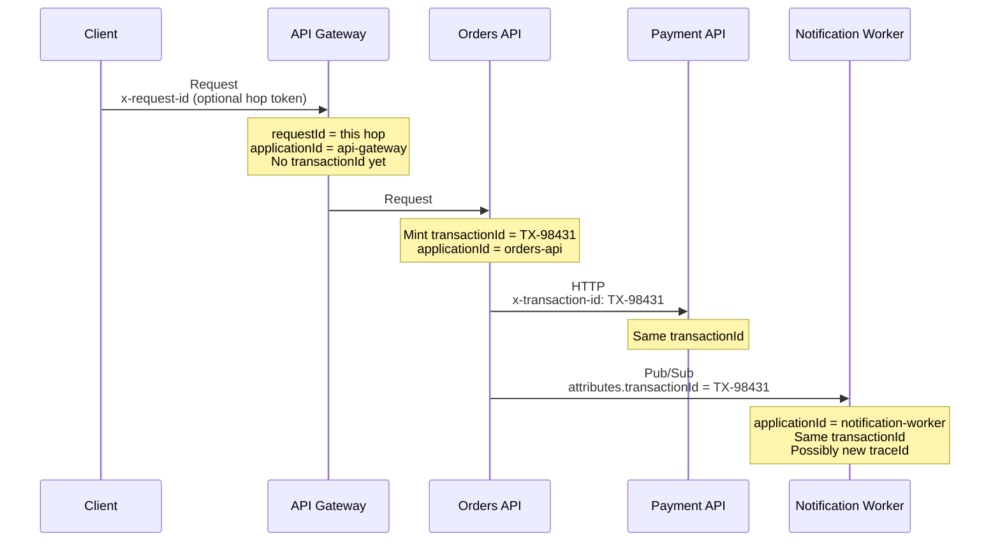
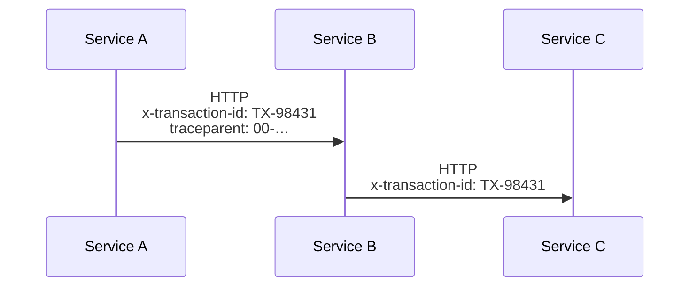
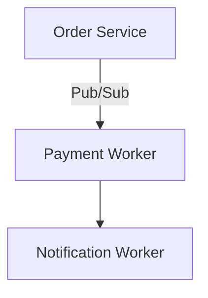
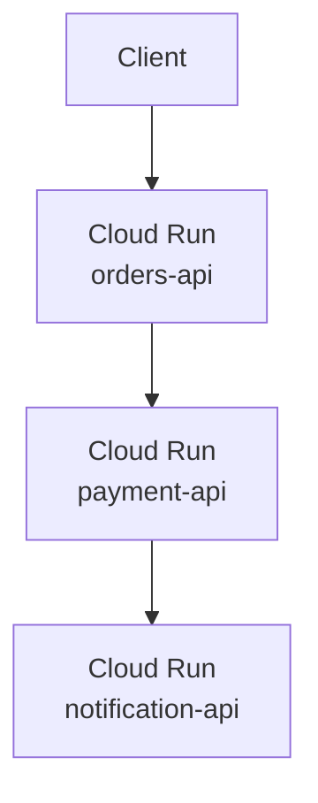
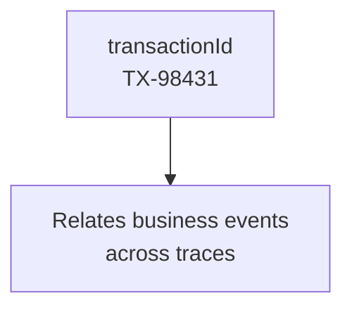
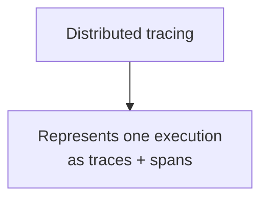
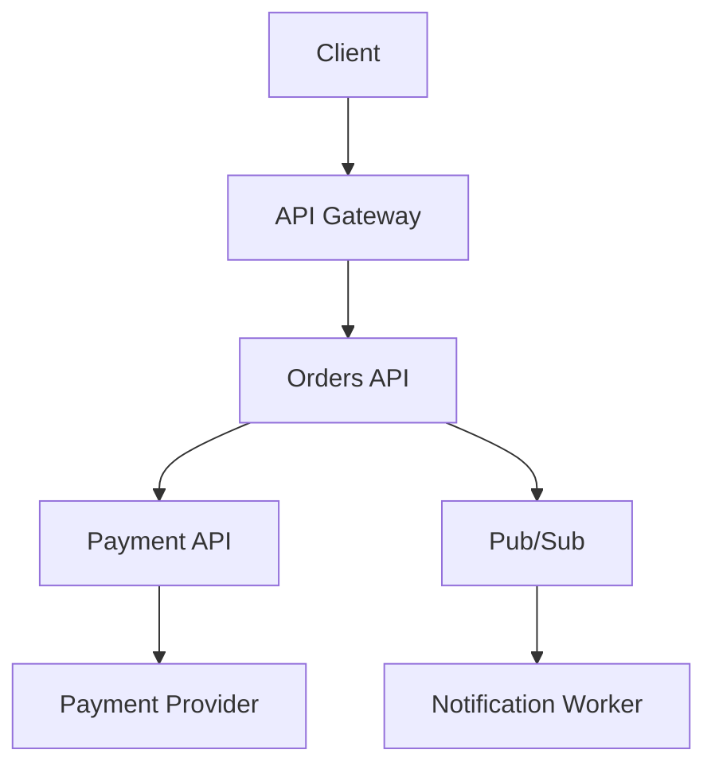

The charge failed. Support has an email, a timestamp, and a screenshot. Orders wrote `order.created`. Payments wrote `card_declined`. Notifications wrote nothing. Three Cloud Run services, three log buckets, clocks that disagree by two seconds. Nobody can prove those lines belong to the same purchase.

That is not a shortage of `console.log`. It is a missing **business** identity.

[A traceId is not a transactionId](/blog/traceid-is-not-transactionid/) is the companion to this article. It defines the identifiers: `transactionId` is the payment, `traceId` is one run through the system, `spanId` is one step. This article is the NestJS half — how those fields get onto every log line, across HTTP and Pub/Sub, without passing them by hand.

The job is not to stamp a UUID onto a string and call it correlation. The job is to put `TX-98431` on every event that belongs to that charge, including the worker that runs an hour later under a new trace.

> A distributed request needs a business identity that follows it through gateways, APIs, workers, and systems you do not own. Structured logging is how `transactionId` becomes searchable. W3C `traceparent` is how the execution stays a tree. They are not the same field.

## Logs without a join key are folklore

A monolith fails in one process. You open one file. A checkout in 2026 fails across processes you cannot attach to at the same time.



Each box writes to its own stdout. Cloud Run collects those streams independently. If the only shared fact is "around 03:04 UTC", you are aligning clocks and hoping the next request did not land in the same second.

Unstructured lines make that worse:

```ts
console.log("Payment failed for order 123");
```

That sentence cannot be filtered by service, joined to a worker, or counted by provider. The order id is English. The next engineer will write `order #123` or `OrderID=123`. Grep becomes archaeology.

Timestamps are a weak join key:

- instances are not perfectly synchronized;
- retries land minutes later;
- a worker may run an hour after the HTTP response;
- two checkouts in the same second produce indistinguishable lines.

You need a field that is equal across every hop of **this payment**. Then the incident is a query, not a reconstruction. That field is `transactionId`. A hop-local `requestId` or a house `correlationId` will not survive the worker retry the companion article describes.

## Structured logging is a contract, not a file format

Structured logging means each line is one **event** with a stable shape: a level, a message, and fields you will query. JSON is the usual encoding. JSON is not the strategy.

This is a string that happens to mention an order:

```ts
console.log("Payment failed for order 123");
```

This is an event:

```json
{
  "level": "error",
  "event": "payment.failed",
  "transactionId": "TX-98431",
  "applicationId": "payment-service",
  "timestamp": "2026-08-15T08:04:12.331Z"
}
```

The second line is **machine-readable**. Cloud Logging stores it as `jsonPayload`. You filter `jsonPayload.transactionId="TX-98431"` and `jsonPayload.event="payment.failed"`. You aggregate failures by `paymentProvider` without a regular expression. Support can ask for `TX-98431` next week, after the original `traceId` has aged out.

A useful event has four kinds of data:

| Piece       | Role                            | Example                          |
| ----------- | ------------------------------- | -------------------------------- |
| **Level**   | How urgent is this line         | `error`                          |
| **Event**   | What happened, as a stable name | `payment.failed`                 |
| **Context** | Which operation, which service  | `transactionId`, `applicationId` |
| **Message** | Human sentence for the timeline | `Payment processing failed`      |

Keep event names boring and consistent: `order.created`, `payment.started`, `payment.failed`. Treat them like API paths. If every service invents its own vocabulary, you are back to folklore with extra braces.

Dumping an object as JSON is not structured logging. `logger.info({ req }, "request")` is a structured leak. Designing the fields is the work.

## These identifiers are not interchangeable

The companion article already made this point. Repeat it only so the NestJS code below does not collapse the fields again.

```text
transactionId
      │
      └── Identifies a business operation   TX-98431

traceId
      │
      └── Identifies a distributed execution

spanId
      │
      └── Identifies a unit of work inside that execution

applicationId
      │
      └── Identifies who emitted the line
```

| Identifier      | What it identifies                            | Who generates it                                                  | Who propagates it                                            | Lifetime                                    |
| --------------- | --------------------------------------------- | ----------------------------------------------------------------- | ------------------------------------------------------------ | ------------------------------------------- |
| `transactionId` | A business operation: this charge, this order | The service that created the business record                      | Every HTTP client, publisher, and worker **after** it exists | Days or weeks. Survives new traces          |
| `applicationId` | Which deployable emitted the line             | Build or runtime config                                           | Not a request identity. Written locally                      | Stable per service                          |
| `requestId`     | One inbound HTTP (or RPC) hop                 | The service that accepted the socket — often pino-http's `req.id` | Usually nobody. The next hop mints its own                   | One request, one process                    |
| `correlationId` | A house "this conversation" token             | Whoever invented `X-Correlation-Id`                               | Whoever remembered to forward it                             | Whatever the team decided                   |
| `traceId`       | One distributed execution                     | The tracer / W3C `traceparent`                                    | OpenTelemetry propagators                                    | One trace. A worker retry may start another |
| `spanId`        | One unit of work inside that execution        | The tracer, per hop or per call                                   | Rewritten on every outbound span                             | One span                                    |

`transactionId` answers "which payment?" Support will ask for `TX-98431`. A checkout can produce two traces — the HTTP charge and the email retry an hour later — and one `transactionId`. That is the join key this article implements.

`requestId` answers "which inbound call hit this instance?" Useful on an access log. Useless the moment Service B generates a new UUID.

`correlationId` is the pre-standard answer: put a UUID on `X-Correlation-Id` and hope. It can carry the conversation **before** a business record exists (the gateway still has no `TX-98431`). It does not encode a parent span, it does not encode sampling, and it is not what finance will type next week. Do not promote it to `transactionId`. Do not replace `traceparent` with it.

`traceId` / `spanId` answer "which run, which step?" They belong to [distributed tracing](https://opentelemetry.io/docs/concepts/signals/traces/). Carry them in parallel via W3C Trace Context. The longer argument is in the [companion article](/blog/traceid-is-not-transactionid/).

## A context you can actually run

For a NestJS estate on Cloud Run, this is the set that pays rent:



Rules that keep the set small:

1. **The domain owns `transactionId`.** Orders (or Payments) mints `TX-98431` when the business record exists. Accept an inbound `x-transaction-id` only if it matches a tight allowlist — same discipline as a UUID, different charset (`TX-` plus digits, or your house format). Echo it on the response so support can file a ticket with a real id.
2. **The edge owns `requestId`.** Accept `x-request-id` / `x-correlation-id` when it is a UUID. Otherwise mint `crypto.randomUUID()`. This covers hops that happen _before_ `TX-98431` exists. It is not the incident join key.
3. **Every service writes `applicationId` locally.** Do not trust the caller to tell you who you are.
4. **`traceId` / `spanId` appear when a tracer is on.** Propagate [W3C `traceparent`](https://www.w3.org/TR/trace-context-1/) in parallel. Do not replace `transactionId` with it. Do not replace `traceparent` with `x-transaction-id`.

A log line from Payment should look like this — fields, not a paragraph:

```json
{
  "severity": "ERROR",
  "message": "Payment processing failed",
  "event": "payment.failed",
  "transactionId": "TX-98431",
  "applicationId": "payment-api",
  "paymentProvider": "stripe",
  "errorCode": "card_declined"
}
```

Same `transactionId` in Orders, Payment, and the worker. Different `applicationId` on each line. A later retry may carry a different `traceId`. You still find the payment.

## A checkout that fails in Payment

The user clicks Pay. The browser calls the gateway. The gateway calls Orders. Orders creates the order, then calls Payment. Payment calls the provider. The card is declined. Orders records the failure and publishes `order.payment_failed`. The notification worker should tell the user.

```text
Orders Service
transactionId=TX-98431
event=order.created

Payment Service
transactionId=TX-98431
event=payment.started

Payment Service
transactionId=TX-98431
event=payment.failed
errorCode=card_declined

Orders Service
transactionId=TX-98431
event=order.payment_failed

Notification Worker
transactionId=TX-98431
traceId=def789
event=notification.payment_failed.sent
```

Five lines, three processes, one business field. The worker may have opened a second trace — the companion article's diagram. You still search `transactionId="TX-98431"` and read the story in order.

Without that field you search `textPayload:"payment"` around 03:04 and get every decline in the region. The next checkout is in the same window. You pick the wrong charge. You page the wrong owner.

## Implementation: NestJS, Pino, and a context you do not thread by hand

The stack is boring on purpose: NestJS, TypeScript, [Pino](https://github.com/pinojs/pino), [`nestjs-pino`](https://github.com/iamolegga/nestjs-pino), and Node's [`AsyncLocalStorage`](https://nodejs.org/api/async_context.html).

`nestjs-pino` wraps `pino-http`. Each inbound HTTP request gets a child logger. `Logger` and `PinoLogger` read that child through `AsyncLocalStorage`, so a service three layers down inherits `req.id` without seeing the request. That is why you should not write this in every method:

```ts
this.logger.info({ transactionId }, "Payment started");
```

If you are typing `transactionId` at the call site after the order exists, the context is not bound.

Register `LoggerModule.forRoot` **once**, in the root module. The library is `@Global()`. A second import registers `pino-http` again and doubles every access log. The failure is silent.

```ts
import { randomUUID } from "node:crypto";
import { Module } from "@nestjs/common";
import { LoggerModule } from "nestjs-pino";
import type { IncomingMessage, ServerResponse } from "node:http";
import { headerValue, isUuid, SERVICE_NAME } from "./request-context";

const REQUEST_ID_HEADER = "x-request-id";

function resolveRequestId(req: IncomingMessage): string {
  const incoming =
    headerValue(req.headers[REQUEST_ID_HEADER]) ?? headerValue(req.headers["x-correlation-id"]);
  return incoming && isUuid(incoming) ? incoming : randomUUID();
}

@Module({
  imports: [
    LoggerModule.forRoot({
      pinoHttp: {
        level: process.env.NODE_ENV === "production" ? "info" : "debug",
        genReqId: (req: IncomingMessage, res: ServerResponse) => {
          const requestId = resolveRequestId(req);
          res.setHeader(REQUEST_ID_HEADER, requestId);
          return requestId;
        },
        customProps: (req) => ({
          requestId: req.id,
          applicationId: SERVICE_NAME,
        }),
        redact: {
          paths: [
            "req.headers.authorization",
            "req.headers.cookie",
            'req.headers["x-api-key"]',
            "req.body.password",
            "req.body.accessToken",
            "req.body.refreshToken",
            "req.body.cvv",
            "req.body.cardNumber",
          ],
          censor: "[Redacted]",
        },
        autoLogging: {
          ignore: (req) => req.url === "/health" || req.url === "/ready",
        },
      },
    }),
  ],
})
export class AppModule {}
```

`genReqId` is the [pino-http](https://github.com/pinojs/pino-http) hook the nestjs-pino FAQ points at for `X-Request-ID`. Use it for the **hop** id. Echo it on the response. It is not `TX-98431`. Clients that retry a create before an order exists still need _some_ id; support that asks about a payment next week needs the transaction.

Validate inbound identifiers. A 4 KB header that contains spaces, quotes, or a crafted payload will end up in every downstream log. A UUID is a tight allowlist for `requestId`. `transactionId` gets its own charset (`TX-` plus digits, or whatever you mint). Do not accept "whatever the caller sent."

Wire the logger in `main.ts` the way Nest and nestjs-pino both document. `bufferLogs` keeps early bootstrap lines until Pino is ready:

```ts
import { NestFactory } from "@nestjs/core";
import { Logger } from "nestjs-pino";
import { AppModule } from "./app.module";
import { LoggerErrorInterceptor } from "nestjs-pino";

async function bootstrap() {
  const app = await NestFactory.create(AppModule, { bufferLogs: true });
  app.useLogger(app.get(Logger));
  app.useGlobalInterceptors(new LoggerErrorInterceptor());
  await app.listen(process.env.PORT ?? 3000);
}

bootstrap();
```

`LoggerErrorInterceptor` copies the real exception onto the response so the automatic `request errored` line contains the error you threw, not a generic `Error`.

In services, use Nest's `Logger`. After `app.useLogger()`, those calls go to Pino and inherit the request child:

```ts
import { Injectable, Logger } from "@nestjs/common";

@Injectable()
export class PaymentsService {
  private readonly logger = new Logger(PaymentsService.name);

  async charge(transactionId: string, paymentProvider: string): Promise<void> {
    this.logger.log({ event: "payment.started", paymentProvider }, "Charging card");

    try {
      await this.provider.charge(transactionId);
    } catch (error) {
      const errorCode = this.providerErrorCode(error);
      this.logger.error(
        { event: "payment.failed", paymentProvider, errorCode },
        "Payment processing failed",
      );
      throw error;
    }
  }
}
```

No `transactionId` in the call. Once Orders assigned it, every later line on this request already has it.

Use `PinoLogger.assign()` when the business id appears — that is the moment `TX-98431` starts to exist. Also assign a `userId` after auth if you will query it. Do not assign a second UUID and call it the transaction:

```ts
import { Controller, Post, Body, Res } from "@nestjs/common";
import type { Response } from "express";
import { PinoLogger } from "nestjs-pino";
import { setTransactionId } from "./request-context";

@Controller("orders")
export class OrdersController {
  constructor(
    private readonly logger: PinoLogger,
    private readonly orders: OrdersService,
  ) {
    this.logger.setContext(OrdersController.name);
  }

  @Post()
  async create(@Body() body: CreateOrderDto, @Res({ passthrough: true }) res: Response) {
    const order = await this.orders.create(body);
    this.logger.assign({ transactionId: order.transactionId });
    setTransactionId(order.transactionId);
    res.setHeader("x-transaction-id", order.transactionId);
    return order;
  }
}
```

`assign` is request-scoped. It is not a global mutable logger. That is the point.

If Payment is called on a later request, read `x-transaction-id` in middleware and `assign` it immediately — do not mint a new `TX-`. The business id is cargo. You forward it; you do not reinvent it.

### AsyncLocalStorage for hops that are not HTTP

`nestjs-pino`'s store dies at the edge of the HTTP request. Outbound clients and Pub/Sub publishers still need to **read** `transactionId`. Workers that never went through `pino-http` need to **restore** it.

A thin store is enough. Nest documents the same pattern in the [Async local storage recipe](https://docs.nestjs.com/recipes/async-local-storage).

```ts
import { AsyncLocalStorage } from "node:async_hooks";

export const SERVICE_NAME = process.env.APPLICATION_ID ?? "orders-api";

export type RequestContext = {
  requestId: string;
  applicationId: string;
  transactionId?: string;
};

export const requestAls = new AsyncLocalStorage<RequestContext>();

export function getTransactionId(): string | undefined {
  return requestAls.getStore()?.transactionId;
}

export function setTransactionId(transactionId: string) {
  const store = requestAls.getStore();
  if (store) store.transactionId = transactionId;
}

export function headerValue(value: string | string[] | undefined): string | undefined {
  if (Array.isArray(value)) return value[0];
  return value;
}

export function isUuid(value: string): boolean {
  return /^[0-9a-f]{8}-[0-9a-f]{4}-[1-8][0-9a-f]{3}-[89ab][0-9a-f]{3}-[0-9a-f]{12}$/i.test(value);
}

export function isTransactionId(value: string): boolean {
  return /^TX-[A-Z0-9]{4,32}$/.test(value);
}
```

Enter the store after `pino-http` has set `req.id`. If the caller already has `TX-98431`, bind it here so Payment never waits on Orders to assign it again:

```ts
import { Injectable, NestMiddleware } from "@nestjs/common";
import type { NextFunction, Request, Response } from "express";
import { headerValue, isTransactionId, requestAls, SERVICE_NAME } from "./request-context";

@Injectable()
export class RequestContextMiddleware implements NestMiddleware {
  use(req: Request, res: Response, next: NextFunction) {
    const incoming = headerValue(req.headers["x-transaction-id"]);
    const transactionId = incoming && isTransactionId(incoming) ? incoming : undefined;
    if (transactionId) {
      res.setHeader("x-transaction-id", transactionId);
    }

    requestAls.run({ requestId: String(req.id), applicationId: SERVICE_NAME, transactionId }, () =>
      next(),
    );
  }
}
```

Two stores, two jobs. `nestjs-pino` binds logs. Yours binds outbound I/O. Do not invent a third. If `transactionId` was on the inbound header, also `assign` it onto the child logger in this middleware (or a tiny interceptor) so every line of the hop carries `TX-98431`.

## Propagate on every HTTP call

The id is useless if Service B never sees it.



Nest's HTTP client is [`HttpService` from `@nestjs/axios`](https://docs.nestjs.com/techniques/http-module). Configure Axios once through `axiosRef`. Do not add the header in each service method.

```ts
import { Injectable, OnModuleInit } from "@nestjs/common";
import { HttpService } from "@nestjs/axios";
import { getTransactionId } from "./request-context";

@Injectable()
export class OutboundTransactionInterceptor implements OnModuleInit {
  constructor(private readonly http: HttpService) {}

  onModuleInit() {
    this.http.axiosRef.interceptors.request.use((config) => {
      const transactionId = getTransactionId();
      if (transactionId) {
        config.headers.set("x-transaction-id", transactionId);
      }
      return config;
    });
  }
}
```

Register that provider in the same module that imports `HttpModule`. Every `this.http.post(...)` now forwards the payment. Service B's middleware accepts `TX-98431` and assigns it.

If you also run OpenTelemetry, forward `traceparent` / `tracestate` with the official propagator. That is a different header and a different job. `x-transaction-id` is cargo. `traceparent` is the execution passport. The companion article is explicit: do not replace one with the other. Send both.

What breaks the chain:

- a raw `fetch` or `undici` call that bypasses `HttpService`;
- a cron that starts work with no inbound `transactionId` and never loads one from the job payload;
- a third-party SDK that opens its own HTTP agent.

Wrap those the same way: read `getTransactionId()`, set the header, or refuse to call out without a store once the business record exists.

## Propagate through Pub/Sub and jobs

HTTP headers die at the response. The notification email is sent by a worker that was not on the socket.



[Pub/Sub messages](https://cloud.google.com/pubsub/docs/publisher) have `data` and optional **attributes**: string key-value pairs, at most 100, keys ≤ 256 bytes, values ≤ 1024 bytes. Google documents attributes for metadata such as timestamps and **transaction ids**. That is the transport.

```ts
import { PubSub } from "@google-cloud/pubsub";
import { getTransactionId, SERVICE_NAME } from "./request-context";

const pubsub = new PubSub();

export async function publishOrderEvent(event: string, payload: Record<string, unknown>) {
  const transactionId = getTransactionId();
  if (!transactionId) {
    throw new Error("Refusing to publish without a transactionId");
  }

  await pubsub.topic("order-events").publishMessage({
    json: { event, ...payload },
    attributes: {
      transactionId,
      applicationId: SERVICE_NAME,
    },
  });
}
```

Prefer attributes over stuffing a `metadata` object into `data`:

```json
{
  "data": { "event": "order.payment_failed" },
  "attributes": {
    "transactionId": "TX-98431",
    "applicationId": "orders-api"
  }
}
```

Attributes are filterable on the subscription. They survive a change to the payload schema. They stay out of the business document. A nested `metadata` block inside `data` works if every consumer remembers to look there. The next schema, the next language, and the next intern will not.

The worker must restore the store **before** it logs or publishes again. A push subscription is an HTTP request: copy `attributes.transactionId` onto `x-transaction-id` and let the middleware bind it. A pull worker has no `pino-http` child. Bind the fields yourself:

```ts
import { Injectable, Logger } from "@nestjs/common";
import { PinoLogger } from "nestjs-pino";
import { isTransactionId, requestAls, SERVICE_NAME } from "./request-context";
import { randomUUID } from "node:crypto";

@Injectable()
export class NotificationWorker {
  private readonly logger = new Logger(NotificationWorker.name);

  constructor(private readonly pino: PinoLogger) {}

  async handle(message: { attributes: Record<string, string>; data: Buffer }) {
    const incoming = message.attributes.transactionId;
    if (!incoming || !isTransactionId(incoming)) {
      this.logger.error({ event: "notification.orphaned" }, "Message missing transactionId");
      return;
    }

    await requestAls.run(
      { requestId: randomUUID(), applicationId: SERVICE_NAME, transactionId: incoming },
      async () => {
        this.pino.assign({ transactionId: incoming, applicationId: SERVICE_NAME });
        this.logger.log({ event: "notification.started" }, "Sending payment-failed email");
      },
    );
  }
}
```

If the attribute is missing, do not mint a new `TX-`. A silent new transaction id is how a retry becomes a second payment in the logs. Drop to dead-letter, or log `notification.orphaned` and stop.

The same restore step applies to Bull, Cloud Tasks, and cron. The transport changes. The rule does not: **whoever starts work must enter the store with the business id**. HTTP middleware does it for requests. The consumer does it for messages. The scheduler does it for jobs.

Three different mechanisms, one purpose:

| Mechanism           | Carrier                              | Restored by                           |
| ------------------- | ------------------------------------ | ------------------------------------- |
| HTTP propagation    | `x-transaction-id`                   | middleware + `assign`                 |
| Message propagation | Pub/Sub attributes (or job metadata) | the consumer, via `requestAls.run`    |
| Request context     | `AsyncLocalStorage` in-process       | nothing — it does not cross a process |
| Distributed tracing | W3C `traceparent`                    | the OpenTelemetry propagator          |

Do not expect ALS to survive a publish. Do not expect `traceparent` to survive a worker that never extracted it. Copy `transactionId` onto the message. The worker's new `traceId` is expected. The companion article already drew that graph.

## Cloud Run: three services, three streams, one query

Put Orders, Payment, and Notifications on Cloud Run and the platform will do exactly what it promises: collect stdout from each service into Cloud Logging, tagged with that service's resource. It will not notice that the three streams are one purchase.



Without a shared field you open three services in Logs Explorer and scroll. With `transactionId` on every JSON line, one query rebuilds the purchase — including the worker that ran later:

```text
jsonPayload.transactionId="TX-98431"
```

[Cloud Run logging](https://cloud.google.com/run/docs/logging) parses each stdout line. A JSON object becomes `jsonPayload`. A plain string becomes `textPayload`. `textPayload` is what you get from `console.log("Payment failed")`. You will search it with substrings until you stop.

Cloud Logging also lifts **special fields** out of the JSON onto the `LogEntry`. The ones that matter here:

| JSON field                             | LogEntry field | Why you set it                                            |
| -------------------------------------- | -------------- | --------------------------------------------------------- |
| `severity`                             | `severity`     | Filter by level without parsing Pino's numeric `level`    |
| `message`                              | display text   | The sentence in the timeline                              |
| `logging.googleapis.com/trace`         | `trace`        | Nest this line under the request log and join Cloud Trace |
| `logging.googleapis.com/spanId`        | `spanId`       | Which span produced the line                              |
| `logging.googleapis.com/trace_sampled` | `traceSampled` | Whether a span was stored                                 |

Pino's defaults are `level: 30` and `msg`. Cloud Logging does not treat those as special. Map them once:

```ts
const SEVERITY: Record<string, string> = {
  trace: "DEBUG",
  debug: "DEBUG",
  info: "INFO",
  warn: "WARNING",
  error: "ERROR",
  fatal: "CRITICAL",
};

// inside pinoHttp:
{
  messageKey: "message",
  formatters: {
    level(label) {
      return { severity: SEVERITY[label] ?? label.toUpperCase() };
    },
  },
}
```

Cloud Run's own sample still reads `X-Cloud-Trace-Context` and writes `logging.googleapis.com/trace` as `projects/PROJECT_ID/traces/TRACE_ID`. Prefer `traceparent` when it is present — Cloud Run sets it on inbound service requests — and keep the legacy header as fallback. Add that to `customProps`:

```ts
function cloudTrace(req: IncomingMessage, projectId: string): Record<string, string> {
  const traceparent = headerValue(req.headers.traceparent);
  const w3c = traceparent?.split("-");
  if (w3c?.[0] === "00" && w3c[1] && w3c[1] !== "0".repeat(32)) {
    return {
      "logging.googleapis.com/trace": `projects/${projectId}/traces/${w3c[1]}`,
      "logging.googleapis.com/spanId": w3c[2] ?? "",
    };
  }

  const legacy = headerValue(req.headers["x-cloud-trace-context"]);
  const traceId = legacy?.split("/")[0];
  if (traceId) {
    return {
      "logging.googleapis.com/trace": `projects/${projectId}/traces/${traceId}`,
    };
  }

  return {};
}
```

Container logs nest under the request log in Logs Explorer only when they share that `trace` field. Writing JSON is not enough. Writing `transactionId` is enough to search across services even when the trace was not sampled — the companion article notes that `traceSampled: false` is still a valid join to logs, not proof the request never happened. Use both: `transactionId` for the payment, `trace` for the platform join.

Retention is a product decision. A `transactionId` you cannot query after 24 hours is a postmortem you cannot finish. Set a retention that matches how long support still asks "what happened to this payment?"

## Do not log the request

Redaction is not a courtesy. Logs are a durable store with a wider audience than the production database: on-call, contractors, SIEM exporters, the next intern with Logs Explorer access.

Never write:

- passwords and password hashes;
- access tokens, refresh tokens, session tokens;
- cookies and `Set-Cookie`;
- `Authorization` and API keys;
- full payment payloads, PAN, CVV, expiry, bank account numbers;
- secrets, private keys, connection strings;
- personal data you do not need in order to debug (`email` is often enough; a national id never is).

This line is how those values escape:

```ts
this.logger.log({ req }, "incoming request");
```

`pino-http` already serializes a request object onto the access log. That object includes headers. If you also pass `req` or `req.body` from a handler, you get the body, the bearer token, and whatever the client posted as `cvv`. `redact` is a safety net, not a license.

Pino redacts **paths you list**, at serialization time, using [`fast-redact`](https://github.com/pinojs/pino/blob/main/docs/redaction.md). Paths are case-sensitive. Hyphenated headers need bracket notation. Wildcards exist (`req.headers["x-api-key"]`, `users[*].password`). User input must never define those paths — the library evaluates them in a VM.

```ts
redact: {
  paths: [
    "req.headers.authorization",
    "req.headers.cookie",
    'res.headers["set-cookie"]',
    "req.body.password",
    "req.body.accessToken",
    "req.body.refreshToken",
    "req.body.cvv",
    "req.body.cardNumber",
    "*.secret",
  ],
  censor: "[Redacted]",
}
```

Defense in layers:

1. **Do not log the object.** Log `event`, `transactionId`, `errorCode`. That is an allowlist.
2. **Redact known secret paths** so an access log or a future `logger.log({ req })` cannot leak them.
3. **Classify fields** in the DTO: identifiers are fine, credentials are not, PII is a decision.
4. **Disable body serialization** on the access log if you do not need it. You almost never need it.

`censor: "[Redacted]"` still tells you the key existed. `remove: true` drops the key. For tokens, either is fine. For CVV, prefer never having the path in the logger at all.

## Levels are a budget

Pino's levels are `trace`, `debug`, `info`, `warn`, `error`, `fatal`. Nest's `Logger` maps `verbose` → `trace` and `log` → `info`. Production should not default to `debug`.

| Level   | When                                                                            | Example                                                     | Production?                     |
| ------- | ------------------------------------------------------------------------------- | ----------------------------------------------------------- | ------------------------------- |
| `trace` | Instruction-level noise                                                         | Entered `mapProviderError`                                  | No                              |
| `debug` | Local diagnosis, feature flags, raw provider payloads you have already redacted | Provider response id, retry attempt                         | Sampled or off                  |
| `info`  | A state change you will want in an incident timeline                            | `order.created`, `payment.started`                          | Yes, for sparse business events |
| `warn`  | Recoverable, but someone should look                                            | Provider timeout, then retry; dropped optional notification | Yes                             |
| `error` | This unit of work failed                                                        | `payment.failed`, unhandled handler exception               | Yes                             |
| `fatal` | The process should not continue                                                 | Failed to boot, lost the database pool, out of memory       | Yes, and rare                   |

A good log system lets you investigate an incident without producing millions of irrelevant lines.

`/health` at `info` on every instance, every ten seconds, is how you bury `payment.failed`. Successful GETs of a public catalog at `info` are the same firehose. Keep automatic HTTP completion logs, or drop 2xx to `debug` with `customLogLevel` and keep 5xx at `error`.

```ts
customLogLevel: (_req, res, err) => {
  if (res.statusCode >= 500 || err) return "error";
  if (res.statusCode >= 400) return "warn";
  return "info";
},
```

Even that `info` on every 200 will dominate a high-QPS service. Ignore health. Sample or silence the rest if the stream is the product.

Do not log `error` for a 404 the client caused, or `info` for a declined card you already handle. A decline is a business outcome: `warn` or `info` with `event=payment.failed` is enough unless the provider call itself threw.

## Bad logging vs good logging

```ts
console.log("Error processing payment");
console.log(order);
console.log(req);
```

Three lines, no event name, no join key, a full order object (customer, card hints, whatever the ORM loaded), and the request (Authorization, cookies, body). You cannot filter them. You cannot prove they are the same checkout. You may have just written a PAN to a bucket with a 30-day retention.

```ts
this.logger.error(
  {
    event: "payment.failed",
    paymentProvider,
    errorCode,
  },
  "Payment processing failed",
);
```

One event. Fields you will query. A sentence for the timeline. `transactionId` and `applicationId` already bound. Nothing in `order` or `req` that you did not choose.

The second form is slower to type the first time and faster every time you are on call.

## transactionId is not a traceId





That is the same split as the [companion article](/blog/traceid-is-not-transactionid/). A `transactionId` lets you list every log line for the payment, including a worker that ran later under a new `traceId`. It does not give you a parent/child graph, per-hop latency, or a sampling decision.

A `traceId` plus `spanId` values let you draw that graph in Cloud Trace, Jaeger, or whatever backend OpenTelemetry exports to. OpenTelemetry's default propagator is W3C Trace Context. SDKs can [inject the active `traceId` / `spanId` into log records](https://opentelemetry.io/docs/concepts/signals/logs/) so the waterfall and the log query meet.

You want both when the system is large enough to pay for a tracer. You still want `transactionId` when:

- a hop does not speak `traceparent`;
- a worker starts a new trace;
- support asks for an id they can put in a ticket;
- the trace was not sampled and Cloud Trace has no waterfall;
- finance asks about the same charge next week.

[Logs, traces, and metrics](https://opentelemetry.io/docs/concepts/context-propagation/) are complementary signals. A dashboard without a join key, a trace without logs, and a counter without an example request are three partial systems. Do not present `x-transaction-id` as a cheaper OpenTelemetry. Do not present `x-correlation-id` as a `transactionId`.

## 3:00 AM — a payment failed

A customer writes: the card was charged, or was not, and the app showed an error. They include `TX-98431` from the receipt, or you find `x-transaction-id` on the response.

**1. Search the transaction id.** In Cloud Logging: `jsonPayload.transactionId="TX-98431"`. Do not start with the timestamp. Do not start with a house correlation UUID.

**2. Land in Orders.** `event=order.created`, `applicationId=orders-api`. The request reached you. The business record exists.

**3. Follow Payment.** Same `transactionId`. `event=payment.started`, then `event=payment.failed`, `errorCode=card_declined`, `paymentProvider=stripe`. The failure is the provider's decline, not a 500 in Orders. Note the `traceId` on those lines — that is the HTTP checkout.

**4. Read the provider fields you allowed.** An `errorCode` and a provider request id, not the card. If those fields are missing, the next incident will be this one again.

**5. Check the worker.** `applicationId=notification-worker`, `event=notification.payment_failed.sent` — or no line at all. The `traceId` here may be `def789`. That is not a different payment. It is the second execution the companion article warned about.

**6. Say where it actually failed.** Not "payments is down." The card was declined. Orders recorded it. The user should have received the email. If they did not, the worker is the page, not the charge.

That walk is the reason the rest of the article exists. MTTR is the time to the field, not the time to the theory.

## Architecture worth copying



`transactionId` is minted in Orders and copied onto every arrow after that: HTTP header on Orders → Payment → Provider (if the provider allows custom headers), Pub/Sub attributes on Orders → Worker.

`applicationId` is written by each box. It changes. That is how you see who spoke.

`traceId` follows the synchronous HTTP path when OpenTelemetry or Cloud Run's `traceparent` is in play. The worker may start a new trace. `TX-98431` does not change.

Recommended shape for a NestJS service:

1. `LoggerModule.forRoot` once. `genReqId` for the hop, `customProps` for `applicationId`, `redact`, health ignore.
2. `RequestContextMiddleware` enters `AsyncLocalStorage` and binds inbound `x-transaction-id`.
3. Controllers `assign({ transactionId })` when the business record is created.
4. `OutboundTransactionInterceptor` on `HttpService.axiosRef`.
5. Publishers copy `getTransactionId()` into message attributes.
6. Consumers call `requestAls.run` with the same `transactionId` before they log or publish.
7. Optional: OpenTelemetry SDK. Same store, `traceparent` on a different header.

## Checklist

- [ ] Structured logs: one JSON event per line, stable field names
- [ ] `transactionId` on every business event, assigned once, never reinvented
- [ ] Context propagation: ALS in-process, not method parameters
- [ ] Redaction: secrets stripped at the logger
- [ ] Log levels: production is not `debug`
- [ ] Consistent events: `order.created`, not free prose
- [ ] Useful metadata: `errorCode`, `applicationId`
- [ ] No secrets, tokens, cookies, PAN, CVV
- [ ] HTTP propagation: `x-transaction-id` once the record exists
- [ ] Async propagation: Pub/Sub attributes and job metadata carry `transactionId`
- [ ] `traceparent` when distributed tracing is on; not a substitute for `transactionId`
- [ ] Retention long enough to finish an incident

## The request has to remain reconstructable

A production failure is a path. Structured logging makes each step a row. `transactionId` makes those rows one result set — including the worker that opened a second `traceId`. Redaction keeps the result set from becoming a breach. Levels keep it from becoming noise.

Put a UUID in `x-request-id` if you want. That is the hop. The design is the business context: who mints `TX-98431`, who refuses a bad one, who copies it onto the next hop, and which fields you are willing to store for a month.

When that is in place, "what happened to this payment?" is a filter. Until it is, you are still aligning timestamps. The identifiers themselves are in the [companion article](/blog/traceid-is-not-transactionid/). This page is how they get into NestJS.

## Sources

- NestJS, [Logger](https://docs.nestjs.com/techniques/logger) — `useLogger`, `bufferLogs`, `Logger` from `@nestjs/common`
- NestJS, [HTTP module](https://docs.nestjs.com/techniques/http-module) — `HttpModule`, `HttpService`, `axiosRef`
- NestJS, [Middleware](https://docs.nestjs.com/middleware) — applying middleware in `configure`
- NestJS, [Interceptors](https://docs.nestjs.com/interceptors) — global interceptors
- NestJS, [Async local storage](https://docs.nestjs.com/recipes/async-local-storage) — request-scoped context without REQUEST-scoped providers
- [nestjs-pino](https://github.com/iamolegga/nestjs-pino) — `LoggerModule.forRoot`, `genReqId`, `assign`, AsyncLocalStorage, do not re-import the module
- Pino, [API](https://github.com/pinojs/pino/blob/master/docs/api.md) — levels, `redact`, `formatters`, `messageKey`
- Pino, [Redaction](https://github.com/pinojs/pino/blob/main/docs/redaction.md) — path syntax, `censor`, `remove`, no user-defined paths
- [pino-http](https://github.com/pinojs/pino-http) — `genReqId`, `customProps`, `autoLogging`, `customLogLevel`
- Node.js, [`crypto.randomUUID`](https://nodejs.org/api/crypto.html#cryptorandomuuidoptions)
- Node.js, [AsyncLocalStorage](https://nodejs.org/api/async_context.html#class-asynclocalstorage)
- Google Cloud, [Structured logging](https://cloud.google.com/logging/docs/structured-logging) — special JSON fields
- Google Cloud, [Logging and viewing logs in Cloud Run](https://cloud.google.com/run/docs/logging) — stdout JSON, `X-Cloud-Trace-Context` sample
- Google Cloud, [Using distributed tracing — Cloud Run](https://cloud.google.com/run/docs/trace)
- Google Cloud, [Trace context — Cloud Trace](https://cloud.google.com/trace/docs/trace-context) — `traceparent` and `X-Cloud-Trace-Context`
- Google Cloud, [LogEntry](https://cloud.google.com/logging/docs/reference/v2/rest/v2/LogEntry) — `trace`, `spanId`, `traceSampled`
- Google Cloud, [Publish messages](https://cloud.google.com/pubsub/docs/publisher) — attributes as metadata
- Google Cloud, [PubsubMessage](https://cloud.google.com/pubsub/docs/reference/rest/v1/PubsubMessage)
- OpenTelemetry, [Logs](https://opentelemetry.io/docs/concepts/signals/logs/)
- OpenTelemetry, [Traces](https://opentelemetry.io/docs/concepts/signals/traces/)
- OpenTelemetry, [Context propagation](https://opentelemetry.io/docs/concepts/context-propagation/)
- [W3C Trace Context](https://www.w3.org/TR/trace-context-1/)
