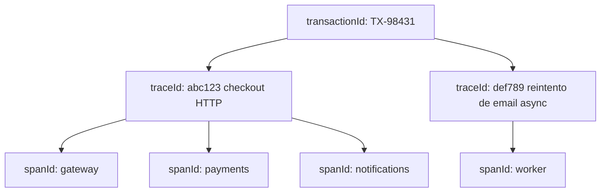
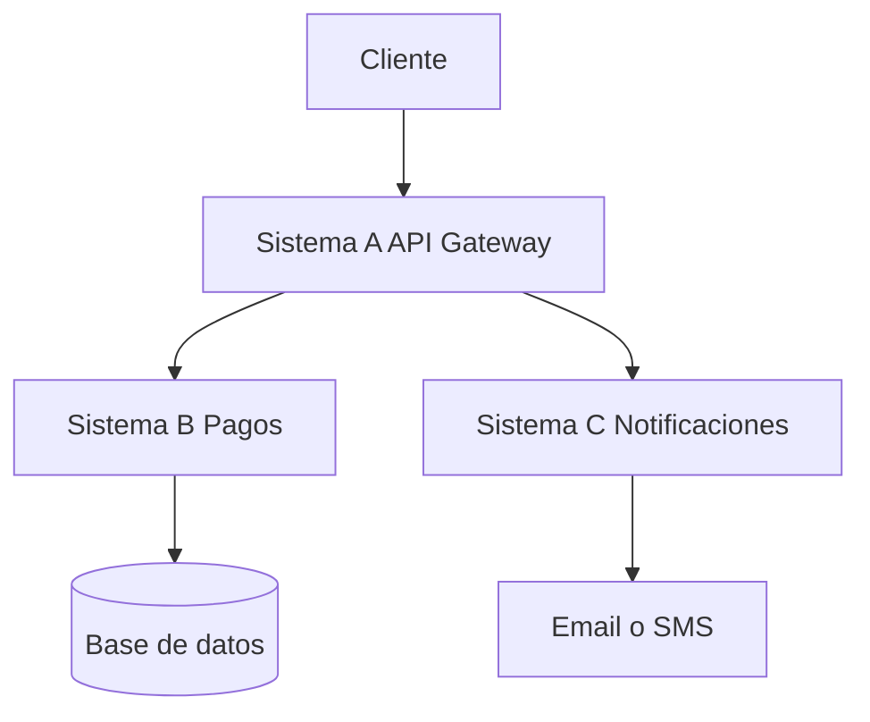
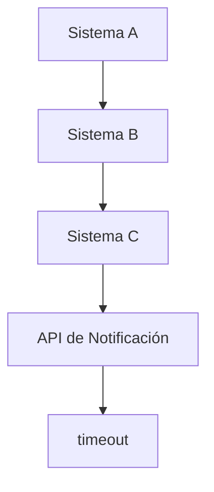
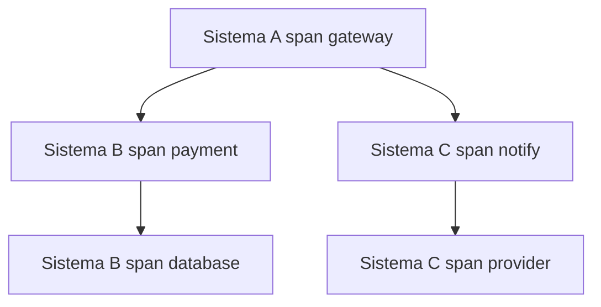
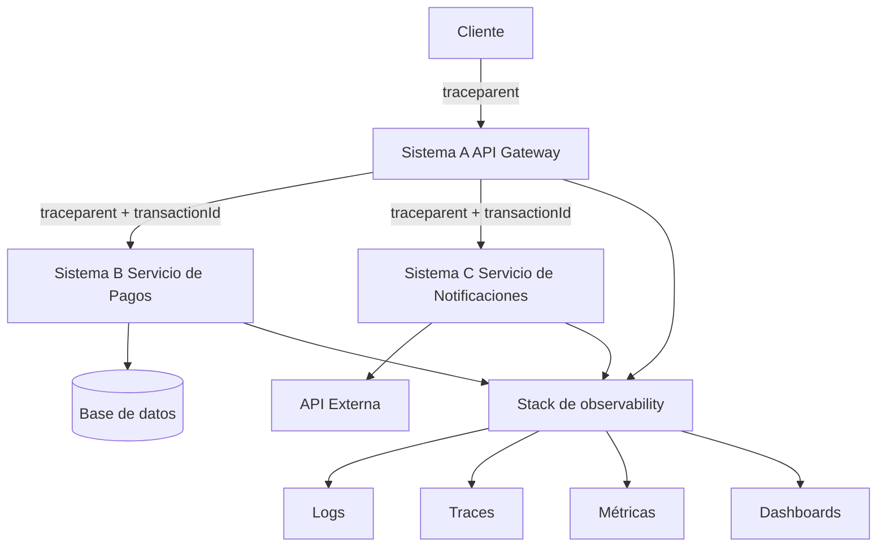
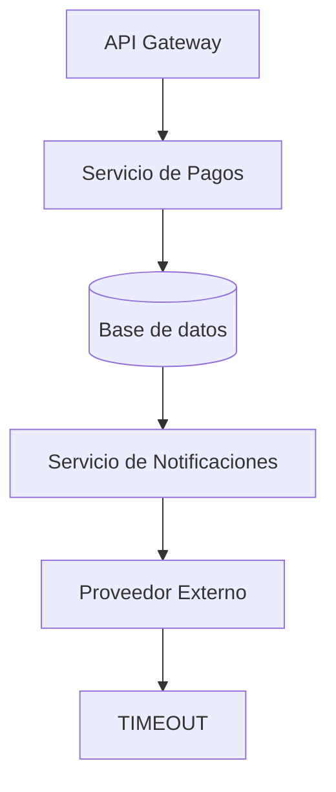

El pago se procesó. El correo de confirmación nunca llegó. Tres servicios escribieron "done" o "failed" en tres buckets de logs distintos, y nadie puede demostrar que la misma petición de usuario produjo las tres líneas.

Eso no es falta de logging. Es una identidad de ejecución que falta.

Cuando una operación empieza en el Sistema A y luego llama al Sistema B y al Sistema C, tienes que poder seguir esa misma operación de punta a punta y decir exactamente qué pasó en cada componente. Más líneas de `console.log` no harán eso. Un contexto compartido sí.

No necesitas más logs. Necesitas una petición reconstruible.

Cómo vincular `transactionId` a los logs de NestJS — y propagarlo sobre HTTP y Pub/Sub sin pasarlo a mano por cada método — está en [Logging estructurado y transaction IDs en NestJS](/blog/structured-logging-transaction-ids-nestjs/).

## Estos identificadores no son lo mismo

Los equipos comprimen cada ID en «el correlation id» y luego se preguntan por qué la búsqueda sigue devolviendo ruido. Los nombres parecen parientes. Los trabajos no lo son.

| Identificador   | Qué identifica                                              | Vida útil típica                                           |
| --------------- | ----------------------------------------------------------- | ---------------------------------------------------------- |
| `transactionId` | Una operación de negocio: cobrar esta tarjeta, completar este pedido | Sobrevive a reintentos, workers y a veces múltiples traces |
| `applicationId` | Qué aplicación o servicio emitió el evento                  | Estable por unidad desplegable                             |
| `requestId`     | Una petición HTTP (o RPC) entrante en un solo hop           | Normalmente local a un solo servicio                       |
| `correlationId` | Un token propietario de "esta conversación"                 | Lo que tu equipo haya inventado                            |
| `traceId`       | Una ejecución distribuida                                   | Un grafo causal de spans                                   |
| `spanId`        | Una unidad de trabajo dentro de esa ejecución               | Un hop, una query o una llamada saliente                   |

```text
transactionId
      │
      └── Identifica una operación de negocio

traceId
      │
      └── Identifica una ejecución distribuida

spanId
      │
      └── Identifica una unidad de trabajo dentro de esa ejecución

service / application
      │
      └── Identifica quién está procesando la operación
```

Un `transactionId` responde "¿qué pago?" Un `traceId` responde "¿qué pasada por el sistema?" Un `spanId` responde "¿qué pieza de trabajo dentro de esa pasada?" El nombre del servicio responde "¿quién tenía la petición cuando se escribió esta línea?"

No asumas que `transactionId === traceId`. Un checkout puede iniciar un trace síncrono en la API, y luego un worker puede abrir un **segundo** trace cuando reintenta el email una hora después. Ambos traces deberían seguir llevando `TX-98431`. Solo el primero es la ejecución HTTP original.

`requestId` es útil en un gateway. Es un sustituto débil de un trace. El siguiente servicio que genera su propio UUID ya rompió la cadena.

`correlationId` es la respuesta anterior al estándar: pon un UUID en `X-Correlation-Id` y espera que cada hop lo reenvíe. Puede funcionar dentro de una empresa. No le dice a un span quién es su padre, no codifica una decisión de sampling, y el siguiente vendor que integres no hablará tu header.

`applicationId` no es un identificador de petición en absoluto. Te dice qué binario produjo la línea. Sin él, un `traceId` compartido es un montón de eventos sin dueño.



Una operación de negocio. Dos ejecuciones. Varias unidades de trabajo. Si solo guardas `TX-98431`, puedes encontrar el pago. Todavía no puedes dibujar el grafo de llamadas.

## Prefiere W3C Trace Context sobre un formato casero

W3C Trace Context existe porque cada vendor inventó un header, y los traces morían en la primera frontera que no les pertenecía. La especificación estandariza dos headers HTTP para que plataformas, proxies y backends de tracing puedan reenviar la misma identidad.

`traceparent` es el header portable de longitud fija. Tiene cuatro campos:

```text
{version}-{trace-id}-{parent-id}-{trace-flags}
```

El ejemplo de la propia especificación:

```text
traceparent: 00-0af7651916cd43dd8448eb211c80319c-b7ad6b7169203331-01
```

- **version** — actualmente `00`. `ff` es inválido.
- **trace-id** — 16 bytes, 32 caracteres hexadecimales en minúscula. Todos ceros es inválido. Es el ID de todo el bosque de traces.
- **parent-id** — 8 bytes, 16 caracteres hexadecimales en minúscula. Es el span del llamador. Los sistemas de tracing también lo llaman `span-id`. Todos ceros es inválido.
- **trace-flags** — 8 bits. En la versión `00`, el bit menos significativo es **sampled**: el llamador puede haber grabado datos de trace.

Cuando un servicio participa, mantiene el mismo `trace-id` y escribe un **nuevo** `parent-id` para el span que está a punto de enviar downstream. Así es como se forma un árbol. El `parent-id` entrante se convierte en el padre del span local.

`tracestate` es el sidecar de vendors: una lista de pares `key=value`. Guardar datos ahí es opcional. Reenviar el header no lo es. Un hop que no entiende `rojo=00f067aa0ba902b7` debe enviarlo de todas formas. Así es como dos vendors de tracing pueden compartir un `trace-id` sin perder los metadatos del otro.

El propagador por defecto de OpenTelemetry es este par de headers. Las plataformas cloud que se preocupan por la interoperabilidad lo hablan. Un `X-My-Request-Id` personalizado no.

Puedes seguir llevando `transactionId` como un campo de aplicación, una entrada de baggage o un atributo de mensaje. No reemplaces `traceparent` con él. La identidad de negocio y la identidad de ejecución resuelven consultas distintas.

## Un pago que también envía una notificación

La acción del usuario es ordinaria: cobrar la tarjeta y enviar una confirmación.



Una operación produce varios eventos. Si cada servicio escribe el mismo `transactionId` y `traceId`, esos eventos se convierten en una sola historia:

```text
System A
transactionId=TX-98431
traceId=abc123
message="Payment request received"

System B
transactionId=TX-98431
traceId=abc123
message="Payment processing started"

System B
transactionId=TX-98431
traceId=abc123
message="Payment completed"

System C
transactionId=TX-98431
traceId=abc123
message="Notification sent"
```

Los valores de `spanId` difieren. System A posee el span raíz. System B crea un hijo para el cobro y otro para la escritura en base de datos. System C crea un hijo para la llamada al proveedor. El `traceId` es la clave para correlacionar. El `transactionId` es cómo finanzas preguntará por el mismo pago la semana que viene, después de que el trace haya expirado del backend.

Ahora el proveedor da timeout.



Un ingeniero busca `traceId = abc123` y reconstruye la ejecución:

```text
09:41:02  System A  request received
09:41:03  System B  payment started
09:41:04  System B  payment completed
09:41:05  System C  notification started
09:41:15  System C  ERROR timeout
```

Esa línea de tiempo responde las preguntas que realmente importan a las 3 a.m.:

- ¿Dónde falló la operación?
- ¿Qué servicio emitió el error?
- ¿Cuánto tardó cada componente?
- ¿Llegó la petición al Sistema C?
- ¿El fallo fue nuestro o de una dependencia externa?
- ¿Qué otras operaciones comparten el mismo radio de impacto?
- ¿Cuál fue la ruta completa de la petición?

Sin el `traceId` compartido, estás alineando relojes entre tres almacenes de logs y esperando que los timestamps sean honestos. Con él, la ruta es una consulta.



Mismo `traceId`. Distinto `spanId` en cada caja. La latencia vive en los edges. El timeout vive en el último span, no en el pago.

## Logging no es observability

Guardar logs no es lo mismo que tener observability.

Los logs tradicionales registran que algo pasó, en un dialecto que solo un humano puede parsear:

```text
Payment completed
Notification failed
Database timeout
Request received
```

Esas líneas no se pueden filtrar por servicio, unir a un trace, ni agregar sin expresiones regulares que se pudren la primera vez que alguien reformula un mensaje. Tampoco pueden decirte si "Notification failed" pertenece a `TX-98431` o a la petición de al lado.

Los logs estructurados y correlacionados registran un hecho que puedes consultar:

```json
{
  "timestamp": "2026-08-14T09:41:15.102Z",
  "severity": "ERROR",
  "service": "notification-service",
  "traceId": "abc123",
  "spanId": "def456",
  "transactionId": "TX-98431",
  "message": "Notification provider timeout"
}
```

El logging estructurado te da:

- **Búsqueda** — `transactionId=TX-98431` es una igualdad, no un grep.
- **Filtrado** — severity, servicio, entorno y versión son campos.
- **Agregación** — cuenta timeouts por proveedor sin parsear inglés.
- **Correlación** — el mismo `traceId` une logs con spans.
- **Análisis automatizado** — alertas y jobs de anomalías consumen JSON, no prosa.
- **Integración de observability** — los backends ya conocen `trace` y `spanId`.
- **Troubleshooting** — una consulta reconstruye la ruta.
- **Auditoría técnica** — puedes mostrar lo que hizo el sistema, no lo que implicaba un string.

Una línea de log sin `traceId` es un evento huérfano. Pasó. No podrás demostrar a quién.

## Cloud Run: traces que te da, correlación que todavía tienes que escribir

Google Cloud Run es un caso concreto útil porque la plataforma hace parte del trabajo y te deja el resto. La división es fácil de pasar por alto.

Las peticiones entrantes a un **servicio** de Cloud Run generan traces automáticamente en Cloud Trace. Cloud Run también rellena el header W3C `traceparent` en esas peticiones. Puedes inspeccionar la latencia de peticiones en Cloud Trace sin añadir una librería.

Ese trace automático no es una imagen distribuida completa.

- Cloud Run **no** muestrea todas las peticiones. El máximo documentado es 0.1 peticiones por segundo por instancia (una petición cada 10 segundos). Los traces forzados tienen un límite mayor. No puedes configurar esa tasa de muestreo.
- Los traces de Cloud Run generados automáticamente, muestreados o forzados, no incurren en cargos de Cloud Trace. Los spans que añades con librerías de Cloud Trace, correlacionados con esos spans de plataforma, **sí** incurren en facturación estándar de Cloud Trace.
- Necesitas tu propia instrumentación para crear spans personalizados (una query de base de datos, una llamada a un proveedor) y para **propagar** el contexto de modo que Cloud Trace muestre múltiples servicios como una sola petición. Auto-traces en A y C sin propagación son dos árboles, no uno.

Los servicios de Google Cloud que propagan contexto típicamente aceptan tanto `traceparent` como el header antiguo `X-Cloud-Trace-Context`. La recomendación documentada es preferir `traceparent` y mantener el header legacy como fallback.

```text
X-Cloud-Trace-Context: TRACE_ID/SPAN_ID;o=OPTIONS
```

`TRACE_ID` son 32 caracteres hex. `SPAN_ID` es un span id **decimal** de 64 bits — no la forma hex usada en `traceparent`. `o=0` significa que el padre no fue muestreado; `o=1` significa que sí.

Cloud Logging anidará los logs de contenedor bajo el log de petición en Logs Explorer cuando compartan el mismo campo `trace`. Esa vista padre-hijo **no** es automática si solo escribes texto a stdout. Ocurre si usas una client library de Cloud Logging, o si emites una línea JSON estructurada que establece `logging.googleapis.com/trace`. El sample oficial de Cloud Run todavía extrae el id de `X-Cloud-Trace-Context`. Prefiere `traceparent` cuando esté presente; el sample está mostrando el camino legacy que todavía funciona.

Los campos JSON especiales que Cloud Logging eleva al `LogEntry` son los que realmente unen señales:

| Campo JSON                             | Campo LogEntry | Rol                                        |
| -------------------------------------- | -------------- | ------------------------------------------ |
| `logging.googleapis.com/trace`         | `trace`        | Clave de unión con Cloud Trace             |
| `logging.googleapis.com/spanId`        | `spanId`       | Span hex de 16 caracteres                  |
| `logging.googleapis.com/trace_sampled` | `traceSampled` | Si este trace fue muestreado para almacenar |

El valor preferido para `trace` es el `TRACE_ID` raw. El nombre de recurso `projects/PROJECT_ID/traces/TRACE_ID` es una forma legacy que Logs Explorer y Trace Explorer todavía aceptan. El sample propio de Cloud Run usa el nombre de recurso.

`traceSampled: false` sigue siendo un correlation id válido. La documentación de [LogEntry](https://cloud.google.com/logging/docs/reference/v2/rest/v2/LogEntry) es explícita: un `trace` no muestreado sigue siendo útil para unir logs aunque el span nunca se haya almacenado en Cloud Trace. No trates "no hay waterfall en Cloud Trace" como "la petición nunca existió".

### Un logger conceptual en Node.js

Esto es arquitectura, no un starter kit. En producción dejarías que OpenTelemetry cree spans y un logger vincule el contexto activo. El punto es el payload que debes emitir.

```ts
type Severity = "DEBUG" | "INFO" | "NOTICE" | "WARNING" | "ERROR" | "CRITICAL";

type LogFields = {
  service: string;
  environment: string;
  transactionId?: string;
  applicationId: string;
  requestId?: string;
  severity: Severity;
  message: string;
};

type TraceContext = {
  traceId: string;
  spanId: string;
  sampled: boolean;
};

function parseTraceparent(header?: string): TraceContext | undefined {
  if (!header) return undefined;
  const [version, traceId, parentId, flags] = header.split("-");
  if (version !== "00" || !traceId || !parentId || !flags) return undefined;
  if (traceId.length !== 32 || parentId.length !== 16) return undefined;
  return {
    traceId,
    spanId: parentId,
    sampled: (parseInt(flags, 16) & 0x01) === 0x01,
  };
}

function parseCloudTraceContext(header?: string): TraceContext | undefined {
  if (!header) return undefined;
  const [traceAndSpan, options] = header.split(";");
  const [traceId, spanDecimal] = traceAndSpan.split("/");
  if (!traceId || traceId.length !== 32) return undefined;
  const spanId = BigInt(spanDecimal ?? "0")
    .toString(16)
    .padStart(16, "0");
  return {
    traceId,
    spanId,
    sampled: options === "o=1",
  };
}

function writeLog(
  fields: LogFields,
  headers: { traceparent?: string; cloudTrace?: string },
  projectId: string,
) {
  const ctx = parseTraceparent(headers.traceparent) ?? parseCloudTraceContext(headers.cloudTrace);

  const entry = {
    service: fields.service,
    environment: fields.environment,
    transactionId: fields.transactionId,
    applicationId: fields.applicationId,
    requestId: fields.requestId,
    severity: fields.severity,
    message: fields.message,
    ...(ctx && {
      traceId: ctx.traceId,
      spanId: ctx.spanId,
      "logging.googleapis.com/trace": `projects/${projectId}/traces/${ctx.traceId}`,
      "logging.googleapis.com/spanId": ctx.spanId,
      "logging.googleapis.com/trace_sampled": ctx.sampled,
    }),
  };

  console.log(JSON.stringify(entry));
}
```

El `parent-id` entrante es el span del llamador. Un tracer real crearía un **nuevo** `spanId` para el trabajo local y pondría ese nuevo id en el `traceparent` saliente. Reutilizar el span entrante en cada línea sigue correlacionando logs a la petición. No te da un árbol de spans útil.

Lleva `transactionId` en el JSON. No inventes un segundo header de propagación para él si `traceparent` ya cruza el hop.

## Cómo viajan los identificadores



`traceparent` es el pasaporte de ejecución. `transactionId` es carga. Cada servicio lee el `trace-id` entrante, inicia un nuevo span y reenvía un `traceparent` actualizado. Logs, traces y métricas solo se convierten en un sistema cuando comparten ese `trace-id`. Los dashboards que no pueden filtrar por él son puro adorno.

## Google Cloud, AWS y Azure no son el mismo producto

No traduzcas nombres de campos como si las plataformas fueran alias. El trabajo es el mismo: seguir una petición. Los identificadores, headers y mecanismos de unión no lo son.

| Concepto            | Google Cloud                                                                     | AWS                                                                   | Azure                                                     |
| ------------------- | -------------------------------------------------------------------------------- | --------------------------------------------------------------------- | --------------------------------------------------------- |
| Distributed tracing | Cloud Trace                                                                      | AWS X-Ray                                                             | Azure Monitor / Application Insights                      |
| Identificador de trace | `trace` en `LogEntry`; W3C `trace-id`                                         | X-Ray trace ID (`Root=…`)                                             | `operation_Id` / W3C `trace-id`                           |
| Propagación de contexto | W3C `traceparent` (preferido) y legacy `X-Cloud-Trace-Context`              | `X-Amzn-Trace-Id`; ids W3C aceptados en ingest tras conversión de formato | W3C Trace Context; el antiguo `Request-Id` está siendo deprecado |
| Correlación de logs | Cloud Logging `trace` / `spanId` / `traceSampled`; padre-hijo en Logs Explorer  | CloudWatch logs unidos cuando el trace id de X-Ray está en el log     | Telemetría de Application Insights compartiendo `operation_Id` |

**Google Cloud.** Cloud Trace almacena el waterfall. Cloud Logging almacena las líneas. Los unes escribiendo `trace` (y preferiblemente `spanId`) en la entrada de log. Logs Explorer puede entonces anidar logs de contenedor bajo el log de petición. La propagación entre tus propios servicios sigue siendo tu trabajo: Cloud Run iniciará un trace y pondrá `traceparent` en la petición entrante; no unirá, por sí solo, A → B → C en un árbol.

**AWS X-Ray.** X-Ray recibe **segments** de cada recurso de compute, agrupa segmentos que comparten una petición en un **trace**, y construye un **service graph**: nodos para servicios, aristas para las llamadas entre ellos. Un trace ID rastrea la ruta de una petición. El header nativo es `X-Amzn-Trace-Id`:

```text
X-Amzn-Trace-Id: Root=1-5759e988-bd862e3fe1be46a994272793;Parent=53995c3f42cd8ad8;Sampled=1
```

El id clásico de X-Ray es `1-{8 hex epoch}-{24 hex}`. X-Ray también acepta trace ids creados por OpenTelemetry y otras implementaciones de W3C Trace Context, pero deben enviarse en formato X-Ray. Un id W3C `4efaaf4d1e8720b39541901950019ee5` se convierte en `1-4efaaf4d-1e8720b39541901950019ee5` al ingestar. Los primeros ocho caracteres hex **no** necesitan ser un timestamp cuando el id se originó como W3C.

Eso no es lo mismo que "X-Ray habla `traceparent` en cada hop integrado de AWS." Muchos servicios de AWS todavía propagan `X-Amzn-Trace-Id`. Si instrumentas con OpenTelemetry, a menudo necesitas el propagador de X-Ray para esos hops, incluso si tus propios servicios HTTP ya emiten headers W3C.

El sampling de X-Ray es independiente del de Cloud Run. El default del SDK de X-Ray es conservador: la primera petición cada segundo, luego el cinco por ciento del resto, a menos que cambies las reglas.

**Azure Monitor / Application Insights.** Cada item de telemetría lleva `operation_Id`. Los items que pertenecen a la misma operación distribuida lo comparten, así que puedes agrupar una petición aunque una capa haya perdido datos. La causalidad usa `operation_Id`, `operation_ParentId` y los campos `id` de request/dependency.

Cuando el SDK está en W3C Trace Context, el mapeo es explícito:

| Application Insights            | W3C Trace Context                                       |
| ------------------------------- | ------------------------------------------------------- |
| `Operation_Id`                  | `trace-id`                                              |
| `Id` de un request o dependency | `parent-id`                                             |
| `Operation_ParentId`            | `parent-id` del padre de este span; vacío en un root span |

Microsoft documenta que Application Insights está en transición a W3C, y que el protocolo de correlación antiguo (`Request-Id` / `Correlation-Context`) está siendo deprecado. Para aplicaciones nuevas, el camino documentado es el Azure Monitor OpenTelemetry Distro, no el SDK clásico como primera opción. La inyección de headers del lado del navegador es configurable (`distributedTracingMode`, correlación CORS) y no es implícita para cada llamada cross-origin.

Tres backends. Tres formas de decir "esta es la misma petición." El contrato portable entre ellos sigue siendo `traceparent`.

## Mejores prácticas para diseñar logs en sistemas distribuidos

1. **Usa logging estructurado.** Un objeto JSON por evento. Los campos que vas a consultar tienen que ser campos, no inglés.
2. **Propaga el contexto de tracing.** Si A llamó a B, B tiene que ver el `traceparent` de A. Los logs no pueden reconstruir un hop que nunca recibió el header.
3. **Usa W3C Trace Context.** No inventes `X-Company-Trace` a menos que también estés dispuesto a traducirlo en cada borde.
4. **Mantén un `traceId` para toda la ejecución.** IDs nuevos en cada servicio es cómo se fragmentan los traces.
5. **Genera un nuevo `spanId` para cada unidad de trabajo.** Reutilizar el span entrante oculta latencia y parentesco.
6. **Mantén identificadores de negocio como `transactionId` cuando aporten valor.** Responden preguntas de producto que un trace id hex no responderá.
7. **Incluye el nombre del servicio en cada línea.** Un `traceId` compartido sin dueño sigue siendo una búsqueda del tesoro.
8. **Incluye entorno y versión o deployment cuando importe.** "Funciona en staging" es un binario distinto.
9. **Usa severity correctamente.** `ERROR` es una unidad de trabajo que falló, no un campo opcional que falta. `DEBUG` no es un firehose en producción.
10. **No loguees datos sensibles.** Tokens, PANs completos, cookies de sesión y PII en crudo no pertenecen a un almacén consultable.
11. **Evita logs que solo son ruido.** Health checks en `INFO` en cada instancia enterrarán el timeout.
12. **No dependas de texto no estructurado.** `Notification failed` no es una API.
13. **No corras esquemas de correlación propietarios en paralelo** a menos que una frontera realmente no pueda hablar W3C. Dos ids que a veces coinciden es peor que uno que siempre lo hace.
14. **Trata logs, métricas y traces como una sola estrategia de observability.** Un dashboard sin `traceId`, un trace sin logs y un contador sin ejemplos son tres sistemas parciales.

## Caso hipotético de producción

Este es un **incidente hipotético de producción**, no un postmortem público.

Un cliente llama a una API. El backend en Cloud Run acepta la petición, llama a un servicio de pagos, luego a un servicio de notificaciones, luego a un proveedor externo. La respuesta HTTP es 200. El cobro está en la base de datos. El usuario nunca recibe el SMS.

Sin correlación, la rotación de guardia pregunta "¿qué pasó?" y abre tres servicios de Cloud Run, un sink de logs de pagos y un dashboard del vendor. Alinean timestamps a mano. No pueden demostrar que el servicio de notificaciones recibió **este** pago y no el de un segundo después. El MTTR es el tiempo que tarda un humano en reconstruir un grafo que el sistema ya recorrió.

Con logs estructurados y un trace propagado, la consulta son dos campos:

```text
traceId = 4bf92f3577b34da6a3ce929d0e0e4736
transactionId = TX-982341
```



Los spans de pago están limpios. El span del proveedor es un timeout de 10 segundos. El `transactionId` permite que soporte hable con el cliente en lenguaje de negocio. El `traceId` permite que ingeniería hable con el vendor con una cadena causal, no un screenshot de "Notification failed."

Esa es la diferencia de MTTR: el Mean Time To Recovery baja cuando la ruta es un filtro, no una investigación.

Si el email se envía después por un worker, ese worker es un nuevo `traceId` y el mismo `TX-982341`. Busca el id de negocio para la semana. Busca el trace id para el minuto.

## Necesitas la ruta, no otra línea

Una operación distribuida es un grafo. Los logs son nodos. Los traces son las aristas. Las métricas te dicen con qué frecuencia el grafo está enfermo. Nada de eso funciona si cada servicio inventa su propia identidad para la misma petición.

`transactionId` es el objeto de negocio. `traceId` es la ejecución. `spanId` es el paso. El nombre del servicio es el hablante. W3C `traceparent` es cómo esos ids de ejecución sobreviven un hop que no te pertenece.

Después de eso, añadir otra línea de log es barato. Reconstruir la petición es el diseño real.

## Fuentes

- [W3C Trace Context](https://www.w3.org/TR/trace-context-1/)
- [OpenTelemetry traces](https://opentelemetry.io/docs/concepts/signals/traces/)
- [OpenTelemetry context propagation](https://opentelemetry.io/docs/concepts/context-propagation/)
- [Using distributed tracing — Cloud Run](https://docs.cloud.google.com/run/docs/trace)
- [Logging and viewing logs in Cloud Run](https://docs.cloud.google.com/run/docs/logging)
- [Trace context — Cloud Trace](https://docs.cloud.google.com/trace/docs/trace-context)
- [Structured logging — Cloud Logging](https://docs.cloud.google.com/logging/docs/structured-logging)
- [Link log entries with traces — Cloud Trace](https://cloud.google.com/trace/docs/trace-log-integration)
- [LogEntry — Cloud Logging API](https://cloud.google.com/logging/docs/reference/v2/rest/v2/LogEntry)
- [AWS X-Ray concepts](https://docs.aws.amazon.com/xray/latest/devguide/xray-concepts.html)
- [Sending trace data to AWS X-Ray](https://docs.aws.amazon.com/xray/latest/devguide/xray-api-sendingdata.html)
- [AWS X-Ray segment documents](https://docs.aws.amazon.com/xray/latest/devguide/xray-api-segmentdocuments.html)
- [Application Insights telemetry data model](https://learn.microsoft.com/en-us/azure/azure-monitor/app/data-model-complete)
- [Application Insights JavaScript SDK configuration — W3C mapping](https://learn.microsoft.com/en-us/azure/azure-monitor/app/javascript-sdk-configuration)
- [Enable Azure Monitor OpenTelemetry](https://learn.microsoft.com/en-us/azure/azure-monitor/app/opentelemetry-enable)
