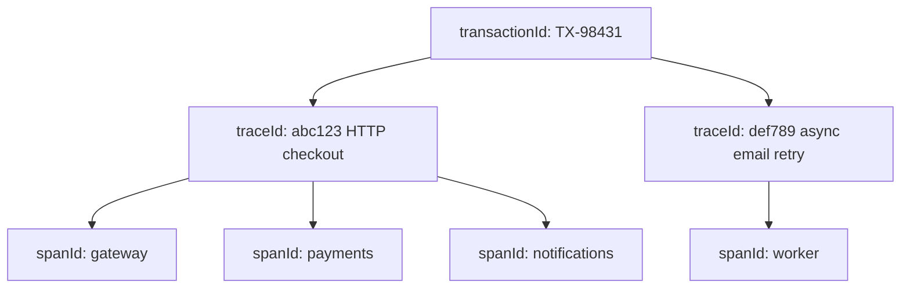
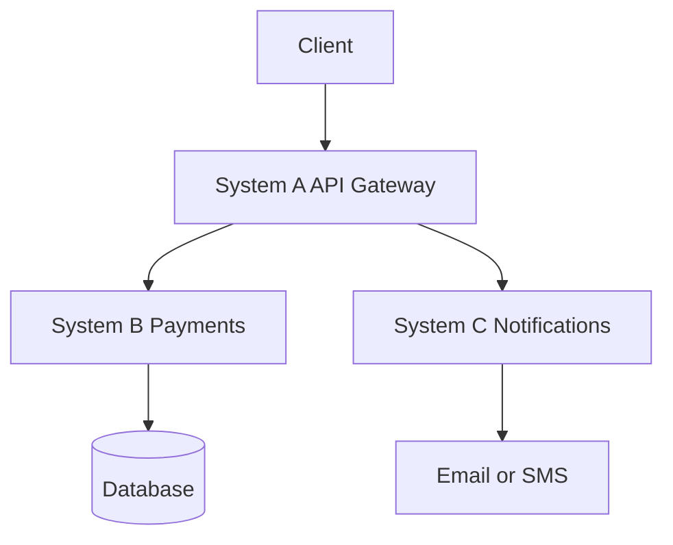
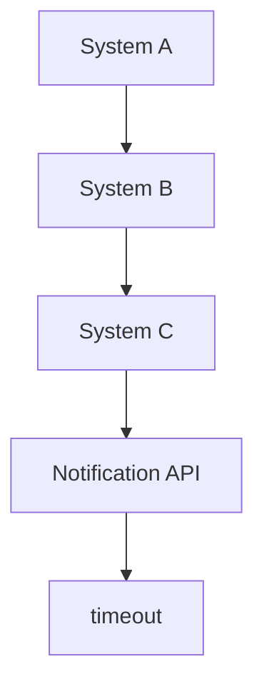
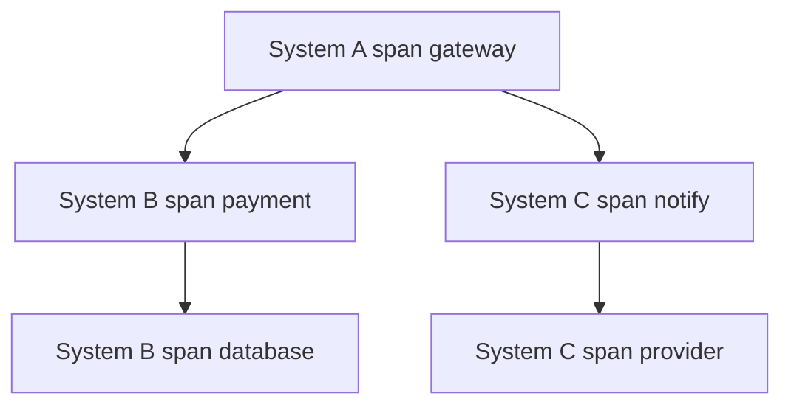
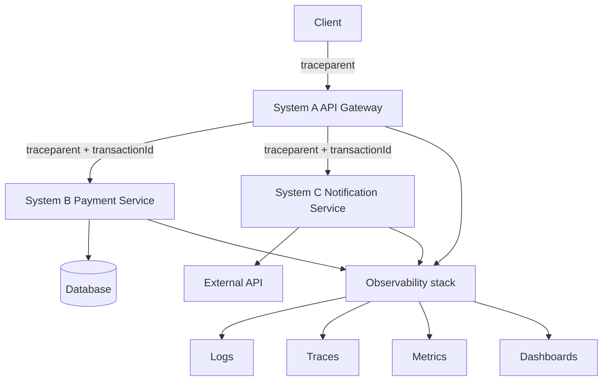
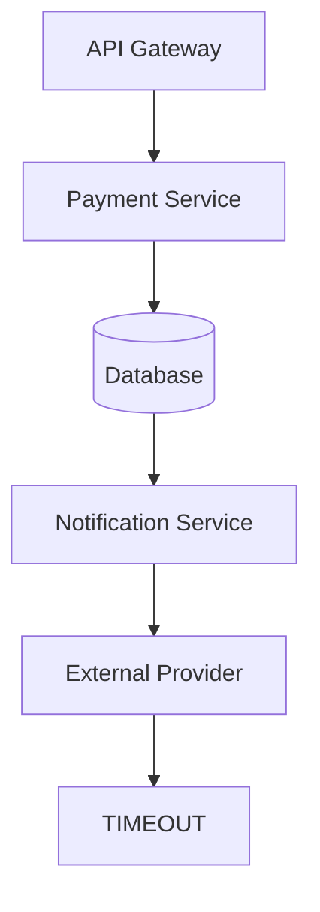

The payment succeeded. The confirmation email never arrived. Three services wrote "done" or "failed" into three log buckets, and nobody can prove the same user request produced all three lines.

That is not a logging shortage. It is a missing execution identity.

When an operation starts in System A and later calls System B and System C, you must be able to follow that same operation end to end and say exactly what happened in each component. More `console.log` lines will not do that. A shared context will.

You do not need more logs. You need a reconstructable request.

How to bind `transactionId` onto NestJS logs — and propagate it over HTTP and Pub/Sub without threading it through every method — is in [Structured logging in NestJS](/blog/structured-logging-transaction-ids-nestjs/).

## These identifiers are not the same thing

Teams collapse every ID into "the correlation id" and then wonder why search still returns noise. The names look related. The jobs are not.

| Identifier      | What it identifies                                         | Typical lifetime                                         |
| --------------- | ---------------------------------------------------------- | -------------------------------------------------------- |
| `transactionId` | A business operation: charge this card, fulfill this order | Survives retries, workers, and sometimes multiple traces |
| `applicationId` | Which application or service emitted the event             | Stable per deployable                                    |
| `requestId`     | One inbound HTTP (or RPC) request at one hop               | Often local to a single service                          |
| `correlationId` | A proprietary "this conversation" token                    | Whatever your team invented                              |
| `traceId`       | One distributed execution                                  | One causal graph of spans                                |
| `spanId`        | One unit of work inside that execution                     | One hop, query, or outbound call                         |

```text
transactionId
      │
      └── Identifies a business operation

traceId
      │
      └── Identifies a distributed execution

spanId
      │
      └── Identifies a unit of work inside that execution

service / application
      │
      └── Identifies who is processing the operation
```

A `transactionId` answers "which payment?" A `traceId` answers "which run through the system?" A `spanId` answers "which piece of work inside that run?" The service name answers "who was holding the request when this line was written?"

Do not assume `transactionId === traceId`. A checkout can start one synchronous trace at the API, then a worker can open a **second** trace when it retries the email an hour later. Both traces should still carry `TX-98431`. Only the first one is the original HTTP execution.

`requestId` is useful at a gateway. It is a weak substitute for a trace. The next service that generates its own UUID has already broken the chain.

`correlationId` is the pre-standard answer: put a UUID on `X-Correlation-Id` and hope every hop forwards it. It can work inside one company. It does not tell a span who its parent is, it does not encode a sampling decision, and the next vendor you integrate will not speak your header.

`applicationId` is not a request identifier at all. It tells you which binary produced the line. Without it, a shared `traceId` is a pile of events with no owner.



One business operation. Two executions. Several units of work. If you store only `TX-98431`, you can find the payment. You still cannot draw the call graph.

## Prefer W3C Trace Context over a house format

W3C Trace Context exists because every vendor invented a header, and traces died at the first boundary they did not own. The specification standardizes two HTTP headers so platforms, proxies, and tracing backends can forward the same identity.

`traceparent` is the portable, fixed-length header. It has four fields:

```text
{version}-{trace-id}-{parent-id}-{trace-flags}
```

The specification's own example:

```text
traceparent: 00-0af7651916cd43dd8448eb211c80319c-b7ad6b7169203331-01
```

- **version** — currently `00`. `ff` is invalid.
- **trace-id** — 16 bytes, 32 lowercase hex characters. All zeros are invalid. This is the ID of the whole trace forest.
- **parent-id** — 8 bytes, 16 lowercase hex characters. This is the caller's span. Tracing systems also call it `span-id`. All zeros are invalid.
- **trace-flags** — 8 bits. In version `00`, the least significant bit is **sampled**: the caller may have recorded trace data.

When a service participates, it keeps the same `trace-id` and writes a **new** `parent-id` for the span it is about to send downstream. That is how a tree forms. The incoming `parent-id` becomes the parent of the local span.

`tracestate` is the vendor sidecar: a list of `key=value` pairs. Storing data there is optional. Forwarding the header is not. A hop that does not understand `rojo=00f067aa0ba902b7` must still send it on. That is how two tracing vendors can share one `trace-id` without dropping each other's metadata.

OpenTelemetry's default propagator is this pair of headers. Cloud platforms that care about interoperability speak it. A custom `X-My-Request-Id` does not.

You can still carry `transactionId` as an application field, a baggage entry, or a message attribute. Do not replace `traceparent` with it. Business identity and execution identity solve different queries.

## A payment that also sends a notification

The user action is ordinary: charge the card and send a confirmation.



One operation produces several events. If every service writes the same `transactionId` and `traceId`, those events become one story:

```text
System A
transactionId=TX-98431
traceId=abc123
message="Payment request received"

System B
transactionId=TX-98431
traceId=abc123
message="Payment processing started"

System B
transactionId=TX-98431
traceId=abc123
message="Payment completed"

System C
transactionId=TX-98431
traceId=abc123
message="Notification sent"
```

The `spanId` values differ. System A owns the root span. System B creates a child for the charge and another for the database write. System C creates a child for the provider call. The `traceId` is the join key. The `transactionId` is how finance will ask about the same payment next week, after the trace has aged out of the backend.

Now the provider times out.



An engineer searches `traceId = abc123` and reconstructs the run:

```text
09:41:02  System A  request received
09:41:03  System B  payment started
09:41:04  System B  payment completed
09:41:05  System C  notification started
09:41:15  System C  ERROR timeout
```

That timeline answers the questions that actually matter at 3 a.m.:

- Where did the operation fail?
- Which service emitted the error?
- How long did each component take?
- Did the request reach System C at all?
- Was the failure ours, or an external dependency?
- Which other operations share the same blast radius?
- What was the full path of the request?

Without the shared `traceId`, you are aligning clocks across three log stores and hoping the timestamps are honest. With it, the path is a query.



Same `traceId`. Different `spanId` on every box. Latency lives on the edges. The timeout lives on the last span, not on the payment.

## Logging is not observability

Saving logs is not the same as having observability.

Traditional logs record that something happened, in a dialect only a human can parse:

```text
Payment completed
Notification failed
Database timeout
Request received
```

Those lines cannot be filtered by service, joined to a trace, or aggregated without regular expressions that rot the first time someone rewords a message. They also cannot tell you whether "Notification failed" belongs to `TX-98431` or to the request sitting next to it.

Structured, correlated logs record a fact you can query:

```json
{
  "timestamp": "2026-08-14T09:41:15.102Z",
  "severity": "ERROR",
  "service": "notification-service",
  "traceId": "abc123",
  "spanId": "def456",
  "transactionId": "TX-98431",
  "message": "Notification provider timeout"
}
```

Structured logging buys you:

- **Search** — `transactionId=TX-98431` is an equality, not a grep.
- **Filtering** — severity, service, environment, and version are fields.
- **Aggregation** — count timeouts by provider without parsing English.
- **Correlation** — the same `traceId` joins logs to spans.
- **Automated analysis** — alerting and anomaly jobs consume JSON, not prose.
- **Observability integration** — backends already know `trace` and `spanId`.
- **Troubleshooting** — one query reconstructs the path.
- **Technical audit** — you can show what the system did, not what a string implied.

A log line without a `traceId` is an orphaned event. It happened. You will not prove to whom.

## Cloud Run: traces you get, correlation you still have to write

Google Cloud Run is a useful concrete case because the platform does part of the work and leaves the rest to you. The split is easy to miss.

Incoming requests to a Cloud Run **service** automatically generate traces in Cloud Trace. Cloud Run also populates the W3C `traceparent` header on those requests. You can inspect request latency in Cloud Trace without adding a library.

That automatic trace is not a full distributed picture.

- Cloud Run does **not** sample every request. The documented maximum is 0.1 requests per second per instance (one request every 10 seconds). Forced traces have a higher cap. You cannot configure that sample rate.
- Automatically generated Cloud Run traces, sampled or forced, do not incur Cloud Trace charges. Spans you add with Cloud Trace libraries, correlated onto those platform spans, **do** incur standard Cloud Trace billing.
- You need your own instrumentation to create custom spans (a database query, a provider call) and to **propagate** context so Cloud Trace shows multiple services as one request. Auto-traces on A and C without propagation are two trees, not one.

Google Cloud services that propagate context typically accept both `traceparent` and the older `X-Cloud-Trace-Context` header. The documented recommendation is to prefer `traceparent` and keep the legacy header as a fallback.

```text
X-Cloud-Trace-Context: TRACE_ID/SPAN_ID;o=OPTIONS
```

`TRACE_ID` is 32 hex characters. `SPAN_ID` is a 64-bit **decimal** span id — not the hex form used in `traceparent`. `o=0` means the parent was not sampled; `o=1` means it was.

Cloud Logging will nest container logs under the request log in Logs Explorer when they share the same `trace` field. That parent-child view is **not** automatic if you only write text to stdout. It happens if you use a Cloud Logging client library, or if you emit a structured JSON line that sets `logging.googleapis.com/trace`. The official Cloud Run sample still extracts the id from `X-Cloud-Trace-Context`. Prefer `traceparent` when it is present; the sample is showing the legacy path that still works.

Special JSON fields that Cloud Logging lifts onto the `LogEntry` are the ones that actually join signals:

| JSON field                             | LogEntry field | Role                                       |
| -------------------------------------- | -------------- | ------------------------------------------ |
| `logging.googleapis.com/trace`         | `trace`        | Join key to Cloud Trace                    |
| `logging.googleapis.com/spanId`        | `spanId`       | 16-character hex span                      |
| `logging.googleapis.com/trace_sampled` | `traceSampled` | Whether this trace was sampled for storage |

The preferred value for `trace` is the raw `TRACE_ID`. The resource name `projects/PROJECT_ID/traces/TRACE_ID` is a legacy form that Logs Explorer and Trace Explorer still accept. Cloud Run's own sample uses the resource name.

`traceSampled: false` is still a valid correlation id. The [LogEntry](https://cloud.google.com/logging/docs/reference/v2/rest/v2/LogEntry) documentation is explicit: a non-sampled `trace` remains useful for joining logs even when the span was never stored in Cloud Trace. Do not treat "no waterfall in Cloud Trace" as "the request never happened."

### A conceptual Node.js logger

This is architecture, not a starter kit. In production you would let OpenTelemetry create spans and a logger bind the active context. The point is the payload you must emit.

```ts
type Severity = "DEBUG" | "INFO" | "NOTICE" | "WARNING" | "ERROR" | "CRITICAL";

type LogFields = {
  service: string;
  environment: string;
  transactionId?: string;
  applicationId: string;
  requestId?: string;
  severity: Severity;
  message: string;
};

type TraceContext = {
  traceId: string;
  spanId: string;
  sampled: boolean;
};

function parseTraceparent(header?: string): TraceContext | undefined {
  if (!header) return undefined;
  const [version, traceId, parentId, flags] = header.split("-");
  if (version !== "00" || !traceId || !parentId || !flags) return undefined;
  if (traceId.length !== 32 || parentId.length !== 16) return undefined;
  return {
    traceId,
    spanId: parentId,
    sampled: (parseInt(flags, 16) & 0x01) === 0x01,
  };
}

function parseCloudTraceContext(header?: string): TraceContext | undefined {
  if (!header) return undefined;
  const [traceAndSpan, options] = header.split(";");
  const [traceId, spanDecimal] = traceAndSpan.split("/");
  if (!traceId || traceId.length !== 32) return undefined;
  const spanId = BigInt(spanDecimal ?? "0")
    .toString(16)
    .padStart(16, "0");
  return {
    traceId,
    spanId,
    sampled: options === "o=1",
  };
}

function writeLog(
  fields: LogFields,
  headers: { traceparent?: string; cloudTrace?: string },
  projectId: string,
) {
  const ctx = parseTraceparent(headers.traceparent) ?? parseCloudTraceContext(headers.cloudTrace);

  const entry = {
    service: fields.service,
    environment: fields.environment,
    transactionId: fields.transactionId,
    applicationId: fields.applicationId,
    requestId: fields.requestId,
    severity: fields.severity,
    message: fields.message,
    ...(ctx && {
      traceId: ctx.traceId,
      spanId: ctx.spanId,
      "logging.googleapis.com/trace": `projects/${projectId}/traces/${ctx.traceId}`,
      "logging.googleapis.com/spanId": ctx.spanId,
      "logging.googleapis.com/trace_sampled": ctx.sampled,
    }),
  };

  console.log(JSON.stringify(entry));
}
```

The incoming `parent-id` is the caller's span. A real tracer would create a **new** `spanId` for local work and put that new id on outbound `traceparent`. Reusing the inbound span on every line still correlates logs to the request. It does not give you a useful span tree.

Carry `transactionId` in the JSON. Do not invent a second propagation header for it if `traceparent` already crosses the hop.

## How the identifiers travel



`traceparent` is the execution passport. `transactionId` is cargo. Each service reads the incoming `trace-id`, starts a new span, and forwards an updated `traceparent`. Logs, traces, and metrics only become one system when they share that `trace-id`. Dashboards that cannot filter on it are wallpaper.

## Google Cloud, AWS, and Azure are not the same product

Do not translate field names as if the platforms were aliases. The job is the same: follow a request. The identifiers, headers, and join mechanisms are not.

| Concept             | Google Cloud                                                                     | AWS                                                                   | Azure                                                     |
| ------------------- | -------------------------------------------------------------------------------- | --------------------------------------------------------------------- | --------------------------------------------------------- |
| Distributed tracing | Cloud Trace                                                                      | AWS X-Ray                                                             | Azure Monitor / Application Insights                      |
| Trace identifier    | `trace` on `LogEntry`; W3C `trace-id`                                            | X-Ray trace ID (`Root=…`)                                             | `operation_Id` / W3C `trace-id`                           |
| Context propagation | W3C `traceparent` (preferred) and legacy `X-Cloud-Trace-Context`                 | `X-Amzn-Trace-Id`; W3C ids accepted at ingest after format conversion | W3C Trace Context; older `Request-Id` is being deprecated |
| Log correlation     | Cloud Logging `trace` / `spanId` / `traceSampled`; parent-child in Logs Explorer | CloudWatch logs joined when the X-Ray trace id is present in the log  | Application Insights telemetry sharing `operation_Id`     |

**Google Cloud.** Cloud Trace stores the waterfall. Cloud Logging stores the lines. You join them by writing `trace` (and preferably `spanId`) on the log entry. Logs Explorer can then nest container logs under the request log. Propagation across your own services is still your job: Cloud Run will start a trace and set `traceparent` on the inbound request; it will not, by itself, stitch A → B → C into one tree.

**AWS X-Ray.** X-Ray receives **segments** from each compute resource, groups segments that share a request into a **trace**, and builds a **service graph**: nodes for services, edges for the calls between them. A trace ID tracks the path of one request. The native header is `X-Amzn-Trace-Id`:

```text
X-Amzn-Trace-Id: Root=1-5759e988-bd862e3fe1be46a994272793;Parent=53995c3f42cd8ad8;Sampled=1
```

The classic X-Ray id is `1-{8 hex epoch}-{24 hex}`. X-Ray also accepts trace ids created by OpenTelemetry and other W3C Trace Context implementations, but they must be sent in X-Ray form. A W3C id `4efaaf4d1e8720b39541901950019ee5` becomes `1-4efaaf4d-1e8720b39541901950019ee5` at ingest. The first eight hex characters are **not** required to be a timestamp when the id originated as W3C.

That is not the same as "X-Ray speaks `traceparent` on every AWS-integrated hop." Many AWS services still propagate `X-Amzn-Trace-Id`. If you instrument with OpenTelemetry, you often need the X-Ray propagator for those hops, even if your own HTTP services already emit W3C headers.

X-Ray sampling is separate from Cloud Run's. The X-Ray SDK default is conservative: the first request each second, then five percent of the rest, unless you change the rules.

**Azure Monitor / Application Insights.** Every telemetry item carries `operation_Id`. Items that belong to the same distributed operation share it, so you can still group a request if one layer dropped data. Causality uses `operation_Id`, `operation_ParentId`, and the request/dependency `id` fields.

When the SDK is on W3C Trace Context, the mapping is explicit:

| Application Insights            | W3C Trace Context                                       |
| ------------------------------- | ------------------------------------------------------- |
| `Operation_Id`                  | `trace-id`                                              |
| `Id` of a request or dependency | `parent-id`                                             |
| `Operation_ParentId`            | `parent-id` of this span's parent; empty on a root span |

Microsoft documents that Application Insights is transitioning to W3C, and that the older correlation protocol (`Request-Id` / `Correlation-Context`) is being deprecated. For new applications, the documented path is the Azure Monitor OpenTelemetry Distro, not the classic SDK as a first choice. Browser-side header injection is configurable (`distributedTracingMode`, CORS correlation) and is not implicit for every cross-origin call.

Three backends. Three ways to say "this is the same request." The portable contract between them is still `traceparent`.

## Best practices for designing logs in distributed systems

1. **Use structured logging.** One JSON object per event. Fields you will query must be fields, not English.
2. **Propagate tracing context.** If A called B, B must see A's `traceparent`. Logs cannot reconstruct a hop that never received the header.
3. **Use W3C Trace Context.** Do not invent `X-Company-Trace` unless you are also willing to translate it at every edge.
4. **Keep one `traceId` for the whole execution.** New ids at each service are how traces fragment.
5. **Generate a new `spanId` for each unit of work.** Reusing the inbound span hides latency and parentage.
6. **Keep business identifiers such as `transactionId` when they add value.** They answer product questions that a hex trace id will not.
7. **Include the service name on every line.** A shared `traceId` without an owner is still a scavenger hunt.
8. **Include environment and version or deployment when it matters.** "Works in staging" is a different binary.
9. **Use severity correctly.** `ERROR` is a failed unit of work, not a missing optional field. `DEBUG` is not a production firehose.
10. **Do not log sensitive data.** Tokens, full card PANs, session cookies, and raw PII do not belong in a queryable store.
11. **Avoid logs that are only noise.** Health checks at `INFO` on every instance will bury the timeout.
12. **Do not rely on unstructured text.** `Notification failed` is not an API.
13. **Do not run parallel proprietary correlation schemes** unless a boundary truly cannot speak W3C. Two ids that sometimes match is worse than one that always does.
14. **Treat logs, metrics, and traces as one observability strategy.** A dashboard without a `traceId`, a trace without logs, and a counter without exemplars are three partial systems.

## Hypothetical production case

This is a **hypothetical production incident**, not a public postmortem.

A client calls an API. The backend on Cloud Run accepts the request, calls a payment service, then a notification service, then an external provider. The HTTP response is 200. The charge is in the database. The user never gets the SMS.

Without correlation, the on-call rotation asks "what happened?" and opens three Cloud Run services, a payment log sink, and a vendor dashboard. They align timestamps by hand. They cannot prove the notification service received **this** payment rather than the one a second later. MTTR is the time it takes a human to reconstruct a graph that the system already traversed.

With structured logs and a propagated trace, the query is two fields:

```text
traceId = 4bf92f3577b34da6a3ce929d0e0e4736
transactionId = TX-982341
```



The payment spans are clean. The provider span is a 10-second timeout. The `transactionId` lets support talk to the customer in business language. The `traceId` lets engineering talk to the vendor with a causal chain, not a screenshot of "Notification failed."

That is the MTTR difference: Mean Time To Recovery drops when the path is a filter, not an investigation.

If the email is sent later by a worker, that worker is a new `traceId` and the same `TX-982341`. Search the business id for the week. Search the trace id for the minute.

## You need the path, not another line

A distributed operation is a graph. Logs are nodes. Traces are the edges. Metrics tell you how often the graph is sick. None of that works if every service invents its own identity for the same request.

`transactionId` is the business object. `traceId` is the execution. `spanId` is the step. The service name is the speaker. W3C `traceparent` is how those execution ids survive a hop you do not own.

After that, adding another log line is cheap. Reconstructing the request is the actual design.

## Sources

- [W3C Trace Context](https://www.w3.org/TR/trace-context-1/)
- [OpenTelemetry traces](https://opentelemetry.io/docs/concepts/signals/traces/)
- [OpenTelemetry context propagation](https://opentelemetry.io/docs/concepts/context-propagation/)
- [Using distributed tracing — Cloud Run](https://docs.cloud.google.com/run/docs/trace)
- [Logging and viewing logs in Cloud Run](https://docs.cloud.google.com/run/docs/logging)
- [Trace context — Cloud Trace](https://docs.cloud.google.com/trace/docs/trace-context)
- [Structured logging — Cloud Logging](https://docs.cloud.google.com/logging/docs/structured-logging)
- [Link log entries with traces — Cloud Trace](https://cloud.google.com/trace/docs/trace-log-integration)
- [LogEntry — Cloud Logging API](https://cloud.google.com/logging/docs/reference/v2/rest/v2/LogEntry)
- [AWS X-Ray concepts](https://docs.aws.amazon.com/xray/latest/devguide/xray-concepts.html)
- [Sending trace data to AWS X-Ray](https://docs.aws.amazon.com/xray/latest/devguide/xray-api-sendingdata.html)
- [AWS X-Ray segment documents](https://docs.aws.amazon.com/xray/latest/devguide/xray-api-segmentdocuments.html)
- [Application Insights telemetry data model](https://learn.microsoft.com/en-us/azure/azure-monitor/app/data-model-complete)
- [Application Insights JavaScript SDK configuration — W3C mapping](https://learn.microsoft.com/en-us/azure/azure-monitor/app/javascript-sdk-configuration)
- [Enable Azure Monitor OpenTelemetry](https://learn.microsoft.com/en-us/azure/azure-monitor/app/opentelemetry-enable)
