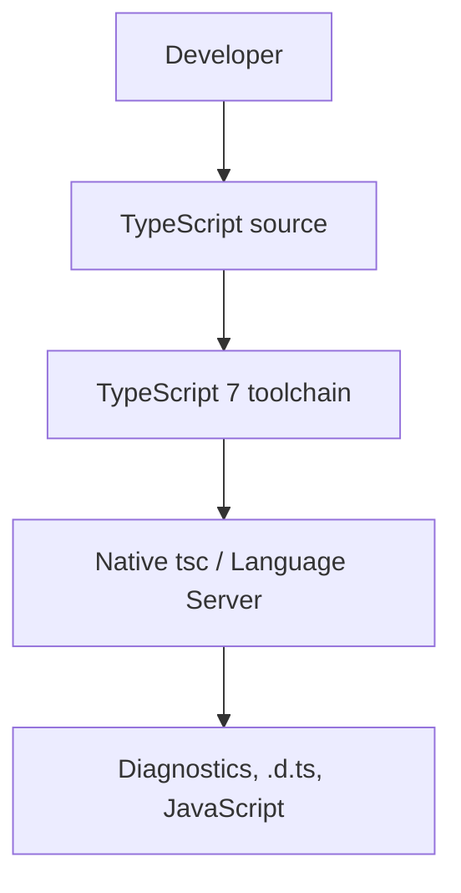
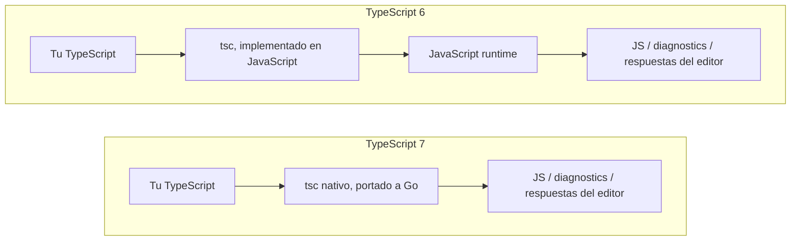
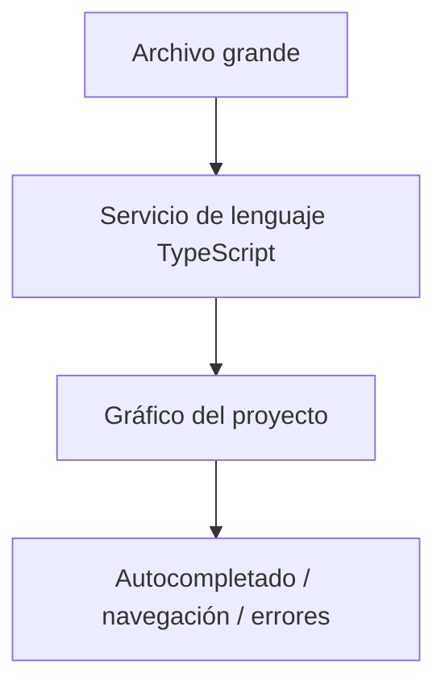
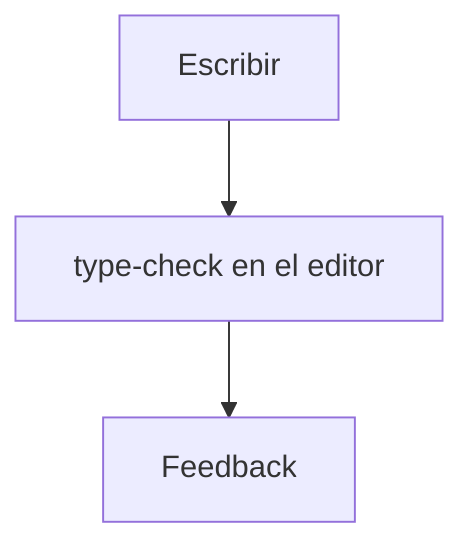
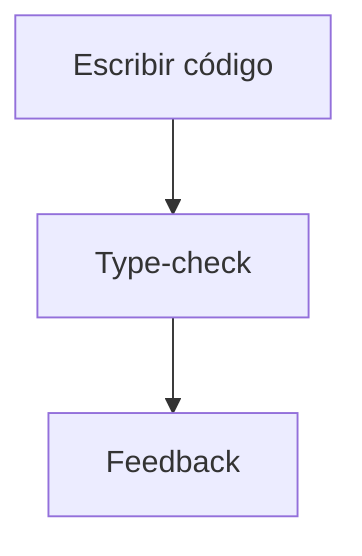

Un proyecto TypeScript pequeño compila en unos segundos. Luego el repo crece. `tsc` empieza a sentirse como un impuesto. Abrir un workspace grande tarda tanto que la gente espera a CI en vez de al editor. IntelliSense se queda atrás. Un cambio de un archivo en un monorepo sigue pagando mucho type-checking. El portátil ruge. El job de CI se queda en «type-check» mientras el resto del pipeline ya está listo.

Nada de eso es un problema de lenguaje nuevo. Los tipos siguen significando lo mismo. El cuello de botella es el toolchain que tiene que cargar, comprobar y servir ese TypeScript cada día.

TypeScript 7, estable desde el 8 de julio de 2026, es la respuesta de Microsoft a ese cuello de botella. El lenguaje que escribes no se convirtió en Go. El compilador y el language service que procesan tu TypeScript sí: se portaron desde la implementación histórica en JavaScript a un ejecutable nativo. El [anuncio de Microsoft](https://devblogs.microsoft.com/typescript/announcing-typescript-7-0/) describe el trabajo como un port fiel — código nuevo que conserva la estructura y las reglas de checking del compilador existente — no como una reescritura desde cero.

> No estás aprendiendo otro TypeScript. Estás ejecutando las mismas ideas de TypeScript sobre una infraestructura que sí puede aprovechar una máquina moderna.

La pregunta de este artículo es: **qué cambia de verdad con TypeScript 7, y por qué debería importarte si ya entregas TypeScript en producción.**

## Cómo corría el compilador anterior

Hasta TypeScript 6, `tsc` y el language service del editor eran un codebase TypeScript que compilaba a JavaScript y corría sobre un motor JavaScript. Esa es la historia del bootstrap: TypeScript compilaba TypeScript. Durante más de una década, fue la decisión acertada. El equipo podía distribuir el compilador de la misma manera que el ecosistema distribuía todo lo demás, y cualquier cambio del type checker podía escribirse en el lenguaje que implementaba.

También tenía un coste. Un proceso JavaScript arranca más lento que un binario nativo. Gasta más memoria en el mismo grafo de archivos y tipos. Y el compilador histórico no usaba el tipo de paralelismo de memoria compartida que un check grande puede aprovechar en un portátil de 8 o 16 cores. En un repo de juguete no lo notabas. En VS Code, Sentry o un monorepo NestJS con project references, lo notabas cada mañana.

`tsc` no es «solo un paso de build». Es el programa que decide si el repo está bien tipado, el que emite `.d.ts` y JavaScript cuando se lo pides, y — a través del language service — el que responde «qué es este símbolo» mientras escribes. Cuando ese programa es lento, todo el ecosistema TypeScript se siente lento: editores, CI, `tsc --build` y cada herramienta que esperaba al mismo check.

TypeScript 6 es el último release de esa implementación en JavaScript. Microsoft la trató como un puente: deprecations y defaults nuevos alineados con TypeScript 7, más una línea de compatibilidad (`@typescript/typescript6`) para herramientas que todavía necesitan la API antigua. No hay TypeScript 6.1. El [anuncio de 6.0](https://devblogs.microsoft.com/typescript/announcing-typescript-6-0/) es el sitio para leer los cambios de config. TypeScript 7 es el cambio de infraestructura.

## Qué cambió en TypeScript 7

Microsoft portó el compilador y el language service a [Go](https://go.dev/). El resultado es un `tsc` nativo. Sigues instalando el paquete `typescript` y sigues ejecutando `npx tsc`. El binario ya no es un programa Node.js.

```sh
npm install -D typescript
npx tsc --version
```

Go es cómo Microsoft construye ese binario. No es un lenguaje en el que escribas tu app, y no es un runtime que cargue tu proceso de producción. Tu aplicación sigue siendo TypeScript. Sigue comprobándose como TypeScript. Sigue emitiendo JavaScript (o sigues dejando que lo haga un bundler). Go está al otro lado del toolchain:



Un diagrama que pone «Go» entre tu código y el output está ligeramente mal. Go es un detalle de compilación **de la herramienta**, igual que C++ es un detalle de compilación de `node`. No ejecutas Go cuando haces type-check de un servicio NestJS.



El language service se movió con el compilador. Completions, errores, Go to Definition, Find All References, Rename, Quick Info, Signature Help y quick fixes los sirve un servidor nativo que habla [Language Server Protocol](https://microsoft.github.io/language-server-protocol/). VS Code tiene una extensión de TypeScript 7; Visual Studio activa TypeScript 7 según el workspace. Otros editores que ya hablan LSP pueden usar el mismo servidor. Eso es un cambio de tooling, no de lenguaje.

No necesitas aprender Go para actualizar. Necesitas saber que el programa detrás de `tsc` y del editor es ahora un proceso nativo, y que algunas superficies del ecosistema — la API antigua del compilador, ciertos plugins del language service, lenguajes embebidos — todavía están poniéndose al día. Eso va más adelante. El código de la aplicación no es la migración.

## Por qué Go — y por qué eso no es todo el speedup

«Lo reescribieron en Go, por eso es 10× más rápido» es la historia causal equivocada.

La primera decisión, como la ha contado [Anders Hejlsberg](https://commandline.microsoft.com/typescript-7-0-anders-hejlsberg-peterman-pod/), fue **portar, no reescribir**. Un compilador green-field habría sido otro type checker: otros errores, otros edge cases, años de trabajo de compatibilidad. El checker existente es un grafo de funciones y estructuras cíclicas — árboles con punteros al padre, tipos recursivos. Ese codebase asume garbage collection y funciones de primera clase. Go es un lenguaje nativo, con GC, concurrencia de memoria compartida razonable y un estilo que encajaba en ese codebase. El borrow checker de Rust encaja mal con esos ciclos. Eso es un argumento de portabilidad, no una guerra de lenguajes.

El código nativo es solo una de las cuatro cosas que Microsoft está apilando:

1. Un ejecutable nativo en lugar de un proceso JavaScript.
2. Trabajo en paralelo en parse, check y emit.
3. Paralelismo de memoria compartida, para que los workers no sean procesos aislados que copian el mundo.
4. Una arquitectura de tooling que usa más de un core a propósito: `--checkers`, `--builders`, un `--watch` reconstruido, un servidor LSP que puede atender más de una petición a la vez.

Hejlsberg ha dicho que, en mediciones tempranas, más o menos la mitad de la ganancia venía de ser nativo y la otra mitad de la concurrencia. El anuncio de 7.0 no restablece ese split como métrica de producto. Dice que TypeScript 7 combina velocidad nativa, multithreading de memoria compartida y más optimizaciones, y que los full builds suelen caer entre **8× y 12×** frente a TypeScript 6 en sus runs. Trata «Go» como el lenguaje de implementación que hizo práctico el port y el paralelismo — no como un multiplicador mágico de 10×.

## Qué tan rápido — y cuánta memoria

Microsoft publicó los números de 7.0 en la misma máquina, TypeScript 6 frente a TypeScript 7, con el default de **cuatro** workers de type-checking (`--checkers 4`):

| Codebase   | TypeScript 6 | TypeScript 7 | Speedup |
| ---------- | -----------: | -----------: | ------: |
| vscode     |       125.7s |        10.6s |   11.9× |
| sentry     |       139.8s |        15.7s |    8.9× |
| bluesky    |        24.3s |         2.8s |    8.7× |
| playwright |        12.8s |        1.47s |    8.7× |
| tldraw     |        11.2s |        1.46s |    7.7× |

Esos son tiempos de full build de Microsoft, no una promesa de que tu app NestJS baje de dos minutos a diez segundos. Un proyecto más pequeño tiene menos trabajo que paralelizar. Un repo que ya gastaba la mayor parte del tiempo en un bundler no se va a parecer a vscode. Un runner de CI con dos cores y 4 GB no se va a parecer a la máquina que produjo esa tabla.

Subir `--checkers` a 8 en esa misma máquina dejó vscode en 7.51s (**16.7×**), sentry en 12.08s (**11.6×**), bluesky en 2.01s (**12.1×**). Más checkers también usan más memoria. En un runner más limitado, Microsoft sugiere bajar el número — `--checkers 1` hace que la verificación sea prácticamente de un solo hilo — o pasar `--singleThreaded` para apagar también el parse y el emit en paralelo.

La memoria en esos mismos runs de 7.0 es menor, no «la mitad»:

| Codebase   | TypeScript 6 | TypeScript 7 | Delta |
| ---------- | -----------: | -----------: | ----: |
| vscode     |        5.2GB |        4.2GB |  −18% |
| sentry     |        4.9GB |        4.6GB |   −6% |
| bluesky    |        1.8GB |        1.3GB |  −26% |
| playwright |        1.0GB |        0.9GB |  −11% |
| tldraw     |        0.6GB |        0.5GB |  −15% |

Un post anterior del port nativo (marzo de 2025) decía que la memoria del editor se veía «más o menos la mitad» antes de haberla optimizado. La tabla de 7.0 es el retrato oficial actual: ahorros agregados modestos en un full build, con un trade-off si subes `--checkers` o `--builders`. La memoria sigue importando. Un portátil con el editor, `tsc --watch`, un proceso Next.js o NestJS y Docker no es la caja del benchmark de vscode. Un runner de GitHub Actions que mata `tsc` por OOM no le importa que el mismo check sea más rápido en 64 GB. `--singleThreaded` y un `--checkers` más bajo existen para ese entorno.

La carga del editor es el número que más gente va a sentir primero. En el codebase de VS Code, Microsoft reporta que el tiempo desde abrir el editor hasta ver el primer error como unos **17.5s --> menos de 1.3s** — más de 13× en ese proyecto. También informan que el nuevo servidor de lenguaje falló un **80 % menos** de comandos y se crasheó un **60 % menos** que el servidor de TypeScript 6, según sus datos de telemetría.

Empresas que probaron 7.0 con Microsoft, citadas en el anuncio:

- Slack: alrededor del **40%** del tiempo de merge queue fuera; type-check en CI de unos **7.5 minutos --> 1.25 minutos**. La carga local del editor había estado cerca de ser inutilizable; TypeScript 7 cargaba el mismo árbol en unos segundos.
- Canva: primer error en el editor de unos **58s --> 4.8s**.
- Vanta: hasta **9×** en uno de sus proyectos más grandes.
- Microsoft News Services: se eliminaron aproximadamente **400 horas mensuales** de espera de CI.

Son resultados reportados en codebases concretos, no un multiplicador que puedas pegar en tu pipeline.

## El cambio que vas a notar: el editor

La mayor parte de un día TypeScript no es `npx tsc`. Es esperar a lo que hay bajo el cursor.



IntelliSense, auto-import, Go to Definition, Go to Type Definition, Find All References, Rename, Quick Info, Signature Help, quick fixes, call hierarchy — todo eso es el language service respondiendo una pregunta contra el mismo programa que comprueba `tsc`. Si ese programa tarda decenas de segundos en cargar, la primera tecla en un archivo grande llega tarde. Si Find All References recorre un grafo de un millón de líneas en un solo hilo JavaScript, dejas de usarlo y usa grep en su lugar.

Un `tsc` más rápido en CI es un build rojo más corto. Un language service más rápido es un loop más corto en cada edit:



Por eso Microsoft dedicó tanto del port al language service como al CLI, y por eso se pasaron a LSP. El servidor nuevo puede usar varios hilos para peticiones concurrentes. En VS Code, la extensión de TypeScript 7 pasa a ser el default al instalarla; puedes desactivarla desde la command palette si un plugin o un lenguaje embebido todavía necesita TypeScript 6. Visual Studio sigue al workspace. En las semanas posteriores a 7.0, Microsoft dijo que TypeScript 7 se incluiría como parte del propio VS Code.

Si tu dolor hoy es «el editor parece muerto hasta que carga el proyecto», esa es la feature de TypeScript 7, no una sintaxis nueva.

## Proyectos grandes, monorepos y CI

Los proyectos que más pagaron por TypeScript 6 son los que tienen muchos archivos, tipos pesados y un grafo de paquetes: un backend NestJS con project references, una app Next.js más UI compartida, un design system React, un workspace Nx o Turborepo donde un cambio de tipos se propaga.

Qué puede salir más barato:

- **Type-check.** `tsc --noEmit` o la task equivalente de Nx/Turborepo suele ser el nodo lento de CI. El 7.5 --> 1.25 minutos de Slack es ese nodo, no «todo el deploy».
- **`--build` y project references.** TypeScript 7 puede comprobar dentro de un proyecto en paralelo y puede construir **más de un proyecto referenciado a la vez**. `--builders` fija cuántos de esos builds corren juntos. Se multiplica con `--checkers`: `--checkers 4 --builders 4` puede significar hasta 16 checkers. Microsoft avisa de que eso puede ser excesivo. El grafo de dependencias sigue serializando lo que tiene que serializar, salvo que uses `--isolatedDeclarations` y un emit de declarations aparte.
- **`--incremental`.** Rechequear un edit pequeño en un repo grande es el caso de cada día. El path incremental de 7.0 es una reimplementación, no la caché JS antigua con un binario nuevo.
- **`--watch`.** El file watching se reconstruyó sobre un port de Go del watcher de Parcel, la misma familia de watcher que VS Code ya usaba. Microsoft reporta menos uso de recursos que el watcher de TypeScript 6, sobre todo cuando `node_modules` está en el árbol.
- **Editor + `tsc` local.** Los equipos que abandonaron el type-check local porque el language service no terminaba nunca pueden devolver el loop al portátil.

Qué no se abarata solo:

- Bundling. Next.js, Vite, webpack y esbuild siguen haciendo su trabajo. TypeScript 7 no los sustituye.
- Test runners, builds de imagen Docker, pasos de deploy.
- Herramientas que todavía importa la API de TypeScript 6 (eslint, algunos plugins de Nx, herramientas de Vue / Svelte / Astro / MDX / Angular). Esas mantienen un proceso TypeScript 6 al lado de `tsc` 7 hasta que tengan API 7.x.
- Un runner de CI de dos cores que ya saturas. Los checkers en paralelo necesitan cores y RAM; si no, bajas `--checkers`.

El punto estratégico es el mismo a escala del ecosistema. TypeScript está debajo de apps de frontend, servicios NestJS, CLIs, librerías, monorepos, IDEs y CI. Acelerar el compilador y el language service quita un cuello de botella que esas herramientas comparten. TypeScript 7 no intenta inventar una feature de lenguaje para que escribas código distinto. Intenta que el toolchain deje de ser lo que no escala cuando el repo sí lo hace.

## Qué no cambia en tu TypeScript

Esto sigue comprobándose igual:

```ts
interface User {
  id: string;
  name: string;
}

const user: User = {
  id: "123",
  name: "Francisco",
};
```

Node.js, Bun, Deno y el navegador siguen ejecutando **JavaScript**. V8 (o JavaScriptCore, o el runtime que uses) no es Go. TypeScript 7 no sustituye un runtime de producción. Es un programa de desarrollo:

| Rol                     | Qué hace                                               | TypeScript 7 es esto |
| ----------------------- | ------------------------------------------------------ | -------------------- |
| Compiler / type checker | Lee `.ts`, reporta errores, opcionalmente emite JS     | Sí — `tsc` nativo    |
| Language service        | Responde preguntas del editor sobre ese mismo programa | Sí — LSP nativo      |
| Runtime                 | Ejecuta el JavaScript que entregas                     | No                   |

Si mezclas esas dos columnas, «TypeScript ahora está escrito en Go» empieza a sonar como «mi API corre en Go». No es así.

```text
Compiler / type checker     ≠     Runtime
tsc, editor LS                    node, bun, deno, browser
```

## A qué sí hay que prestar atención

La promesa de compatibilidad de Microsoft es concreta: TypeScript que compila limpio en 6.0 **con** `stableTypeOrdering` y **sin** `ignoreDeprecations` debería compilar igual en 7.0. El trabajo no es «reescribir la app». Es «los defaults del release puente ahora son de verdad, y algunas herramientas todavía hablan con el compilador viejo».

**La config que 6.0 deprecó es un error en 7.0.** Defaults notables: `strict` es `true`; `module` por defecto es `esnext`; `target` es la versión estable de ECMAScript anterior a `esnext`; `rootDir` por defecto es `./`; `types` por defecto es `[]`. Flags que ya no existen: `baseUrl`, `moduleResolution: node` / `node10`, `target: es5` y `module: amd | umd | systemjs | none`. Si `tsconfig.json` vive al lado de `src/`, pon `rootDir` explícito. Si dependías de la inclusión automática de `@types`, lístalos:

```json
{
  "compilerOptions": {
    "rootDir": "./src",
    "types": ["node", "jest"]
  },
  "include": ["./src"]
}
```

**La API antigua del compilador no está en 7.0.** Microsoft espera una API **nueva** en 7.1. Hasta entonces, `typescript-eslint` y cualquier cosa que haga `import` de `typescript` debería quedarse en TypeScript 6 vía [`@typescript/typescript6`](https://www.npmjs.com/package/@typescript/typescript6) (`tsc6` más la API 6.0). El patrón de alias npm documentado:

```json
{
  "devDependencies": {
    "@typescript/native": "npm:typescript@^7.0.2",
    "typescript": "npm:@typescript/typescript6@^6.0.2"
  }
}
```

`npx tsc` es 7.0. Las herramientas que hacen `require("typescript")` siguen viendo 6.0.

**Los lenguajes embebidos y algunos plugins del editor todavía necesitan 6.0.** Vue, MDX, Astro, Svelte y el checking de plantillas de Angular pasan por herramientas (Volar y compañía) que embeben el compilador. Sin API 7.0 se quedan en TypeScript 6. El split soportado es: TypeScript 7 para errores de `tsc` a escala de proyecto, TypeScript 6 en el editor. En VS Code, «Disable TypeScript 7 Language Server» es ese interruptor.

**El checking de JavaScript y JSDoc es más estricto.** TypeScript 7 soltó varios casos especiales solo de JS (`@enum`, `@class` como constructor, la sintaxis Closure `function(string): void`, usar un valor donde se espera un tipo). Si el repo es `.js` + JSDoc, lee la lista [CHANGES](https://github.com/microsoft/typescript-go/blob/main/CHANGES.md) de Microsoft antes de echarle la culpa al binario nativo.

**La inferencia de template literales ahora se divide por puntos de código Unicode**, no según las unidades de código UTF-16. `HeadTail<"😀abc">` pasa a ser `["😀", "abc"]`, no en un par sustituto. Las utilidades que modelaban la longitud UTF-16 a propósito cambiarán.

Nada de eso es «TypeScript 7 rompió `interface`». Es el puente 6 --> 7, más un ecosistema que durante un tiempo sigue teniendo dos compiladores.

## Qué pasó con `tsc`

| Cuándo                                  | Qué instalabas                    | Qué ejecutabas   |
| --------------------------------------- | --------------------------------- | ---------------- |
| TypeScript 6 (línea JS estable)         | `typescript@6`                    | `tsc` sobre Node |
| Previews nativos (2025–inicios de 2026) | `@typescript/native-preview`      | `tsgo`           |
| TypeScript 7 Beta                       | `@typescript/native-preview@beta` | `tsgo`           |
| TypeScript 7 RC                         | `typescript@rc`                   | `tsc` (nativo)   |
| TypeScript 7.0 estable                  | `typescript` (`7.0.x`)            | `tsc` (nativo)   |
| Nightlies después de 7.0                | `typescript@next`                 | `tsc` (nativo)   |

`tsgo` era un nombre de preview para poder sentarlo al lado del `tsc` de TypeScript 6. No es el comando estable. Ryan Cavanaugh ha dicho que el nombre `tsgo` está, en la práctica, retirado, y que el codebase nativo vuelve a `microsoft/TypeScript`. No escribas un runbook alrededor de `@typescript/native-preview` en agosto de 2026.

| Aspecto              | TypeScript 6                                          | TypeScript 7                                                 |
| -------------------- | ----------------------------------------------------- | ------------------------------------------------------------ |
| Implementación       | TypeScript compilado a JavaScript                     | Port de ese compilador a Go                                  |
| Cómo corre `tsc`     | JavaScript runtime                                    | Ejecutable nativo                                            |
| Paralelismo          | Sobre todo un proceso JS                              | Parse / check / emit en paralelo; `--checkers`, `--builders` |
| Velocidad full build | Baseline en las tablas de Microsoft                   | Típicamente ~8–12× en esos mismos runs                       |
| Memoria (full build) | Baseline                                              | Menor en la tabla de 7.0 (unos −6% a −26% ahí)               |
| Language service     | Protocolo histórico de TSServer                       | LSP, peticiones multithreaded                                |
| API programática     | La API JS existente de `typescript`                   | Ninguna en 7.0; API nueva prevista para 7.1                  |
| Reglas de type-check | Último checker JS; deprecations de 6.0 aún opcionales | Misma lógica de checker; las deprecations de 6.0 son errores |

TypeScript 6 no es un producto fallido. Es el último compilador JavaScript, y la trampilla de compatibilidad para herramientas que aún no pueden moverse. TypeScript 7 es el mismo checker en otra máquina.

## ¿Hay que migrar ahora?

No por defecto. Hazle al proyecto estas preguntas.

- ¿El repo ya compila en TypeScript 6 **sin** `ignoreDeprecations`?
- ¿Importamos la API del compilador, o eslint / Nx / un transformer custom la importa por nosotros?
- ¿Dependemos de herramientas de Vue, Svelte, Astro, MDX o Angular en el editor?
- ¿`tsc` o el language service son de verdad la parte lenta — o lo son el bundler, la suite de tests o el build de Docker?
- ¿La queja diaria es la carga del editor?
- ¿Necesitamos un toolchain aburrido y congelado más que uno más rápido este trimestre?

**Probar TypeScript 7** puede ser instalar la extensión de VS Code una semana, o correr `npx tsc` en una rama y diffear errores contra 6.0. Eso es barato.

**Migrar CI y a todo el equipo** significa pinear `typescript@7`, decidir si todavía necesitáis el alias `@typescript/typescript6`, actualizar `tsconfig` a los defaults de 6.0 y comprobar que cada paquete de un monorepo está de acuerdo. Microsoft ha estado corriendo 7.0 en repos grandes internos y externos y lo da por listo para checking en línea de comandos. «Listo para producción» no es «cada plugin en `node_modules` ya habla 7.1».

Si el problema es el editor y no embebes Vue en ese workspace, prueba primero el language server. Si el problema es el type-check de CI y eslint todavía necesita la API 6.0, usa el alias y deja que `tsc` sea 7. Si ninguno de los dos es un problema, TypeScript 6 sigue siendo una trampilla soportada. No hay premio por actualizar la semana del release.

## Para qué sirve esto

El retrato útil no es «Microsoft eligió Go». Es el loop en el que estás cada día:



Un compilador nativo acorta ese loop en el editor, en `--watch` y en CI. Los repos grandes se llevan más de la ganancia porque hay más trabajo que paralelizar y más memoria que dejar de tirar. El lenguaje puede seguir creciendo — más archivos, tipos más pesados, más paquetes, más gente — sin que la herramienta que entiende el lenguaje se caiga primero.

TypeScript no necesitaba una sintaxis nueva para dar ese salto. Necesitaba que el programa que implementa TypeScript escale con el hardware y con los repos que la gente ya tiene.

## Lo que TypeScript 7 no significa

- TypeScript no es Go. Sigues escribiendo TypeScript.
- No necesitas aprender Go para usar TypeScript 7.
- Tu aplicación no corre sobre Go.
- Node.js, Bun, Deno y JavaScript siguen siendo los runtimes.
- No todo proyecto va a ver «10×». La propia tabla de Microsoft va de unos 7.7× a 11.9× en full builds con el número default de checkers, en repos open source concretos, en una máquina.
- No toda herramienta es compatible. El hueco de API de 7.0 es real. Planifica dos compiladores si tus plugins del editor o eslint todavía importan `typescript`.

## La conclusión

- TypeScript 7 cambia el **toolchain**, no el lenguaje que entrega.
- El `tsc` nativo es un **port** del checker existente, elegido para que los errores se queden iguales.
- El speedup es **código nativo más paralelismo más memoria compartida**, no «porque Go» como eslogan.
- Los números de 7.0 de Microsoft son **8–12×** en full builds en sus benchmarks, con deltas de memoria más pequeños y una carga del editor mucho más rápida en vscode.
- El upgrade que más gente va a notar es el **language service**, y después el type-check de CI.
- Quédate TypeScript 6 al lado de 7 hasta que se muevan las herramientas que dependen de la API y los lenguajes embebidos.

## Fuentes

- TypeScript, [Announcing TypeScript 7.0](https://devblogs.microsoft.com/typescript/announcing-typescript-7-0/) — release estable, rango 8–12×, tablas de benchmark y memoria, `--checkers` / `--builders` / `--singleThreaded`, LSP, sin API 7.0, `@typescript/typescript6`, cifras de editor y empresas, defaults de 6.0
- TypeScript, [A 10x Faster TypeScript](https://devblogs.microsoft.com/typescript/typescript-native-port/) — anuncio del port nativo; TypeScript 6 (JS) vs TypeScript 7 (nativo); port del codebase existente
- TypeScript, [Progress on TypeScript 7 — December 2025](https://devblogs.microsoft.com/typescript/progress-on-typescript-7-december-2025/) — `tsgo` y `@typescript/native-preview` de la era preview; 6.0 como última release JavaScript
- TypeScript, [Announcing TypeScript 7.0 Beta](https://devblogs.microsoft.com/typescript/announcing-typescript-7-0-beta/) — `@typescript/native-preview@beta`, `tsgo`
- TypeScript, [Announcing TypeScript 7.0 RC](https://devblogs.microsoft.com/typescript/announcing-typescript-7-0-rc/) — `typescript@rc`, `tsc` nativo
- TypeScript, [Announcing TypeScript 6.0](https://devblogs.microsoft.com/typescript/announcing-typescript-6-0/) — último compilador JavaScript; deprecations y defaults que 7.0 impone
- Microsoft Command Line, [Anders Hejlsberg on TypeScript 7.0](https://commandline.microsoft.com/typescript-7-0-anders-hejlsberg-peterman-pod/) — port vs rewrite; por qué Go (GC, estructuras cíclicas, concurrencia de memoria compartida)
- TypeScript, [CHANGES.md](https://github.com/microsoft/typescript-go/blob/main/CHANGES.md) — diferencias 6.0 vs 7.0, incluido JavaScript / JSDoc
- npm, [typescript](https://www.npmjs.com/package/typescript) — `7.0.2` como estable actual; `typescript@next` para nightlies
- npm, [@typescript/typescript6](https://www.npmjs.com/package/@typescript/typescript6) — `tsc6` y la API de TypeScript 6
- GitHub, [microsoft/TypeScript](https://github.com/microsoft/TypeScript) — repositorio actual del compilador
- GitHub, [nombre tsgo tras 7.0](https://github.com/microsoft/typescript-go/discussions/4576) — Ryan Cavanaugh: el nombre `tsgo` está, en la práctica, retirado
- Microsoft, [Language Server Protocol](https://microsoft.github.io/language-server-protocol/)
