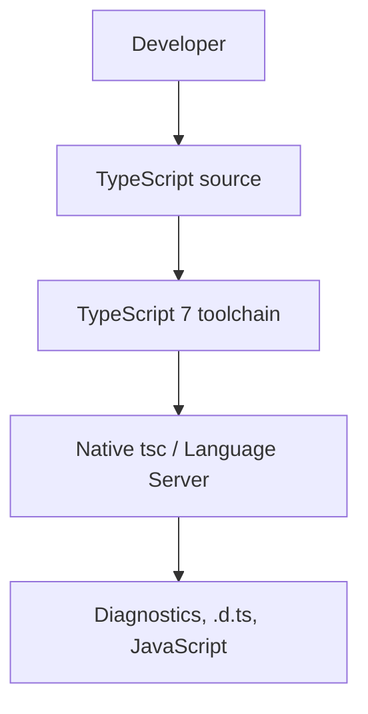
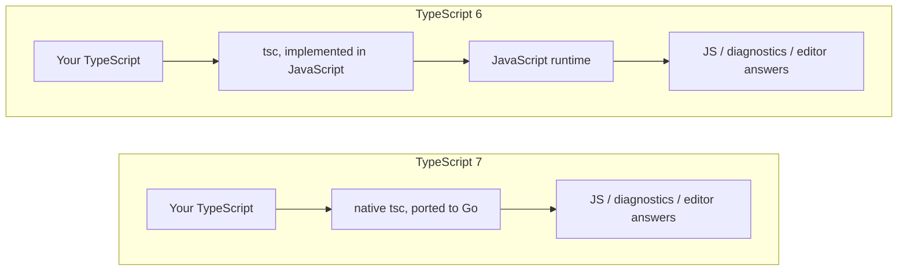
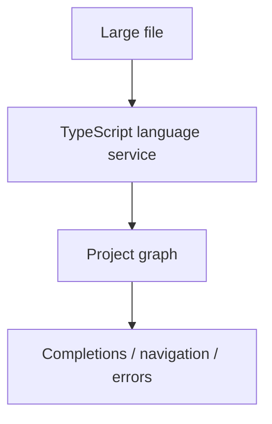
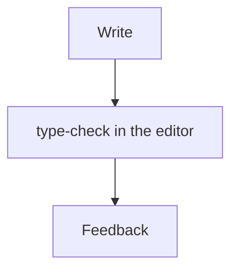
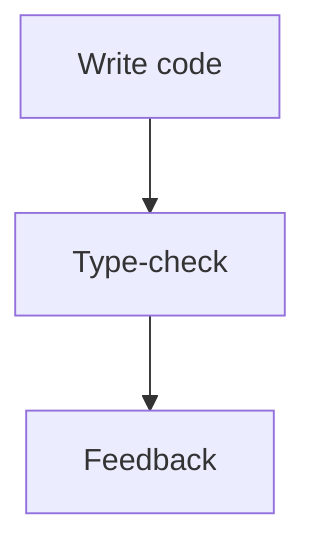

A small TypeScript project compiles in a few seconds. Then the repo grows. `tsc` starts to feel like a tax. Opening a large workspace takes long enough that people wait for CI instead of the editor. IntelliSense lags. A one-file change in a monorepo still pays for a lot of type-checking. The laptop fans spin. The CI job sits on "type-check" while the rest of the pipeline is ready.

None of that is a new language problem. The types still mean what they meant. The bottleneck is the toolchain that has to load, check, and serve that TypeScript every day.

TypeScript 7, released as stable on 8 July 2026, is Microsoft's answer to that bottleneck. The language you write did not become Go. The compiler and language service that process your TypeScript did: they were ported from the historical JavaScript implementation to a native executable. [Microsoft's announcement](https://devblogs.microsoft.com/typescript/announcing-typescript-7-0/) describes the work as a faithful port — new code that keeps the structure and checking rules of the existing compiler — not a from-scratch rewrite.

> You are not learning a different TypeScript. You are running the same TypeScript ideas on infrastructure that can use a modern machine.

That is the question this article answers: **what actually changes with TypeScript 7, and why should that matter if you already ship TypeScript for a living?**

## How the old compiler actually ran

Until TypeScript 6, `tsc` and the editor language service were a TypeScript codebase that compiled to JavaScript and ran on a JavaScript engine. That is the bootstrap story: TypeScript compiled TypeScript. For more than a decade it was the right trade. The team could ship the compiler the same way the ecosystem ships everything else, and every change to the type checker could be written in the language it implemented.

It also had a cost. A JavaScript process starts slower than a native binary. It spends more memory on the same graph of files and types. And the historical compiler did not use the kind of shared-memory parallelism that a large check can benefit from on a 8- or 16-core laptop. On a toy repo you never noticed. On VS Code, Sentry, or a NestJS monorepo with project references, you noticed every morning.

`tsc` is not "just a build step." It is the program that decides whether the repo is well-typed, the program that emits `.d.ts` and JavaScript when you ask it to, and — through the language service — the program that answers "what is this symbol?" while you type. When that program is slow, the whole TypeScript ecosystem feels slow: editors, CI, `tsc --build`, and every tool that waited on the same check.

TypeScript 6 is the last release of that JavaScript implementation. Microsoft treated it as a bridge: deprecations and new defaults that align with TypeScript 7, plus a compatibility line (`@typescript/typescript6`) for tools that still need the old API. There is no TypeScript 6.1. [The 6.0 announcement](https://devblogs.microsoft.com/typescript/announcing-typescript-6-0/) is the place to read the config changes. TypeScript 7 is the infrastructure change.

## What TypeScript 7 changed

Microsoft ported the compiler and language service to [Go](https://go.dev/). The result is a native `tsc`. You still install the `typescript` package and still run `npx tsc`. The binary is no longer a Node.js program.

```sh
npm install -D typescript
npx tsc --version
```

Go is how Microsoft builds that binary. It is not a language you write your app in, and it is not a runtime your production process loads. Your application is still TypeScript. It still type-checks as TypeScript. It still emits JavaScript (or you still let a bundler do that). Go sits on the other side of the toolchain:



A diagram that puts "Go" between your source and the output is slightly wrong. Go is a compile-time detail of **the tool**, the same way C++ is a compile-time detail of `node`. You do not run Go when you type-check a NestJS service.



The language service moved with the compiler. Completions, errors, Go to Definition, Find All References, Rename, Quick Info, Signature Help, and quick fixes are served by a native server that speaks the [Language Server Protocol](https://microsoft.github.io/language-server-protocol/). VS Code ships a TypeScript 7 extension; Visual Studio enables TypeScript 7 from the workspace. Other editors that already speak LSP can use the same server. That is a tooling change, not a language change.

You do not need to learn Go to upgrade. You need to know that the program behind `tsc` and the editor is now a native process, and that a few ecosystem surfaces — the old compiler API, some language-service plugins, embedded languages — are still catching up. Those are later sections. The application code is not the migration.

## Why Go — and why that is not the whole speedup

"They rewrote it in Go, so it is 10× faster" is the wrong causal story.

The first decision, as [Anders Hejlsberg has described it](https://commandline.microsoft.com/typescript-7-0-anders-hejlsberg-peterman-pod/), was **port, not rewrite**. A green-field compiler would have been a different type checker: different errors, different edge cases, years of compatibility work. The existing checker is a graph of functions and cyclic data structures — trees with parent pointers, recursive types. That codebase assumes garbage collection and first-class functions. Go is a native, garbage-collected language with straightforward shared-memory concurrency and a style that mapped onto that codebase. Rust's borrow checker is a poor fit for those cycles. That is a portability argument, not a language-war argument.

Native code is only one of the four things Microsoft is stacking:

1. A native executable instead of a JavaScript process.
2. Parallel work on parsing, checking, and emit.
3. Shared-memory parallelism, so workers are not isolated processes that copy the world.
4. Tooling architecture that can use more than one core on purpose: `--checkers`, `--builders`, a rebuilt `--watch`, an LSP server that can serve more than one request at a time.

Hejlsberg has said that in early measurements, roughly half the gain came from being native and the other half from concurrency. The 7.0 announcement does not restate that split as a product metric. It says TypeScript 7 combines native speed, shared-memory multithreading, and further optimizations, and that full builds typically land between **8× and 12×** versus TypeScript 6 in their runs. Treat "Go" as the implementation language that made the port and the parallelism practical — not as a magic 10× multiplier.

## How fast — and how much memory

Microsoft published the 7.0 numbers on the same machine, TypeScript 6 versus TypeScript 7, default of **four** type-checker workers (`--checkers 4`):

| Codebase   | TypeScript 6 | TypeScript 7 | Speedup |
| ---------- | -----------: | -----------: | ------: |
| vscode     |       125.7s |        10.6s |   11.9× |
| sentry     |       139.8s |        15.7s |    8.9× |
| bluesky    |        24.3s |         2.8s |    8.7× |
| playwright |        12.8s |        1.47s |    8.7× |
| tldraw     |        11.2s |        1.46s |    7.7× |

Those are Microsoft's full-build times, not a promise that your NestJS app will drop from two minutes to ten seconds. Smaller projects have less work to parallelize. A repo that already spent most of its time in a bundler will not look like vscode. A CI runner with two cores and 4 GB will not look like the machine that produced that table.

Raising `--checkers` to 8 on that same machine moved vscode to 7.51s (**16.7×**), sentry to 12.08s (**11.6×**), bluesky to 2.01s (**12.1×**). More checkers also use more memory. On a constrained runner, Microsoft suggests lowering the count — `--checkers 1` makes checking effectively single-threaded — or passing `--singleThreaded` to turn off parallel parse and emit as well.

Memory in the same 7.0 runs is lower, not "half":

| Codebase   | TypeScript 6 | TypeScript 7 | Delta |
| ---------- | -----------: | -----------: | ----: |
| vscode     |        5.2GB |        4.2GB |  −18% |
| sentry     |        4.9GB |        4.6GB |   −6% |
| bluesky    |        1.8GB |        1.3GB |  −26% |
| playwright |        1.0GB |        0.9GB |  −11% |
| tldraw     |        0.6GB |        0.5GB |  −15% |

An earlier native-port post (March 2025) said editor memory looked "roughly half" before they had optimized it. The 7.0 table is the current official picture: modest aggregate savings on a full build, with a trade-off if you raise `--checkers` or `--builders`. Memory still matters. A laptop running the editor, `tsc --watch`, a Next.js or NestJS process, and Docker is not a vscode benchmark box. A GitHub Actions runner that OOM-kills `tsc` does not care that the same check is faster on 64 GB. `--singleThreaded` and a lower `--checkers` exist for that environment.

Editor load is the number many people will feel first. On the VS Code codebase, Microsoft reports the time from opening the editor to seeing the first error as about **17.5s --> under 1.3s** — over 13× on that project. They also report that the new language server failed **over 80% fewer** commands and crashed **over 60% less** than TypeScript 6's server in their telemetry.

Companies that tested 7.0 with Microsoft, as quoted in the announcement:

- Slack: about **40%** of merge-queue time gone; CI type-check about **7.5 minutes --> 1.25 minutes**. Local editor load had been close to unusable; TypeScript 7 loaded the same tree in a few seconds.
- Canva: first editor error about **58s --> 4.8s**.
- Vanta: up to **9×** on one of their largest projects.
- Microsoft News Services: about **400 hours a month** of CI wait removed.

Those are reported outcomes on specific codebases, not a multiplier you can paste onto your pipeline.

## The change you will feel: the editor

Most of a TypeScript day is not `npx tsc`. It is waiting for the thing under the cursor.



IntelliSense, auto-import, Go to Definition, Go to Type Definition, Find All References, Rename, Quick Info, Signature Help, quick fixes, call hierarchy — all of that is the language service answering a question against the same program `tsc` checks. If that program takes tens of seconds to load, the first keystroke in a large file is late. If Find All References walks a million-line graph on one JavaScript thread, you stop using it and grep instead.

A faster `tsc` in CI is a shorter red build. A faster language service is a shorter loop on every edit:



That is why Microsoft spent as much of the port on the language service as on the CLI, and why they moved to LSP. The new server can use multiple threads for concurrent requests. For VS Code, the TypeScript 7 extension becomes the default once installed; you can disable it from the command palette if a plugin or an embedded language still needs TypeScript 6. Visual Studio follows the workspace. In the weeks after 7.0, Microsoft said TypeScript 7 would ship as part of VS Code itself.

If your pain today is "the editor feels dead until the project loads," that is the TypeScript 7 feature, not a new syntax.

## Large projects, monorepos, and CI

The projects that paid the most for TypeScript 6 are the ones with many files, heavy types, and a graph of packages: a NestJS backend with project references, a Next.js app plus shared UI, a React design system, an Nx or Turborepo workspace where one type change fans out.

What can get cheaper:

- **Type-check.** `tsc --noEmit` or the equivalent Nx/Turborepo task is often the slow node in CI. Slack's 7.5 --> 1.25 minutes is that node, not "the whole deploy."
- **`--build` and project references.** TypeScript 7 can check inside a project in parallel and can build **more than one referenced project at once**. `--builders` sets how many of those project builds run together. It multiplies with `--checkers`: `--checkers 4 --builders 4` can mean up to 16 checkers. Microsoft warns that this can be excessive. The dependency graph still serializes what it must, unless you use `--isolatedDeclarations` and a separate declaration emit.
- **`--incremental`.** Rechecking a small edit in a large repo is the daily case. The 7.0 incremental path is a reimplementation, not the old JS cache with a new binary.
- **`--watch`.** File watching was rebuilt on a Go port of Parcel's watcher, the same family of watcher VS Code already used. Microsoft reports lower resource use than the TypeScript 6 watcher, especially once `node_modules` is in the tree.
- **Editor + local `tsc`.** Teams that gave up on local type-check because the language service never finished can put the loop back on the laptop.

What does not automatically get cheaper:

- Bundling. Next.js, Vite, webpack, and esbuild still do their own work. TypeScript 7 does not replace them.
- Test runners, Docker image builds, deploy steps.
- Tools that still import the TypeScript 6 API (eslint, some Nx plugins, Vue / Svelte / Astro / MDX / Angular language tools). Those keep a TypeScript 6 process next to `tsc` 7 until they grow a 7.x API.
- A two-core CI runner you already saturate. Parallel checkers need cores and RAM; otherwise you tune `--checkers` down.

The strategic point is the same at ecosystem scale. TypeScript sits under frontend apps, NestJS services, CLIs, libraries, monorepos, IDEs, and CI. Speeding up the compiler and the language service removes a bottleneck those tools all share. TypeScript 7 is not trying to invent a new language feature so you write different code. It is trying to stop the toolchain from being the thing that does not scale when the repo does.

## What does not change in your TypeScript

This still type-checks the same way:

```ts
interface User {
  id: string;
  name: string;
}

const user: User = {
  id: "123",
  name: "Francisco",
};
```

Node.js, Bun, Deno, and the browser still run **JavaScript**. V8 (or JavaScriptCore, or whatever your runtime uses) is not Go. TypeScript 7 does not replace a production runtime. It is a development-time program:

| Role                    | What it does                                     | What TypeScript 7 is |
| ----------------------- | ------------------------------------------------ | -------------------- |
| Compiler / type checker | Reads `.ts`, reports errors, optionally emits JS | Yes — native `tsc`   |
| Language service        | Answers editor questions about that same program | Yes — native LSP     |
| Runtime                 | Executes the JavaScript you ship                 | No                   |

If you confuse those two columns, "TypeScript is written in Go now" starts to sound like "my API runs on Go." It does not.

```text
Compiler / type checker     ≠     Runtime
tsc, editor LS                    node, bun, deno, browser
```

## What does need attention

Microsoft's compatibility claim is specific: TypeScript that compiles cleanly on 6.0 **with** `stableTypeOrdering` and **without** `ignoreDeprecations` should compile the same way on 7.0. The work is not "rewrite the app." It is "the bridge release's defaults are now real, and some tools still talk to the old compiler."

**Config that 6.0 deprecated is an error in 7.0.** Notable defaults: `strict` is `true`; `module` defaults to `esnext`; `target` is the current stable ECMAScript version before `esnext`; `rootDir` defaults to `./`; `types` defaults to `[]`. Flags that no longer exist include `baseUrl`, `moduleResolution: node` / `node10`, `target: es5`, and `module: amd | umd | systemjs | none`. If `tsconfig.json` lives next to `src/`, set `rootDir` explicitly. If you relied on automatic `@types` inclusion, list them:

```json
{
  "compilerOptions": {
    "rootDir": "./src",
    "types": ["node", "jest"]
  },
  "include": ["./src"]
}
```

**The old compiler API is not in 7.0.** Microsoft expects a **new** API in 7.1. Until then, `typescript-eslint` and anything else that `import`s `typescript` should keep TypeScript 6 via [`@typescript/typescript6`](https://www.npmjs.com/package/@typescript/typescript6) (`tsc6` plus the 6.0 API). The documented npm-alias pattern:

```json
{
  "devDependencies": {
    "@typescript/native": "npm:typescript@^7.0.2",
    "typescript": "npm:@typescript/typescript6@^6.0.2"
  }
}
```

`npx tsc` is 7.0. Tools that `require("typescript")` still see 6.0.

**Embedded languages and some editor plugins still need 6.0.** Vue, MDX, Astro, Svelte, and Angular template checking go through tools (Volar and friends) that embed the compiler. Without a 7.0 API they stay on TypeScript 6. The supported split is: TypeScript 7 for project-wide `tsc` errors, TypeScript 6 in the editor. In VS Code, "Disable TypeScript 7 Language Server" is that switch.

**JavaScript and JSDoc checking is stricter.** TypeScript 7 dropped several JS-only special cases (`@enum`, `@class` as a constructor, Closure-style `function(string): void`, using a value where a type is required). If the repo is `.js` + JSDoc, read Microsoft's [CHANGES](https://github.com/microsoft/typescript-go/blob/main/CHANGES.md) list before blaming the native binary.

**Template literal inference now splits on Unicode code points**, not UTF-16 code units. `HeadTail<"😀abc">` becomes `["😀", "abc"]`, not a surrogate pair. Utilities that modeled UTF-16 length on purpose will change.

None of that is "TypeScript 7 broke `interface`." It is the 6 --> 7 bridge, plus an ecosystem that still has two compilers for a while.

## What happened to `tsc`

| When                              | What you installed                | What you ran   |
| --------------------------------- | --------------------------------- | -------------- |
| TypeScript 6 (stable JS line)     | `typescript@6`                    | `tsc` on Node  |
| Native previews (2025–early 2026) | `@typescript/native-preview`      | `tsgo`         |
| TypeScript 7 Beta                 | `@typescript/native-preview@beta` | `tsgo`         |
| TypeScript 7 RC                   | `typescript@rc`                   | `tsc` (native) |
| TypeScript 7.0 stable             | `typescript` (`7.0.x`)            | `tsc` (native) |
| Nightlies after 7.0               | `typescript@next`                 | `tsc` (native) |

`tsgo` was a preview name so you could sit it next to TypeScript 6's `tsc`. It is not the stable command. Ryan Cavanaugh has said the `tsgo` name is effectively gone, and the native codebase is moving back into `microsoft/TypeScript`. Do not write a runbook around `@typescript/native-preview` in August 2026.

| Aspect              | TypeScript 6                                     | TypeScript 7                                                 |
| ------------------- | ------------------------------------------------ | ------------------------------------------------------------ |
| Implementation      | TypeScript compiled to JavaScript                | Port of that compiler to Go                                  |
| How `tsc` runs      | JavaScript runtime                               | Native executable                                            |
| Parallelism         | Largely single-process JS                        | Parse / check / emit in parallel; `--checkers`, `--builders` |
| Full-build speed    | Baseline in Microsoft's tables                   | Typically ~8–12× in those same runs                          |
| Memory (full build) | Baseline                                         | Lower in the 7.0 table (about −6% to −26% there)             |
| Language service    | Historical TSServer protocol                     | LSP, multithreaded requests                                  |
| Programmatic API    | The existing `typescript` JS API                 | None in 7.0; new API planned for 7.1                         |
| Type-check rules    | Last JS checker; 6.0 deprecations still optional | Same checker logic; 6.0 deprecations are errors              |

TypeScript 6 is not a failed product. It is the last JavaScript compiler, and the compatibility hatch for tools that cannot move yet. TypeScript 7 is the same checker on a different machine.

## Should you migrate now?

Not by default. Ask the project these questions.

- Does the repo already compile on TypeScript 6 **without** `ignoreDeprecations`?
- Do we import the compiler API, or does eslint / Nx / a custom transformer import it for us?
- Do we depend on Vue, Svelte, Astro, MDX, or Angular language tools in the editor?
- Is `tsc` or the language service actually the slow part — or is the bundler, the test suite, or the Docker build?
- Is editor load the daily complaint?
- Do we need a boring, frozen toolchain more than we need a faster one this quarter?

**Trying TypeScript 7** can mean installing the VS Code extension for a week, or running `npx tsc` on a branch and diffing errors against 6.0. That is cheap.

**Migrating CI and the whole team** means pinning `typescript@7`, deciding whether you still need the `@typescript/typescript6` alias, updating `tsconfig` for 6.0 defaults, and checking that every package in a monorepo agrees. Microsoft has been running 7.0 on large internal and external repos and calls it production-ready for command-line checking. "Production-ready" is not "every plugin in `node_modules` already speaks 7.1."

If the editor is the problem and you do not embed Vue in that workspace, try the language server first. If CI type-check is the problem and eslint still needs the 6.0 API, use the alias and let `tsc` be 7. If neither is a problem, TypeScript 6 remains a supported hatch. There is no prize for upgrading on the release week.

## What this is for

The useful picture is not "Microsoft picked Go." It is the loop you are in every day:



A native compiler shortens that loop in the editor, on `--watch`, and in CI. Large repos get more of the win because there is more work to parallelize and more memory to stop wasting. The language can keep growing — more files, heavier types, more packages, more people — without the tool that understands the language falling over first.

TypeScript did not need a new surface syntax to make that jump. It needed the program that implements TypeScript to scale with the hardware and the repos people already have.

## What TypeScript 7 does not mean

- TypeScript is not Go. You still write TypeScript.
- You do not need to learn Go to use TypeScript 7.
- Your application does not run on Go.
- Node.js, Bun, Deno, and JavaScript are still the runtimes.
- Not every project will see "10×." Microsoft's own table ranges from about 7.7× to 11.9× on full builds at the default checker count, on specific open-source repos, on one machine.
- Not every tool is compatible. The 7.0 API gap is real. Plan for two compilers if your editor plugins or eslint still import `typescript`.

## The takeaway

- TypeScript 7 changes the **toolchain**, not the language you ship.
- The native `tsc` is a **port** of the existing checker, chosen so the errors stay the same.
- The speedup is **native code plus parallelism plus shared memory**, not "because Go" as a slogan.
- Microsoft's 7.0 numbers are **8–12×** on full builds in their benchmarks, with smaller memory deltas and a much faster editor load on vscode.
- The upgrade that most people will feel is the **language service**, then CI type-check.
- Keep TypeScript 6 beside 7 until your API-dependent tools and embedded languages move.

## Sources

- TypeScript, [Announcing TypeScript 7.0](https://devblogs.microsoft.com/typescript/announcing-typescript-7-0/) — stable release, 8–12× range, benchmark and memory tables, `--checkers` / `--builders` / `--singleThreaded`, LSP, no 7.0 API, `@typescript/typescript6`, editor and company figures, 6.0 defaults
- TypeScript, [A 10x Faster TypeScript](https://devblogs.microsoft.com/typescript/typescript-native-port/) — native port announcement; TypeScript 6 (JS) vs TypeScript 7 (native); port of the existing codebase
- TypeScript, [Progress on TypeScript 7 — December 2025](https://devblogs.microsoft.com/typescript/progress-on-typescript-7-december-2025/) — preview-era `tsgo` and `@typescript/native-preview`; 6.0 as the last JavaScript release
- TypeScript, [Announcing TypeScript 7.0 Beta](https://devblogs.microsoft.com/typescript/announcing-typescript-7-0-beta/) — `@typescript/native-preview@beta`, `tsgo`
- TypeScript, [Announcing TypeScript 7.0 RC](https://devblogs.microsoft.com/typescript/announcing-typescript-7-0-rc/) — `typescript@rc`, native `tsc`
- TypeScript, [Announcing TypeScript 6.0](https://devblogs.microsoft.com/typescript/announcing-typescript-6-0/) — last JavaScript compiler; deprecations and defaults that 7.0 enforces
- Microsoft Command Line, [Anders Hejlsberg on TypeScript 7.0](https://commandline.microsoft.com/typescript-7-0-anders-hejlsberg-peterman-pod/) — port vs rewrite; why Go (GC, cyclic structures, shared-memory concurrency)
- TypeScript, [CHANGES.md](https://github.com/microsoft/typescript-go/blob/main/CHANGES.md) — 6.0 vs 7.0 differences, including JavaScript / JSDoc
- npm, [typescript](https://www.npmjs.com/package/typescript) — `7.0.2` as current stable; `typescript@next` for nightlies
- npm, [@typescript/typescript6](https://www.npmjs.com/package/@typescript/typescript6) — `tsc6` and the TypeScript 6 API
- GitHub, [microsoft/TypeScript](https://github.com/microsoft/TypeScript) — current compiler repository
- GitHub, [tsgo name after 7.0](https://github.com/microsoft/typescript-go/discussions/4576) — Ryan Cavanaugh: `tsgo` as a name is effectively gone
- Microsoft, [Language Server Protocol](https://microsoft.github.io/language-server-protocol/)
