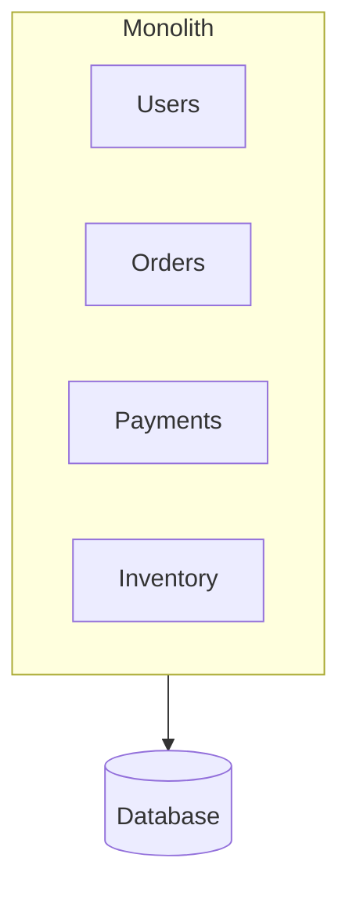
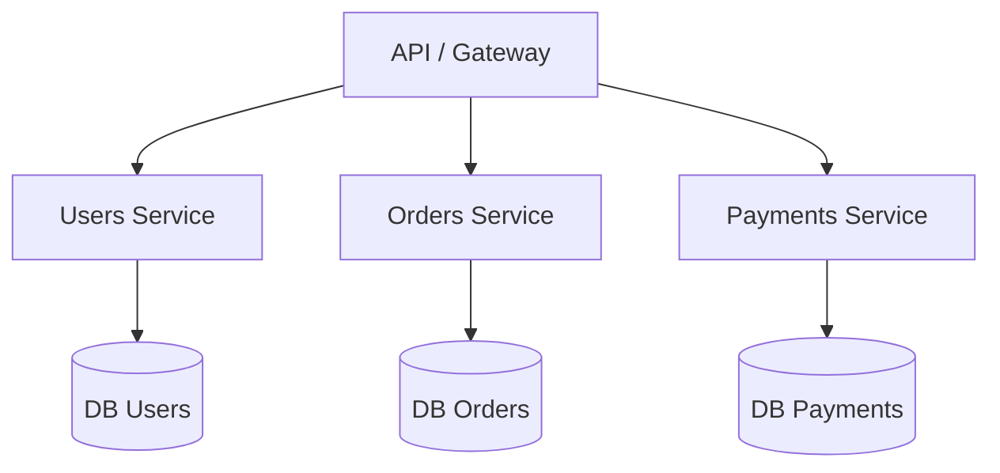
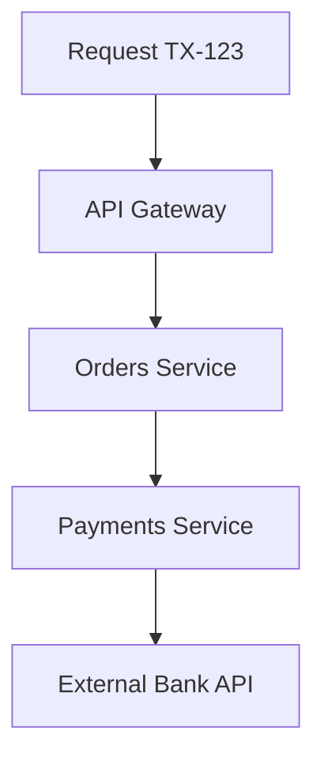
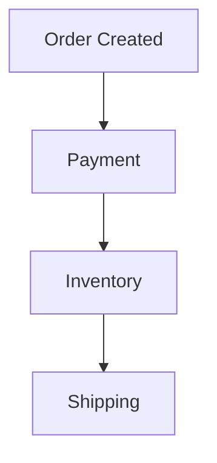
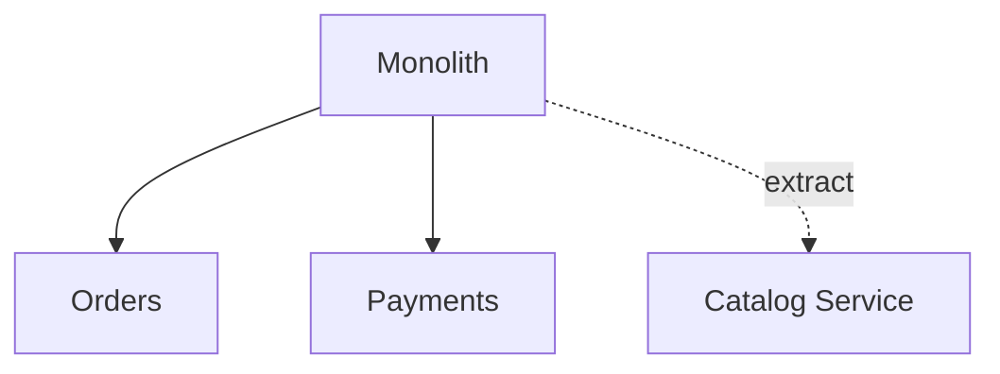
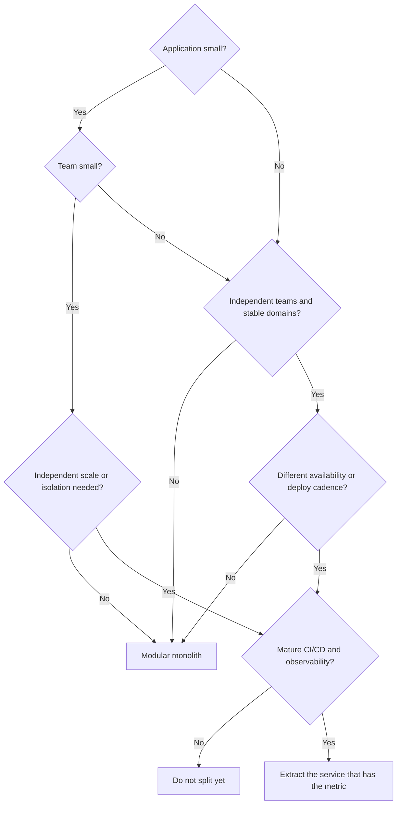

El equipo de catálogo quiere publicar el viernes. Pagos está congelado hasta el lunes porque un cambio de esquema vive en el mismo artefacto. Nadie está equivocado. La arquitectura sí.

Los equipos tratan los microservicios como la forma adulta de un monolito, igual que tratan Kubernetes como la forma adulta de una VM. La arquitectura no es una escalera profesional.

**Los microservicios no son la evolución obligatoria de un monolito.**

Elige según los problemas que tienes que resolver: complejidad del dominio, tamaño y estructura del equipo, cuán desigual es la carga, con qué frecuencia despliegas, cuán independientemente deben cambiar los componentes, disponibilidad y aislamiento, coste de infraestructura, madurez DevOps, observability, complejidad operativa, y qué necesita el negocio este trimestre. La moda no está en esa lista.

La mayoría de las organizaciones empiezan con una sola aplicación desplegable. Algunas después extraen servicios. Algunas nunca deberían hacerlo. La pregunta interesante no es «qué arquitectura es mejor». Es:

> ¿Cuándo debería construir un monolito, y cuándo de verdad necesito microservicios?

## Qué es realmente un monolito

Un monolito es un sistema entregado como **una sola unidad desplegable**. Gestión de usuarios, pedidos, pagos e inventario pueden vivir en el mismo código, el mismo proceso y normalmente el mismo release. «Monolito» describe el límite de despliegue y proceso. No describe la calidad del código.

Dentro de ese proceso, los módulos hablan con llamadas a función. Comparten memoria, runtime, y típicamente una base de datos principal. Una petición entra en un controlador, pasa por servicios y repositorios, y hace commit o rollback en una sola transacción. No hay salto de red entre «pedidos» y «pagos» a menos que lo pongas tú.

Una app Rails desordenada es un monolito. Una aplicación NestJS, Spring o .NET cuidadosamente modular con APIs de módulo explícitas también es un monolito. Martin Fowler es explícito: en la conversación de microservicios, «monolito» significa una aplicación construida como una sola unidad, no un insulto para código enredado.

Tres formas se comprimen en una palabra:

- **Monolito tradicional** — un código, límites internos débiles, paquetes organizados por capa técnica. Cualquier cosa puede llamar a cualquier cosa.
- **Monolito modular** — sigue siendo una unidad desplegable, pero los dominios son dueños de su código y acceso a datos. Pedidos habla con Pagos a través de una API de módulo pública, no metiendo mano en las tablas de Pagos.
- **Monolito bien diseñado** — límites modulares más inversión de dependencias: la lógica de dominio no depende de HTTP, el ORM ni el message broker. Hexagonal / puertos-y-adaptadores y Clean Architecture son los nombres habituales de esa disciplina.

El monolito modular es la versión que vale la pena defender. El equipo de ingeniería de Shopify lo definió como un sistema donde todo el código alimenta una sola aplicación y hay límites estrictamente impuestos entre dominios. Mantienes un solo pipeline de tests, un solo deploy, y llamadas en proceso. Renuncias a la fantasía de que «un repo» significa «sin diseño».

## Por qué un monolito suele ser el primer sistema correcto

**Problema:** necesitas un producto que funcione, no una plataforma. **Restricción:** un equipo pequeño, un dominio sin terminar, y un presupuesto que no incluye un grupo de plataforma. **Trade-off:** el monolito concentra el riesgo de cambio más adelante; los microservicios concentran el riesgo operativo ahora. **Decisión:** empezar modular y junto — todavía no conoces los límites que estarías congelando en contratos de red.

| Aspecto    | En un monolito                                                                                                   |
| ---------- | ---------------------------------------------------------------------------------------------------------------- |
| Desarrollo | Un repo, un runtime, un conjunto de tipos. Un ingeniero nuevo sigue una petición sin abrir cuatro servicios.     |
| Testing    | Arranca la app y una base de datos; verifica pago e inventario en un solo proceso.                               |
| Debugging  | Un stack trace es un stack trace. No necesitas un backend de tracing para saber qué función lanzó.               |
| Despliegue | Un artefacto, un health check, un rollback. Fowler señala orgs que despliegan un monolito muchas veces al día.   |
| Llamadas   | Un salto local. Falla si el proceso falla — no porque DNS expiró o TLS hizo timeout.                             |
| Coste      | Un servicio más una base de datos. Vogels: una startup de cinco ingenieros puede elegir esto porque es operable. |

Una llamada a función no es un procedimiento remoto. Los procedimientos remotos son lentos respecto a las llamadas en proceso, y pueden fallar aunque ambos codepaths sean correctos. Fowler trata eso como el primer coste de jugar la carta de distribución, no como un tema avanzado que toca después.

## Los problemas que aparecen después

«El monolito no escala» es el diagnóstico menos útil en este debate. Muchos monolitos escalan vertical y horizontalmente sin problemas. Los fallos que realmente aparecen son más específicos.

**Alto acoplamiento.** Las tarifas de envío llaman a las tarifas de impuestos porque ambas funciones estaban en scope. Shopify describió el resultado: un cambio en el cálculo de impuestos podía cambiar el envío, y no era obvio por qué.

**Cambios que no se pueden aislar.** Un fix de una línea en inventario sigue pasando por el suite de tests completo y el release train completo.

**Un deploy completo para un cambio pequeño.** Querías ajustar un ranking de catálogo. Desplegaste pagos de nuevo.

**Escalar toda la app.** Catálogo está caliente. Reportes está frío. Añades instancias de todo.

**Blast radius.** Una fuga de memoria en reportes puede dejar sin threads a checkout en el mismo proceso. El aislamiento es un límite de proceso. No compraste uno.

**Upgrades de dependencias.** La librería de pagos necesita un runtime para el que el módulo de catálogo no está listo. Todos hacen upgrade juntos, o nadie lo hace.

**Fricción de equipo grande.** El onboarding requiere conocer todo el mapa. La alarma de Shopify en 2016: un ingeniero nuevo en envíos también tenía que entender pedidos y pagos.

**Una base de datos compartida que se convirtió en la API real.** Cada módulo lee cada tabla. El esquema es un contrato público sin versionado y sin dueño.

**Big Ball of Mud.** Los límites existían en una pizarra. En el repo son comentarios. Fowler nota que saltarse la barrera de un módulo es un atajo táctico útil — y que hecho ampliamente, destroza la productividad.

> El problema no es que la aplicación sea monolítica. El problema es que sus límites internos están mal, no se imponen, o ambas cosas.

Si extraes servicios de un Big Ball of Mud sin antes trazar esos límites, obtienes un Big Ball of Mud distribuido. La guía de fiabilidad de AWS tiene un nombre para ese modo de fallo: la _Death Star_ de microservicios.

## Qué son realmente los microservicios

James Lewis y Martin Fowler describieron los microservicios como servicios desplegables de forma independiente, organizados alrededor de capacidades de negocio, comunicándose por red, y normalmente siendo dueños de sus propios datos. El Azure Architecture Center de Microsoft usa la misma forma: servicios pequeños y autónomos, cada uno implementando una sola capacidad de negocio dentro de un bounded context, desplegados independientemente, hablando mediante APIs o eventos.

Este diagrama es conceptual. **Una base de datos por servicio es una práctica frecuente para reducir el acoplamiento. No es una ley.** Lo que el estilo realmente requiere es que otros servicios no accedan a tus tablas. Si dos «servicios» comparten un esquema y despliegan en un schedule coordinado, has cortado un monolito en procesos sin comprar independencia.

Las propiedades que importan: servicios independientes con una responsabilidad delimitada; comunicación por red (HTTP, gRPC o mensajes) en lugar de llamadas en proceso; despliegue y escalado independientes; aislamiento para que un crash de proceso no sea el crash de todos; propiedad de equipo lo bastante pequeña para que un equipo construya, testee y opere el servicio.

La guía de arquitectura de Google Cloud hace el mismo punto sobre acoplamiento sin vender una topología: servicios independientes débilmente acoplados pueden liberarse independientemente, usar stacks distintas, y ser gestionados por equipos diferentes. GKE versus Cloud Run es una elección de runtime después de que el límite existe.

## Los problemas que intentan resolver

Los microservicios son una respuesta a presión operativa y organizacional específica. No son una forma más limpia de escribir una app CRUD.

**Escalado independiente.** Catálogo recibe el tráfico de navegación. Pagos recibe el de checkout. Esas curvas no son iguales. Esto es **escalabilidad**, no **rendimiento**: dividir una llamada en tres saltos de red normalmente hace una sola petición más lenta. Escalas horizontalmente un cuello de botella. No haces la llamada a función más rápida.

**Despliegue independiente.** Pagos puede liberar una regla de fraude sin abrir una ventana de cambio para catálogo. Eso solo se mantiene si el contrato es estable. Si cada release sigue requiriendo un deploy coordinado, pagaste el coste de distribuir y conservaste el release train del monolito.

**Aislamiento de fallos.** Un crash en reportes no debería tumbar checkout. Azure es cuidadoso: un microservicio no disponible no interrumpe toda la aplicación **siempre que los servicios upstream manejen el fallo**. El aislamiento es una propiedad que implementas: timeouts, reintentos solo para trabajo idempotente, circuit breakers, bulkheads, colas (mira [cómo usar Pub/Sub correctamente](/blog/google-cloud-pubsub-how-to-use-it-correctly/) cuando quien llama no necesita una respuesta en la misma petición), dead-letter queues y rate limiting. Sin eso, tienes un monolito distribuido que falla de formas más interesantes.

## Ventajas — y lo que cuesta cada una

Fowler agrupa los beneficios como límites de módulo más fuertes, despliegue independiente, y diversidad tecnológica — y los costes como distribución, eventual consistency, y complejidad operativa.

| Ventaja                       | Resuelve                                  | Útil cuando                                        | Pagas                                                                            |
| ----------------------------- | ----------------------------------------- | -------------------------------------------------- | -------------------------------------------------------------------------------- |
| Despliegue independiente      | Releases sincronizados                    | Partes cambian en relojes distintos                | Contratos versionados, ventanas de compatibilidad, muchos pipelines              |
| Escalado independiente        | Carga desigual                            | Una capacidad es un orden de magnitud más caliente | Más runtimes, más autoescalado, más formas de estar idle o saturado              |
| Aislamiento de fallos         | Crashes de destino compartido             | Los requisitos de disponibilidad difieren          | Fallo parcial como decisión de producto                                          |
| Autonomía de equipo           | Sobrecarga de coordinación                | Los equipos ya son dueños de dominios              | La Ley de Conway en ambas direcciones                                            |
| Límites de dominio más claros | «Quién es dueño de esta tabla»            | Los bounded contexts ya son visibles               | Un límite equivocado es caro de mover a través de una red                        |
| Diversidad tecnológica        | Una necesidad medida de runtime/datastore | La restricción es real, no «queríamos Rust»        | Contratación, librerías compartidas, baselines de seguridad, on-call multilingüe |

A pequeña escala un monolito es más barato y más simple de desplegar: un proceso, un pipeline, llamadas en proceso, consistencia de un solo commit. Los microservicios invierten eso: pagas la prima de distribuir desde el día uno, cada salto añade latencia, el debugging necesita trazas, y eventual consistency es el default. AWS Well-Architected REL03-BP01 dice lo mismo: segmentos más pequeños dan agilidad y te permiten invertir disponibilidad donde importa. También añaden latencia, debugging más difícil, y carga operativa.

## El precio de ir distribuido

Los microservicios convierten problemas locales en problemas distribuidos. La prima de Fowler: despliegue automatizado, monitorización, manejo de fallos y eventual consistency son esfuerzo extra, y nadie tiene tiempo de sobra.

Una llamada que solía ser `A → B` en proceso ahora puede fallar por un timeout, un paquete perdido, DNS, TLS, un load balancer, una instancia saturada, o porque el otro servicio simplemente no está ahí. Sigues teniendo bugs. También tienes una nueva clase de bugs que llevan el nombre de la red.

Una vez que una petición sale del proceso, logs sin una identidad compartida son tres opiniones sobre tres eventos diferentes. Necesitas un **transactionId** para la operación de negocio, un **traceId** y **spanId** para la ejecución, logs estructurados, tracing distribuido, y métricas que nombren el servicio, la ruta y la dependencia.

Esos identificadores te permiten reconstruir el camino. No son el mismo identificador. Un checkout puede mantener `TX-123` a través de un reintento que abre una segunda traza. Si tu equipo está a punto de dividir un proceso, lee [Un traceId no es un transactionId](/blog/trace-id-is-not-transaction-id/) antes de inventar un header casero. Azure lista logging centralizado, OpenTelemetry y tracing distribuido como parte de la arquitectura, no como pulido opcional.

Sin trazas, el debugging es hacer grep por timestamp y esperar que los relojes coincidan. La lección temprana de Netflix en AWS fue el mismo fenómeno a nivel de red: APIs verbosas que estaban bien en un datacenter rápido se convirtieron en un defecto de diseño cuando la latencia varió.

Una compra ya no es una transacción:

Pago tiene éxito. Inventario falla. Ahora tienes dinero y no stock, o reintentas inventario y decrementas dos veces. Las transacciones distribuidas son posibles y normalmente la herramienta equivocada. El diseño habitual es **eventual consistency**, una **saga** que puede compensar, y handlers **idempotentes** que sobreviven a **mensajes duplicados**. At-least-once delivery es la garantía habitual de los brokers. Efectos de negocio exactly-once es tu problema. Un monolito puede ocultar esto detrás de un solo commit. Un sistema distribuido fuerza la conversación: ¿qué ve el cliente, qué reembolsamos, y cómo detectamos la inconsistencia después de que la ventana se haya cerrado?

## Cuándo un monolito es la decisión correcta

**MVP.** Todavía estás descubriendo si alguien quiere el producto. Un sistema exitoso mal diseñado es un problema mejor que uno distribuido bellamente que nadie usa. Los microservicios añaden tiempo de ciclo cuando el tiempo de ciclo es la única ventaja que tienes.

**Sistema interno.** Cincuenta empleados, horario de oficina, un pico conocido. Tienes un problema de entrega, no de escala. Un monolito modular con una base de datos aburrida sobrevivirá a un service mesh que nadie de guardia entiende.

**Equipo pequeño.** De tres a cinco desarrolladores. Vogels usa casi el mismo ejemplo. Cada servicio que añades es un servicio que esas mismas cinco personas despliegan, vigilan y por el que se despiertan.

**Dominio fuertemente acoplado.** Checkout que debe decrementar stock, cobrar dinero, y escribir el pedido en una sola decisión de negocio. Si el negocio no puede tolerar «pagado pero no reservado» ni siquiera unos segundos, una saga distribuida es un defecto de producto. Mantén el límite de consistencia dentro de un solo proceso hasta que el dominio te diga que se ha dividido.

**Escala baja.** Unas pocas peticiones por segundo, o unos pocos cientos, en una forma de tráfico predecible. La distribución no creará headroom que necesites. Creará modos de fallo que no tienes personal para operar.

## Cuándo los microservicios se ganan su complejidad

**Escala desigual.** Catálogo a 100 requests/sec, reportes a 2. Extrae primero la pieza caliente, independientemente cacheable, independientemente poseída — no todo el mapa.

**Equipos independientes.** Cuando los equipos ya son dueños de dominios y despliegan en relojes distintos, los límites de servicio pueden coincidir con la propiedad. El argumento de Fowler sobre límites de módulo es mayormente un argumento de organización. Si tienes un equipo y cuatro servicios, inventaste un problema de coordinación.

**Disponibilidad diferente.** Pagos debe estar arriba. Reportes puede esperar. El pilar de fiabilidad de AWS usa esto como razón para segmentar: inviertes disponibilidad donde el cliente realmente la necesita.

**Cadencia de despliegue diferente.** Identity despliega semanalmente porque es cuidadoso. Catálogo despliega varias veces al día porque merchandising no espera. Si comparten un release, el equipo cuidadoso se convierte en el cuello de botella y el equipo rápido se convierte en el riesgo.

**Dominios separados.** Un bounded context tiene su propio modelo y lenguaje. «Pedido» en facturación no es «Pedido» en almacén. Cuando esos modelos son estables y los equipos pueden ser dueños de ellos, un servicio es una expresión física razonable del contexto. Cuando el modelo todavía se está moviendo, un módulo es más barato de renombrar.

## Dos casos documentados

### Netflix — un monolito que tuvo que convertirse en sistema distribuido

La migración a la nube de Netflix empezó en 2008. Para 2010, streaming corría en AWS. Facturación, un sistema financiero sujeto a SOX todavía atado a una gran infraestructura Oracle en su datacenter, se volvió completamente nativa en AWS el 4 de enero de 2016, después de un movimiento incremental de varios años.

El problema inicial no era «preferimos microservicios». Era escala, expansión global, y un entorno de computación donde instancias individuales fallan como evento normal. John Ciancutti, escribiendo un año después de la transición a AWS, llamó al diseño resultante su «Arquitectura Rambo»: cada sistema tiene que poder tener éxito por su cuenta. Si recomendaciones está caído, el sitio todavía responde — con títulos populares en lugar de personalizados. Si búsqueda está intolerablemente lenta, streaming sigue funcionando. Chaos Monkey existía para matar instancias a propósito, porque el manejo de fallos que no se usa no funciona en un outage real.

También pagaron el coste de distribuir inmediatamente. Las redes de datacenter habían tolerado APIs verbosas; la latencia de AWS no, así que las interacciones «over the wire» tenían que diseñarse. Construyeron Eureka (discovery) y Ribbon (load balancing del lado del cliente) porque, en 2010, la caja de herramientas cloud-native no existía. Un post posterior del Tech Blog es honesto sobre el siguiente coste: más clientes IPC, más lenguajes, más features de resiliencia — que es por qué después movieron esa lógica hacia un service mesh.

Lo que obtuvieron: dominios de fallo independientes, escala horizontal para facturación después de separarse de Oracle (Cassandra para datos de suscriptores, MySQL donde todavía necesitaban ACID para cargos), y flujos de cara al cliente que se mantuvieron arriba mientras una dependencia se degradaba. Lo que asumieron: complejidad operativa, resiliencia activa, y una migración larga — país por país, con proxies de vuelta al datacenter, y testing end-to-end poco automatizado que subestimaron.

Copia el problema, no el logo. Netflix ya estaba en una escala donde la prima de microservicios era la factura más barata.

### Shopify — un monolito que siguió siendo monolito a propósito

- Una de las bases de código Ruby on Rails más grandes que existen: más de 2.8 millones de líneas para 2020, desarrollo continuo desde al menos 2006, más de mil desarrolladores para 2019 — sigue siendo una sola unidad desplegable.
- En 2016 el monolito original no tenía límites reales. Cambios inocuos de envíos se propagaban en fallos de tests no relacionados; un ingeniero nuevo en envíos también tenía que aprender pedidos y pagos.
- Los microservicios eran la respuesta de moda. Shopify eligió un **monolito modular**: Componentización (~6,000 clases Ruby reorganizadas por dominio), después Packwerk para rechazar pull requests que rompan el grafo de dependencias. Para 2020 tenían 37 componentes en el monolito principal.
- El beneficio que reportaron no fue «evitamos microservicios». Las dependencias aisladas hicieron posible cambiar un motor de impuestos legacy — un cambio que describieron como casi imposible antes — más propiedad más clara y triaje de excepciones por componente.
- Todavía corren un monolito grande porque el problema que tenían era modularidad, no una necesidad de runtimes independientes. Esa es la frase que la mayoría de las charlas de conferencia se saltan.

Werner Vogels, escribiendo después de que Prime Video documentara una herramienta de monitorización de stream como monolito, repitió que no hay un estilo mandatorio. Si los componentes siempre contribuyen a la misma respuesta, comparten necesidades de escalado y seguridad, y son propiedad de un equipo, combinarlos puede simplificar la arquitectura. Amazon mismo pasó de un monolito hacia servicios después del Distributed Computing Manifesto de 1998 — y S3 creció de unos pocos microservicios en su lanzamiento en 2006 a más de 300. Ambas direcciones están documentadas. Ninguna es una religión.

## Un camino de e-commerce de una unidad desplegable a un híbrido

Empieza aquí. El dominio no está terminado. El equipo es un equipo. Checkout, catálogo y pagos comparten una transacción más a menudo de lo que no.

Esta es una buena decisión. Puedes desplegar un carrito. Puedes escribir un test de integración para «pagar y decrementar stock». Puedes cambiar el significado de «pedido» sin una API versionada.

El tráfico llega, y no es uniforme: catálogo 80%, pedidos 15%, pagos 5%. Catálogo es read-heavy, cacheable, y propiedad de un equipo orientado a merchandising que quiere desplegar cambios de ranking sin tocar cargos. Pagos sigue estrechamente atado a pedidos y todavía quiere una historia de consistencia fuerte.

**Problema:** la carga de catálogo y la tasa de cambio de catálogo dominan. **Restricción:** no puedes escalar o liberar catálogo sin arrastrar a pagos. **Decisión:** extraer solo catálogo. **Justificación:** es la única capacidad con escala independiente demostrada, cadencia independiente, y un límite que ya puedes señalar en el monolito modular.

Ahora tienes un híbrido. Eso no es una migración incompleta. Es una arquitectura que gastó complejidad donde apareció una métrica. Pedidos y pagos pueden quedarse juntos hasta que aparezca una segunda métrica.

La estrategia de Fowler, en una línea: **empieza con un monolito modular y extrae servicios cuando hay una necesidad demostrada.** Casi toda historia exitosa de microservicios que había oído empezó como un monolito que se hizo demasiado grande; casi todo sistema construido como microservicios desde cero acabó en problemas serios. Los microservicios solo funcionan con límites estables. Refactorizar un paquete es barato. Refactorizar un límite de servicio es una migración. Eso es YAGNI aplicado a límites de proceso — una vez.

Lo que el monolito necesita si quieres la opción de evolucionar: dominios como eje primario; bounded contexts aunque compartan proceso; hexagonal / Clean Architecture para que un módulo pueda convertirse después en proceso; inversión de dependencias; límites de módulo que se imponen. Shopify necesitó Packwerk porque la convención no era suficiente.

La cobertura de Fowler: no empieces con microservicios a menos que el equipo ya tenga experiencia operándolos. Las arquitecturas pueden cambiar — Vogels revisa el diseño con cada orden de magnitud de crecimiento. El patrón de migración con nombre es el **Strangler Fig**: añade costuras, construye el nuevo comportamiento junto al viejo, redirige una porción del tráfico, repite. AWS lo recomienda, incluyendo arquitectura de transición que después borrarás. Una reescritura big-bang es la última opción.

## Un árbol de decisión

Usa esto como un filtro, no como un veredicto.

Si no puedes explicar qué caja produjo «extraer», no estás extrayendo. Estás decorando.

## Razones equivocadas, señales reales

Estas no son razones suficientes para dividir un proceso:

- **«Es más moderno.»** Moderno no es un requisito. Operable sí.
- **«El CTO pidió microservicios.»** Pregunta qué métrica quiere mover.
- **«Netflix los usa.»** Netflix también pasó años construyendo Eureka, Ribbon, Chaos Monkey, y después un mesh, porque fallo de instancias y streaming global eran el trabajo. Probablemente tú no estás en ese trabajo.
- **«Estamos usando Kubernetes.»** Kubernetes corre monolitos. Un scheduler no es una arquitectura.
- **«Queremos aprender microservicios.»** Apréndalos en un sandbox, no en checkout.
- **«Queremos lenguajes diferentes.»** Eso es un coste de contratación y plataforma. Raramente es un requisito de producto.
- **«El monolito es feo.»** La fealdad es un problema de modularidad. La distribución no quita lo feo. Lo replica.

Fowler llamó a la ansiedad _Microservice Envy_. La mayoría de sistemas, según su guía, deberían ser una sola aplicación con modularidad real.

Una arquitectura distribuida está sobre la mesa cuando varias de estas son ciertas: escala independiente demostrada; equipos independientes que ya despliegan en relojes distintos; bounded contexts estables; una razón concreta de release-train; disponibilidad que difiere por capacidad; un fallo que actualmente tumba algo más importante; volumen concentrado en un componente; una tecnología diferente requerida, no deseada; una org que puede operar un sistema distribuido un jueves malo; observabilidad lo bastante buena para seguir una petición hoy; CI/CD que ya puede desplegar un artefacto de forma segura.

Una casilla marcada es un olor, no un mandato. Tres casillas marcadas y una historia de observabilidad que falta es una razón para parar.

Sistemas pequeños, MVPs, equipos pequeños: monolito modular. Sistemas grandes con equipos independientes, escala desigual, o disponibilidad distinta: considera servicios, un límite a la vez. Organizaciones sin madurez DevOps y de observabilidad: no importes un modelo operativo distribuido para evitar una conversación de diseño.

> La mejor arquitectura no es la que tiene más servicios. Es la que resuelve el problema con la menor complejidad necesaria.

## Antes de extraer otro servicio, pregúntate

1. ¿Qué métrica mejora si esto es un proceso separado, y qué métrica empeora?
2. ¿Es esto un bounded context estable, o un paquete que no he terminado de nombrar?
3. ¿Puedo imponer este límite _dentro_ del monolito primero?
4. ¿Un equipo diferente es dueño de esto, y ya despliegan en un reloj diferente?
5. ¿Puedo seguir una petición de usuario a través del nuevo salto con la observabilidad que tengo hoy?
6. ¿Qué pasa cuando el nuevo servicio es lento, duplicado o está caído — en términos de producto, no en términos de infraestructura?
7. ¿Estoy resolviendo escala, o estoy resolviendo una discusión de release-train que una API de módulo también resolvería?
8. ¿Quién está de guardia para el espacio entre los servicios?
9. Si esta extracción está mal, ¿cómo la deshago?

Si no puedes responder «qué problema estoy resolviendo, y qué arquitectura lo resuelve con la menor complejidad necesaria», no dividas el proceso. Traza el límite. Mide. Después decide.

La arquitectura correcta depende del problema, no de la moda.

## Fuentes

- Martin Fowler, [Monolith First](https://martinfowler.com/bliki/MonolithFirst.html)
- Martin Fowler, [Microservice Trade-Offs](https://martinfowler.com/articles/microservice-trade-offs.html)
- Martin Fowler, [Microservice Premium](https://martinfowler.com/bliki/MicroservicePremium.html)
- Martin Fowler, [Strangler Fig Application](https://martinfowler.com/bliki/StranglerFigApplication.html)
- James Lewis and Martin Fowler, [Microservices](https://martinfowler.com/articles/microservices.html)
- AWS Well-Architected, [REL03-BP01 Choose how to segment your workload](https://docs.aws.amazon.com/wellarchitected/latest/reliability-pillar/rel_service_architecture_monolith_soa_microservice.html)
- AWS, [Implementing Microservices on AWS](https://docs.aws.amazon.com/whitepapers/latest/microservices-on-aws/microservices-on-aws.html)
- Microsoft Azure Architecture Center, [Microservices architecture style](https://learn.microsoft.com/en-us/azure/architecture/guide/architecture-styles/microservices)
- Google Cloud Architecture Center, [Patterns for scalable and resilient apps](https://docs.cloud.google.com/architecture/scalable-and-resilient-apps)
- Google Cloud, [GKE and Cloud Run](https://docs.cloud.google.com/kubernetes-engine/docs/concepts/gke-and-cloud-run)
- Netflix Technology Blog, [5 Lessons We've Learned Using AWS](https://netflixtechblog.com/5-lessons-weve-learned-using-aws-1f2a28588e4c)
- Netflix Technology Blog, [Netflix Billing Migration to AWS](https://netflixtechblog.com/netflix-billing-migration-to-aws-451fba085a4)
- Netflix Technology Blog, [Zero Configuration Service Mesh with On-Demand Cluster Discovery](https://netflixtechblog.com/zero-configuration-service-mesh-with-on-demand-cluster-discovery-ac6483b52a51)
- Shopify Engineering, [Deconstructing the Monolith](https://shopify.engineering/deconstructing-monolith-designing-software-maximizes-developer-productivity)
- Shopify Engineering, [Under Deconstruction: The State of Shopify's Monolith](https://shopify.engineering/shopify-monolith)
- Werner Vogels, [Monoliths are not dinosaurs](https://www.allthingsdistributed.com/2023/05/monoliths-are-not-dinosaurs.html)
