El equipo de catálogo quiere publicar el viernes. Pagos está congelado hasta el lunes porque un cambio de esquema vive en el mismo artefacto. Nadie está equivocado. La arquitectura sí.

Esa tensión es la razón por la que el debate monolito-versus-microservicios nunca muere. También es la razón por la que el debate suele plantearse mal. Los equipos tratan los microservicios como la forma adulta de un monolito, igual que tratan Kubernetes como la forma adulta de una VM. La arquitectura no es una escalera profesional.

**Los microservicios no son la evolución obligatoria de un monolito.**

Una arquitectura debería elegirse según los problemas que tienes que resolver: complejidad del dominio, tamaño y estructura del equipo, cuán desigual es la carga, con qué frecuencia despliegas, cuán independientemente deben cambiar los componentes, requisitos de disponibilidad y aislamiento, coste de infraestructura, madurez DevOps, observability, complejidad operativa, y qué necesita el negocio este trimestre. La moda no está en esa lista.

La mayoría de las organizaciones empiezan con una sola aplicación desplegable. Algunas después extraen servicios. Algunas nunca deberían hacerlo. La pregunta interesante no es «qué arquitectura es mejor». Es:

> ¿Cuándo debería construir un monolito, y cuándo de verdad necesito microservicios?

La arquitectura no debería elegirse porque una charla de conferencia la hizo parecer inevitable. Debería elegirse porque es la forma más barata de resolver el problema que tienes, incluyendo el coste de operarlo.

## Qué es realmente un monolito

Un monolito es un sistema entregado como **una sola unidad desplegable**. Gestión de usuarios, pedidos, pagos e inventario pueden vivir en el mismo código, el mismo proceso y normalmente el mismo release. «Monolito» describe el límite de despliegue y proceso. No describe la calidad del código.

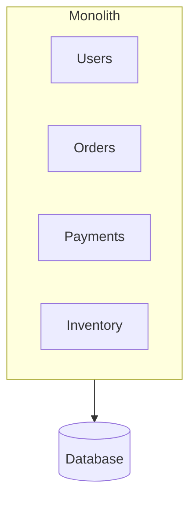

Dentro de ese proceso, los módulos hablan con llamadas a función. Comparten memoria, runtime, y típicamente una base de datos principal. Una petición entra en un controlador, pasa por servicios y repositorios, y hace commit o rollback en una sola transacción. No hay salto de red entre «pedidos» y «pagos» a menos que lo pongas tú.

Esa es toda la definición. Una app Rails desordenada es un monolito. Una aplicación NestJS, Spring o .NET cuidadosamente modular con APIs de módulo explícitas también es un monolito. Martin Fowler es explícito al respecto: en la conversación de microservicios, «monolito» significa una aplicación construida como una sola unidad, no un insulto para código enredado.

Tres formas se comprimen en una palabra:

- **Monolito tradicional** — un código, límites internos débiles, paquetes organizados por capa técnica (`controllers`, `services`, `repositories`). Cualquier cosa puede llamar a cualquier cosa.
- **Monolito modular** — sigue siendo una unidad desplegable, pero los dominios son dueños de su código y acceso a datos. Pedidos habla con Pagos a través de una API de módulo pública, no metiendo mano en las tablas de Pagos.
- **Monolito bien diseñado** — límites modulares más inversión de dependencias: la lógica de dominio no depende de HTTP, el ORM ni el message broker. Hexagonal / puertos-y-adaptadores y Clean Architecture son los nombres habituales de esa disciplina.

El monolito modular es la versión que vale la pena defender. El equipo de ingeniería de Shopify lo definió como un sistema donde todo el código alimenta una sola aplicación y hay límites estrictamente impuestos entre dominios. Mantienes un solo pipeline de tests, un solo deploy, y llamadas en proceso. Renuncias a la fantasía de que «un repo» significa «sin diseño».

## Por qué un monolito suele ser el primer sistema correcto

**Problema:** necesitas un producto que funcione, no una plataforma. **Restricción:** un equipo pequeño, un dominio sin terminar, y un presupuesto que no incluye un grupo de plataforma. **Alternativas:** una unidad desplegable modular, o una flota de servicios desde el día uno. **Trade-off:** el monolito concentra el riesgo de cambio más adelante; los microservicios concentran el riesgo operativo ahora. **Decisión:** empezar modular y junto. **Justificación:** todavía no conoces los límites que estarías congelando en contratos de red.

### Desarrollo

Hay un repositorio, un runtime, un conjunto de tipos. Un ingeniero nuevo clona el repo y puede seguir un checkout desde el handler HTTP hasta la base de datos sin abrir otros cuatro servicios. No estás levantando service discovery, un API gateway, un mesh y doce pipelines de CI antes de que exista el primer cliente.

### Testing

Un test de integración puede arrancar la aplicación y una base de datos, hacer un pedido, y verificar la fila de pago y el decremento de inventario en un solo proceso. No estás coordinando testcontainers para cinco servicios, un broker y un gateway solo para probar un caso de uso. Los tests siguen siendo trabajo. No son un sistema distribuido en sí mismos.

### Debugging

Un stack trace es un stack trace. La llamada que falló está en la misma máquina, en el mismo proceso, con el mismo debugger conectado. No necesitas un backend de tracing para responder «qué función lanzó la excepción».

### Despliegue

Un artefacto. Un health check. Un rollback. La entrega continua no es un privilegio exclusivo de los monolitos — Fowler señala organizaciones que despliegan un monolito muchas veces al día — pero la superficie operativa es más pequeña. No estás versionando cuatro APIs unas contra otras cada viernes.

### Comunicación

Compara las dos llamadas:

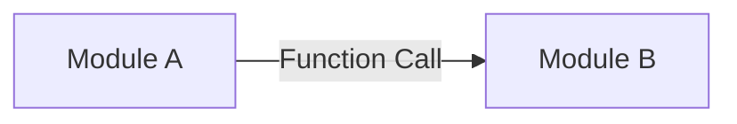

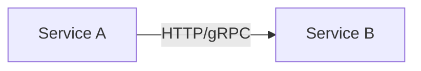

La primera es un salto local. Falla si el proceso falla. No falla porque DNS expiró, el load balancer drenó el pool equivocado, el handshake TLS hizo timeout, o el otro servicio está en el percentil 99 de latencia. La segunda llamada es un procedimiento remoto. Los procedimientos remotos son lentos respecto a las llamadas en proceso, y pueden fallar aunque ambos codepaths sean correctos. Fowler trata eso como el primer coste de jugar la carta de distribución, no como un tema avanzado que toca después.

### Coste

Un sistema pequeño en un solo servicio — Cloud Run, App Runner, un único servicio ECS, un App Service — más una base de datos es barato de operar y barato de pensar. Divide el mismo tráfico en ocho servicios y pagas ocho mínimos de instancia, ocho sinks de logs, ocho pipelines de deploy, y las personas que los mantienen honestos. La regla de oro de Werner Vogels es directa: una startup con cinco ingenieros puede elegir un monolito porque es más fácil de desplegar y no requiere que el equipo opere varias stacks. Sus necesidades no son las de una enterprise.

## Los problemas que aparecen después

«El monolito no escala» es el diagnóstico menos útil en este debate. Muchos monolitos escalan vertical y horizontalmente sin problemas. Los fallos que realmente aparecen son más específicos.

**Alto acoplamiento.** Las tarifas de envío llaman a las tarifas de impuestos porque ambas funciones estaban en scope y nadie era dueño de un límite. Shopify describió el resultado: un cambio en el cálculo de impuestos podía cambiar el envío, y no era obvio por qué.

**Cambios que no se pueden aislar.** Un fix de una línea en inventario sigue pasando por el suite de tests completo y el release train completo, porque solo hay un tren.

**Un deploy completo para un cambio pequeño.** Querías ajustar un ranking de catálogo. Desplegaste pagos de nuevo.

**Escalar toda la app.** Catálogo está caliente. Reportes está frío. Añades instancias de todo, incluyendo el batch job que no necesitaba otra réplica.

**Blast radius.** Una fuga de memoria en un endpoint de reportes puede dejar sin threads a checkout en el mismo proceso. El aislamiento es un límite de proceso. No compraste uno.

**Upgrades de dependencias.** La librería de pagos necesita un runtime para el que el módulo de catálogo no está listo. Todos hacen upgrade juntos, o nadie lo hace.

**Fricción de equipo grande.** El onboarding requiere conocer todo el mapa. La alarma de Shopify en 2016 fue exactamente esa: un ingeniero nuevo en envíos también tenía que entender pedidos y pagos porque el código no le dejaba ignorar esos dominios.

**Una base de datos compartida que se convirtió en la API real.** Cada módulo lee cada tabla. El esquema es ahora un contrato público sin versionado y sin dueño.

**Big Ball of Mud.** Los límites existían en una pizarra. En el repo son comentarios. Fowler nota que saltarse la barrera de un módulo es un atajo táctico útil — y que hecho ampliamente, destroza la productividad. Así es como un monolito se degrada. No es como se _define_.

La distinción importante:

> El problema no es que la aplicación sea monolítica. El problema es que sus límites internos están mal, no se imponen, o ambas cosas.

Si extraes servicios de un Big Ball of Mud sin antes trazar esos límites, obtienes un Big Ball of Mud distribuido. La guía de fiabilidad de AWS tiene un nombre para el modo de fallo: la _Death Star_ de microservicios, donde los componentes están tan interconectados que un fallo se convierte en uno mucho mayor.

## Qué son realmente los microservicios

James Lewis y Martin Fowler describieron los microservicios como servicios desplegables de forma independiente, organizados alrededor de capacidades de negocio, comunicándose por red, y normalmente siendo dueños de sus propios datos. El Azure Architecture Center de Microsoft usa la misma forma: servicios pequeños y autónomos, cada uno implementando una sola capacidad de negocio dentro de un bounded context, desplegados independientemente, hablando mediante APIs o eventos.

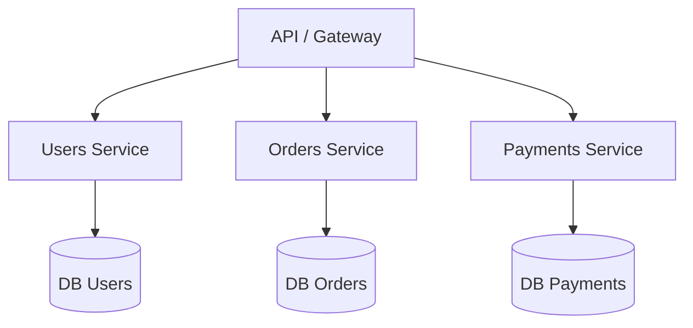

Este diagrama es conceptual. **Una base de datos por servicio es una práctica frecuente para reducir el acoplamiento. No es una ley.** Lo que el estilo realmente requiere es que otros servicios no accedan a tus tablas. Si dos «servicios» comparten un esquema y despliegan en un schedule coordinado, has cortado un monolito en procesos sin comprar independencia.

Las propiedades que importan:

- **Servicios independientes** con una responsabilidad delimitada.
- **Comunicación por red** — HTTP, gRPC o mensajes — en lugar de llamadas en proceso.
- **Despliegue independiente.** Pagos v2 puede salir mientras Pedidos sigue en v1.
- **Escalado independiente.** Catálogo puede tener veinte réplicas. Reportes puede tener dos.
- **Aislamiento.** Un crash de proceso ya no es automáticamente el crash de todos los demás.
- **Propiedad del equipo.** Un servicio es lo bastante pequeño para que un equipo lo construya, lo testee y lo opere. Azure lo señala como una restricción de diseño, no como un detalle de staffing.

La guía de arquitectura de Google Cloud hace el mismo punto sobre acoplamiento sin vender una topología: si diseñas servicios independientes débilmente acoplados, pueden liberarse y desplegarse independientemente, usar stacks distintas, y ser gestionados por equipos diferentes. Ese es el tema. GKE versus Cloud Run es una elección de runtime después de que el límite existe.

## Los problemas que intentan resolver

Los microservicios son una respuesta a presión operativa y organizacional específica. No son una forma más limpia de escribir una app CRUD.

### Escalado independiente

```text
Orders Service      --> 10 instances
Payments Service    -->  3 instances
Catalog Service     --> 20 instances
```

Catálogo recibe el tráfico de navegación. Pagos recibe el tráfico de checkout. Esas curvas no son iguales. Escalar todo el monolito desperdicia capacidad en las partes tranquilas y aún así puede no dar al hot path suficiente headroom si ese path está atrapado detrás de un cuello de botella compartido. Los servicios independientes te dejan poner dinero en el componente que realmente está caliente.

Esto es **escalabilidad**, no **rendimiento**. Dividir una llamada en tres saltos de red normalmente hace una sola petición más lenta. Escalas horizontalmente un cuello de botella. No haces la llamada a función más rápida.

### Despliegue independiente

```text
Deploy Payments Service v2

Orders Service continues running
Catalog Service continues running
Users Service continues running
```

Pagos puede liberar una regla de fraude sin abrir una ventana de cambio para catálogo. Eso solo se mantiene si el contrato entre Pagos y Pedidos es estable. Si cada release sigue requiriendo un deploy coordinado, pagaste el coste de distribuir el sistema y conservaste el release train del monolito.

### Aislamiento de fallos

Un crash en reportes no debería tumbar checkout. Azure es cuidadoso aquí: un microservicio no disponible no interrumpe toda la aplicación **siempre que los servicios upstream manejen el fallo**. El aislamiento no es una propiedad que obtienes dibujando cajas. Es una propiedad que implementas.

Esa implementación se ve así:

- **Timeouts** — no esperes para siempre a una dependencia.
- **Reintentos** — solo para trabajo idempotente, con jitter, o amplificas un outage.
- **Circuit breakers** — deja de llamar a un servicio que ya está fallando.
- **Bulkheads** — aísla pools de threads y conexiones para que una dependencia no pueda dejar sin recursos al resto.
- **Colas** — absorbe picos y desacopla la latencia. Mira [cómo usar Pub/Sub correctamente](/blog/google-cloud-pubsub-how-to-use-it-correctly/) cuando quien llama no necesita una respuesta en la misma petición.
- **Dead-letter queues** — los mensajes envenenados tienen que ir a algún sitio que no sea un bucle de reintentos infinito.
- **Rate limiting** — protege el servicio que todos los demás descubrieron a la vez.

Sin eso, tienes un monolito distribuido que falla de formas más interesantes.

## Ventajas — y lo que cuesta cada una

Fowler agrupa los beneficios como límites de módulo más fuertes, despliegue independiente, y diversidad tecnológica — y los costes como distribución, eventual consistency, y complejidad operativa. Cada ventaja a continuación sigue las mismas tres preguntas: qué problema resuelve, cuándo es útil, y qué pagas.

**Despliegue independiente.** Resuelve los releases sincronizados. Útil cuando partes del sistema cambian en relojes distintos. Coste: tienes que versionar contratos, gestionar ventanas de compatibilidad, y tener un sistema de CI/CD que pueda desplegar un servicio sin adivinar sobre los otros.

**Escalado independiente.** Resuelve la carga desigual. Útil cuando una capacidad es un orden de magnitud más caliente que el resto. Coste: más runtimes, más políticas de autoescalado, más formas de estar inesperadamente idle o inesperadamente saturado.

**Aislamiento de fallos.** Resuelve los crashes de destino compartido. Útil cuando los requisitos de disponibilidad difieren — pagos no es reportes. Coste: ahora diseñas para fallo parcial. Un timeout es una decisión de producto: ¿falla el checkout, o acepta el pedido y reconcilia después?

**Autonomía de equipo.** Resuelve la sobrecarga de coordinación en una org grande. Útil cuando los equipos ya son dueños de dominios y se comunican más por tickets que por un módulo compartido. Coste: la Ley de Conway funciona en ambas direcciones. Un mapa de servicios que no coincide con el organigrama se convierte en una agenda de reuniones.

**Límites de dominio más claros.** Resuelve el problema de «quién es dueño de esta tabla». Útil cuando los bounded contexts ya son visibles en el negocio. Coste: un límite equivocado es mucho más caro de mover a través de una red que a través de un paquete.

**Releases independientes / equipos alineados con el dominio.** Resuelve el congelamiento del viernes. Útil cuando la estrategia de producto realmente difiere por dominio. Coste: optimización local. Cada equipo despliega. El journey del usuario puede que no.

**Diversidad tecnológica.** Resuelve una restricción real: esta carga de trabajo necesita un runtime diferente, un datastore diferente, o una envolvente de latencia diferente. Útil cuando esa restricción está medida. Coste: contratación, librerías compartidas, baselines de seguridad, y on-call que ahora abarca lenguajes. «Queríamos probar Rust» no es una restricción.

AWS Well-Architected REL03-BP01 dice lo mismo en lenguaje de plataforma: segmentos más pequeños dan agilidad y te permiten invertir disponibilidad donde importa. También añaden latencia, debugging más difícil, y carga operativa. Elige la segmentación a propósito.

## El precio de ir distribuido

Los microservicios convierten problemas locales en problemas distribuidos. Esa es la prima de la que Fowler advirtió: despliegue automatizado, monitorización, manejo de fallos y eventual consistency son esfuerzo extra, y nadie tiene tiempo de sobra.

### Complejidad distribuida

Una llamada que solía ser así:

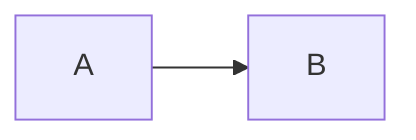

ahora puede fallar por un timeout, un paquete perdido, DNS, TLS, un load balancer, una instancia saturada, o porque el otro servicio simplemente no está ahí. Dentro de un monolito, `A → B` es una llamada a función. Sigues teniendo bugs. No tienes una nueva clase de bugs que llevan el nombre de la red.

### Observability

Una vez que una petición sale del proceso, logs sin una identidad compartida son tres opiniones sobre tres eventos diferentes. Necesitas:

- un **transactionId** para la operación de negocio
- un **traceId** y **spanId** para la ejecución
- logs estructurados
- tracing distribuido
- métricas que nombren el servicio, la ruta y la dependencia

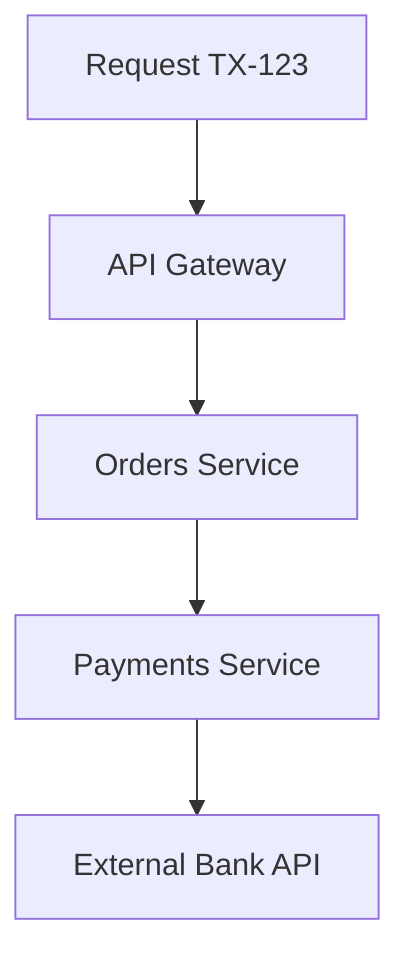

Esos identificadores te permiten reconstruir el camino. No son el mismo identificador. Un checkout puede mantener `TX-123` a través de un reintento que abre una segunda traza. Si tu equipo está a punto de dividir un proceso, lee [Un traceId no es un transactionId](/blog/traceid-is-not-transactionid/) antes de inventar un header casero. Azure lista logging centralizado, OpenTelemetry y tracing distribuido como parte de la arquitectura, no como pulido opcional.

### Debugging

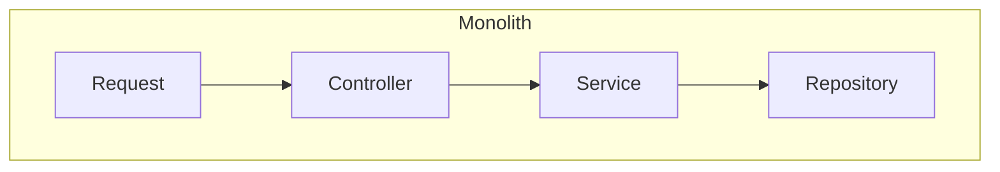

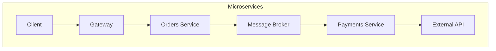

El primer camino cabe en un debugger. El segundo camino es un grafo causal. Sin trazas, estás haciendo grep por timestamp y esperando que los relojes estén de acuerdo. La lección temprana de Netflix en AWS fue el mismo fenómeno a nivel de red: APIs verbosas que estaban bien en un datacenter rápido se convirtieron en un defecto de diseño cuando la latencia varió.

### Consistencia de datos

Una compra ya no es una transacción:

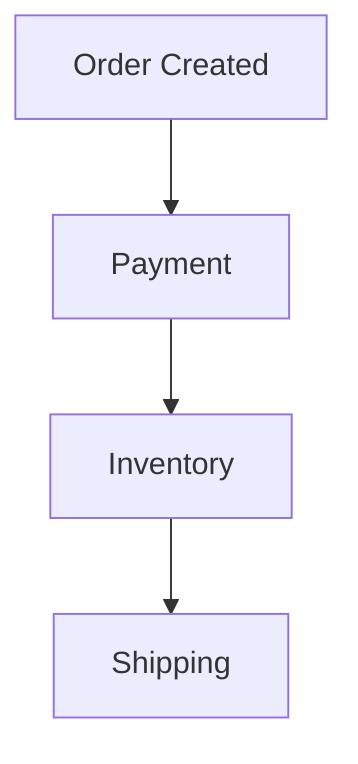

Pago tiene éxito. Inventario falla. Ahora tienes dinero y no stock, o reintentas inventario y decrementas dos veces. Las transacciones distribuidas son posibles y normalmente la herramienta equivocada. El diseño habitual es **eventual consistency**, una **saga** que puede compensar, y handlers **idempotentes** que sobreviven a **mensajes duplicados**. At-least-once delivery es la garantía habitual de los brokers. Efectos de negocio exactly-once es tu problema.

Un monolito puede ocultar esto detrás de un solo commit. Un sistema distribuido fuerza la conversación: ¿qué ve el cliente, qué reembolsamos, y cómo detectamos la inconsistencia después de que la ventana se haya cerrado?

## Comparación directa

Ninguna columna gana en abstracto. La celda correcta es la que coincide con tus restricciones.

| Aspecto                   | Monolito                                                 | Microservicios                                                           |
| ------------------------- | -------------------------------------------------------- | ------------------------------------------------------------------------ |
| Complejidad inicial       | Baja. Un proceso, un pipeline.                           | Alta. Pagas el coste de distribuir desde el día uno.                     |
| Despliegue                | Un artefacto. Rollback simple. Sincronizado por defecto. | Releases independientes si los contratos se mantienen. Muchos pipelines. |
| Escalado                  | Escala toda la app. Bien cuando la carga es uniforme.    | Escala el hot path. Desperdicia menos en la parte tranquila.             |
| Debugging                 | Un stack trace.                                          | Necesita trazas, correlación y un mapa de saltos.                        |
| Observabilidad            | Útil. No existencial.                                    | Existencial. Sin identidad compartida, no hay reconstrucción.            |
| Latencia                  | Llamadas en proceso.                                     | Cada salto añade tiempo y jitter.                                        |
| Fallos                    | Destino compartido en un proceso.                        | Fallo parcial — si diseñas para ello.                                    |
| Coste                     | Barato a pequeña escala.                                 | Más runtimes, más personas, más idle.                                    |
| Autonomía de equipo       | Baja a menos que los módulos sean estrictos.             | Alta cuando la propiedad coincide con los servicios.                     |
| Independencia tecnológica | Una stack, a menos que embebas workers.                  | Posible. Caro si lo haces por deporte.                                   |
| Consistencia de datos     | Commit único disponible.                                 | Eventual consistency es el default.                                      |
| DevOps                    | Una forma de desplegar.                                  | Una plataforma, o una pila de casos especiales.                          |
| Infraestructura           | Un servicio, una base de datos es común.                 | Gateway, mesh, broker, muchos datastores.                                |
| CI/CD                     | Un pipeline puede ser suficiente.                        | Un pipeline por servicio, más tests de contrato.                         |
| Testing                   | Los tests de integración se quedan locales.              | Testeas cada servicio y los espacios entre ellos.                        |

## Cuándo un monolito es la decisión correcta

### Caso 1 — MVP

Todavía estás descubriendo si alguien quiere el producto. La primera razón de Fowler para Monolith First es el clásico YAGNI: un sistema exitoso mal diseñado es un problema mejor que uno distribuido bellamente que nadie usa. Los microservicios añaden tiempo de ciclo cuando el tiempo de ciclo es la única ventaja que tienes.

### Caso 2 — Sistema interno

Una aplicación usada por cincuenta empleados, en horario de oficina, con un pico conocido. No tienes un problema de escala. Tienes un problema de entrega. Un monolito modular con una base de datos aburrida sobrevivirá a un service mesh que nadie de guardia entiende.

### Caso 3 — Equipo pequeño

De tres a cinco desarrolladores. Vogels usa casi el mismo ejemplo. Cada servicio que añades es un servicio que esas mismas cinco personas despliegan, vigilan y por el que se despiertan. La autonomía no está disponible. Sois el mismo equipo con más sombreros.

### Caso 4 — Dominio fuertemente acoplado

Checkout que debe decrementar stock, cobrar dinero, y escribir el pedido en una sola decisión de negocio. Si el negocio no puede tolerar «pagado pero no reservado» ni siquiera unos segundos, una saga distribuida no es un alarde de diseño. Es un defecto de producto. Mantén el límite de consistencia dentro de un solo proceso hasta que el dominio te diga que se ha dividido.

### Caso 5 — Escala baja

Unas pocas peticiones por segundo, o unos pocos cientos, en una forma de tráfico predecible. La distribución no creará headroom que necesites. Creará modos de fallo que no tienes personal para operar.

## Cuándo los microservicios se ganan su complejidad

### Caso 1 — Escala desigual

```text
Catalog --> 100 requests/sec
Orders  -->  20 requests/sec
Reports -->   2 requests/sec
```

El catálogo es el producto. Reportes es un sidecar. Escalarlos juntos es un coste y un riesgo. Extrae primero la pieza caliente, independientemente cacheable, independientemente poseída — no todo el mapa.

### Caso 2 — Equipos independientes

```text
Team Payments
Team Orders
Team Catalog
Team Identity
```

Cuando los equipos ya son dueños de dominios y despliegan en relojes distintos, los límites de servicio pueden coincidir con la propiedad. El argumento de Fowler sobre límites de módulo es mayormente un argumento de organización: la comunicación entre equipos es más formal, así que el software también debería serlo. Si tienes un equipo y cuatro servicios, inventaste un problema de coordinación.

### Caso 3 — Disponibilidad diferente

Pagos debe estar arriba. Reportes puede esperar. El pilar de fiabilidad de AWS usa esto como razón para segmentar: inviertes disponibilidad donde el cliente realmente la necesita. Un proceso compartido hace esa inversión roma.

### Caso 4 — Cadencia de despliegue diferente

Identity despliega semanalmente porque es cuidadoso. Catálogo despliega varias veces al día porque merchandising no espera. Si comparten un release, el equipo cuidadoso se convierte en el cuello de botella y el equipo rápido se convierte en el riesgo.

### Caso 5 — Dominios separados

El bounded context de Domain-Driven Design es la herramienta de diseño, no el organigrama. Un contexto tiene su propio modelo y lenguaje. «Pedido» en facturación no es «Pedido» en almacén. Cuando esos modelos son estables y los equipos pueden ser dueños de ellos, un servicio es una expresión física razonable del contexto. Cuando el modelo todavía se está moviendo, un módulo es más barato de renombrar.

## Dos casos documentados

### Netflix — un monolito que tuvo que convertirse en sistema distribuido

La migración a la nube de Netflix empezó en 2008. Para 2010, streaming corría en AWS. Facturación, un sistema financiero sujeto a SOX todavía atado a una gran infraestructura Oracle en su datacenter, se volvió completamente nativa en AWS el 4 de enero de 2016, después de un movimiento incremental de varios años.

El problema inicial no era «preferimos microservicios». Era escala, expansión global, y un entorno de computación donde instancias individuales fallan como evento normal. John Ciancutti, escribiendo un año después de la transición a AWS, llamó al diseño resultante su «Arquitectura Rambo»: cada sistema tiene que poder tener éxito por su cuenta. Si recomendaciones está caído, el sitio todavía responde — con títulos populares en lugar de personalizados. Si búsqueda está intolerablemente lenta, streaming sigue funcionando. Chaos Monkey existía para matar instancias a propósito, porque el manejo de fallos que no se usa no funciona en un outage real.

También pagaron el coste de distribuir el sistema inmediatamente. Las redes de datacenter habían sido lo bastante rápidas y fiables para tolerar APIs verbosas. La red de AWS tenía latencia más variable, así que las interacciones «over the wire» tenían que diseñarse, no asumirse. Para llamadas servicio-a-servicio construyeron Eureka (discovery) y Ribbon (load balancing del lado del cliente y resiliencia) porque, en 2010, la caja de herramientas cloud-native no existía. Un post posterior del Tech Blog es honesto sobre la siguiente generación de coste: más clientes IPC, más lenguajes, más features de resiliencia, y la dificultad de mantener todo eso correcto — que es por qué después movieron esa lógica hacia un service mesh.

Lo que obtuvieron: dominios de fallo independientes, escala horizontal para facturación después de separarse de Oracle (Cassandra para datos de suscriptores, MySQL donde todavía necesitaban ACID para cargos), y la capacidad de mantener flujos de cara al cliente mientras una dependencia se degradaba.

Lo que asumieron: complejidad operativa, resiliencia activa, y una migración larga. Facturación no cambió en un fin de semana. Migraron país por país, construyeron proxies de vuelta al datacenter, y todavía listaban el testing end-to-end poco automatizado como algo que subestimaron.

Copia el problema, no el logo. Netflix ya estaba operando a una escala y tamaño organizacional que hacía que la prima de microservicios fuera la factura más barata.

### Shopify — un monolito que siguió siendo monolito a propósito

Shopify es una de las bases de código Ruby on Rails más grandes que existen. Para 2019 había sido trabajada durante más de una década por más de mil desarrolladores. Para 2020 el monolito core era más de 2.8 millones de líneas de Ruby, con desarrollo continuo desde al menos 2006.

El monolito original no tenía límites reales. Envíos vivía junto a checkout y nada les impedía llamarse entre sí. En 2016 eso dejó de ser aceptable: cambios inocuos se propagaban en fallos de tests no relacionados, CI era lento, y un ingeniero nuevo en envíos también tenía que aprender pedidos y pagos. Los microservicios eran la respuesta de moda. La propia experiencia de Shopify decía que no hay una talla única, y que una flota de servicios significaría muchos pipelines, muchas huellas de infraestructura, llamadas de red para datos que actualmente consultaban localmente, y refactors coordinados entre despliegues.

Eligieron un **monolito modular**. A principios de 2017 un equipo empezó la «Componentización»: reorganizar ~6,000 clases Ruby por dominio (pedidos, envíos, inventario, facturación) en lugar de por capa de Rails, dar a cada componente una API pública y propiedad de sus datos, y medir violaciones de límites. Después construyeron Packwerk para rechazar pull requests que rompan el grafo de dependencias. En 2020 tenían 37 componentes en el monolito principal.

El beneficio que reportaron no fue «evitamos microservicios». Fue la capacidad de cambiar un motor de impuestos legacy porque las dependencias habían sido aisladas — un cambio que describieron como casi imposible antes. También obtuvieron propiedad más clara, triaje de excepciones por componente, y una base de código que podía absorber un upgrade de Rails como una tarea distribuida en lugar de una marcha de la muerte.

Shopify todavía corre un monolito grande porque el problema que tenían era modularidad, no una necesidad de runtimes independientes. Esa es la frase que la mayoría de las charlas de conferencia se saltan.

Una nota de apoyo de Amazon, no un segundo caso de estudio: Werner Vogels, escribiendo después de que los ingenieros de Prime Video documentaran una herramienta de monitorización de stream como monolito, repitió que no hay un estilo mandatorio. Si un conjunto de componentes siempre contribuyen a la misma respuesta, comparten necesidades de escalado y seguridad, y son propiedad de un equipo, combinarlos puede simplificar la arquitectura. También recordó a los lectores que Amazon mismo pasó de un monolito hacia servicios después del Distributed Computing Manifesto de 1998 — y que S3 creció de unos pocos microservicios en su lanzamiento en 2006 a más de 300. Ambas direcciones están documentadas. Ninguna es una religión.

## Un camino de e-commerce de una unidad desplegable a un híbrido

Empieza aquí. El dominio no está terminado. El equipo es un equipo. Checkout, catálogo y pagos comparten una transacción más a menudo de lo que no.

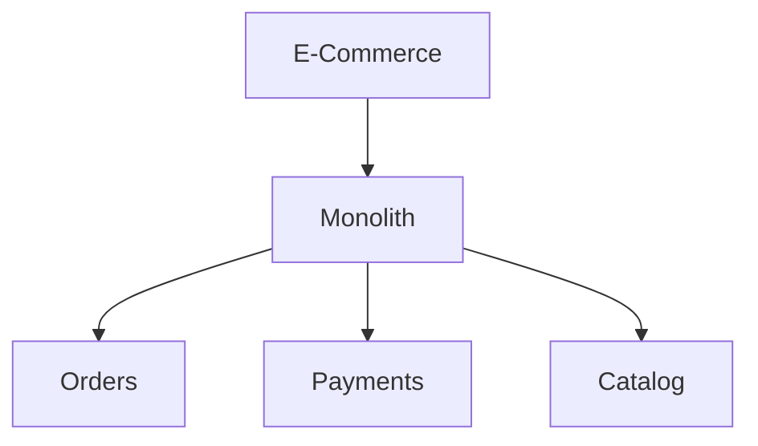

Esta es una buena decisión. Puedes desplegar un carrito. Puedes escribir un test de integración para «pagar y decrementar stock». Puedes cambiar el significado de «pedido» sin una API versionada.

El tráfico llega, y no es uniforme:

```text
Catalog  = 80%
Orders   = 15%
Payments =  5%
```

Catálogo es read-heavy, cacheable, y propiedad de un equipo orientado a merchandising que quiere desplegar cambios de ranking sin tocar cargos. Pagos sigue estrechamente atado a pedidos y todavía quiere una historia de consistencia fuerte.

**Problema:** la carga de catálogo y la tasa de cambio de catálogo dominan. **Restricción:** no puedes escalar o liberar catálogo sin arrastrar a pagos. **Alternativas:** escalar todo el monolito; extraer catálogo; extraer todo. **Trade-offs:** la extracción añade un salto de red y un problema de invalidación de caché; no hacer nada mantiene el hot path acoplado al path cuidadoso. **Decisión:** extraer solo catálogo. **Justificación:** es la única capacidad con escala independiente demostrada, cadencia independiente, y un límite que ya puedes señalar en el monolito modular.

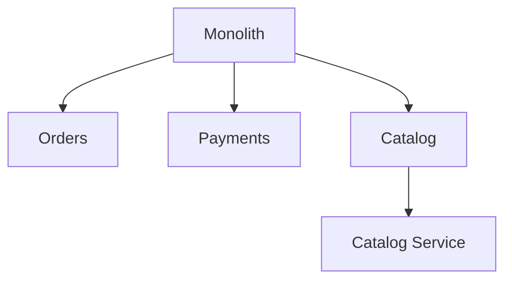

Ahora tienes un híbrido. Eso no es una migración incompleta. Es una arquitectura que gastó complejidad donde apareció una métrica. Pedidos y pagos pueden quedarse juntos hasta que aparezca una segunda métrica.

## Monolith First

La estrategia de Fowler, en una línea: **empieza con un monolito modular y extrae servicios cuando hay una necesidad demostrada.**

Casi toda historia exitosa de microservicios que había oído empezó como un monolito que se hizo demasiado grande. Casi todo sistema construido como microservicios desde cero acabó en problemas serios. La prima — el coste de gestionar un conjunto de servicios — frena a un equipo que debería estar aprendiendo si el producto importa. La segunda razón es peor: los microservicios solo funcionan con límites estables, e incluso arquitectos experimentados se equivocan al principio. Refactorizar un paquete es barato. Refactorizar un límite de servicio es una migración.

Cuándo funciona: el equipo tiene la disciplina para mantener los módulos honestos, el dominio todavía se está descubriendo, y estás dispuesto a extraer después. Cuándo falla: el monolito es un Big Ball of Mud, nadie es dueño de una API de módulo, y «lo dividiremos después» significa «nunca podremos». Fowler no es romántico con esto. Ha oído muchas descomposiciones que se convirtieron en un lío, y solo unas pocas extracciones graduales que funcionaron — esas empezaron de un diseño modular relativamente bueno.

Lo que el monolito necesita si quieres la opción de evolucionar:

- **Monolito modular** — dominios, no capas, como eje primario.
- **Bounded contexts** — un nombre y un modelo por dominio, aunque compartan proceso.
- **Hexagonal / Clean Architecture** — dominio en el centro, adaptadores en el borde, para que un módulo pueda convertirse después en proceso sin reescribir las reglas.
- **Inversión de dependencias** — el dominio no importa el framework web ni el ORM.
- **Límites de módulo que se imponen** — Shopify necesitó Wedge, después Packwerk, porque la convención no era suficiente. Si cruzar un límite es una llamada a función que cualquiera puede escribir, alguien la escribirá.

El contraargumento que Fowler registra es real: empezar con servicios entrena a la org en el ritmo operativo, y dividir un monolito disciplinado después requiere más disciplina de la que la mayoría de equipos tienen. Su propia cobertura: no empieces con microservicios a menos que el equipo ya tenga experiencia operándolos. Trata eso como una restricción de staffing, no como un rasgo de personalidad.

## Un árbol de decisión

Usa esto como un filtro, no como un veredicto.

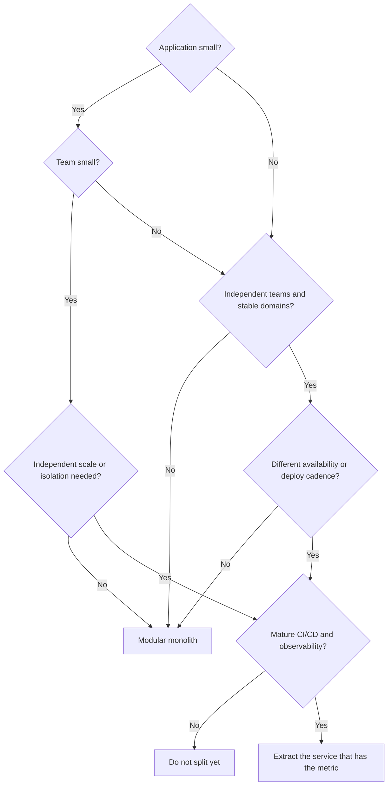

Si no puedes explicar qué caja produjo «extraer», no estás extrayendo. Estás decorando.

## Razones equivocadas, señales reales

Estas no son razones suficientes para dividir un proceso:

- **«Es más moderno.»** Moderno no es un requisito. Operable sí.
- **«El CTO pidió microservicios.»** Pregunta qué métrica quiere mover.
- **«Netflix los usa.»** Netflix también pasó años construyendo Eureka, Ribbon, Chaos Monkey, y después un mesh, porque fallo de instancias y streaming global eran el trabajo. Probablemente tú no estás en ese trabajo.
- **«Estamos usando Kubernetes.»** Kubernetes corre monolitos. Un scheduler no es una arquitectura.
- **«Queremos aprender microservicios.»** Apréndalos en un sandbox, no en checkout.
- **«Queremos lenguajes diferentes.»** Eso es un coste de contratación y plataforma. Raramente es un requisito de producto.
- **«El monolito es feo.»** La fealdad es un problema de modularidad. La distribución no quita lo feo. Lo replica.

Fowler llamó a la ansiedad _Microservice Envy_. La mayoría de sistemas, según su guía, deberían construirse como una sola aplicación con modularidad real. Ni siquiera consideres servicios hasta que el sistema sea demasiado complejo para gestionar como monolito.

Una checklist para cuando una arquitectura distribuida realmente está sobre la mesa:

- Un componente tiene una necesidad demostrada de escalado independiente.
- Equipos independientes son dueños de dominios separados y ya despliegan en relojes distintos.
- Los bounded contexts son lo bastante estables para convertirse en contratos.
- Necesitas despliegue independiente por una razón concreta de release-train.
- Los requisitos de disponibilidad o aislamiento difieren por capacidad.
- Un fallo en un área actualmente tumba algo más importante.
- El volumen se concentra en un componente específico, no en «la app».
- Se requiere una tecnología diferente, no simplemente se desea.
- La organización puede operar un sistema distribuido un jueves malo.
- La observabilidad ya es lo bastante buena para seguir una petición hoy.
- CI/CD puede desplegar un artefacto de forma segura. Va a necesitar desplegar muchos.

Una casilla marcada es un olor, no un mandato. Tres casillas marcadas y una historia de observabilidad que falta es una razón para parar. AWS es explícito que incluso cuando empiezas con un monolito, deberías mantenerlo lo bastante modular para evolucionar. Ese es el prerrequisito, no la ocurrencia tardía.

## La arquitectura como evolución

Las arquitecturas pueden cambiar. La regla de oro de Vogels es revisar el diseño con cada orden de magnitud de crecimiento. Shopify describió la misma idea como una escala evolutiva: monolito, después monolito modular, después divisiones orientadas a servicios, cada una separada por un periodo de dolor que te dice que la forma actual ha quedado pequeña.

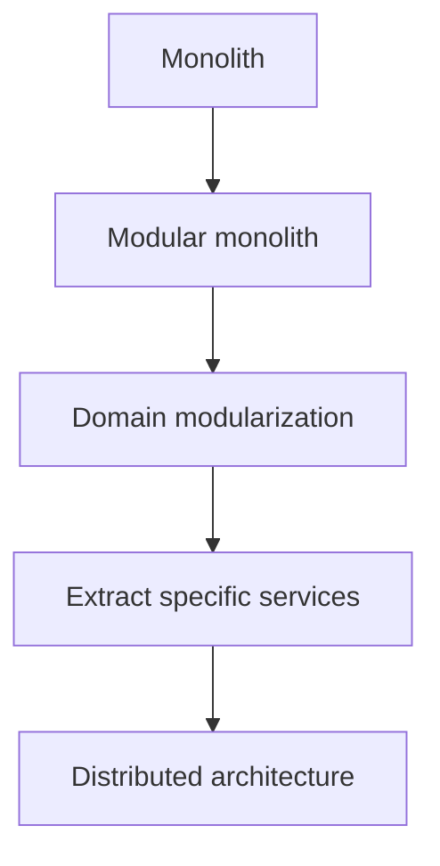

El patrón de migración con nombre es el **Strangler Fig**. La metáfora de Fowler es una enredadera que crece alrededor de un árbol huésped y eventualmente lo reemplaza. En software: añade costuras, construye el nuevo comportamiento junto al viejo, redirige una porción del tráfico, repite. No anuncias una reescritura de dos años y esperas que el negocio pause. La guía de fiabilidad de AWS recomienda este patrón para descomponer un monolito, incluyendo arquitectura de transición que después borrarás. Esa capa de transición no es desperdicio. Es cómo sigues desplegando.

Una reescritura big-bang es la última opción, no la primera. Los reemplazos parecen fáciles de especificar y normalmente no lo son. El comportamiento del sistema viejo solo es parcialmente deseado, y los usuarios no esperarán a la paridad de funcionalidades en un legacy congelado.

La conclusión es contextual porque el problema es contextual.

- Sistemas pequeños, MVPs, equipos pequeños, dominios simples: monolito modular.
- Sistemas grandes con equipos independientes, escala desigual, o necesidades de disponibilidad distintas: considera servicios, un límite a la vez.
- Organizaciones sin madurez DevOps y de observabilidad: no importes un modelo operativo distribuido para evitar una conversación de diseño.

> La mejor arquitectura no es la que tiene más servicios. Es la que resuelve el problema con la menor complejidad necesaria.

## Antes de extraer otro servicio, pregúntate

1. ¿Qué métrica mejora si esto es un proceso separado, y qué métrica empeora?
2. ¿Es esto un bounded context estable, o un paquete que no he terminado de nombrar?
3. ¿Puedo imponer este límite _dentro_ del monolito primero?
4. ¿Un equipo diferente es dueño de esto, y ya despliegan en un reloj diferente?
5. ¿Puedo seguir una petición de usuario a través del nuevo salto con la observabilidad que tengo hoy?
6. ¿Qué pasa cuando el nuevo servicio es lento, duplicado o está caído — en términos de producto, no en términos de infraestructura?
7. ¿Estoy resolviendo escala, o estoy resolviendo una discusión de release-train que una API de módulo también resolvería?
8. ¿Quién está de guardia para el espacio entre los servicios?
9. Si esta extracción está mal, ¿cómo la deshago?

Si no puedes responder «qué problema estoy resolviendo, y qué arquitectura lo resuelve con la menor complejidad necesaria», no dividas el proceso. Traza el límite. Mide. Después decide.

La arquitectura correcta depende del problema, no de la moda.

## Fuentes

- Martin Fowler, [Monolith First](https://martinfowler.com/bliki/MonolithFirst.html)
- Martin Fowler, [Microservice Trade-Offs](https://martinfowler.com/articles/microservice-trade-offs.html)
- Martin Fowler, [Microservice Premium](https://martinfowler.com/bliki/MicroservicePremium.html)
- Martin Fowler, [Strangler Fig Application](https://martinfowler.com/bliki/StranglerFigApplication.html)
- James Lewis and Martin Fowler, [Microservices](https://martinfowler.com/articles/microservices.html)
- AWS Well-Architected, [REL03-BP01 Choose how to segment your workload](https://docs.aws.amazon.com/wellarchitected/latest/reliability-pillar/rel_service_architecture_monolith_soa_microservice.html)
- AWS, [Implementing Microservices on AWS](https://docs.aws.amazon.com/whitepapers/latest/microservices-on-aws/microservices-on-aws.html)
- Microsoft Azure Architecture Center, [Microservices architecture style](https://learn.microsoft.com/en-us/azure/architecture/guide/architecture-styles/microservices)
- Google Cloud Architecture Center, [Patterns for scalable and resilient apps](https://docs.cloud.google.com/architecture/scalable-and-resilient-apps)
- Google Cloud, [GKE and Cloud Run](https://docs.cloud.google.com/kubernetes-engine/docs/concepts/gke-and-cloud-run)
- Netflix Technology Blog, [5 Lessons We've Learned Using AWS](https://netflixtechblog.com/5-lessons-weve-learned-using-aws-1f2a28588e4c)
- Netflix Technology Blog, [Netflix Billing Migration to AWS](https://netflixtechblog.com/netflix-billing-migration-to-aws-451fba085a4)
- Netflix Technology Blog, [Zero Configuration Service Mesh with On-Demand Cluster Discovery](https://netflixtechblog.com/zero-configuration-service-mesh-with-on-demand-cluster-discovery-ac6483b52a51)
- Shopify Engineering, [Deconstructing the Monolith](https://shopify.engineering/deconstructing-monolith-designing-software-maximizes-developer-productivity)
- Shopify Engineering, [Under Deconstruction: The State of Shopify's Monolith](https://shopify.engineering/shopify-monolith)
- Werner Vogels, [Monoliths are not dinosaurs](https://www.allthingsdistributed.com/2023/05/monoliths-are-not-dinosaurs.html)
