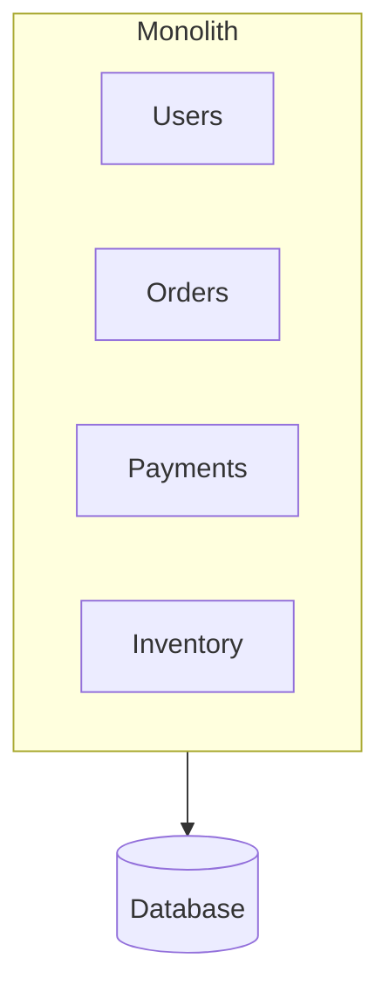
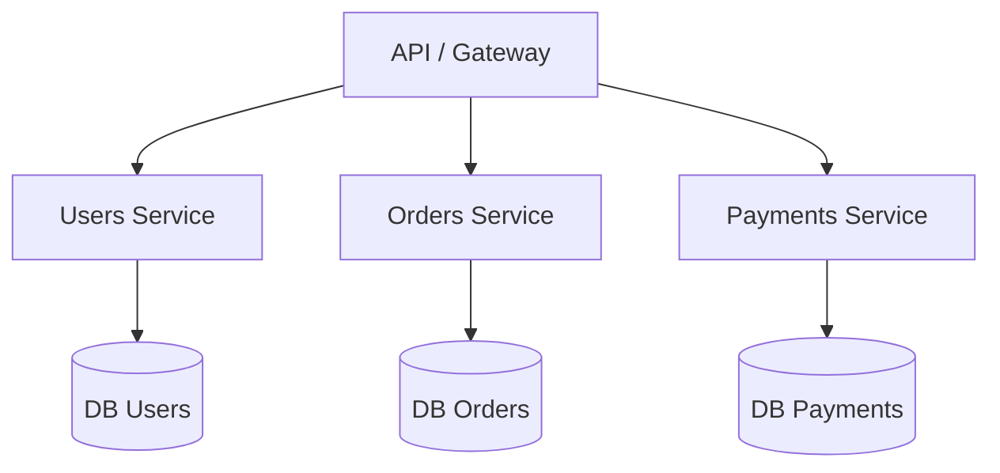
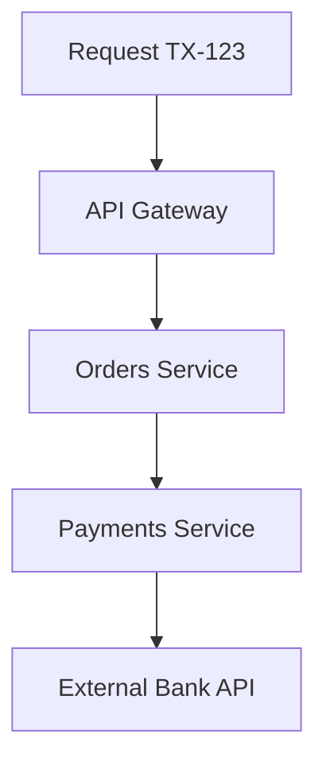
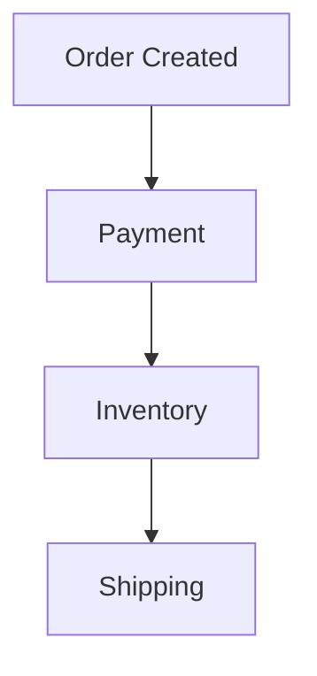
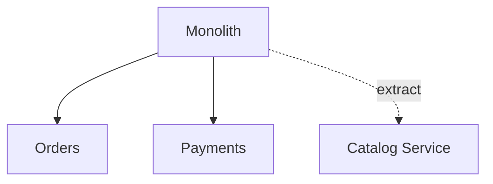
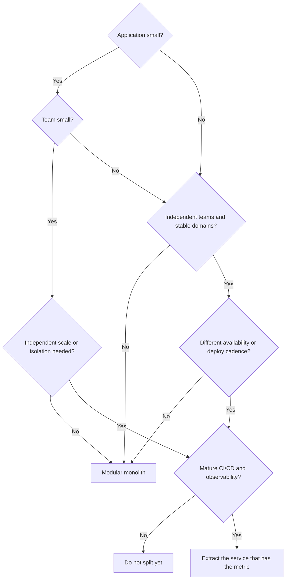

The catalog team wants to ship on Friday. Payments is frozen until Monday because a schema change lives in the same artifact. Nobody is wrong. The architecture is.

Teams treat microservices as the grown-up form of a monolith, the way they treat Kubernetes as the grown-up form of a VM. Architecture is not a career ladder.

**Microservices are not the required evolution of a monolith.**

Choose by the problems you have to solve: domain complexity, team size and structure, how uneven the load is, how often you deploy, how independently components must change, availability and isolation, infrastructure cost, DevOps maturity, observability, operational complexity, and what the business needs this quarter. Fashion is not on that list.

Most organizations start with one deployable application. Some later extract services. Some never should. The interesting question is not "which architecture is better." It is:

> When should I build a monolith, and when do I actually need microservices?

## What a monolith actually is

A monolith is a system delivered as **one deployable unit**. User management, orders, payments, and inventory can live in the same codebase, the same process, and usually the same release. "Monolith" describes the deployment and process boundary. It does not describe code quality.

Inside that process, modules talk with function calls. They share memory, a runtime, and typically one primary database. A request enters a controller, walks through services and repositories, and either commits or rolls back in one transaction. There is no network hop between "orders" and "payments" unless you put one there.

A messy Rails app is a monolith. A carefully modular NestJS, Spring, or .NET application with explicit module APIs is also a monolith. Martin Fowler is explicit: in the microservices conversation, "monolith" means an application built as a single unit, not an insult for tangled code.

Three shapes get collapsed into one word:

- **Traditional monolith** — one codebase, weak internal boundaries, packages organized by technical layer. Anything can call anything.
- **Modular monolith** — still one deployable, but domains own their code and data access. Orders talks to Payments through a public module API, not by reaching into Payment's tables.
- **Well-designed monolith** — modular boundaries plus inversion of dependencies: domain logic does not depend on HTTP, the ORM, or the message broker. Hexagonal / ports-and-adapters and Clean Architecture are the usual names for that discipline.

The modular monolith is the version worth defending. Shopify's engineering team defined it as a system where all of the code powers a single application and there are strictly enforced boundaries between domains. You keep one test pipeline, one deploy, and in-process calls. You give up the fantasy that "one repo" means "no design."

## Why a monolith is often the correct first system

**Problem:** you need a working product, not a platform. **Constraint:** a small team, an unfinished domain, and a budget that does not include a platform group. **Trade-off:** the monolith concentrates change risk later; microservices concentrate operational risk now. **Decision:** start modular and together — you do not yet know the boundaries you would be freezing into network contracts.

| Concern     | In a monolith                                                                                            |
| ----------- | -------------------------------------------------------------------------------------------------------- |
| Development | One repo, one runtime, one set of types. A new engineer follows a request without opening four services. |
| Testing     | Boot the app and a database; assert payment and inventory in one process.                                |
| Debugging   | A stack trace is a stack trace. You do not need a trace backend to answer "which function threw."        |
| Deployment  | One artifact, one health check, one rollback. Fowler notes some orgs ship a monolith many times a day.   |
| Calls       | A local jump. It fails if the process fails — not because DNS expired or TLS timed out.                  |
| Cost        | One service plus one database. Vogels: a five-engineer startup may choose this because it is operable.   |

A function call is not a remote procedure. Remote procedures are slow relative to in-process calls, and they can fail even when both codepaths are correct. Fowler treats that as the first cost of playing the distribution card, not as an advanced topic you get to later.

## The problems that appear later

"The monolith does not scale" is the least useful diagnosis in this debate. Plenty of monoliths scale vertically and horizontally just fine. The failures that actually show up are more specific.

**High coupling.** Shipping rates call tax rates because both functions were in scope. Shopify described the result: a change in tax calculation could change shipping, and it was not obvious why.

**Changes that cannot be isolated.** A one-line fix in inventory still goes through the full test suite and the full release train.

**A full deploy for a small change.** You wanted to tweak a catalog ranking. You shipped payments again.

**Scale-the-whole-app.** Catalog is hot. Reports are cold. You add instances of everything.

**Blast radius.** A memory leak in reporting can starve checkout threads in the same process. Isolation is a process boundary. You did not buy one.

**Dependency upgrades.** The payments library needs a runtime the catalog module is not ready for. Everyone upgrades together, or nobody does.

**Large-team friction.** Onboarding requires the whole map. Shopify's 2016 tripwire: a new engineer on shipping also had to understand orders and payments.

**A shared database that became the real API.** Every module reads every table. The schema is a public contract with no versioning and no owner.

**Big Ball of Mud.** Boundaries existed on a whiteboard. In the repo they are comments. Fowler notes that sneaking around a module barrier is a useful tactical shortcut — and that done widely, it trashs productivity.

> The problem is not that the application is monolithic. The problem is that its internal boundaries are wrong, unenforced, or both.

If you extract services from a Big Ball of Mud without first drawing those boundaries, you get a distributed Big Ball of Mud. AWS's reliability guidance has a name for that failure mode: the microservice _Death Star_.

## What microservices actually are

James Lewis and Martin Fowler described microservices as independently deployable services organized around business capabilities, communicating over the network, and usually owning their own data. Microsoft's Azure Architecture Center uses the same shape: small, autonomous services, each implementing a single business capability inside a bounded context, deployed independently, talking through APIs or events.

This diagram is conceptual. **A database per service is a frequent practice for reducing coupling. It is not a law.** What the style actually requires is that other services do not reach into your tables. If two "services" share a schema and deploy on a coordinated schedule, you have cut a monolith into processes without buying independence.

The properties that matter: independent services with a delimited responsibility; network communication (HTTP, gRPC, or messages) instead of in-process calls; independent deployment and scaling; isolation so a process crash is not everyone else's crash; team ownership small enough that one team can build, test, and run the service.

Google Cloud's architecture guidance makes the same coupling point without selling a topology: loosely coupled independent services can be released independently, use different stacks, and be managed by different teams. GKE versus Cloud Run is a runtime choice after the boundary exists.

## The problems they try to solve

Microservices are a response to specific operational and organizational pressure. They are not a cleaner way to write a CRUD app.

**Independent scaling.** Catalog takes browse traffic. Payments takes checkout. Those curves are not the same. This is **scalability**, not **performance**: splitting a call into three network hops usually makes a single request slower. You scale out a bottleneck. You do not make the function call faster.

**Independent deployment.** Payments can release a fraud rule without opening a change window for catalog. That only holds if the contract is stable. If every release still requires a lockstep deploy, you paid the distributed tax and kept the monolith's release train.

**Fault isolation.** A crash in reporting should not take down checkout. Azure is careful: an unavailable microservice does not disrupt the whole application **as long as upstream services handle the fault**. Isolation is a property you implement: timeouts, retries only for idempotent work, circuit breakers, bulkheads, queues (see [how to use Pub/Sub correctly](/blog/google-cloud-pubsub-how-to-use-it-correctly/) when the caller does not need an answer in the same request), dead-letter queues, and rate limiting. Without those, you have a distributed monolith that fails in more interesting ways.

## Advantages — and what each one costs

Fowler groups the benefits as stronger module boundaries, independent deployment, and technology diversity — and the costs as distribution, eventual consistency, and operational complexity.

| Advantage                 | Solves                            | Useful when                                    | You pay                                                            |
| ------------------------- | --------------------------------- | ---------------------------------------------- | ------------------------------------------------------------------ |
| Independent deployment    | Lockstep releases                 | Parts change on different clocks               | Versioned contracts, compatibility windows, many pipelines         |
| Independent scaling       | Uneven load                       | One capability is an order of magnitude hotter | More runtimes, more autoscaling, more ways to be idle or thrashed  |
| Fault isolation           | Shared-fate crashes               | Availability requirements differ               | Partial failure as a product decision                              |
| Team autonomy             | Coordination overhead             | Teams already own domains                      | Conway's Law in both directions                                    |
| Clearer domain boundaries | "Who owns this table"             | Bounded contexts are already visible           | A wrong boundary is expensive to move across a network             |
| Technology diversity      | A measured runtime/datastore need | The constraint is real, not "we wanted Rust"   | Hiring, shared libraries, security baselines, multilingual on-call |

At small scale a monolith is cheaper and simpler to ship: one process, one pipeline, in-process calls, single-commit consistency. Microservices invert that: you buy the distributed premium on day one, every hop adds latency, debugging needs traces, and eventual consistency is the default. AWS Well-Architected REL03-BP01 says the same thing: smaller segments give agility and let you invest availability where it matters. They also add latency, harder debugging, and operational burden.

## The price of going distributed

Microservices turn local problems into distributed ones. Fowler's premium: automated deployment, monitoring, failure handling, and eventual consistency are extra effort, and nobody has spare acres of time.

A call that used to be `A → B` in-process can now fail because of a timeout, a dropped packet, DNS, TLS, a load balancer, a saturated instance, or the other service simply not being there. You still have bugs. You also have a new class of bugs named after the network.

Once a request leaves the process, logs without a shared identity are three opinions about three different events. You need a **transactionId** for the business operation, a **traceId** and **spanId** for the execution, structured logs, distributed tracing, and metrics that name the service, the route, and the dependency.

Those identifiers let you reconstruct the path. They are not the same identifier. A checkout can keep `TX-123` across a retry that opens a second trace. If your team is about to split a process, read [traceId is not transactionId](/blog/trace-id-is-not-transaction-id/) before you invent a house header. Azure lists centralized logging, OpenTelemetry, and distributed tracing as part of the architecture, not as optional polish.

Without traces, debugging is grepping by timestamp and hoping clocks agree. Netflix's early AWS lesson was the same phenomenon at the network layer: chatty APIs that were fine in a fast datacenter became a design defect once latency varied.

A purchase is no longer one transaction:

Payment succeeds. Inventory fails. You now have money and no stock, or you retry inventory and decrement twice. Distributed transactions are possible and usually the wrong tool. The usual design is **eventual consistency**, a **saga** that can compensate, and **idempotent** handlers that survive **duplicate messages**. At-least-once delivery is the common broker guarantee. Exactly-once business effects are your problem. A monolith can hide this behind a single commit. A distributed system forces the conversation: what does the customer see, what do we refund, and how do we detect the inconsistency after the window has closed?

## When a monolith is the right call

**MVP.** You are still finding out whether anyone wants the product. A poorly designed successful system is a better problem than a beautifully distributed unused one. Microservices add cycle time when cycle time is the only advantage you have.

**Internal system.** Fifty employees, office hours, a known peak. You have a delivery problem, not a scale problem. A modular monolith with a boring database will outlive a service mesh nobody on-call understands.

**Small team.** Three to five developers. Vogels uses almost the same example. Every service you add is a service those same five people deploy, watch, and wake up for.

**Tightly coupled domain.** Checkout that must decrement stock, take money, and write the order in one business decision. If the business cannot tolerate "paid but not reserved" even for a few seconds, a distributed saga is a product defect. Keep the consistency boundary inside one process until the domain tells you it has split.

**Low scale.** A few requests per second, or a few hundred, on a predictable shape of traffic. Distribution will not create headroom you need. It will create failure modes you do not have staff to operate.

## When microservices earn their complexity

**Uneven scale.** Catalog at 100 requests/sec, reports at 2. Extract the hot, independently cacheable, independently owned piece first — not the whole map.

**Independent teams.** When teams already own domains and ship on different clocks, service boundaries can match ownership. Fowler's module-boundary argument is mostly an org argument. If you have one team and four services, you invented a coordination problem.

**Different availability.** Payments must stay up. Reports can wait. AWS's reliability pillar uses this as a reason to segment: you invest availability where the customer actually needs it.

**Different deploy cadence.** Identity ships weekly because it is careful. Catalog ships several times a day because merchandising will not wait. If they share a release, the careful team becomes the bottleneck and the fast team becomes the risk.

**Separated domains.** A bounded context has its own model and language. "Order" in billing is not "Order" in warehouse. When those models are stable and the teams can own them, a service is a reasonable physical expression of the context. When the model is still moving, a module is cheaper to rename.

## Two documented cases

### Netflix — a monolith that had to become a distributed system

Netflix's cloud migration began in 2008. By 2010, streaming ran on AWS. Billing, a SOX-sensitive financial system still tied to a giant Oracle estate in their datacenter, became fully AWS-native on 4 January 2016, after a multi-year incremental move.

The starting problem was not "we prefer microservices." It was scale, global expansion, and a computing environment where individual instances fail as a normal event. John Ciancutti, writing a year into the AWS transition, called the resulting design their "Rambo Architecture": each system has to be able to succeed on its own. If recommendations are down, the site still responds — with popular titles instead of personalized ones. If search is intolerably slow, streaming still works. Chaos Monkey existed to kill instances on purpose, because unused failure handling does not work in a real outage.

They also paid the distributed bill immediately. Datacenter networks had tolerated chatty APIs; AWS latency did not, so "over the wire" interactions had to be designed. They built Eureka (discovery) and Ribbon (client-side load balancing) because, in 2010, the cloud-native toolbox did not exist. A later Tech Blog post is honest about the next cost: more IPC clients, more languages, more resilience features — which is why they later moved that logic toward a service mesh.

What they got: independent failure domains, horizontal scale for billing after the Oracle split (Cassandra for subscriber data, MySQL where they still needed ACID for charges), and customer-facing flows that stayed up while a dependency degraded. What they took on: operational complexity, active resilience, and a long migration — country by country, with proxies back to the datacenter, and under-automated end-to-end testing they underestimated.

Copy the problem, not the logo. Netflix was already at a scale where the microservice premium was the cheaper bill.

### Shopify — a monolith that stayed a monolith on purpose

- One of the largest Ruby on Rails codebases in existence: over 2.8 million lines by 2020, continuous development since at least 2006, more than a thousand developers by 2019 — still one deployable.
- In 2016 the original monolith had no real boundaries. Innocuous shipping changes cascaded into unrelated test failures; a new engineer on shipping also had to learn orders and payments.
- Microservices were the fashionable answer. Shopify chose a **modular monolith**: Componentization (~6,000 Ruby classes reorganized by domain), then Packwerk to reject pull requests that break the dependency graph. By 2020 they had 37 components in the main monolith.
- The payoff they reported was not "we avoided microservices." Isolated dependencies made it possible to swap a legacy tax engine — a change they described as nearly impossible before — plus clearer ownership and exception triage by component.
- They still run a large monolith because the problem they had was modularity, not a need for independent runtimes. That is the sentence most conference talks skip.

Werner Vogels, writing after Prime Video documented a stream-monitoring tool as a monolith, repeated that there is no mandated style. If components always contribute to the same response, share scaling and security needs, and are owned by one team, combining them can simplify the architecture. Amazon itself moved from a monolith toward services after the 1998 Distributed Computing Manifesto — and S3 grew from a few microservices at launch in 2006 to more than 300. Both directions are documented. Neither is a religion.

## An e-commerce path from one deployable to a hybrid

Start here. The domain is unfinished. The team is one team. Checkout, catalog, and payments share a transaction more often than they don't.

This is a good decision. You can ship a cart. You can write one integration test for "pay and decrement stock." You can change the meaning of "order" without a versioned API.

Traffic arrives, and it is not even: catalog 80%, orders 15%, payments 5%. Catalog is read-heavy, cacheable, and owned by a merchandising-facing team that wants to deploy ranking changes without touching charges. Payments is still tightly bound to orders and still wants a strong consistency story.

**Problem:** catalog load and catalog change rate dominate. **Constraint:** you cannot scale or release catalog without dragging payments. **Decision:** extract catalog only. **Justification:** it is the one capability with demonstrated independent scale, independent cadence, and a boundary you can already point to in the modular monolith.

You now have a hybrid. That is not an incomplete migration. It is an architecture that spent complexity where a metric appeared. Orders and payments can stay together until a second metric appears.

Fowler's strategy, in one line: **start with a modular monolith and extract services when there is a demonstrated need.** Almost every successful microservice story he had heard started as a monolith that got too big; almost every system built as microservices from scratch ended in serious trouble. Microservices only work with stable boundaries. Refactoring a package is cheap. Refactoring a service boundary is a migration. That is YAGNI applied to process boundaries — once.

What the monolith needs if you want the option to evolve: domains as the primary axis; bounded contexts even if they share a process; hexagonal / Clean Architecture so a module can later become a process; dependency inversion; module boundaries that are enforced. Shopify needed Packwerk because convention was not enough.

Fowler's hedge: do not start with microservices unless the team already has experience running them. Architectures are allowed to change — Vogels revisits the design with every order of magnitude of growth. The named migration pattern is the **Strangler Fig**: add seams, build the new behavior beside the old, route a slice of traffic, repeat. AWS recommends it, including transitional architecture you will later delete. A big-bang rewrite is the last option.

## A decision tree

Use this as a filter, not as a verdict.

If you cannot explain which box produced "extract," you are not extracting. You are decorating.

## Wrong reasons, real signals

These are not sufficient reasons to split a process:

- **"It is more modern."** Modern is not a requirement. Operable is.
- **"The CTO asked for microservices."** Ask which metric they want to move.
- **"Netflix uses them."** Netflix also spent years building Eureka, Ribbon, Chaos Monkey, and later a mesh, because instance failure and global streaming were the job. You are probably not on that job.
- **"We are using Kubernetes."** Kubernetes runs monoliths. A scheduler is not an architecture.
- **"We want to learn microservices."** Learn them in a sandbox, not in checkout.
- **"We want different languages."** That is a hiring and platform cost. It is rarely a product requirement.
- **"The monolith is ugly."** Ugliness is a modularity problem. Distribution does not remove ugly. It replicates it.

Fowler called the eagerness _Microservice Envy_. Most systems, in his guideline, should be a single application with real modularity.

A distributed architecture is on the table when several of these are true: demonstrated independent scale; independent teams already shipping on different clocks; stable bounded contexts; a concrete release-train reason; availability that differs by capability; a failure that currently takes down something more important; volume concentrated in one component; a different technology required, not desired; an org that can operate a distributed system on a bad Thursday; observability good enough to follow one request today; CI/CD that can already ship one artifact safely.

One checked box is a smell, not a mandate. Three checked boxes and a missing observability story is a reason to stop.

Small systems, MVPs, small teams: modular monolith. Large systems with independent teams, uneven scale, or distinct availability: consider services, one boundary at a time. Organizations without DevOps and observability maturity: do not import a distributed operating model to avoid a design conversation.

> The best architecture is not the one with the most services. It is the one that solves the problem with the least necessary complexity.

## Before you extract another service, ask yourself

1. What metric moves if this is a separate process, and what metric gets worse?
2. Is this a stable bounded context, or a package I have not finished naming?
3. Can I enforce this boundary _inside_ the monolith first?
4. Does a different team own this, and do they already ship on a different clock?
5. Can I follow one user request across the new hop with the observability I have today?
6. What happens when the new service is slow, duplicated, or down — in product terms, not in infrastructure terms?
7. Am I solving scale, or am I solving a release-train argument that a module API would also solve?
8. Who is on-call for the space between the services?
9. If this extraction is wrong, how do I put it back?

If you cannot answer "what problem am I solving, and which architecture solves it with the least necessary complexity?", do not split the process. Draw the boundary. Measure. Then decide.

The correct architecture depends on the problem, not on the fashion.

## Sources

- Martin Fowler, [Monolith First](https://martinfowler.com/bliki/MonolithFirst.html)
- Martin Fowler, [Microservice Trade-Offs](https://martinfowler.com/articles/microservice-trade-offs.html)
- Martin Fowler, [Microservice Premium](https://martinfowler.com/bliki/MicroservicePremium.html)
- Martin Fowler, [Strangler Fig Application](https://martinfowler.com/bliki/StranglerFigApplication.html)
- James Lewis and Martin Fowler, [Microservices](https://martinfowler.com/articles/microservices.html)
- AWS Well-Architected, [REL03-BP01 Choose how to segment your workload](https://docs.aws.amazon.com/wellarchitected/latest/reliability-pillar/rel_service_architecture_monolith_soa_microservice.html)
- AWS, [Implementing Microservices on AWS](https://docs.aws.amazon.com/whitepapers/latest/microservices-on-aws/microservices-on-aws.html)
- Microsoft Azure Architecture Center, [Microservices architecture style](https://learn.microsoft.com/en-us/azure/architecture/guide/architecture-styles/microservices)
- Google Cloud Architecture Center, [Patterns for scalable and resilient apps](https://docs.cloud.google.com/architecture/scalable-and-resilient-apps)
- Google Cloud, [GKE and Cloud Run](https://docs.cloud.google.com/kubernetes-engine/docs/concepts/gke-and-cloud-run)
- Netflix Technology Blog, [5 Lessons We've Learned Using AWS](https://netflixtechblog.com/5-lessons-weve-learned-using-aws-1f2a28588e4c)
- Netflix Technology Blog, [Netflix Billing Migration to AWS](https://netflixtechblog.com/netflix-billing-migration-to-aws-451fba085a4)
- Netflix Technology Blog, [Zero Configuration Service Mesh with On-Demand Cluster Discovery](https://netflixtechblog.com/zero-configuration-service-mesh-with-on-demand-cluster-discovery-ac6483b52a51)
- Shopify Engineering, [Deconstructing the Monolith](https://shopify.engineering/deconstructing-monolith-designing-software-maximizes-developer-productivity)
- Shopify Engineering, [Under Deconstruction: The State of Shopify's Monolith](https://shopify.engineering/shopify-monolith)
- Werner Vogels, [Monoliths are not dinosaurs](https://www.allthingsdistributed.com/2023/05/monoliths-are-not-dinosaurs.html)
