The catalog team wants to ship on Friday. Payments is frozen until Monday because a schema change lives in the same artifact. Nobody is wrong. The architecture is.

That tension is why the monolith-versus-microservices argument never dies. It is also why the argument is usually framed badly. Teams treat microservices as the grown-up form of a monolith, the way they treat Kubernetes as the grown-up form of a VM. Architecture is not a career ladder.

**Microservices are not the required evolution of a monolith.**

An architecture should be chosen by the problems you have to solve: domain complexity, team size and structure, how uneven the load is, how often you deploy, how independently components must change, availability and isolation requirements, infrastructure cost, DevOps maturity, observability, operational complexity, and what the business actually needs this quarter. Fashion is not on that list.

Most organizations start with one deployable application. Some later extract services. Some never should. The interesting question is not "which architecture is better." It is:

> When should I build a monolith, and when do I actually need microservices?

The architecture should not be chosen because a conference talk made it look inevitable. It should be chosen because it is the cheapest way to solve the problem you have, including the cost of operating it.

## What a monolith actually is

A monolith is a system delivered as **one deployable unit**. User management, orders, payments, and inventory can live in the same codebase, the same process, and usually the same release. "Monolith" describes the deployment and process boundary. It does not describe code quality.

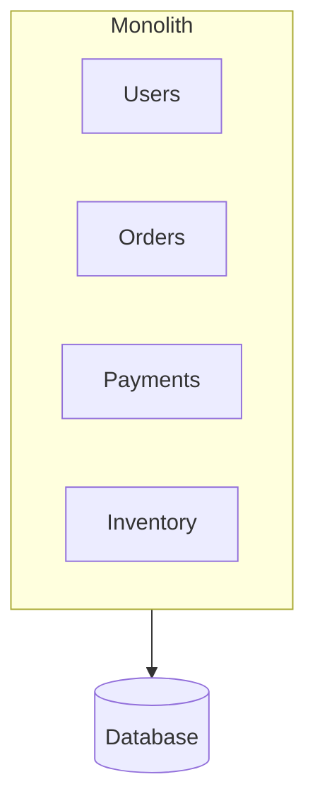

Inside that process, modules talk with function calls. They share memory, a runtime, and typically one primary database. A request enters a controller, walks through services and repositories, and either commits or rolls back in one transaction. There is no network hop between "orders" and "payments" unless you put one there.

That is the whole definition. A messy Rails app is a monolith. A carefully modular NestJS, Spring, or .NET application with explicit module APIs is also a monolith. Martin Fowler is explicit about this: in the microservices conversation, "monolith" means an application built as a single unit, not an insult for tangled code.

Three shapes get collapsed into one word:

- **Traditional monolith** — one codebase, weak internal boundaries, packages organized by technical layer (`controllers`, `services`, `repositories`). Anything can call anything.
- **Modular monolith** — still one deployable, but domains own their code and data access. Orders talks to Payments through a public module API, not by reaching into Payment's tables.
- **Well-designed monolith** — modular boundaries plus inversion of dependencies: domain logic does not depend on HTTP, the ORM, or the message broker. Hexagonal / ports-and-adapters and Clean Architecture are the usual names for that discipline.

The modular monolith is the version worth defending. Shopify's engineering team defined it as a system where all of the code powers a single application and there are strictly enforced boundaries between domains. You keep one test pipeline, one deploy, and in-process calls. You give up the fantasy that "one repo" means "no design."

## Why a monolith is often the correct first system

**Problem:** you need a working product, not a platform. **Constraint:** a small team, an unfinished domain, and a budget that does not include a platform group. **Alternatives:** one modular deployable, or a fleet of services from day one. **Trade-off:** the monolith concentrates change risk later; microservices concentrate operational risk now. **Decision:** start modular and together. **Justification:** you do not yet know the boundaries you would be freezing into network contracts.

### Development

There is one repository, one runtime, one set of types. A new engineer clones the repo and can follow a checkout from the HTTP handler to the database without opening four other services. You are not standing up service discovery, an API gateway, a mesh, and twelve CI pipelines before the first customer exists.

### Testing

An integration test can boot the application and a database, place an order, and assert the payment row and the inventory decrement in one process. You are not coordinating testcontainers for five services, a broker, and a gateway just to prove a single use case. The tests are still work. They are not a distributed system of their own.

### Debugging

A stack trace is a stack trace. The call that failed is on the same machine, in the same process, with the same debugger attached. You do not need a trace backend to answer "which function threw."

### Deployment

One artifact. One health check. One rollback. Continuous delivery is not a monolith-only privilege — Fowler points at organizations that ship a monolith many times a day — but the operational surface is smaller. You are not versioning four APIs against each other every Friday.

### Communication

Compare the two calls:

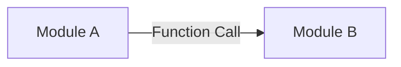


The first is a local jump. It fails if the process fails. It does not fail because DNS expired, the load balancer drained the wrong pool, TLS handshake timed out, or the other service sat at 99th-percentile latency. The second call is a remote procedure. Remote procedures are slow relative to in-process calls, and they can fail even when both codepaths are correct. Fowler treats that as the first cost of playing the distribution card, not as an advanced topic you get to later.

### Cost

A small system on one service — Cloud Run, App Runner, a single ECS service, an App Service — plus one database is cheap to run and cheap to think about. Split the same traffic across eight services and you pay for eight idle floors, eight log sinks, eight deploy pipelines, and the people who keep them honest. Werner Vogels' rule of thumb is blunt: a startup with five engineers may choose a monolith because it is easier to deploy and does not require the team to operate several stacks. Their needs are not an enterprise's needs.

## The problems that appear later

"The monolith does not scale" is the least useful diagnosis in this debate. Plenty of monoliths scale vertically and horizontally just fine. The failures that actually show up are more specific.

**High coupling.** Shipping rates call tax rates because both functions were in scope and nobody owned a boundary. Shopify described the result: a change in tax calculation could change shipping, and it was not obvious why.

**Changes that cannot be isolated.** A one-line fix in inventory still goes through the full test suite and the full release train, because there is only one train.

**A full deploy for a small change.** You wanted to tweak a catalog ranking. You shipped payments again.

**Scale-the-whole-app.** Catalog is hot. Reports are cold. You add instances of everything, including the batch job that did not need another replica.

**Blast radius.** A memory leak in a reporting endpoint can starve checkout threads in the same process. Isolation is a process boundary. You did not buy one.

**Dependency upgrades.** The payments library needs a runtime the catalog module is not ready for. Everyone upgrades together, or nobody does.

**Large-team friction.** Onboarding requires the whole map. Shopify's 2016 tripwire was exactly this: a new engineer on shipping also had to understand orders and payments because the code did not let them ignore those domains.

**A shared database that became the real API.** Every module reads every table. The schema is now a public contract with no versioning and no owner.

**Big Ball of Mud.** Boundaries existed on a whiteboard. In the repo they are comments. Fowler notes that sneaking around a module barrier is a useful tactical shortcut — and that done widely, it trashs productivity. That is how a monolith degrades. It is not how it is _defined_.

The important distinction:

> The problem is not that the application is monolithic. The problem is that its internal boundaries are wrong, unenforced, or both.

If you extract services from a Big Ball of Mud without first drawing those boundaries, you get a distributed Big Ball of Mud. AWS's reliability guidance has a name for the failure mode: the microservice _Death Star_, where components are so interdependent that one failure becomes a much larger one.

## What microservices actually are

James Lewis and Martin Fowler described microservices as independently deployable services organized around business capabilities, communicating over the network, and usually owning their own data. Microsoft's Azure Architecture Center uses the same shape: small, autonomous services, each implementing a single business capability inside a bounded context, deployed independently, talking through APIs or events.

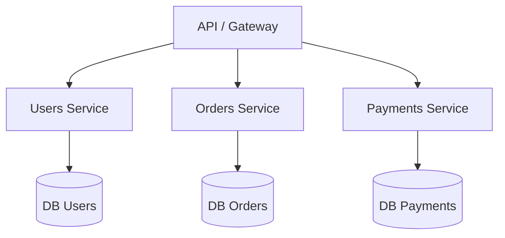

This diagram is conceptual. **A database per service is a frequent practice for reducing coupling. It is not a law.** What the style actually requires is that other services do not reach into your tables. If two "services" share a schema and deploy on a coordinated schedule, you have cut a monolith into processes without buying independence.

The properties that matter:

- **Independent services** with a delimited responsibility.
- **Network communication** — HTTP, gRPC, or messages — instead of in-process calls.
- **Independent deployment.** Payments v2 can ship while Orders stays on v1.
- **Independent scaling.** Catalog can have twenty replicas. Reports can have two.
- **Isolation.** A process crash is no longer automatically everyone else's crash.
- **Team ownership.** A service is small enough that one team can build, test, and run it. Azure calls this out as a design constraint, not a staffing afterthought.

Google Cloud's architecture guidance makes the same coupling point without selling a topology: if you design loosely coupled independent services, they can be released and deployed independently, use different stacks, and be managed by different teams. That is the theme. GKE versus Cloud Run is a runtime choice after the boundary exists.

## The problems they try to solve

Microservices are a response to specific operational and organizational pressure. They are not a cleaner way to write a CRUD app.

### Independent scaling

```text
Orders Service      --> 10 instances
Payments Service    -->  3 instances
Catalog Service     --> 20 instances
```

Catalog takes the browse traffic. Payments takes the checkout traffic. Those curves are not the same. Scaling the whole monolith wastes capacity on the quiet parts and still may not give the hot path enough headroom if that path is trapped behind a shared bottleneck. Independent services let you put money on the component that is actually hot.

This is **scalability**, not **performance**. Splitting a call into three network hops usually makes a single request slower. You scale out a bottleneck. You do not make the function call faster.

### Independent deployment

```text
Deploy Payments Service v2

Orders Service continues running
Catalog Service continues running
Users Service continues running
```

Payments can release a fraud rule without opening a change window for catalog. That only holds if the contract between Payments and Orders is stable. If every release still requires a lockstep deploy, you paid the distributed tax and kept the monolith's release train.

### Fault isolation

A crash in reporting should not take down checkout. Azure is careful here: an unavailable microservice does not disrupt the whole application **as long as upstream services handle the fault**. Isolation is not a property you get by drawing boxes. It is a property you implement.

That implementation looks like this:

- **Timeouts** — do not wait forever for a dependency.
- **Retries** — only for idempotent work, with jitter, or you amplify an outage.
- **Circuit breakers** — stop calling a service that is already failing.
- **Bulkheads** — isolate thread pools and connections so one dependency cannot starve the rest.
- **Queues** — absorb bursts and decouple latency. See [how to use Pub/Sub correctly](/blog/google-cloud-pubsub-how-to-use-it-correctly/) when the caller does not need an answer in the same request.
- **Dead-letter queues** — poison messages must go somewhere other than an infinite retry loop.
- **Rate limiting** — protect the service that everyone else discovered at once.

Without those, you have a distributed monolith that fails in more interesting ways.

## Advantages — and what each one costs

Fowler groups the benefits as stronger module boundaries, independent deployment, and technology diversity — and the costs as distribution, eventual consistency, and operational complexity. Each advantage below follows the same three questions: what problem it solves, when it is useful, and what you pay.

**Independent deployment.** Solves lockstep releases. Useful when parts of the system change on different clocks. Cost: you must version contracts, run compatibility windows, and own a CI/CD system that can ship one service without guessing about the others.

**Independent scaling.** Solves uneven load. Useful when one capability is an order of magnitude hotter than the rest. Cost: more runtimes, more autoscaling policy, more ways to be unexpectedly idle or unexpectedly thrashed.

**Fault isolation.** Solves shared-fate crashes. Useful when availability requirements differ — payments is not reports. Cost: you now design for partial failure. A timeout is a product decision: fail the checkout, or take the order and reconcile later?

**Team autonomy.** Solves coordination overhead in a large org. Useful when teams already own domains and communicate through tickets more than through a shared module. Cost: Conway's Law works in both directions. A service map that does not match the org chart becomes a meeting schedule.

**Clearer domain boundaries.** Solves the "who owns this table" problem. Useful when bounded contexts are already visible in the business. Cost: a wrong boundary is much more expensive to move across a network than across a package.

**Independent releases / domain-aligned teams.** Solves the Friday freeze. Useful when product strategy actually differs by domain. Cost: local optimization. Each team ships. The user journey may not.

**Technology diversity.** Solves a real constraint: this workload needs a different runtime, a different datastore, or a different latency envelope. Useful when that constraint is measured. Cost: hiring, shared libraries, security baselines, and on-call that now spans languages. "We wanted to try Rust" is not a constraint.

AWS Well-Architected REL03-BP01 says the same thing in platform language: smaller segments give agility and let you invest availability where it matters. They also add latency, harder debugging, and operational burden. Choose the segmentation on purpose.

## The price of going distributed

Microservices turn local problems into distributed ones. That is the premium Fowler warned about: automated deployment, monitoring, failure handling, and eventual consistency are extra effort, and nobody has spare acres of time.

### Distributed complexity

A call that used to be this:

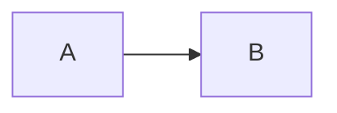

can now fail because of a timeout, a dropped packet, DNS, TLS, a load balancer, a saturated instance, or the other service simply not being there. Inside a monolith, `A → B` is a function call. You still have bugs. You do not have a new class of bugs named after the network.

### Observability

Once a request leaves the process, logs without a shared identity are three opinions about three different events. You need:

- a **transactionId** for the business operation
- a **traceId** and **spanId** for the execution
- structured logs
- distributed tracing
- metrics that name the service, the route, and the dependency

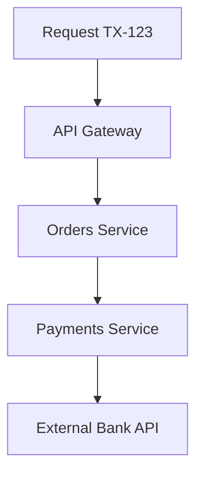

Those identifiers let you reconstruct the path. They are not the same identifier. A checkout can keep `TX-123` across a retry that opens a second trace. If your team is about to split a process, read [traceId is not transactionId](/blog/traceid-is-not-transactionid/) before you invent a house header. Azure lists centralized logging, OpenTelemetry, and distributed tracing as part of the architecture, not as optional polish.

### Debugging

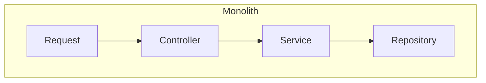

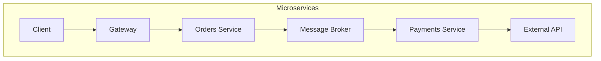

The first path fits in one debugger. The second path is a causal graph. Without traces, you are grepping by timestamp and hoping clocks agree. Netflix's early AWS lesson was the same phenomenon at the network layer: chatty APIs that were fine in a fast datacenter became a design defect once latency varied.

### Data consistency

A purchase is no longer one transaction:

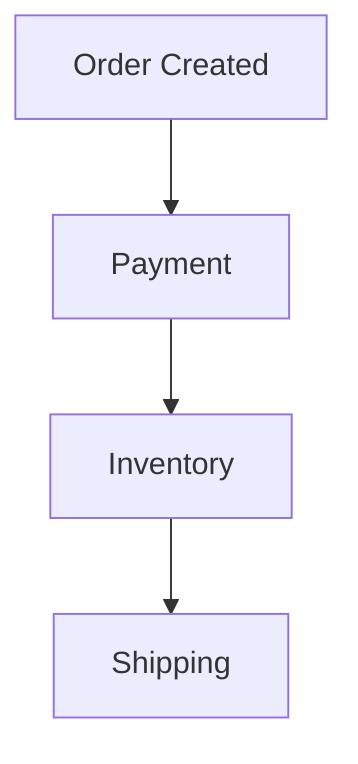

Payment succeeds. Inventory fails. You now have money and no stock, or you retry inventory and decrement twice. Distributed transactions are possible and usually the wrong tool. The usual design is **eventual consistency**, a **saga** that can compensate, and **idempotent** handlers that survive **duplicate messages**. At-least-once delivery is the common broker guarantee. Exactly-once business effects are your problem.

A monolith can hide this behind a single commit. A distributed system forces the conversation: what does the customer see, what do we refund, and how do we detect the inconsistency after the window has closed?

## Direct comparison

No column wins in the abstract. The right cell is the one that matches your constraints.

| Aspect                  | Monolith                                            | Microservices                                           |
| ----------------------- | --------------------------------------------------- | ------------------------------------------------------- |
| Initial complexity      | Low. One process, one pipeline.                     | High. You buy the distributed premium on day one.       |
| Deployment              | One artifact. Simple rollback. Lockstep by default. | Independent releases if contracts hold. Many pipelines. |
| Scaling                 | Scale the whole app. Fine when load is even.        | Scale the hot path. Waste less on the quiet path.       |
| Debugging               | One stack trace.                                    | Needs traces, correlation, and a map of hops.           |
| Observability           | Useful. Not existential.                            | Existential. No shared identity, no reconstruction.     |
| Latency                 | In-process calls.                                   | Every hop adds time and jitter.                         |
| Failures                | Shared fate in one process.                         | Partial failure — if you design for it.                 |
| Cost                    | Cheap at small scale.                               | More runtimes, more people, more idle.                  |
| Team autonomy           | Low unless modules are strict.                      | High when ownership matches services.                   |
| Technology independence | One stack, unless you embed workers.                | Possible. Expensive if you do it for sport.             |
| Data consistency        | Single-commit is available.                         | Eventual consistency is the default.                    |
| DevOps                  | One way of shipping.                                | A platform, or a pile of special cases.                 |
| Infrastructure          | One service, one database is common.                | Gateway, mesh, broker, many datastores.                 |
| CI/CD                   | One pipeline can be enough.                         | One pipeline per service, plus contract tests.          |
| Testing                 | Integration tests stay local.                       | You test each service and the spaces between them.      |

## When a monolith is the right call

### Case 1 — MVP

You are still finding out whether anyone wants the product. Fowler's first reason for Monolith First is classic YAGNI: a poorly designed successful system is a better problem than a beautifully distributed unused one. Microservices add cycle time when cycle time is the only advantage you have.

### Case 2 — Internal system

An application used by fifty employees, during office hours, with a known peak. You do not have a scale problem. You have a delivery problem. A modular monolith with a boring database will outlive a service mesh nobody on-call understands.

### Case 3 — Small team

Three to five developers. Vogels uses almost the same example. Every service you add is a service that same five people deploy, watch, and wake up for. Autonomy is not available. You are the same team wearing more hats.

### Case 4 — Tightly coupled domain

Checkout that must decrement stock, take money, and write the order in one business decision. If the business cannot tolerate "paid but not reserved" even for a few seconds, a distributed saga is not a design flex. It is a product defect. Keep the consistency boundary inside one process until the domain tells you it has split.

### Case 5 — Low scale

A few requests per second, or a few hundred, on a predictable shape of traffic. Distribution will not create headroom you need. It will create failure modes you do not have staff to operate.

## When microservices earn their complexity

### Case 1 — Uneven scale

```text
Catalog --> 100 requests/sec
Orders  -->  20 requests/sec
Reports -->   2 requests/sec
```

The catalog is the product. Reports is a sidecar. Scaling them together is a cost and a risk. Extract the hot, independently cacheable, independently owned piece first — not the whole map.

### Case 2 — Independent teams

```text
Team Payments
Team Orders
Team Catalog
Team Identity
```

When teams already own domains and ship on different clocks, service boundaries can match ownership. Fowler's module-boundary argument is mostly an org argument: inter-team communication is more formal, so the software should be too. If you have one team and four services, you invented a coordination problem.

### Case 3 — Different availability

Payments must stay up. Reports can wait. AWS's reliability pillar uses this as a reason to segment: you invest availability where the customer actually needs it. A shared process makes that investment blunt.

### Case 4 — Different deploy cadence

Identity ships weekly because it is careful. Catalog ships several times a day because merchandising will not wait. If they share a release, the careful team becomes the bottleneck and the fast team becomes the risk.

### Case 5 — Separated domains

Domain-Driven Design's bounded context is the design tool, not the org chart. A context has its own model and language. "Order" in billing is not "Order" in warehouse. When those models are stable and the teams can own them, a service is a reasonable physical expression of the context. When the model is still moving, a module is cheaper to rename.

## Two documented cases

### Netflix — a monolith that had to become a distributed system

Netflix's cloud migration began in 2008. By 2010, streaming ran on AWS. Billing, a SOX-sensitive financial system still tied to a giant Oracle estate in their datacenter, became fully AWS-native on 4 January 2016, after a multi-year incremental move.

The starting problem was not "we prefer microservices." It was scale, global expansion, and a computing environment where individual instances fail as a normal event. John Ciancutti, writing a year into the AWS transition, called the resulting design their "Rambo Architecture": each system has to be able to succeed on its own. If recommendations are down, the site still responds — with popular titles instead of personalized ones. If search is intolerably slow, streaming still works. Chaos Monkey existed to kill instances on purpose, because unused failure handling does not work in a real outage.

They also paid the distributed bill immediately. Datacenter networks had been fast and reliable enough to tolerate chatty APIs. AWS networking had more variable latency, so "over the wire" interactions had to be designed, not assumed. For service-to-service calls they built Eureka (discovery) and Ribbon (client-side load balancing and resilience) because, in 2010, the cloud-native toolbox did not exist. A later Tech Blog post is honest about the next generation of cost: more IPC clients, more languages, more resilience features, and the difficulty of keeping all of that correct — which is why they later moved that logic toward a service mesh.

What they got: independent failure domains, horizontal scale for billing after the Oracle split (Cassandra for subscriber data, MySQL where they still needed ACID for charges), and the ability to keep customer-facing flows up while a dependency degraded.

What they took on: operational complexity, active resilience, and a long migration. Billing did not flip in a weekend. They migrated country by country, built proxies back to the datacenter, and still listed under-automated end-to-end testing as something they underestimated.

Copy the problem, not the logo. Netflix was already operating at a scale and organizational size that made the microservice premium the cheaper bill.

### Shopify — a monolith that stayed a monolith on purpose

Shopify is one of the largest Ruby on Rails codebases in existence. By 2019 it had been worked on for over a decade by more than a thousand developers. By 2020 the core monolith was over 2.8 million lines of Ruby, with development continuous since at least 2006.

The original monolith had no real boundaries. Shipping lived next to checkout and nothing stopped them from calling each other. In 2016 that stopped being acceptable: innocuous changes cascaded into unrelated test failures, CI was slow, and a new engineer on shipping also had to learn orders and payments. Microservices were the fashionable answer. Shopify's own experience said there is no one-size-fits-all, and that a fleet of services would mean many pipelines, many infrastructure footprints, network calls for data they currently queried locally, and refactors coordinated across deploys.

They chose a **modular monolith**. In early 2017 a team started "Componentization": reorganize ~6,000 Ruby classes by domain (orders, shipping, inventory, billing) rather than by Rails layer, give each component a public API and ownership of its data, and measure boundary violations. Later they built Packwerk to reject pull requests that break the dependency graph. In 2020 they had 37 components in the main monolith.

The payoff they reported was not "we avoided microservices." It was the ability to swap a legacy tax engine because dependencies had been isolated — a change they described as nearly impossible before. They also got clearer ownership, exception triage by component, and a codebase that could take a Rails upgrade as a distributed chore instead of a death march.

Shopify still runs a large monolith because the problem they had was modularity, not a need for independent runtimes. That is the sentence most conference talks skip.

A supporting note from Amazon, not a second case study: Werner Vogels, writing after Prime Video's engineers documented a stream-monitoring tool as a monolith, repeated that there is no mandated style. If a set of components always contribute to the same response, share scaling and security needs, and are owned by one team, combining them can simplify the architecture. He also reminded readers that Amazon itself moved from a monolith toward services after the 1998 Distributed Computing Manifesto — and that S3 grew from a few microservices at launch in 2006 to more than 300. Both directions are documented. Neither is a religion.

## An e-commerce path from one deployable to a hybrid

Start here. The domain is unfinished. The team is one team. Checkout, catalog, and payments share a transaction more often than they don't.

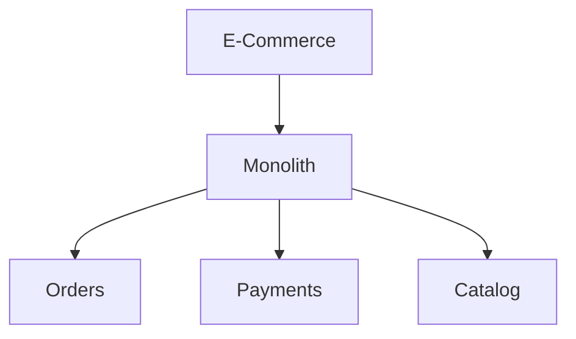

This is a good decision. You can ship a cart. You can write one integration test for "pay and decrement stock." You can change the meaning of "order" without a versioned API.

Traffic arrives, and it is not even:

```text
Catalog  = 80%
Orders   = 15%
Payments =  5%
```

Catalog is read-heavy, cacheable, and owned by a merchandising-facing team that wants to deploy ranking changes without touching charges. Payments is still tightly bound to orders and still wants a strong consistency story.

**Problem:** catalog load and catalog change rate dominate. **Constraint:** you cannot scale or release catalog without dragging payments. **Alternatives:** scale the whole monolith; extract catalog; extract everything. **Trade-offs:** extraction adds a network hop and a cache-invalidation problem; doing nothing keeps coupling the hot path to the careful path. **Decision:** extract catalog only. **Justification:** it is the one capability with demonstrated independent scale, independent cadence, and a boundary you can already point to in the modular monolith.

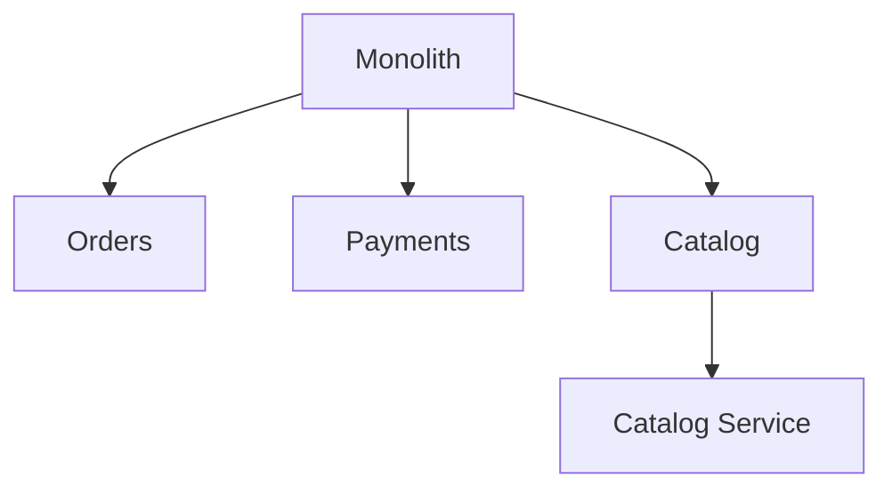

You now have a hybrid. That is not an incomplete migration. It is an architecture that spent complexity where a metric appeared. Orders and payments can stay together until a second metric appears.

## Monolith First

Fowler's strategy, in one line: **start with a modular monolith and extract services when there is a demonstrated need.**

Almost every successful microservice story he had heard started as a monolith that got too big. Almost every system built as microservices from scratch ended in serious trouble. The premium — the cost of managing a suite of services — slows a team that should be learning whether the product matters. The second reason is worse: microservices only work with stable boundaries, and even experienced architects get those wrong at the start. Refactoring a package is cheap. Refactoring a service boundary is a migration.

When it works: the team has the discipline to keep modules honest, the domain is still being discovered, and you are willing to extract later. When it fails: the monolith is a Big Ball of Mud, nobody owns a module API, and "we will split it later" means "we will never be able to." Fowler is not romantic about this. He has heard plenty of decompositions that became a mess, and only a few gradual extractions that worked — those started from a relatively good modular design.

What the monolith needs if you want the option to evolve:

- **Modular monolith** — domains, not layers, as the primary axis.
- **Bounded contexts** — a name and a model per domain, even if they share a process.
- **Hexagonal / Clean Architecture** — domain in the center, adapters at the edge, so a module can later become a process without a rewrite of the rules.
- **Dependency inversion** — the domain does not import the web framework or the ORM.
- **Module boundaries that are enforced** — Shopify needed Wedge, then Packwerk, because convention was not enough. If crossing a boundary is a function call anyone can write, someone will write it.

The counter-argument Fowler records is real: starting with services trains the org in the operating rhythm, and splitting a disciplined monolith later takes more discipline than most teams have. His own hedge: do not start with microservices unless the team already has experience running them. Treat that as a staffing constraint, not as a personality trait.

## A decision tree

Use this as a filter, not as a verdict.

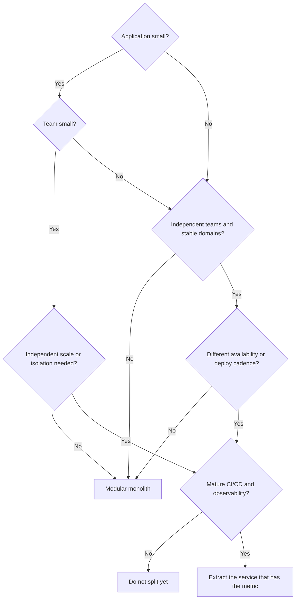

If you cannot explain which box produced "extract," you are not extracting. You are decorating.

## Wrong reasons, real signals

These are not sufficient reasons to split a process:

- **"It is more modern."** Modern is not a requirement. Operable is.
- **"The CTO asked for microservices."** Ask which metric they want to move.
- **"Netflix uses them."** Netflix also spent years building Eureka, Ribbon, Chaos Monkey, and later a mesh, because instance failure and global streaming were the job. You are probably not on that job.
- **"We are using Kubernetes."** Kubernetes runs monoliths. A scheduler is not an architecture.
- **"We want to learn microservices."** Learn them in a sandbox, not in checkout.
- **"We want different languages."** That is a hiring and platform cost. It is rarely a product requirement.
- **"The monolith is ugly."** Ugliness is a modularity problem. Distribution does not remove ugly. It replicates it.

Fowler called the eagerness _Microservice Envy_. The majority of systems, in his guideline, should be built as a single application with real modularity. Do not even consider services until the system is too complex to manage as a monolith.

A checklist for when a distributed architecture is actually on the table:

- A component has a demonstrated need for independent scaling.
- Independent teams own separate domains and already ship on different clocks.
- Bounded contexts are stable enough to become contracts.
- You need independent deployment for a concrete release-train reason.
- Availability or isolation requirements differ by capability.
- A failure in one area is currently taking down something more important.
- Volume concentrates in a specific component, not in "the app."
- A different technology is required, not merely desired.
- The organization can operate a distributed system on a bad Thursday.
- Observability is already good enough to follow one request today.
- CI/CD can ship one artifact safely. It will need to ship many.

One checked box is a smell, not a mandate. Three checked boxes and a missing observability story is a reason to stop. AWS is explicit that even when you start with a monolith, you should keep it modular enough to evolve. That is the prerequisite, not the afterthought.

## Architecture as evolution

Architectures are allowed to change. Vogels' rule of thumb is to revisit the design with every order of magnitude of growth. Shopify described the same idea as an evolutionary scale: monolith, then modular monolith, then service-oriented splits, each separated by a period of pain that tells you the current shape has been outgrown.

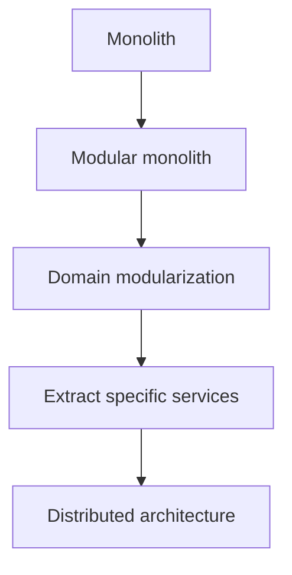

The migration pattern with a name is the **Strangler Fig**. Fowler's metaphor is a vine that grows around a host tree and eventually replaces it. In software: add seams, build the new behavior beside the old, route a slice of traffic, repeat. You do not announce a two-year rewrite and hope the business pauses. AWS's reliability guidance recommends this pattern for decomposing a monolith, including transitional architecture that you will later delete. That transitional layer is not waste. It is how you keep shipping.

A big-bang rewrite is the last option, not the first. Replacements look easy to specify and usually are not. The old system's behavior is only partly wanted, and users will not wait for feature-parity on a frozen legacy.

The conclusion is contextual because the problem is contextual.

- Small systems, MVPs, small teams, simple domains: modular monolith.
- Large systems with independent teams, uneven scale, or distinct availability needs: consider services, one boundary at a time.
- Organizations without DevOps and observability maturity: do not import a distributed operating model to avoid a design conversation.

> The best architecture is not the one with the most services. It is the one that solves the problem with the least necessary complexity.

## Before you extract another service, ask yourself

1. What metric moves if this is a separate process, and what metric gets worse?
2. Is this a stable bounded context, or a package I have not finished naming?
3. Can I enforce this boundary _inside_ the monolith first?
4. Does a different team own this, and do they already ship on a different clock?
5. Can I follow one user request across the new hop with the observability I have today?
6. What happens when the new service is slow, duplicated, or down — in product terms, not in infrastructure terms?
7. Am I solving scale, or am I solving a release-train argument that a module API would also solve?
8. Who is on-call for the space between the services?
9. If this extraction is wrong, how do I put it back?

If you cannot answer "what problem am I solving, and which architecture solves it with the least necessary complexity?", do not split the process. Draw the boundary. Measure. Then decide.

The correct architecture depends on the problem, not on the fashion.

## Sources

- Martin Fowler, [Monolith First](https://martinfowler.com/bliki/MonolithFirst.html)
- Martin Fowler, [Microservice Trade-Offs](https://martinfowler.com/articles/microservice-trade-offs.html)
- Martin Fowler, [Microservice Premium](https://martinfowler.com/bliki/MicroservicePremium.html)
- Martin Fowler, [Strangler Fig Application](https://martinfowler.com/bliki/StranglerFigApplication.html)
- James Lewis and Martin Fowler, [Microservices](https://martinfowler.com/articles/microservices.html)
- AWS Well-Architected, [REL03-BP01 Choose how to segment your workload](https://docs.aws.amazon.com/wellarchitected/latest/reliability-pillar/rel_service_architecture_monolith_soa_microservice.html)
- AWS, [Implementing Microservices on AWS](https://docs.aws.amazon.com/whitepapers/latest/microservices-on-aws/microservices-on-aws.html)
- Microsoft Azure Architecture Center, [Microservices architecture style](https://learn.microsoft.com/en-us/azure/architecture/guide/architecture-styles/microservices)
- Google Cloud Architecture Center, [Patterns for scalable and resilient apps](https://docs.cloud.google.com/architecture/scalable-and-resilient-apps)
- Google Cloud, [GKE and Cloud Run](https://docs.cloud.google.com/kubernetes-engine/docs/concepts/gke-and-cloud-run)
- Netflix Technology Blog, [5 Lessons We've Learned Using AWS](https://netflixtechblog.com/5-lessons-weve-learned-using-aws-1f2a28588e4c)
- Netflix Technology Blog, [Netflix Billing Migration to AWS](https://netflixtechblog.com/netflix-billing-migration-to-aws-451fba085a4)
- Netflix Technology Blog, [Zero Configuration Service Mesh with On-Demand Cluster Discovery](https://netflixtechblog.com/zero-configuration-service-mesh-with-on-demand-cluster-discovery-ac6483b52a51)
- Shopify Engineering, [Deconstructing the Monolith](https://shopify.engineering/deconstructing-monolith-designing-software-maximizes-developer-productivity)
- Shopify Engineering, [Under Deconstruction: The State of Shopify's Monolith](https://shopify.engineering/shopify-monolith)
- Werner Vogels, [Monoliths are not dinosaurs](https://www.allthingsdistributed.com/2023/05/monoliths-are-not-dinosaurs.html)
