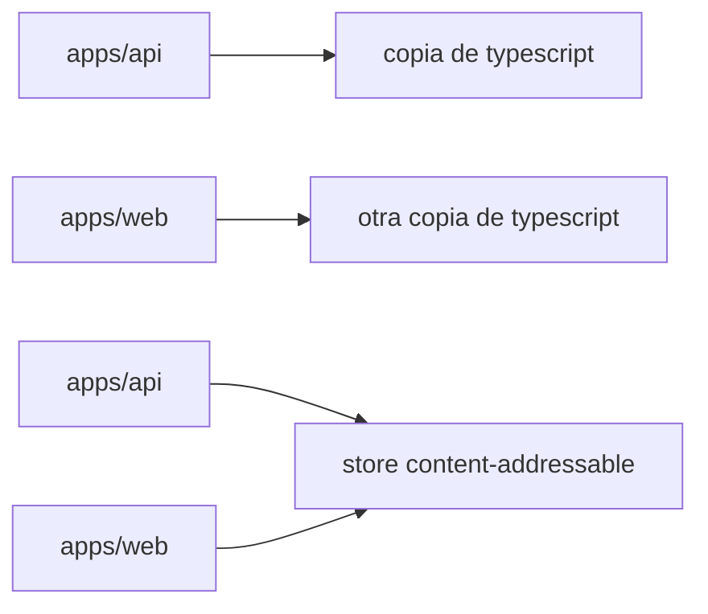
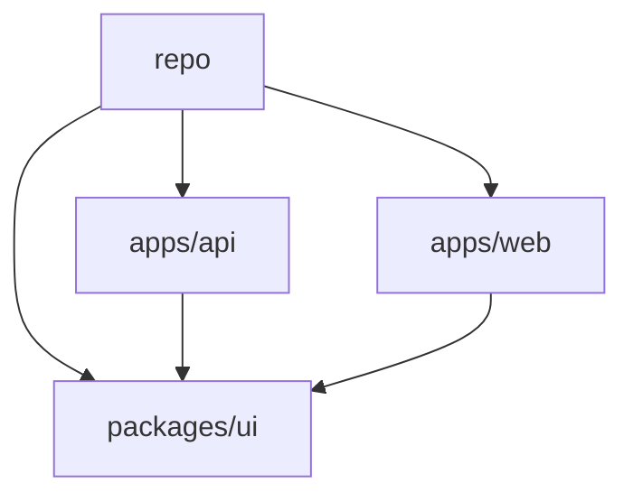

Tres clones del mismo `package.json` no dejan el mismo `node_modules` en disco. No fallan de la misma forma. Un portátil con una caché caliente instala en segundos; CI, empezando desde un runner vacío, no. Un paquete importado en desarrollo desaparece tras el siguiente cambio de lockfile.

Eso no es un `install` que falta. Es un modelo de gestión de dependencias.

npm, pnpm y Yarn moderno hablan con el mismo registry y todos producen un lockfile. Discrepan en dónde viven los bytes, qué paquetes puede ver tu código, y qué significa «reproducible» en un portátil, en CI y en Docker. Compara ese modelo — no qué binario es más corto.

> pnpm es especialmente atractivo cuando necesitas eficiencia de disco, aislamiento de dependencias, monorepos e instalaciones reproducibles. npm sigue siendo un excelente default porque viene con Node.js. Yarn moderno es un diseño distinto: Plug'n'Play y Zero-Installs, no un npm más rápido.

Este artículo está escrito contra **pnpm 11** (estable actual) y trata **pnpm 12** (reescritura en Rust, RC en el momento de escribir) como el mismo producto. Yarn significa **Yarn Berry** (2+), no Yarn Classic, salvo que se nombre Classic.

## El problema es la gestión de dependencias, no el CLI

Un proyecto Node.js no «tiene dependencias». Tiene un grafo. El instalador debe resolver versiones, descargar tarballs y materializar un árbol que Node.js pueda cargar. Ese trabajo crea los mismos problemas en todo equipo que crece más allá de un repo de juguete.

**Duplicación y disco.** Tres apps que dependen de `typescript@5.8.2` pueden almacenar tres copias. El disco es barato hasta que el checkout, la capa de Docker o la caché de CI no lo es.

**Instalaciones lentas.** Resolver, descargar y escribir son costes distintos. Un portátil caliente sigue copiando a `node_modules`. CI suele ser una máquina fría con lockfile: la resolución está hecha, los bytes no.

**Resolución.** `^5.1.0` es un rango. Dos instalaciones con una semana de diferencia pueden elegir versiones distintas a menos que un lockfile fije el grafo.

**Aislamiento.** Node.js sube desde el archivo que llama buscando `node_modules`. Si el instalador aplana el árbol, tu app puede hacer `import` de un paquete que nunca declaró — una **phantom dependency**.

**Reproducibilidad.** «Funciona en mi máquina» suele ser «mi `node_modules` no es el que CI construyó».

**Monorepos.** `apps/api` más `packages/ui` implica versiones compartidas, protocolos locales, y un job de CI que no debería reconstruir el mundo para testear un paquete.

**Local versus CI.** Un desarrollador reinstala con un store poblado. CI empieza desde un clon. Comparar esos wall clocks es cómo «pnpm es 2x más rápido» se convierte en un eslogan.

Ninguno de estos problemas te obliga a cambiar de herramienta. Sí te obligan a saber qué modelo estás comprando. Todo instalador **resuelve**, **descarga** y **materializa**. `npm install` / `pnpm install` / `yarn install` son el mismo verbo sobre tres layouts. pnpm **enlaza** desde un store; Yarn Plug'n'Play se salta `node_modules`; npm iza y copia. Si solo comparas sintaxis de CLI, elegirás una herramienta por la razón equivocada.

## Cómo npm organiza `node_modules`

npm es la implementación de referencia del ecosistema. Viene con Node.js. Esa compatibilidad es una feature, no inercia.

Desde npm 3 el árbol por defecto usa **hoisting**. Los paquetes compartidos burbujean hacia la raíz de `node_modules`. Ahorras algo de duplicación frente al layout anidado antiguo. También haces que todo paquete izado sea importable desde el código de aplicación, lo declare o no _tu_ `package.json`.

```text
node_modules/
├── express/
├── qs/          # express pidió esto; npm lo subió a la raíz
├── debug/       # algo más también lo hizo
└── ...
```

`package-lock.json` fija el grafo. `npm ci` es el install frozen de CI: el lockfile debe existir y coincidir, `node_modules` se borra primero, el lockfile no se reescribe.

npm Workspaces (`"workspaces": ["apps/*", "packages/*"]`) enlazan paquetes locales; el árbol sigue con hoisting a menos que lo cambies. `--install-strategy=linked` aísla como pnpm — la guía de desarrolladores de npm lo recomienda para cazar imports no declarados — pero no es el default.

Si el equipo es pequeño y nadie pelea con el disco o las phantom imports, npm es la herramienta que ya está ahí.

## Cómo pnpm almacena paquetes

La apuesta de pnpm es: mantén un `node_modules` tradicional que Node.js ya entiende, pero deja de copiar el mismo archivo en cada proyecto.

El store es **content-addressable**: un archivo se almacena una vez, indexado por su contenido. Si `typescript@5.8.2` y `typescript@5.8.3` difieren en un archivo de cien, el store añade ese archivo. `left-pad@1.3.0` en `apps/api` y en `apps/web` son los mismos bytes. La página de motivación de pnpm expone el argumento de disco: una copia, muchos proyectos, y almacenamiento incremental cuando las versiones casi coinciden.

Los proyectos no copian esos bytes por defecto. pnpm los **importa** a un virtual store con **clone / reflink** (copy-on-write) cuando el filesystem lo soporta, **hard link** cuando clone no está disponible (común en Windows Dev Drive), y **copy** entre volúmenes. `du` en tres proyectos puede parecer grande mientras los bytes únicos permanecen en el store.

Por eso pnpm puede ahorrar disco **sin abandonar `node_modules`**. Node.js sigue recorriendo directorios; los archivos resultan ser enlaces. Yarn Plug'n'Play resuelve la duplicación no creando `node_modules`. pnpm hace que `node_modules` sea barato. La ganancia es condicional: los enlaces necesitan un volumen compartido; un runner de CI frío con store vacío sigue descargando. Cachea el store si quieres que la tercera etapa sea enlazar — la documentación de CI de pnpm dice que cachear es opcional y no está garantizado que sea más rápido.



## El layout `.pnpm` y el resolver de Node

Después de importar desde el store, pnpm construye un directorio que Node.js puede resolver. El `nodeLinker` por defecto es `isolated`.

```text
node_modules/
├── .pnpm/
│   ├── express@5.1.0/node_modules/express
│   ├── qs@6.14.0/node_modules/qs
│   └── node_modules/          # hoist por defecto del grafo
├── express -> .pnpm/express@5.1.0/node_modules/express
└── .bin/
```

`.pnpm` es el **virtual store**. El contenido de los paquetes está enlazado desde el content-addressable store. Alrededor, pnpm crea **symlinks** que reconstruyen el grafo: `express` obtiene un `node_modules` que apunta a `qs`, no a lo que se haya aplanado en la raíz del repo. En la raíz del proyecto, solo las dependencias **directas** tienen symlink — `node_modules/express` existe, `node_modules/qs` no.

Node.js sube desde el archivo que llama buscando `node_modules/<name>` y resuelve el realpath de los symlinks. Cuando `express` carga `qs`, Node empieza dentro de `.pnpm/express@5.1.0/` y encuentra `qs` junto a él. Tu `src/server.ts` empieza desde la raíz del proyecto y solo ve lo que el `node_modules` raíz expone. Mantienes `node_modules`. No mantienes los imports accidentales desde la raíz.

No es un firewall absoluto. pnpm **iza el grafo hacia `node_modules/.pnpm/node_modules` por defecto**, así que una dependencia todavía puede resolver un phantom; el código de aplicación en la raíz del repo normalmente no puede. Pon `hoist: false` para el layout más estricto, o `nodeLinker: hoisted` si una herramienta no puede seguir symlinks. También hay un linker `pnp` y un **global virtual store** experimental (`enableGlobalVirtualStore`) — no lo actives porque un blog dijo que era más rápido.

## Por qué importa el aislamiento de dependencias

Toma una API pequeña que solo declara `express`:

```ts
import express from "express";
import lodash from "lodash";

const app = express();
app.get("/health", (_req, res) => {
  res.json({ ok: true, keys: Object.keys(lodash) });
});
```

`lodash` no está en `package.json`. Bajo un instalador con hoisting esto puede cargar igual: otro paquete del workspace o una dependencia transitiva lo trajo, y Node encuentra `node_modules/lodash` desde `src/server.ts`. Los tests pasan. Un grafo Docker más reducido, o un compañero sin ese otro paquete, lanza `ERR_MODULE_NOT_FOUND`.

Ese es el bug de phantom dependency. La guía de desarrolladores de npm lo describe igual y recomienda `--install-strategy=linked`. El layout aislado por defecto de pnpm es la misma idea aplicada a instalaciones cotidianas: `import lodash from "lodash"` falla en el portátil en el momento en que lo escribes.

No caza todos los casos — una `devDependency` que falta en producción, o un paquete que resuelve a través del hoist por defecto de `.pnpm`, todavía puede ocultar una declaración. El aislamiento es una restricción del resolver, no una prueba de un `package.json` correcto. `pnpm install --frozen-lockfile` (y el modo frozen automático en CI) entonces fija el conjunto que tu código puede ver, el mismo trabajo que `npm ci` hace para npm.

## Monorepos y workspaces

Un workspace es un repo, muchos paquetes, un instalador. pnpm requiere un `pnpm-workspace.yaml` en la raíz. Ese archivo es también donde pnpm 11 espera la mayoría de ajustes — `.npmrc` queda para auth y registry, no para `hoistPattern` o `nodeLinker`.

```yaml
packages:
  - apps/*
  - packages/*

catalog:
  express: ^5.1.0
  typescript: ^5.8.0
```

**Workspaces** marcan qué carpetas son paquetes. Un `pnpm install` en la raíz instala el grafo. `sharedWorkspaceLockfile` es `true` por defecto: un `pnpm-lock.yaml`, un virtual store, `node_modules` por paquete que solo enlazan lo que ese paquete declaró. **`workspace:`** se niega al registry — `"@acme/ui": "workspace:^"` enlaza en local o falla; al publicar, pnpm lo reescribe a semver. **Catalogs** ponen rangos repetidos en un solo lugar (`express: "catalog:"`). **Filters** mantienen el CI proporcional al diff: `pnpm --filter api... build` es `api` más sus dependencias del workspace; `pnpm --filter ...ui test` es `ui` más sus dependientes.

npm y Yarn también tienen workspaces. pnpm es interesante aquí porque el store, el layout aislado y los filtros se asientan sobre el mismo modelo.

Una forma típica de empresa — `apps/api`, `apps/web`, `apps/admin` más `packages/ui` y `packages/shared` — se convierte en una sola instalación en lugar de tres grafos y `npm link`. npm Workspaces ya te dan un lockfile único. No impiden, por defecto, que el hoist filtre `lodash` hacia `web`, y no ponen `typescript` en un content-addressable store compartido entre checkouts.



## CI/CD, Docker y reproducibilidad

Fija el package manager que el repo ejecuta de verdad (`packageManager` en `package.json`, instalado con `pnpm/setup` o el binario standalone — no un global aleatorio). En CI, usa `pnpm install --frozen-lockfile`; pnpm también activa el modo frozen automáticamente cuando detecta CI, y desde pnpm 11 el job falla si el lockfile lo escribió un major más nuevo. En Docker, `pnpm fetch` lee el lockfile (no `package.json`) para que editar un script no invalide la capa de dependencias; después `pnpm install --offline` solo enlaza. Cachea el store indexado por `pnpm-lock.yaml` si has medido una ganancia. `pnpm deploy` copia una app más un `node_modules` aislado a un directorio portable para la imagen de runtime.

## Benchmarks sin eslóganes

No escribas «pnpm es 2x más rápido» como una propiedad de la herramienta. El tiempo de install depende del grafo, la caché, el lockfile, si `node_modules` ya existe, el disco, el SO, la red, y si la máquina es un portátil o un runner de CI.

pnpm publica una [página de benchmarks](https://pnpm.io/benchmarks) que compara npm, pnpm, Yarn, Yarn PnP y Bun. Cada fila indica cuáles de `cache`, `lockfile` y `node_modules` ya estaban presentes. Léela como «bajo este fixture, en su hardware, en esa fecha», no como un SLA.

| Escenario        | A qué se parece                                    |
| ---------------- | -------------------------------------------------- |
| Cold install     | Máquina nueva, store vacío, quizá sin lockfile     |
| Warm install     | Reinstalación de desarrollador, store ya poblado   |
| CI install       | Lockfile presente, store quizá restaurado de caché |
| Monorepo install | Muchos paquetes, un lockfile, enlazar domina       |
| Uso de disco     | Bytes únicos en el store versus árboles copiados   |

Un job de CI frío sin caché debería parecerse más a npm que a la tercera instalación en tu portátil. Yarn PnP y Bun se saltan o reemplazan `node_modules` — un trade distinto, no un pnpm más rápido. Mide _tu_ lockfile en _tus_ runners. No inventes un número.

## Cómo Yarn moderno es una apuesta distinta

Yarn Classic (v1) hacía hoisting como npm. Comparar pnpm con Classic es comparar dos árboles de la era 2017. **Yarn Berry** (2+) cambió el runtime vía `.yarnrc.yml` y `nodeLinker`:

- **`pnp` (default).** Plug'n'Play. Sin `node_modules`. Un loader `.pnp.cjs` le dice a Node dónde vive cada paquete, a menudo dentro de zips. Las ghost dependencies fallan con un error de Yarn. Las herramientas que recorren `node_modules` necesitan el SDK de Yarn; algunos paquetes necesitan `packageExtensions`.
- **`pnpm`.** Un virtual store más hard links, conceptualmente cercano al layout de pnpm, usando el store de Yarn.
- **`node-modules`.** El árbol clásico. Máxima compatibilidad.

**Zero-Installs** es un workflow, no un tercer linker: commitea `.yarn/cache` y el loader PnP, y trata `git checkout` como listo para correr. Los addons nativos todavía necesitan un install. Si la toolchain ya habla PnP, CI puede parecer un checkout. Si no, gastarás la migración en `packageExtensions`, o pondrás `nodeLinker: node-modules` y devolverás PnP.

El default de pnpm es el compromiso opuesto: mantén el algoritmo `node_modules` de Node, haz los archivos baratos, aísla la raíz. El default de Yarn reemplaza el algoritmo. Compararlos solo en segundos de install pierde ambas apuestas.

## Comparación técnica

Estos son defaults distintos, no puntuaciones. Un «sí» no es una victoria.

| Característica | pnpm                                           | npm                            | Yarn (Berry)                          |
| -------------- | ---------------------------------------------- | ------------------------------ | ------------------------------------- |
| Lockfile       | `pnpm-lock.yaml`                               | `package-lock.json`            | `yarn.lock`                           |
| Workspaces     | `pnpm-workspace.yaml`, `workspace:`, catálogos | `workspaces` en `package.json` | `workspaces` en `package.json`        |
| Aislamiento    | Raíz aislada por defecto                       | Hoisting; `linked` opcional    | Estricto bajo PnP                     |
| Store          | CAS global, enlazado a cada proyecto           | Copias por proyecto            | Caché / CAS; depende del `nodeLinker` |
| Plug'n'Play    | `nodeLinker: pnp` opcional                     | No                             | Default                               |
| Zero-Installs  | No es el workflow previsto                     | No es el workflow previsto     | Caché + PnP en git                    |
| `node_modules` | Virtual store + symlinks                       | Hoisted o linked               | No bajo PnP                           |
| CI/CD          | Frozen lockfile, `fetch`, `deploy`             | `npm ci`                       | Frozen installs; Zero-Installs        |
| Disco          | Store compartido + enlaces                     | Copias por proyecto            | Caché compartida; zips bajo PnP       |
| Compatibilidad | Alta; algunas herramientas rechazan symlinks   | La más alta                    | La más alta con `node-modules`        |

## ¿Cuándo deberías elegir pnpm?

- **Un proyecto Node.js mediano o grande** — copiar `node_modules` es lento, y alguien importará un paquete transitivo izado. El store más la raíz aislada hace que las reinstalaciones en caliente sean mayormente enlazar, y los imports no declarados fallen en desarrollo.
- **Un monorepo** — varias apps y librerías deben compartir versiones y paquetes locales sin `npm link`. Workspaces, `workspace:`, catálogos y `--filter` dan un lockfile y comandos que apuntan a un paquete y sus dependientes.
- **Muchos checkouts en una máquina** — un store, muchos proyectos. El crecimiento de disco sigue los archivos únicos, no la cuenta de checkouts, mientras todo viva en el mismo volumen.
- **Equipos que quieren aislamiento** — los phantom imports pasan CI en un grafo y fallan en otro. El `node_modules` raíz solo expone dependencias directas. La estrategia linked de npm también puede hacer esto; pnpm lo hace el default.
- **CI que instala a menudo, o disco que es la restricción** — fetch-from-lockfile, frozen lockfile, caché de store opcional, `pnpm deploy --prod`. Mídelo; no lo asumas. Las imágenes todavía contienen un `node_modules`.
- **Organizaciones estandarizando tooling** — un campo `packageManager`, un layout de workspace, una action de CI. Estandarizar en npm es el mismo beneficio con menos cambio.

## Cuándo no deberías

El mejor package manager es el que encaja con el problema que estás resolviendo.

**Un proyecto pequeño donde npm ya funciona.** Un `package.json`, sin monorepo, sin presión de disco. `npm ci` es suficiente.

**Una toolchain que asume un `node_modules` plano y no puede parchearse.** Prueba `nodeLinker: hoisted` o `shamefully-hoist`. Si eso se convierte en la configuración permanente, has pagado la complejidad de pnpm por el layout de npm — quédate en npm, o Yarn con `nodeLinker: node-modules`.

**Una organización ya estandarizada en otro instalador.** La consistencia entre cincuenta repos gana a un óptimo local en uno.

**Un proyecto que quiere el diseño de Yarn.** Si Zero-Installs (caché commiteada + PnP) es el punto, Yarn optimizó para eso. pnpm no se convertirá en ese workflow por accidente.

**Un equipo que no quiere otra herramienta.** pnpm no viene con Node.js. La ventaja de npm es que ya está en la máquina.

**Un release que no puedes gravar con tickets de phantom imports.** Las instalaciones aisladas sacan a la luz declaraciones faltantes. Esa es la feature. Presupuesta la migración, o no cambies la semana antes de un release.

## Migrar de npm (o Yarn) a pnpm

Instala pnpm primero (`npx get-pnpm`, o npm en Windows si Defender bloquea el binario standalone). pnpm 11 necesita Node.js 22+ como paquete JavaScript; el binario standalone puede instalar Node con `pnpm runtime set node lts -g`.

```bash
npx get-pnpm
pnpm import   # lee package-lock.json, npm-shrinkwrap.json o yarn.lock
pnpm install
git rm package-lock.json   # o yarn.lock
```

Si es un monorepo, escribe `pnpm-workspace.yaml` **antes** de importar — `pnpm import` no inventará membresía. Revisa el diff del lockfile; no será idéntico byte a byte. Mueve los ajustes de pnpm fuera de `.npmrc` excepto auth y registry.

Fija la versión con `"packageManager": "pnpm@11.20.0"`. Corepack lee ese campo (`corepack enable` y después `corepack use pnpm@11.20.0` en las líneas de Node que todavía lo traen). pnpm 11 también lee `packageManager` / `devEngines.packageManager` y puede descargar si no coincide. El campo es la parte portable; Corepack, `pnpm/setup`, `mise`, Volta o una instalación standalone lo honran. `pnpm env` está deprecated — usa `pnpm runtime set node 22 -g`.

Apunta CI y Docker al binario fijado, `pnpm install --frozen-lockfile`, y `pnpm fetch` más un offline install (o `deploy` para una app).

### Checklist de migración

- Instala pnpm 11 (Node 22+, o el binario standalone).
- Pon `"packageManager": "pnpm@11.20.0"` a la versión que ejecutas realmente.
- Añade `pnpm-workspace.yaml` si es un monorepo; `pnpm import` si existe un lockfile viejo.
- `pnpm install`; arregla phantom imports; borra el lockfile viejo; commitea `pnpm-lock.yaml`.
- Apunta las deps del workspace a `workspace:` (y catálogos si los quieres).
- Actualiza CI/Docker: frozen lockfile, `fetch` / offline install, o `deploy`.
- Busca `npm ci`, `npm install`, `npx` y configuración solo de Yarn; dile al equipo que use el pin.

## El instalador es un modelo de gestión de dependencias

pnpm es un default sólido cuando el dolor son bytes duplicados, imports que se filtran, un monorepo, o instalaciones que quieres reproducir en CI. Mantiene el algoritmo `node_modules` de Node y hace los archivos baratos — con costes: otra herramienta que fijar, symlinks que algún tooling todavía rechaza, y una migración que saca a la luz cada phantom import.

npm sigue siendo correcto cuando el proyecto es pequeño, el estándar de la org es npm, o la compatibilidad con el default del ecosistema importa más que el store. Yarn moderno es correcto cuando quieres Plug'n'Play o Zero-Installs y la toolchain te acompañará. Eso no es un pnpm más lento. Es un runtime distinto.

Elige el modelo que encaja con el fallo que realmente estás teniendo. El binario CLI es la parte menos importante de esa decisión.

## Fuentes

- pnpm, [Motivation](https://pnpm.io/motivation) — content-addressable store, enlazar versus copiar, `node_modules` no plano
- pnpm, [Symlinked `node_modules` structure](https://pnpm.io/symlinked-node-modules-structure) — `.pnpm`, hard links, symlinks, resolución de Node, hoist por defecto a `.pnpm/node_modules`
- pnpm, [Node-modules and hoisting settings](https://pnpm.io/settings/node-modules) — `nodeLinker` (`isolated` / `hoisted` / `pnp`), virtual store, global virtual store
- pnpm, [Settings](https://pnpm.io/settings) — `pnpm-workspace.yaml` como el archivo de configuración; `.npmrc` solo para auth y registry
- pnpm, [Workspace](https://pnpm.io/workspaces) — `workspace:`, lockfile compartido, `linkWorkspacePackages`
- pnpm, [Catalogs](https://pnpm.io/catalogs) — protocolo `catalog:`, catálogos default y nombrados
- pnpm, [Filtering](https://pnpm.io/filtering) — selectores `--filter`, dependientes y dependencias
- pnpm, [pnpm install](https://pnpm.io/cli/install) — `--frozen-lockfile`, `--offline`
- pnpm, [pnpm fetch](https://pnpm.io/cli/fetch) — fetch solo de lockfile, caché de capas Docker
- pnpm, [pnpm deploy](https://pnpm.io/cli/deploy) — paquete de workspace portable, `inject-workspace-packages`
- pnpm, [pnpm import](https://pnpm.io/cli/import) — importar lockfile desde npm y Yarn
- pnpm, [pnpm runtime](https://pnpm.io/cli/runtime) — gestión de versiones de Node; `pnpm env` deprecated
- pnpm, [pnx / dlx](https://pnpm.io/cli/pnx) — ejecución de paquetes de un solo uso
- pnpm, [Installation](https://pnpm.io/installation) — script standalone, `npx get-pnpm`, pnpm 11 versus 12 RC, compatibilidad con Node
- pnpm, [Continuous Integration](https://pnpm.io/continuous-integration) — install standalone, `pnpm/setup`, caveats del caché de store, frozen lockfile en CI
- pnpm, [Benchmarks](https://pnpm.io/benchmarks) — fixtures oficiales; matriz de caché / lockfile / `node_modules`
- pnpm, [Other settings](https://pnpm.io/settings/other) — `sideEffectsCache`, `cacheDir`
- npm, [Workspaces](https://docs.npmjs.com/cli/v11/using-npm/workspaces) — npm workspaces
- npm, [npm ci](https://docs.npmjs.com/cli/v11/commands/npm-ci) — instalaciones limpias con lockfile frozen
- npm, [Developers — phantom dependencies](https://docs.npmjs.com/cli/v11/using-npm/developers) — fugas izadas, `--install-strategy=linked`
- npm, [install-strategy](https://docs.npmjs.com/cli/v11/using-npm/config#install-strategy) — `hoisted`, `nested`, `shallow`, `linked`
- Yarn, [Install modes](https://yarnpkg.com/features/linkers) — `nodeLinker`: `pnp`, `pnpm`, `node-modules`
- Yarn, [Plug'n'Play](https://yarnpkg.com/features/pnp) — loader en lugar de `node_modules`
- Yarn, [Cache strategies / Zero-Installs](https://yarnpkg.com/features/zero-installs) — mirror offline, caché y loader PnP commiteados
- Node.js, [Corepack (v24)](https://nodejs.org/docs/latest-v24.x/api/corepack.html) — `packageManager`, experimental; todavía incluido en la línea 24.x
- Node.js, [Corepack (current)](https://nodejs.org/dist/latest/docs/api/corepack.html) — ya no se distribuye a partir de Node.js 25
- Corepack, [README](https://github.com/nodejs/corepack) — `corepack use`, `devEngines.packageManager`, instalación userland vía `npm install -g corepack`
- Docker, [Multi-stage builds](https://docs.docker.com/build/building/multi-stage/) — copiar un filesystem podado a una imagen de runtime
