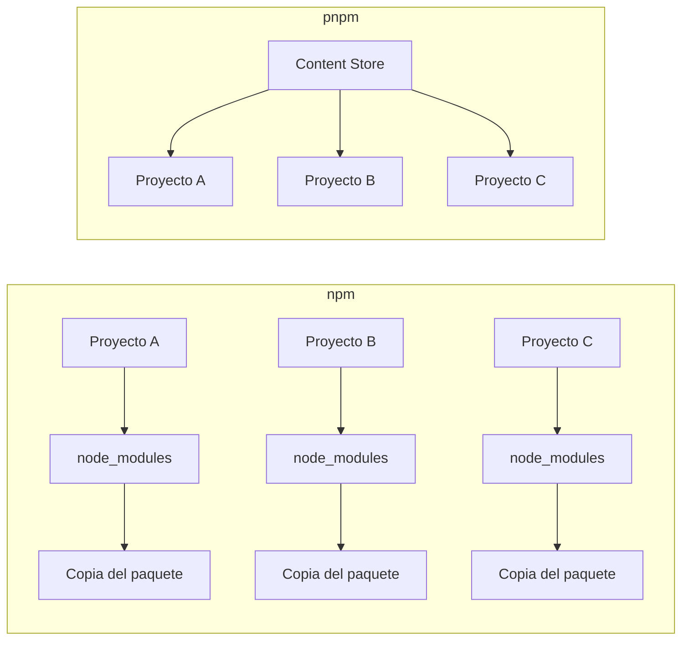
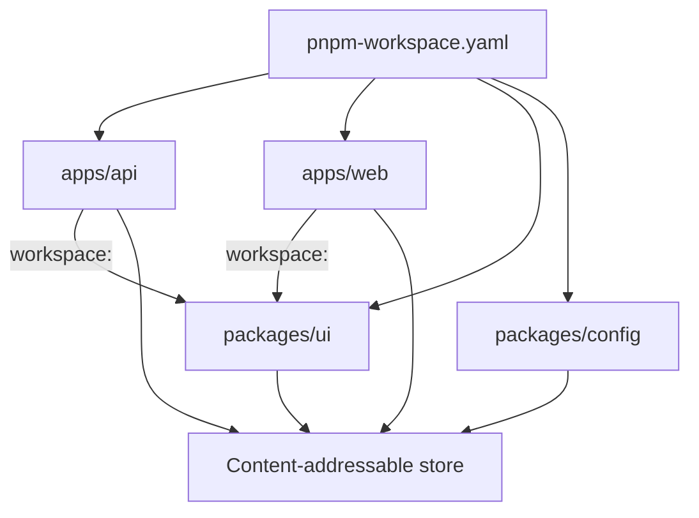

Tres clones del mismo `package.json` no dejan el mismo `node_modules` en disco. No fallan de la misma forma. Un portátil con una caché caliente instala en segundos; CI, empezando desde un runner vacío, no. Un paquete importado en desarrollo desaparece tras el siguiente cambio de lockfile.

Eso no es un `install` que falta. Es un modelo de gestión de dependencias.

npm, pnpm y Yarn moderno hablan con el mismo registry y todos producen un lockfile. Discrepan en dónde viven los bytes, qué paquetes puede ver tu código fuente, y qué significa «reproducible» cuando el mismo repo se instala en un portátil, en CI y dentro de un build de Docker. La comparación interesante es ese modelo — no qué binario tiene unos caracteres menos.

> pnpm es especialmente atractivo cuando necesitas eficiencia de disco, aislamiento de dependencias, monorepos e instalaciones reproducibles. npm sigue siendo un excelente default porque viene con Node.js. Yarn moderno es un diseño distinto: Plug'n'Play y Zero-Installs, no un npm más rápido.

Este artículo está escrito contra **pnpm 11**, la línea estable actual, y trata **pnpm 12** (una reescritura en Rust, release candidate en el momento de escribir) como el mismo producto con una implementación distinta. Los ejemplos de npm siguen el CLI actual. Yarn significa **Yarn Berry** (2+), no Yarn Classic, salvo que se nombre Classic.

## El problema es la gestión de dependencias, no el CLI

Un proyecto Node.js no «tiene dependencias». Tiene un grafo. `package.json` nombra los paquetes que pediste. Esos paquetes nombran otros. El instalador debe resolver versiones, descargar tarballs y materializar un árbol que Node.js pueda cargar.

Ese trabajo crea la misma clase de problemas en todo equipo que crece más allá de un repo de juguete.

**Duplicación y disco.** Tres aplicaciones en una máquina que dependen de `typescript@5.8.2` pueden almacenar tres copias de los mismos archivos. Un monorepo con veinte paquetes puede almacenar veinte. El disco es barato hasta que el checkout, la capa de Docker o la caché de CI no lo es.

**Instalaciones lentas.** Resolver, descargar y escribir son costes distintos. Una máquina fría paga los tres. Un portátil caliente que ya tiene los tarballs sigue pagando por copiarlos a `node_modules`. CI suele parecer una máquina fría con lockfile: la resolución está hecha, los bytes no.

**Resolución.** `^5.1.0` es un rango, no una versión. Dos instalaciones con una semana de diferencia pueden elegir versiones distintas a menos que un lockfile fije el grafo. Dos package managers pueden fijar los mismos rangos a árboles diferentes.

**Aislamiento.** Node.js resuelve módulos subiendo desde el archivo que llama y buscando en `node_modules`. Si el instalador aplana el árbol, tu aplicación puede hacer `import` de un paquete que nunca declaró. Eso es una **phantom dependency**: funciona porque algo más trajo el paquete y el instalador lo subió con hoisting a un sitio donde tu código puede verlo.

**Reproducibilidad.** «Funciona en mi máquina» suele ser «mi `node_modules` no es el que CI construyó». Un lockfile que no se impone, una caché que no es la misma, o una versión de package manager que difiere en un minor, es suficiente.

**Monorepos.** Una vez que tienes `apps/api` y `packages/ui`, también tienes versiones compartidas, protocolos locales, orquestación de scripts, y un job de CI que no debería reconstruir el mundo para testear un paquete.

**Local versus CI.** Un desarrollador reinstala con un store poblado y un `node_modules` existente. CI empieza desde un clon. Comparar esos dos wall clocks como si midieran la misma operación es cómo «pnpm es 2x más rápido» se convierte en un eslogan en vez de una medición.

Ninguno de estos problemas te obliga a cambiar de package manager. Sí te obligan a saber qué modelo estás comprando.

## Qué hace realmente un package manager

Todo instalador mainstream de Node.js ejecuta las mismas tres etapas, con costes distintos en la última.

1. **Resolver.** Leer manifiestos, recorrer el grafo, elegir versiones que satisfagan rangos y restricciones de peers, escribir un lockfile.
2. **Descargar.** Bajar tarballs (o reutilizar una caché / store).
3. **Materializar.** Poner archivos donde el runtime los encuentre.

```bash
npm install
pnpm install
yarn install
```

Esos comandos no son el producto. Son el mismo verbo sobre tres layouts. Lo mismo ocurre con los scripts:

```bash
npm run build
pnpm build
yarn build
```

`pnpm build` es `pnpm run build` sin `run`. Eso es comodidad. No cambia cómo `lodash` llega al disco ni si `import lodash from "lodash"` es legal.

La página de motivación de pnpm describe su install como resolver, calcular la estructura de directorios, y después **enlazar** desde un store en lugar de escribir una copia fresca de cada archivo en cada proyecto. Yarn Plug'n'Play se salta `node_modules` y entrega a Node.js un mapa de loader. npm, por defecto, iza y copia en un árbol por proyecto.

Si solo comparas sintaxis de CLI, elegirás una herramienta por la razón equivocada.

## Cómo npm organiza `node_modules`

npm es la implementación de referencia del ecosistema. Viene con Node.js. Todo tutorial, generador y addon nativo que asume un `node_modules` plano fue escrito contra él. Esa compatibilidad es una feature, no inercia.

Desde npm 3 el árbol por defecto usa **hoisting**. Los paquetes compartidos burbujean hacia la raíz de `node_modules` para que la misma versión no esté anidada bajo cada padre. Ahorras algo de duplicación frente al antiguo layout anidado. También haces que todo paquete subido a la raíz sea importable desde el código de aplicación, lo declare o no _tu_ `package.json`.

```text
node_modules/
├── express/
├── qs/          # express pidió esto; npm lo subió a la raíz
├── debug/       # algo más también lo hizo
└── ...
```

`package-lock.json` fija el grafo resuelto. `npm ci` es el comando de CI: el lockfile ya debe existir, debe coincidir con `package.json`, `node_modules` se borra primero, y npm no reescribirá el lockfile. Esa es la historia de reproducibilidad. Es buena.

npm Workspaces permiten que un `package.json` raíz declare paquetes locales:

```json
{
  "name": "acme",
  "private": true,
  "workspaces": ["apps/*", "packages/*"]
}
```

`npm install` entonces enlaza esos workspaces en `node_modules` en lugar de pedirte que ejecutes `npm link` a mano. Existen filtros (`--workspace`, `--workspaces`). El modelo sigue siendo un árbol con hoisting a menos que lo cambies.

npm puede aislar. `--install-strategy=linked` instala en `node_modules/.store` y enlaza en su sitio, sin hoisting. La guía de desarrolladores de npm recomienda ese layout para autores de paquetes que quieren que los imports no declarados fallen durante el desarrollo. No es el default. La mayoría de proyectos npm siguen haciendo hoisting.

Si el equipo es pequeño, el repo es un solo paquete, y nadie pelea con el disco o las phantom imports, npm no es «legacy». Es la herramienta que ya está ahí.

## Cómo pnpm almacena paquetes

La apuesta de pnpm es: mantén un `node_modules` tradicional que Node.js ya entiende, pero deja de copiar el mismo archivo en cada proyecto.

El store es **content-addressable**. Un archivo se almacena una vez, indexado por su contenido. Si `typescript@5.8.2` y `typescript@5.8.3` difieren en un archivo de cien, el store añade ese archivo. No clona los otros noventa y nueve. La página de motivación de pnpm lo expone como el argumento de disco: una copia en disco, muchos proyectos, y almacenamiento incremental cuando las versiones casi coinciden.



«Content-addressable» significa que la dirección de un archivo deriva de lo que el archivo es, no del nombre del paquete ni del proyecto que lo pidió. `left-pad@1.3.0` en `apps/api` y `left-pad@1.3.0` en `apps/web` son los mismos bytes. El store los guarda una vez.

Los proyectos no copian esos bytes por defecto. pnpm los **importa** a un virtual store:

- **Clone / reflink** (copy-on-write) cuando el filesystem lo soporta — preferido en muchos volúmenes de Linux y macOS.
- **Hard link** cuando clone no está disponible — común en Windows Dev Drive, y el método que la documentación describe más a menudo.
- **Copy** cuando el store y el proyecto están en volúmenes distintos, o el filesystem no puede enlazar.

Un hard link es una segunda entrada de directorio para el mismo inode. Dos rutas, un archivo, sin bloques de datos extra. Un reflink es una copia que comparte bloques hasta que uno de los lados escribe. En cualquier caso, `du` en tres proyectos puede parecer grande mientras los bytes únicos reales permanecen en el store.

Por eso pnpm puede ahorrar disco **sin abandonar `node_modules`**. Node.js sigue recorriendo directorios. Los archivos que abre resultan ser enlaces al store. Yarn Plug'n'Play resuelve la duplicación no creando `node_modules` en absoluto. pnpm la resuelve haciendo que `node_modules` sea barato.

La ganancia es condicional. Los enlaces solo funcionan cuando el store y el proyecto comparten volumen. Entre discos distintos, pnpm copia, y pagas el coste al estilo npm. Un runner de CI frío con un store vacío sigue descargando. Cachea el store si quieres que la tercera etapa sea enlazar; no asumas que la caché siempre gana — la documentación de CI de pnpm dice que cachear es opcional y no está garantizado que sea más rápido.

## El layout `.pnpm` y el resolver de Node

Después de importar desde el store, pnpm construye un directorio que Node.js puede resolver. El `nodeLinker` por defecto es `isolated`.

```text
node_modules/
├── .pnpm/
│   ├── express@5.1.0/node_modules/express
│   ├── qs@6.14.0/node_modules/qs
│   └── node_modules/          # hoist por defecto del grafo
├── express -> .pnpm/express@5.1.0/node_modules/express
└── .bin/
```

`.pnpm` es el **virtual store** para este proyecto. El contenido de los paquetes está enlazado desde el content-addressable store. Alrededor de ellos, pnpm crea **symlinks** que reconstruyen el grafo de dependencias: `express` obtiene un `node_modules` que apunta a `qs`, no a lo que se haya aplanado en la raíz del repo.

En la raíz del proyecto, solo las dependencias **directas** tienen symlink. `express` está en tu `package.json`, así que `node_modules/express` existe. `qs` no lo está, así que `node_modules/qs` no existe.

La resolución de módulos de Node.js sube desde el archivo que llamó a `require` / `import` y busca `node_modules/<name>`. También resuelve el realpath de symlinks. Cuando `express` carga `qs`, Node empieza desde la ruta real de `express` — dentro de `.pnpm/express@5.1.0/` — y encuentra `qs` junto a él. Tu `src/server.ts` empieza desde la raíz del proyecto y solo ve lo que el `node_modules` raíz expone.

Por eso el layout es compatible con el algoritmo de Node _y_ más estricto que un árbol con hoisting. Mantienes `node_modules`. No mantienes los imports accidentales desde la raíz.

No es un firewall absoluto. Para reducir roturas de paquetes que importan dependencias no declaradas, pnpm **iza el grafo hacia `node_modules/.pnpm/node_modules` por defecto**. Una dependencia que llega a ese hoist todavía puede resolver un phantom. El código de aplicación en la raíz del repo normalmente no puede. Pon `hoist: false` si quieres el layout más estricto y estás dispuesto a parchear o reemplazar paquetes que dependen de esa fuga. Pon `nodeLinker: hoisted` si alguna herramienta no puede seguir symlinks y necesitas un árbol al estilo npm. Eso es una escotilla de escape, no el default.

pnpm también tiene un linker `pnp` y un **global virtual store** experimental (`enableGlobalVirtualStore`). El store global saca `.pnpm` de cada proyecto para que muchos checkouts enlacen a un layout compartido. No es el default para instalaciones de proyecto; algunas herramientas todavía asumen un `.pnpm` local. No lo actives porque un blog dijo que era más rápido.

## Por qué importa el aislamiento de dependencias

Toma una API pequeña:

```json
{
  "name": "@acme/api",
  "type": "module",
  "dependencies": {
    "express": "^5.1.0"
  }
}
```

```ts
import express from "express";
import lodash from "lodash";

const app = express();
app.get("/health", (_req, res) => {
  res.json({ ok: true, keys: Object.keys(lodash) });
});
```

`lodash` no está en `package.json`. Bajo un instalador con hoisting, esto puede cargar de todas formas. Otro paquete del workspace depende de `lodash`, o una dependencia transitiva lo hace, y el instalador lo sube a un `node_modules/lodash` que Node encuentra desde `src/server.ts`. Los tests unitarios pasan. La imagen Docker construida desde un grafo más reducido, o un compañero que no tiene ese otro paquete, lanza `ERR_MODULE_NOT_FOUND`.

Ese es el bug de phantom dependency. La guía de desarrolladores de npm lo describe igual: el import se satisface por accidente, y después falla para quien instala el paquete solo. La comprobación que recomiendan es `--install-strategy=linked`. El layout aislado por defecto de pnpm es la misma idea aplicada a instalaciones cotidianas.

Con los symlinks raíz de pnpm, `import lodash from "lodash"` falla en el portátil en el momento en que lo escribes. Añades la dependencia, el lockfile la registra, CI la instala. El fallo se movió a la izquierda.

No caza todos los casos. Una `devDependency` que está presente en desarrollo y falta en producción, o un paquete que resuelve a través del hoist por defecto de `.pnpm`, todavía puede ocultar una declaración. El aislamiento es una restricción del resolver, no una prueba de un `package.json` correcto.

La reproducibilidad mejora porque el conjunto de paquetes que tu código puede ver se acerca al conjunto que declaraste. El lockfile entonces fija ese conjunto. `pnpm install --frozen-lockfile` (y el modo frozen automático que pnpm activa cuando detecta CI) se niega a continuar si el lockfile tuviera que cambiar. Ese es el mismo trabajo que `npm ci` hace para npm.

## Monorepos y workspaces

Un workspace es un repo, muchos paquetes, un instalador. pnpm requiere un `pnpm-workspace.yaml` en la raíz. Ese archivo es también donde pnpm 11 espera la mayoría de ajustes — `.npmrc` queda para auth y registry, no para `hoistPattern` o `nodeLinker`.

```text
acme/
├── apps/
│   ├── api/
│   └── web/
├── packages/
│   ├── ui/
│   ├── config/
│   └── eslint-config/
├── package.json
├── pnpm-workspace.yaml
└── pnpm-lock.yaml
```

```yaml
packages:
  - apps/*
  - packages/*

catalog:
  express: ^5.1.0
  typescript: ^5.8.0
```



**Workspaces** le dicen a pnpm qué carpetas son paquetes. Un `pnpm install` en la raíz instala el grafo. `sharedWorkspaceLockfile` es `true` por defecto: un `pnpm-lock.yaml`, un virtual store en la raíz, `node_modules` por paquete que solo enlazan lo que ese paquete declaró. El aislamiento se preserva aunque los bytes se compartan.

**`workspace:`** es el protocolo que se niega a resolver un paquete local desde el registry. `"@acme/ui": "workspace:^"` enlaza el paquete del workspace o falla. Un rango de versión sin prefijo puede descargar silenciosamente una copia publicada si `linkWorkspacePackages` está desactivado (el default) y el rango no usa `workspace:`. Al publicar, pnpm reescribe `workspace:` a un rango semver real para que consumidores que no están en el repo puedan instalar el paquete.

**Catalogs** ponen rangos de versión repetidos en un solo lugar. `express: "catalog:"` en cada `package.json` lee `^5.1.0` de `pnpm-workspace.yaml`. Las actualizaciones se convierten en una edición. Conflictos de merge en veinte manifiestos se convierten en un conflicto en un archivo. `catalog:` se reemplaza al publicar, igual que `workspace:`.

**Filters** restringen un comando a un subconjunto del workspace:

```bash
pnpm --filter api dev
pnpm --filter web build
pnpm --filter ui test
```

`--filter api` es «ejecuta `dev` en el paquete llamado `api`» — arranca la API sin arrancar el frontend. `--filter web build` es un build de producción solo del frontend. `--filter ui test` son los tests unitarios del design system después de cambiar un botón, no un CI completo del monorepo.

Los selectores pueden incluir dependencias y dependientes:

```bash
pnpm --filter api... build
pnpm --filter ...ui test
```

`api...` es `api` más sus dependencias del workspace — construye `ui` antes de la API si la API lo importa. `...ui` es `ui` más los paquetes que dependen de él — retestea `web` cuando `ui` cambia. Así es como un CI de monorepo permanece proporcional al diff en lugar de al tamaño del repo.

`pnpm -r` / `pnpm --recursive` ejecuta un script en cada paquete. Combínalo con filtros cuando «cada paquete» sea el conjunto equivocado.

Nada de esto es único en esencia. npm y Yarn tienen workspaces. pnpm es interesante aquí porque el store, el layout aislado y el lenguaje de filtros se asientan sobre el mismo modelo: un grafo, un lockfile, paquetes que no pueden ver las dependencias no declaradas de los demás.

## Un monorepo empresarial realista

```text
acme/
├── apps/
│   ├── api/
│   ├── web/
│   └── admin/
└── packages/
    ├── ui/
    ├── eslint-config/
    ├── tsconfig/
    └── shared/
```

### Problema

Con un layout npm tradicional y sin workspaces, esto se convierte en varios repos o varios `node_modules` anidados. `shared` se publica a un registry privado, o se copia, o se hace `npm link`. `eslint-config` diverge: api está en `typescript-eslint@8`, admin está en `7`. CI clona tres apps e instala tres grafos. Un phantom `lodash` en `web` vino del árbol de `admin` en la máquina de un desarrollador que tenía ambos checkouts como hermanos. El disco tiene tres copias de `typescript` y dos de `react`.

npm Workspaces ya arreglan el enlace y el lockfile único. No impiden, por defecto, que el hoist filtre `lodash` hacia `web`, y no ponen `typescript` en un content-addressable store compartido con los otros repos del mismo portátil.

### Solución

Un workspace de pnpm hace del repo una sola instalación. `apps/web` depende de `@acme/ui` y `@acme/shared` con `workspace:^`. Las tres apps toman `typescript` de `catalog:`. `pnpm --filter api... build` construye `shared` y después `api`. CI cachea el store indexado por `pnpm-lock.yaml` y ejecuta `pnpm install` en modo frozen.

```json
{
  "name": "@acme/web",
  "dependencies": {
    "@acme/ui": "workspace:^",
    "@acme/shared": "workspace:^",
    "react": "catalog:"
  },
  "devDependencies": {
    "typescript": "catalog:"
  }
}
```

### Resultado

Deberías esperar, conceptualmente — no como una promesa de speedup:

- **Gestión de dependencias.** Un lockfile, una resolución, `workspace:` en lugar de `npm link`.
- **DX.** `pnpm --filter web dev` desde la raíz. Añadir un paquete en `ui` es visible para `web` en el siguiente install, no después de publicar.
- **CI.** Filtros y un store compartido reducen «instala el universo, después testea un paquete». El caching puede ayudar; no está garantizado.
- **Gestión del monorepo.** Los catálogos mantienen `typescript` en un solo rango. Overrides y patches, cuando los necesitas, viven en `pnpm-workspace.yaml`.
- **Reproducibilidad.** Lockfile frozen en CI. El aislamiento hace que los imports no declarados fallen antes de hacer merge.
- **Disco.** El store guarda `typescript` una vez por conjunto único de archivos en esa máquina. Tres apps lo enlazan.

No pongas un porcentaje a esa lista. La forma de la mejora es el modelo. El tamaño depende del grafo.

## CI/CD, Docker y reproducibilidad

CI es donde el modelo aparece como una factura.

**Frozen lockfiles.** En CI, pnpm activa el modo frozen-lockfile automáticamente: si `pnpm-lock.yaml` falta o tendría que cambiar, la instalación falla. Puedes ser explícito:

```bash
pnpm install --frozen-lockfile
```

Ese es el equivalente de `npm ci`. Desde pnpm 11, CI también falla cuando el lockfile fue escrito por un major más nuevo que el pnpm que corre en el job. Fija el mismo major en la imagen que escribió el lockfile.

**Caching.** Cachea el store y, desde 11.22, la caché de metadatos (`pnpm cache path`). Indexa la caché con `pnpm-lock.yaml`. La página de CI de pnpm es explícita: esto no es obligatorio, y no está garantizado que haga el install más rápido. Un store caliente convierte fetch+write en link. Una caché fría, un grafo pequeño, o un restore de caché lento pueden perder contra una descarga limpia. Trata la caché como un experimento, no como un titular.

Solo restaura esos directorios en jobs que confías. El store es una caché de confianza.

**`pnpm fetch`.** Fetch lee el lockfile y `pnpm-workspace.yaml`, ignora `package.json`, y llena el virtual store. Eso es un truco de capas de Docker. `package.json` cambia cuando subes una versión, editas un script, o añades un campo. El lockfile cambia cuando el grafo cambia. Si haces `COPY` solo del lockfile primero, una edición de script no invalida la capa de fetch.

```dockerfile
FROM node:22-bookworm-slim
WORKDIR /app

ENV PNPM_HOME="/pnpm"
ENV PATH="$PNPM_HOME:$PATH"

RUN apt-get update \
  && apt-get install -y --no-install-recommends ca-certificates curl \
  && rm -rf /var/lib/apt/lists/* \
  && curl -fsSL https://get.pnpm.io/install.sh | env PNPM_HOME="$PNPM_HOME" SHELL="$(which bash)" bash -

COPY pnpm-lock.yaml pnpm-workspace.yaml ./
# COPY patches patches
RUN pnpm fetch --prod

COPY . .
RUN pnpm install -r --offline --prod

EXPOSE 8080
CMD ["node", "apps/api/server.js"]
```

`--offline` se niega a contactar el registry. Si `fetch` hizo su trabajo, `install` solo enlaza. La documentación oficial de pnpm muestra la misma secuencia `fetch` → `COPY` → `install --offline`. Su snippet todavía usa Corepack en `node:20`; Node.js 25+ ya no trae Corepack, así que el ejemplo de arriba instala el binario standalone en su lugar. Usa el camino de instalación que tu imagen base tenga realmente.

Las dependencias `file:` se saltan durante `fetch` porque esos directorios pueden no existir todavía. Copia el código fuente antes del offline install si las tienes.

**`pnpm deploy`.** En un monorepo a menudo quieres una app, no el workspace. `pnpm --filter api --prod deploy ./pruned` copia `api` y un `node_modules` aislado a `pruned`. El directorio es portable: cópialo a una imagen de runtime. El deploy por defecto espera `inject-workspace-packages: true` (o `--legacy` / `force-legacy-deploy`). Incluso con un global virtual store activado, deploy escribe un virtual store local para que la salida sea autocontenida.

**GitHub Actions.** La documentación actual de CI de pnpm instala pnpm con `pnpm/setup`, deja que instale Node, y lee la versión de `packageManager`. Ya no recomiendan Corepack en CI: Corepack es un shim de Node, y cada invocación de `pnpm` paga por ese proceso. Instalar pnpm directamente lo evita.

```yaml
name: CI
on: [push, pull_request]

jobs:
  build:
    runs-on: ubuntu-24.04
    steps:
      - uses: actions/checkout@v6
      - uses: pnpm/setup@v2
        with:
          runtime: node@22
          cache: true
          install: false
      - run: pnpm install --frozen-lockfile
      - run: pnpm --filter api... test
      - run: pnpm --filter api... build
```

`cache: true` cachea el store. `install: false` mantiene el paso de install visible en el workflow; omítelo si quieres que la action ejecute `pnpm install` por ti. La versión de pnpm viene de `"packageManager": "pnpm@11.20.0"` en `package.json`.

**`pnpm dlx` / `pnx`.** CLIs de un solo uso (`pnpm dlx create-vue my-app`) sin añadir una dependencia. Útil en CI para generadores. No es un sustituto de una devDependency fijada en un pipeline de producción.

**Side-effects cache.** Si el `preinstall` / `install` / `postinstall` de un paquete reescribe sus propios archivos (addons nativos, codegen), pnpm puede almacenar ese resultado y reutilizarlo en el siguiente install en la misma máquina. Por eso un segundo install de un módulo nativo puede ser mucho más barato que el primero. Desactívalo cuando esos scripts deban correr siempre contra el entorno actual.

## Benchmarks sin eslóganes

No escribas «pnpm es 2x más rápido» como una propiedad de la herramienta.

El tiempo de install es función del grafo, la caché, el lockfile, si `node_modules` ya existe, el disco, el SO, la ruta de red al registry, y si la máquina es un portátil o un runner de CI. Un warm install en un disco NVMe y un cold install en un runner de GitHub son experimentos distintos.

pnpm publica una [página de benchmarks](https://pnpm.io/benchmarks) que compara npm, pnpm, Yarn, Yarn PnP y Bun a lo largo de esas dimensiones. Cada fila indica cuáles de `cache`, `lockfile` y `node_modules` ya estaban presentes. Léela como «bajo este fixture, en su hardware, en esa fecha», no como un SLA.

Mapea las filas a trabajo real:

| Escenario          | A qué se parece                                           |
| ------------------ | --------------------------------------------------------- |
| Cold install       | Máquina nueva, store vacío, quizá sin lockfile            |
| Warm install       | Reinstalación de desarrollador, store ya poblado          |
| CI install         | Lockfile presente, store quizá restaurado de caché        |
| Monorepo install   | Muchos paquetes, un lockfile, enlazar domina              |
| Uso de disco       | Bytes únicos en el store versus árboles copiados          |

Un job de CI frío sin caché debería parecerse más a npm que a la tercera instalación en tu portátil. Un portátil caliente es donde el enlace y el content-addressable store aparecen. Yarn PnP y Bun aparecen en las mismas tablas porque se saltan o reemplazan `node_modules`; eso es un trade distinto, no un pnpm más rápido.

Si necesitas un número, mide _tu_ lockfile en _tus_ runners. Si no tienes ese número, no inventes uno.

## Cómo Yarn moderno es una apuesta distinta

Yarn Classic (v1) hacía hoisting como npm y popularizó el lockfile. Comparar pnpm con Classic es comparar dos árboles de la era 2017. **Yarn Berry** (2+, a menudo llamado Yarn Modern) cambió el runtime.

El cambio es `.yarnrc.yml` y `nodeLinker`:

```yaml
nodeLinker: pnp
```

Yarn documenta tres modos de install estables:

- **`pnp` (default).** Plug'n'Play. Sin `node_modules`. Un loader `.pnp.cjs` le dice a Node dónde vive cada paquete, a menudo dentro de archivos zip en una caché content-addressable. Las ghost dependencies fallan con un error de Yarn en lugar de un archivo faltante. IDEs y herramientas que recorren `node_modules` necesitan el SDK de Yarn. Algunos paquetes necesitan `packageExtensions`.
- **`pnpm`.** Un virtual store más hard links y symlinks, conceptualmente cercano al layout de pnpm, usando el store propio de Yarn.
- **`node-modules`.** El árbol clásico. Máxima compatibilidad, incluyendo con herramientas que no pueden seguir PnP.

**Zero-Installs** no es un tercer linker. Es un workflow: guarda la caché dentro del repo (`.yarn/cache`), commitea el loader PnP, y trata `git checkout` como «listo para correr». La documentación de caché de Yarn lo describe como quitar el instalador del camino crítico cuando cambias de rama. Los addons nativos todavía necesitan un install. Commitear `node_modules` es la misma idea mal hecha — demasiados archivos, demasiado churn de hoist. Commitear archivos zip más un loader es la versión que Git puede trackear.

Es un diseño coherente. No es «Yarn pero más rápido». Pide a la toolchain que hable PnP. Si tus editores, test runners y addons nativos ya lo hacen, Zero-Installs puede hacer que CI parezca un checkout. Si no, gastarás la migración en `packageExtensions` y SDKs, o pondrás `nodeLinker: node-modules` y devolverás las ventajas de PnP.

El default de pnpm es el compromiso opuesto: mantén el algoritmo `node_modules` de Node, haz los archivos baratos, aísla la raíz. El default de Yarn es: reemplaza el algoritmo. Compararlos solo en segundos de install pierde el punto que ambos equipos están haciendo.

## Comparación técnica

Estos son defaults distintos, no puntuaciones. Un «sí» no es una victoria.

| Característica             | pnpm                                                        | npm                                        | Yarn (Berry)                                               |
| -------------------------- | ----------------------------------------------------------- | ------------------------------------------ | ---------------------------------------------------------- |
| Lockfile                   | `pnpm-lock.yaml`                                            | `package-lock.json`                        | `yarn.lock`                                                |
| Workspaces                 | `pnpm-workspace.yaml`, `workspace:`, catálogos              | `workspaces` en `package.json`             | `workspaces` en `package.json`                             |
| Monorepos                  | Paquetes aislados, store compartido, `--filter`             | Workspaces, hoisting por defecto           | Workspaces; filtros; layout depende del linker             |
| Aislamiento de dependencias | Raíz aislada por defecto; linker `hoisted` opcional         | Hoisting por defecto; `install-strategy=linked` | Estricto bajo PnP; hoisting bajo `node-modules`        |
| Content-addressable store  | Store global; archivos enlazados a cada proyecto            | Copias por proyecto                        | Caché / CAS; layout depende del `nodeLinker`               |
| Plug'n'Play                | `nodeLinker: pnp` (no es el default)                        | No                                         | Default `nodeLinker: pnp`                                  |
| Zero-Installs              | No es el workflow previsto                                  | No es el workflow previsto                 | Caché + PnP commiteados a git                              |
| `node_modules`             | Sí (virtual store + symlinks)                               | Sí (hoisted o linked)                      | No bajo PnP; sí bajo otros linkers                         |
| CI/CD                      | Frozen lockfile, `fetch`, `deploy`, caché de store          | `npm ci`, npm cache                        | Frozen installs; Zero-Installs como alternativa            |
| Eficiencia de disco        | Store compartido + enlaces; copia entre volúmenes           | Copias por proyecto                        | Caché compartida; zips bajo PnP                            |
| Compatibilidad ecosistema  | Alta; algunas herramientas no les gustan los symlinks       | La más alta; el default del ecosistema     | La más alta con `node-modules`; PnP necesita cooperación   |

## ¿Cuándo deberías elegir pnpm?

Cada caso es un problema, una propiedad de pnpm, y un beneficio — no un ranking.

### Un proyecto Node.js / TypeScript mediano o grande

**Problema.** El grafo es lo bastante grande para que copiar `node_modules` sea lento y ruidoso, y alguien importará un paquete transitivo subido a la raíz por hoisting. **Propiedad.** Content-addressable store más raíz aislada. **Beneficio.** Las reinstalaciones en una máquina caliente son mayormente enlazar, y los imports no declarados fallan en desarrollo.

### Un monorepo

**Problema.** Varias apps y librerías deben compartir versiones y paquetes locales sin `npm link`. **Propiedad.** Workspaces, `workspace:`, catálogos, `--filter`. **Beneficio.** Un lockfile, una instalación, comandos que apuntan a un paquete y sus dependientes.

### Muchas aplicaciones compartiendo paquetes en una máquina

**Problema.** Portátiles y agentes de build tienen varios checkouts de servicios relacionados. **Propiedad.** Un store, muchos proyectos. **Beneficio.** El crecimiento de disco sigue los archivos únicos, no la cuenta de checkouts — mientras todo viva en el mismo volumen.

### Equipos que quieren aislamiento de dependencias

**Problema.** Los phantom imports pasan CI en un grafo y fallan en otro. **Propiedad.** El `node_modules` raíz solo expone dependencias directas. **Beneficio.** El `package.json` se convierte en una descripción más cercana de lo que el código puede cargar. La estrategia linked de npm también puede hacer esto; pnpm lo hace el default.

### CI/CD que instala a menudo

**Problema.** Cada pipeline empieza con «descarga internet». **Propiedad.** Fetch-from-lockfile, offline install, caché de store opcional, deploy para una app. **Beneficio.** Las capas de Docker y los jobs de CI pueden reutilizar bytes cuando el lockfile es estable. Mídelo; no lo asumas.

### Proyectos donde el uso de disco importa

**Problema.** Las cachés de CI, las imágenes Docker, o los SSDs de los desarrolladores son la restricción. **Propiedad.** Store deduplicado y enlaces. **Beneficio.** Menos datos únicos que tres copias izadas del mismo grafo. Las imágenes todavía contienen un `node_modules`; `pnpm deploy --prod` es cómo dejas de enviar el workspace.

### Organizaciones estandarizando tooling

**Problema.** La mitad de los repos son npm, la mitad son Yarn Classic, los lockfiles no coinciden, el onboarding es folklore. **Propiedad.** Campo `packageManager`, un layout de workspace, una action de CI. **Beneficio.** Una única versión del instalador y un único modelo mental — si la org está dispuesta a migrar. Estandarizar en npm es el mismo beneficio con menos cambio.

## Cuándo no deberías

El mejor package manager es el que encaja con el problema que estás resolviendo.

**Un proyecto pequeño donde npm ya funciona.** Un `package.json`, un puñado de dependencias, sin monorepo, sin presión de disco. `npm ci` es suficiente. Introducir pnpm añade un binario, un formato de lockfile, y un paso de CI sin ganancia operativa.

**Una toolchain que asume un `node_modules` plano y no puede parchearse.** Algunos generadores, plugins de bundler, y addons nativos recorren el árbol o rechazan symlinks. Prueba `nodeLinker: hoisted` o `shamefully-hoist`. Si eso se convierte en la configuración permanente, has pagado la complejidad de pnpm por el layout de npm. Quédate en npm, o usa Yarn con `nodeLinker: node-modules`.

**Una organización ya estandarizada en otro instalador.** La consistencia entre cincuenta repos gana a un óptimo local en uno. Un shop de npm puro con `npm ci` funcionando es más sano que tres formatos de lockfile y una página wiki.

**Un proyecto que quiere el diseño de Yarn, no el de pnpm.** Si Zero-Installs (caché commiteada + PnP) es el punto — checkouts offline, sin paso de install al cambiar de rama, herramientas que ya hablan PnP — Yarn es la herramienta que optimizó para eso. pnpm no se convertirá en ese workflow por accidente.

**Un equipo que no quiere otra herramienta.** pnpm no viene con Node.js. Alguien tiene que instalarlo, fijarlo y enseñarlo. Ese coste es real. La ventaja de npm es que ya está en la máquina.

**Incidentes de compatibilidad que no puedes permitirte.** Las instalaciones aisladas sacan a la luz declaraciones faltantes. Esa es la feature. También es un impuesto de migración: cada phantom import se convierte en un ticket. Presupuesta ese trabajo, o no cambies la semana antes de un release.

## Migrar de npm (o Yarn) a pnpm

Instala pnpm primero. La documentación actual prefiere el script standalone o `npx get-pnpm`. En Windows actualmente recomiendan npm porque Defender ha bloqueado el binario standalone. Homebrew, winget, Scoop y Chocolatey también lo distribuyen. pnpm 11 necesita Node.js 22+ si lo instalas como paquete JavaScript; el ejecutable standalone puede después instalar Node con `pnpm runtime set node lts -g`.

```bash
npx get-pnpm
# o, en macOS/Linux:
# curl -fsSL https://get.pnpm.io/install.sh | sh -
```

Fija la versión que el repo espera:

```bash
# escribe packageManager en package.json e instala
# (Corepack, Node 14.19–24 solamente)
corepack enable
corepack use pnpm@11.20.0
```

En Node 25+, Corepack no está en la distribución oficial. Instala Corepack con `npm install -g corepack` si todavía lo quieres, o sáltalo: añade el campo a mano y deja que pnpm cambie a esa versión en el primer uso.

```json
{
  "packageManager": "pnpm@11.20.0"
}
```

Si el repo es un monorepo, escribe `pnpm-workspace.yaml` **antes** de importar. `pnpm import` no inventará membresía de workspace.

```yaml
packages:
  - apps/*
  - packages/*
```

Importa el lockfile existente, después instala:

```bash
pnpm import
pnpm install
```

`pnpm import` lee `package-lock.json`, `npm-shrinkwrap.json`, o `yarn.lock` y escribe `pnpm-lock.yaml`. La resolución no será un árbol idéntico byte a byte. Revisa el diff. Después elimina el lockfile viejo para que nadie ejecute el instalador equivocado por costumbre.

```bash
git rm package-lock.json
# o: git rm yarn.lock
```

Mueve los ajustes de pnpm fuera de `.npmrc` excepto auth y registry. En pnpm 11 pertenecen a `pnpm-workspace.yaml`.

Actualiza CI y Docker para instalar pnpm (script standalone o `pnpm/setup`), ejecutar `pnpm install --frozen-lockfile`, y cachear el store si has medido una ganancia. Reemplaza `npm ci` y `npm run` con los equivalentes de pnpm. Reemplaza comandos puntuales de `npx` con `pnpm dlx` solo donde lo quieras.

### Checklist de migración

- Instala pnpm 11 en una máquina con Node 22+ (o usa el binario standalone).
- Pon `"packageManager": "pnpm@11.20.0"` (versión exacta que ejecutas realmente).
- Añade `pnpm-workspace.yaml` si es un monorepo.
- Ejecuta `pnpm import` cuando exista un `package-lock.json` o `yarn.lock`.
- Ejecuta `pnpm install` y arregla los phantom imports que el árbol aislado revela.
- Borra el lockfile viejo. Commitea `pnpm-lock.yaml`.
- Apunta las deps del workspace a `workspace:` (y catálogos, si los quieres).
- Actualiza GitHub Actions / GitLab / lo que instale dependencias.
- Actualiza Dockerfiles (`fetch` + offline install, o `deploy` para una app).
- Busca en el repo `npm ci`, `npm install`, `npx`, y configuración solo de Yarn.
- Dile al equipo: usa el pnpm fijado, no un major global aleatorio.

## Fija la versión del package manager

`packageManager` en `package.json` es la convención de Node.js para «este repo usa este instalador en esta versión». Corepack lo lee. pnpm 11 también lee `packageManager` y `devEngines.packageManager`, y por defecto descarga la versión declarada si la que está en `PATH` no coincide (`pmOnFail: download`).

```json
{
  "packageManager": "pnpm@11.20.0",
  "devEngines": {
    "packageManager": {
      "name": "pnpm",
      "version": "11.20.0",
      "onFail": "error"
    }
  }
}
```

Así es como paras «funciona en mi pnpm 10, falla en el pnpm 11 de CI». El onboarding se convierte en «clona, instala la herramienta fijada, instala el grafo», no «¿qué global breweaste el año pasado?».

Corepack puede añadir un hash SHA-224 (`pnpm@11.20.0+sha224.…`) y lo verificará. Útil si Corepack es cómo distribuyes el binario. No requerido para el cambio de versión propio de pnpm.

No trates Corepack como el único mecanismo. Es experimental, fue eliminado de los tarballs de Node.js 25+, y la documentación de CI de pnpm se movió fuera de él. El campo en `package.json` es la parte portable. Corepack, `pnpm/setup`, `mise`, Volta, y una instalación standalone son todas formas de honrarlo.

`pnpm env` está deprecated. Para instalar Node con pnpm, usa `pnpm runtime set node 22 -g`.

## El instalador es un modelo de gestión de dependencias

pnpm es un default sólido cuando el dolor son bytes duplicados, imports que se filtran, un monorepo, o instalaciones que quieres reproducir en CI y Docker. Mantiene el algoritmo `node_modules` de Node y hace los archivos baratos. Ese es un diseño específico, y tiene costes: otra herramienta que fijar, symlinks que algún tooling todavía rechaza, y una migración que sacará a la luz cada phantom import que el hoisting te estaba escondiendo.

npm sigue siendo la respuesta correcta cuando el proyecto es pequeño, el estándar de la org es npm, o la compatibilidad con el default del ecosistema importa más que el store. Ahora tiene workspaces, `npm ci`, y una estrategia de install linked opcional. No necesita «ponerse al día» para ser legítimo.

Yarn moderno es la respuesta correcta cuando quieres Plug'n'Play o Zero-Installs y la toolchain te acompañará. Eso no es un pnpm más lento. Es un runtime distinto para paquetes.

Elige el modelo que encaja con el fallo que realmente estás teniendo. El binario CLI es la parte menos importante de esa decisión.

## Fuentes

- pnpm, [Motivation](https://pnpm.io/motivation) — content-addressable store, enlazar versus copiar, `node_modules` no plano
- pnpm, [Symlinked `node_modules` structure](https://pnpm.io/symlinked-node-modules-structure) — `.pnpm`, hard links, symlinks, resolución de Node, hoist por defecto a `.pnpm/node_modules`
- pnpm, [Node-modules and hoisting settings](https://pnpm.io/settings/node-modules) — `nodeLinker` (`isolated` / `hoisted` / `pnp`), virtual store, global virtual store
- pnpm, [Settings](https://pnpm.io/settings) — `pnpm-workspace.yaml` como el archivo de configuración; `.npmrc` solo para auth y registry
- pnpm, [Workspace](https://pnpm.io/workspaces) — `workspace:`, lockfile compartido, `linkWorkspacePackages`
- pnpm, [Catalogs](https://pnpm.io/catalogs) — protocolo `catalog:`, catálogos default y nombrados
- pnpm, [Filtering](https://pnpm.io/filtering) — selectores `--filter`, dependientes y dependencias
- pnpm, [pnpm install](https://pnpm.io/cli/install) — `--frozen-lockfile`, `--offline`
- pnpm, [pnpm fetch](https://pnpm.io/cli/fetch) — fetch solo de lockfile, caché de capas Docker
- pnpm, [pnpm deploy](https://pnpm.io/cli/deploy) — paquete de workspace portable, `inject-workspace-packages`
- pnpm, [pnpm import](https://pnpm.io/cli/import) — importar lockfile desde npm y Yarn
- pnpm, [pnpm runtime](https://pnpm.io/cli/runtime) — gestión de versiones de Node; `pnpm env` deprecated
- pnpm, [pnx / dlx](https://pnpm.io/cli/pnx) — ejecución de paquetes de un solo uso
- pnpm, [Installation](https://pnpm.io/installation) — script standalone, `npx get-pnpm`, pnpm 11 versus 12 RC, compatibilidad con Node
- pnpm, [Continuous Integration](https://pnpm.io/continuous-integration) — install standalone, `pnpm/setup`, caveats del caché de store, frozen lockfile en CI
- pnpm, [Benchmarks](https://pnpm.io/benchmarks) — fixtures oficiales; matriz de caché / lockfile / `node_modules`
- pnpm, [Other settings](https://pnpm.io/settings/other) — `sideEffectsCache`, `cacheDir`
- npm, [Workspaces](https://docs.npmjs.com/cli/v11/using-npm/workspaces) — npm workspaces
- npm, [npm ci](https://docs.npmjs.com/cli/v11/commands/npm-ci) — instalaciones limpias con lockfile frozen
- npm, [Developers — phantom dependencies](https://docs.npmjs.com/cli/v11/using-npm/developers) — fugas izadas, `--install-strategy=linked`
- npm, [install-strategy](https://docs.npmjs.com/cli/v11/using-npm/config#install-strategy) — `hoisted`, `nested`, `shallow`, `linked`
- Yarn, [Install modes](https://yarnpkg.com/features/linkers) — `nodeLinker`: `pnp`, `pnpm`, `node-modules`
- Yarn, [Plug'n'Play](https://yarnpkg.com/features/pnp) — loader en lugar de `node_modules`
- Yarn, [Cache strategies / Zero-Installs](https://yarnpkg.com/features/zero-installs) — mirror offline, caché y loader PnP commiteados
- Node.js, [Corepack (v24)](https://nodejs.org/docs/latest-v24.x/api/corepack.html) — `packageManager`, experimental; todavía incluido en la línea 24.x
- Node.js, [Corepack (current)](https://nodejs.org/dist/latest/docs/api/corepack.html) — ya no se distribuye a partir de Node.js 25
- Corepack, [README](https://github.com/nodejs/corepack) — `corepack use`, `devEngines.packageManager`, instalación userland vía `npm install -g corepack`
- Docker, [Multi-stage builds](https://docs.docker.com/build/building/multi-stage/) — copiar un filesystem podado a una imagen de runtime
