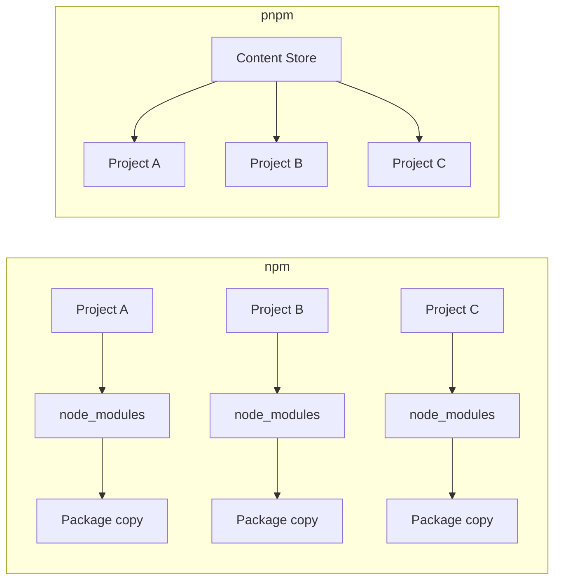
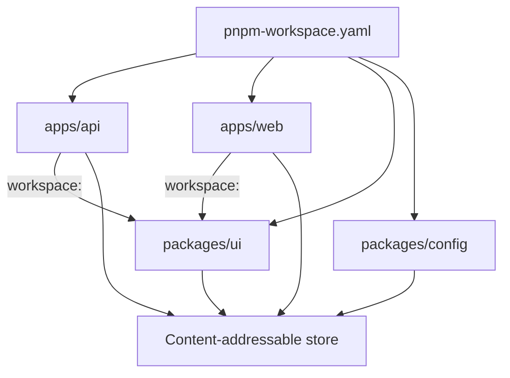

Three clones of the same `package.json` do not leave the same `node_modules` on disk. They do not fail in the same ways. A laptop with a warm cache installs in seconds; CI, starting from an empty runner, does not. A package imported in development disappears after the next lockfile change.

That is not a missing `install` command. It is a dependency-management model.

npm, pnpm, and modern Yarn all talk to the same registry and all produce a lockfile. They disagree on where bytes live, which packages your source is allowed to see, and what "reproducible" means when the same repo is installed on a laptop, in CI, and inside a Docker build. The interesting comparison is that model — not which binary is a few characters shorter.

> pnpm is especially attractive when you need disk efficiency, dependency isolation, monorepos, and reproducible installs. npm remains an excellent default because it ships with Node.js. Modern Yarn is a different design: Plug'n'Play and Zero-Installs, not a faster npm.

This article is written against **pnpm 11**, the current stable line, and treats **pnpm 12** (a Rust rewrite, release candidate at the time of writing) as the same product with a different implementation. npm examples follow the current CLI. Yarn means **Yarn Berry** (2+), not Yarn Classic, unless Classic is named.

## The problem is dependency management, not the CLI

A Node.js project does not "have dependencies." It has a graph. `package.json` names the packages you asked for. Those packages name others. The installer must resolve versions, fetch tarballs, and materialize a tree that Node.js can load.

That job creates the same class of problems in every team that grows past a toy repo.

**Duplication and disk.** Three applications on one machine that all depend on `typescript@5.8.2` can store three copies of the same files. A monorepo with twenty packages can store twenty. Disk is cheap until the checkout, the Docker layer, or the CI cache is not.

**Slow installs.** Resolve, fetch, and write are different costs. A cold machine pays all three. A warm laptop that already has the tarballs still pays for copying them into `node_modules`. CI often looks like a cold machine with a lockfile: resolution is done, the bytes are not.

**Resolution.** `^5.1.0` is a range, not a version. Two installs a week apart can pick different versions unless a lockfile pins the graph. Two package managers can pin the same ranges to different trees.

**Isolation.** Node.js resolves modules by walking up from the calling file and looking into `node_modules`. If the installer flattens the tree, your application can `import` a package it never declared. That is a **phantom dependency**: it works because something else pulled the package in and the installer hoisted it where your code can see it.

**Reproducibility.** "It works on my machine" is often "my `node_modules` is not the one CI built." A lockfile that is not enforced, a cache that is not the same, or a package manager version that differs by one minor, is enough.

**Monorepos.** Once you have `apps/api` and `packages/ui`, you also have shared versions, local protocols, script orchestration, and a CI job that should not rebuild the world to test one package.

**Local versus CI.** A developer reinstalls with a populated store and an existing `node_modules`. CI starts from a clone. Comparing those two wall clocks as if they measured the same operation is how "pnpm is 2x faster" becomes a slogan instead of a measurement.

None of these problems requires you to switch package managers. They do require you to know which model you are buying.

## What a package manager actually does

Every mainstream Node.js installer runs the same three stages, with different costs in the last one.

1. **Resolve.** Read manifests, walk the graph, pick versions that satisfy ranges and peer constraints, write a lockfile.
2. **Fetch.** Download tarballs (or reuse a cache / store).
3. **Materialize.** Put files where the runtime will find them.

```bash
npm install
pnpm install
yarn install
```

Those commands are not the product. They are the same verb over three layouts. The same is true of scripts:

```bash
npm run build
pnpm build
yarn build
```

`pnpm build` is `pnpm run build` without `run`. That is convenience. It does not change how `lodash` gets onto disk or whether `import lodash from "lodash"` is legal.

pnpm's own motivation page describes its install as resolve, calculate the directory structure, then **link** from a store instead of writing a fresh copy of every file into every project. Yarn Plug'n'Play skips `node_modules` and hands Node.js a loader map. npm, by default, hoists and copies into a per-project tree.

If you only compare CLI syntax, you will pick a tool for the wrong reason.

## How npm lays out `node_modules`

npm is the reference implementation of the ecosystem. It ships with Node.js. Every tutorial, generator, and native addon that assumes a flat `node_modules` was written against it. That compatibility is a feature, not inertia.

Since npm 3 the default tree is **hoisted**. Shared packages bubble toward the root of `node_modules` so the same version is not nested under every parent. You save some duplication versus the old nested layout. You also make every hoisted package importable from application code, whether or not it appears in _your_ `package.json`.

```text
node_modules/
├── express/
├── qs/          # express asked for this; npm hoisted it
├── debug/       # so did something else
└── ...
```

`package-lock.json` pins the resolved graph. `npm ci` is the CI command: the lockfile must already exist, it must match `package.json`, `node_modules` is removed first, and npm will not rewrite the lockfile. That is the reproducibility story. It is a good one.

npm Workspaces let one root `package.json` declare local packages:

```json
{
  "name": "acme",
  "private": true,
  "workspaces": ["apps/*", "packages/*"]
}
```

`npm install` then links those workspaces into `node_modules` instead of asking you to run `npm link` by hand. Filters exist (`--workspace`, `--workspaces`). The model is still a hoisted tree unless you change it.

npm can isolate. `--install-strategy=linked` installs into `node_modules/.store` and links in place, unhoisted. The npm developers guide recommends that layout for package authors who want undeclared imports to fail during development. It is not the default. Most npm projects still hoist.

If the team is small, the repo is one package, and nobody is fighting disk or phantom imports, npm is not "legacy." It is the tool that is already there.

## How pnpm stores packages

pnpm's bet is: keep a traditional `node_modules` that Node.js already understands, but stop copying the same file into every project.

The store is **content-addressable**. A file is stored once, keyed by its contents. If `typescript@5.8.2` and `typescript@5.8.3` differ by one file out of a hundred, the store adds that one file. It does not clone the other ninety-nine. pnpm's motivation page states this as the disk argument: one copy on disk, many projects, and incremental storage when versions almost match.



"Content-addressable" means the address of a file is derived from what the file is, not from the package name or the project that asked for it. `left-pad@1.3.0` in `apps/api` and `left-pad@1.3.0` in `apps/web` are the same bytes. The store keeps them once.

Projects do not copy those bytes by default. pnpm **imports** them into a virtual store:

- **Clone / reflink** (copy-on-write) when the filesystem supports it — preferred on many Linux and macOS volumes.
- **Hard link** when clone is not available — common on Windows Dev Drive, and the method the docs describe most often.
- **Copy** when the store and the project are on different volumes, or the filesystem cannot link.

A hard link is a second directory entry for the same inode. Two paths, one file, no extra data blocks. A reflink is a copy that shares blocks until one side writes. Either way, `du` on three projects can look large while the actual unique bytes stay in the store.

That is why pnpm can save disk **without abandoning `node_modules`**. Node.js still walks directories. The files it opens happen to be links into a store. Yarn Plug'n'Play solves duplication by not creating `node_modules` at all. pnpm solves it by making `node_modules` cheap.

The win is conditional. Links only work when the store and the project share a volume. Across disks, pnpm copies, and you pay the npm-shaped cost. A cold CI runner with an empty store still downloads. Cache the store if you want the third stage to be linking; do not assume the cache always wins — pnpm's CI docs say caching is optional and not guaranteed to be faster.

## The `.pnpm` layout and Node's resolver

After the store import, pnpm builds a directory Node.js can resolve. The default `nodeLinker` is `isolated`.

```text
node_modules/
├── .pnpm/
│   ├── express@5.1.0/node_modules/express
│   ├── qs@6.14.0/node_modules/qs
│   └── node_modules/          # default hoist of the graph
├── express -> .pnpm/express@5.1.0/node_modules/express
└── .bin/
```

`.pnpm` is the **virtual store** for this project. Package contents are linked in from the content-addressable store. Around them, pnpm creates **symlinks** that reconstruct the dependency graph: `express` gets a `node_modules` that points at `qs`, not at whatever happened to be flattened at the repo root.

At the project root, only **direct** dependencies are symlinked. `express` is in your `package.json`, so `node_modules/express` exists. `qs` is not, so `node_modules/qs` does not.

Node.js module resolution walks up from the file that called `require` / `import` and looks for `node_modules/<name>`. It also realpath's symlinks. When `express` loads `qs`, Node starts from the real path of `express` — inside `.pnpm/express@5.1.0/` — and finds `qs` next to it. Your `src/server.ts` starts from the project root and only sees what the root `node_modules` exposes.

That is why the layout is compatible with Node's algorithm _and_ stricter than a hoisted tree. You keep `node_modules`. You do not keep the accidental root imports.

It is not an absolute firewall. To reduce breakage from packages that import undeclared dependencies, pnpm **hoists the graph into `node_modules/.pnpm/node_modules` by default**. A dependency that reaches into that hoist can still resolve a phantom. Application code at the repo root usually cannot. Set `hoist: false` if you want the stricter layout and are willing to patch or replace packages that depend on the leak. Set `nodeLinker: hoisted` if a tool cannot follow symlinks and you need an npm-shaped tree. That is an escape hatch, not the default.

pnpm also has a `pnp` linker and an experimental **global virtual store** (`enableGlobalVirtualStore`). The global store moves `.pnpm` out of each project so many checkouts symlink into one shared layout. It is not the default for project installs; some tools still assume a local `.pnpm`. Do not turn it on because a blog post said it was faster.

## Why dependency isolation matters

Take a small API:

```json
{
  "name": "@acme/api",
  "type": "module",
  "dependencies": {
    "express": "^5.1.0"
  }
}
```

```ts
import express from "express";
import lodash from "lodash";

const app = express();
app.get("/health", (_req, res) => {
  res.json({ ok: true, keys: Object.keys(lodash) });
});
```

`lodash` is not in `package.json`. Under a hoisted installer, this can still load. Another workspace package depends on `lodash`, or a transitive dependency does, and the installer lifts it to a `node_modules/lodash` that Node finds from `src/server.ts`. The unit tests pass. The Docker image built from a slimmer graph, or a teammate who does not have that other package, throws `ERR_MODULE_NOT_FOUND`.

That is the phantom-dependency bug. npm's own developers guide describes it the same way: the import is satisfied by accident, then fails for whoever installs the package alone. Their recommended check is `--install-strategy=linked`. pnpm's default isolated layout is the same idea applied to everyday installs.

With pnpm's root symlinks, `import lodash from "lodash"` fails on the laptop the moment you type it. You add the dependency, the lockfile records it, CI installs it. The failure moved left.

It does not catch every case. A `devDependency` that is present in development and missing in production, or a package that resolves through the default `.pnpm` hoist, can still hide a declaration. Isolation is a constraint on the resolver, not a proof of a correct `package.json`.

Reproducibility improves because the set of packages your source can see is closer to the set you declared. The lockfile then pins that set. `pnpm install --frozen-lockfile` (and the automatic frozen mode pnpm enables when it detects CI) refuses to proceed if the lockfile would have to change. That is the same job `npm ci` does for npm.

## Monorepos and workspaces

A workspace is one repo, many packages, one installer. pnpm requires a `pnpm-workspace.yaml` at the root. That file is also where pnpm 11 expects most settings — `.npmrc` remains for auth and registry, not for `hoistPattern` or `nodeLinker`.

```text
acme/
├── apps/
│   ├── api/
│   └── web/
├── packages/
│   ├── ui/
│   ├── config/
│   └── eslint-config/
├── package.json
├── pnpm-workspace.yaml
└── pnpm-lock.yaml
```

```yaml
packages:
  - apps/*
  - packages/*

catalog:
  express: ^5.1.0
  typescript: ^5.8.0
```



**Workspaces** tell pnpm which folders are packages. One `pnpm install` at the root installs the graph. `sharedWorkspaceLockfile` defaults to `true`: one `pnpm-lock.yaml`, one virtual store at the root, per-package `node_modules` that only symlink what that package declared. Isolation is preserved even though the bytes are shared.

**`workspace:`** is the protocol that refuses to resolve a local package from the registry. `"@acme/ui": "workspace:^"` links the workspace package or fails. A bare version range can silently download a published copy if `linkWorkspacePackages` is off (the default) and the range does not use `workspace:`. On publish, pnpm rewrites `workspace:` to a real semver range so consumers who are not in the repo can install the package.

**Catalogs** put repeated version ranges in one place. `express: "catalog:"` in each `package.json` reads `^5.1.0` from `pnpm-workspace.yaml`. Upgrades become one edit. Merge conflicts in twenty manifests become a conflict in one file. `catalog:` is replaced on publish, same as `workspace:`.

**Filters** restrict a command to a subset of the workspace:

```bash
pnpm --filter api dev
pnpm --filter web build
pnpm --filter ui test
```

`--filter api` is "run `dev` in the package named `api`" — start the API without starting the frontend. `--filter web build` is a production build of the frontend only. `--filter ui test` is the unit tests for the design system after you changed a button, not a full monorepo CI.

Selectors can include dependencies and dependents:

```bash
pnpm --filter api... build
pnpm --filter ...ui test
```

`api...` is `api` plus its workspace dependencies — build `ui` before the API if the API imports it. `...ui` is `ui` plus the packages that depend on it — retest `web` when `ui` changes. That is how a monorepo CI stays proportional to the diff instead of to the repo size.

`pnpm -r` / `pnpm --recursive` runs a script in every package. Combine it with filters when "every package" is the wrong set.

None of this is unique in kind. npm and Yarn have workspaces. pnpm is interesting here because the store, the isolated layout, and the filter language sit on the same model: one graph, one lockfile, packages that cannot see each other's undeclared dependencies.

## A realistic company monorepo

```text
acme/
├── apps/
│   ├── api/
│   ├── web/
│   └── admin/
└── packages/
    ├── ui/
    ├── eslint-config/
    ├── tsconfig/
    └── shared/
```

### Problem

With a traditional npm layout and no workspaces, this becomes several repos or several nested `node_modules`. `shared` is published to a private registry, or copied, or `npm link`ed. `eslint-config` drifts: api is on `typescript-eslint@8`, admin is on `7`. CI clones three apps and installs three graphs. A phantom `lodash` in `web` came from `admin`'s tree on a developer's machine that had both checkouts as siblings. Disk holds three copies of `typescript` and two of `react`.

npm Workspaces already fix the linking and the single lockfile. They do not, by default, stop the hoist from leaking `lodash` into `web`, and they do not put `typescript` in a content-addressable store shared with the other repos on the same laptop.

### Solution

A pnpm workspace makes the repo one install. `apps/web` depends on `@acme/ui` and `@acme/shared` with `workspace:^`. All three apps take `typescript` from `catalog:`. `pnpm --filter api... build` builds `shared` then `api`. CI caches the store keyed on `pnpm-lock.yaml` and runs `pnpm install` in frozen mode.

```json
{
  "name": "@acme/web",
  "dependencies": {
    "@acme/ui": "workspace:^",
    "@acme/shared": "workspace:^",
    "react": "catalog:"
  },
  "devDependencies": {
    "typescript": "catalog:"
  }
}
```

### Result

You should expect, conceptually — not as a promised speedup:

- **Dependency management.** One lockfile, one resolution, `workspace:` instead of `npm link`.
- **DX.** `pnpm --filter web dev` from the root. Adding a package in `ui` is visible to `web` on the next install, not after a publish.
- **CI.** Filters and a shared store reduce "install the universe, then test one package." Caching may help; it is not guaranteed.
- **Monorepo management.** Catalogs keep `typescript` at one range. Overrides and patches, when you need them, live in `pnpm-workspace.yaml`.
- **Reproducibility.** Frozen lockfile in CI. Isolation makes undeclared imports fail before merge.
- **Disk.** The store keeps `typescript` once per unique file set on that machine. Three apps link it.

Do not attach a percentage to that list. The shape of the improvement is the model. The size depends on the graph.

## CI/CD, Docker, and reproducibility

CI is where the model shows up as a bill.

**Frozen lockfiles.** In CI, pnpm turns on frozen-lockfile mode automatically: if `pnpm-lock.yaml` is missing or would change, the install fails. You can be explicit:

```bash
pnpm install --frozen-lockfile
```

That is the counterpart of `npm ci`. Since pnpm 11, CI also fails when the lockfile was written by a newer major than the pnpm running in the job. Pin the same major in the image that wrote the lockfile.

**Caching.** Cache the store and, since 11.22, the metadata cache (`pnpm cache path`). Key the cache on `pnpm-lock.yaml`. pnpm's CI page is explicit: this is not required, and it is not guaranteed to make the install faster. A warm store turns fetch+write into link. A cold cache, a tiny graph, or a slow cache restore can lose to a clean download. Treat cache as an experiment, not a headline.

Only restore those directories into jobs you trust. The store is a trusted cache.

**`pnpm fetch`.** Fetch reads the lockfile and `pnpm-workspace.yaml`, ignores `package.json`, and fills the virtual store. That is a Docker-layer trick. `package.json` changes when you bump a version, edit a script, or add a field. The lockfile changes when the graph changes. If you `COPY` only the lockfile first, a script edit does not bust the fetch layer.

```dockerfile
FROM node:22-bookworm-slim
WORKDIR /app

ENV PNPM_HOME="/pnpm"
ENV PATH="$PNPM_HOME:$PATH"

RUN apt-get update \
  && apt-get install -y --no-install-recommends ca-certificates curl \
  && rm -rf /var/lib/apt/lists/* \
  && curl -fsSL https://get.pnpm.io/install.sh | env PNPM_HOME="$PNPM_HOME" SHELL="$(which bash)" bash -

COPY pnpm-lock.yaml pnpm-workspace.yaml ./
# COPY patches patches
RUN pnpm fetch --prod

COPY . .
RUN pnpm install -r --offline --prod

EXPOSE 8080
CMD ["node", "apps/api/server.js"]
```

`--offline` refuses to hit the registry. If `fetch` did its job, `install` only links. Official pnpm docs show the same `fetch` → `COPY` → `install --offline` sequence. Their snippet still uses Corepack on `node:20`; Node.js 25+ no longer ships Corepack, so the example above installs the standalone binary instead. Use whichever install path your base image actually has.

`file:` dependencies are skipped during `fetch` because those directories may not exist yet. Copy the source before the offline install if you have them.

**`pnpm deploy`.** In a monorepo you often want one app, not the workspace. `pnpm --filter api --prod deploy ./pruned` copies `api` and an isolated `node_modules` into `pruned`. The directory is portable: copy it into a runtime image. Default deploy expects `inject-workspace-packages: true` (or `--legacy` / `force-legacy-deploy`). Even with a global virtual store enabled, deploy writes a local virtual store so the output is self-contained.

**GitHub Actions.** Current pnpm CI docs install pnpm with `pnpm/setup`, let it install Node, and read the version from `packageManager`. They no longer recommend Corepack in CI: Corepack is a Node shim, and every `pnpm` invocation pays for that process. Installing pnpm itself avoids it.

```yaml
name: CI
on: [push, pull_request]

jobs:
  build:
    runs-on: ubuntu-24.04
    steps:
      - uses: actions/checkout@v6
      - uses: pnpm/setup@v2
        with:
          runtime: node@22
          cache: true
          install: false
      - run: pnpm install --frozen-lockfile
      - run: pnpm --filter api... test
      - run: pnpm --filter api... build
```

`cache: true` caches the store. `install: false` keeps the install step visible in the workflow; omit it if you want the action to run `pnpm install` for you. The pnpm version comes from `"packageManager": "pnpm@11.20.0"` in `package.json`.

**`pnpm dlx` / `pnx`.** One-shot CLIs (`pnpm dlx create-vue my-app`) without adding a dependency. Useful in CI for generators. Not a substitute for a pinned devDependency in a production pipeline.

**Side-effects cache.** If a package's `preinstall` / `install` / `postinstall` rewrites its own files (native addons, codegen), pnpm can store that result and reuse it on the next install on the same machine. That is why a second install of a native module can be much cheaper than the first. Disable it when those scripts must always run against the current environment.

## Benchmarks without slogans

Do not write "pnpm is 2x faster" as a property of the tool.

Install time is a function of the graph, the cache, the lockfile, whether `node_modules` already exists, the disk, the OS, the network path to the registry, and whether the machine is a laptop or a CI runner. A warm install on an NVMe drive and a cold install on a GitHub-hosted runner are different experiments.

pnpm publishes a [benchmarks page](https://pnpm.io/benchmarks) that compares npm, pnpm, Yarn, Yarn PnP, and Bun across those dimensions. Each row states which of `cache`, `lockfile`, and `node_modules` were already present. Read it as "under this fixture, on their hardware, at that date," not as a SLA.

Map the rows to real work:

| Scenario         | What it resembles                                 |
| ---------------- | ------------------------------------------------- |
| Cold install     | New machine, empty store, maybe no lockfile       |
| Warm install     | Developer reinstall, store already populated      |
| CI install       | Lockfile present, store maybe restored from cache |
| Monorepo install | Many packages, one lockfile, linking dominates    |
| Disk usage       | Unique bytes in the store versus copied trees     |

A cold CI job with no cache should look closer to npm than a third install on your laptop. A warm laptop is where linking and the content-addressable store show up. Yarn PnP and Bun appear in the same tables because they skip or replace `node_modules`; that is a different trade, not a faster pnpm.

If you need a number, measure _your_ lockfile on _your_ runners. If you do not have that number, do not invent one.

## How modern Yarn is a different bet

Yarn Classic (v1) hoisted like npm and popularized the lockfile. Comparing pnpm to Classic is comparing two 2017-era trees. **Yarn Berry** (2+, often called Yarn Modern) changed the runtime.

The switch is `.yarnrc.yml` and `nodeLinker`:

```yaml
nodeLinker: pnp
```

Yarn documents three stable install modes:

- **`pnp` (default).** Plug'n'Play. No `node_modules`. A `.pnp.cjs` loader tells Node where each package lives, often inside zip archives in a content-addressable cache. Ghost dependencies fail with a Yarn error instead of a missing file. IDEs and tools that walk `node_modules` need the Yarn SDK. Some packages need `packageExtensions`.
- **`pnpm`.** A virtual store plus hard links and symlinks, conceptually close to pnpm's layout, using Yarn's own store.
- **`node-modules`.** The classic tree. Maximum compatibility, including with tools that cannot follow PnP.

**Zero-Installs** is not a third linker. It is a workflow: keep the cache inside the repo (`.yarn/cache`), commit the PnP loader, and treat `git checkout` as "ready to run." Yarn's cache docs describe it as removing the installer from the critical path when you switch branches. Native addons still need an install. Committing `node_modules` is the same idea done badly — too many files, too much hoist churn. Committing zip archives plus one loader is the version Git can track.

That is a coherent design. It is not "Yarn but faster." It asks the toolchain to speak PnP. If your editors, test runners, and native addons already do, Zero-Installs can make CI look like a checkout. If they do not, you will spend the migration on `packageExtensions` and SDKs, or you will set `nodeLinker: node-modules` and give the PnP advantages back.

pnpm's default is the opposite compromise: keep Node's `node_modules` algorithm, make the files cheap, isolate the root. Yarn's default is: replace the algorithm. Comparing them only on install seconds misses the point both teams are making.

## Technical comparison

These are different defaults, not scores. A "yes" is not a win.

| Characteristic            | pnpm                                                     | npm                                        | Yarn (Berry)                                       |
| ------------------------- | -------------------------------------------------------- | ------------------------------------------ | -------------------------------------------------- |
| Lockfile                  | `pnpm-lock.yaml`                                         | `package-lock.json`                        | `yarn.lock`                                        |
| Workspaces                | `pnpm-workspace.yaml`, `workspace:`, catalogs            | `workspaces` in `package.json`             | `workspaces` in `package.json`                     |
| Monorepos                 | Isolated packages, shared store, `--filter`              | Workspaces, hoisted by default             | Workspaces; filters; linker-dependent layout       |
| Dependency isolation      | Default isolated root; optional hoist / `hoisted` linker | Hoisted default; `install-strategy=linked` | Strict under PnP; hoisted under `node-modules`     |
| Content-addressable store | Global store; files linked into each project             | Per-project copies                         | Cache / CAS; layout depends on `nodeLinker`        |
| Plug'n'Play               | `nodeLinker: pnp` (not the default)                      | No                                         | Default `nodeLinker: pnp`                          |
| Zero-Installs             | Not the intended workflow                                | Not the intended workflow                  | Cache + PnP committed to git                       |
| `node_modules`            | Yes (virtual store + symlinks)                           | Yes (hoisted or linked)                    | No under PnP; yes under other linkers              |
| CI/CD                     | Frozen lockfile, `fetch`, `deploy`, store cache          | `npm ci`, npm cache                        | Frozen installs; Zero-Installs as an alternative   |
| Disk efficiency           | Shared store + links; copy across volumes                | Copies per project                         | Shared cache; zips under PnP                       |
| Ecosystem compatibility   | High; some tools dislike symlinks                        | Highest; the ecosystem default             | Highest with `node-modules`; PnP needs cooperation |

## When should you choose pnpm?

Each case is a problem, a property of pnpm, and a benefit — not a ranking.

### A medium or large Node.js / TypeScript project

**Problem.** The graph is large enough that copying `node_modules` is slow and noisy, and someone will import a hoisted transitive package. **Property.** Content-addressable store plus isolated root. **Benefit.** Reinstalls on a warm machine are mostly linking, and undeclared imports fail in development.

### A monorepo

**Problem.** Several apps and libraries must share versions and local packages without `npm link`. **Property.** Workspaces, `workspace:`, catalogs, `--filter`. **Benefit.** One lockfile, one install, commands that target a package and its dependents.

### Many applications sharing packages on one machine

**Problem.** Laptops and build agents hold several checkouts of related services. **Property.** One store, many projects. **Benefit.** Disk growth tracks unique files, not checkout count — as long as everything lives on the same volume.

### Teams that want dependency isolation

**Problem.** Phantom imports pass CI on one graph and fail on another. **Property.** Root `node_modules` only exposes direct dependencies. **Benefit.** The `package.json` becomes a closer description of what the code can load. npm's linked strategy can do this too; pnpm makes it the default.

### CI/CD that installs often

**Problem.** Every pipeline starts with "download the internet." **Property.** Fetch-from-lockfile, offline install, optional store cache, deploy for one app. **Benefit.** Docker layers and CI jobs can reuse bytes when the lockfile is stable. Measure it; do not assume it.

### Projects where disk usage matters

**Problem.** CI caches, Docker images, or developer SSDs are the constraint. **Property.** Deduplicated store and links. **Benefit.** Less unique data than three hoisted copies of the same graph. Images still contain a `node_modules`; `pnpm deploy --prod` is how you stop shipping the workspace.

### Organizations standardizing tooling

**Problem.** Half the repos are npm, half are Yarn Classic, lockfiles disagree, onboarding is folklore. **Property.** `packageManager` field, one workspace layout, one CI action. **Benefit.** A single installer version and a single mental model — if the org is willing to migrate. Standardizing on npm is the same benefit with less change.

## When you should not

The best package manager is the one that matches the problem you are solving.

**A small project where npm already works.** One `package.json`, a handful of dependencies, no monorepo, no disk pressure. `npm ci` is enough. Introducing pnpm adds a binary, a lockfile format, and a CI step for no operational gain.

**A toolchain that assumes a flat `node_modules` and cannot be patched.** Some generators, bundler plugins, and native addons walk the tree or refuse symlinks. Try `nodeLinker: hoisted` or `shamefully-hoist`. If that becomes the standing configuration, you have paid pnpm's complexity for npm's layout. Stay on npm, or use Yarn with `nodeLinker: node-modules`.

**An organization already standardized on another installer.** Consistency across fifty repos beats a local optimum in one. A single npm shop with working `npm ci` is healthier than three lockfile formats and a wiki page.

**A project that wants Yarn's design, not pnpm's.** If Zero-Installs (committed cache + PnP) is the point — offline checkouts, no install step on branch switch, tools that already speak PnP — Yarn is the tool that optimized for that. pnpm will not become that workflow by accident.

**A team that does not want another tool.** pnpm is not bundled with Node.js. Someone must install it, pin it, and teach it. That cost is real. npm's advantage is that it is already on the machine.

**Compatibility incidents you cannot afford.** Isolated installs surface missing declarations. That is the feature. It is also a migration tax: every phantom import becomes a ticket. Budget that work, or do not switch in the week before a release.

## Migrating from npm (or Yarn) to pnpm

Install pnpm itself first. Current docs prefer the standalone script or `npx get-pnpm`. On Windows they currently recommend npm because Defender has blocked the standalone binary. Homebrew, winget, Scoop, and Chocolatey also ship it. pnpm 11 needs Node.js 22+ if you install it as a JavaScript package; the standalone executable can then install Node via `pnpm runtime set node lts -g`.

```bash
npx get-pnpm
# or, on macOS/Linux:
# curl -fsSL https://get.pnpm.io/install.sh | sh -
```

Pin the version the repo expects:

```bash
# writes packageManager into package.json and installs
# (Corepack, Node 14.19–24 only)
corepack enable
corepack use pnpm@11.20.0
```

On Node 25+, Corepack is not in the official distribution. Install Corepack with `npm install -g corepack` if you still want it, or skip it: add the field by hand and let pnpm switch to that version on first use.

```json
{
  "packageManager": "pnpm@11.20.0"
}
```

If the repo is a monorepo, write `pnpm-workspace.yaml` **before** importing. `pnpm import` will not invent workspace membership.

```yaml
packages:
  - apps/*
  - packages/*
```

Import the existing lockfile, then install:

```bash
pnpm import
pnpm install
```

`pnpm import` reads `package-lock.json`, `npm-shrinkwrap.json`, or `yarn.lock` and writes `pnpm-lock.yaml`. Resolution will not be a byte-identical tree. Review the diff. Then remove the old lockfile so nobody runs the wrong installer by habit.

```bash
git rm package-lock.json
# or: git rm yarn.lock
```

Move pnpm settings out of `.npmrc` except auth and registry. In pnpm 11 they belong in `pnpm-workspace.yaml`.

Update CI and Docker to install pnpm (standalone script or `pnpm/setup`), run `pnpm install --frozen-lockfile`, and cache the store if you have measured a win. Replace `npm ci` and `npm run` with the pnpm equivalents. Replace `npx` one-shots with `pnpm dlx` only where you mean it.

### Migration checklist

- Install pnpm 11 on a Node 22+ machine (or use the standalone binary).
- Set `"packageManager": "pnpm@11.20.0"` (exact version you actually run).
- Add `pnpm-workspace.yaml` if this is a monorepo.
- Run `pnpm import` when a `package-lock.json` or `yarn.lock` exists.
- Run `pnpm install` and fix phantom imports the isolated tree reveals.
- Delete the old lockfile. Commit `pnpm-lock.yaml`.
- Point workspace deps at `workspace:` (and catalogs, if you want them).
- Update GitHub Actions / GitLab / whatever installs dependencies.
- Update Dockerfiles (`fetch` + offline install, or `deploy` for one app).
- Search the repo for `npm ci`, `npm install`, `npx`, and Yarn-only config.
- Tell the team: use the pinned pnpm, not a global random major.

## Pin the package manager version

`packageManager` in `package.json` is the Node.js convention for "this repo uses this installer at this version." Corepack reads it. pnpm 11 also reads `packageManager` and `devEngines.packageManager`, and by default downloads the declared version if the one on `PATH` does not match (`pmOnFail: download`).

```json
{
  "packageManager": "pnpm@11.20.0",
  "devEngines": {
    "packageManager": {
      "name": "pnpm",
      "version": "11.20.0",
      "onFail": "error"
    }
  }
}
```

That is how you stop "works on my pnpm 10, fails on CI's pnpm 11." Onboarding becomes "clone, install the pinned tool, install the graph," not "which global did you brew last year?"

Corepack can append a SHA-224 hash (`pnpm@11.20.0+sha224.…`) and will verify it. Useful if Corepack is how you distribute the binary. Not required for pnpm's own version switching.

Do not treat Corepack as the only mechanism. It is experimental, it was removed from Node.js 25+ tarballs, and pnpm's CI docs moved off it. The field in `package.json` is the portable part. Corepack, `pnpm/setup`, `mise`, Volta, and a standalone install are all ways to honor it.

`pnpm env` is deprecated. To install Node with pnpm, use `pnpm runtime set node 22 -g`.

## The installer is a dependency-management model

pnpm is a strong default when the pain is duplicated bytes, leaked imports, a monorepo, or installs you want to reproduce in CI and Docker. It keeps Node's `node_modules` algorithm and makes the files cheap. That is a specific design, and it has costs: another tool to pin, symlinks some tooling still dislikes, and a migration that will surface every phantom import you had been hoisting past.

npm is still the right answer when the project is small, the org standard is npm, or compatibility with the ecosystem default matters more than the store. It now has workspaces, `npm ci`, and an optional linked install strategy. It does not need to "catch up" to be legitimate.

Modern Yarn is the right answer when you want Plug'n'Play or Zero-Installs and the toolchain will meet you there. That is not a slower pnpm. It is a different runtime for packages.

Pick the model that matches the failure you are actually having. The CLI binary is the least important part of that decision.

## Sources

- pnpm, [Motivation](https://pnpm.io/motivation) — content-addressable store, linking versus copying, non-flat `node_modules`
- pnpm, [Symlinked `node_modules` structure](https://pnpm.io/symlinked-node-modules-structure) — `.pnpm`, hard links, symlinks, Node resolution, default hoist into `.pnpm/node_modules`
- pnpm, [Node-modules and hoisting settings](https://pnpm.io/settings/node-modules) — `nodeLinker` (`isolated` / `hoisted` / `pnp`), virtual store, global virtual store
- pnpm, [Settings](https://pnpm.io/settings) — `pnpm-workspace.yaml` as the config file; `.npmrc` for auth and registry only
- pnpm, [Workspace](https://pnpm.io/workspaces) — `workspace:`, shared lockfile, `linkWorkspacePackages`
- pnpm, [Catalogs](https://pnpm.io/catalogs) — `catalog:` protocol, default and named catalogs
- pnpm, [Filtering](https://pnpm.io/filtering) — `--filter` selectors, dependents and dependencies
- pnpm, [pnpm install](https://pnpm.io/cli/install) — `--frozen-lockfile`, `--offline`
- pnpm, [pnpm fetch](https://pnpm.io/cli/fetch) — lockfile-only fetch, Docker layer caching
- pnpm, [pnpm deploy](https://pnpm.io/cli/deploy) — portable workspace package, `inject-workspace-packages`
- pnpm, [pnpm import](https://pnpm.io/cli/import) — lockfile import from npm and Yarn
- pnpm, [pnpm runtime](https://pnpm.io/cli/runtime) — Node version management; `pnpm env` deprecated
- pnpm, [pnx / dlx](https://pnpm.io/cli/pnx) — one-shot package execution
- pnpm, [Installation](https://pnpm.io/installation) — standalone script, `npx get-pnpm`, pnpm 11 versus 12 RC, Node compatibility
- pnpm, [Continuous Integration](https://pnpm.io/continuous-integration) — standalone install, `pnpm/setup`, store cache caveats, frozen lockfile in CI
- pnpm, [Benchmarks](https://pnpm.io/benchmarks) — official fixtures; cache / lockfile / `node_modules` matrix
- pnpm, [Other settings](https://pnpm.io/settings/other) — `sideEffectsCache`, `cacheDir`
- npm, [Workspaces](https://docs.npmjs.com/cli/v11/using-npm/workspaces) — npm workspaces
- npm, [npm ci](https://docs.npmjs.com/cli/v11/commands/npm-ci) — clean, lockfile-frozen installs
- npm, [Developers — phantom dependencies](https://docs.npmjs.com/cli/v11/using-npm/developers) — hoisted leaks, `--install-strategy=linked`
- npm, [install-strategy](https://docs.npmjs.com/cli/v11/using-npm/config#install-strategy) — `hoisted`, `nested`, `shallow`, `linked`
- Yarn, [Install modes](https://yarnpkg.com/features/linkers) — `nodeLinker`: `pnp`, `pnpm`, `node-modules`
- Yarn, [Plug'n'Play](https://yarnpkg.com/features/pnp) — loader instead of `node_modules`
- Yarn, [Cache strategies / Zero-Installs](https://yarnpkg.com/features/zero-installs) — offline mirror, committed cache and PnP loader
- Node.js, [Corepack (v24)](https://nodejs.org/docs/latest-v24.x/api/corepack.html) — `packageManager`, experimental; still bundled on the 24.x line
- Node.js, [Corepack (current)](https://nodejs.org/dist/latest/docs/api/corepack.html) — no longer distributed starting with Node.js 25
- Corepack, [README](https://github.com/nodejs/corepack) — `corepack use`, `devEngines.packageManager`, userland install via `npm install -g corepack`
- Docker, [Multi-stage builds](https://docs.docker.com/build/building/multi-stage/) — copying a pruned filesystem into a runtime image
