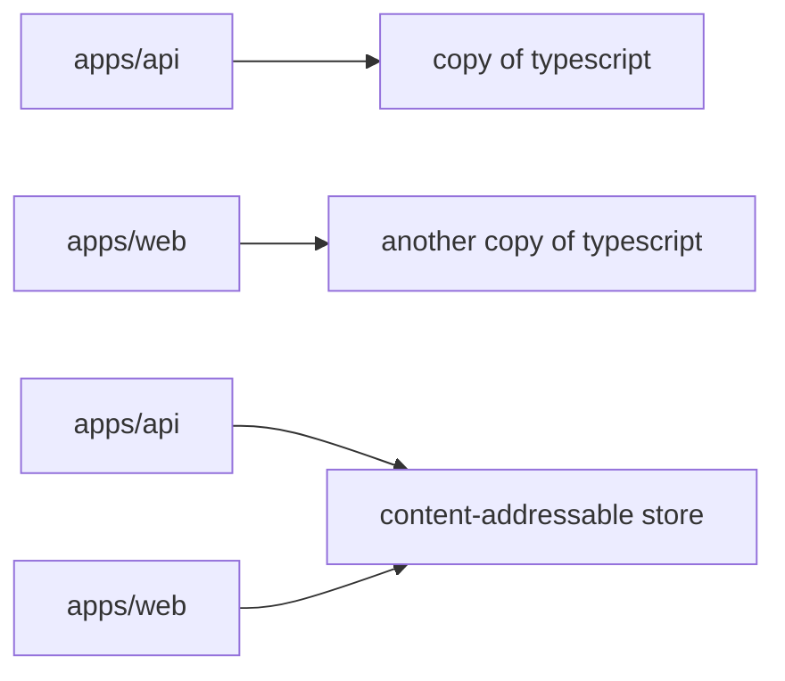
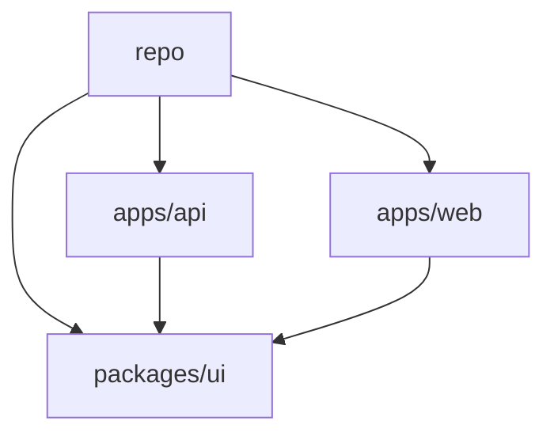

Three clones of the same `package.json` do not leave the same `node_modules` on disk. They do not fail in the same ways. A laptop with a warm cache installs in seconds; CI, starting from an empty runner, does not. A package imported in development disappears after the next lockfile change.

That is not a missing `install` command. It is a dependency-management model.

npm, pnpm, and modern Yarn talk to the same registry and all produce a lockfile. They disagree on where bytes live, which packages your source may see, and what "reproducible" means on a laptop, in CI, and in Docker. Compare that model — not which binary is shorter.

> pnpm is especially attractive when you need disk efficiency, dependency isolation, monorepos, and reproducible installs. npm remains an excellent default because it ships with Node.js. Modern Yarn is a different design: Plug'n'Play and Zero-Installs, not a faster npm.

This article is written against **pnpm 11** (current stable) and treats **pnpm 12** (Rust rewrite, RC at the time of writing) as the same product. Yarn means **Yarn Berry** (2+), not Yarn Classic, unless Classic is named.

## The problem is dependency management, not the CLI

A Node.js project does not "have dependencies." It has a graph. The installer must resolve versions, fetch tarballs, and materialize a tree Node.js can load. That job creates the same problems in every team that grows past a toy repo.

**Duplication and disk.** Three apps that depend on `typescript@5.8.2` can store three copies. Disk is cheap until the checkout, the Docker layer, or the CI cache is not.

**Slow installs.** Resolve, fetch, and write are different costs. A warm laptop still copies into `node_modules`. CI is often a cold machine with a lockfile: resolution is done, the bytes are not.

**Resolution.** `^5.1.0` is a range. Two installs a week apart can pick different versions unless a lockfile pins the graph.

**Isolation.** Node.js walks up from the calling file looking for `node_modules`. If the installer flattens the tree, your app can `import` a package it never declared — a **phantom dependency**.

**Reproducibility.** "It works on my machine" is often "my `node_modules` is not the one CI built."

**Monorepos.** `apps/api` plus `packages/ui` means shared versions, local protocols, and a CI job that should not rebuild the world to test one package.

**Local versus CI.** A developer reinstalls with a populated store. CI starts from a clone. Comparing those wall clocks is how "pnpm is 2x faster" becomes a slogan.

None of these problems requires you to switch tools. They do require you to know which model you are buying. Every installer **resolves**, **fetches**, and **materializes**. `npm install` / `pnpm install` / `yarn install` are the same verb over three layouts. pnpm **links** from a store; Yarn Plug'n'Play skips `node_modules`; npm hoists and copies. If you only compare CLI syntax, you will pick a tool for the wrong reason.

## How npm lays out `node_modules`

npm is the reference implementation of the ecosystem. It ships with Node.js. That compatibility is a feature, not inertia.

Since npm 3 the default tree is **hoisted**. Shared packages bubble toward the root of `node_modules`. You save some duplication versus the old nested layout. You also make every hoisted package importable from application code, whether or not it appears in _your_ `package.json`.

```text
node_modules/
├── express/
├── qs/          # express asked for this; npm hoisted it
├── debug/       # so did something else
└── ...
```

`package-lock.json` pins the graph. `npm ci` is the frozen CI install: lockfile must exist and match, `node_modules` is removed first, the lockfile is not rewritten.

npm Workspaces (`"workspaces": ["apps/*", "packages/*"]`) link local packages; the tree is still hoisted unless you change it. `--install-strategy=linked` isolates like pnpm — recommended in npm's developers guide for catching undeclared imports — but it is not the default.

If the team is small and nobody is fighting disk or phantom imports, npm is the tool that is already there.

## How pnpm stores packages

pnpm's bet is: keep a traditional `node_modules` that Node.js already understands, but stop copying the same file into every project.

The store is **content-addressable**: a file is stored once, keyed by its contents. If `typescript@5.8.2` and `typescript@5.8.3` differ by one file out of a hundred, the store adds that one file. `left-pad@1.3.0` in `apps/api` and in `apps/web` are the same bytes. pnpm's motivation page states the disk argument as one copy, many projects, and incremental storage when versions almost match.

Projects do not copy those bytes by default. pnpm **imports** them into a virtual store with **clone / reflink** (copy-on-write) when the filesystem supports it, **hard link** when clone is unavailable (common on Windows Dev Drive), and **copy** across volumes. `du` on three projects can look large while unique bytes stay in the store.

That is why pnpm can save disk **without abandoning `node_modules`**. Node.js still walks directories; the files happen to be links. Yarn Plug'n'Play solves duplication by not creating `node_modules`. pnpm makes `node_modules` cheap. The win is conditional: links need a shared volume; a cold CI runner with an empty store still downloads. Cache the store if you want the third stage to be linking — pnpm's CI docs say caching is optional and not guaranteed to be faster.



## The `.pnpm` layout and Node's resolver

After the store import, pnpm builds a directory Node.js can resolve. The default `nodeLinker` is `isolated`.

```text
node_modules/
├── .pnpm/
│   ├── express@5.1.0/node_modules/express
│   ├── qs@6.14.0/node_modules/qs
│   └── node_modules/          # default hoist of the graph
├── express -> .pnpm/express@5.1.0/node_modules/express
└── .bin/
```

`.pnpm` is the **virtual store**. Package contents are linked in from the content-addressable store. Around them, pnpm creates **symlinks** that reconstruct the graph: `express` gets a `node_modules` that points at `qs`, not at whatever was flattened at the repo root. At the project root, only **direct** dependencies are symlinked — `node_modules/express` exists, `node_modules/qs` does not.

Node.js walks up from the calling file looking for `node_modules/<name>` and realpath's symlinks. When `express` loads `qs`, Node starts inside `.pnpm/express@5.1.0/` and finds `qs` next to it. Your `src/server.ts` starts from the project root and only sees what the root `node_modules` exposes. You keep `node_modules`. You do not keep accidental root imports.

It is not an absolute firewall. pnpm **hoists the graph into `node_modules/.pnpm/node_modules` by default**, so a dependency can still resolve a phantom; application code at the repo root usually cannot. Set `hoist: false` for the stricter layout, or `nodeLinker: hoisted` if a tool cannot follow symlinks. There is also a `pnp` linker and an experimental **global virtual store** (`enableGlobalVirtualStore`) — do not turn that on because a blog post said it was faster.

## Why dependency isolation matters

Take a small API that declares only `express`:

```ts
import express from "express";
import lodash from "lodash";

const app = express();
app.get("/health", (_req, res) => {
  res.json({ ok: true, keys: Object.keys(lodash) });
});
```

`lodash` is not in `package.json`. Under a hoisted installer this can still load: another workspace package or a transitive dependency pulled it in, and Node finds `node_modules/lodash` from `src/server.ts`. Tests pass. A slimmer Docker graph, or a teammate without that other package, throws `ERR_MODULE_NOT_FOUND`.

That is the phantom-dependency bug. npm's developers guide describes it the same way and recommends `--install-strategy=linked`. pnpm's default isolated layout is the same idea applied to everyday installs: `import lodash from "lodash"` fails on the laptop the moment you type it.

It does not catch every case — a `devDependency` missing in production, or a package that resolves through the default `.pnpm` hoist, can still hide a declaration. Isolation is a resolver constraint, not a proof of a correct `package.json`. `pnpm install --frozen-lockfile` (and the automatic frozen mode in CI) then pins the set your source can see, the same job `npm ci` does for npm.

## Monorepos and workspaces

A workspace is one repo, many packages, one installer. pnpm requires a `pnpm-workspace.yaml` at the root. That file is also where pnpm 11 expects most settings — `.npmrc` remains for auth and registry, not for `hoistPattern` or `nodeLinker`.

```yaml
packages:
  - apps/*
  - packages/*

catalog:
  express: ^5.1.0
  typescript: ^5.8.0
```

**Workspaces** mark which folders are packages. One root `pnpm install` installs the graph. `sharedWorkspaceLockfile` defaults to `true`: one `pnpm-lock.yaml`, one virtual store, per-package `node_modules` that only symlink what that package declared. **`workspace:`** refuses the registry — `"@acme/ui": "workspace:^"` links locally or fails; on publish, pnpm rewrites it to semver. **Catalogs** put repeated ranges in one place (`express: "catalog:"`). **Filters** keep CI proportional to the diff: `pnpm --filter api... build` is `api` plus workspace dependencies; `pnpm --filter ...ui test` is `ui` plus dependents.

npm and Yarn have workspaces too. pnpm is interesting here because the store, the isolated layout, and filters sit on the same model.

A typical company shape — `apps/api`, `apps/web`, `apps/admin` plus `packages/ui` and `packages/shared` — becomes one install instead of three graphs and `npm link`. npm Workspaces already give you a single lockfile. They do not, by default, stop a hoist from leaking `lodash` into `web`, and they do not put `typescript` in a content-addressable store shared across checkouts.



## CI/CD, Docker, and reproducibility

Pin the package manager the repo actually runs (`packageManager` in `package.json`, installed with `pnpm/setup` or the standalone binary — not a random global). In CI, use `pnpm install --frozen-lockfile`; pnpm also turns frozen mode on automatically when it detects CI, and since pnpm 11 the job fails if the lockfile was written by a newer major. For Docker, `pnpm fetch` reads the lockfile (not `package.json`) so a script edit does not bust the dependency layer; then `pnpm install --offline` only links. Cache the store keyed on `pnpm-lock.yaml` if you have measured a win. `pnpm deploy` copies one app plus an isolated `node_modules` into a portable directory for a runtime image.

## Benchmarks without slogans

Do not write "pnpm is 2x faster" as a property of the tool. Install time depends on the graph, the cache, the lockfile, whether `node_modules` already exists, disk, OS, network, and whether the machine is a laptop or a CI runner.

pnpm publishes a [benchmarks page](https://pnpm.io/benchmarks) comparing npm, pnpm, Yarn, Yarn PnP, and Bun. Each row states which of `cache`, `lockfile`, and `node_modules` were already present. Read it as "under this fixture, on their hardware, at that date," not as a SLA.

| Scenario         | What it resembles                                 |
| ---------------- | ------------------------------------------------- |
| Cold install     | New machine, empty store, maybe no lockfile       |
| Warm install     | Developer reinstall, store already populated      |
| CI install       | Lockfile present, store maybe restored from cache |
| Monorepo install | Many packages, one lockfile, linking dominates    |
| Disk usage       | Unique bytes in the store versus copied trees     |

A cold CI job with no cache should look closer to npm than a third install on your laptop. Yarn PnP and Bun skip or replace `node_modules` — a different trade, not a faster pnpm. Measure _your_ lockfile on _your_ runners. Do not invent a number.

## How modern Yarn is a different bet

Yarn Classic (v1) hoisted like npm. Comparing pnpm to Classic is comparing two 2017-era trees. **Yarn Berry** (2+) changed the runtime via `.yarnrc.yml` and `nodeLinker`:

- **`pnp` (default).** Plug'n'Play. No `node_modules`. A `.pnp.cjs` loader tells Node where each package lives, often inside zips. Ghost dependencies fail with a Yarn error. Tools that walk `node_modules` need the Yarn SDK; some packages need `packageExtensions`.
- **`pnpm`.** A virtual store plus hard links, conceptually close to pnpm's layout, using Yarn's store.
- **`node-modules`.** The classic tree. Maximum compatibility.

**Zero-Installs** is a workflow, not a third linker: commit `.yarn/cache` and the PnP loader, and treat `git checkout` as ready to run. Native addons still need an install. If the toolchain already speaks PnP, CI can look like a checkout. If it does not, you will spend the migration on `packageExtensions`, or set `nodeLinker: node-modules` and give PnP back.

pnpm's default is the opposite compromise: keep Node's `node_modules` algorithm, make the files cheap, isolate the root. Yarn's default replaces the algorithm. Comparing them only on install seconds misses both bets.

## Technical comparison

These are different defaults, not scores. A "yes" is not a win.

| Characteristic | pnpm                                          | npm                            | Yarn (Berry)                         |
| -------------- | --------------------------------------------- | ------------------------------ | ------------------------------------ |
| Lockfile       | `pnpm-lock.yaml`                              | `package-lock.json`            | `yarn.lock`                          |
| Workspaces     | `pnpm-workspace.yaml`, `workspace:`, catalogs | `workspaces` in `package.json` | `workspaces` in `package.json`       |
| Isolation      | Isolated root by default                      | Hoisted; optional `linked`     | Strict under PnP                     |
| Store          | Global CAS, linked into projects              | Per-project copies             | Cache / CAS; depends on `nodeLinker` |
| Plug'n'Play    | Optional `nodeLinker: pnp`                    | No                             | Default                              |
| Zero-Installs  | Not the intended workflow                     | Not the intended workflow      | Cache + PnP in git                   |
| `node_modules` | Virtual store + symlinks                      | Hoisted or linked              | No under PnP                         |
| CI/CD          | Frozen lockfile, `fetch`, `deploy`            | `npm ci`                       | Frozen installs; Zero-Installs       |
| Disk           | Shared store + links                          | Copies per project             | Shared cache; zips under PnP         |
| Compatibility  | High; some tools dislike symlinks             | Highest                        | Highest with `node-modules`          |

## When should you choose pnpm?

- **A medium or large Node.js project** — copying `node_modules` is slow, and someone will import a hoisted transitive package. The store plus isolated root makes warm reinstalls mostly linking, and undeclared imports fail in development.
- **A monorepo** — several apps and libraries must share versions and local packages without `npm link`. Workspaces, `workspace:`, catalogs, and `--filter` give one lockfile and commands that target a package and its dependents.
- **Many checkouts on one machine** — one store, many projects. Disk growth tracks unique files, not checkout count, as long as everything lives on the same volume.
- **Teams that want isolation** — phantom imports pass CI on one graph and fail on another. Root `node_modules` only exposes direct dependencies. npm's linked strategy can do this too; pnpm makes it the default.
- **CI that installs often, or disk that is the constraint** — fetch-from-lockfile, frozen lockfile, optional store cache, `pnpm deploy --prod`. Measure it; do not assume it. Images still contain a `node_modules`.
- **Organizations standardizing tooling** — one `packageManager` field, one workspace layout, one CI action. Standardizing on npm is the same benefit with less change.

## When you should not

The best package manager is the one that matches the problem you are solving.

**A small project where npm already works.** One `package.json`, no monorepo, no disk pressure. `npm ci` is enough.

**A toolchain that assumes a flat `node_modules` and cannot be patched.** Try `nodeLinker: hoisted` or `shamefully-hoist`. If that becomes the standing config, you paid pnpm's complexity for npm's layout — stay on npm, or Yarn with `nodeLinker: node-modules`.

**An organization already standardized on another installer.** Consistency across fifty repos beats a local optimum in one.

**A project that wants Yarn's design.** If Zero-Installs (committed cache + PnP) is the point, Yarn optimized for that. pnpm will not become that workflow by accident.

**A team that does not want another tool.** pnpm is not bundled with Node.js. npm's advantage is that it is already on the machine.

**A release you cannot tax with phantom-import tickets.** Isolated installs surface missing declarations. That is the feature. Budget the migration, or do not switch the week before a release.

## Migrating from npm (or Yarn) to pnpm

Install pnpm first (`npx get-pnpm`, or npm on Windows if Defender blocks the standalone binary). pnpm 11 needs Node.js 22+ as a JavaScript package; the standalone binary can install Node with `pnpm runtime set node lts -g`.

```bash
npx get-pnpm
pnpm import   # reads package-lock.json, npm-shrinkwrap.json, or yarn.lock
pnpm install
git rm package-lock.json   # or yarn.lock
```

If this is a monorepo, write `pnpm-workspace.yaml` **before** importing — `pnpm import` will not invent membership. Review the lockfile diff; it will not be byte-identical. Move pnpm settings out of `.npmrc` except auth and registry.

Pin the version with `"packageManager": "pnpm@11.20.0"`. Corepack reads that field (`corepack enable` then `corepack use pnpm@11.20.0` on Node lines that still ship it). pnpm 11 also reads `packageManager` / `devEngines.packageManager` and can download a mismatch. The field is the portable part; Corepack, `pnpm/setup`, `mise`, Volta, or a standalone install honor it. `pnpm env` is deprecated — use `pnpm runtime set node 22 -g`.

Point CI and Docker at the pinned binary, `pnpm install --frozen-lockfile`, and `pnpm fetch` plus an offline install (or `deploy` for one app).

### Migration checklist

- Install pnpm 11 (Node 22+, or the standalone binary).
- Set `"packageManager": "pnpm@11.20.0"` to the version you actually run.
- Add `pnpm-workspace.yaml` for a monorepo; `pnpm import` if an old lockfile exists.
- `pnpm install`; fix phantom imports; delete the old lockfile; commit `pnpm-lock.yaml`.
- Point workspace deps at `workspace:` (and catalogs if you want them).
- Update CI/Docker: frozen lockfile, `fetch` / offline install, or `deploy`.
- Search for `npm ci`, `npm install`, `npx`, and Yarn-only config; tell the team to use the pin.

## The installer is a dependency-management model

pnpm is a strong default when the pain is duplicated bytes, leaked imports, a monorepo, or installs you want to reproduce in CI. It keeps Node's `node_modules` algorithm and makes the files cheap — with costs: another tool to pin, symlinks some tooling still dislikes, and a migration that surfaces every phantom import.

npm is still right when the project is small, the org standard is npm, or ecosystem-default compatibility matters more than the store. Modern Yarn is right when you want Plug'n'Play or Zero-Installs and the toolchain will meet you there. That is not a slower pnpm. It is a different runtime.

Pick the model that matches the failure you are actually having. The CLI binary is the least important part of that decision.

## Sources

- pnpm, [Motivation](https://pnpm.io/motivation) — content-addressable store, linking versus copying, non-flat `node_modules`
- pnpm, [Symlinked `node_modules` structure](https://pnpm.io/symlinked-node-modules-structure) — `.pnpm`, hard links, symlinks, Node resolution, default hoist into `.pnpm/node_modules`
- pnpm, [Node-modules and hoisting settings](https://pnpm.io/settings/node-modules) — `nodeLinker` (`isolated` / `hoisted` / `pnp`), virtual store, global virtual store
- pnpm, [Settings](https://pnpm.io/settings) — `pnpm-workspace.yaml` as the config file; `.npmrc` for auth and registry only
- pnpm, [Workspace](https://pnpm.io/workspaces) — `workspace:`, shared lockfile, `linkWorkspacePackages`
- pnpm, [Catalogs](https://pnpm.io/catalogs) — `catalog:` protocol, default and named catalogs
- pnpm, [Filtering](https://pnpm.io/filtering) — `--filter` selectors, dependents and dependencies
- pnpm, [pnpm install](https://pnpm.io/cli/install) — `--frozen-lockfile`, `--offline`
- pnpm, [pnpm fetch](https://pnpm.io/cli/fetch) — lockfile-only fetch, Docker layer caching
- pnpm, [pnpm deploy](https://pnpm.io/cli/deploy) — portable workspace package, `inject-workspace-packages`
- pnpm, [pnpm import](https://pnpm.io/cli/import) — lockfile import from npm and Yarn
- pnpm, [pnpm runtime](https://pnpm.io/cli/runtime) — Node version management; `pnpm env` deprecated
- pnpm, [pnx / dlx](https://pnpm.io/cli/pnx) — one-shot package execution
- pnpm, [Installation](https://pnpm.io/installation) — standalone script, `npx get-pnpm`, pnpm 11 versus 12 RC, Node compatibility
- pnpm, [Continuous Integration](https://pnpm.io/continuous-integration) — standalone install, `pnpm/setup`, store cache caveats, frozen lockfile in CI
- pnpm, [Benchmarks](https://pnpm.io/benchmarks) — official fixtures; cache / lockfile / `node_modules` matrix
- pnpm, [Other settings](https://pnpm.io/settings/other) — `sideEffectsCache`, `cacheDir`
- npm, [Workspaces](https://docs.npmjs.com/cli/v11/using-npm/workspaces) — npm workspaces
- npm, [npm ci](https://docs.npmjs.com/cli/v11/commands/npm-ci) — clean, lockfile-frozen installs
- npm, [Developers — phantom dependencies](https://docs.npmjs.com/cli/v11/using-npm/developers) — hoisted leaks, `--install-strategy=linked`
- npm, [install-strategy](https://docs.npmjs.com/cli/v11/using-npm/config#install-strategy) — `hoisted`, `nested`, `shallow`, `linked`
- Yarn, [Install modes](https://yarnpkg.com/features/linkers) — `nodeLinker`: `pnp`, `pnpm`, `node-modules`
- Yarn, [Plug'n'Play](https://yarnpkg.com/features/pnp) — loader instead of `node_modules`
- Yarn, [Cache strategies / Zero-Installs](https://yarnpkg.com/features/zero-installs) — offline mirror, committed cache and PnP loader
- Node.js, [Corepack (v24)](https://nodejs.org/docs/latest-v24.x/api/corepack.html) — `packageManager`, experimental; still bundled on the 24.x line
- Node.js, [Corepack (current)](https://nodejs.org/dist/latest/docs/api/corepack.html) — no longer distributed starting with Node.js 25
- Corepack, [README](https://github.com/nodejs/corepack) — `corepack use`, `devEngines.packageManager`, userland install via `npm install -g corepack`
- Docker, [Multi-stage builds](https://docs.docker.com/build/building/multi-stage/) — copying a pruned filesystem into a runtime image
